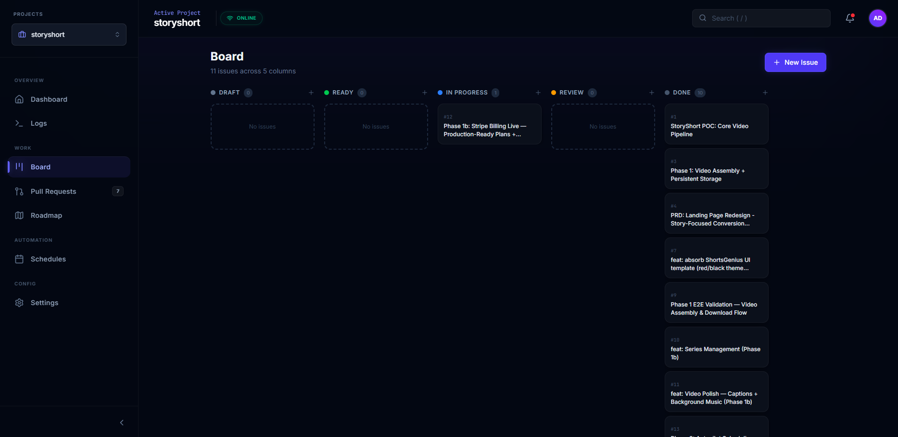
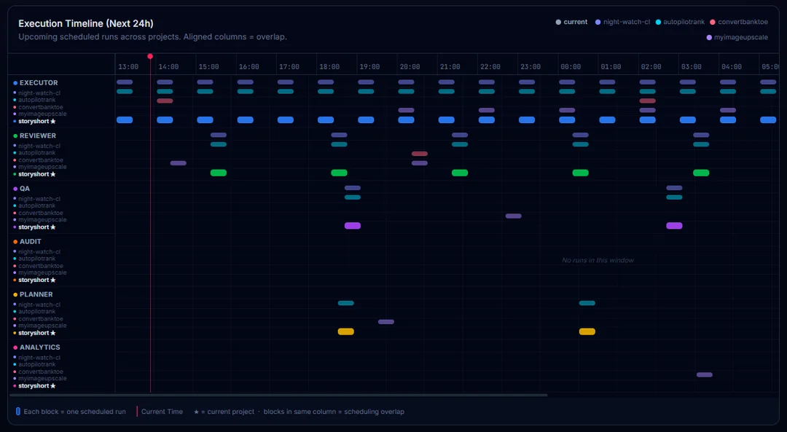

# Night Watch CLI

[](https://www.npmjs.com/package/%40jonit-dev%2Fnight-watch-cli)
[](https://opensource.org/licenses/MIT)
[](https://nodejs.org/)
[](https://nightwatchcli.com/)
[](https://discord.gg/maCPEJzPXa)

**Overnight PRD execution for AI-native devs and small teams**


Night Watch is an async execution layer for well-scoped engineering work. It takes PRDs or queued board items, runs Claude CLI or Codex in isolated git worktrees, and opens pull requests while you're offline.

Think of it as a repo night shift: you define the work during the day, Night Watch executes the queue overnight, and you wake up to PRs, review fixes, QA output, and audit results.

Night Watch is built for AI-native solo developers, maintainers, and small teams that already work from specs. It is not trying to replace every engineering workflow or turn software delivery into a hands-off black box.

---

## Table of Contents

- [Quick Start](#quick-start)
- [5-Minute Walkthrough](#5-minute-walkthrough)
- [Who It's For](#who-its-for)
- [Supported Providers](#supported-providers)
- [Using GLM-5 or Custom Endpoints](#using-glm-5-or-custom-endpoints)
- [Installation](#installation)
- [Documentation](#documentation)
- [License](#license)

---

## Quick Start

```bash
# 1. Install globally
npm install -g @jonit-dev/night-watch-cli

# 2. Initialize in your project
cd your-project
night-watch init

# 3. Check provider detection
night-watch run --dry-run

# 4. Add a well-scoped ticket (board mode) or PRD (file mode)
night-watch board create-prd "Implement feature X" --priority P1
# OR: echo "# My First PRD\n\nImplement feature X..." > docs/prds/my-feature.md

# 5. Run or install cron
night-watch run           # Run once
night-watch install       # Setup automated cron
```

---

## 5-Minute Walkthrough

New to Night Watch? Follow our [**5-Minute Walkthrough**](docs/walkthrough.md) to go from zero to your first AI-generated PR.

### Board View

Queue work as GitHub issues and track them through Draft → Ready → In Progress → Review → Done.



### Execution Timeline

See all scheduled agent runs across your projects at a glance.



```bash
# Quick start
npm install -g @jonit-dev/night-watch-cli
cd your-project
night-watch init
night-watch doctor
echo "# My First PRD\n\n## Problem\n..." > docs/prds/01-my-feature.md
night-watch run
```

---

## Who It's For

Night Watch is strongest when:

- You already use structured specs, PRDs, or queued board items
- You want async execution, not another pair-programming UI
- Your work can be broken into small, reviewable pull requests
- You care about overnight throughput on bounded tasks like maintenance, review fixes, QA, and backlog chores

Night Watch is a weaker fit when:

- Work starts vague and gets clarified only during implementation
- Your team is not comfortable reviewing AI-generated pull requests
- You want a general-purpose AI coding assistant rather than a queue-based execution system

---

## Supported Providers

| Provider | CLI Command | Auto-Mode Flag                   | Slash Commands       |
| -------- | ----------- | -------------------------------- | -------------------- |
| `claude` | `claude`    | `--dangerously-skip-permissions` | `-p "/command-name"` |
| `codex`  | `codex`     | `--yolo`                         | `--prompt "text"`    |

- Default provider is `claude`
- Change with `--provider codex` flag or `"provider": "codex"` in config

---

## Using GLM-5 or Custom Endpoints

Night Watch supports passing custom environment variables to the provider CLI via the `providerEnv` config field. This lets you point the Claude CLI at any Anthropic-compatible endpoint — including **GLM-5**.

Add `providerEnv` to your `night-watch.config.json`:

```json
{
  "provider": "claude",
  "providerEnv": {
    "ANTHROPIC_API_KEY": "your-glm5-api-key",
    "ANTHROPIC_BASE_URL": "https://your-glm5-endpoint.example.com"
  }
}
```

These variables are:

- **Injected into the provider CLI process** at runtime (`night-watch run`, `night-watch review`)
- **Exported in cron entries** when you run `night-watch install`, so automated runs also pick them up
- **Visible in `--dry-run` output** for easy debugging

### Common Use Cases

| Use Case                  | Environment Variables                     |
| ------------------------- | ----------------------------------------- |
| GLM-5 via custom endpoint | `ANTHROPIC_API_KEY`, `ANTHROPIC_BASE_URL` |
| Proxy / VPN routing       | `HTTPS_PROXY`, `HTTP_PROXY`               |
| Custom model selection    | Any provider-specific env var             |

See [Configuration > Provider Environment](docs/configuration.md#provider-environment-providerenv) for full details.

---

## Installation

### npm (Recommended)

```bash
npm install -g @jonit-dev/night-watch-cli
```

### npx (No install)

```bash
npx @jonit-dev/night-watch-cli init
```

### From Source

```bash
git clone https://github.com/jonit-dev/night-watch-cli.git
cd night-watch-cli
yarn install && yarn build && npm link
```

---

## Documentation

Full documentation is available at **[nightwatchcli.com](https://nightwatchcli.com/)**.

### Getting Started

| Document                                    | Description                             |
| ------------------------------------------- | --------------------------------------- |
| [5-Minute Walkthrough](docs/walkthrough.md) | From zero to your first AI-generated PR |
| [Troubleshooting](docs/troubleshooting.md)  | Common errors and how to fix them       |
| [Commands Reference](docs/commands.md)      | All CLI commands and their options      |

### How-To Guides

| Document                                | Description                                                             |
| --------------------------------------- | ----------------------------------------------------------------------- |
| [Ticket/PRD Format](docs/prd-format.md) | Board tickets and PRD files, dependencies, lifecycle                    |
| [Configuration](docs/configuration.md)  | Config file, env vars, CLI flags, providerEnv, notifications, schedules |
| [Web UI](docs/WEB-UI.md)                | Dashboard pages and interface reference                                 |

### Architecture & Deep Dives

| Document                                                 | Description                                               |
| -------------------------------------------------------- | --------------------------------------------------------- |
| [Architecture Overview](docs/architecture-overview.md)   | System design, execution flows, data persistence          |
| [CLI Package](docs/cli-package.md)                       | Command structure and integration                         |
| [Core Package](docs/core-package.md)                     | Domain logic, DI container, repositories, config loader   |
| [Server & API](docs/server-api.md)                       | REST endpoints, SSE, middleware, multi-project mode       |
| [Scheduler Architecture](docs/scheduler-architecture.md) | Global job queue, dispatch modes, cross-project balancing |
| [Build Pipeline](docs/build-pipeline.md)                 | TypeScript → esbuild bundling, CI/CD, publishing          |
| [Bash Scripts](docs/bash-scripts.md)                     | Cron execution scripts and worktree management            |

### Developer Guides

| Document                                 | Description                                   |
| ---------------------------------------- | --------------------------------------------- |
| [Dev Onboarding](docs/DEV-ONBOARDING.md) | Getting started as a contributor              |
| [Local Testing](docs/local-testing.md)   | Test CLI locally without publishing           |
| [Contributing](docs/contributing.md)     | Development workflow, conventions, PR process |

### Analysis

| Document                                                 | Description                                      |
| -------------------------------------------------------- | ------------------------------------------------ |
| [AI-Driven Org Analysis](docs/AI-DRIVEN-ORG-ANALYSIS.md) | How Night Watch maps to AI-driven org principles |

---

## Inspiration

- [Night Shift by Jamon Holmgren](https://jamon.dev/night-shift) — An agentic day/night workflow with persona-based review loops, documentation-as-routing, and structured 16-step agent execution. Many ideas here influenced Night Watch's design.

---

## License

MIT License - see [LICENSE](LICENSE) for details.
