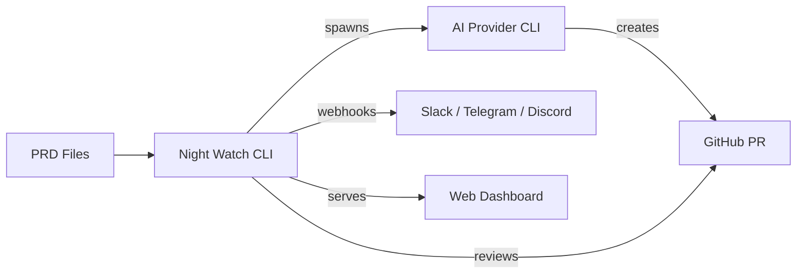
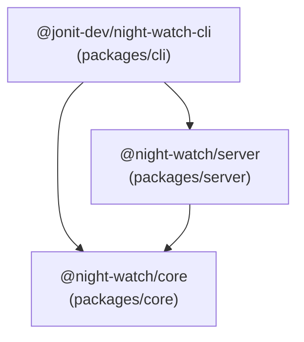
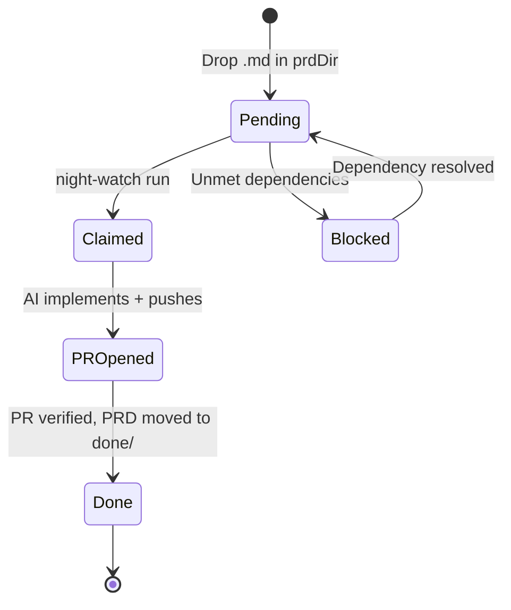

# Developer Onboarding Guide

Welcome to Night Watch CLI. This guide will get you from zero to productive.

---

## What is Night Watch?

Night Watch is an autonomous PRD executor. It reads markdown PRD files, hands them to an AI provider CLI (Claude or Codex), opens pull requests, reviews them, and fixes CI failures — all on a cron schedule. A web dashboard and REST API provide visibility and control. Webhook notifications go to Slack, Telegram, or Discord.



---

## Prerequisites

| Tool                | Version   | Check                                   |
| ------------------- | --------- | --------------------------------------- |
| Node.js             | >= 22.0.0 | `node -v`                               |
| Yarn                | 1.22.x    | `yarn -v`                               |
| Git                 | any       | `git --version`                         |
| GitHub CLI          | any       | `gh auth status`                        |
| Claude CLI or Codex | latest    | `claude --version` or `codex --version` |

---

## Quick Setup

```bash
# 1. Clone and install
git clone https://github.com/jonit-dev/night-watch-cli.git
cd night-watch-cli
yarn install

# 2. Build all packages
yarn build

# 3. Run type-check + lint
yarn verify

# 4. Run tests
yarn test

# 5. Link CLI globally for local testing
yarn local
```

After `yarn local`, you can run `night-watch` from any directory.

---

## Monorepo Layout

```
night-watch-cli/
├── packages/
│   ├── core/      # Domain logic, storage, config, DI — private
│   ├── cli/       # Commander.js entry point — published to npm
│   └── server/    # Express REST API + SSE — private
├── web/           # React + Vite SPA (standalone build → web/dist/)
├── scripts/       # Bash scripts for cron execution
├── templates/     # PRD templates
├── docs/          # Documentation + PRDs
├── turbo.json     # Build orchestration
└── package.json   # Workspace root
```

### Package Dependency Graph



Only `@jonit-dev/night-watch-cli` is published to npm. `core` and `server` are private workspace packages inlined at build time.

---

## Key Concepts

### 1. PRD Lifecycle

A PRD (Product Requirements Document) is a markdown file that Night Watch picks up and implements autonomously.



PRDs live in `docs/PRDs/night-watch/`. Completed PRDs move to `docs/PRDs/night-watch/done/`.

### 2. Configuration Cascade

```
Hardcoded Defaults → Config File → Environment Variables → CLI Flags
     (lowest)                                            (highest)
```

Config file: `night-watch.config.json` in project root. All env vars use the `NW_` prefix.

### 3. Provider Abstraction

Night Watch doesn't implement AI logic. It spawns an AI provider CLI (Claude or Codex) in a git worktree with a PRD as the prompt. The provider does the coding.

### 4. Dependency Injection

The project uses [tsyringe](https://github.com/microsoft/tsyringe) for DI. The composition root is at `packages/core/src/di/container.ts`. All repositories are registered as singletons.

### 5. Repository Pattern

All database access goes through repository interfaces. SQL is confined to `packages/core/src/storage/`. An ESLint rule enforces this boundary.

---

## Development Workflow

### Daily Commands

```bash
# Type-check + lint (fast, no emit)
yarn verify

# Run all tests
yarn test

# Run tests for a specific package
yarn vitest run packages/core/src/__tests__/

# Build everything
yarn build

# Dev mode (run CLI from source, no build needed)
yarn dev -- init
yarn dev -- run --dry-run

# Start web UI in dev mode (API + Vite)
yarn dev:web
```

### After Making Changes

Always run `yarn verify` and related tests before committing. The pre-commit hook runs ESLint + Prettier via lint-staged.

### Testing

- **Framework**: Vitest with `forks` pool (process isolation)
- **Location**: `src/__tests__/` in each package
- **Test files**: `*.test.ts`
- **DI in tests**: Import `reflect-metadata` first, call `container.reset()` between tests
- **DB isolation**: Use temp directories, clean up in `afterEach`

```typescript
import 'reflect-metadata';
import { container } from 'tsyringe';

beforeEach(() => {
  container.reset();
});
```

---

## Code Conventions

### File Naming

- **kebab-case** everywhere: `agent-persona.repository.ts`, `soul-compiler.ts`
- Tests: `*.test.ts` in `src/__tests__/`

### TypeScript

- **Strict mode** enabled
- Use `interface` (not `type`) for object shapes — enforced by ESLint
- Prefix interfaces with `I`: `IAgentPersona`, `INightWatchConfig`
- Unused vars: prefix with `_` to suppress warnings
- Prefer const arrays over enums: `['claude', 'codex'] as const`

### Imports

- Use `@night-watch/core/module.js` for cross-package imports
- Use `@/*` path alias for core internals; single-level `./` is fine
- Always use `.js` extensions (compiled output), never `.ts`
- `sort-imports` enforced (sort specifiers, not declarations)
- Separate `export type { }` from value exports

### Constants

- Centralized in `constants.ts`
- Prefix with `DEFAULT_*` or `VALID_*`

### DI

- `@injectable()` on classes
- `@inject('Token')` for non-class dependencies
- Import `reflect-metadata` only at entrypoints (`cli.ts`, test setup)

---

## Architecture Deep Dives

For detailed technical docs on each subsystem:

| Document                                          | What it covers                                      |
| ------------------------------------------------- | --------------------------------------------------- |
| [Core Package](core-package.md)                   | DI container, repositories, config loader, types    |
| [CLI Package](cli-package.md)                     | All 24 commands, command pattern, script execution  |
| [Server & API](server-api.md)                     | REST endpoints, SSE, middleware, multi-project mode |
| [Build Pipeline](build-pipeline.md)               | TypeScript → esbuild bundling, CI/CD, publishing    |
| [Persona & Memory](persona-memory-system.md)      | Soul compiler, two-tier memory, reflection, avatars |
| [Architecture Overview](architecture-overview.md) | High-level diagrams and flows                       |
| [Configuration](configuration.md)                 | All config fields, env vars, webhooks               |
| [Commands Reference](commands.md)                 | CLI command usage examples                          |
| [Web UI](WEB-UI.md)                               | Dashboard pages and UI spec                         |

---

## Common Tasks

### Add a New CLI Command

1. Create `packages/cli/src/commands/my-command.ts`
2. Export a function `myCommand(program: Command)` that registers the subcommand
3. Import and call it in `packages/cli/src/cli.ts`
4. Add tests in `packages/cli/src/__tests__/`

### Add a New Repository

1. Define the interface in `packages/core/src/storage/repositories/interfaces.ts`
2. Implement in `packages/core/src/storage/repositories/sqlite/`
3. Add migration in `packages/core/src/storage/sqlite/migrations.ts`
4. Register in `packages/core/src/di/container.ts`
5. Add to `IRepositories` in `packages/core/src/storage/repositories/index.ts`

### Add a New API Endpoint

1. Create or edit a route file in `packages/server/src/routes/`
2. Wire it in `packages/server/src/index.ts` (both `createApp` and `createGlobalApp`)
3. Add corresponding API function in `web/api.ts`

### Add a New Agent Persona

Default personas are seeded from `packages/core/src/storage/repositories/sqlite/agent-persona.defaults.ts`. You can also create personas via the REST API (`POST /api/agents`) or the web UI.

### Modify the Build

The CLI build pipeline is:

```
tsc --build → tsc-alias → node build.mjs (esbuild)
```

The esbuild config lives in `packages/cli/build.mjs`. Workspace packages are inlined; npm deps stay external.

---

## Environment Variables Reference

Night Watch env vars all use the `NW_` prefix:

| Variable                    | Purpose                          |
| --------------------------- | -------------------------------- |
| `NW_PROVIDER`               | AI provider: `claude` or `codex` |
| `NW_PRD_DIR`                | PRD directory path               |
| `NW_MAX_RUNTIME`            | Max execution time (seconds)     |
| `NW_DEFAULT_BRANCH`         | Git default branch               |
| `NW_CRON_SCHEDULE`          | Executor cron expression         |
| `NW_REVIEWER_SCHEDULE`      | Reviewer cron expression         |
| `NW_NOTIFICATIONS`          | Webhook config (JSON string)     |
| `NW_FALLBACK_ON_RATE_LIMIT` | Enable rate-limit fallback       |
| `NW_CLAUDE_MODEL`           | Claude model: `sonnet` or `opus` |

See [configuration.md](configuration.md) for the full list.

---

## Troubleshooting

### Build Fails with Stale Types

Delete incremental caches and rebuild:

```bash
find . -name '*.tsbuildinfo' -delete
yarn build
```

### Tests Fail with DI Errors

Make sure `reflect-metadata` is imported at the top of your test file and `container.reset()` is called between tests.

### `import.meta.url` Points to Wrong Location

After esbuild bundling, `import.meta.url` resolves to the bundle file (`dist/cli.js`), not the original source. Use directory traversal from the bundle location instead of relative paths.

### Web UI Not Loading

The server serves `web/dist/` as static files. Make sure the web UI is built:

```bash
cd web && yarn build
```

Or use dev mode: `yarn dev:web` (runs Vite dev server on :7576 proxying API to :7575).

---

## Useful Aliases

```bash
# Add to your shell profile
alias nw="night-watch"
alias nw-dry="night-watch run --dry-run"
alias nw-status="night-watch status --verbose"
alias nw-dev="cd ~/projects/night-watch-cli && yarn dev --"
```

---

## Further Reading

- [PRD Format](prd-format.md) — How to write PRDs
- [Local Testing](local-testing.md) — Testing the CLI locally
- [Troubleshooting](troubleshooting.md) — Common issues and fixes
