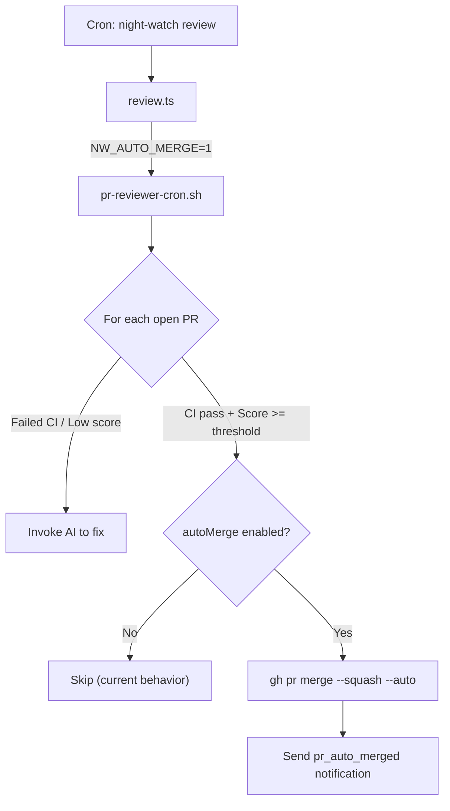
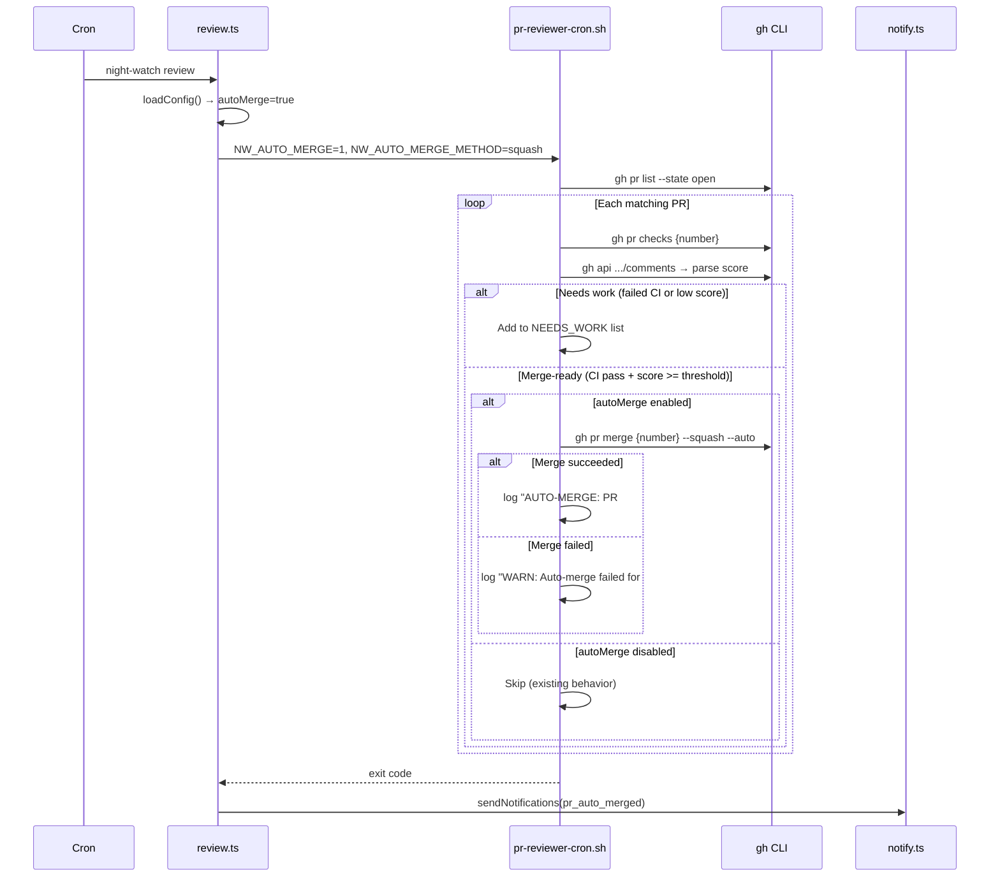

# PRD: PR Auto-Merge

**Depends on:** `03-day-to-day-operations.md`, `04-notification-webhooks.md`

**Complexity: 5 → MEDIUM mode**
- Touches 8 files (+2)
- No new system from scratch (extends existing reviewer flow)
- Some concurrency awareness (merge race conditions) (+1)
- Single package
- No database changes
- External API integration (gh merge) (+1)

---

## 1. Context

**Problem:** Night Watch creates PRs and reviews them, but the final merge step still requires human intervention. When a PR hits the review score threshold and CI is green, there's no reason it can't be merged automatically — completing a fully hands-off PRD-to-merge pipeline.

**Files Analyzed:**
- `scripts/night-watch-pr-reviewer-cron.sh` — lines 82-116: iterates open PRs, checks CI and review score, triggers reviewer for PRs needing work. This is where auto-merge logic would naturally fit — after confirming a PR is "done"
- `scripts/night-watch-cron.sh` — lines 142-154: after PR is opened, marks PRD done. Auto-merge is a separate concern from PRD execution
- `src/types.ts` — `INightWatchConfig` interface needs `autoMerge` field
- `src/config.ts` — config loading cascade (defaults → file → env vars)
- `src/constants.ts` — needs `DEFAULT_AUTO_MERGE = false`
- `src/commands/review.ts` — `buildEnvVars()` passes config to bash scripts
- `src/commands/status.ts` — could show auto-merge status
- `src/utils/notify.ts` — (from PRD 04) should send notification on auto-merge

**Current Behavior:**
- PR reviewer checks for failed CI and low review scores, then invokes the AI provider to fix issues
- When a PR passes all checks, the reviewer simply skips it ("All open PRs have passing CI and review score >= threshold")
- PRD is only moved to `done/` when the cron executor detects an open PR was created — NOT on merge
- No merge automation exists — all merges are manual

### Integration Points Checklist

- **Entry point:** Auto-merge triggers from the PR reviewer bash script, after it confirms a PR has passing CI + score >= threshold
- **Caller files:** `scripts/night-watch-pr-reviewer-cron.sh` (main logic), `src/commands/review.ts` (passes config), `src/config.ts` (loads setting)
- **Registration:** No new commands — extends existing `review` flow
- **User-facing:** YES — PRs get merged automatically (when enabled)
- **Full user flow:**
  1. User sets `"autoMerge": true` in `night-watch.config.json`
  2. Cron triggers `night-watch review`
  3. Reviewer checks open PRs
  4. For PRs with passing CI AND review score >= minReviewScore: auto-merge via `gh pr merge`
  5. (If notifications configured): sends `pr_auto_merged` notification
  6. User sees merged PR in GitHub

---

## 2. Solution

**Approach:**
- Add `autoMerge: boolean` to config (default: `false` — **off by default**)
- Add `autoMergeMethod: 'squash' | 'merge' | 'rebase'` to config (default: `'squash'`)
- Pass `NW_AUTO_MERGE` and `NW_AUTO_MERGE_METHOD` env vars to bash scripts
- In the PR reviewer bash script, after the existing PR iteration loop, add a second pass that checks for merge-ready PRs
- Use `gh pr merge --squash --auto` for the actual merge — `--auto` enables GitHub's auto-merge which waits for required checks
- Add `pr_auto_merged` notification event type for webhook integration (from PRD 04)

**Architecture Diagram:**



**Key Decisions:**
- **Off by default** — `autoMerge: false`. Users must explicitly opt in. This is critical for safety — auto-merging code to main without human review is a significant decision
- Use `gh pr merge --auto` instead of immediate merge — this respects GitHub branch protection rules (required reviews, status checks). If branch protection requires human approval, `--auto` queues the merge for when checks pass rather than bypassing them
- `--squash` as default merge method — keeps history clean. Configurable via `autoMergeMethod`
- Auto-merge only targets PRs matching `branchPatterns` — same filter as the reviewer
- Add `--auto-merge` CLI flag to `review` command to enable for a single run without changing config
- Notification on auto-merge uses existing webhook infrastructure (PRD 04) — if webhooks not configured, merge still happens silently

**Data Changes:**

New config fields in `night-watch.config.json`:
```json
{
  "autoMerge": false,
  "autoMergeMethod": "squash"
}
```

---

## 3. Sequence Flow



---

## 4. Execution Phases

### Phase 1: Add autoMerge config fields — Config system supports auto-merge settings

**Files (5):**
- `src/types.ts` — add `autoMerge` and `autoMergeMethod` to `INightWatchConfig`
- `src/constants.ts` — add defaults
- `src/config.ts` — load and merge new fields
- `templates/night-watch.config.json` — add new fields to template
- `src/__tests__/config.test.ts` — test new config fields

**Implementation:**
- [ ] Add to `src/types.ts`:
  ```typescript
  export type MergeMethod = "squash" | "merge" | "rebase";
  ```
  Add to `INightWatchConfig`:
  ```typescript
  /** Enable automatic merging of PRs that pass CI and review score threshold */
  autoMerge: boolean;

  /** Git merge method for auto-merge */
  autoMergeMethod: MergeMethod;
  ```
- [ ] Add to `src/constants.ts`:
  ```typescript
  export const DEFAULT_AUTO_MERGE = false;
  export const DEFAULT_AUTO_MERGE_METHOD: MergeMethod = "squash";
  export const VALID_MERGE_METHODS: MergeMethod[] = ["squash", "merge", "rebase"];
  ```
- [ ] Update `src/config.ts`:
  - Import new defaults
  - Add to `getDefaultConfig()`
  - Add to `normalizeConfig()`: `normalized.autoMerge = readBoolean(rawConfig.autoMerge)` and `normalized.autoMergeMethod = readString(rawConfig.autoMergeMethod)` with validation
  - Add to both merge blocks in `mergeConfigs()`
  - Add `NW_AUTO_MERGE` env var (boolean) and `NW_AUTO_MERGE_METHOD` env var (validated string)
- [ ] Update `templates/night-watch.config.json` — add `"autoMerge": false` and `"autoMergeMethod": "squash"`
- [ ] Write config tests

**Tests Required:**
| Test File | Test Name | Assertion |
|-----------|-----------|-----------|
| `src/__tests__/config.test.ts` | `should default autoMerge to false` | `config.autoMerge === false` |
| `src/__tests__/config.test.ts` | `should default autoMergeMethod to squash` | `config.autoMergeMethod === 'squash'` |
| `src/__tests__/config.test.ts` | `should load autoMerge from config file` | `true` when set in file |
| `src/__tests__/config.test.ts` | `should handle NW_AUTO_MERGE env var` | env override works |
| `src/__tests__/config.test.ts` | `should handle NW_AUTO_MERGE_METHOD env var` | validates against allowed values |
| `src/__tests__/config.test.ts` | `should reject invalid merge method` | falls back to default |

**Verification:**
- `npm test` passes
- Config with `autoMerge: true` loads correctly
- Invalid `autoMergeMethod` values fall back to `"squash"`

---

### Phase 2: Pass auto-merge config to bash and implement merge logic — PR reviewer auto-merges eligible PRs

**Files (4):**
- `src/commands/review.ts` — pass `NW_AUTO_MERGE` and `NW_AUTO_MERGE_METHOD` env vars, add `--auto-merge` CLI flag
- `scripts/night-watch-pr-reviewer-cron.sh` — add auto-merge logic after PR review loop
- `src/__tests__/commands/review.test.ts` — test env var passing
- `src/__tests__/commands/review.test.ts` — test `--auto-merge` flag

**Implementation:**
- [ ] In `review.ts` `buildEnvVars()`, add:
  ```typescript
  if (config.autoMerge) {
    env.NW_AUTO_MERGE = "1";
  }
  env.NW_AUTO_MERGE_METHOD = config.autoMergeMethod;
  ```
- [ ] In `review.ts` `applyCliOverrides()`, add:
  ```typescript
  if (options.autoMerge !== undefined) {
    overridden.autoMerge = options.autoMerge;
  }
  ```
- [ ] Add `--auto-merge` flag to review command:
  ```typescript
  .option('--auto-merge', 'Enable auto-merge for this run')
  ```
- [ ] In `scripts/night-watch-pr-reviewer-cron.sh`, after the existing PR review loop (after line 121), add auto-merge pass:
  ```bash
  # ── Auto-merge eligible PRs ───────────────────────────────
  if [ "${NW_AUTO_MERGE:-0}" = "1" ]; then
    AUTO_MERGE_METHOD="${NW_AUTO_MERGE_METHOD:-squash}"

    while IFS=$'\t' read -r pr_number pr_branch; do
      [ -z "${pr_number}" ] || [ -z "${pr_branch}" ] && continue
      printf '%s\n' "${pr_branch}" | grep -Eq "${BRANCH_REGEX}" || continue

      # Check CI status
      FAILED=$(gh pr checks "${pr_number}" 2>/dev/null | grep -ci 'fail' || true)
      [ "${FAILED}" -gt 0 ] && continue

      # Check review score
      ALL_COMMENTS=$( ... )  # Same logic as existing score check
      SCORE=$(echo "${ALL_COMMENTS}" | grep -oP ... || echo "")
      [ -z "${SCORE}" ] && continue
      [ "${SCORE}" -lt "${MIN_REVIEW_SCORE}" ] && continue

      # PR is merge-ready
      log "AUTO-MERGE: PR #${pr_number} (${pr_branch}) — score ${SCORE}/100, CI passing"
      if gh pr merge "${pr_number}" --"${AUTO_MERGE_METHOD}" --auto --delete-branch 2>>"${LOG_FILE}"; then
        log "AUTO-MERGE: Successfully queued merge for PR #${pr_number}"
      else
        log "WARN: Auto-merge failed for PR #${pr_number}"
      fi
    done < <(gh pr list --state open --json number,headRefName --jq '.[] | [.number, .headRefName] | @tsv' 2>/dev/null || true)
  fi
  ```
- [ ] Dry-run mode: show auto-merge status in diagnostic output
- [ ] Update review.ts dry-run display to show `Auto-merge: Enabled/Disabled` and `Merge Method: squash/merge/rebase`

**Tests Required:**
| Test File | Test Name | Assertion |
|-----------|-----------|-----------|
| `src/__tests__/commands/review.test.ts` | `should pass NW_AUTO_MERGE when enabled` | env vars include NW_AUTO_MERGE=1 |
| `src/__tests__/commands/review.test.ts` | `should not pass NW_AUTO_MERGE when disabled` | env vars don't include NW_AUTO_MERGE |
| `src/__tests__/commands/review.test.ts` | `should pass NW_AUTO_MERGE_METHOD` | env vars include method |
| `src/__tests__/commands/review.test.ts` | `should show auto-merge in dry-run` | output contains "Auto-merge" |

**Verification:**
- `npx tsx src/cli.ts review --dry-run` shows `Auto-merge: Disabled` by default
- `npx tsx src/cli.ts review --dry-run --auto-merge` shows `Auto-merge: Enabled`
- With `autoMerge: true` in config: `review --dry-run` shows `Auto-merge: Enabled, Method: squash`
- `npm test` passes

---

### Phase 3: Add auto-merge notification event and status display — Users are notified of auto-merges

**Files (4):**
- `src/types.ts` — add `pr_auto_merged` to `NotificationEvent` type (if notification types exist from PRD 04)
- `src/commands/status.ts` — show auto-merge config in status dashboard
- `src/commands/run.ts` — show auto-merge status in dry-run for context
- `src/__tests__/commands/status.test.ts` — verify auto-merge appears in status

**Implementation:**
- [ ] If `NotificationEvent` type exists (from PRD 04), add `'pr_auto_merged'` to the union type. If PRD 04 is not yet implemented, skip this — the notification integration can be added later
- [ ] In `status.ts`, add auto-merge status to the Configuration table:
  ```typescript
  configTable.push(["Auto-merge", config.autoMerge ? `Enabled (${config.autoMergeMethod})` : "Disabled"]);
  ```
- [ ] In `run.ts` dry-run, add to config table for full context:
  ```typescript
  configTable.push(["Auto-merge", config.autoMerge ? `Enabled (${config.autoMergeMethod})` : "Disabled"]);
  ```
- [ ] In status `--json` output, include `autoMerge` and `autoMergeMethod` fields

**Tests Required:**
| Test File | Test Name | Assertion |
|-----------|-----------|-----------|
| `src/__tests__/commands/status.test.ts` | `should show auto-merge in status` | output contains "Auto-merge" |
| `src/__tests__/commands/status.test.ts` | `--json should include autoMerge field` | JSON has autoMerge key |

**Verification:**
- `npx tsx src/cli.ts status` shows "Auto-merge: Disabled" in config section
- With `autoMerge: true`: status shows "Auto-merge: Enabled (squash)"
- `npm test` passes

---

## 5. Acceptance Criteria

- [ ] `autoMerge` config field defaults to `false` (OFF by default)
- [ ] `autoMergeMethod` config field defaults to `"squash"`, accepts `"squash"`, `"merge"`, `"rebase"`
- [ ] `NW_AUTO_MERGE` and `NW_AUTO_MERGE_METHOD` env vars override config
- [ ] `night-watch review --auto-merge` flag enables auto-merge for a single run
- [ ] PR reviewer auto-merges PRs with passing CI AND review score >= `minReviewScore`
- [ ] Uses `gh pr merge --auto --delete-branch` (respects GitHub branch protection)
- [ ] Auto-merge failures are logged but don't fail the reviewer run
- [ ] `night-watch status` shows auto-merge configuration
- [ ] `night-watch review --dry-run` shows auto-merge status
- [ ] All tests pass (`npm test`)
- [ ] No new npm dependencies
