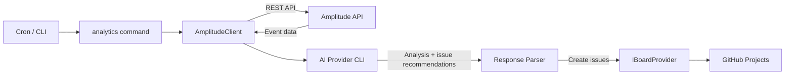
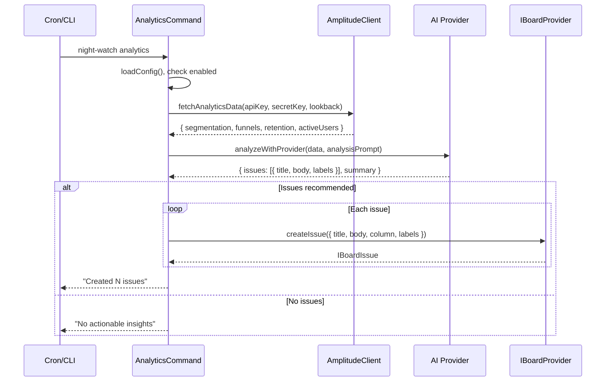

# PRD: Analytics Job (Amplitude Integration)

**Complexity: 8 → HIGH mode**

| Score | Reason                                         |
| ----- | ---------------------------------------------- |
| +3    | Touches 10+ files                              |
| +2    | New system/module from scratch                 |
| +2    | Multi-package changes (core, cli, server, web) |
| +1    | External API integration (Amplitude)           |

---

## 1. Context

**Problem:** Night Watch has no way to react to product analytics signals. Teams must manually check Amplitude, interpret trends, and create issues — the analytics job automates this loop.

**Files Analyzed:**

- `packages/core/src/types.ts` — `JobType`, `INightWatchConfig`, `IAuditConfig`
- `packages/core/src/constants.ts` — defaults, `VALID_JOB_TYPES`, `DEFAULT_QUEUE_PRIORITY`
- `packages/core/src/config-normalize.ts` — normalization pattern
- `packages/core/src/config-env.ts` — env override pattern
- `packages/core/src/utils/scheduling.ts` — `isJobTypeEnabled()`
- `packages/core/src/utils/job-queue.ts` — `getLockPathForJob()`
- `packages/core/src/utils/status-data.ts` — lock paths
- `packages/core/src/board/types.ts` — `IBoardProvider`, `ICreateIssueInput`, `BoardColumnName`
- `packages/core/src/board/factory.ts` — `createBoardProvider()`
- `packages/cli/src/commands/audit.ts` — canonical job command pattern
- `packages/cli/src/commands/install.ts` — cron install pattern
- `packages/cli/src/cli.ts` — command registration
- `packages/server/src/routes/action.routes.ts` — action endpoints
- `packages/server/src/routes/status.routes.ts` — schedule info
- `packages/server/src/routes/config.routes.ts` — config validation
- `web/pages/Settings.tsx` — settings form pattern
- `web/pages/Dashboard.tsx` — dashboard job rows
- `web/api.ts` — API client

**Current Behavior:**

- Five job types exist: `executor`, `reviewer`, `qa`, `audit`, `slicer`
- Each follows an identical pattern: config → env vars → bash script → AI provider
- The board provider (`IBoardProvider.createIssue()`) already supports placing issues in a `Draft` column
- API keys are stored in `providerEnv` (a `Record<string, string>` in `night-watch.config.json`)
- No Amplitude integration exists anywhere in the codebase

---

## 2. Solution

**Approach:**

- Add `'analytics'` as a new `JobType` following the exact same pattern as `audit`
- Create an Amplitude API client in `packages/core` that fetches broad event data (segmentation, funnels, retention, active users) using the Amplitude Export/Dashboard REST API
- The analytics job is **NOT** a bash-script-based AI job like executor/reviewer. It is a **TypeScript-native job** that:
  1. Fetches data from Amplitude APIs
  2. Passes the data to the configured AI provider (via the existing provider CLI) for analysis
  3. The AI decides whether insights warrant GitHub issues
  4. Creates issues on the board in the `Draft` column (configurable)
- Amplitude API Key + Secret Key stored in `providerEnv` as `AMPLITUDE_API_KEY` and `AMPLITUDE_SECRET_KEY`
- **Disabled by default** (`enabled: false`). Can only be enabled if both `AMPLITUDE_API_KEY` and `AMPLITUDE_SECRET_KEY` are set in `providerEnv`. The Settings UI must validate this: if the user tries to toggle analytics ON without configured keys, show an inline error and prevent the toggle.
- Full config block `IAnalyticsConfig` for schedule, enabled, maxRuntime, lookback window, target column, and analysis prompt

**Architecture Diagram:**



**Key Decisions:**

- TypeScript-native execution (no bash script) — Amplitude data fetching + AI analysis is better handled in TS than shell
- Uses existing `IBoardProvider.createIssue()` for issue creation — no new GitHub integration needed
- AI provider invoked via `executeScriptWithOutput()` with a prompt containing the Amplitude data
- Default target column: `Draft` (configurable to any `BoardColumnName`)
- Lookback window configurable (default: 7 days)
- Custom analysis prompt configurable (default provided)
- **Gating rule:** CLI command (`night-watch analytics`) must also validate that Amplitude keys exist in config before running; exit with a clear error message if missing

**Data Changes:** None (no new DB tables or migrations)

---

## 3. Sequence Flow



---

## 4. Integration Points Checklist

```
**How will this feature be reached?**
- [x] Entry point: `night-watch analytics` CLI command + cron schedule
- [x] Caller: cron job via `packages/cli/src/commands/analytics.ts`
- [x] Registration: command registered in `cli.ts`, cron entry in `install.ts`

**Is this user-facing?**
- [x] YES → Settings UI section for analytics config (enable/disable, schedule, Amplitude keys)

**Full user flow:**
1. User configures Amplitude API keys + enables analytics in Settings UI or config JSON
2. Runs `night-watch install` to set up cron (or `night-watch analytics` manually)
3. Job fetches Amplitude data, AI analyzes, creates Draft issues on board
4. User sees new issues in Board UI / GitHub Projects Draft column
```

---

## 5. Execution Phases

### Phase 1: Core Types & Config — "Analytics job type is configurable"

**Files (5):**

- `packages/core/src/types.ts` — Add `'analytics'` to `JobType`, add `IAnalyticsConfig`, add `analytics` field to `INightWatchConfig` and `IJobProviders`
- `packages/core/src/constants.ts` — Add `DEFAULT_ANALYTICS_*` constants, update `VALID_JOB_TYPES`, `DEFAULT_QUEUE_PRIORITY`, `LOG_FILE_NAMES`
- `packages/core/src/config.ts` — Add `analytics` to `getDefaultConfig()`
- `packages/core/src/config-normalize.ts` — Add `rawConfig.analytics` normalization block (follow `rawAudit` pattern)
- `packages/core/src/config-env.ts` — Add `NW_ANALYTICS_*` env overrides

**Implementation:**

- [ ] Add `'analytics'` to the `JobType` union type
- [ ] Add `analytics?: Provider` to `IJobProviders`
- [ ] Define `IAnalyticsConfig`:
  ```typescript
  export interface IAnalyticsConfig {
    enabled: boolean;
    schedule: string;
    maxRuntime: number;
    /** Number of days to look back when fetching Amplitude data */
    lookbackDays: number;
    /** Board column to place created issues in */
    targetColumn: BoardColumnName;
    /** Custom prompt for the AI analysis (optional override) */
    analysisPrompt: string;
  }
  ```
- [ ] Add `analytics: IAnalyticsConfig` to `INightWatchConfig`
- [ ] Add defaults:
  - `DEFAULT_ANALYTICS_ENABLED = false` (opt-in)
  - `DEFAULT_ANALYTICS_SCHEDULE = '0 6 * * 1'` (weekly Monday 06:00)
  - `DEFAULT_ANALYTICS_MAX_RUNTIME = 900` (15 minutes)
  - `DEFAULT_ANALYTICS_LOOKBACK_DAYS = 7`
  - `DEFAULT_ANALYTICS_TARGET_COLUMN = 'Draft'`
  - `DEFAULT_ANALYTICS_PROMPT` — a sensible default analysis prompt
- [ ] Add `analytics: 10` to `DEFAULT_QUEUE_PRIORITY` (same as audit — low priority)
- [ ] Add `ANALYTICS_LOG_NAME = 'analytics'` and update `LOG_FILE_NAMES`
- [ ] Add normalization for `rawConfig.analytics` in `normalizeConfig()`
- [ ] Add `NW_ANALYTICS_ENABLED`, `NW_ANALYTICS_SCHEDULE`, `NW_ANALYTICS_MAX_RUNTIME`, `NW_ANALYTICS_LOOKBACK_DAYS` env overrides

**Tests Required:**

| Test File                                              | Test Name                                         | Assertion                                        |
| ------------------------------------------------------ | ------------------------------------------------- | ------------------------------------------------ |
| `packages/core/src/__tests__/config-normalize.test.ts` | `should normalize analytics config with defaults` | `expect(result.analytics.enabled).toBe(false)`   |
| `packages/core/src/__tests__/config-normalize.test.ts` | `should normalize partial analytics config`       | `expect(result.analytics.lookbackDays).toBe(14)` |
| `packages/core/src/__tests__/config-env.test.ts`       | `should override analytics config from env vars`  | `expect(result.analytics.enabled).toBe(true)`    |

**Verification Plan:**

1. **Unit Tests:** Config normalization and env override tests
2. **Evidence:** `yarn verify` passes, existing tests still pass

---

### Phase 2: Scheduling & Queue Wiring — "Analytics job can be scheduled and queued"

**Files (4):**

- `packages/core/src/utils/scheduling.ts` — Add `'analytics'` case to `isJobTypeEnabled()`
- `packages/core/src/utils/job-queue.ts` — Add `'analytics'` case to `getLockPathForJob()`
- `packages/core/src/utils/status-data.ts` — Add `analyticsLockPath()` function
- `packages/core/src/index.ts` — Export new analytics-related items (if any new files)

**Implementation:**

- [ ] Add `case 'analytics': return config.analytics.enabled;` to `isJobTypeEnabled()`
- [ ] Add `analyticsLockPath(projectPath)` to `status-data.ts` following the existing pattern
- [ ] Add `case 'analytics': return analyticsLockPath(projectPath);` to `getLockPathForJob()`
- [ ] Ensure `analytics` appears in any exhaustive switches/maps in job-queue.ts

**Tests Required:**

| Test File                                        | Test Name                                                                    | Assertion                                                   |
| ------------------------------------------------ | ---------------------------------------------------------------------------- | ----------------------------------------------------------- |
| `packages/core/src/__tests__/scheduling.test.ts` | `should report analytics as enabled when config.analytics.enabled is true`   | `expect(isJobTypeEnabled(config, 'analytics')).toBe(true)`  |
| `packages/core/src/__tests__/scheduling.test.ts` | `should report analytics as disabled when config.analytics.enabled is false` | `expect(isJobTypeEnabled(config, 'analytics')).toBe(false)` |

**Verification Plan:**

1. **Unit Tests:** scheduling enablement tests
2. **Evidence:** `yarn verify` passes

---

### Phase 3: Amplitude Client — "Amplitude data can be fetched"

**Files (2):**

- `packages/core/src/analytics/amplitude-client.ts` — **New file.** HTTP client for Amplitude Export/Dashboard REST API
- `packages/core/src/analytics/index.ts` — **New file.** Barrel export

**Implementation:**

- [ ] Create `AmplitudeClient` class (injectable) with methods:

  ```typescript
  export interface IAmplitudeData {
    activeUsers: unknown;
    eventSegmentation: unknown;
    retention: unknown;
    userSessions: unknown;
    fetchedAt: string;
    lookbackDays: number;
  }

  export async function fetchAmplitudeData(
    apiKey: string,
    secretKey: string,
    lookbackDays: number,
  ): Promise<IAmplitudeData>;
  ```

- [ ] Use Node.js `fetch` (available in Node 18+) with Basic auth (`apiKey:secretKey` base64-encoded)
- [ ] Amplitude endpoints to call:
  - `GET https://amplitude.com/api/2/events/segmentation` — top events by volume
  - `GET https://amplitude.com/api/2/retention` — retention cohorts
  - `GET https://amplitude.com/api/2/sessions/average` — average session length
  - `GET https://amplitude.com/api/2/users/active` — active user counts (DAU/WAU/MAU)
- [ ] Date range: `end = today`, `start = today - lookbackDays`
- [ ] Handle errors gracefully: throw with descriptive messages on auth failure (401), rate limit (429), etc.
- [ ] Export from `packages/core/src/index.ts`

**Tests Required:**

| Test File                                              | Test Name                                              | Assertion                                       |
| ------------------------------------------------------ | ------------------------------------------------------ | ----------------------------------------------- |
| `packages/core/src/__tests__/amplitude-client.test.ts` | `should construct correct auth header`                 | `expect(header).toBe('Basic ...')`              |
| `packages/core/src/__tests__/amplitude-client.test.ts` | `should calculate correct date range for lookbackDays` | dates are correct                               |
| `packages/core/src/__tests__/amplitude-client.test.ts` | `should throw on 401 response`                         | `expect(...).rejects.toThrow(/authentication/)` |

**Verification Plan:**

1. **Unit Tests:** Auth header construction, date range calculation, error handling (mock `fetch`)
2. **Evidence:** `yarn verify` passes

---

### Phase 4: Analytics Runner — "Analytics job can analyze data and create issues"

**Files (2):**

- `packages/core/src/analytics/analytics-runner.ts` — **New file.** Orchestrates: fetch data → AI analysis → issue creation
- `packages/core/src/analytics/prompts.ts` — **New file.** Default analysis prompt template

**Implementation:**

- [ ] Create `runAnalytics(config, projectDir)` function:
  1. Extract `AMPLITUDE_API_KEY` and `AMPLITUDE_SECRET_KEY` from `config.providerEnv`
  2. Call `fetchAmplitudeData(apiKey, secretKey, config.analytics.lookbackDays)`
  3. Build AI prompt: combine `config.analytics.analysisPrompt` (or default) with serialized Amplitude data
  4. Invoke AI provider via `executeScriptWithOutput()` passing the prompt as a file (write temp prompt file, pass to provider CLI)
  5. Parse AI response for structured issue recommendations (JSON block in response)
  6. For each recommended issue, call `boardProvider.createIssue({ title, body, column: config.analytics.targetColumn, labels: ['analytics'] })`
  7. Return summary of actions taken
- [ ] Default analysis prompt in `prompts.ts`:
  ```
  You are an analytics reviewer. Analyze the following Amplitude product analytics data.
  Identify significant trends, anomalies, or drops that warrant engineering attention.
  For each actionable finding, output a JSON array of issues:
  [{ "title": "...", "body": "...", "labels": ["analytics", "..."] }]
  If no issues are warranted, output an empty array: []
  ```
- [ ] Logger integration using `createLogger('analytics')`

**Tests Required:**

| Test File                                              | Test Name                                                         | Assertion                                   |
| ------------------------------------------------------ | ----------------------------------------------------------------- | ------------------------------------------- |
| `packages/core/src/__tests__/analytics-runner.test.ts` | `should throw when AMPLITUDE_API_KEY is missing from providerEnv` | rejects with key error                      |
| `packages/core/src/__tests__/analytics-runner.test.ts` | `should parse AI response with issue recommendations`             | creates correct issues                      |
| `packages/core/src/__tests__/analytics-runner.test.ts` | `should create issues in configured target column`                | `createIssue` called with `column: 'Draft'` |
| `packages/core/src/__tests__/analytics-runner.test.ts` | `should handle empty AI response gracefully`                      | no issues created, returns summary          |

**Verification Plan:**

1. **Unit Tests:** Mock Amplitude client + AI execution + board provider
2. **Evidence:** `yarn verify` passes

---

### Phase 5: CLI Command & Cron Install — "User can run `night-watch analytics` and install cron"

**Files (3):**

- `packages/cli/src/commands/analytics.ts` — **New file.** CLI command (modeled on `audit.ts`)
- `packages/cli/src/cli.ts` — Register the analytics command
- `packages/cli/src/commands/install.ts` — Add analytics cron entry

**Implementation:**

- [ ] Create `analyticsCommand(program)` following `auditCommand` pattern:
  - Options: `--dry-run`, `--timeout <seconds>`, `--provider <string>`
  - Load config, check `config.analytics.enabled`
  - Call `maybeApplyCronSchedulingDelay(config, 'analytics', projectDir)`
  - Call `runAnalytics(config, projectDir)` directly (no bash script needed)
  - Handle results with spinner (created N issues / no actionable insights / error)
- [ ] Import and register `analyticsCommand(program)` in `cli.ts`
- [ ] Add analytics cron entry in `install.ts`:
  - Add `--no-analytics` option
  - Add cron entry block following audit pattern
  - Add log path output

**Tests Required:**

| Test File                                      | Test Name                                     | Assertion                      |
| ---------------------------------------------- | --------------------------------------------- | ------------------------------ |
| `packages/cli/src/__tests__/analytics.test.ts` | `should build correct env vars for analytics` | env vars contain expected keys |
| `packages/cli/src/__tests__/analytics.test.ts` | `should skip when analytics is disabled`      | exits with info message        |

**Verification Plan:**

1. **Unit Tests:** Command setup and env var construction
2. **Manual Verification:** `night-watch analytics --dry-run` shows correct config table
3. **Evidence:** `yarn verify` passes

---

### Phase 6: Server Routes — "Analytics job can be triggered and monitored via API"

**Files (3):**

- `packages/server/src/routes/action.routes.ts` — Add `POST /api/actions/analytics` endpoint
- `packages/server/src/routes/status.routes.ts` — Add analytics to `buildScheduleInfoResponse()`
- `packages/server/src/routes/config.routes.ts` — Add analytics config validation

**Implementation:**

- [ ] Add `POST /api/actions/analytics` endpoint that spawns `night-watch analytics` (follow audit pattern)
- [ ] Add analytics schedule info to `buildScheduleInfoResponse()` — include enabled, schedule, next run
- [ ] Add analytics config validation in `validateConfigChanges()` — validate schedule format, maxRuntime range, lookbackDays range, targetColumn is valid `BoardColumnName`

**Tests Required:**

| Test File                                                 | Test Name                              | Assertion                 |
| --------------------------------------------------------- | -------------------------------------- | ------------------------- |
| `packages/server/src/__tests__/config-validation.test.ts` | `should accept valid analytics config` | no validation errors      |
| `packages/server/src/__tests__/config-validation.test.ts` | `should reject invalid targetColumn`   | validation error returned |

**Verification Plan:**

1. **Unit Tests:** Config validation
2. **API Proof:**

   ```bash
   # Trigger analytics
   curl -X POST http://localhost:4040/api/actions/analytics | jq .
   # Expected: {"success": true}

   # Check schedule info
   curl http://localhost:4040/api/status/schedule | jq .analytics
   # Expected: {"enabled": true, "schedule": "0 6 * * 1", ...}
   ```

3. **Evidence:** `yarn verify` passes

---

### Phase 7: Settings UI — "User can configure analytics from the web dashboard"

**Files (2):**

- `web/api.ts` — Add `IAnalyticsConfig` type import, `triggerAnalytics()` function, update `IScheduleInfo`
- `web/pages/Settings.tsx` — Add analytics settings section (tab or section within existing tabs)

**Implementation:**

- [ ] Add `triggerAnalytics()` API function in `web/api.ts`
- [ ] Add `analytics: IAnalyticsConfig` to `ConfigForm` type
- [ ] Add `analytics` fields to `toFormState()` and form submission
- [ ] Add analytics settings section with:
  - Enabled toggle (Switch)
  - Schedule input (CronScheduleInput)
  - Max runtime (Input, number)
  - Lookback days (Input, number, 1-90)
  - Target column (Select, options from `BoardColumnName`)
  - Analysis prompt (textarea, optional)
  - Amplitude API Key (Input, password type)
  - Amplitude Secret Key (Input, password type)
  - Note: API keys are saved to `providerEnv.AMPLITUDE_API_KEY` and `providerEnv.AMPLITUDE_SECRET_KEY`
  - **Gating validation:** If the user toggles "Enabled" ON but `AMPLITUDE_API_KEY` or `AMPLITUDE_SECRET_KEY` is empty/missing, show an inline error (e.g., "Amplitude API Key and Secret Key are required to enable analytics") and prevent saving with `enabled: true`

**Tests Required:**

| Test File | Test Name                               | Assertion                      |
| --------- | --------------------------------------- | ------------------------------ |
| Manual    | Settings page renders analytics section | Fields visible and interactive |
| Manual    | Save analytics config                   | Config persisted correctly     |

**Verification Plan:**

1. **Manual Verification:** Open Settings page → analytics section renders → toggle, save, reload confirms persistence
2. **Evidence:** `yarn verify` passes

---

### Phase 8: Dashboard Integration — "Analytics job visible on dashboard"

**Files (2):**

- `web/pages/Dashboard.tsx` — Add analytics process row and schedule row
- `web/components/Sidebar.tsx` — (Optional) No new page needed; analytics visible in Dashboard + Board

**Implementation:**

- [ ] Add analytics to the job processes table on Dashboard (showing last run status, next scheduled run)
- [ ] Add "Run Analytics" button in the Dashboard actions area (calls `triggerAnalytics()`)
- [ ] Ensure schedule timeline component displays analytics schedule

**Tests Required:**

| Test File | Test Name                           | Assertion                          |
| --------- | ----------------------------------- | ---------------------------------- |
| Manual    | Dashboard shows analytics row       | Status and schedule visible        |
| Manual    | "Run Analytics" button triggers job | Spinner → success/failure feedback |

**Verification Plan:**

1. **Manual Verification:** Dashboard renders analytics row, button triggers job
2. **Evidence:** `yarn verify` passes

---

## 6. Acceptance Criteria

- [ ] All 8 phases complete
- [ ] All specified tests pass
- [ ] `yarn verify` passes
- [ ] All automated checkpoint reviews passed (manual also passed for phases 7-8)
- [ ] `night-watch analytics --dry-run` shows correct configuration
- [ ] `night-watch analytics` fetches Amplitude data, analyzes with AI, creates Draft issues
- [ ] Settings UI allows configuring Amplitude keys, schedule, and analytics options
- [ ] Dashboard shows analytics job status and allows manual trigger
- [ ] Cron install includes analytics entry when enabled
- [ ] Feature is reachable end-to-end: config → CLI → cron → AI analysis → issue creation
