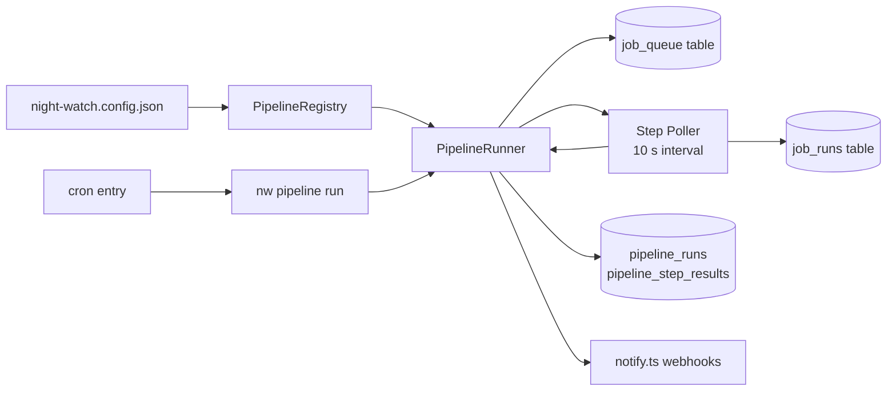
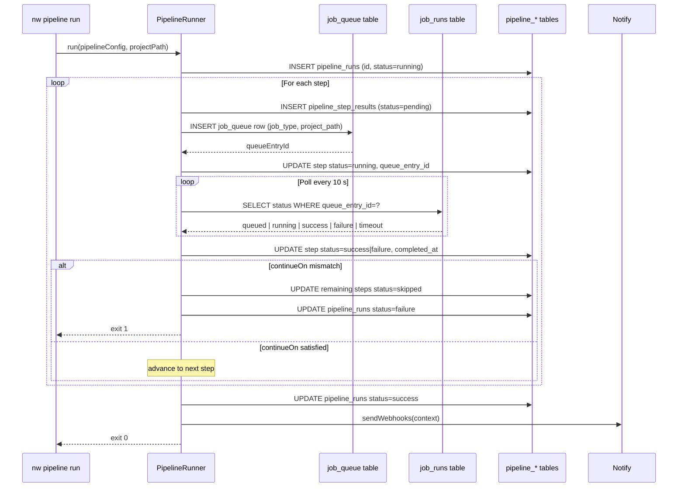

# PRD: Conditional Job Pipelines

## Complexity Assessment

**Score: 9 → HIGH**

| Criterion | Points |
|-----------|--------|
| Touches 10+ files | +3 |
| New system/module from scratch (pipeline engine) | +2 |
| Complex state logic (step state machine + polling) | +2 |
| Multi-package changes (core + cli) | +2 |

---

## Integration Points Checklist

**How will this feature be reached?**
- [x] Entry points: `nw pipeline run <id>` (manual), cron entry (scheduled)
- [x] Caller file: `packages/cli/src/commands/pipeline.ts` (new), wired via `packages/cli/src/cli.ts`
- [x] Registration: `pipelineCommand(program)` added to `cli.ts`; scheduled pipelines registered in `packages/cli/src/commands/install.ts`

**Is this user-facing?**
- [x] YES — `nw pipeline list`, `nw pipeline run`, `nw pipeline status`, `nw pipeline cancel`

**Full user flow:**
1. User adds a `pipelines` array to `night-watch.config.json`
2. Runs `nw pipeline list` to confirm detection
3. Runs `nw pipeline run full-cycle` — terminal shows live step-by-step progress with `✓ / ✗ / –` icons
4. `nw pipeline status` shows history with per-step outcomes
5. `nw install` registers cron entries; `nw doctor` warns if missing

---

## 1. Context

**Problem:** Night Watch jobs (executor, reviewer, QA, audit) run independently with no ability to chain outcomes, so multi-stage automation workflows require manual re-triggering between every stage.

**Files Analyzed:**
- `packages/core/src/types.ts` — `INightWatchConfig`, `JobType`
- `packages/core/src/storage/sqlite/migrations.ts` — `CREATE TABLE IF NOT EXISTS` / `ALTER TABLE` pattern
- `packages/core/src/utils/job-queue.ts` — `job_queue` + `job_runs` tables, `openDb()`, polling pattern
- `packages/core/src/utils/notify.ts` — `INotificationContext`, `sendWebhooks()`
- `packages/core/src/jobs/job-registry.ts` — `JOB_REGISTRY`, `IJobDefinition`
- `packages/core/src/constants.ts` — `DEFAULT_*` constant pattern
- `packages/cli/src/cli.ts` — Commander command registration pattern
- `packages/cli/src/commands/install.ts` — cron entry registration
- `packages/cli/src/commands/doctor.ts` — health check pattern
- `packages/cli/src/commands/queue.ts` — subcommand pattern reference

**Current Behavior:**
- `job_queue` dispatches jobs; `job_runs` tracks per-job status (`queued/running/success/failure/timeout`)
- No mechanism waits for a job to finish before dispatching the next
- Users manually re-trigger each stage after the previous completes
- `runMigrations()` runs `db.exec()` idempotently — safe to extend with new tables
- Webhook notifications use `INotificationContext` with `event`, `projectName`, `exitCode`

---

## 2. Solution

**Approach:**
- Add `IPipelineConfig[]` to `INightWatchConfig` — each pipeline is an ordered list of `JobType` steps with a `continueOn` policy
- Two new SQLite tables (`pipeline_runs`, `pipeline_step_results`) store run state, linking steps to `job_runs` via `queue_entry_id`
- `PipelineRunner` orchestrates steps sequentially: insert into `job_queue` → poll `job_runs` every 10 s → evaluate `continueOn` → advance or abort
- New `nw pipeline` CLI command exposes `list`, `run`, `status`, `cancel` subcommands
- `install.ts` registers cron entries for pipelines with a `schedule` field; `doctor.ts` warns when missing

**Architecture Diagram:**



**Key Decisions:**
- Reuse `job_queue` dispatch and `job_runs` polling — no new execution mechanism needed
- `continueOn: 'success' | 'failure' | 'always'` — declarative policy, no `eval()`
- Sequential steps only in v1 — keeps the state machine tractable; parallel steps deferred
- Polling interval `DEFAULT_PIPELINE_POLL_INTERVAL_MS = 10_000` — zero network cost, matches existing patterns
- Pipeline run ID: `randomUUID()` from Node `crypto` — no extra dependency

**Data Changes:**

```sql
CREATE TABLE IF NOT EXISTS pipeline_runs (
  id           TEXT    PRIMARY KEY,
  pipeline_id  TEXT    NOT NULL,
  status       TEXT    NOT NULL,
  started_at   INTEGER NOT NULL,
  completed_at INTEGER
);
CREATE INDEX IF NOT EXISTS idx_pipeline_runs_lookup
  ON pipeline_runs(pipeline_id, started_at DESC);

CREATE TABLE IF NOT EXISTS pipeline_step_results (
  id               INTEGER PRIMARY KEY AUTOINCREMENT,
  pipeline_run_id  TEXT    NOT NULL REFERENCES pipeline_runs(id),
  step_id          TEXT    NOT NULL,
  job              TEXT    NOT NULL,
  label            TEXT    NOT NULL,
  status           TEXT    NOT NULL DEFAULT 'pending',
  queue_entry_id   INTEGER,
  started_at       INTEGER,
  completed_at     INTEGER,
  exit_code        INTEGER
);
CREATE INDEX IF NOT EXISTS idx_pipeline_steps_run
  ON pipeline_step_results(pipeline_run_id, id ASC);
```

---

## 3. Sequence Flow



---

## 4. Execution Phases

### Phase 1: Data Layer — Types compile and DB schema migrates

**Files (max 5):**
- `packages/core/src/types.ts` — add `IPipelineStep`, `IPipelineConfig`, `IPipelineRun`, `IPipelineStepResult`, `PipelineRunStatus`, `PipelineStepStatus`; add `pipelines?: IPipelineConfig[]` to `INightWatchConfig`
- `packages/core/src/storage/sqlite/migrations.ts` — append `pipeline_runs` + `pipeline_step_results` DDL inside the existing `db.exec()` template string
- `packages/core/src/constants.ts` — add `DEFAULT_PIPELINE_POLL_INTERVAL_MS = 10_000` and `DEFAULT_PIPELINE_STEP_TIMEOUT_MS = 7_200_000`

**Implementation:**

Add to `packages/core/src/types.ts`:

```typescript
export type PipelineStepStatus = 'pending' | 'running' | 'success' | 'failure' | 'skipped';
export type PipelineRunStatus = 'running' | 'success' | 'failure' | 'cancelled';

export interface IPipelineStep {
  /** Unique identifier for this step within the pipeline */
  id: string;
  /** Job type to execute */
  job: JobType;
  /** Human-readable label (defaults to id if omitted) */
  label?: string;
  /**
   * When to advance to the next step.
   * 'success' (default): proceed only if this step status is 'success'
   * 'failure': proceed only if this step status is 'failure'
   * 'always': always advance regardless of outcome
   */
  continueOn?: 'success' | 'failure' | 'always';
  /** Override max polling wait for this step in ms */
  timeoutMs?: number;
}

export interface IPipelineConfig {
  /** Unique identifier used in CLI (e.g. 'full-cycle') */
  id: string;
  /** Human-readable name */
  name: string;
  /** Ordered steps executed sequentially */
  steps: IPipelineStep[];
  /** Optional cron schedule (e.g. '0 20 * * 1') */
  schedule?: string;
  /**
   * Which pipeline outcomes trigger a webhook notification.
   * Defaults to ['complete'] when omitted.
   */
  notifyOn?: Array<'success' | 'failure' | 'complete'>;
}

export interface IPipelineStepResult {
  stepId: string;
  job: JobType;
  label: string;
  status: PipelineStepStatus;
  queueEntryId?: number;
  startedAt?: number;
  completedAt?: number;
  exitCode?: number;
}

export interface IPipelineRun {
  id: string;
  pipelineId: string;
  status: PipelineRunStatus;
  startedAt: number;
  completedAt?: number;
  steps: IPipelineStepResult[];
}
```

Add `pipelines?: IPipelineConfig[];` to `INightWatchConfig`.

Append inside the existing `db.exec(`` ` `` `)` call in `migrations.ts`:

```sql
CREATE TABLE IF NOT EXISTS pipeline_runs (
  id           TEXT    PRIMARY KEY,
  pipeline_id  TEXT    NOT NULL,
  status       TEXT    NOT NULL,
  started_at   INTEGER NOT NULL,
  completed_at INTEGER
);
CREATE INDEX IF NOT EXISTS idx_pipeline_runs_lookup
  ON pipeline_runs(pipeline_id, started_at DESC);

CREATE TABLE IF NOT EXISTS pipeline_step_results (
  id               INTEGER PRIMARY KEY AUTOINCREMENT,
  pipeline_run_id  TEXT    NOT NULL REFERENCES pipeline_runs(id),
  step_id          TEXT    NOT NULL,
  job              TEXT    NOT NULL,
  label            TEXT    NOT NULL,
  status           TEXT    NOT NULL DEFAULT 'pending',
  queue_entry_id   INTEGER,
  started_at       INTEGER,
  completed_at     INTEGER,
  exit_code        INTEGER
);
CREATE INDEX IF NOT EXISTS idx_pipeline_steps_run
  ON pipeline_step_results(pipeline_run_id, id ASC);
```

**Tests Required:**

| Test File | Test Name | Assertion |
|-----------|-----------|-----------|
| `packages/core/src/__tests__/storage/migrations.test.ts` | `should create pipeline_runs table` | `PRAGMA table_info(pipeline_runs)` returns rows including `id`, `pipeline_id`, `status` |
| `packages/core/src/__tests__/storage/migrations.test.ts` | `should create pipeline_step_results table` | `PRAGMA table_info(pipeline_step_results)` includes `pipeline_run_id` column |
| `packages/core/src/__tests__/storage/migrations.test.ts` | `should be idempotent when runMigrations called twice` | Second call to `runMigrations(db)` throws no error |

**User Verification:**
- Action: `yarn verify`
- Expected: Compiles cleanly; `IPipelineConfig`, `IPipelineStep`, `IPipelineRun` are importable from `@night-watch/core`

---

### Phase 2: Pipeline Engine — `PipelineRunner.run()` executes steps sequentially and persists state

**Files (max 5):**
- `packages/core/src/jobs/pipeline-runner.ts` (new) — `PipelineRunner` class with `run()`, `_executeStep()`, `_pollUntilDone()`, and SQLite helpers
- `packages/core/src/jobs/pipeline-registry.ts` (new) — `PipelineRegistry` with `list()` and `get(id)`
- `packages/core/src/index.ts` — export `PipelineRunner`, `PipelineRegistry`, and pipeline types

**Implementation:**

`packages/core/src/jobs/pipeline-registry.ts`:

```typescript
import type { INightWatchConfig, IPipelineConfig } from '../types.js';

export class PipelineRegistry {
  constructor(private readonly config: INightWatchConfig) {}

  list(): IPipelineConfig[] {
    return this.config.pipelines ?? [];
  }

  get(id: string): IPipelineConfig {
    const pipeline = this.list().find((p) => p.id === id);
    if (!pipeline) throw new Error(`Pipeline "${id}" not found in config`);
    if (pipeline.steps.length === 0) throw new Error(`Pipeline "${id}" has no steps`);
    return pipeline;
  }
}
```

`packages/core/src/jobs/pipeline-runner.ts` — key structure:

```typescript
import { randomUUID } from 'crypto';
import Database from 'better-sqlite3';
import type { INightWatchConfig, IPipelineConfig, IPipelineRun, IPipelineStepResult, IPipelineStep, PipelineRunStatus, PipelineStepStatus } from '../types.js';
import { DEFAULT_PIPELINE_POLL_INTERVAL_MS, DEFAULT_PIPELINE_STEP_TIMEOUT_MS } from '../constants.js';

function sleep(ms: number): Promise<void> {
  return new Promise((resolve) => setTimeout(resolve, ms));
}

export class PipelineRunner {
  constructor(
    private readonly db: Database.Database,
    private readonly projectPath: string,
    private readonly config?: INightWatchConfig,
  ) {}

  async run(pipeline: IPipelineConfig): Promise<IPipelineRun> {
    const runId = randomUUID();
    const startedAt = Date.now();
    this.db.prepare(
      `INSERT INTO pipeline_runs (id, pipeline_id, status, started_at) VALUES (?, ?, 'running', ?)`
    ).run(runId, pipeline.id, startedAt);

    const stepResults: IPipelineStepResult[] = [];
    let failedStepId: string | undefined;

    for (let i = 0; i < pipeline.steps.length; i++) {
      const step = pipeline.steps[i];
      const result = await this._executeStep(runId, step);
      stepResults.push(result);

      const continueOn = step.continueOn ?? 'success';
      const shouldContinue =
        continueOn === 'always' ||
        (continueOn === 'success' && result.status === 'success') ||
        (continueOn === 'failure' && result.status === 'failure');

      if (!shouldContinue) {
        failedStepId = step.id;
        for (const remaining of pipeline.steps.slice(i + 1)) {
          this.db.prepare(
            `INSERT INTO pipeline_step_results (pipeline_run_id, step_id, job, label, status) VALUES (?, ?, ?, ?, 'skipped')`
          ).run(runId, remaining.id, remaining.job, remaining.label ?? remaining.id);
          stepResults.push({ stepId: remaining.id, job: remaining.job, label: remaining.label ?? remaining.id, status: 'skipped' });
        }
        this._completeRun(runId, 'failure');
        // send notification (see Phase 4)
        return { id: runId, pipelineId: pipeline.id, status: 'failure', startedAt, completedAt: Date.now(), steps: stepResults };
      }
    }

    this._completeRun(runId, 'success');
    // send notification (see Phase 4)
    return { id: runId, pipelineId: pipeline.id, status: 'success', startedAt, completedAt: Date.now(), steps: stepResults };
  }

  private async _executeStep(runId: string, step: IPipelineStep): Promise<IPipelineStepResult> {
    const startedAt = Date.now();
    const queueEntryId = this._enqueueJob(step);
    this.db.prepare(
      `INSERT INTO pipeline_step_results (pipeline_run_id, step_id, job, label, status, queue_entry_id, started_at) VALUES (?, ?, ?, ?, 'running', ?, ?)`
    ).run(runId, step.id, step.job, step.label ?? step.id, queueEntryId, startedAt);
    return this._pollUntilDone(runId, step, queueEntryId, startedAt);
  }

  private async _pollUntilDone(runId: string, step: IPipelineStep, queueEntryId: number, startedAt: number): Promise<IPipelineStepResult> {
    const deadline = startedAt + (step.timeoutMs ?? DEFAULT_PIPELINE_STEP_TIMEOUT_MS);
    while (Date.now() < deadline) {
      await sleep(DEFAULT_PIPELINE_POLL_INTERVAL_MS);
      const row = this.db.prepare<[number], { status: string; exit_code: number | null }>(
        `SELECT status, exit_code FROM job_runs WHERE queue_entry_id = ?`
      ).get(queueEntryId);
      if (!row) continue;
      if (row.status === 'success' || row.status === 'failure' || row.status === 'timeout') {
        const status: PipelineStepStatus = row.status === 'success' ? 'success' : 'failure';
        const completedAt = Date.now();
        this.db.prepare(
          `UPDATE pipeline_step_results SET status = ?, completed_at = ?, exit_code = ? WHERE pipeline_run_id = ? AND step_id = ?`
        ).run(status, completedAt, row.exit_code ?? null, runId, step.id);
        return { stepId: step.id, job: step.job, label: step.label ?? step.id, status, queueEntryId, startedAt, completedAt, exitCode: row.exit_code ?? undefined };
      }
    }
    this.db.prepare(
      `UPDATE pipeline_step_results SET status = 'failure', completed_at = ? WHERE pipeline_run_id = ? AND step_id = ?`
    ).run(Date.now(), runId, step.id);
    return { stepId: step.id, job: step.job, label: step.label ?? step.id, status: 'failure', queueEntryId, startedAt };
  }

  /** Insert a job_queue row and return its rowid */
  private _enqueueJob(step: IPipelineStep): number {
    const result = this.db.prepare(
      `INSERT INTO job_queue (project_path, project_name, job_type, priority, status, env_json, enqueued_at) VALUES (?, ?, ?, 50, 'pending', '{}', ?)`
    ).run(this.projectPath, this.projectPath, step.job, Date.now());
    return result.lastInsertRowid as number;
  }

  private _completeRun(runId: string, status: PipelineRunStatus): void {
    this.db.prepare(`UPDATE pipeline_runs SET status = ?, completed_at = ? WHERE id = ?`).run(status, Date.now(), runId);
  }
}
```

**Tests Required:**

| Test File | Test Name | Assertion |
|-----------|-----------|-----------|
| `packages/core/src/__tests__/jobs/pipeline-registry.test.ts` | `should return pipeline by id` | `registry.get('p1')` returns config with `id === 'p1'` |
| `packages/core/src/__tests__/jobs/pipeline-registry.test.ts` | `should throw when pipeline id not found` | `registry.get('missing')` throws `Error: Pipeline "missing" not found` |
| `packages/core/src/__tests__/jobs/pipeline-registry.test.ts` | `should throw when pipeline has no steps` | Config with `steps: []` throws on `registry.get('empty')` |
| `packages/core/src/__tests__/jobs/pipeline-runner.test.ts` | `should mark run as success when all steps succeed` | Mocked `job_runs` returns `status='success'`; `run.status === 'success'` |
| `packages/core/src/__tests__/jobs/pipeline-runner.test.ts` | `should skip remaining steps when continueOn success and step fails` | Step 2 fails with `continueOn:'success'`; step 3 has `status === 'skipped'` |
| `packages/core/src/__tests__/jobs/pipeline-runner.test.ts` | `should advance when continueOn is always and step fails` | Step 2 fails with `continueOn:'always'`; step 3 executes |
| `packages/core/src/__tests__/jobs/pipeline-runner.test.ts` | `should mark pipeline as failure when required step fails` | `run.status === 'failure'` |

Note: Use in-memory SQLite (`new Database(':memory:')`). Stub `_enqueueJob` with `vi.spyOn` to insert a synthetic `job_runs` row and return its id without a real queue process running.

**User Verification:**
- Action: `yarn test packages/core/src/__tests__/jobs/`
- Expected: All 7 pipeline tests pass

---

### Phase 3: CLI Command — `nw pipeline` subcommands wired into the program

**Files (max 5):**
- `packages/cli/src/commands/pipeline.ts` (new) — Commander subcommand: `list`, `run`, `status`, `cancel`
- `packages/cli/src/cli.ts` — import and register `pipelineCommand(program)`
- `packages/cli/src/__tests__/commands/pipeline.test.ts` (new) — command unit tests

**Implementation:**

`packages/cli/src/commands/pipeline.ts`:

```typescript
import { Command } from 'commander';
import { loadConfig } from '@night-watch/core/config.js';
import { PipelineRegistry } from '@night-watch/core/jobs/pipeline-registry.js';
import { PipelineRunner } from '@night-watch/core/jobs/pipeline-runner.js';
import Database from 'better-sqlite3';
import * as path from 'path';
import * as os from 'os';
import { GLOBAL_CONFIG_DIR, STATE_DB_FILE_NAME } from '@night-watch/core/constants.js';
import { runMigrations } from '@night-watch/core/storage/sqlite/migrations.js';

function openDb(): Database.Database {
  const dbPath = path.join(
    process.env.NIGHT_WATCH_HOME ?? path.join(os.homedir(), GLOBAL_CONFIG_DIR),
    STATE_DB_FILE_NAME,
  );
  const db = new Database(dbPath);
  db.pragma('journal_mode = WAL');
  db.pragma('busy_timeout = 5000');
  runMigrations(db);
  return db;
}

export function pipelineCommand(program: Command): void {
  const cmd = program.command('pipeline').description('Manage and run sequential job pipelines');

  cmd
    .command('list')
    .description('List all configured pipelines')
    .action(async () => {
      const config = await loadConfig();
      const registry = new PipelineRegistry(config);
      const pipelines = registry.list();
      if (pipelines.length === 0) {
        console.log('No pipelines configured. Add a "pipelines" array to night-watch.config.json.');
        return;
      }
      for (const p of pipelines) {
        const chain = p.steps.map((s) => s.job).join(' → ');
        console.log(`  ${p.id}  ${p.name}`);
        console.log(`    Steps: ${chain}`);
        if (p.schedule) console.log(`    Schedule: ${p.schedule}`);
      }
    });

  cmd
    .command('run <id>')
    .description('Run a pipeline by id (blocks until completion)')
    .option('--project-path <path>', 'Project root to run jobs against', process.cwd())
    .action(async (id: string, opts: { projectPath: string }) => {
      const config = await loadConfig();
      const registry = new PipelineRegistry(config);
      const pipelineConfig = registry.get(id);
      const db = openDb();
      const runner = new PipelineRunner(db, opts.projectPath, config);
      console.log(`Starting pipeline "${pipelineConfig.name}" (${pipelineConfig.steps.length} steps)\n`);
      const run = await runner.run(pipelineConfig);
      for (const step of run.steps) {
        const icon = step.status === 'success' ? '✓' : step.status === 'skipped' ? '–' : '✗';
        const dur = step.startedAt && step.completedAt
          ? ` (${Math.round((step.completedAt - step.startedAt) / 1000)}s)` : '';
        console.log(`  ${icon} [${step.job}] ${step.label}  ${step.status}${dur}`);
      }
      console.log(`\nPipeline ${run.status === 'success' ? 'completed successfully' : 'failed'}.`);
      process.exit(run.status === 'success' ? 0 : 1);
    });

  cmd
    .command('status [run-id]')
    .description('Show recent pipeline runs or step details for a specific run')
    .action(async (runId?: string) => {
      const db = openDb();
      if (runId) {
        const run = db.prepare<[string], { id: string; pipeline_id: string; status: string; started_at: number }>(
          `SELECT * FROM pipeline_runs WHERE id = ?`
        ).get(runId);
        if (!run) { console.error(`No run found: ${runId}`); process.exit(1); }
        const steps = db.prepare<[string], { step_id: string; job: string; label: string; status: string }>(
          `SELECT step_id, job, label, status FROM pipeline_step_results WHERE pipeline_run_id = ? ORDER BY id ASC`
        ).all(runId);
        console.log(`Pipeline: ${run.pipeline_id}  Status: ${run.status}`);
        for (const s of steps) {
          const icon = s.status === 'success' ? '✓' : s.status === 'skipped' ? '–' : '✗';
          console.log(`  ${icon} [${s.job}] ${s.label}  ${s.status}`);
        }
      } else {
        const runs = db.prepare<[], { id: string; pipeline_id: string; status: string; started_at: number }>(
          `SELECT id, pipeline_id, status, started_at FROM pipeline_runs ORDER BY started_at DESC LIMIT 10`
        ).all();
        if (runs.length === 0) { console.log('No pipeline runs recorded yet.'); return; }
        for (const r of runs) {
          console.log(`  ${r.id.slice(0, 8)}  ${r.pipeline_id}  ${r.status}  ${new Date(r.started_at).toISOString()}`);
        }
      }
    });

  cmd
    .command('cancel <run-id>')
    .description('Cancel a running pipeline')
    .action(async (runId: string) => {
      const db = openDb();
      const result = db.prepare<[number, string]>(
        `UPDATE pipeline_runs SET status = 'cancelled', completed_at = ? WHERE id = ? AND status = 'running'`
      ).run(Date.now(), runId);
      if (result.changes === 0) { console.error(`No running pipeline found: ${runId}`); process.exit(1); }
      console.log(`Pipeline run ${runId} cancelled.`);
    });
}
```

In `packages/cli/src/cli.ts`:

```typescript
import { pipelineCommand } from './commands/pipeline.js';
// ... after existing registrations:
pipelineCommand(program);
```

**Tests Required:**

| Test File | Test Name | Assertion |
|-----------|-----------|-----------|
| `packages/cli/src/__tests__/commands/pipeline.test.ts` | `pipeline list should print pipeline id and step chain` | stdout contains `full-cycle` and `slicer → executor` |
| `packages/cli/src/__tests__/commands/pipeline.test.ts` | `pipeline list should show no-config message when empty` | stdout contains `No pipelines configured` |
| `packages/cli/src/__tests__/commands/pipeline.test.ts` | `pipeline run should invoke runner.run with matching config` | `PipelineRunner.prototype.run` spy called with `config.id === 'full-cycle'` |
| `packages/cli/src/__tests__/commands/pipeline.test.ts` | `pipeline run should exit 0 when status is success` | `process.exit` spy called with `0` |
| `packages/cli/src/__tests__/commands/pipeline.test.ts` | `pipeline run should exit 1 when status is failure` | `process.exit` spy called with `1` |
| `packages/cli/src/__tests__/commands/pipeline.test.ts` | `pipeline status without run-id should list recent runs` | stdout contains run id prefix and status |
| `packages/cli/src/__tests__/commands/pipeline.test.ts` | `pipeline cancel should set status to cancelled in DB` | DB row has `status = 'cancelled'` after command executes |

Note: Mock `loadConfig` via `vi.mock`, stub `PipelineRunner` constructor, use in-memory SQLite.

**User Verification:**
- Action: `nw pipeline list` in a configured project
- Expected: Prints pipeline name with step chain (`slicer → executor → reviewer → qa`)
- Action: `nw pipeline run full-cycle` (staging env or mocked steps)
- Expected: Prints `✓ [executor] implement  success`, exits 0

---

### Phase 4: Scheduling + Notifications — pipelines run on cron and deliver webhooks

**Files (max 5):**
- `packages/cli/src/commands/install.ts` — detect `pipelines[].schedule`, register `nw pipeline run <id>` cron entries
- `packages/cli/src/commands/doctor.ts` — warn when a scheduled pipeline is not installed in crontab
- `packages/core/src/jobs/pipeline-runner.ts` — call `sendWebhooks()` at end of `run()` using existing `notify.ts`

**Implementation:**

In `packages/cli/src/commands/install.ts`, after the existing per-job cron loop:

```typescript
const pipelines = config.pipelines ?? [];
for (const p of pipelines.filter((pipe) => !!pipe.schedule)) {
  const logFile = path.join(logDir, `pipeline-${p.id}.log`);
  const cronLine = `${p.schedule} cd ${projectPath} && nw pipeline run ${p.id} >> ${logFile} 2>&1`;
  addCronEntry(cronLine, `night-watch-pipeline-${p.id}`);
}
```

In `packages/cli/src/commands/doctor.ts`, after existing job checks:

```typescript
const scheduledPipelines = (config.pipelines ?? []).filter((p) => !!p.schedule);
for (const p of scheduledPipelines) {
  if (!crontabContains(`night-watch-pipeline-${p.id}`)) {
    issues.push({
      level: 'warn',
      message: `Pipeline "${p.id}" has a schedule but is not installed in crontab. Run: nw install`,
    });
  }
}
```

In `packages/core/src/jobs/pipeline-runner.ts`, at the end of `run()` before returning, add:

```typescript
import { sendWebhooks } from '../utils/notify.js';
import type { INotificationContext } from '../utils/notify.js';

// Notify on completion
const notifyOn = pipeline.notifyOn ?? ['complete'];
const shouldNotify =
  notifyOn.includes('complete') ||
  (notifyOn.includes('success') && finalStatus === 'success') ||
  (notifyOn.includes('failure') && finalStatus === 'failure');

if (shouldNotify && this.config?.notifications?.webhooks?.length) {
  const context: INotificationContext = {
    event: 'pipeline_complete',
    projectName: this.projectPath,
    exitCode: finalStatus === 'success' ? 0 : 1,
    provider: 'pipeline',
    failureReason:
      finalStatus === 'failure'
        ? `Pipeline "${pipeline.id}" failed`
        : undefined,
  };
  await sendWebhooks(this.config.notifications.webhooks, context);
}
```

Add `'pipeline_complete'` to the `NotificationEvent` union type in `packages/core/src/types.ts`.

**Tests Required:**

| Test File | Test Name | Assertion |
|-----------|-----------|-----------|
| `packages/cli/src/__tests__/commands/install.test.ts` | `should register cron entry for pipeline with schedule` | Crontab string contains `nw pipeline run full-cycle` |
| `packages/cli/src/__tests__/commands/install.test.ts` | `should not register cron entry for pipeline without schedule` | No `nw pipeline run` entry when `schedule` is undefined |
| `packages/core/src/__tests__/jobs/pipeline-runner.test.ts` | `should call sendWebhooks on complete when notifyOn includes complete` | `sendWebhooks` spy called once after successful run |
| `packages/core/src/__tests__/jobs/pipeline-runner.test.ts` | `should not call sendWebhooks when notifyOn is empty` | `sendWebhooks` spy not called when `notifyOn: []` |
| `packages/cli/src/__tests__/commands/doctor.test.ts` | `should warn when scheduled pipeline not in crontab` | Doctor output includes `Pipeline "full-cycle" has a schedule but is not installed` |

**User Verification:**
- Action: Add `"schedule": "0 20 * * 1"` to a pipeline, run `nw install`
- Expected: `crontab -l` shows `nw pipeline run <id>` entry
- Action: `nw doctor`
- Expected: No pipeline warnings after a successful `nw install`

---

## 5. Checkpoint Protocol

After completing each phase, spawn the `prd-work-reviewer` agent:

```
Task tool:
  subagent_type: "prd-work-reviewer"
  prompt: "Review checkpoint for phase [N] of PRD at docs/PRDs/night-watch/conditional-job-pipelines.md"
```

Continue to the next phase only when the agent reports **PASS**.

Phases 2 and 4 require **additional manual verification** (real job dispatch into `job_queue`, webhook delivery) alongside the automated checkpoint.

---

## 6. Verification Strategy

### Full Test Suite

```bash
yarn verify
yarn test packages/core/src/__tests__/storage/migrations.test.ts
yarn test packages/core/src/__tests__/jobs/pipeline-registry.test.ts
yarn test packages/core/src/__tests__/jobs/pipeline-runner.test.ts
yarn test packages/cli/src/__tests__/commands/pipeline.test.ts
yarn test packages/cli/src/__tests__/commands/install.test.ts
yarn test packages/cli/src/__tests__/commands/doctor.test.ts
```

### CLI Smoke Test (after Phase 3)

```bash
# Project config contains:
# { "pipelines": [{ "id": "full-cycle", "name": "Full Cycle",
#   "steps": [{ "id": "s1", "job": "slicer" }, { "id": "s2", "job": "executor" }] }] }

nw pipeline list
# Expected: prints "full-cycle  Full Cycle" and "slicer → executor"

nw pipeline status
# Expected: "No pipeline runs recorded yet."
```

### End-to-End Verification Checklist

- [ ] `yarn verify` passes with zero TypeScript errors and zero lint errors
- [ ] All 21 new test cases pass
- [ ] `nw pipeline list` reads and displays pipelines from config
- [ ] `nw pipeline run <id>` dispatches jobs into `job_queue`, polls `job_runs`, prints step results
- [ ] A step failing with `continueOn: 'success'` marks all downstream steps as `skipped`
- [ ] A step failing with `continueOn: 'always'` does not block the next step
- [ ] `nw pipeline status` shows run history with per-step outcome icons
- [ ] `nw pipeline cancel` sets `status = 'cancelled'` in `pipeline_runs`
- [ ] `nw install` registers cron entries only for pipelines with a `schedule` field
- [ ] `nw doctor` warns when a scheduled pipeline is not in crontab
- [ ] Webhook notification fires on pipeline completion when `notifyOn` includes `'complete'`

---

## 7. Acceptance Criteria

- [ ] All 4 phases complete with all tests passing
- [ ] `yarn verify` passes (zero TypeScript errors, zero lint errors)
- [ ] All automated `prd-work-reviewer` checkpoints report PASS
- [ ] `nw pipeline` command accessible via `npx @jonit-dev/night-watch-cli pipeline`
- [ ] Sequential step execution with `continueOn` logic verified end-to-end
- [ ] Webhook notification delivered on pipeline completion
- [ ] Scheduled pipelines appear in crontab after `nw install`
- [ ] `nw doctor` detects uninstalled scheduled pipelines
- [ ] Feature is not orphaned — `pipelineCommand(program)` is registered in `cli.ts`