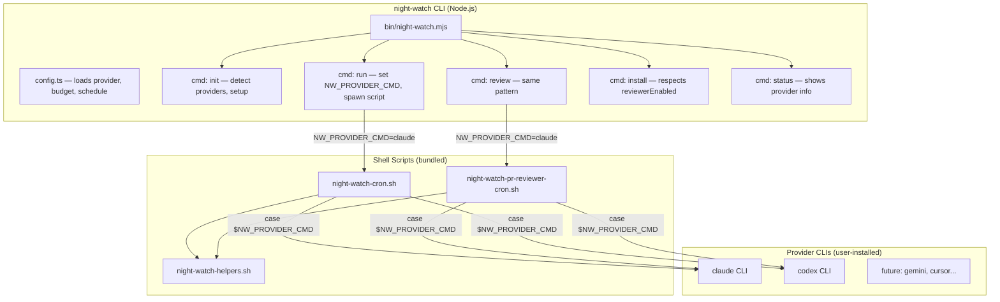
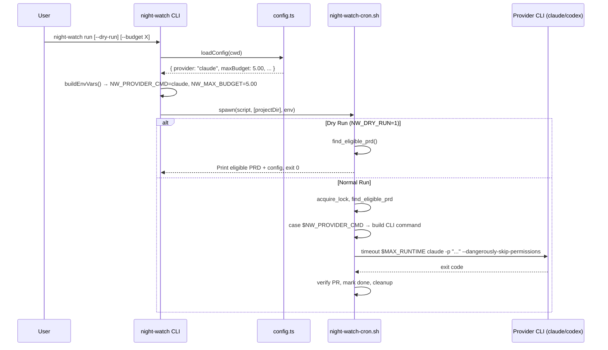
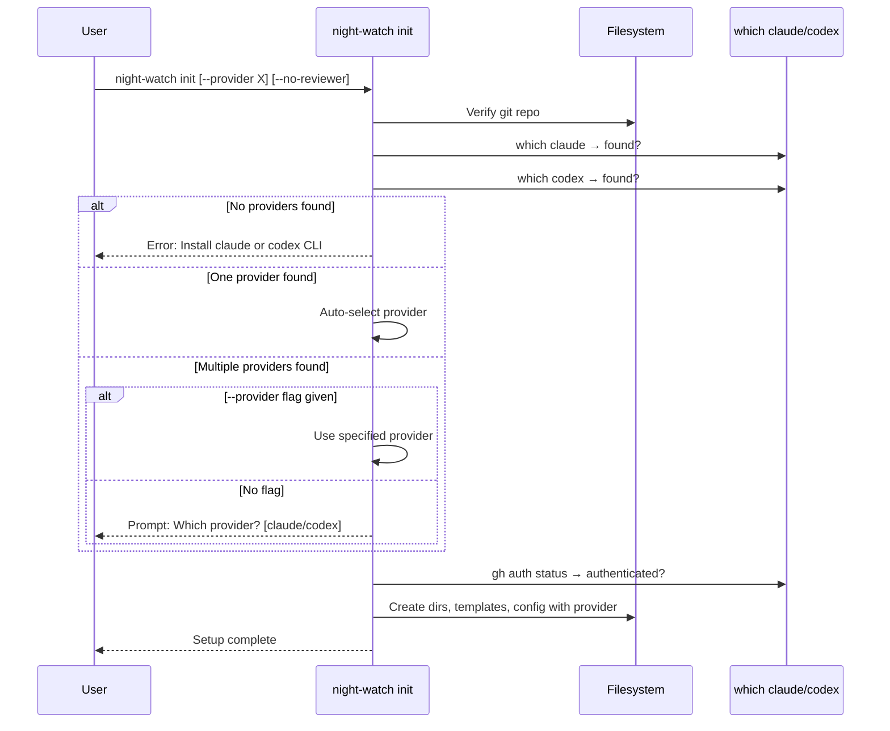

# PRD: Provider Abstraction, Onboarding & UX Improvements

**Status:** Ready
**Created:** 2026-02-14
**Author:** Principal Architect
**Complexity:** HIGH (Score: 8)
**Depends on:** `001-initial-package-scaffolding.md`

---

## 0. Project Fundamentals

**Package name:** `night-watch-cli`
**Project root:** `/home/joao/projects/night-watch-cli/`
**Runtime:** Node.js (via nvm)
**Language:** TypeScript (compiled to `dist/`)
**Package manager:** npm
**Test framework:** Vitest
**CLI framework:** Commander.js
**Shell core:** Bash (bundled scripts, battle-tested)

---

## 1. Context

### What Night Watch Is

Night Watch is a **wrapper/orchestrator** that calls CLI-based AI coding tools (`claude`, `codex`, etc.) to perform specific automated flows:
- Pick up PRD tickets and implement them autonomously
- Review open PRs, fix CI failures, and address review feedback

It is **not** an API client. The underlying CLIs handle their own authentication, configuration, and model selection. Night Watch just needs to know **which CLI binary to call** and **with what flags**.

### Problem

The initial implementation (PRD 001) shipped with a design that treats Night Watch as an API client:

1. **Wrong abstraction** — `IClaudeConfig` with `apiKey`, `baseUrl`, `opusModel`, `sonnetModel` in config. Night Watch doesn't use APIs — it calls CLI binaries.
2. **Single provider** — Hardcoded to `claude` CLI everywhere (bash scripts, templates, env vars, CLI flags like `--api-key`, `--api-url`, `--model`).
3. **No onboarding** — `init` checks prerequisites but doesn't guide users through provider selection or optional features.
4. **PR reviewer always on** — No way to disable the PR reviewer in config; only a `--no-reviewer` flag on `install`.
5. **Weak dry-run** — Just prints env vars and the script path. Doesn't show eligible PRDs, PRs needing work, or the actual command.
6. **No publish workflow** — `.npmrc` has auth token but no publish script in package.json.

### Files Analyzed

```
src/types.ts                    # IClaudeConfig interface (to remove)
src/config.ts                   # ANTHROPIC_* env var loading (to remove)
src/constants.ts                # Missing provider constants
src/commands/run.ts             # --api-key, --api-url, --model flags (to remove)
src/commands/review.ts          # Same API flags (to remove)
src/commands/init.ts            # No provider detection
src/commands/install.ts         # No reviewerEnabled config check
src/commands/status.ts          # No provider/reviewer info
scripts/night-watch-cron.sh     # Hardcoded `claude` invocation
scripts/night-watch-pr-reviewer-cron.sh  # Hardcoded `claude` invocation
templates/night-watch.config.json        # claude config block
```

---

## 2. Solution

### Approach

- Remove `IClaudeConfig` and all `ANTHROPIC_*` env var injection from the Node.js layer
- Add `provider: "claude" | "codex"` to config — Night Watch just needs to know which CLI binary to call
- Bash scripts receive `NW_PROVIDER_CMD` env var and use a `case` statement for provider-specific flags
- `init` auto-detects installed providers, auto-selects if one found, prompts if multiple
- `reviewerEnabled: boolean` in config, respected by `install` and `status`
- Dry-run passes `NW_DRY_RUN=1` to bash scripts so they print diagnostics without invoking the AI
- Add `publish:npm` script to package.json

### Architecture



### Key Decisions

- **Provider abstraction via env vars**: Node.js sets `NW_PROVIDER_CMD`, bash scripts use `case` statement. Simple, extensible — adding a new provider is one constant + one case branch.
- **No API config passthrough**: Night Watch does NOT manage provider auth. The CLIs handle their own config. This is the fundamental correction.
- **Provider command mapping in constants.ts**: Central `PROVIDER_COMMANDS` record maps provider name to CLI binary and argument builder.
- **reviewerEnabled as config-level setting**: Persists in `night-watch.config.json` so `install` automatically respects it.
- **DRY_RUN in bash**: Rather than simulating bash logic in Node.js, pass `NW_DRY_RUN=1` and let the scripts print what they'd do.

### Data Changes

None — file-based system (markdown PRDs, log files, lock files).

---

## 3. Sequence Flows

### Provider-Aware `night-watch run`



### Provider-Aware `night-watch init`



---

## 4. Execution Phases

### Phase 1: Provider Abstraction — Types + Config + Template

**User-visible outcome:** `npm run build` passes with new provider-based types. Old `IClaudeConfig` removed.

**Files (5):**
- `src/types.ts` — type changes
- `src/constants.ts` — provider constants
- `src/config.ts` — config loader changes
- `src/__tests__/config.test.ts` — updated tests
- `templates/night-watch.config.json` — new config shape

**Implementation:**

- [ ] Remove `IClaudeConfig` interface from `src/types.ts`
- [ ] Add `Provider` type: `export type Provider = "claude" | "codex";`
- [ ] Add `provider: Provider` field to `INightWatchConfig` (replaces `claude: IClaudeConfig`)
- [ ] Add `reviewerEnabled: boolean` field to `INightWatchConfig`
- [ ] Add to `src/constants.ts`:
  - `DEFAULT_PROVIDER: Provider = "claude"`
  - `DEFAULT_REVIEWER_ENABLED = true`
  - `PROVIDER_COMMANDS` record mapping provider to `{ cmd: string, buildArgs: (opts) => string[] }`
  - `VALID_PROVIDERS: Provider[] = ["claude", "codex"]`
- [ ] In `src/config.ts`:
  - Remove `loadClaudeConfigFromEnv()` function entirely
  - Remove all `ANTHROPIC_*` and `API_TIMEOUT_MS` env var parsing from `loadConfig()`
  - Remove `claude` merging from `mergeConfigs()`
  - Add `NW_PROVIDER` env var support (validate against `VALID_PROVIDERS`, fallback to default)
  - Add `NW_REVIEWER_ENABLED` env var support (parse `"true"/"false"/"1"/"0"`)
  - Update `getDefaultConfig()` to return `provider: DEFAULT_PROVIDER, reviewerEnabled: DEFAULT_REVIEWER_ENABLED`
- [ ] Update `templates/night-watch.config.json`:
  ```json
  {
    "projectName": "",
    "defaultBranch": "",
    "provider": "claude",
    "reviewerEnabled": true,
    "prdDirectory": "docs/PRDs/night-watch",
    "maxBudget": 5.00,
    "maxRuntime": 7200,
    "reviewerMaxBudget": 3.00,
    "reviewerMaxRuntime": 3600,
    "cron": {
      "executorSchedule": "0 0-15 * * *",
      "reviewerSchedule": "0 0,3,6,9,12,15 * * *"
    },
    "review": {
      "minScore": 80,
      "branchPatterns": ["feat/", "night-watch/"]
    },
    "logging": {
      "maxLogSize": 524288
    }
  }
  ```
- [ ] Update `src/__tests__/config.test.ts`:
  - Remove tests: "should load claude provider config from file", "should let ANTHROPIC_* env vars override claude config"
  - Update all config fixtures: replace `claude: {}` with `provider: "claude", reviewerEnabled: true`
  - Add test: "should return defaults with provider and reviewerEnabled"
  - Add test: "should handle NW_PROVIDER env var"
  - Add test: "should handle NW_REVIEWER_ENABLED env var"
  - Add test: "should fallback to default for invalid NW_PROVIDER"

**Tests Required:**

| Test File | Test Name | Assertion |
|-----------|-----------|-----------|
| `src/__tests__/config.test.ts` | `should return defaults with provider and reviewerEnabled` | `config.provider === "claude"`, `config.reviewerEnabled === true` |
| `src/__tests__/config.test.ts` | `should merge provider from config file` | File with `"provider": "codex"` → `config.provider === "codex"` |
| `src/__tests__/config.test.ts` | `should handle NW_PROVIDER env var` | `NW_PROVIDER=codex` → `config.provider === "codex"` |
| `src/__tests__/config.test.ts` | `should handle NW_REVIEWER_ENABLED env var` | `NW_REVIEWER_ENABLED=false` → `config.reviewerEnabled === false` |
| `src/__tests__/config.test.ts` | `should fallback to default for invalid NW_PROVIDER` | `NW_PROVIDER=invalid` → `config.provider === "claude"` |

**Verification Plan:**
1. `npm run build` compiles without errors
2. `npm test -- src/__tests__/config.test.ts` passes

---

### Phase 2: Run + Review Commands — Provider-Aware

**User-visible outcome:** `run` and `review` pass `NW_PROVIDER_CMD` to bash scripts. API flags (`--api-key`, `--api-url`, `--model`) removed.

**Files (4):**
- `src/commands/run.ts` — remove API flags, add provider env vars
- `src/commands/review.ts` — same changes
- `src/__tests__/commands/run.test.ts` — updated tests
- `src/__tests__/commands/review.test.ts` — updated tests

**Implementation:**

- [ ] In `src/commands/run.ts`:
  - Remove `apiKey`, `apiUrl`, `model` from `RunOptions` interface
  - Remove `--api-key`, `--api-url`, `--model` Commander option registrations
  - Rewrite `buildEnvVars()`:
    ```typescript
    export function buildEnvVars(config: INightWatchConfig, options: RunOptions): Record<string, string> {
      const env: Record<string, string> = {};
      env.NW_PROVIDER_CMD = PROVIDER_COMMANDS[config.provider].cmd;
      env.NW_MAX_BUDGET = String(config.maxBudget);
      env.NW_MAX_RUNTIME = String(config.maxRuntime);
      if (options.dryRun) env.NW_DRY_RUN = "1";
      return env;
    }
    ```
  - Simplify `applyCliOverrides()` — only handle `--budget` and `--timeout`
  - Update dry-run output to show provider name instead of ANTHROPIC env vars
- [ ] In `src/commands/review.ts`:
  - Same changes, using `NW_REVIEWER_MAX_BUDGET` and `NW_REVIEWER_MAX_RUNTIME`
- [ ] Update `src/__tests__/commands/run.test.ts`:
  - Remove all tests referencing `ANTHROPIC_AUTH_TOKEN`, `ANTHROPIC_BASE_URL`, `API_TIMEOUT_MS`, `ANTHROPIC_DEFAULT_*_MODEL`
  - Remove tests for `--api-key`, `--api-url`, `--model` CLI overrides
  - Update all `INightWatchConfig` fixtures: `provider: "claude", reviewerEnabled: true` instead of `claude: {}`
  - Add test: `should set NW_PROVIDER_CMD from config.provider`
  - Add test: `should set NW_PROVIDER_CMD to codex when configured`
- [ ] Update `src/__tests__/commands/review.test.ts` — same pattern

**Tests Required:**

| Test File | Test Name | Assertion |
|-----------|-----------|-----------|
| `src/__tests__/commands/run.test.ts` | `should set NW_PROVIDER_CMD from config.provider` | `env.NW_PROVIDER_CMD === "claude"` |
| `src/__tests__/commands/run.test.ts` | `should set NW_PROVIDER_CMD to codex when configured` | provider=codex → `env.NW_PROVIDER_CMD === "codex"` |
| `src/__tests__/commands/run.test.ts` | `should not set any ANTHROPIC_* vars` | No ANTHROPIC keys in env object |
| `src/__tests__/commands/run.test.ts` | `should set NW_DRY_RUN when --dry-run passed` | `env.NW_DRY_RUN === "1"` |
| `src/__tests__/commands/review.test.ts` | `should set NW_PROVIDER_CMD for reviewer` | Same as run |
| `src/__tests__/commands/review.test.ts` | `should use reviewer budget/runtime vars` | `NW_REVIEWER_MAX_BUDGET`, `NW_REVIEWER_MAX_RUNTIME` |

**Verification Plan:**
1. `npm run build` passes
2. `npm test` passes for run.test.ts and review.test.ts

---

### Phase 3: Bash Scripts + Templates — Provider-Agnostic

**User-visible outcome:** Bash scripts call whichever provider CLI is configured via `NW_PROVIDER_CMD`. Templates use generic language. Dry-run in bash prints diagnostics.

**Files (5):**
- `scripts/night-watch-cron.sh` — provider-agnostic invocation
- `scripts/night-watch-pr-reviewer-cron.sh` — same
- `scripts/night-watch-helpers.sh` — add validate_provider helper
- `templates/night-watch.md` — generic language
- `templates/night-watch-pr-reviewer.md` — generic language

**Implementation:**

- [ ] In `scripts/night-watch-cron.sh`:
  - Add `PROVIDER_CMD="${NW_PROVIDER_CMD:-claude}"` at top
  - Add dry-run check before provider invocation:
    ```bash
    if [ "${NW_DRY_RUN:-0}" = "1" ]; then
      log "DRY-RUN: Would process ${ELIGIBLE_PRD}"
      log "DRY-RUN: Provider: ${PROVIDER_CMD}"
      log "DRY-RUN: Budget: ${MAX_BUDGET}, Runtime: ${MAX_RUNTIME}s"
      echo "=== Dry Run: PRD Executor ==="
      echo "Provider:    ${PROVIDER_CMD}"
      echo "Eligible PRD: ${ELIGIBLE_PRD}"
      echo "Branch:      ${BRANCH_NAME}"
      echo "Budget:      \$${MAX_BUDGET}"
      echo "Timeout:     ${MAX_RUNTIME}s"
      exit 0
    fi
    ```
  - Replace hardcoded `claude` invocation (lines 79-83) with `case` statement:
    ```bash
    case "${PROVIDER_CMD}" in
      claude)
        timeout "${MAX_RUNTIME}" \
          claude -p "${PROMPT}" \
            --dangerously-skip-permissions \
            --max-budget-usd "${MAX_BUDGET}" \
            >> "${LOG_FILE}" 2>&1
        ;;
      codex)
        timeout "${MAX_RUNTIME}" \
          codex --quiet \
            --full-auto \
            --prompt "${PROMPT}" \
            >> "${LOG_FILE}" 2>&1
        ;;
      *)
        log "ERROR: Unknown provider: ${PROVIDER_CMD}"
        exit 1
        ;;
    esac
    ```
- [ ] In `scripts/night-watch-pr-reviewer-cron.sh`:
  - Same `PROVIDER_CMD` variable and `case` statement
  - Add dry-run that shows PRs needing work:
    ```bash
    if [ "${NW_DRY_RUN:-0}" = "1" ]; then
      echo "=== Dry Run: PR Reviewer ==="
      echo "Provider: ${PROVIDER_CMD}"
      echo "Open PRs needing work:${PRS_NEEDING_WORK}"
      echo "Budget:  \$${MAX_BUDGET}"
      echo "Timeout: ${MAX_RUNTIME}s"
      exit 0
    fi
    ```
  - For the reviewer slash command invocation, adapt per provider:
    ```bash
    case "${PROVIDER_CMD}" in
      claude)
        timeout "${MAX_RUNTIME}" \
          claude -p "/night-watch-pr-reviewer" \
            --dangerously-skip-permissions \
            --max-budget-usd "${MAX_BUDGET}" \
            >> "${LOG_FILE}" 2>&1
        ;;
      codex)
        timeout "${MAX_RUNTIME}" \
          codex --quiet \
            --full-auto \
            --prompt "$(cat "${PROJECT_DIR}/.claude/commands/night-watch-pr-reviewer.md")" \
            >> "${LOG_FILE}" 2>&1
        ;;
    esac
    ```
- [ ] In `scripts/night-watch-helpers.sh`:
  - Add `validate_provider()` function
- [ ] In `templates/night-watch.md`:
  - Replace "You are the Night Watch agent" (keep as-is, it's generic)
  - Keep all instructions as-is — they are read by whichever AI is active
  - The template is already provider-agnostic in content
- [ ] In `templates/night-watch-pr-reviewer.md`:
  - Same treatment — already mostly generic
  - Ensure no Claude-specific references in the instructions

**Verification Plan:**
1. `NW_PROVIDER_CMD=claude NW_DRY_RUN=1 bash scripts/night-watch-cron.sh /tmp/test-project` prints dry-run output (requires a test project dir with PRDs)
2. `npm run build` still passes (bash scripts not compiled, but templates are bundled)

---

### Phase 4: Init Onboarding + Install/Status Updates

**User-visible outcome:** `night-watch init` detects available providers and guides setup. `install` respects `reviewerEnabled`. `status` shows provider and reviewer info.

**Files (5):**
- `src/commands/init.ts` — provider detection, onboarding
- `src/commands/install.ts` — respect reviewerEnabled
- `src/commands/status.ts` — show provider info
- `src/__tests__/commands/init.test.ts` — updated tests
- `src/__tests__/commands/status.test.ts` — updated tests

**Implementation:**

- [ ] In `src/commands/init.ts`:
  - Add `isCodexAvailable()` function (same pattern as `isClaudeAvailable()`)
  - Add `detectProviders(): Provider[]` function that checks which CLIs are installed
  - Add `--provider <name>` option to Commander
  - Add `--no-reviewer` option to Commander
  - Update `InitOptions`: add `provider?: string`, `reviewer?: boolean` (Commander's `--no-reviewer` maps to `reviewer: false`)
  - Rework the action handler:
    - Step "Detecting AI providers..." replaces "Checking Claude CLI..."
    - If `--provider` flag given: validate and use it
    - If no flag: call `detectProviders()`
      - 0 found → error with install instructions for both
      - 1 found → auto-select, print message
      - 2+ found → use readline to prompt user (simple question, not a full TUI)
    - Check `gh auth status` (already exists)
    - Set `reviewerEnabled` from `--no-reviewer` flag (default: true)
    - Generate config with `provider` and `reviewerEnabled` fields
    - Update step count and messages
- [ ] In `src/commands/install.ts`:
  - Load config and check `config.reviewerEnabled`
  - Change reviewer logic: `const installReviewer = options.noReviewer === true ? false : config.reviewerEnabled;`
  - Use `installReviewer` instead of `!options.noReviewer`
- [ ] In `src/commands/status.ts`:
  - Add `provider: Provider` and `reviewerEnabled: boolean` to `StatusInfo` interface
  - Populate from config in the action handler
  - Add "Configuration" section to dashboard output:
    ```
    --- Configuration ---
      Provider:  claude
      Reviewer:  Enabled
    ```
  - Include in JSON output
- [ ] Update `src/__tests__/commands/init.test.ts`:
  - Update test: check that generated config has `provider` field
  - Add test: `--provider codex` sets provider in config
  - Add test: `--no-reviewer` sets reviewerEnabled to false in config
  - Add test: error when no providers detected (mock `which` to fail)
- [ ] Update `src/__tests__/commands/status.test.ts`:
  - Update config fixtures to use `provider` and `reviewerEnabled`
  - Add test: status JSON includes `provider` field
  - Add test: status JSON includes `reviewerEnabled` field

**Tests Required:**

| Test File | Test Name | Assertion |
|-----------|-----------|-----------|
| `src/__tests__/commands/init.test.ts` | `should detect available providers` | When claude installed, detects it |
| `src/__tests__/commands/init.test.ts` | `should accept --provider flag` | `--provider codex` → config has `"provider": "codex"` |
| `src/__tests__/commands/init.test.ts` | `should accept --no-reviewer flag` | Config has `"reviewerEnabled": false` |
| `src/__tests__/commands/init.test.ts` | `should fail if no providers found` | Exits with error |
| `src/__tests__/commands/status.test.ts` | `should include provider in status` | JSON output has `provider` field |
| `src/__tests__/commands/status.test.ts` | `should include reviewerEnabled in status` | JSON output has `reviewerEnabled` field |

**Verification Plan:**
1. `npm run build` + `npm test` pass
2. Manual: `night-watch init --provider claude --no-reviewer` in a test git repo

---

### Phase 5: Enhanced Dry-Run + Publish + README

**User-visible outcome:** `--dry-run` shows real diagnostics (eligible PRDs, PRs needing work). Publish script works. README is accurate with quick-start guide.

**Files (4):**
- `src/commands/run.ts` — enhanced dry-run output
- `src/commands/review.ts` — enhanced dry-run output
- `package.json` — publish script, keywords
- `README.md` — updated docs, quick-start

**Implementation:**

- [ ] In `src/commands/run.ts`, enhance dry-run output:
  ```
  === Dry Run: PRD Executor ===

  Configuration:
    Provider:  claude
    Budget:    $5.00
    Timeout:   7200s
    PRD Dir:   docs/PRDs/night-watch

  Eligible PRDs:
    - health-check-endpoints.md
    - user-auth.md (blocked: depends on database-setup.md)

  Command that would be executed:
    bash /path/to/night-watch-cron.sh /path/to/project

  Provider invocation:
    claude -p "<prompt>" --dangerously-skip-permissions --max-budget-usd 5.00
  ```
  - Scan PRD directory to list eligible and blocked PRDs
  - Show the provider-specific command that would be constructed
- [ ] In `src/commands/review.ts`, enhance dry-run:
  ```
  === Dry Run: PR Reviewer ===

  Configuration:
    Provider:  claude
    Budget:    $3.00
    Timeout:   3600s

  Open PRs needing work:
    #42 night-watch/health-check — CI failed (2 checks)
    #43 feat/user-auth — Review score: 65/100

  No action taken (dry run).
  ```
  - Call `gh pr list` and check CI/scores (reuse logic from bash script but in Node.js for dry-run)
- [ ] In `package.json`:
  - Add script: `"publish:npm": "npm publish --access public"`
  - Add `"codex"` to keywords array
- [ ] In `README.md`:
  - Update Quick Start to show provider detection
  - Add "Supported Providers" section (claude, codex)
  - Remove `ANTHROPIC_*` env vars table from Configuration section
  - Remove `--api-key`, `--api-url`, `--model` from CLI examples
  - Update config example: replace `claude` block with `provider` field
  - Update architecture diagram: "Provider CLI" instead of "Claude CLI"
  - Add "Publishing" section for maintainers
  - Fix "Night Wait" typo (line 295 in current README)

**Tests Required:**

| Test File | Test Name | Assertion |
|-----------|-----------|-----------|
| `src/__tests__/cli.test.ts` | `should not show --api-key in run help` | Help output does not contain `--api-key` |
| `src/__tests__/cli.test.ts` | `should show --provider in init help` | Help output contains `--provider` |
| `src/__tests__/package.test.ts` | `should have publish:npm script` | package.json scripts includes `publish:npm` |

**Verification Plan:**
1. `npm run build` + `npm test` pass
2. `night-watch run --dry-run` in a project with PRDs shows eligible PRDs
3. `night-watch review --dry-run` in a project with open PRs shows PR status
4. `npm publish --dry-run` shows correct package contents
5. README is accurate and has no references to removed API config

---

## 5. CLI Reference (Target API)

```bash
# Setup
night-watch init                         # Auto-detect provider, setup project
night-watch init --provider codex        # Specify provider
night-watch init --no-reviewer           # Disable PR reviewer
night-watch install                      # Add crontab entries
night-watch uninstall                    # Remove crontab entries

# Execution
night-watch run                          # Run PRD executor now
night-watch run --dry-run                # Show eligible PRDs + config
night-watch run --budget 3.00            # Override budget
night-watch run --timeout 3600           # Override max runtime (seconds)
night-watch review                       # Run PR reviewer now
night-watch review --dry-run             # Show PRs needing work

# Monitoring
night-watch status                       # Show current state
night-watch status --json                # JSON output
night-watch logs                         # Tail executor log
night-watch logs --type review           # Tail reviewer log
night-watch logs --follow                # Follow log in real-time

# Help
night-watch --help                       # Show all commands
night-watch <command> --help             # Command-specific help
```

---

## 6. Config File Format (Target)

`night-watch.config.json` in project root:

```json
{
  "projectName": "my-project",
  "defaultBranch": "main",
  "provider": "claude",
  "reviewerEnabled": true,
  "prdDirectory": "docs/PRDs/night-watch",
  "maxBudget": 5.00,
  "maxRuntime": 7200,
  "reviewerMaxBudget": 3.00,
  "reviewerMaxRuntime": 3600,
  "cron": {
    "executorSchedule": "0 0-15 * * *",
    "reviewerSchedule": "0 0,3,6,9,12,15 * * *"
  },
  "review": {
    "minScore": 80,
    "branchPatterns": ["feat/", "night-watch/"]
  },
  "logging": {
    "maxLogSize": 524288
  }
}
```

**Precedence order:** CLI flags > Environment variables > Config file > Defaults

### Environment variable overrides:

| Variable | Config Key |
|----------|------------|
| `NW_PROVIDER` | `provider` |
| `NW_REVIEWER_ENABLED` | `reviewerEnabled` |
| `NW_MAX_BUDGET` | `maxBudget` |
| `NW_REVIEWER_MAX_BUDGET` | `reviewerMaxBudget` |
| `NW_MAX_RUNTIME` | `maxRuntime` |
| `NW_REVIEWER_MAX_RUNTIME` | `reviewerMaxRuntime` |
| `NW_CRON_SCHEDULE` | `cron.executorSchedule` |
| `NW_REVIEWER_SCHEDULE` | `cron.reviewerSchedule` |

---

## 7. Supported Providers

| Provider | CLI Command | Auto-Mode Flag | Budget Flag | Slash Commands |
|----------|-------------|----------------|-------------|----------------|
| `claude` | `claude` | `--dangerously-skip-permissions` | `--max-budget-usd X` | `-p "/command-name"` |
| `codex` | `codex` | `--full-auto` | N/A | `--prompt "text"` |

Adding a new provider requires:
1. Add entry to `PROVIDER_COMMANDS` in `src/constants.ts`
2. Add `case` branch in `scripts/night-watch-cron.sh` and `scripts/night-watch-pr-reviewer-cron.sh`
3. Add detection in `src/commands/init.ts`

---

## 8. Acceptance Criteria

- [ ] `IClaudeConfig` interface removed, no `ANTHROPIC_*` env var injection
- [ ] `--api-key`, `--api-url`, `--model` CLI flags removed from `run` and `review`
- [ ] `provider: "claude" | "codex"` in config, respected everywhere
- [ ] `night-watch init` detects installed providers, auto-selects or prompts
- [ ] `night-watch init --provider codex` works
- [ ] `night-watch init --no-reviewer` sets `reviewerEnabled: false`
- [ ] `night-watch install` skips reviewer cron when `reviewerEnabled: false`
- [ ] `night-watch status` shows provider and reviewer enabled/disabled
- [ ] `night-watch run --dry-run` shows eligible PRDs, provider, and config
- [ ] `night-watch review --dry-run` shows open PRs needing work
- [ ] Bash scripts use `NW_PROVIDER_CMD` with `case` statement
- [ ] Bash scripts support `NW_DRY_RUN=1` for diagnostic output
- [ ] `npm run publish:npm` script exists
- [ ] All tests pass
- [ ] README updated with provider docs, no API config references
