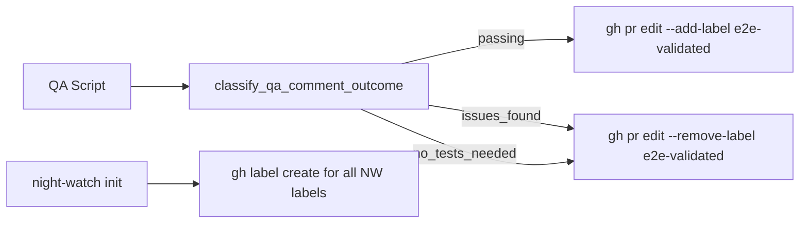
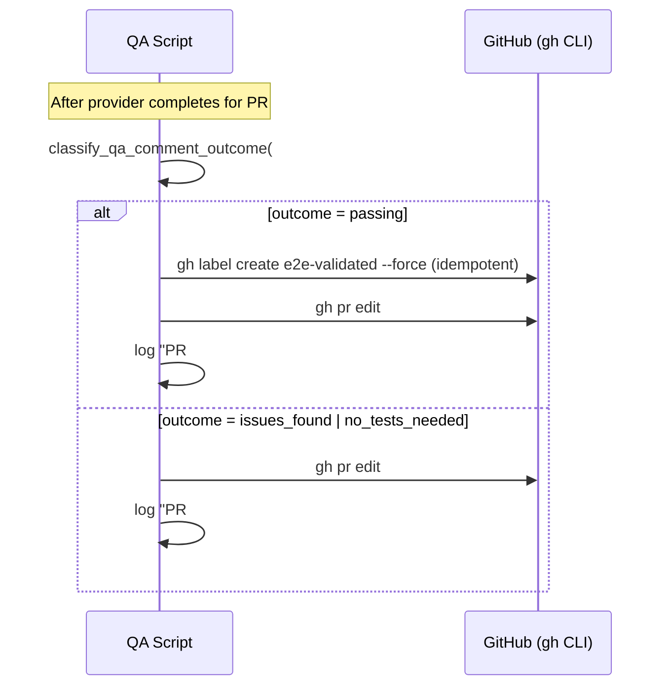

# PRD: E2E Validated Label — Automated Acceptance Proof for PRs

**Complexity: 4 → MEDIUM mode** (+1 touches 5 files, +2 multi-package, +1 external API integration)

## 1. Context

**Problem:** The QA job generates and runs e2e/integration tests on PRs, but there is no way to prove at a glance that a PR's acceptance requirements have been validated. Developers and reviewers must manually inspect QA comments to know if tests passed. There is no GitHub label signaling "this PR's e2e tests prove the work is done."

**Files Analyzed:**
- `packages/cli/scripts/night-watch-qa-cron.sh` — QA bash script, classifies QA outcomes (passing, issues_found, no_tests_needed, unclassified)
- `packages/core/src/board/labels.ts` — label taxonomy (priority, category, horizon, operational)
- `packages/core/src/constants.ts` — `DEFAULT_QA_SKIP_LABEL`, other QA defaults
- `packages/core/src/types.ts` — `IQaConfig`, `INightWatchConfig`
- `packages/cli/src/commands/init.ts` — initialization flow, label creation not currently done
- `packages/cli/src/commands/qa.ts` — QA command, parses script results

**Current Behavior:**
- QA job runs Playwright tests, posts a `<!-- night-watch-qa-marker -->` comment on each PR with results
- `classify_qa_comment_outcome()` already classifies outcomes as `passing`, `issues_found`, `no_tests_needed`, `unclassified`
- `validate_qa_evidence()` already validates QA evidence quality (marker exists, artifacts present)
- No label is applied to PRs that pass QA — the only QA-related label is `skip-qa` (to skip QA)
- The reviewer job adds `needs-human-review` label but nothing signals e2e validation
- Labels are statically defined in `labels.ts` but never auto-created on GitHub during `init`

## 2. Solution

**Approach:**
1. Add an `e2e-validated` label definition to the label taxonomy in `labels.ts`
2. After QA processes each PR, if the outcome is `passing` → apply the `e2e-validated` label via `gh pr edit --add-label`; if outcome is `issues_found` or `no_tests_needed` → remove the label (idempotent)
3. Ensure the label exists on GitHub before applying: add `gh label create` in the QA script (idempotent, `--force` updates if exists)
4. Wire label creation into `night-watch init` so all Night Watch labels (including `e2e-validated`) are synced to GitHub during project initialization
5. Make the label name configurable via `IQaConfig.validatedLabel` with default `e2e-validated`

**Architecture Diagram:**


**Key Decisions:**
- **Reuse existing `classify_qa_comment_outcome()`** — no new classification logic needed; the infrastructure already tells us if tests pass
- **Idempotent label operations** — `--add-label` and `--remove-label` are no-ops if already present/absent; `gh label create --force` updates existing
- **Configurable label name** — `config.qa.validatedLabel` (default: `e2e-validated`) allows customization
- **Label auto-creation** — `gh label create` is called in the QA script before first use (one-time, cached per run) so it works even without `init`
- **Init syncs all labels** — `night-watch init` step now creates all `NIGHT_WATCH_LABELS` on GitHub (including e2e-validated)

**Data Changes:**
- `IQaConfig` gains `validatedLabel: string` field (default: `e2e-validated`)
- `NIGHT_WATCH_LABELS` array gains `e2e-validated` entry
- No database changes

## 3. Sequence Flow



## 4. Execution Phases

### Phase 1: Label Definition & Config — Add `e2e-validated` to the system

**User-visible outcome:** `e2e-validated` label appears in `NIGHT_WATCH_LABELS`, `IQaConfig` has a `validatedLabel` field, and config normalizes correctly.

**Files (5):**
- `packages/core/src/board/labels.ts` — add `e2e-validated` to `NIGHT_WATCH_LABELS`
- `packages/core/src/types.ts` — add `validatedLabel: string` to `IQaConfig`
- `packages/core/src/constants.ts` — add `DEFAULT_QA_VALIDATED_LABEL` constant, update `DEFAULT_QA`
- `packages/core/src/jobs/job-registry.ts` — add `validatedLabel` to QA extra fields
- `packages/core/src/config-normalize.ts` — normalize `validatedLabel` (fallback to default)

**Implementation:**

- [ ] In `labels.ts`, add to `NIGHT_WATCH_LABELS` array:
  ```typescript
  {
    name: 'e2e-validated',
    description: 'PR acceptance requirements validated by e2e/integration tests',
    color: '0e8a16', // green
  },
  ```
- [ ] In `types.ts`, add to `IQaConfig`:
  ```typescript
  /** GitHub label to apply when e2e tests pass (proves acceptance requirements met) */
  validatedLabel: string;
  ```
- [ ] In `constants.ts`:
  ```typescript
  export const DEFAULT_QA_VALIDATED_LABEL = 'e2e-validated';
  ```
  Update `DEFAULT_QA` to include `validatedLabel: DEFAULT_QA_VALIDATED_LABEL`
- [ ] In `job-registry.ts`, add to the QA job's `extraFields`:
  ```typescript
  { name: 'validatedLabel', type: 'string', defaultValue: 'e2e-validated' },
  ```
- [ ] In `config-normalize.ts`, ensure `validatedLabel` is normalized with string fallback (follow `skipLabel` pattern)

**Tests Required:**
| Test File | Test Name | Assertion |
|-----------|-----------|-----------|
| `packages/core/src/__tests__/jobs/job-registry.test.ts` | `qa job has validatedLabel extra field` | `expect(getJobDef('qa').extraFields).toContainEqual(expect.objectContaining({ name: 'validatedLabel' }))` |
| `packages/core/src/__tests__/board/labels.test.ts` | `NIGHT_WATCH_LABELS includes e2e-validated` | `expect(NIGHT_WATCH_LABELS.map(l => l.name)).toContain('e2e-validated')` |

**Verification Plan:**
1. **Unit Tests:** Registry field check, label presence check, config normalization
2. **Evidence:** `yarn verify` passes, `yarn test` passes

---

### Phase 2: QA Script — Apply/Remove Label After Test Classification

**User-visible outcome:** After QA runs on a PR, the `e2e-validated` label is automatically added if tests pass, or removed if tests fail/are not needed.

**Files (2):**
- `packages/cli/scripts/night-watch-qa-cron.sh` — add label application logic after classification
- `packages/cli/src/commands/qa.ts` — pass `validatedLabel` to env vars

**Implementation:**

- [ ] In `qa.ts` `buildEnvVars()`, add:
  ```typescript
  env.NW_QA_VALIDATED_LABEL = config.qa.validatedLabel;
  ```
- [ ] In `night-watch-qa-cron.sh`, read the env var:
  ```bash
  VALIDATED_LABEL="${NW_QA_VALIDATED_LABEL:-e2e-validated}"
  ```
- [ ] Add a helper function `ensure_label_exists()` near the top of the script:
  ```bash
  LABEL_ENSURED=0
  ensure_validated_label() {
    if [ "${LABEL_ENSURED}" -eq 1 ]; then return 0; fi
    gh label create "${VALIDATED_LABEL}" \
      --description "PR acceptance requirements validated by e2e/integration tests" \
      --color "0e8a16" \
      --force 2>/dev/null || true
    LABEL_ENSURED=1
  }
  ```
- [ ] In the per-PR processing loop, after `classify_qa_comment_outcome`, add label logic:
  ```bash
  case "${QA_OUTCOME}" in
    passing)
      PASSING_PRS_CSV=$(append_csv "${PASSING_PRS_CSV}" "#${pr_num}")
      # Apply e2e-validated label
      ensure_validated_label
      gh pr edit "${pr_num}" --add-label "${VALIDATED_LABEL}" 2>/dev/null || true
      log "QA: PR #${pr_num} — added '${VALIDATED_LABEL}' label (tests passing)"
      ;;
    issues_found)
      ISSUES_FOUND_PRS_CSV=$(append_csv "${ISSUES_FOUND_PRS_CSV}" "#${pr_num}")
      # Remove e2e-validated label if present
      gh pr edit "${pr_num}" --remove-label "${VALIDATED_LABEL}" 2>/dev/null || true
      ;;
    no_tests_needed)
      NO_TESTS_PRS_CSV=$(append_csv "${NO_TESTS_PRS_CSV}" "#${pr_num}")
      # Remove e2e-validated label — no tests doesn't prove acceptance
      gh pr edit "${pr_num}" --remove-label "${VALIDATED_LABEL}" 2>/dev/null || true
      ;;
    *)
      UNCLASSIFIED_PRS_CSV=$(append_csv "${UNCLASSIFIED_PRS_CSV}" "#${pr_num}")
      ;;
  esac
  ```
- [ ] In dry-run output, include the validated label setting

**Tests Required:**
| Test File | Test Name | Assertion |
|-----------|-----------|-----------|
| `packages/cli/src/__tests__/commands/qa.test.ts` | `buildEnvVars includes NW_QA_VALIDATED_LABEL` | `expect(env.NW_QA_VALIDATED_LABEL).toBe('e2e-validated')` |
| `packages/cli/src/__tests__/commands/qa.test.ts` | `buildEnvVars uses custom validatedLabel from config` | custom label value passed through |

**Verification Plan:**
1. **Unit Tests:** Env var presence, custom label passthrough
2. **Manual test:** Run `night-watch qa --dry-run` and verify `NW_QA_VALIDATED_LABEL` appears in env vars
3. **Manual test:** Run `night-watch qa` on a repo with a PR that has passing tests → label applied
4. **Evidence:** `yarn verify` passes, label visible on GitHub PR

---

### Phase 3: Init Label Sync — Create All Night Watch Labels on GitHub

**User-visible outcome:** `night-watch init` creates all Night Watch labels (including `e2e-validated`) on GitHub when the repo has a GitHub remote and `gh` is authenticated.

**Files (2):**
- `packages/cli/src/commands/init.ts` — add label sync step
- `packages/core/src/board/labels.ts` — export exists, no changes needed (consumed by init)

**Implementation:**

- [ ] In `init.ts`, add a new step between the board setup step and the global registry step (renumber subsequent steps, update `totalSteps`):
  ```typescript
  // Step 11: Sync Night Watch labels to GitHub
  step(11, totalSteps, 'Syncing Night Watch labels to GitHub...');
  if (!remoteStatus.hasGitHubRemote || !ghAuthenticated) {
    info('Skipping label sync (no GitHub remote or gh not authenticated).');
  } else {
    try {
      const { NIGHT_WATCH_LABELS } = await import('@night-watch/core');
      let created = 0;
      for (const label of NIGHT_WATCH_LABELS) {
        try {
          execSync(
            `gh label create "${label.name}" --description "${label.description}" --color "${label.color}" --force`,
            { cwd, encoding: 'utf-8', stdio: ['pipe', 'pipe', 'pipe'] },
          );
          created++;
        } catch {
          // Label creation is best-effort
        }
      }
      success(`Synced ${created}/${NIGHT_WATCH_LABELS.length} labels to GitHub`);
    } catch (labelErr) {
      warn(`Could not sync labels: ${labelErr instanceof Error ? labelErr.message : String(labelErr)}`);
    }
  }
  ```
- [ ] Update `totalSteps` from 13 to 14, renumber steps 11+ (global registry becomes 12, skills becomes 13, summary becomes 14)
- [ ] Add label sync status to the summary table

**Tests Required:**
| Test File | Test Name | Assertion |
|-----------|-----------|-----------|
| `packages/cli/src/__tests__/commands/init.test.ts` | `init syncs Night Watch labels when gh is authenticated` | execSync called with `gh label create` for each label |
| `packages/cli/src/__tests__/commands/init.test.ts` | `init skips label sync when no GitHub remote` | no label creation calls |

**Verification Plan:**
1. **Unit Tests:** Label sync invocation, skip conditions
2. **Manual test:** Run `night-watch init --force` in a project with GitHub remote → labels visible on GitHub
3. **Evidence:** `yarn verify` passes, labels visible at `https://github.com/{owner}/{repo}/labels`

---

### Phase 4: Dry-Run & Summary Integration

**User-visible outcome:** `night-watch qa --dry-run` shows the validated label config. The emit_result output includes the label information for downstream notification consumers. The QA script idempotency check skips re-processing PRs that already have the label only when the QA comment is also present.

**Files (2):**
- `packages/cli/src/commands/qa.ts` — show validated label in dry-run config table
- `packages/cli/scripts/night-watch-qa-cron.sh` — include validated label stats in emit_result

**Implementation:**

- [ ] In `qa.ts` dry-run section, add a row to the config table:
  ```typescript
  configTable.push(['Validated Label', config.qa.validatedLabel]);
  ```
- [ ] In `night-watch-qa-cron.sh`, add `VALIDATED_PRS_CSV` tracker alongside other CSV trackers:
  ```bash
  VALIDATED_PRS_CSV=""
  ```
- [ ] After applying the `e2e-validated` label for passing PRs, append to `VALIDATED_PRS_CSV`:
  ```bash
  VALIDATED_PRS_CSV=$(append_csv "${VALIDATED_PRS_CSV}" "#${pr_num}")
  ```
- [ ] In `emit_result` calls, include `validated=` field:
  ```bash
  emit_result "success_qa" "prs=...|passing=...|validated=${VALIDATED_PRS_SUMMARY}|..."
  ```
- [ ] Add `VALIDATED_PRS_SUMMARY=$(csv_or_none "${VALIDATED_PRS_CSV}")` alongside other summaries
- [ ] In Telegram status messages, include "E2E validated: ${VALIDATED_PRS_SUMMARY}" line

**Tests Required:**
| Test File | Test Name | Assertion |
|-----------|-----------|-----------|
| `packages/cli/src/__tests__/commands/qa.test.ts` | `dry-run config table includes validatedLabel` | config output contains label name |

**Verification Plan:**
1. **Unit Tests:** Dry-run output includes validated label
2. **Manual test:** `night-watch qa --dry-run` shows "Validated Label: e2e-validated"
3. **Manual test:** After QA run, Telegram message includes "E2E validated" line
4. **Evidence:** `yarn verify` passes

## 5. Acceptance Criteria

- [ ] All 4 phases complete
- [ ] All specified tests pass
- [ ] `yarn verify` passes
- [ ] All automated checkpoint reviews passed
- [ ] `e2e-validated` label is defined in `NIGHT_WATCH_LABELS` with green color (#0e8a16)
- [ ] `IQaConfig.validatedLabel` is configurable with default `e2e-validated`
- [ ] QA script applies label when `classify_qa_comment_outcome()` returns `passing`
- [ ] QA script removes label when outcome is `issues_found` or `no_tests_needed`
- [ ] Label operations are idempotent (no error if label exists/doesn't exist)
- [ ] `night-watch init` creates all Night Watch labels on GitHub (including `e2e-validated`)
- [ ] `night-watch qa --dry-run` shows the validated label in config
- [ ] Label name is configurable via `NW_QA_VALIDATED_LABEL` env var
- [ ] `gh label create --force` ensures label exists before first use in QA script
