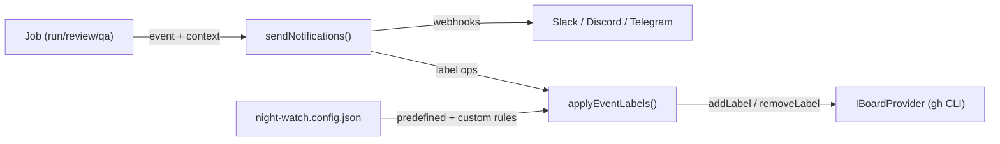
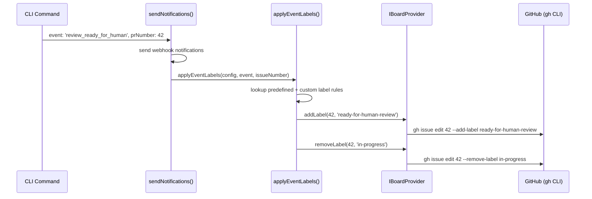

# PRD: Event-Driven Auto Labels

**Complexity: 6 → MEDIUM mode**

- Touches ~8 files across core, server, and web
- Extends existing label + notification systems
- Config schema changes
- No new external deps

---

## 1. Context

**Problem:** Night Watch agents complete jobs (runs, reviews, QA) but never update GitHub issue labels to reflect state transitions. Users must manually label issues as "ready-for-human-review", "needs-attention", etc. — making the board stale.

**Files Analyzed:**

- `packages/core/src/types.ts` — `INightWatchConfig`, `NotificationEvent`
- `packages/core/src/board/labels.ts` — label taxonomy + NIGHT_WATCH_LABELS
- `packages/core/src/board/types.ts` — `IBoardProvider`, `IBoardIssue`
- `packages/core/src/board/providers/github-projects.ts` — gh CLI-based board
- `packages/core/src/utils/notify.ts` — `sendNotifications()` + `INotificationContext`
- `packages/cli/src/commands/run.ts` — executor notification flow
- `packages/cli/src/commands/review.ts` — reviewer notification flow
- `web/pages/Board.tsx` — kanban UI

**Current Behavior:**

- `sendNotifications()` is called after every job with an `INotificationContext` containing the event type + issue/PR metadata
- Labels exist for priority (P0-P2), category, and horizon — but no operational/status labels
- `IBoardProvider` has `createIssue()` with labels but **no `addLabel()` / `removeLabel()` methods**
- Agents have no mechanism to apply labels during or after execution

---

## 2. Solution

**Approach:**

1. **Add operational labels** to the existing label taxonomy: review labels, status labels, and severity labels
2. **Add `addLabel()` / `removeLabel()` to `IBoardProvider`** — implemented via `gh issue edit --add-label` / `--remove-label`
3. **Create `applyEventLabels()`** utility that maps `NotificationEvent` → label operations (add/remove)
4. **Hook into `sendNotifications()`** — after sending webhooks, also apply label changes (DRY: single callsite already covers all events)
5. **Support custom label rules** in `night-watch.config.json` — users define extra label-to-event mappings with agent instructions
6. **Show operational label badges** on the web UI board cards

**Architecture:**



**Key Decisions:**

- Reuse existing `NotificationEvent` type — no new event system
- Labels applied via `IBoardProvider` (not raw `gh` calls) — works with all providers
- Label mapping is a pure config-driven lookup — no complex rules engine
- Custom labels inject instructions into agent prompts so agents can call `applyEventLabels()` at runtime

**Data Changes:** None (labels are GitHub labels, created via `gh label create` at setup time)

---

## 3. Sequence Flow



---

## 4. Execution Phases

### Phase 1: Operational Labels + IBoardProvider Label Methods

**User-visible outcome:** `IBoardProvider` supports adding/removing labels; operational labels defined in taxonomy.

**Files (4):**

- `packages/core/src/board/labels.ts` — add operational label definitions
- `packages/core/src/board/types.ts` — add `addLabel()` / `removeLabel()` to `IBoardProvider`
- `packages/core/src/board/providers/github-projects.ts` — implement via `gh issue edit`
- `packages/core/src/board/providers/local-kanban.ts` — implement for local provider

**Implementation:**

- [ ] Add `OPERATIONAL_LABELS` const array: `['ready-for-human-review', 'in-progress', 'blocked', 'stale', 'anomaly-detected', 'needs-attention', 'critical', 'auto-resolved', 'false-positive', 'escalated']`
- [ ] Add `OperationalLabel` type + `OPERATIONAL_LABEL_INFO` with descriptions
- [ ] Add operational labels to `NIGHT_WATCH_LABELS` array (color: `'0e8a16'` green for review, `'e4e669'` yellow for status, `'d93f0b'` orange for severity)
- [ ] Add `addLabel(issueNumber: number, label: string): Promise<void>` to `IBoardProvider`
- [ ] Add `removeLabel(issueNumber: number, label: string): Promise<void>` to `IBoardProvider`
- [ ] Implement in `GitHubProjectsProvider` using `gh issue edit --add-label` / `--remove-label`
- [ ] Implement in `LocalKanbanProvider` using the kanban repository

**Tests Required:**

| Test File | Test Name | Assertion |
|-----------|-----------|-----------|
| `packages/core/src/__tests__/board/labels.test.ts` | `should include operational labels in NIGHT_WATCH_LABELS` | `expect(names).toContain('ready-for-human-review')` |
| `packages/core/src/__tests__/board/labels.test.ts` | `should validate operational labels` | `isValidOperational('ready-for-human-review') === true` |

**Verification:**

- `yarn verify` passes
- Operational labels appear in `NIGHT_WATCH_LABELS` export

---

### Phase 2: Event-to-Label Mapping + applyEventLabels()

**User-visible outcome:** A utility maps notification events to label add/remove operations.

**Files (3):**

- `packages/core/src/board/event-labels.ts` — new file: mapping + `applyEventLabels()`
- `packages/core/src/types.ts` — add `IAutoLabelConfig` + `ICustomLabelRule` to `INightWatchConfig`
- `packages/core/src/constants.ts` — add `DEFAULT_AUTO_LABEL_CONFIG`

**Implementation:**

- [ ] Define `IAutoLabelConfig` interface:
  ```typescript
  interface IAutoLabelConfig {
    enabled: boolean;
    customRules: ICustomLabelRule[];
  }
  interface ICustomLabelRule {
    label: string;
    event: NotificationEvent;
    action: 'add' | 'remove';
    description: string; // Agent instruction for when to apply
  }
  ```
- [ ] Add `autoLabels: IAutoLabelConfig` to `INightWatchConfig`
- [ ] Add `DEFAULT_AUTO_LABEL_CONFIG` to constants (enabled: true, empty customRules)
- [ ] Define `PREDEFINED_EVENT_LABEL_MAP`:
  ```
  review_ready_for_human → add: 'ready-for-human-review', remove: 'in-progress'
  review_completed       → add: 'in-progress', remove: 'ready-for-human-review'
  run_started            → add: 'in-progress'
  run_succeeded          → remove: 'in-progress'
  run_failed             → add: 'needs-attention', remove: 'in-progress'
  run_timeout            → add: 'needs-attention', remove: 'in-progress'
  qa_completed           → (no default mapping — user defines via custom rules)
  ```
- [ ] Implement `applyEventLabels(provider, config, event, issueNumber)`:
  1. If `!config.autoLabels.enabled`, return
  2. Look up predefined mapping for event
  3. Merge in any custom rules matching the event
  4. Call `provider.addLabel()` / `provider.removeLabel()` for each operation
  5. Silently catch errors (same as webhook — never throw)

**Tests Required:**

| Test File | Test Name | Assertion |
|-----------|-----------|-----------|
| `packages/core/src/__tests__/board/event-labels.test.ts` | `should map review_ready_for_human to correct labels` | adds 'ready-for-human-review', removes 'in-progress' |
| `packages/core/src/__tests__/board/event-labels.test.ts` | `should merge custom rules with predefined` | custom rules applied alongside predefined |
| `packages/core/src/__tests__/board/event-labels.test.ts` | `should skip when disabled` | no provider calls when enabled=false |
| `packages/core/src/__tests__/board/event-labels.test.ts` | `should not throw on provider errors` | swallows errors silently |

**Verification:**

- `yarn verify` passes
- Unit tests pass with mocked `IBoardProvider`

---

### Phase 3: Integration with sendNotifications + CLI Commands

**User-visible outcome:** Labels are automatically applied when events fire after job completion.

**Files (3):**

- `packages/core/src/utils/notify.ts` — add `applyEventLabels()` call alongside webhooks
- `packages/core/src/index.ts` — export new modules
- `packages/core/src/board/index.ts` — export event-labels

**Implementation:**

- [ ] Add `issueNumber?: number` to `INotificationContext` (distinct from `prNumber` — the board issue that triggered the job)
- [ ] In `sendNotifications()`, after webhook dispatch, call `applyEventLabels()` if `ctx.issueNumber` is set and `config.boardProvider.enabled`
- [ ] Create board provider instance inside `sendNotifications()` using the existing factory (or accept it as param)
- [ ] Export `applyEventLabels`, `PREDEFINED_EVENT_LABEL_MAP` from core index
- [ ] Wire `issueNumber` in CLI commands where available (run.ts gets it from PRD state, review.ts may not have it)

**Tests Required:**

| Test File | Test Name | Assertion |
|-----------|-----------|-----------|
| `packages/core/src/__tests__/utils/notify.test.ts` | `should apply event labels when issueNumber present` | `applyEventLabels` called with correct args |
| `packages/core/src/__tests__/utils/notify.test.ts` | `should skip labels when no issueNumber` | `applyEventLabels` not called |

**Verification:**

- `yarn verify` passes
- Existing notification tests still pass
- Run `night-watch run --dry-run` with a board-enabled project → observe label intent in logs

---

### Phase 4: Web UI Label Badges on Board Cards

**User-visible outcome:** Operational labels appear as colored badges on board issue cards.

**Files (2):**

- `web/pages/Board.tsx` — render operational label badges on issue cards
- `web/api.ts` — no changes needed (labels already in `IBoardIssue.labels`)

**Implementation:**

- [ ] Define `OPERATIONAL_LABEL_COLORS` mapping in Board.tsx:
  ```
  'ready-for-human-review' → badge: 'success' (green)
  'in-progress'            → badge: 'info' (blue)
  'blocked'                → badge: 'error' (red)
  'needs-attention'        → badge: 'warning' (amber)
  'critical'               → badge: 'error' (red)
  'anomaly-detected'       → badge: 'warning' (amber)
  'auto-resolved'          → badge: 'neutral' (gray)
  ```
- [ ] In the issue card renderer, filter `issue.labels` for operational labels and render as `<Badge>` components
- [ ] Non-operational labels (P0, category, horizon) continue rendering as they do now

**Tests Required:**

| Test File | Test Name | Assertion |
|-----------|-----------|-----------|
| N/A — visual | Board shows badges | Manual: create issue with operational label → see colored badge |

**Verification:**

- `yarn verify` passes
- Start dev server → Board page → issues with operational labels show colored badges

---

### Phase 5: Custom Label Config in Settings UI

**User-visible outcome:** Users can add custom label-to-event rules in the web settings page.

**Files (3):**

- `web/pages/Settings.tsx` — add Auto Labels section
- `packages/server/src/routes/config.routes.ts` — ensure `autoLabels` is saved/loaded (should work via existing config save)
- `packages/core/src/constants.ts` — ensure default config includes `autoLabels`

**Implementation:**

- [ ] Add "Auto Labels" card in Settings page with:
  - Toggle: enabled/disabled
  - Table showing predefined mappings (read-only)
  - "Custom Rules" section: add/remove custom label-event-action tuples
  - Each custom rule has: label name, event (dropdown of NotificationEvent values), action (add/remove), description (free text — agent instruction)
- [ ] Custom rules are saved to `night-watch.config.json` under `autoLabels.customRules`
- [ ] Show info tooltip: "Custom rules tell the agent when to apply labels. The description field is injected into the agent's prompt."

**Tests Required:**

| Test File | Test Name | Assertion |
|-----------|-----------|-----------|
| N/A — visual | Settings shows auto label config | Manual: open Settings → see Auto Labels card with toggle + rules table |

**Verification:**

- `yarn verify` passes
- Start dev server → Settings page → toggle auto-labels, add custom rule → save → reload → persisted

---

## 5. Acceptance Criteria

- [ ] All phases complete
- [ ] All specified tests pass
- [ ] `yarn verify` passes
- [ ] Predefined labels auto-applied when events fire (review_ready_for_human, run_started, run_failed, etc.)
- [ ] Custom label rules configurable per project in `night-watch.config.json`
- [ ] Custom label rules editable in web UI Settings page
- [ ] Operational label badges visible on board cards in web UI
- [ ] No regressions: existing notification tests pass, existing label extraction works
- [ ] Feature gracefully disabled when `autoLabels.enabled = false`
