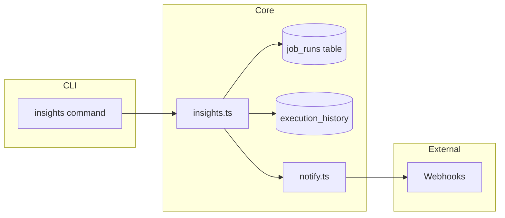
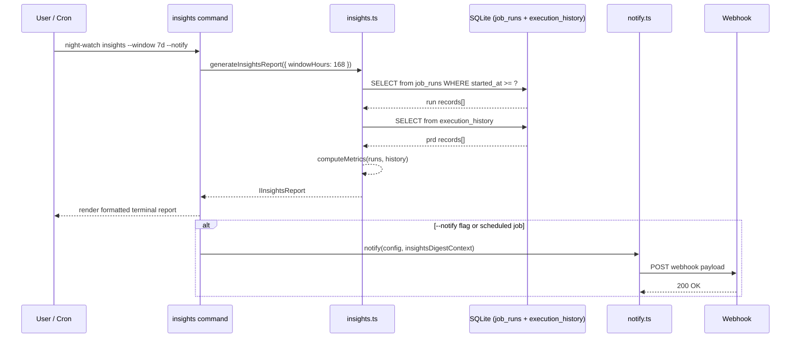

# PRD: Execution Insights & Weekly Digest

`Complexity: 7 → HIGH mode`

## Integration Points Checklist

**How will this feature be reached?**
- [x] Entry point: `night-watch insights` CLI command + `insights` scheduled job in JOB_REGISTRY
- [x] Caller file: `packages/cli/src/cli.ts` registers the command; cron dispatch invokes via job registry
- [x] Registration: command added to CLI, job added to `JOB_REGISTRY`, new notification event `insights_digest`

**Is this user-facing?**
- [x] YES → CLI command with formatted terminal output + webhook digest notification

**Full user flow:**
1. User runs: `night-watch insights` (or `night-watch insights --window 30d --notify`)
2. Triggers: `generateInsightsReport()` in `packages/core/src/utils/insights.ts`
3. Reaches new feature via: CLI command registration in `cli.ts` + job registry for scheduled runs
4. Result displayed in: formatted terminal table/report + optional webhook digest notification

---

## 1. Context

**Problem:** Night Watch runs jobs autonomously overnight, but users have no aggregated view of how their automation is performing — no success rates, no cost estimates, no failure pattern analysis, no trend data. They must manually inspect logs and PRs to gauge effectiveness.

**Files Analyzed:**
- `packages/core/src/utils/job-queue.ts` — `recordJobRun()`, `getJobRunsAnalytics()`, `job_runs` table schema
- `packages/core/src/utils/execution-history.ts` — `IExecutionRecord`, `loadHistory()`, per-PRD outcome tracking
- `packages/core/src/utils/notify.ts` — `INotificationContext`, webhook notification formatting (Slack/Discord/Telegram)
- `packages/core/src/types.ts` — `IJobRunRecord`, `IJobRunAnalytics`, `JobType`, `NotificationEvent`
- `packages/core/src/jobs/job-registry.ts` — `JOB_REGISTRY`, `IJobDefinition`, `IBaseJobConfig`
- `packages/core/src/constants.ts` — default config values pattern
- `packages/cli/src/commands/queue.ts` — existing queue status command pattern
- `packages/cli/src/commands/history.ts` — existing history command pattern

**Current Behavior:**
- `job_runs` table records telemetry per execution (duration, wait time, provider, status) but is only surfaced via `getJobRunsAnalytics()` with a flat 24h window
- `execution_history` tracks per-PRD outcomes (success/failure/timeout/rate\_limited) but has no aggregation
- No success rate calculation, no cost estimation, no trend analysis
- No scheduled digest — users must actively check status/logs
- `getJobRunsAnalytics()` returns raw data with no computed metrics (no success %, no avg duration by job type, no failure breakdown)

## 2. Solution

**Approach:**
- Add `generateInsightsReport()` in `packages/core/src/utils/insights.ts` that queries `job_runs` and `execution_history` tables to compute aggregated metrics over a configurable time window
- Compute: success/failure/timeout rates by job type and provider, average duration trends, estimated cost based on provider pricing tiers, failure pattern breakdown, busiest execution hours
- Add `night-watch insights` CLI command that renders a formatted terminal report using chalk tables
- Add `insights_digest` notification event to send the report as a webhook digest (Slack/Discord/Telegram)
- Register `insights` in `JOB_REGISTRY` as a lightweight scheduled job (weekly by default) that generates and sends the digest automatically

**Architecture Diagram:**



**Key Decisions:**
- [x] No new dependencies — uses existing `better-sqlite3` for queries and `chalk` for terminal output
- [x] Cost estimation uses configurable per-provider price-per-minute rates in config (sensible defaults for Claude/Codex)
- [x] Reuses existing `notify()` pipeline with a new event type — no new notification infrastructure
- [x] Window parameter accepts shorthand (`7d`, `30d`, `24h`) parsed to hours
- [x] Error handling: gracefully returns empty/partial report if tables have no data (never throws)

**Data Changes:**
- No new tables or migrations — reads from existing `job_runs` and `execution_history` tables
- New config field `insights` in `INightWatchConfig` for schedule, window, and cost rates

## 3. Sequence Flow



---

## 4. Execution Phases

### Phase 1: Core Insights Service — Compute metrics from existing data

**Files (4):**
- `packages/core/src/utils/insights.ts` — new file: `generateInsightsReport()`, metric computation
- `packages/core/src/types.ts` — add `IInsightsReport`, `IInsightsConfig`, `IProviderCostRate` interfaces
- `packages/core/src/constants.ts` — add `DEFAULT_INSIGHTS_CONFIG`, `DEFAULT_PROVIDER_COST_RATES`
- `packages/core/src/index.ts` — export new utilities

**Implementation:**

- [ ] Define `IInsightsReport` interface in `types.ts`:
  ```typescript
  export interface IProviderCostRate {
    /** Cost per minute of execution in USD */
    perMinute: number;
  }

  export interface IInsightsConfig {
    enabled: boolean;
    schedule: string;
    maxRuntime: number;
    /** Default lookback window in hours */
    windowHours: number;
    /** Per-provider cost rates (provider key → rate) */
    costRates: Record<string, IProviderCostRate>;
  }

  export interface IInsightsReport {
    windowHours: number;
    generatedAt: number;
    summary: {
      totalRuns: number;
      successCount: number;
      failureCount: number;
      timeoutCount: number;
      successRate: number; // 0-100
      totalDurationMinutes: number;
      estimatedCostUsd: number;
    };
    byJobType: Record<string, {
      total: number;
      successCount: number;
      failureCount: number;
      successRate: number;
      avgDurationMinutes: number;
      totalDurationMinutes: number;
      estimatedCostUsd: number;
    }>;
    byProvider: Record<string, {
      total: number;
      successCount: number;
      successRate: number;
      avgDurationMinutes: number;
      estimatedCostUsd: number;
    }>;
    topFailures: Array<{
      projectPath: string;
      jobType: string;
      failureCount: number;
    }>;
    busiestHours: Array<{
      hour: number;
      runCount: number;
    }>;
  }
  ```
- [ ] Add `'insights_digest'` to the `NotificationEvent` type union in `types.ts`
- [ ] Add `DEFAULT_INSIGHTS_CONFIG` and `DEFAULT_PROVIDER_COST_RATES` in `constants.ts`:
  - Default window: `168` hours (7 days)
  - Default schedule: `'0 8 * * 1'` (Monday 8 AM)
  - Default maxRuntime: `120` seconds
  - Default cost rates: `{ 'claude-native': { perMinute: 0.12 }, 'codex': { perMinute: 0.08 } }`
  - Fallback rate for unknown providers: `0.10` per minute
- [ ] Create `insights.ts` with `generateInsightsReport(windowHours: number, costRates: Record<string, IProviderCostRate>): IInsightsReport`:
  - Open state DB via same `openDb()` pattern as `job-queue.ts`
  - Query `job_runs` within window: `SELECT * FROM job_runs WHERE started_at >= ?`
  - Compute summary: total, success/failure/timeout counts, success rate
  - Group by `job_type`: compute per-type metrics
  - Group by `provider_key`: compute per-provider metrics
  - Compute cost: `(durationSeconds / 60) * costRate.perMinute` per run, summed
  - Compute `topFailures`: group failed runs by (project, jobType), top 5 by count
  - Compute `busiestHours`: extract hour from `started_at`, count per hour, top 5
  - Return `IInsightsReport`
- [ ] Export `generateInsightsReport` from `packages/core/src/index.ts`

**Verification Plan:**

1. **Unit Tests:**
   - File: `packages/core/src/__tests__/utils/insights.test.ts`
   - Tests:
     | Test Name | Assertion |
     |-----------|-----------|
     | `should return empty report when no job runs exist` | `expect(report.summary.totalRuns).toBe(0)` and `successRate` is `0` |
     | `should compute correct success rate` | Insert 7 success + 3 failure runs → `expect(report.summary.successRate).toBe(70)` |
     | `should compute cost estimate from duration and provider rates` | Insert run with 600s duration, rate 0.12/min → `expect(report.summary.estimatedCostUsd).toBeCloseTo(1.20)` |
     | `should group metrics by job type` | Insert executor + reviewer runs → `expect(Object.keys(report.byJobType)).toContain('executor')` |
     | `should group metrics by provider` | Insert claude-native + codex runs → verify both in `byProvider` |
     | `should rank top failures by count` | Insert 5 failures for project A, 2 for B → `expect(report.topFailures[0].failureCount).toBe(5)` |
     | `should respect window parameter` | Insert run outside window → `expect(report.summary.totalRuns)` excludes it |

2. **Evidence Required:**
   - [ ] All unit tests pass
   - [ ] `yarn verify` passes

**Checkpoint:** Automated (prd-work-reviewer)

---

### Phase 2: CLI Command — Render formatted terminal report

**Files (3):**
- `packages/cli/src/commands/insights.ts` — new file: CLI command definition
- `packages/cli/src/cli.ts` — register `insightsCommand`
- `packages/core/src/utils/insights.ts` — add `formatInsightsForTerminal()` helper

**Implementation:**

- [ ] Create `insights.ts` command following the pattern of `queue.ts`:
  - Command: `night-watch insights`
  - Options:
    - `--window <period>` — lookback period, e.g., `24h`, `7d`, `30d` (default: `7d`)
    - `--notify` — send digest via configured webhooks after displaying
    - `--json` — output raw JSON instead of formatted table
  - Parse window shorthand: `7d` → `168` hours, `24h` → `24` hours, `30d` → `720` hours
  - Load config to get `costRates` from `config.insights.costRates`
  - Call `generateInsightsReport(windowHours, costRates)`
  - If `--json`: `console.log(JSON.stringify(report, null, 2))` and return
  - Otherwise: render formatted report via `formatInsightsForTerminal(report)`
- [ ] Add `formatInsightsForTerminal(report: IInsightsReport): string` in `insights.ts` (core):
  - Header: `Night Watch Insights — Last {N} days`
  - Summary block: total runs, success rate (color-coded: green >=80%, yellow >=60%, red <60%), total duration, estimated cost
  - Job type table: columns `Job Type | Runs | Success % | Avg Duration | Est. Cost`
  - Provider table: columns `Provider | Runs | Success % | Avg Duration | Est. Cost`
  - Top failures list (if any): `Project — Job Type — N failures`
  - Busiest hours chart: simple horizontal bar using block chars (`█`)
  - Use `chalk` for coloring (already a dependency)
- [ ] Register command in `cli.ts`: import `insightsCommand` and call `insightsCommand(program)`
- [ ] If `--notify` flag is set: call `sendInsightsDigest()` (implemented in Phase 3)

**Verification Plan:**

1. **Unit Tests:**
   - File: `packages/cli/src/__tests__/commands/insights.test.ts`
   - Tests:
     | Test Name | Assertion |
     |-----------|-----------|
     | `should parse 7d window to 168 hours` | verify parseWindow('7d') === 168 |
     | `should parse 24h window to 24 hours` | verify parseWindow('24h') === 24 |
     | `should parse 30d window to 720 hours` | verify parseWindow('30d') === 720 |
     | `should default to 7d when no window specified` | verify default behavior |

2. **Integration Test (manual):**
   ```bash
   # After building
   node dist/cli.js insights --window 7d
   # Expected: formatted terminal report with metrics (or "No execution data" message)

   node dist/cli.js insights --json
   # Expected: raw JSON output of IInsightsReport
   ```

3. **Evidence Required:**
   - [ ] All tests pass
   - [ ] `yarn verify` passes
   - [ ] Command appears in `night-watch --help`

**Checkpoint:** Automated (prd-work-reviewer) + Manual (verify terminal output formatting)

---

### Phase 3: Notification Digest — Send insights via webhooks

**Files (3):**
- `packages/core/src/utils/notify.ts` — add `insights_digest` formatting for Slack/Discord/Telegram
- `packages/core/src/utils/insights.ts` — add `buildInsightsNotificationContext()` helper
- `packages/core/src/types.ts` — extend `INotificationContext` with optional insights fields

**Implementation:**

- [ ] Add optional insights fields to `INotificationContext` in `notify.ts` (where the interface lives):
  ```typescript
  // Add to INotificationContext:
  insightsReport?: IInsightsReport;
  ```
- [ ] Add `buildInsightsNotificationContext(report: IInsightsReport, projectName: string): INotificationContext` in `insights.ts`:
  - Sets `event: 'insights_digest'`
  - Sets `projectName` to the provided name (or `'all'` for multi-project)
  - Sets `exitCode: 0`
  - Sets `provider: 'system'`
  - Attaches the full report to `insightsReport`
- [ ] Add `insights_digest` case to `getEventEmoji()` in `notify.ts` → return chart emoji
- [ ] Add `insights_digest` case to `getEventTitle()` in `notify.ts` → return `'Execution Insights Digest'`
- [ ] Add Slack formatting for `insights_digest` in the Slack block builder:
  - Header: `Night Watch Weekly Digest`
  - Summary: `{totalRuns} runs | {successRate}% success | ~${estimatedCostUsd} estimated cost`
  - Per-job breakdown in a compact mrkdwn table
  - Top failures section (if any)
- [ ] Add Discord embed formatting for `insights_digest`:
  - Color: `0x5865F2` (blurple)
  - Fields for summary, job breakdown, cost
- [ ] Add Telegram formatting for `insights_digest`:
  - MarkdownV2 structured message with escaped special chars

**Verification Plan:**

1. **Unit Tests:**
   - File: `packages/core/src/__tests__/utils/insights.test.ts` (extend)
   - Tests:
     | Test Name | Assertion |
     |-----------|-----------|
     | `should build valid notification context from report` | `expect(ctx.event).toBe('insights_digest')` |
     | `should include report summary in notification context` | `expect(ctx.insightsReport?.summary.totalRuns).toBeDefined()` |

2. **Integration Test (manual):**
   ```bash
   node dist/cli.js insights --window 7d --notify
   # Expected: terminal report displayed AND webhook notification sent
   ```

3. **Evidence Required:**
   - [ ] All tests pass
   - [ ] `yarn verify` passes

**Checkpoint:** Automated (prd-work-reviewer) + Manual (verify webhook payload in Slack/Discord)

---

### Phase 4: Job Registry & Config — Scheduled weekly digest

**Files (4):**
- `packages/core/src/jobs/job-registry.ts` — add `insights` job definition
- `packages/core/src/types.ts` — add `'insights'` to `JobType` union, add `insights` field to `INightWatchConfig`
- `packages/core/src/constants.ts` — add defaults for insights config
- `packages/cli/src/commands/insights.ts` — add scheduled execution path (job entry point)

**Implementation:**

- [ ] Add `'insights'` to the `JobType` union in `types.ts`
- [ ] Add `insights?: IInsightsConfig` to `INightWatchConfig` in `types.ts`
- [ ] Add `insights` entry to `JOB_REGISTRY` in `job-registry.ts`:
  ```typescript
  {
    id: 'insights',
    name: 'Insights',
    description: 'Generates execution insights digest and sends notifications',
    cliCommand: 'insights',
    logName: 'insights',
    lockSuffix: '-insights.lock',
    queuePriority: 5,
    envPrefix: 'NW_INSIGHTS',
    extraFields: [
      { name: 'windowHours', type: 'number', defaultValue: 168 },
    ],
    defaultConfig: {
      enabled: false,
      schedule: '0 8 * * 1',
      maxRuntime: 120,
      windowHours: 168,
    },
  }
  ```
- [ ] Add `DEFAULT_INSIGHTS_CONFIG` in `constants.ts` with `enabled: false` (opt-in), `schedule: '0 8 * * 1'`, `windowHours: 168`, default cost rates
- [ ] Update `insights` CLI command to detect scheduled invocation via `NW_INSIGHTS_ENABLED` env pattern (consistent with other jobs) and auto-send notification without `--notify` flag when running as a scheduled job

**Verification Plan:**

1. **Unit Tests:**
   - File: `packages/core/src/__tests__/jobs/job-registry.test.ts` (extend or new)
   - Tests:
     | Test Name | Assertion |
     |-----------|-----------|
     | `should include insights in JOB_REGISTRY` | `expect(getJobDef('insights')).toBeDefined()` |
     | `should have correct defaults for insights job` | `expect(def.defaultConfig.enabled).toBe(false)` |
     | `should include insights in getValidJobTypes()` | `expect(getValidJobTypes()).toContain('insights')` |

2. **Evidence Required:**
   - [ ] All tests pass
   - [ ] `yarn verify` passes
   - [ ] `night-watch install` includes insights in cron schedule (when enabled)

**Checkpoint:** Automated (prd-work-reviewer)

---

### Phase 5: Tests & Polish — Comprehensive test coverage and edge cases

**Files (3):**
- `packages/core/src/__tests__/utils/insights.test.ts` — comprehensive unit tests
- `packages/core/src/utils/insights.ts` — edge case handling
- `packages/cli/src/__tests__/commands/insights.test.ts` — CLI command tests

**Implementation:**

- [ ] Add edge case tests for insights service:
  - Empty database (no job\_runs or execution\_history records)
  - All runs in one job type / one provider
  - Runs with `null` duration (still in progress when queried)
  - Very large window (365d) with many records
  - Cost calculation with unknown provider key (uses fallback rate)
- [ ] Add CLI command tests:
  - Window parsing edge cases (`0d`, negative, invalid format → default to 7d)
  - JSON output mode produces valid JSON
  - `--notify` flag with no configured webhooks logs a warning but doesn't crash
- [ ] Ensure `formatInsightsForTerminal()` handles zero-division (0 total runs → 0% success rate, not NaN)
- [ ] Add `insights` to the `VALID_JOB_TYPES` array in `packages/cli/src/commands/queue.ts` if it's hardcoded there

**Verification Plan:**

1. **Unit Tests:**
   - All tests from Phases 1-4 plus edge case tests above

2. **Full Verification:**
   ```bash
   yarn verify
   yarn test packages/core/src/__tests__/utils/insights.test.ts
   yarn test packages/cli/src/__tests__/commands/insights.test.ts
   ```

3. **Evidence Required:**
   - [ ] All tests pass
   - [ ] `yarn verify` passes
   - [ ] No regressions in existing tests

**Checkpoint:** Automated (prd-work-reviewer)

---

## 5. Acceptance Criteria

- [ ] All 5 phases complete
- [ ] All specified tests pass (unit tests for insights service, CLI command, notification formatting)
- [ ] `yarn verify` passes
- [ ] All automated checkpoint reviews passed
- [ ] `night-watch insights` is reachable via CLI and appears in `--help`
- [ ] `night-watch insights --window 7d` renders a formatted terminal report with: success rate, per-job breakdown, per-provider breakdown, cost estimate, top failures, busiest hours
- [ ] `night-watch insights --json` outputs valid JSON matching `IInsightsReport`
- [ ] `night-watch insights --notify` sends a digest notification via configured webhooks
- [ ] `insights` job type appears in `JOB_REGISTRY` and can be scheduled via `night-watch install`
- [ ] Zero-data edge case renders a clean "No execution data found" message instead of crashing
- [ ] Cost estimation uses configurable per-provider rates with sensible defaults