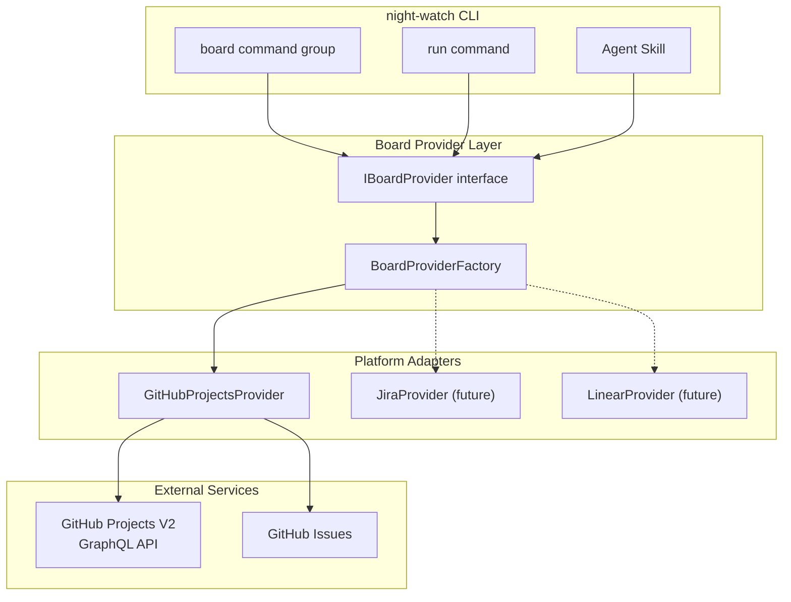
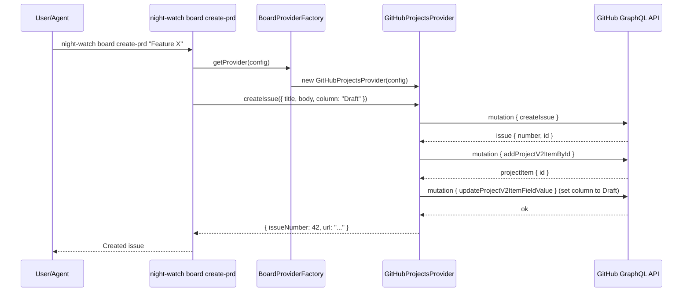
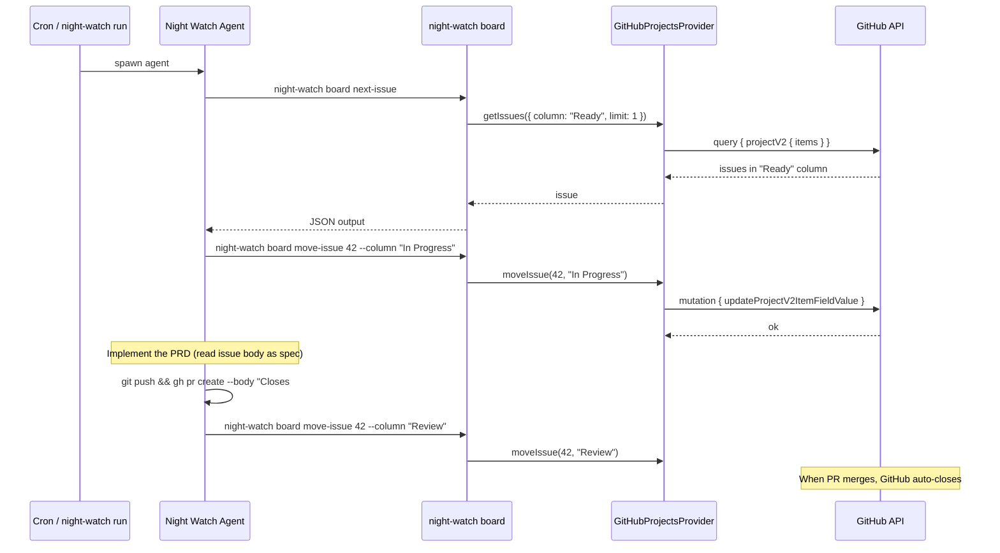

# PRD: GitHub Projects as PRD Source of Truth

**Complexity: 8 → HIGH mode**

```text
COMPLEXITY SCORE (sum all that apply):
+3  Touches 10+ files
+2  New system/module from scratch (board provider abstraction)
+1  External API integration (GitHub Projects V2 GraphQL)
+2  Multi-package changes (CLI + agent skill files + bash scripts)
= 8 → HIGH
```

---

## 1. Context

**Problem:** `.md`-based PRDs have no status tracking, no board visibility, and agents cannot easily update progress — making the entire PRD lifecycle a manual hack.

**Files Analyzed:**
- `src/commands/prd.ts` — current PRD create/list via filesystem
- `src/cli.ts` — CLI command registration (Commander.js)
- `src/types.ts` — `INightWatchConfig`, `Provider`, `PrdStatus`
- `src/storage/repositories/interfaces.ts` — existing repository pattern
- `src/utils/github.ts` — existing `gh` CLI wrappers
- `src/config.ts` — config loading hierarchy
- `src/constants.ts` — default config values
- `scripts/night-watch-helpers.sh` — `find_eligible_prd()`, `claim_prd()`, `mark_prd_done()`
- `scripts/night-watch-cron.sh` — cron executor (reads PRD from filesystem)
- `.claude/commands/night-watch.md` — agent skill (scans `docs/PRDs/night-watch/`)
- `.claude/commands/prd-executor.md` — advanced orchestrator
- `shared/types.ts` — `IPrdInfo`, `IStatusSnapshot`

**Current Behavior:**
- PRDs live as `.md` files in `docs/PRDs/night-watch/`; status is inferred from directory (`done/`, claim files)
- `find_eligible_prd()` in bash scans the filesystem, checks dependencies via text parsing, and returns the first eligible PRD
- The night-watch agent skill hard-codes scanning `docs/PRDs/night-watch/` and moving files to `done/`
- No board view, no column-based workflow, no external visibility
- Status tracking is fragile: claim files, lock files, and `NIGHT-WATCH-SUMMARY.md`

---

## 2. Solution

**Approach:**
- Introduce a **board provider abstraction** (`IBoardProvider`) that defines CRUD operations for boards, columns, and issues — decoupled from any specific platform
- Implement a **GitHub Projects V2 adapter** as the first provider, using `gh` CLI and GraphQL API
- Add `night-watch board` CLI commands for setup, PRD creation, and status viewing
- Migrate the agent skill files to read/write from the board provider instead of scanning `.md` files
- Agents autonomously move cards across columns (Draft → Ready → In Progress → Review → Done)

**Architecture:**



**Key Decisions:**
- [x] Use `gh api graphql` for GitHub Projects V2 (already authenticated, no extra deps)
- [x] Board columns: Draft → Ready → In Progress → Review → Done (matches PRD lifecycle)
- [x] Each PRD phase/task = one GitHub Issue, linked to the project board
- [x] Agent updates issue status via `night-watch board update-issue` CLI subcommand (agents call CLI, not TypeScript directly)
- [x] PRs auto-link to issues via `Closes #N` in PR body
- [x] Config stores `boardProvider` settings in `night-watch.config.json`
- [x] `.md` PRD content becomes the issue body — no separate file needed
- [x] Backward compatible: if `boardProvider` is not configured, fall back to filesystem-based PRD scanning

**Data Changes:**
- New config fields in `INightWatchConfig`: `boardProvider: IBoardProviderConfig`
- No database schema changes (board state lives on GitHub, not SQLite)

---

## 3. Sequence Flow

### PRD Creation Flow


### Agent Execution Flow


---

## 4. Execution Phases

### Integration Points Checklist

```markdown
**How will this feature be reached?**
- [x] Entry point: `night-watch board <subcommand>` CLI commands
- [x] Caller file: `src/cli.ts` registers `boardCommand(program)`
- [x] Registration: new command module in `src/commands/board.ts`
- [x] Agent integration: agent skill files call `night-watch board next-issue` / `move-issue` instead of scanning filesystem

**Is this user-facing?**
- [x] YES → CLI commands with terminal output (tables, success messages)
- [x] YES → GitHub Projects board IS the UI (no custom web UI needed)

**Full user flow:**
1. User runs `night-watch board setup` → creates GitHub Project with lifecycle columns
2. User/agent runs `night-watch board create-prd "Feature"` → creates issue on board in Draft column
3. User moves issue to "Ready" column (or agent does it after PRD review)
4. Cron triggers `night-watch run` → agent calls `night-watch board next-issue` → gets first Ready issue
5. Agent moves issue to "In Progress" → implements → opens PR with `Closes #42` → moves to "Review"
6. PR merges → GitHub auto-closes issue → agent moves to "Done" (or auto via GitHub automation)
```

---

### Phase 1: Board Provider Abstraction + Types

**User-visible outcome:** The `IBoardProvider` interface and types exist, along with a factory that can instantiate providers. `yarn verify` passes.

**Files (max 5):**
- `src/board/types.ts` — board provider types and interfaces
- `src/board/factory.ts` — `BoardProviderFactory` to instantiate providers by name
- `src/types.ts` — add `IBoardProviderConfig` to `INightWatchConfig`
- `src/constants.ts` — add default board provider config values

**Implementation:**

- [ ] Create `src/board/types.ts` with the core abstraction:
  ```ts
  export type BoardColumnName = "Draft" | "Ready" | "In Progress" | "Review" | "Done";

  export const BOARD_COLUMNS: BoardColumnName[] = [
    "Draft", "Ready", "In Progress", "Review", "Done"
  ];

  export interface IBoardInfo {
    id: string;
    title: string;
    url: string;
  }

  export interface IBoardColumn {
    id: string;
    name: BoardColumnName;
  }

  export interface IBoardIssue {
    id: string;
    number: number;
    title: string;
    body: string;
    url: string;
    column: BoardColumnName | null;
    labels: string[];
    assignees: string[];
  }

  export interface ICreateIssueInput {
    title: string;
    body: string;
    column?: BoardColumnName;
    labels?: string[];
  }

  export interface IBoardProvider {
    /** Create a new project board with lifecycle columns. Returns board info. */
    setupBoard(title: string): Promise<IBoardInfo>;

    /** Get the configured board. Returns null if not set up. */
    getBoard(): Promise<IBoardInfo | null>;

    /** List all columns on the board. */
    getColumns(): Promise<IBoardColumn[]>;

    /** Create a GitHub issue and add it to the board in the specified column. */
    createIssue(input: ICreateIssueInput): Promise<IBoardIssue>;

    /** Get a single issue by number. */
    getIssue(issueNumber: number): Promise<IBoardIssue | null>;

    /** List issues in a specific column, ordered by priority. */
    getIssuesByColumn(column: BoardColumnName): Promise<IBoardIssue[]>;

    /** List all issues on the board. */
    getAllIssues(): Promise<IBoardIssue[]>;

    /** Move an issue to a different column. */
    moveIssue(issueNumber: number, targetColumn: BoardColumnName): Promise<void>;

    /** Close an issue (e.g., when done). */
    closeIssue(issueNumber: number): Promise<void>;

    /** Add a comment to an issue. */
    commentOnIssue(issueNumber: number, body: string): Promise<void>;
  }

  export type BoardProviderType = "github" | "jira" | "linear";

  export interface IBoardProviderConfig {
    enabled: boolean;
    provider: BoardProviderType;
    /** GitHub Projects V2 project number (set after `board setup`) */
    projectNumber?: number;
    /** Repository owner/name (auto-detected from git remote) */
    repo?: string;
  }
  ```

- [ ] Create `src/board/factory.ts`:
  ```ts
  import { IBoardProvider, IBoardProviderConfig } from "./types.js";

  export function createBoardProvider(config: IBoardProviderConfig, cwd: string): IBoardProvider {
    switch (config.provider) {
      case "github":
        // Dynamic import to avoid loading GitHub-specific code when not needed
        const { GitHubProjectsProvider } = require("./providers/github-projects.js");
        return new GitHubProjectsProvider(config, cwd);
      default:
        throw new Error(`Unsupported board provider: ${config.provider}. Supported: github`);
    }
  }
  ```

- [ ] Update `src/types.ts` — add `boardProvider` to `INightWatchConfig`:
  ```ts
  import { IBoardProviderConfig } from "./board/types.js";
  // Add to INightWatchConfig:
  /** Board provider configuration for PRD tracking */
  boardProvider: IBoardProviderConfig;
  ```

- [ ] Update `src/constants.ts` — add default:
  ```ts
  boardProvider: {
    enabled: false,
    provider: "github" as const,
  }
  ```

**Tests Required:**
| Test File | Test Name | Assertion |
|-----------|-----------|-----------|
| `src/__tests__/board/factory.test.ts` | `should throw for unsupported provider` | throws with "Unsupported board provider" |
| `src/__tests__/board/types.test.ts` | `BOARD_COLUMNS has correct order` | 5 columns in lifecycle order |

**Verification Plan:**
1. `yarn verify` passes
2. `yarn test src/__tests__/board/`

---

### Phase 2: GitHub Projects V2 Adapter

**User-visible outcome:** The `GitHubProjectsProvider` can create boards, issues, and move cards using the GitHub GraphQL API via `gh` CLI.

**Files (max 5):**
- `src/board/providers/github-projects.ts` — full GitHub Projects V2 adapter implementation
- `src/board/providers/github-graphql.ts` — low-level GraphQL query helpers (wraps `gh api graphql`)
- `src/__tests__/board/providers/github-projects.test.ts` — unit tests with mocked `gh` calls

**Implementation:**

- [ ] Create `src/board/providers/github-graphql.ts` — thin wrapper for `gh api graphql`:
  ```ts
  import { execFileSync } from "child_process";

  export function graphql<T>(query: string, variables: Record<string, unknown>, cwd: string): T {
    const args = ["api", "graphql", "-f", `query=${query}`];
    for (const [key, value] of Object.entries(variables)) {
      args.push("-f", `${key}=${String(value)}`);
    }
    const output = execFileSync("gh", args, {
      cwd, encoding: "utf-8", stdio: ["pipe", "pipe", "pipe"],
    });
    const parsed = JSON.parse(output);
    if (parsed.errors?.length) {
      throw new Error(`GraphQL error: ${parsed.errors[0].message}`);
    }
    return parsed.data as T;
  }

  export function getRepoNwo(cwd: string): string {
    // Extract owner/repo from git remote
    const output = execFileSync("gh", ["repo", "view", "--json", "nameWithOwner", "-q", ".nameWithOwner"], {
      cwd, encoding: "utf-8", stdio: ["pipe", "pipe", "pipe"],
    });
    return output.trim();
  }
  ```

- [ ] Create `src/board/providers/github-projects.ts` — implements `IBoardProvider`:
  - `setupBoard(title)`: creates a Project V2 via `createProjectV2` mutation, then adds Status field options for each column
  - `getBoard()`: queries user's projects to find one matching configured `projectNumber`
  - `getColumns()`: reads Status field options from the project
  - `createIssue(input)`: creates a repo issue via `createIssue` mutation, then adds it to the project and sets column
  - `getIssue(number)`: fetches issue details + project item field value (column)
  - `getIssuesByColumn(column)`: queries project items filtered by Status field value
  - `getAllIssues()`: queries all project items
  - `moveIssue(number, column)`: updates the project item's Status field
  - `closeIssue(number)`: closes the issue via `updateIssue` mutation
  - `commentOnIssue(number, body)`: adds comment via `addComment` mutation
  - Internal: caches projectId, fieldId, and column option IDs after first lookup to minimize API calls

- [ ] Key GraphQL queries to implement:
  - Create project: `mutation { createProjectV2(input: { ownerId, title }) { projectV2 { id number url } } }`
  - Get project: `query { user(login) { projectV2(number) { id title url } } }` (or `organization`)
  - Get status field: `query { node(id: projectId) { ... on ProjectV2 { field(name: "Status") { ... on ProjectV2SingleSelectField { id options { id name } } } } } }`
  - Add item: `mutation { addProjectV2ItemById(input: { projectId, contentId: issueNodeId }) { item { id } } }`
  - Update status: `mutation { updateProjectV2ItemFieldValue(input: { projectId, itemId, fieldId, value: { singleSelectOptionId } }) { ... } }`
  - Create issue: `gh issue create --title "..." --body "..." --repo owner/repo` (simpler via REST)
  - List project items: `query { node(id: projectId) { ... on ProjectV2 { items(first: 100) { nodes { id content { ... on Issue { number title body url } } fieldValues(first: 10) { nodes { ... on ProjectV2ItemFieldSingleSelectValue { name } } } } } } } }`

**Tests Required:**
| Test File | Test Name | Assertion |
|-----------|-----------|-----------|
| `src/__tests__/board/providers/github-projects.test.ts` | `setupBoard creates project with correct columns` | `gh api graphql` called with createProjectV2 mutation |
| `src/__tests__/board/providers/github-projects.test.ts` | `createIssue creates issue and adds to board` | issue created + added to project |
| `src/__tests__/board/providers/github-projects.test.ts` | `moveIssue updates status field` | updateProjectV2ItemFieldValue called |
| `src/__tests__/board/providers/github-projects.test.ts` | `getIssuesByColumn filters by status` | returns only issues in target column |
| `src/__tests__/board/providers/github-projects.test.ts` | `getBoard returns null when project not found` | returns null |

**Verification Plan:**
1. `yarn verify` passes
2. `yarn test src/__tests__/board/providers/`
3. Manual (after Phase 3): `night-watch board setup` creates a real project on GitHub

---

### Phase 3: CLI `board` Command Group

**User-visible outcome:** Users can run `night-watch board setup`, `night-watch board create-prd`, `night-watch board status`, and `night-watch board next-issue` from the terminal.

**Files (max 5):**
- `src/commands/board.ts` — board command group with subcommands
- `src/cli.ts` — register `boardCommand(program)`
- `src/config.ts` — load `boardProvider` config field
- `src/utils/config-writer.ts` — persist `projectNumber` after setup

**Implementation:**

- [ ] Create `src/commands/board.ts` with subcommands:

  **`night-watch board setup`**
  - Loads config, calls `provider.setupBoard("Night Watch")`
  - Writes the resulting `projectNumber` back to `night-watch.config.json` via config-writer
  - Prints board URL and column names
  - If board already exists (projectNumber set), prompt for confirmation before creating a new one

  **`night-watch board create-prd <title>`**
  - Options: `--body <text>`, `--body-file <path>`, `--column <name>` (default: "Draft"), `--label <name>`
  - Calls `provider.createIssue({ title, body, column })`
  - Prints issue number and URL

  **`night-watch board status`**
  - Options: `--json`
  - Calls `provider.getAllIssues()` and groups by column
  - Prints a table: Column | Issue # | Title
  - Shows count per column

  **`night-watch board next-issue`**
  - Options: `--column <name>` (default: "Ready"), `--json`
  - Calls `provider.getIssuesByColumn(column)` and returns the first one
  - `--json` outputs full issue JSON (for agent consumption)
  - Prints issue number, title, and body preview

  **`night-watch board move-issue <number>`**
  - Required option: `--column <name>`
  - Calls `provider.moveIssue(number, column)`
  - Prints confirmation

  **`night-watch board comment <number>`**
  - Required option: `--body <text>`
  - Calls `provider.commentOnIssue(number, body)`

- [ ] Register in `src/cli.ts`:
  ```ts
  import { boardCommand } from './commands/board.js';
  boardCommand(program);
  ```

- [ ] Update `src/config.ts` to handle `boardProvider` field in config loading (merge with defaults)

- [ ] Update `src/utils/config-writer.ts` — add helper to update just the `boardProvider.projectNumber` field

**Tests Required:**
| Test File | Test Name | Assertion |
|-----------|-----------|-----------|
| `src/__tests__/commands/board.test.ts` | `board setup creates board and persists projectNumber` | config file updated with projectNumber |
| `src/__tests__/commands/board.test.ts` | `board create-prd creates issue in Draft column` | `createIssue` called with column: "Draft" |
| `src/__tests__/commands/board.test.ts` | `board next-issue returns first Ready issue as JSON` | JSON output with issue fields |
| `src/__tests__/commands/board.test.ts` | `board move-issue updates column` | `moveIssue` called with correct args |
| `src/__tests__/commands/board.test.ts` | `board status groups issues by column` | table output with correct grouping |

**Verification Plan:**
1. `yarn verify && yarn test src/__tests__/commands/board.test.ts`
2. Manual: `night-watch board setup` → check GitHub for new project
3. Manual: `night-watch board create-prd "Test PRD" --body "Some description"` → check issue appears on board
4. Manual: `night-watch board status` → shows table of issues by column
5. Manual: `night-watch board move-issue 1 --column "Ready"` → issue moves on board

---

### Phase 4: Agent Read Integration — Board as Source of Truth

**User-visible outcome:** The night-watch agent reads eligible tasks from the GitHub Projects board instead of scanning `.md` files. Running `night-watch run` with `boardProvider.enabled: true` picks up the next "Ready" issue from the board.

**Files (max 5):**
- `.claude/commands/night-watch.md` — rewrite PRD scanning to use `night-watch board next-issue`
- `scripts/night-watch-cron.sh` — update `find_eligible_prd()` to use board provider when configured
- `scripts/night-watch-helpers.sh` — add `find_eligible_board_issue()` function
- `src/commands/run.ts` — pass `NW_BOARD_ENABLED` env var to bash script

**Implementation:**

- [ ] Update `scripts/night-watch-helpers.sh` — add board-aware PRD discovery:
  ```bash
  find_eligible_board_issue() {
    local project_dir="$1"
    # Use night-watch CLI to query the board
    local result
    result=$("$NW_CLI_BIN" board next-issue --column "Ready" --json 2>/dev/null)
    if [ $? -ne 0 ] || [ -z "$result" ]; then
      echo ""
      return 1
    fi
    echo "$result"
    return 0
  }
  ```

- [ ] Update `scripts/night-watch-cron.sh` — branch on `NW_BOARD_ENABLED`:
  ```bash
  if [ "$NW_BOARD_ENABLED" = "true" ]; then
    ISSUE_JSON=$(find_eligible_board_issue "$PROJECT_DIR")
    if [ -z "$ISSUE_JSON" ]; then
      emit_result "skip_no_prd" "reason=no ready issues on board"
      exit 0
    fi
    ISSUE_NUMBER=$(echo "$ISSUE_JSON" | jq -r '.number')
    ISSUE_TITLE=$(echo "$ISSUE_JSON" | jq -r '.title')
    ISSUE_BODY=$(echo "$ISSUE_JSON" | jq -r '.body')
    PRD_NAME=$(echo "$ISSUE_TITLE" | tr '[:upper:]' '[:lower:]' | sed 's/[^a-z0-9]/-/g' | sed 's/--*/-/g' | sed 's/^-\|-$//g')

    # Move to In Progress
    "$NW_CLI_BIN" board move-issue "$ISSUE_NUMBER" --column "In Progress"

    # Use issue body as PRD content (passed to agent via stdin)
    PRD_CONTENT="$ISSUE_BODY"
  else
    # Existing filesystem-based PRD discovery
    PRD_FILE=$(find_eligible_prd "$PRD_DIR")
    # ... existing logic ...
  fi
  ```

- [ ] Update `src/commands/run.ts` — add `NW_BOARD_ENABLED` to env vars:
  ```ts
  if (config.boardProvider?.enabled) {
    env.NW_BOARD_ENABLED = "true";
  }
  ```

- [ ] Update `.claude/commands/night-watch.md` — add board-aware instructions:
  ```markdown
  ## Board Mode (when boardProvider is enabled)

  If the project uses a board provider (check: `night-watch board status` succeeds):

  1. **Get next task**: `night-watch board next-issue --json`
     - This returns the first issue in the "Ready" column
     - If no issues are ready, STOP — nothing to do

  2. **Claim the task**: `night-watch board move-issue <number> --column "In Progress"`

  3. **Read the spec**: The issue body IS the PRD. Parse it for phases and requirements.

  4. **Branch naming**: `night-watch/<issue-number>-<slugified-title>`

  5. **Implement** as normal (create branch, worktree, implement, test, commit)

  6. **Open PR**: `gh pr create --body "Closes #<issue-number>\n\n<summary>"`
     - The `Closes #N` ensures the issue auto-closes when the PR merges

  7. **Move to Review**: `night-watch board move-issue <number> --column "Review"`

  8. **Comment on issue**: `night-watch board comment <number> --body "PR opened: <url>"`

  9. **Clean up** worktree and STOP (one task per run)
  ```

**Tests Required:**
| Test File | Test Name | Assertion |
|-----------|-----------|-----------|
| `src/__tests__/commands/run.test.ts` | `sets NW_BOARD_ENABLED when boardProvider is enabled` | env contains NW_BOARD_ENABLED=true |
| `src/__tests__/commands/run.test.ts` | `does not set NW_BOARD_ENABLED when boardProvider disabled` | env does not contain NW_BOARD_ENABLED |

**Verification Plan:**
1. `yarn verify && yarn test`
2. Manual: configure `boardProvider.enabled: true` in config, create a "Ready" issue on board
3. Manual: `night-watch run --dry-run` → shows it would pick up the board issue
4. Manual: verify agent reads issue body as PRD spec

---

### Phase 5: Agent Write Integration — Autonomous Board Updates

**User-visible outcome:** After implementing a PRD, the agent automatically moves the issue to "Review", comments with the PR link, and the issue auto-closes when the PR merges. The full lifecycle is visible on the GitHub Projects board.

**Files (max 5):**
- `scripts/night-watch-cron.sh` — add post-execution board updates (move to Review, comment)
- `.claude/commands/night-watch-pr-reviewer.md` — update reviewer to check board issues instead of filesystem
- `src/commands/board.ts` — add `board close-issue` subcommand (for manual/agent use)
- `.claude/commands/prd-executor.md` — update advanced orchestrator for board mode

**Implementation:**

- [ ] Update `scripts/night-watch-cron.sh` — after successful PR creation in board mode:
  ```bash
  if [ "$NW_BOARD_ENABLED" = "true" ] && [ -n "$ISSUE_NUMBER" ]; then
    # Move issue to Review
    "$NW_CLI_BIN" board move-issue "$ISSUE_NUMBER" --column "Review"
    # Comment with PR link
    "$NW_CLI_BIN" board comment "$ISSUE_NUMBER" --body "PR opened: $PR_URL"
  fi
  ```

- [ ] Update `scripts/night-watch-cron.sh` — on failure in board mode:
  ```bash
  if [ "$NW_BOARD_ENABLED" = "true" ] && [ -n "$ISSUE_NUMBER" ]; then
    # Move back to Ready (so it can be retried)
    "$NW_CLI_BIN" board move-issue "$ISSUE_NUMBER" --column "Ready"
    # Comment with failure reason
    "$NW_CLI_BIN" board comment "$ISSUE_NUMBER" --body "Execution failed: $FAILURE_REASON. Moved back to Ready."
  fi
  ```

- [ ] Update `.claude/commands/night-watch-pr-reviewer.md` — board-aware review:
  ```markdown
  ## Board Mode

  When board provider is enabled:
  1. Find open PRs that reference board issues (`Closes #N`)
  2. After fixing CI/review issues and pushing, comment on the issue:
     `night-watch board comment <N> --body "Review fixes pushed: <commit>"`
  3. If review score >= threshold AND CI passes, move to Done:
     `night-watch board move-issue <N> --column "Done"`
  ```

- [ ] Add `board close-issue <number>` subcommand in `src/commands/board.ts`:
  - Calls `provider.closeIssue(number)`
  - Also moves to "Done" column

- [ ] Update `.claude/commands/prd-executor.md` — board-aware orchestration:
  - Instead of scanning filesystem, use `night-watch board next-issue`
  - After parallel phase execution, move issue through columns
  - Final: move to "Review" and open PR

**Tests Required:**
| Test File | Test Name | Assertion |
|-----------|-----------|-----------|
| `src/__tests__/commands/board.test.ts` | `board close-issue closes and moves to Done` | `closeIssue` + `moveIssue` called |

**Verification Plan:**
1. `yarn verify && yarn test`
2. Manual: full end-to-end — create issue on board → set to Ready → run agent → verify PR references issue → merge PR → verify issue auto-closes
3. Verify board columns show correct state at each step

---

## 5. Acceptance Criteria

- [ ] All phases complete
- [ ] All specified tests pass
- [ ] `yarn verify` passes
- [ ] All automated checkpoint reviews passed
- [ ] `IBoardProvider` interface is platform-agnostic (no GitHub-specific types leak out)
- [ ] `GitHubProjectsProvider` fully implements `IBoardProvider` using `gh` CLI
- [ ] `night-watch board setup` creates a GitHub Project with 5 lifecycle columns
- [ ] `night-watch board create-prd` creates an issue and places it on the board
- [ ] `night-watch board next-issue --json` returns the first "Ready" issue for agent consumption
- [ ] `night-watch board move-issue` moves cards between columns
- [ ] Agent in board mode picks up "Ready" issues instead of scanning `.md` files
- [ ] Agent moves issues through Draft → Ready → In Progress → Review → Done
- [ ] PRs created by the agent include `Closes #N` to auto-close issues on merge
- [ ] Backward compatible: filesystem-based PRD scanning still works when `boardProvider.enabled` is `false`
- [ ] `night-watch board status` shows a clear table of all issues grouped by column
