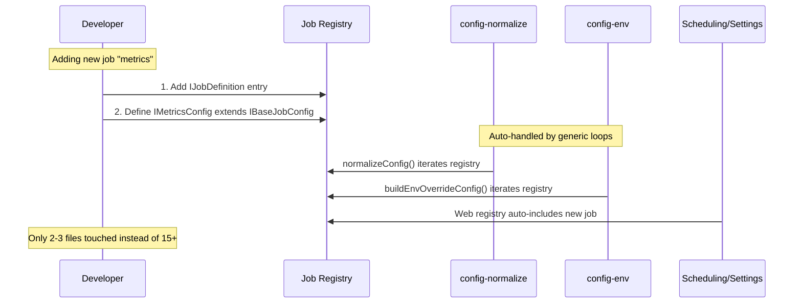

# PRD: Job Registry — Scalable Job Architecture

**Complexity: 9 → HIGH mode** (+3 touches 10+ files, +2 new module, +2 state logic, +2 multi-package)

## 1. Context

**Problem:** Adding a new job type (e.g., analytics) requires touching 15+ files across 4 packages — types, constants, config normalization, env parsing, CLI command, server routes, API client, Scheduling UI, Settings UI, schedule templates, and more. Each job's state shape is inconsistent (executor/reviewer use top-level flat fields, qa/audit/analytics use nested config objects, slicer lives inside `roadmapScanner`).

**Files Analyzed:**
- `packages/core/src/types.ts` — `JobType`, `IJobProviders`, `INightWatchConfig`, `IQaConfig`, `IAuditConfig`, `IAnalyticsConfig`
- `packages/core/src/shared/types.ts` — duplicated type definitions for web contract
- `packages/core/src/constants.ts` — `DEFAULT_*` per job, `VALID_JOB_TYPES`, `DEFAULT_QUEUE_PRIORITY`, `LOG_FILE_NAMES`
- `packages/core/src/config-normalize.ts` — per-job normalization blocks (~30 lines each)
- `packages/core/src/config-env.ts` — per-job `NW_*` env var parsing blocks (~20 lines each)
- `packages/cli/src/commands/shared/env-builder.ts` — already generic via `buildBaseEnvVars(config, jobType, isDryRun)`
- `packages/server/src/routes/action.routes.ts` — per-job `router.post()` handlers (identical pattern)
- `web/api.ts` — per-job `triggerX()` functions (identical pattern)
- `web/pages/Scheduling.tsx` — hardcoded `agents` array with per-job config access patterns
- `web/pages/Settings.tsx` — per-job settings sections
- `web/utils/cron.ts` — `IScheduleTemplate` with hardcoded job keys
- `web/components/scheduling/ScheduleConfig.tsx` — per-job schedule form fields
- `web/store/useStore.ts` — minimal Zustand, no job-specific state

**Current Behavior:**
- 6 job types exist: `executor`, `reviewer`, `qa`, `audit`, `slicer`, `analytics`
- Executor/reviewer use flat top-level config fields (`cronSchedule`, `reviewerSchedule`, `executorEnabled`, `reviewerEnabled`)
- QA/audit/analytics use nested config objects (`config.qa`, `config.audit`, `config.analytics`) with common shape: `{ enabled, schedule, maxRuntime, ...extras }`
- Slicer is buried inside `config.roadmapScanner` (`slicerSchedule`, `slicerMaxRuntime`)
- Each layer (normalization, env parsing, UI) has its own if/switch for each job type
- UI pages (Scheduling, Settings) have hardcoded per-job JSX blocks

## 2. Solution

**Approach:**
1. Create a **Job Registry** in `packages/core/src/jobs/` that defines each job's metadata, defaults, config access patterns, and env parsing rules in a single object
2. Extract a **`IBaseJobConfig`** interface (`{ enabled, schedule, maxRuntime }`) that all job configs extend
3. Replace per-job boilerplate in `config-normalize.ts` and `config-env.ts` with generic registry-driven loops
4. Create a **web-side Job Registry** (`web/utils/jobs.ts`) with UI metadata (icons, labels, trigger functions, config accessors) that Scheduling/Settings pages iterate over
5. Add a **Zustand `jobs` slice** that provides computed job state derived from `status.config` so components don't need to know each job's config shape

**Architecture Diagram:**
```mermaid
flowchart TB
    subgraph Core["@night-watch/core"]
        JR[Job Registry<br/>IJobDefinition[]] --> CN[Config Normalize<br/>generic loop]
        JR --> CE[Config Env<br/>generic loop]
        JR --> CONST[Constants<br/>derived from registry]
    end

    subgraph Web["web/"]
        WJR[Web Job Registry<br/>IWebJobDef[]] --> SCHED[Scheduling.tsx<br/>agents.map()]
        WJR --> SETT[Settings.tsx<br/>jobs.map()]
        WJR --> API[api.ts<br/>triggerJob(id)]
        ZUSTAND[Zustand jobs slice] --> SCHED
        ZUSTAND --> SETT
    end

    subgraph Server["@night-watch/server"]
        JR --> ROUTES[action.routes.ts<br/>registry loop]
    end

    JR -.->|shared types| WJR
```

**Key Decisions:**
- **Migrate executor/reviewer to nested config**: All jobs will use `config.jobs.{id}: { enabled, schedule, maxRuntime, ...extras }`. Auto-detect legacy flat format and migrate on load. This is a breaking config change but gives uniform access patterns.
- **Registry is a const array, not DI**: Simple, testable, no runtime overhead
- **Web job registry stores React components directly** for icons (type-safe, tree-shakeable)
- **Generic `triggerJob(jobId)`** replaces per-job `triggerRun()`, `triggerReview()` etc. (keep old functions as thin wrappers for backward compat)

**Data Changes:**
- `INightWatchConfig` gains `jobs: Record<JobType, IBaseJobConfig & extras>` — replaces flat executor/reviewer fields and nested qa/audit/analytics objects
- Legacy flat fields (`cronSchedule`, `reviewerSchedule`, `executorEnabled`, `reviewerEnabled`) and nested objects (`qa`, `audit`, `analytics`, `roadmapScanner.slicerSchedule`) auto-detected and migrated on config load
- Config file rewritten in new format on first save after migration

## 3. Sequence Flow



## 4. Execution Phases

### Phase 1: Core Job Registry — Foundation

**User-visible outcome:** Job registry exists and is the single source of truth for job metadata. All constants derived from it. Tests prove registry drives normalization.

**Files (5):**
- `packages/core/src/jobs/job-registry.ts` — **NEW** — `IJobDefinition` interface + `JOB_REGISTRY` array + accessor utilities
- `packages/core/src/jobs/index.ts` — **NEW** — barrel exports
- `packages/core/src/types.ts` — add `IBaseJobConfig` interface
- `packages/core/src/constants.ts` — derive `VALID_JOB_TYPES`, `DEFAULT_QUEUE_PRIORITY`, `LOG_FILE_NAMES` from registry
- `packages/core/src/index.ts` — re-export jobs module

**Implementation:**

- [ ] Define `IBaseJobConfig` interface: `{ enabled: boolean; schedule: string; maxRuntime: number }`
- [ ] Define `IJobDefinition<TConfig extends IBaseJobConfig = IBaseJobConfig>` interface with:
  ```typescript
  interface IJobDefinition<TConfig extends IBaseJobConfig = IBaseJobConfig> {
    id: JobType;
    name: string;                    // "Executor", "QA", "Auditor"
    description: string;             // "Creates implementation PRs from PRDs"
    cliCommand: string;              // "run", "review", "qa", "audit", "planner", "analytics"
    logName: string;                 // "executor", "reviewer", "night-watch-qa", etc.
    lockSuffix: string;              // ".lock", "-r.lock", "-qa.lock", etc.
    queuePriority: number;           // 50, 40, 30, 20, 10

    // Env var prefix for NW_* overrides
    envPrefix: string;               // "NW_EXECUTOR", "NW_QA", "NW_AUDIT", etc.

    // Extra config field normalizers (beyond enabled/schedule/maxRuntime)
    extraFields?: IExtraFieldDef[];  // e.g., QA's branchPatterns, artifacts, etc.

    // Defaults
    defaultConfig: TConfig;

    // Legacy config migration: reads old flat/nested config shapes
    migrateLegacy?: (raw: Record<string, unknown>) => Partial<TConfig> | undefined;
  }
  ```
- [ ] Create `JOB_REGISTRY` const array with entries for all 6 job types
- [ ] Create utility functions: `getJobDef(id)`, `getAllJobDefs()`, `getJobDefByCommand(cmd)`
- [ ] Derive `VALID_JOB_TYPES`, `DEFAULT_QUEUE_PRIORITY`, `LOG_FILE_NAMES` from registry (keep exports stable)

**Tests Required:**
| Test File | Test Name | Assertion |
|-----------|-----------|-----------|
| `packages/core/src/__tests__/jobs/job-registry.test.ts` | `should define all 6 job types` | `expect(JOB_REGISTRY).toHaveLength(6)` |
| `packages/core/src/__tests__/jobs/job-registry.test.ts` | `getJobDef returns correct def` | `expect(getJobDef('qa').name).toBe('QA')` |
| `packages/core/src/__tests__/jobs/job-registry.test.ts` | `getEnabled reads correct config path per job` | accessor tests for flat vs nested |
| `packages/core/src/__tests__/jobs/job-registry.test.ts` | `derived constants match legacy values` | `VALID_JOB_TYPES` etc. unchanged |

**Verification:** `yarn verify` passes, existing tests still pass, new unit tests pass.

---

### Phase 2: Config Migration & Registry-Driven Normalization

**User-visible outcome:** `config-normalize.ts` and `config-env.ts` use generic loops. Legacy flat config auto-migrated. Adding a job config section no longer requires per-job blocks.

**Files (5):**
- `packages/core/src/jobs/job-registry.ts` — add `normalizeJobConfig()` and `buildJobEnvOverrides()` generic helpers
- `packages/core/src/config-normalize.ts` — replace per-job normalization blocks with registry loop + legacy migration
- `packages/core/src/config-env.ts` — replace per-job env blocks with registry loop
- `packages/core/src/config.ts` — `loadConfig()` detects legacy format and migrates in-memory (optionally rewrites file)
- `packages/core/src/__tests__/config-normalize.test.ts` — verify normalization + migration

**Implementation:**
- [ ] Add `normalizeJobConfig(rawConfig, jobDef)` that reads raw object, applies defaults, validates fields
- [ ] Each `IJobDefinition` declares `extraFields` for job-specific fields beyond `{ enabled, schedule, maxRuntime }`
- [ ] Add `migrateLegacyConfig(raw)` that detects old format (e.g., `cronSchedule` exists at top level) and transforms to new `jobs: { executor: { ... }, ... }` shape
- [ ] Replace per-job blocks in `normalizeConfig()` with generic registry loop
- [ ] Replace per-job blocks in `buildEnvOverrideConfig()` with generic loop using `job.envPrefix`
- [ ] `loadConfig()` calls `migrateLegacyConfig()` before normalization; saves migrated config back to disk on first load

**Tests Required:**
| Test File | Test Name | Assertion |
|-----------|-----------|-----------|
| `packages/core/src/__tests__/config-normalize.test.ts` | `normalizes qa config via registry` | same assertions as existing, proving no regression |
| `packages/core/src/__tests__/config-normalize.test.ts` | `normalizes analytics config via registry` | same assertions |
| `packages/core/src/__tests__/config-env.test.ts` | `NW_QA_ENABLED override still works` | env var test |

**Verification:** `yarn verify` + `yarn test` — all existing config tests pass unchanged.

---

### Phase 3: Web Job Registry & Zustand Jobs Slice

**User-visible outcome:** Scheduling and Settings pages read job definitions from a registry instead of hardcoded arrays. Zustand provides computed job state.

**Files (4):**
- `web/utils/jobs.ts` — **NEW** — Web-side job registry with UI metadata
- `web/store/useStore.ts` — add `jobs` computed slice derived from `status.config`
- `web/api.ts` — add generic `triggerJob(jobId)` function
- `web/utils/cron.ts` — derive schedule template keys from registry

**Implementation:**
- [ ] Create `IWebJobDefinition` extending core `IJobDefinition` with UI fields:
  ```typescript
  interface IWebJobDefinition extends IJobDefinition {
    icon: string;              // lucide icon component name
    triggerEndpoint: string;   // '/api/actions/qa'
    scheduleTemplateKey: string; // key in IScheduleTemplate.schedules
    settingsSection?: 'general' | 'advanced'; // where in Settings to show
  }
  ```
- [ ] Create `WEB_JOB_REGISTRY` with all 6 jobs
- [ ] Add `triggerJob(jobId: string)` to `api.ts` — generic trigger using `WEB_JOB_REGISTRY`
- [ ] Add Zustand `jobs` computed getter:
  ```typescript
  // Derived from status.config via the registry
  getJobStates: () => IWebJobState[] // { id, name, enabled, schedule, nextRun, ... }
  ```
- [ ] Export utility: `getJobEnabled(config, jobId)`, `getJobSchedule(config, jobId)` using registry

**Tests Required:**
| Test File | Test Name | Assertion |
|-----------|-----------|-----------|
| `web/pages/__tests__/jobs-registry.test.ts` | `WEB_JOB_REGISTRY covers all job types` | length check |
| `web/pages/__tests__/jobs-registry.test.ts` | `triggerJob calls correct endpoint` | mock fetch test |

**Verification:** `yarn verify` passes, web dev server loads without errors.

---

### Phase 4: Refactor Scheduling Page to Use Registry

**User-visible outcome:** Scheduling page renders job cards from the registry. Adding a new job automatically shows it in Scheduling.

**Files (3):**
- `web/pages/Scheduling.tsx` — replace hardcoded `agents` array with registry-driven rendering
- `web/components/scheduling/ScheduleConfig.tsx` — use registry for form fields
- `web/utils/cron.ts` — update `IScheduleTemplate` to be extensible

**Implementation:**
- [ ] Replace the hardcoded `agents: IAgentInfo[]` array with `WEB_JOB_REGISTRY.map(job => ...)`
- [ ] Replace `handleJobToggle` if/else chain with generic `job.buildEnabledPatch(enabled, config)`
- [ ] Replace `handleTriggerJob` map with generic `triggerJob(job.id)`
- [ ] `ScheduleConfig` iterates registry for schedule form fields

**Tests Required:**
| Test File | Test Name | Assertion |
|-----------|-----------|-----------|
| `web/pages/__tests__/Scheduling.test.tsx` | `renders all registered jobs` | check all job names appear |

**Verification:** Web UI Scheduling page works identically — toggle, trigger, schedule editing all functional.

---

### Phase 5: Refactor Settings Page Job Sections

**User-visible outcome:** Settings page job config sections rendered from registry. Adding a new job auto-shows its settings.

**Files (3):**
- `web/pages/Settings.tsx` — replace per-job settings JSX blocks with registry loop
- `web/components/dashboard/AgentStatusBar.tsx` — use registry for process status
- `packages/server/src/routes/action.routes.ts` — generate routes from registry

**Implementation:**
- [ ] Settings: iterate `WEB_JOB_REGISTRY` to render job config sections
- [ ] Each `IWebJobDefinition` can declare its settings fields: `settingsFields: ISettingsField[]`
- [ ] `AgentStatusBar`: derive process list from registry instead of hardcoded
- [ ] Action routes: generate `router.post('/${job.cliCommand}')` from registry loop

**Tests Required:**
| Test File | Test Name | Assertion |
|-----------|-----------|-----------|
| `web/pages/__tests__/Settings.test.tsx` | `renders all job settings sections` | check all job names |
| `packages/server/src/__tests__/server.test.ts` | `action routes exist for all jobs` | endpoint check |

**Verification:** `yarn verify` + `yarn test`, Settings page functional, API endpoints respond.

## 5. Post-Migration: Update Related Project Configs

**IMPORTANT:** After merging, all registered Night Watch projects need their `night-watch.config.json` updated to the new schema. The auto-migration on load handles this transparently, but a manual pass or migration script should be run across all projects to persist the new format:

```bash
# For each registered project, trigger a config load+save to migrate:
night-watch doctor  # or a dedicated `night-watch migrate-config` command
```

Consider adding a one-time migration command or having `loadConfig()` auto-rewrite the file when legacy format is detected.

## 6. Acceptance Criteria

- [ ] All phases complete
- [ ] All tests pass (`yarn test`)
- [ ] `yarn verify` passes
- [ ] Adding a hypothetical new job type requires touching only:
  1. Job registry entry (core + web)
  2. Job config interface (if custom fields needed)
  3. CLI command file
  4. (Optional) Bash script
- [ ] Legacy `night-watch.config.json` files auto-migrated on load
- [ ] No breaking changes to API endpoints
- [ ] Scheduling and Settings pages render identically
- [ ] Merge conflicts in current branch resolved before work begins
- [ ] Related project configs updated/tested with new schema
