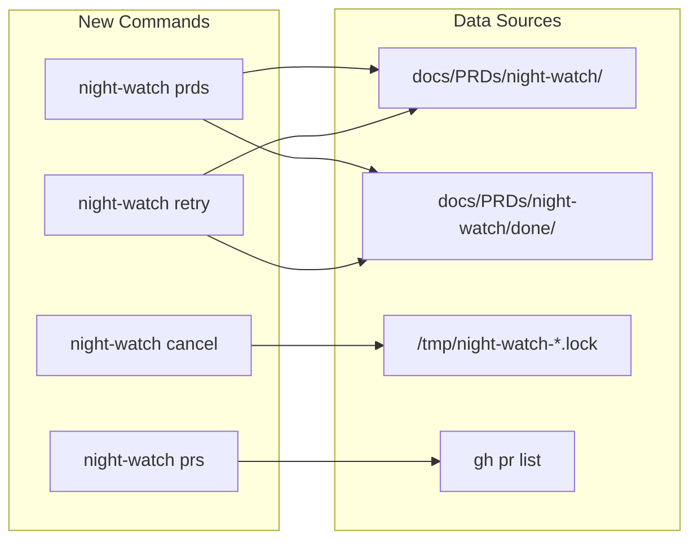

# PRD: Day-to-Day Operations Commands

**Depends on:** `01-terminal-ui-polish.md`, `02-doctor-command.md`

**Complexity: 6 → MEDIUM mode**
- Touches 6+ files (+3)
- 4 new commands (+2)
- Some process signal handling (+1)
- Single package
- No DB changes
- No external API integration (gh CLI is already used)

---

## 1. Context

**Problem:** Users have no way to inspect PRD/PR status, cancel a stuck run, or retry a failed PRD without manually manipulating files and lock files. The only visibility is `status` (aggregate counts) and `logs` (raw log tailing).

**Files Analyzed:**
- `src/commands/status.ts` — has `countPRDs()`, `countOpenPRs()`, `checkLockFile()` — partial reuse possible
- `src/commands/run.ts` — has `scanPrdDirectory()` — returns pending/completed PRD filenames
- `src/utils/crontab.ts` — lock file prefix: `/tmp/night-watch-`
- `src/constants.ts` — `LOCK_FILE_PREFIX`, `DEFAULT_PRD_DIR`, `DEFAULT_BRANCH_PATTERNS`
- `scripts/night-watch-helpers.sh` — `find_eligible_prd()` checks dependencies via `grep -i 'depends on'`
- `scripts/night-watch-cron.sh` — lock file path: `/tmp/night-watch-${PROJECT_NAME}.lock`
- `scripts/night-watch-pr-reviewer-cron.sh` — lock file: `/tmp/night-watch-pr-reviewer-${PROJECT_NAME}.lock`
- `src/utils/ui.ts` — (from PRD 01) colored output, tables, spinners
- `src/utils/checks.ts` — (from PRD 02) reusable validation helpers

**Current Behavior:**
- `status` shows aggregate counts (N pending, N done) but not individual PRD names or states
- No way to see which PRDs are blocked vs ready
- No way to see individual PR CI status or review scores from the CLI
- No way to cancel a running executor/reviewer except `kill <pid>` manually
- No way to retry a PRD that was moved to `done/` after a failed attempt
- Lock files at `/tmp/night-watch-executor.lock` and `/tmp/night-watch-reviewer.lock` (status.ts), but actual bash scripts use `/tmp/night-watch-${PROJECT_NAME}.lock`

### Integration Points Checklist

- **Entry points:** 4 new CLI commands: `prds`, `prs`, `cancel`, `retry`
- **Caller file:** `src/cli.ts` — register all 4 commands
- **Registration:** Add 4 `*Command(program)` calls in `cli.ts`
- **User-facing:** YES — all 4 are direct user commands
- **Full user flows:**
  1. `night-watch prds` → User sees table of all PRDs with status/dependencies
  2. `night-watch prs` → User sees table of matching PRs with CI/review status
  3. `night-watch cancel` → User stops a running execution gracefully
  4. `night-watch retry <name>` → User re-queues a PRD for execution

---

## 2. Solution

**Approach:**
- Create 4 new command files in `src/commands/`
- Extract shared helpers where logic overlaps with `status.ts` and `run.ts` (PRD scanning, lock file checking, PR listing)
- Use `ui.ts` (from PRD 01) for colored tables and status indicators
- `cancel` uses `process.kill(pid, 'SIGTERM')` after reading lock file PID
- `retry` moves file from `done/` back to the PRD directory

**Key Decisions:**
- `prds` command parses `depends on` from PRD markdown (same regex as `night-watch-helpers.sh`)
- `prs` command uses `gh pr list` with JSON output — same approach as `review.ts` and `status.ts`
- `cancel` sends SIGTERM (not SIGKILL) for graceful shutdown — bash trap will clean up lock/worktree
- `cancel` requires confirmation prompt (readline) before killing — no `--force` to skip (safety first)
- `retry` validates the PRD exists in `done/` before moving — no silent failures

---

## 4. Execution Phases

### Phase 1: PRDs command — Users can list all PRDs with status and dependencies

**Files (3):**
- `src/commands/prds.ts` — NEW: list PRDs with status
- `src/cli.ts` — register prds command
- `src/__tests__/commands/prds.test.ts` — NEW: tests

**Implementation:**
- [ ] Create `src/commands/prds.ts`:
  - Import `ui.ts` helpers, `cli-table3`, config loader
  - Define `PrdsOptions { json: boolean }`
  - Scan `prdDir` for `.md` files (exclude `NIGHT-WATCH-SUMMARY.md`)
  - Scan `prdDir/done/` for completed PRDs
  - For each pending PRD:
    - Parse first line matching `/depends on/i` to extract dependency filenames
    - Check if dependencies exist in `done/` directory
    - Check if a matching branch has an open PR (via `gh pr list --json headRefName`)
    - Determine status: `ready` (no unmet deps, no open PR), `blocked` (unmet deps), `in-progress` (open PR exists), `done` (in done/)
  - Display as table with columns: `Name | Status | Dependencies | PR`
  - Color-code status: green=ready, yellow=blocked, cyan=in-progress, dim=done
  - Support `--json` flag for machine-readable output
- [ ] Register in `cli.ts`: `import { prdsCommand } from './commands/prds.js'` + `prdsCommand(program)`

**Tests Required:**
| Test File | Test Name | Assertion |
|-----------|-----------|-----------|
| `src/__tests__/commands/prds.test.ts` | `should list pending PRDs` | output table contains PRD filenames |
| `src/__tests__/commands/prds.test.ts` | `should show done PRDs` | done PRDs appear with done status |
| `src/__tests__/commands/prds.test.ts` | `should detect blocked PRDs` | PRD with unmet dep shows blocked |
| `src/__tests__/commands/prds.test.ts` | `should output JSON with --json flag` | `JSON.parse(output)` succeeds |

**Verification:**
- `npx tsx src/cli.ts prds` shows a table of PRDs
- `npx tsx src/cli.ts prds --json` outputs valid JSON

---

### Phase 2: PRs command — Users can see matching PRs with CI and review status

**Files (3):**
- `src/commands/prs.ts` — NEW: list matching PRs
- `src/cli.ts` — register prs command (if not already done in phase 1)
- `src/__tests__/commands/prs.test.ts` — NEW: tests

**Implementation:**
- [ ] Create `src/commands/prs.ts`:
  - Import `ui.ts` helpers, `cli-table3`, config loader
  - Define `PrsOptions { json: boolean }`
  - Run `gh pr list --state open --json number,title,headRefName,statusCheckRollup,url` to get all open PRs
  - Filter PRs matching configured `branchPatterns`
  - For each matching PR:
    - Extract CI status from `statusCheckRollup` (pass/fail/pending)
    - Fetch review comments via `gh api repos/{owner}/{repo}/pulls/{number}/comments` and extract score from `Overall Score: N/100` pattern
    - Display as table with columns: `# | Title | Branch | CI | Score | URL`
  - Color-code CI: green=pass, red=fail, yellow=pending
  - Color-code score: green>=80, yellow=60-79, red<60, dim=no score
  - Support `--json` flag
- [ ] Register in `cli.ts`: `prsCommand(program)`

**Tests Required:**
| Test File | Test Name | Assertion |
|-----------|-----------|-----------|
| `src/__tests__/commands/prs.test.ts` | `should show help text` | `--help` output contains expected options |
| `src/__tests__/commands/prs.test.ts` | `should handle no open PRs` | output indicates no PRs found |
| `src/__tests__/commands/prs.test.ts` | `should output JSON with --json flag` | validates JSON structure |

**Verification:**
- `npx tsx src/cli.ts prs` shows a table of matching PRs (or "No matching PRs found")
- `npx tsx src/cli.ts prs --json` outputs valid JSON

---

### Phase 3: Cancel command — Users can stop a running execution

**Files (2):**
- `src/commands/cancel.ts` — NEW: cancel running execution
- `src/__tests__/commands/cancel.test.ts` — NEW: tests

**Implementation:**
- [ ] Create `src/commands/cancel.ts`:
  - Import `ui.ts`, `fs`, `readline`, config loader
  - Define `CancelOptions { type: 'run' | 'review' | 'all' }`
  - Determine lock file paths using project name: `/tmp/night-watch-${projectName}.lock` (executor), `/tmp/night-watch-pr-reviewer-${projectName}.lock` (reviewer)
  - Read PID from lock file(s)
  - Check if process is actually running (`process.kill(pid, 0)`)
  - If not running, report "not running" and clean up stale lock file
  - If running, show confirmation prompt: `"Kill executor (PID ${pid})? [y/N]"`
  - On confirm, send `SIGTERM` via `process.kill(pid, 'SIGTERM')`
  - Wait 3 seconds, check if still running, report success/failure
  - If still running after SIGTERM, offer to send SIGKILL
- [ ] Register in `cli.ts`: `cancelCommand(program)`

**Tests Required:**
| Test File | Test Name | Assertion |
|-----------|-----------|-----------|
| `src/__tests__/commands/cancel.test.ts` | `should report not running when no lock file` | output contains "not running" |
| `src/__tests__/commands/cancel.test.ts` | `should detect stale lock files` | removes stale lock, reports not running |
| `src/__tests__/commands/cancel.test.ts` | `should show help with --type option` | `--help` contains `--type` |

**Verification:**
- `npx tsx src/cli.ts cancel` reports "not running" when nothing is active
- `npx tsx src/cli.ts cancel --type review` targets reviewer specifically

---

### Phase 4: Retry command — Users can re-queue a completed/failed PRD

**Files (3):**
- `src/commands/retry.ts` — NEW: retry a PRD
- `src/cli.ts` — register retry command (if not already done)
- `src/__tests__/commands/retry.test.ts` — NEW: tests

**Implementation:**
- [ ] Create `src/commands/retry.ts`:
  - Import `ui.ts`, `fs`, `path`, config loader
  - Takes required argument `<prd-name>` (with or without `.md` extension)
  - Check if PRD exists in `done/` directory
  - If found in `done/`: move it back to `prdDir` root, report success
  - If found in `prdDir` root: report "already pending, nothing to retry"
  - If not found anywhere: report error with list of available PRDs in `done/`
  - Use `success()`, `error()`, `info()` from `ui.ts`
- [ ] Register in `cli.ts`: `retryCommand(program)`

**Tests Required:**
| Test File | Test Name | Assertion |
|-----------|-----------|-----------|
| `src/__tests__/commands/retry.test.ts` | `should move PRD from done to pending` | file exists in prdDir, not in done/ |
| `src/__tests__/commands/retry.test.ts` | `should report error for non-existent PRD` | output contains error message |
| `src/__tests__/commands/retry.test.ts` | `should report already pending` | output contains "already pending" |
| `src/__tests__/commands/retry.test.ts` | `should handle .md extension in name` | works with or without `.md` suffix |

**Verification:**
- Create a test PRD in `done/`, run `npx tsx src/cli.ts retry test-prd`, verify it moved back
- `npx tsx src/cli.ts retry nonexistent` shows error with available PRDs
- `npm test` passes

---

### Phase 5: Update CLI help and integration tests

**Files (2):**
- `src/cli.ts` — verify all 4 commands are registered
- `src/__tests__/cli.test.ts` — add help tests for new commands

**Implementation:**
- [ ] Verify `cli.ts` has all 4 new imports and registrations
- [ ] Add help output tests for `prds`, `prs`, `cancel`, `retry` commands

**Tests Required:**
| Test File | Test Name | Assertion |
|-----------|-----------|-----------|
| `src/__tests__/cli.test.ts` | `should show prds command help` | help output contains expected options |
| `src/__tests__/cli.test.ts` | `should show prs command help` | help output contains expected options |
| `src/__tests__/cli.test.ts` | `should show cancel command help` | help output contains `--type` |
| `src/__tests__/cli.test.ts` | `should show retry command help` | help output contains `<prd-name>` |

**Verification:**
- `npx tsx src/cli.ts --help` shows all 11 commands (7 existing + 4 new)
- `npm test` passes — all tests green

---

## 5. Acceptance Criteria

- [ ] `night-watch prds` lists all PRDs with status (ready/blocked/in-progress/done) in a colored table
- [ ] `night-watch prs` lists matching PRs with CI status and review scores
- [ ] `night-watch cancel` gracefully stops a running executor/reviewer with confirmation
- [ ] `night-watch retry <name>` moves a PRD from done/ back to pending
- [ ] All 4 commands support `--help`
- [ ] `prds` and `prs` support `--json` for machine-readable output
- [ ] All new commands appear in `night-watch --help`
- [ ] All tests pass (`npm test`)
- [ ] No changes to bash scripts
