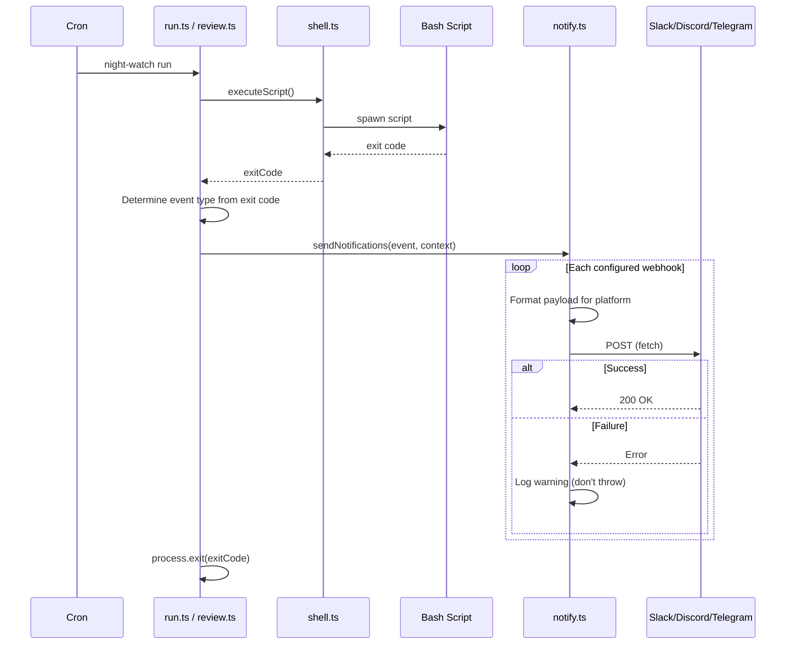

# PRD: Notification Webhooks

**Depends on:** `01-terminal-ui-polish.md`, `03-day-to-day-operations.md`

**Complexity: 6 → MEDIUM mode**
- Touches 8+ files (+3)
- New notification system (+2)
- No complex concurrency
- Single package
- No database changes
- External API integration (webhooks) (+1)

---

## 1. Context

**Problem:** Night Watch runs autonomously via cron — users have no way to know when a PR is opened, a run fails, or a review completes without manually checking `night-watch status` or `night-watch logs`. For a public npm tool, users expect push notifications to their team's communication channels.

**Files Analyzed:**
- `src/types.ts` — `INightWatchConfig` interface needs `notifications` field
- `src/config.ts` — `loadConfig()` needs to handle new notification config
- `src/constants.ts` — needs new defaults
- `scripts/night-watch-cron.sh` — exit code handling where notifications should trigger (lines 120-139)
- `scripts/night-watch-pr-reviewer-cron.sh` — exit code handling (lines 125-135)
- `src/commands/run.ts` — `executeScript()` returns exit code — notification hook point
- `src/commands/review.ts` — same pattern as `run.ts`
- `src/utils/shell.ts` — subprocess execution, returns exit code
- `package.json` — no HTTP client dependency currently

**Current Behavior:**
- No notification mechanism exists
- Success/failure is only logged to files in `logs/`
- Users must manually run `status` or `logs` to check outcomes
- Cron runs happen silently — no external visibility

### Integration Points Checklist

- **Entry point:** Notifications fire after `run` and `review` commands complete (from Node.js layer, not bash)
- **Caller files:** `src/commands/run.ts` (after `executeScript` returns), `src/commands/review.ts` (after `executeScript` returns)
- **Registration:** No new commands — integrates into existing command flow
- **User-facing:** YES — notifications are delivered to Slack/Discord/Telegram
- **Full user flow:**
  1. User configures webhooks in `night-watch.config.json`
  2. Cron triggers `night-watch run`
  3. Provider CLI executes, script exits
  4. Node.js layer checks exit code and sends notification
  5. User receives Slack/Discord/Telegram message

---

## 2. Solution

**Approach:**
- Add `notifications` config section to `INightWatchConfig`
- Create `src/utils/notify.ts` with platform-specific formatters and a generic `sendNotification()` function
- Use Node.js built-in `fetch` (available since Node 18, which is the minimum version) — no new HTTP dependency needed
- Hook notifications into the Node.js command layer (`run.ts`, `review.ts`) after `executeScript()` returns — not inside bash scripts
- Support 4 event types: `run_succeeded`, `run_failed`, `run_timeout`, `review_completed`
- Each webhook config specifies which events to receive

**Key Decisions:**
- Use native `fetch` instead of `axios`/`node-fetch` — zero new dependencies for HTTP
- Notifications fire from Node.js layer, not bash — simpler, type-safe, and testable
- Fire-and-forget: notification failures are logged but don't affect exit code
- Platform-specific formatting: Slack (blocks API), Discord (embeds), Telegram (MarkdownV2)
- `night-watch doctor` (from PRD 02) should be extended to validate webhook URLs

**Data Changes:**

New config shape in `night-watch.config.json`:
```json
{
  "notifications": {
    "webhooks": [
      {
        "type": "slack",
        "url": "https://hooks.slack.com/services/...",
        "events": ["run_succeeded", "run_failed"]
      },
      {
        "type": "discord",
        "url": "https://discord.com/api/webhooks/...",
        "events": ["run_failed", "review_completed"]
      },
      {
        "type": "telegram",
        "botToken": "123456:ABC-DEF...",
        "chatId": "-1001234567890",
        "events": ["run_failed"]
      }
    ]
  }
}
```

---

## 3. Sequence Flow



---

## 4. Execution Phases

### Phase 1: Add notification types and config — Config system supports webhook configuration

**Files (4):**
- `src/types.ts` — add notification types to `INightWatchConfig`
- `src/constants.ts` — add default notification config
- `src/config.ts` — load and merge notification config
- `src/__tests__/config.test.ts` — test notification config loading

**Implementation:**
- [ ] Add types to `src/types.ts`:
  ```typescript
  export type WebhookType = "slack" | "discord" | "telegram";
  export type NotificationEvent = "run_succeeded" | "run_failed" | "run_timeout" | "review_completed";

  export interface WebhookConfig {
    type: WebhookType;
    url?: string;        // For Slack and Discord
    botToken?: string;   // For Telegram
    chatId?: string;     // For Telegram
    events: NotificationEvent[];
  }

  export interface NotificationConfig {
    webhooks: WebhookConfig[];
  }
  ```
- [ ] Add `notifications?: NotificationConfig` to `INightWatchConfig`
- [ ] Add `DEFAULT_NOTIFICATIONS` to `constants.ts`: `{ webhooks: [] }`
- [ ] Update `getDefaultConfig()` in `config.ts` to include `notifications`
- [ ] Update `mergeConfigs()` to handle `notifications` field (replace entire array, don't deep merge individual webhooks)
- [ ] Add `NW_NOTIFICATIONS` env var support (JSON string) in `loadConfig()`
- [ ] Add config tests

**Tests Required:**
| Test File | Test Name | Assertion |
|-----------|-----------|-----------|
| `src/__tests__/config.test.ts` | `should load notifications from config file` | parsed config has webhooks array |
| `src/__tests__/config.test.ts` | `should default to empty webhooks` | default config has empty webhooks |
| `src/__tests__/config.test.ts` | `should parse NW_NOTIFICATIONS env var` | env override works |

**Verification:**
- `npm test` passes
- Config with `notifications` key loads without errors

---

### Phase 2: Create notification utility — Notifications can be sent to all 3 platforms

**Files (2):**
- `src/utils/notify.ts` — NEW: notification sending and formatting
- `src/__tests__/utils/notify.test.ts` — NEW: unit tests

**Implementation:**
- [ ] Create `src/utils/notify.ts` with:
  - `NotificationContext` interface:
    ```typescript
    interface NotificationContext {
      event: NotificationEvent;
      projectName: string;
      prdName?: string;       // For run events
      branchName?: string;    // For run events
      prNumber?: number;      // For review events
      exitCode: number;
      duration?: number;      // Seconds
      provider: string;
    }
    ```
  - `formatSlackPayload(ctx: NotificationContext): object` — Slack blocks format with color-coded attachment (green/red sidebar)
  - `formatDiscordPayload(ctx: NotificationContext): object` — Discord embed with color field
  - `formatTelegramPayload(ctx: NotificationContext): { text: string; parse_mode: string }` — Telegram MarkdownV2
  - `sendWebhook(webhook: WebhookConfig, ctx: NotificationContext): Promise<void>`:
    - Check if `ctx.event` is in `webhook.events`, skip if not
    - Format payload based on `webhook.type`
    - For Slack/Discord: `fetch(webhook.url, { method: 'POST', body: JSON.stringify(payload) })`
    - For Telegram: `fetch(https://api.telegram.org/bot${webhook.botToken}/sendMessage, { method: 'POST', body: JSON.stringify({ chat_id: webhook.chatId, ...payload }) })`
    - Wrap in try/catch — log warning on failure, never throw
  - `sendNotifications(config: INightWatchConfig, ctx: NotificationContext): Promise<void>`:
    - If no webhooks configured, return immediately
    - Call `sendWebhook()` for each configured webhook (use `Promise.allSettled` for parallel send)
    - Log summary: "Sent N/M notifications"

- [ ] Write unit tests with mocked `fetch`

**Tests Required:**
| Test File | Test Name | Assertion |
|-----------|-----------|-----------|
| `src/__tests__/utils/notify.test.ts` | `formatSlackPayload should include project name` | payload contains projectName |
| `src/__tests__/utils/notify.test.ts` | `formatDiscordPayload should set color based on event` | green for success, red for failure |
| `src/__tests__/utils/notify.test.ts` | `formatTelegramPayload should use MarkdownV2` | parse_mode is MarkdownV2 |
| `src/__tests__/utils/notify.test.ts` | `sendWebhook should skip events not in config` | fetch not called |
| `src/__tests__/utils/notify.test.ts` | `sendWebhook should not throw on fetch failure` | no exception thrown |
| `src/__tests__/utils/notify.test.ts` | `sendNotifications should handle empty webhooks` | returns without error |

**Verification:**
- `npm test` passes
- Unit tests verify all 3 formatters produce valid payloads

---

### Phase 3: Integrate notifications into run and review commands — Users receive notifications after execution

**Files (4):**
- `src/commands/run.ts` — add notification hook after executeScript
- `src/commands/review.ts` — add notification hook after executeScript
- `src/__tests__/commands/run.test.ts` — test notification integration
- `src/__tests__/commands/review.test.ts` — test notification integration

**Implementation:**
- [ ] In `run.ts`, after `executeScript()` returns:
  ```typescript
  const exitCode = await executeScript(scriptPath, [projectDir], envVars);

  // Send notifications (fire-and-forget)
  const event: NotificationEvent =
    exitCode === 0 ? 'run_succeeded' :
    exitCode === 124 ? 'run_timeout' : 'run_failed';

  await sendNotifications(config, {
    event,
    projectName: path.basename(projectDir),
    exitCode,
    provider: config.provider,
  });

  process.exit(exitCode);
  ```
- [ ] In `review.ts`, same pattern:
  ```typescript
  const exitCode = await executeScript(scriptPath, [projectDir], envVars);

  if (exitCode === 0) {
    await sendNotifications(config, {
      event: 'review_completed',
      projectName: path.basename(projectDir),
      exitCode,
      provider: config.provider,
    });
  }

  process.exit(exitCode);
  ```
- [ ] Notifications must NOT fire during `--dry-run` mode
- [ ] Notification failures must NOT change the command's exit code
- [ ] Update existing tests to mock `sendNotifications`

**Tests Required:**
| Test File | Test Name | Assertion |
|-----------|-----------|-----------|
| `src/__tests__/commands/run.test.ts` | `should not send notifications in dry-run mode` | sendNotifications not called |
| `src/__tests__/commands/review.test.ts` | `should not send notifications in dry-run mode` | sendNotifications not called |

**Verification:**
- `npx tsx src/cli.ts run --dry-run` does NOT trigger notifications
- Configure a test Slack webhook in config, run `npx tsx src/cli.ts run`, verify Slack message received
- `npm test` passes

---

### Phase 4: Extend doctor to validate webhooks — Doctor checks webhook configuration

**Files (2):**
- `src/commands/doctor.ts` — add webhook validation checks
- `src/__tests__/commands/doctor.test.ts` — test webhook validation

**Implementation:**
- [ ] Add webhook checks to `doctor.ts` (after existing checks):
  - For each configured webhook:
    - Slack: validate URL starts with `https://hooks.slack.com/`
    - Discord: validate URL starts with `https://discord.com/api/webhooks/`
    - Telegram: validate `botToken` and `chatId` are non-empty
    - Validate `events` array is non-empty and contains valid event names
  - Show pass/fail for each webhook
  - If no webhooks configured, show `info("No webhooks configured (optional)")` — not a failure
- [ ] Update tests

**Tests Required:**
| Test File | Test Name | Assertion |
|-----------|-----------|-----------|
| `src/__tests__/commands/doctor.test.ts` | `should pass with no webhooks configured` | not treated as failure |
| `src/__tests__/commands/doctor.test.ts` | `should validate slack webhook URL format` | invalid URL shows warning |
| `src/__tests__/commands/doctor.test.ts` | `should validate telegram has botToken and chatId` | missing fields show error |

**Verification:**
- `npx tsx src/cli.ts doctor` with webhooks configured shows validation results
- `npx tsx src/cli.ts doctor` without webhooks shows info message
- `npm test` passes

---

## 5. Acceptance Criteria

- [ ] `night-watch.config.json` supports `notifications.webhooks` array
- [ ] Slack notifications use blocks API with color-coded attachments
- [ ] Discord notifications use embeds with appropriate colors
- [ ] Telegram notifications use MarkdownV2 formatting
- [ ] Notifications fire after `run` and `review` complete (not during `--dry-run`)
- [ ] Notification failures are logged but don't affect command exit code
- [ ] `night-watch doctor` validates webhook configuration
- [ ] No new npm dependencies (uses Node.js built-in `fetch`)
- [ ] All tests pass (`npm test`)
- [ ] Config supports `NW_NOTIFICATIONS` env var override
