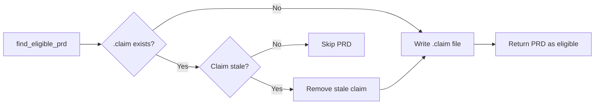

# PRD: PRD Claim Mechanism — Prevent Concurrent PRD Selection

**Complexity: 6 → MEDIUM mode**

Complexity breakdown:
- +2 Touches 6-10 files (bash helpers, cron script, prd.ts, status.ts, run.ts, constants.ts, tests)
- +2 Complex state logic / concurrency
- +2 Multi-package changes (bash + TypeScript)

---

## Problem

Two concurrent Night Watch runs (e.g., on different machines, or if the lock file expires before a PR is created) can both select the same PRD because eligibility is checked via `gh pr list` — but a PR doesn't exist yet when the agent first starts working. There is a race window between `find_eligible_prd()` and the agent opening a PR.

## Files Analyzed

- `scripts/night-watch-helpers.sh` — `find_eligible_prd()`, `acquire_lock()`, `mark_prd_done()`
- `scripts/night-watch-cron.sh` — main cron execution flow
- `src/commands/prd.ts` — `prd list` command
- `src/commands/status.ts` — status display with lock file checks
- `src/commands/run.ts` — `scanPrdDirectory()`, env var setup
- `src/constants.ts` — lock file prefix, defaults

## Current Behavior

- PRD state is inferred from two sources: directory location (pending vs done/) and open PRs (in-progress)
- `find_eligible_prd()` queries `gh pr list --state open` to skip PRDs with existing PRs
- A process-level lock file (`/tmp/night-watch-{project}.lock`) prevents concurrent runs on the **same machine**
- No protection exists against: (a) runs on different machines, (b) two cron invocations where the first hasn't opened a PR yet, or (c) manual `night-watch run` while cron is starting up
- `prd list` shows only "pending" and "done" — no visibility into "claimed/in-progress"

## Solution

**Approach:**

- Introduce a lightweight **claim file** mechanism: when `find_eligible_prd()` selects a PRD, it immediately writes a `.claim` file next to it (e.g., `05-dashboard-tui.md.claim`) containing a JSON payload with the timestamp, hostname, and PID
- Before selecting a PRD, `find_eligible_prd()` checks for an existing `.claim` file and skips claimed PRDs (with stale claim expiry based on `maxRuntime`)
- On successful completion (PR opened + PRD moved to done), the `.claim` file is cleaned up
- On failure/timeout, the `.claim` file is cleaned up so the PRD can be retried
- `prd list` shows "claimed" status for PRDs with active claim files
- `status` command shows claimed PRD count
- Claim files are `.gitignore`d — they are local-only ephemeral state

**Key Decisions:**

- Claim files over a database or remote lock: keeps the system simple, file-based, zero dependencies
- JSON payload in claim file: enables stale detection via timestamp + maxRuntime, and debugging via hostname/PID
- `.gitignore`d: claims are local state, not version-controlled. The open-PR check remains the distributed guard; claims add a local fast-path guard
- Stale claim expiry = `maxRuntime` config value (default 7200s / 2h): if a claim is older than this, the run must have died without cleanup

**Data Changes:** None (no schema/migration). New `.claim` files are ephemeral and gitignored.

---

## Phases

### Phase 1: Claim File Write & Read in Bash Helpers

**Files (3):**

- `scripts/night-watch-helpers.sh` — add `claim_prd()`, `release_claim()`, `is_claimed()` functions; update `find_eligible_prd()` to check claims
- `scripts/night-watch-cron.sh` — call `claim_prd()` after selection, `release_claim()` on success/failure/timeout
- `.gitignore` — add `*.claim` pattern

**Implementation:**

- [ ] Add `claim_prd()` function that writes `{"timestamp": <epoch>, "hostname": "<hostname>", "pid": <pid>}` to `${prd_dir}/${prd_file}.claim`
- [ ] Add `release_claim()` function that removes the `.claim` file
- [ ] Add `is_claimed()` function that reads `.claim` file, checks if `(now - timestamp) < max_runtime`. Returns 0 (true) if actively claimed, 1 (false) if no claim or stale
- [ ] Update `find_eligible_prd()`: before the open-PR check, call `is_claimed()` and skip if claimed. Accept `max_runtime` as a second parameter (default 7200)
- [ ] In `night-watch-cron.sh`: after `find_eligible_prd()` returns, call `claim_prd()` immediately. On EXIT trap, call `release_claim()` alongside lock cleanup. On success (mark_prd_done), also release claim
- [ ] Add `*.claim` to `.gitignore`

**Tests Required:**
| Test File | Test Name | Assertion |
|-----------|-----------|-----------|
| `scripts/test-helpers.bats` (new) | `claim_prd creates .claim file with JSON` | `.claim` file exists and contains valid JSON with timestamp, hostname, pid |
| `scripts/test-helpers.bats` | `is_claimed returns 0 for active claim` | Exit code 0 when claim exists and is fresh |
| `scripts/test-helpers.bats` | `is_claimed returns 1 for stale claim` | Exit code 1 when claim timestamp is older than max_runtime |
| `scripts/test-helpers.bats` | `is_claimed returns 1 for no claim` | Exit code 1 when no `.claim` file exists |
| `scripts/test-helpers.bats` | `release_claim removes .claim file` | `.claim` file no longer exists |
| `scripts/test-helpers.bats` | `find_eligible_prd skips claimed PRD` | Returns next unclaimed PRD when first is claimed |

**User Verification:**

- Action: Run `night-watch run --dry-run`, then check the PRD directory for a `.claim` file
- Expected: No `.claim` file in dry-run mode (dry-run exits before claim). Run without `--dry-run` and verify `.claim` file appears during execution and is cleaned up after

---

### Phase 2: Update `prd list` and `status` to Show Claims

**Files (3):**

- `src/commands/prd.ts` — detect `.claim` files, show "claimed" status in `prd list` table
- `src/commands/status.ts` — add "claimed" count to PRD status section
- `src/constants.ts` — add `CLAIM_FILE_EXTENSION` constant

**Implementation:**

- [ ] Add `CLAIM_FILE_EXTENSION = ".claim"` to `constants.ts`
- [ ] In `prd.ts` `prd list` action: after scanning pending PRDs, check for `.claim` files. For each pending PRD, if `${file}.claim` exists and is not stale (based on loaded config's `maxRuntime`), mark status as "claimed" instead of "pending"
- [ ] Add a helper function `isClaimActive(claimPath: string, maxRuntime: number): boolean` — reads claim JSON, checks `(Date.now()/1000 - timestamp) < maxRuntime`
- [ ] Update the table output: pending PRDs with active claims show "claimed" with dim hostname/PID info
- [ ] In `status.ts` `countPRDs()`: add a `claimed` count by checking `.claim` files alongside pending count
- [ ] Update `StatusInfo` interface to include `claimed: number` in `prds`
- [ ] Update the PRD Status table in status output to show "Claimed" row
- [ ] JSON output for both commands includes claim data

**Tests Required:**
| Test File | Test Name | Assertion |
|-----------|-----------|-----------|
| `src/__tests__/commands/prd.test.ts` | `prd list shows claimed status when .claim file exists` | Table output contains "claimed" for PRD with active claim |
| `src/__tests__/commands/prd.test.ts` | `prd list shows pending for stale .claim file` | PRD with expired claim shows as "pending" |
| `src/__tests__/commands/status.test.ts` | `countPRDs includes claimed count` | Returns `{ pending: N, claimed: M, done: K }` |

**User Verification:**

- Action: Manually create a `.claim` file next to a PRD: `echo '{"timestamp":'$(date +%s)',"hostname":"test","pid":1234}' > docs/PRDs/night-watch/01-terminal-ui-polish.md.claim`. Then run `night-watch prd list` and `night-watch status`
- Expected: PRD shows as "claimed" in list, status shows claimed count

---

### Phase 3: Update `run.ts` Dry-Run Diagnostics

**Files (2):**

- `src/commands/run.ts` — update `scanPrdDirectory()` to detect claims; show claim info in dry-run output
- `src/__tests__/commands/run.test.ts` — add test for claim detection in scan

**Implementation:**

- [ ] Update `scanPrdDirectory()` to return claim info for each pending PRD (claimed: boolean, claimInfo: {hostname, pid, timestamp} | null)
- [ ] In dry-run output, show which PRDs are claimed and by whom
- [ ] Pass `maxRuntime` to the scan function for stale claim detection

**Tests Required:**
| Test File | Test Name | Assertion |
|-----------|-----------|-----------|
| `src/__tests__/commands/run.test.ts` | `scanPrdDirectory detects claimed PRDs` | Returns claimed: true for PRD with active .claim file |
| `src/__tests__/commands/run.test.ts` | `scanPrdDirectory treats stale claims as unclaimed` | Returns claimed: false for PRD with expired .claim |

**User Verification:**

- Action: Create a `.claim` file, run `night-watch run --dry-run`
- Expected: Output shows PRD as "claimed" with hostname and PID

---

## Acceptance Criteria

- [ ] All phases complete
- [ ] All tests pass (`npm test`)
- [ ] `.claim` files are created on PRD selection and cleaned up on completion/failure/timeout
- [ ] Stale claims (older than `maxRuntime`) are ignored and cleaned up
- [ ] `prd list` shows "claimed" status for actively claimed PRDs
- [ ] `status` shows claimed PRD count
- [ ] `run --dry-run` shows claim information
- [ ] `.claim` files are in `.gitignore`
- [ ] No `.claim` files are committed to the repository
- [ ] The open-PR check in `find_eligible_prd()` remains as a secondary guard (claim is the fast-path, PR check is the distributed guard)
