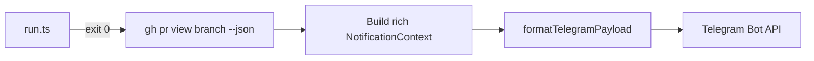
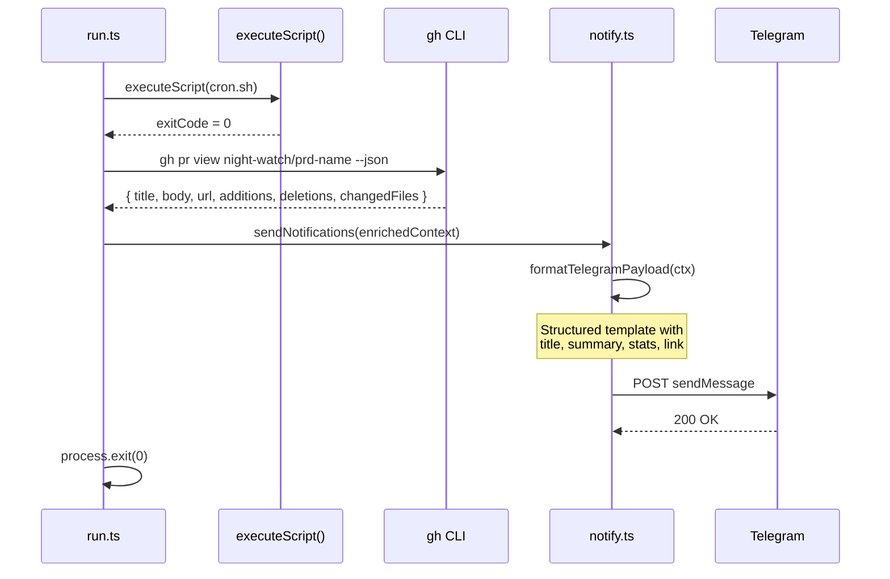

# PRD: Telegram PR Status Notifications

**Depends on:** `04-notification-webhooks.md`

**Complexity: 4 → MEDIUM mode**
- Touches 6 files (+2)
- Extends existing notification module (+1)
- External API integration (gh CLI for PR details) (+1)
- No database changes
- No new commands or cron entries

---

## 1. Context

**Problem:** When night-watch finishes executing a PRD or reviewing a PR, it sends a bare-bones Telegram notification with just the event type, exit code, and project name. Users have no idea *what* was implemented, what approach was taken, which files changed, or what the PR link is — they have to go to GitHub manually. The notification should be a self-contained progress update.

**Files Analyzed:**
- `src/utils/notify.ts` — `NotificationContext`, `buildDescription()`, `formatTelegramPayload()`, `sendWebhook()`
- `src/types.ts` — `NotificationEvent`, `WebhookConfig`
- `src/commands/run.ts` — fires `sendNotifications()` after `executeScript()` returns (lines 247-259)
- `src/commands/review.ts` — fires `sendNotifications()` after `executeScript()` returns (lines 191-199)
- `scripts/night-watch-cron.sh` — after success, checks PR exists via `gh pr list` (line 153)

**Current Behavior:**
- `run_succeeded` notification contains: project name, provider, exit code — nothing about the PR
- `review_completed` notification contains: same bare-bones info
- PR title, body, URL, files changed, additions/deletions are all available via `gh pr view` but never fetched
- Users must open GitHub to understand what night-watch actually did

### Integration Points Checklist

- **Entry point:** Existing `sendNotifications()` calls in `run.ts` and `review.ts` — no new entry points
- **Caller files:** `src/commands/run.ts` (line 253), `src/commands/review.ts` (line 193)
- **Registration:** No new commands — enhances existing notification flow
- **User-facing:** YES — richer Telegram messages with PR details
- **Full user flow:**
  1. User already has Telegram webhook configured (from PRD 04)
  2. Cron triggers `night-watch run`, PRD is implemented, PR is opened
  3. After run completes, Node.js layer fetches PR details via `gh pr view`
  4. Sends structured Telegram message with PR summary, approach, stats, and link

---

## 2. Solution

**Approach:**
- After a successful run, use `gh pr view <branch> --json` to fetch PR details (title, body, URL, file stats)
- Extend `NotificationContext` with optional PR detail fields (`prUrl`, `prBody`, `filesChanged`, `additions`, `deletions`)
- Build a structured Telegram message template that displays: PRD name, PR title, summary (extracted from PR body), file stats, and a direct link
- Same enrichment for `review_completed` — show what was fixed and the PR link
- No new commands, no polling, no state files — just richer messages in the existing flow

**Architecture:**



**Key Decisions:**
- **Enrich at call site** — `run.ts` and `review.ts` fetch PR details before calling `sendNotifications()`, keeping `notify.ts` stateless
- **`gh pr view` for PR details** — no new dependencies, consistent with existing `gh` usage in `status.ts` and `review.ts`
- **Graceful degradation** — if `gh` fails or PR not found, fall back to existing bare-bones notification (never block on enrichment failure)
- **Telegram only for now** — `formatTelegramPayload()` gets the structured template; Slack/Discord formatters untouched (they still use `buildDescription()`)
- **Extract summary from PR body** — the AI provider writes a PR body with a summary section; extract first ~500 chars as the approach description

**Data Changes:** None — just extends the existing `NotificationContext` interface with optional fields.

---

## 3. Sequence Flow



---

## 4. Execution Phases

### Phase 1: Extend NotificationContext and create PR detail fetcher — PR details available for notifications

**Files (3):**
- `src/utils/notify.ts` — extend `NotificationContext` with PR detail fields, update `formatTelegramPayload()` with structured template
- `src/utils/github.ts` — NEW: `fetchPrDetails()` helper using `gh pr view`
- `src/__tests__/utils/notify.test.ts` — test new Telegram template

**Implementation:**
- [ ] Extend `NotificationContext` in `notify.ts` with optional PR fields:
  ```typescript
  export interface NotificationContext {
    // ... existing fields ...
    prUrl?: string;
    prTitle?: string;
    prBody?: string;         // raw PR body from GitHub
    filesChanged?: number;
    additions?: number;
    deletions?: number;
  }
  ```

- [ ] Create `src/utils/github.ts` with:
  ```typescript
  export interface PrDetails {
    number: number;
    title: string;
    url: string;
    body: string;
    additions: number;
    deletions: number;
    changedFiles: number;
  }

  /**
   * Fetch PR details for a branch using gh CLI.
   * Returns null if gh is unavailable, not authenticated, or no PR found.
   */
  export function fetchPrDetails(branch: string, cwd: string): PrDetails | null
  ```
  - Uses `execSync('gh pr view <branch> --json number,title,url,body,additions,deletions,changedFiles', { cwd })`
  - Wraps in try/catch — returns `null` on any failure
  - Parses JSON response

- [ ] Update `formatTelegramPayload()` to use a structured template when PR details are present:
  ```
  ✅ PRD Execution Succeeded

  📋 PR #42: feat: add user authentication
  🔗 https://github.com/user/repo/pull/42

  📝 Summary
  Added JWT-based authentication with login/register
  endpoints, middleware, and token refresh...

  📊 Stats
  Files changed: 12 | +340 / -28

  ⚙️ Project: my-project | Provider: claude
  ```
  When PR details are NOT present, fall back to existing format (backwards compatible).

- [ ] Extract summary from PR body: take the first paragraph or first ~500 characters, strip markdown headers

- [ ] Update existing tests and add new ones for the structured template

**Tests Required:**
| Test File | Test Name | Assertion |
|-----------|-----------|-----------|
| `src/__tests__/utils/notify.test.ts` | `formatTelegramPayload should use structured template when prUrl is present` | output contains PR title, URL, summary, stats |
| `src/__tests__/utils/notify.test.ts` | `formatTelegramPayload should fall back to basic format when no PR details` | output matches existing format |
| `src/__tests__/utils/notify.test.ts` | `formatTelegramPayload should truncate long PR body` | summary is ≤500 chars |
| `src/__tests__/utils/notify.test.ts` | `formatTelegramPayload should handle empty PR body` | no summary section, no crash |

**Verification:**
- `npm test` passes
- Existing notification tests still pass

---

### Phase 2: Enrich run notifications with PR details — `run_succeeded` sends rich Telegram message

**Files (2):**
- `src/commands/run.ts` — fetch PR details after successful run, pass to `sendNotifications()`
- `src/__tests__/commands/run.test.ts` — test enrichment

**Implementation:**
- [ ] In `run.ts`, after `executeScript()` returns with exit code 0:
  ```typescript
  import { fetchPrDetails } from '../utils/github.js';

  // After executeScript returns...
  let prDetails: PrDetails | null = null;
  if (exitCode === 0) {
    // The branch name follows the pattern: night-watch/<prd-name>
    // Try to find the PR that was just opened
    prDetails = fetchPrDetails(`${config.branchPrefix}/*`, projectDir);
    // If wildcard doesn't work, we can also try to extract branch from script output
  }

  await sendNotifications(config, {
    event,
    projectName: path.basename(projectDir),
    exitCode,
    provider: config.provider,
    // Enriched PR details (undefined if not found — graceful degradation)
    prUrl: prDetails?.url,
    prTitle: prDetails?.title,
    prBody: prDetails?.body,
    prNumber: prDetails?.number,
    filesChanged: prDetails?.changedFiles,
    additions: prDetails?.additions,
    deletions: prDetails?.deletions,
  });
  ```

- [ ] For finding the right PR: use `gh pr list --state open --head <branchPrefix> --json number,headRefName --limit 1 --sort created` to find the most recently created PR on a night-watch branch, then `gh pr view <number> --json ...` for full details

- [ ] Ensure this does NOT affect `--dry-run` mode (no gh calls in dry-run)
- [ ] Ensure enrichment failure does NOT prevent the basic notification from being sent

**Tests Required:**
| Test File | Test Name | Assertion |
|-----------|-----------|-----------|
| `src/__tests__/commands/run.test.ts` | `should include PR details in notification on success` | context includes prUrl, prTitle |
| `src/__tests__/commands/run.test.ts` | `should send basic notification when gh pr view fails` | notification sent without PR details |
| `src/__tests__/commands/run.test.ts` | `should not fetch PR details in dry-run mode` | fetchPrDetails not called |

**Verification:**
- `npm test` passes
- After a successful `night-watch run`, Telegram message includes PR title, summary, link, and stats

---

### Phase 3: Enrich review notifications — `review_completed` sends rich Telegram message

**Files (2):**
- `src/commands/review.ts` — fetch PR details after successful review, pass to `sendNotifications()`
- `src/__tests__/commands/review.test.ts` — test enrichment

**Implementation:**
- [ ] In `review.ts`, after `executeScript()` returns:
  - Fetch the PR that was just reviewed (most recently updated PR matching branch patterns)
  - Use `gh pr list --state open --json number,headRefName,updatedAt --limit 1 --sort updated`
  - Then `gh pr view <number> --json number,title,url,body,additions,deletions,changedFiles`
  - Pass enriched context to `sendNotifications()`

- [ ] Review notification template (in `formatTelegramPayload`):
  ```
  🔍 PR Review Completed

  📋 PR #42: feat: add user authentication
  🔗 https://github.com/user/repo/pull/42

  📊 Stats
  Files changed: 12 | +340 / -28

  ⚙️ Project: my-project | Provider: claude
  ```

- [ ] Same graceful degradation — if `gh` fails, send basic notification

**Tests Required:**
| Test File | Test Name | Assertion |
|-----------|-----------|-----------|
| `src/__tests__/commands/review.test.ts` | `should include PR details in review notification` | context includes prUrl, prTitle |
| `src/__tests__/commands/review.test.ts` | `should send basic notification when gh fails` | notification sent without PR details |

**Verification:**
- `npm test` passes
- After `night-watch review`, Telegram message includes PR details

---

## 5. Acceptance Criteria

- [ ] `run_succeeded` Telegram notification includes: PR title, URL, summary (from PR body), file change stats
- [ ] `review_completed` Telegram notification includes: PR title, URL, file change stats
- [ ] `run_failed` and `run_timeout` notifications still work with existing basic format
- [ ] Structured Telegram template with clear sections (title, summary, stats, link)
- [ ] Graceful degradation — if `gh` CLI fails or PR not found, basic notification still sent
- [ ] No enrichment in `--dry-run` mode
- [ ] No new npm dependencies (uses `gh` CLI + existing `fetch`)
- [ ] No new commands, no polling, no state files
- [ ] All tests pass (`npm test`)
- [ ] Backwards compatible — existing Slack/Discord formatters untouched
