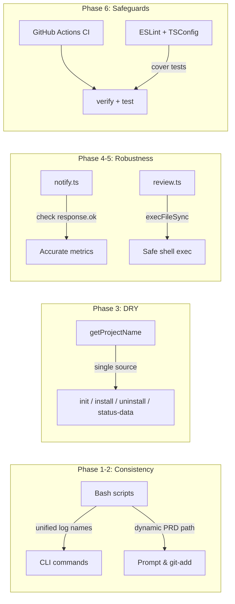
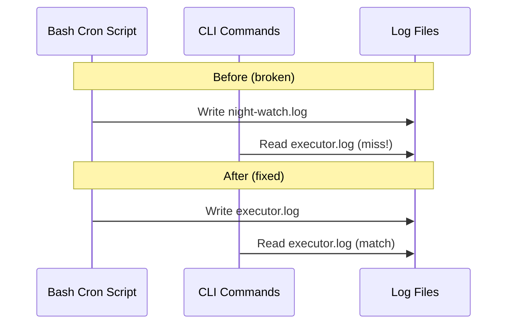

# PRD 10: Scalability & Code Quality Fixes

**Complexity: 5 → MEDIUM mode**

Based on: `docs/audits/SCALABILITY_CODE_QUALITY_AUDIT.md`

---

## 1. Context

**Problem:** The audit identified 8 findings (3 High, 3 Medium, 2 Low) around consistency gaps, duplicated helpers, and missing safeguards that increase operational risk and slow maintainability as the project grows.

**Files Analyzed:**

- `scripts/night-watch-cron.sh`
- `scripts/night-watch-pr-reviewer-cron.sh`
- `src/commands/logs.ts`
- `src/commands/status.ts`
- `src/commands/install.ts`
- `src/commands/uninstall.ts`
- `src/commands/init.ts`
- `src/commands/review.ts`
- `src/commands/dashboard.ts`
- `src/utils/notify.ts`
- `src/utils/status-data.ts`
- `src/constants.ts`
- `eslint.config.js`
- `tsconfig.json`
- `vitest.config.ts`
- `package.json`

**Current Behavior:**

- PRD path is configurable via `NW_PRD_DIR` but the cron prompt and `git add` hardcode `docs/PRDs/night-watch/`.
- Bash scripts write to `night-watch.log` / `night-watch-pr-reviewer.log`; CLI reads `executor.log` / `reviewer.log`.
- `getProjectName` is implemented in 4 separate files with varying logic.
- `sendWebhook` ignores HTTP response status — fulfilled promise = "sent".
- `review.ts` builds shell commands via string interpolation.
- ESLint ignores tests; TypeScript excludes tests; no CI pipeline exists.
- `@vitest/coverage-v8` is referenced in config but not installed.
- Dashboard `--interval` option is parsed but unused.

---

## 2. Solution

**Approach:**

- Fix the two high-impact consistency bugs (PRD path, log filenames) first — they affect correctness.
- Extract `getProjectName` into one shared utility and delete all duplicates.
- Make `sendWebhook` check `response.ok` and surface HTTP errors.
- Replace string-interpolated shell commands with `execFileSync` + argument arrays.
- Add a minimal GitHub Actions CI workflow, extend ESLint/TypeScript to cover tests, and install coverage dep.
- Wire the dashboard `--interval` option and mark as experimental.

**Architecture Diagram:**



**Key Decisions:**

- Log filenames unified to what CLI already expects: `executor.log` and `reviewer.log` (scripts adapt to CLI, not the other way around — CLI is the user-facing layer).
- `getProjectName` lives in `src/utils/status-data.ts` (already exported there with tests) — other files import it.
- No new modules or abstractions introduced — stays flat.
- CI is minimal: lint, type-check, test. Coverage is optional/non-blocking.

**Data Changes:** None

---

## 3. Sequence Flow



---

## 4. Execution Phases

### Phase 1: Fix PRD path hardcoding in cron script

**User-visible outcome:** Custom `NW_PRD_DIR` configurations no longer silently use the wrong path in the AI prompt and `git add`.

**Files (1):**

- `scripts/night-watch-cron.sh` — replace hardcoded `docs/PRDs/night-watch/` with `$PRD_DIR_REL` / `$PRD_DIR`

**Implementation:**

- [ ] Line 83: Change prompt from `docs/PRDs/night-watch/${ELIGIBLE_PRD}` to `${PRD_DIR_REL}/${ELIGIBLE_PRD}`
- [ ] Line 157: Change `git add -A docs/PRDs/night-watch/` to `git add -A "${PRD_DIR_REL}/"`

**Tests Required:**

| Test File | Test Name | Assertion |
|-----------|-----------|-----------|
| Manual grep | No remaining hardcoded `docs/PRDs/night-watch` in cron script | `grep -c 'docs/PRDs/night-watch' scripts/night-watch-cron.sh` returns 0 |

**Verification Plan:**

1. `grep -rn 'docs/PRDs/night-watch' scripts/night-watch-cron.sh` — should return 0 matches
2. `bash -n scripts/night-watch-cron.sh` — syntax check passes
3. `yarn verify` passes

---

### Phase 2: Unify log filename contract

**User-visible outcome:** `night-watch logs` and `night-watch status` correctly display runtime log data.

**Files (3):**

- `scripts/night-watch-cron.sh` — rename `night-watch.log` → `executor.log`
- `scripts/night-watch-pr-reviewer-cron.sh` — rename `night-watch-pr-reviewer.log` → `reviewer.log`
- `src/constants.ts` — add `EXECUTOR_LOG_FILE` and `REVIEWER_LOG_FILE` constants

**Implementation:**

- [ ] `scripts/night-watch-cron.sh:24`: Change `LOG_FILE="${LOG_DIR}/night-watch.log"` to `LOG_FILE="${LOG_DIR}/executor.log"`
- [ ] `scripts/night-watch-pr-reviewer-cron.sh:17`: Change `LOG_FILE="${LOG_DIR}/night-watch-pr-reviewer.log"` to `LOG_FILE="${LOG_DIR}/reviewer.log"`
- [ ] `src/constants.ts`: Add `export const EXECUTOR_LOG_FILE = "executor.log";` and `export const REVIEWER_LOG_FILE = "reviewer.log";`
- [ ] Update `src/commands/logs.ts:77-78` to use the new constants instead of inline strings
- [ ] Update `src/utils/status-data.ts` log path references to use the new constants (if any inline strings exist)

**Tests Required:**

| Test File | Test Name | Assertion |
|-----------|-----------|-----------|
| `src/__tests__/commands/logs.test.ts` | existing tests | Still pass (filenames unchanged from CLI perspective) |
| Manual grep | Log names consistent | `grep -rn 'night-watch.log\|night-watch-pr-reviewer.log' scripts/` returns 0 |

**Verification Plan:**

1. `grep -rn 'night-watch.log' scripts/` — 0 matches
2. `grep -rn 'night-watch-pr-reviewer.log' scripts/` — 0 matches
3. `bash -n scripts/night-watch-cron.sh && bash -n scripts/night-watch-pr-reviewer-cron.sh` — syntax OK
4. `yarn verify` passes
5. `yarn test` passes

---

### Phase 3: DRY refactor — consolidate `getProjectName`

**User-visible outcome:** No behavior change; reduces 4 implementations to 1, lowering maintenance risk.

**Files (4):**

- `src/utils/status-data.ts` — keep the canonical `getProjectName` (already exported, already tested)
- `src/commands/init.ts` — remove local `getProjectName`, import from `status-data.ts`
- `src/commands/install.ts` — remove local `getProjectName`, import from `status-data.ts`
- `src/commands/uninstall.ts` — remove local `getProjectName`, import from `status-data.ts`

**Implementation:**

- [ ] In `src/commands/init.ts`: Remove lines 109-114 (`getProjectName` function), add import `{ getProjectName }` from `../utils/status-data.js`
- [ ] In `src/commands/install.ts`: Remove lines 78-96 (`getProjectName` function), add import `{ getProjectName }` from `../utils/status-data.js`
- [ ] In `src/commands/uninstall.ts`: Remove lines 26-46 (`getProjectName` function), add import `{ getProjectName }` from `../utils/status-data.js`
- [ ] Note: `init.ts` has a simpler version (just `path.basename`). After consolidation, it will get the richer `package.json`-aware version — this is an improvement, not a regression.

**Tests Required:**

| Test File | Test Name | Assertion |
|-----------|-----------|-----------|
| `src/__tests__/utils/status-data.test.ts` | `getProjectName` suite (4 tests) | All pass (canonical source unchanged) |
| `src/__tests__/commands/init.test.ts` | existing tests | Still pass |
| `src/__tests__/commands/install.test.ts` | existing tests | Still pass |

**Verification Plan:**

1. `yarn test` — all 260+ tests pass
2. `yarn verify` — passes
3. `grep -rn 'function getProjectName' src/` — returns exactly 1 match in `status-data.ts`

---

### Phase 4: Fix notification false positives & harden shell commands

**User-visible outcome:** Webhook notifications report accurate success/failure counts; shell commands in review are injection-safe.

**Files (2):**

- `src/utils/notify.ts` — check `response.ok` after `fetch`, throw on non-2xx
- `src/commands/review.ts` — replace string-interpolated `execSync` with `execFileSync` + argument arrays for PR listing

**Implementation:**

- [ ] `src/utils/notify.ts:256-260`: Capture `fetch` response, check `response.ok`. If `!response.ok`, throw an error with `response.status` and `response.statusText` so the catch block logs it as a warning.
- [ ] `src/commands/review.ts:85-94`: Replace the string-built `gh pr list` command with `execFileSync("gh", ["pr", "list", "--state", "open", "--json", "number,title,headRefName", ...headArgs])` where `headArgs` is built from `branchPatterns` as an array of `["--head", pattern]` pairs flattened.

**Tests Required:**

| Test File | Test Name | Assertion |
|-----------|-----------|-----------|
| `src/__tests__/utils/notify.test.ts` | `should warn on non-2xx webhook response` | `warn()` called with status info |
| `src/__tests__/utils/notify.test.ts` | `should count non-2xx as failure in sendNotifications` | `sent` count excludes non-2xx |
| `src/__tests__/commands/review.test.ts` | existing tests | Still pass |

**Verification Plan:**

1. `yarn test` — all tests pass (including new notify tests)
2. `yarn verify` — passes
3. Review `notify.ts` diff confirms `response.ok` check is present
4. Review `review.ts` diff confirms no string interpolation in shell commands

---

### Phase 5: Expand lint/type coverage and add CI pipeline

**User-visible outcome:** PRs automatically run `verify` + `test`; linting covers test files; coverage dependency is installable.

**Files (5):**

- `eslint.config.js` — remove `**/*.test.ts` and `**/__tests__/` from ignores
- `tsconfig.json` — remove `src/__tests__/**/*` from `exclude` (or create a `tsconfig.test.json` that extends it)
- `package.json` — add `@vitest/coverage-v8` to devDependencies; add `"test:coverage": "vitest run --coverage"` script
- `vitest.config.ts` — no changes needed (coverage config already correct)
- `.github/workflows/ci.yml` — new minimal CI workflow

**Implementation:**

- [ ] `eslint.config.js:31`: Change ignores to `["dist/", "node_modules/", "scripts/", "templates/"]` (remove test ignores)
- [ ] Fix any ESLint errors that surface in test files (likely minimal — mostly `no-unused-vars` from mock patterns)
- [ ] `tsconfig.json:18`: Remove `"src/__tests__/**/*"` from exclude array so TypeScript checks tests too
- [ ] If tests use Vitest globals (`describe`, `it`, `expect`) without imports, add `"types": ["vitest/globals"]` to `compilerOptions` in tsconfig.json
- [ ] `package.json`: Add `"@vitest/coverage-v8": "^1.2.0"` to devDependencies, add `"test:coverage": "vitest run --coverage"` to scripts
- [ ] Create `.github/workflows/ci.yml`:

```yaml
name: CI
on:
  push:
    branches: [main]
  pull_request:
    branches: [main]

jobs:
  verify:
    runs-on: ubuntu-latest
    steps:
      - uses: actions/checkout@v4
      - uses: actions/setup-node@v4
        with:
          node-version: 20
          cache: yarn
      - run: yarn install --frozen-lockfile
      - run: yarn verify
      - run: yarn test
```

**Tests Required:**

| Test File | Test Name | Assertion |
|-----------|-----------|-----------|
| All existing test files | All 260+ tests | Pass under stricter type-checking |
| CI pipeline | `yarn verify && yarn test` | Green in GitHub Actions |

**Verification Plan:**

1. `yarn install` — installs `@vitest/coverage-v8` successfully
2. `yarn verify` — passes with tests now included in lint + type-check
3. `yarn test` — all tests pass
4. `yarn test:coverage` — runs without error, produces coverage report
5. `.github/workflows/ci.yml` — valid YAML (`cat .github/workflows/ci.yml | python3 -c "import sys,yaml;yaml.safe_load(sys.stdin)"` or similar)

---

### Phase 6: Dashboard interval wiring and experimental flag

**User-visible outcome:** Dashboard refreshes data at the configured `--interval`; help text marks it as experimental.

**Files (1):**

- `src/commands/dashboard.ts` — wire the `interval` option to a `setInterval` refresh loop; add `[experimental]` to command description

**Implementation:**

- [ ] Parse `--interval` as integer (already parsed, just unused)
- [ ] After initial render, set up `setInterval` that calls `fetchStatusSnapshot` and re-renders all panes
- [ ] Add `[experimental]` suffix to the `.description()` string
- [ ] Clear interval on screen `destroy` / `q` keypress (already handles quit)

**Tests Required:**

| Test File | Test Name | Assertion |
|-----------|-----------|-----------|
| `src/__tests__/commands/dashboard.test.ts` | existing tests | Still pass |
| `src/__tests__/commands/dashboard.test.ts` | `should include experimental in description` | Command description contains `experimental` |

**Verification Plan:**

1. `yarn test` — all tests pass
2. `yarn verify` — passes
3. `night-watch dashboard --help` shows `[experimental]` in description

---

## 5. Acceptance Criteria

- [ ] All 6 phases complete
- [ ] All tests pass (`yarn test`)
- [ ] `yarn verify` passes
- [ ] All automated checkpoint reviews passed
- [ ] No hardcoded `docs/PRDs/night-watch` in bash scripts
- [ ] Bash scripts and CLI agree on log filenames (`executor.log`, `reviewer.log`)
- [ ] `getProjectName` exists in exactly 1 file
- [ ] `sendWebhook` checks `response.ok`
- [ ] No string-interpolated shell commands in `review.ts`
- [ ] CI workflow runs `verify` + `test` on push/PR
- [ ] `yarn test:coverage` works
- [ ] Dashboard refreshes on interval
