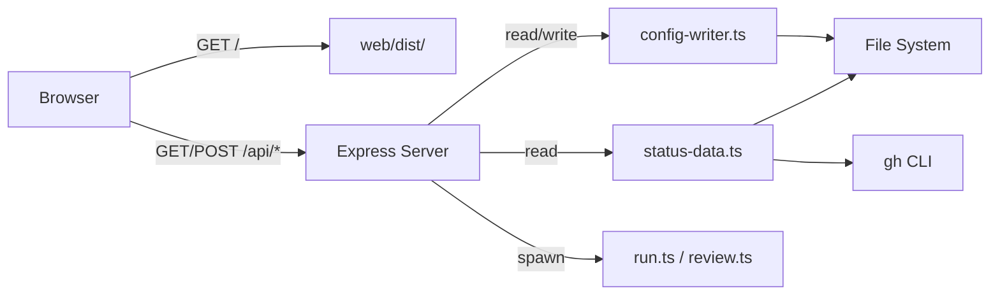
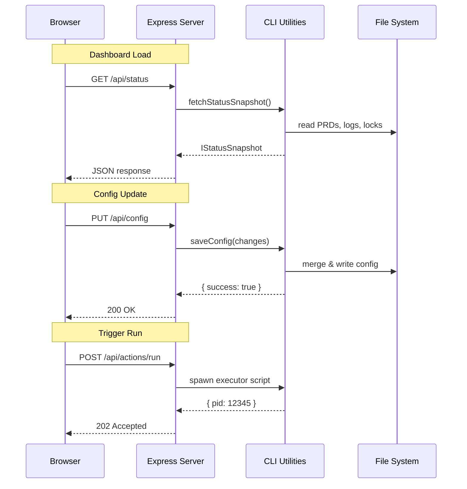

# PRD 12: Web UI Integration

**Complexity: 8 → HIGH mode**

> +3 (10+ files) +2 (new module: API server) +2 (multi-package: CLI + web) +1 (external integration: wrapping CLI)

---

## 1. Context

**Problem:** The `web/` React UI has a complete design (6 pages, component library, Zustand store) but uses only mock data. The CLI has all the real data and actions but no HTTP interface. Users cannot control Night Watch from a browser.

**Files Analyzed:**

- `src/cli.ts` - Commander registration
- `src/config.ts` - `loadConfig()` loader
- `src/types.ts` - `INightWatchConfig`, webhook types
- `src/constants.ts` - defaults, file paths
- `src/utils/status-data.ts` - `fetchStatusSnapshot()`, `collectPrdInfo()`, `collectPrInfo()`, `collectLogInfo()`, `getCrontabInfo()`
- `src/utils/config-writer.ts` - `saveConfig()`
- `src/commands/run.ts` - executor script runner
- `src/commands/review.ts` - reviewer script runner
- `src/commands/doctor.ts` - `validateWebhook()`, health checks
- `web/types.ts` - UI type definitions
- `web/constants.ts` - all mock data (`MOCK_PRDS`, `MOCK_PRS`, `MOCK_LOGS`, etc.)
- `web/store/useStore.ts` - Zustand store (toasts, project selection)
- `web/pages/*.tsx` - all 6 pages (Dashboard, PRDs, PRs, Actions, Logs, Settings)
- `web/App.tsx` - HashRouter setup
- `web/vite.config.ts` - Vite config, port 3000
- `web/package.json` - React 19, Vite 6, Zustand, Lucide
- `package.json` - CLI deps, scripts

**Current Behavior:**

- Web UI renders all pages with hardcoded mock data from `web/constants.ts`
- CLI has `fetchStatusSnapshot()` that aggregates PRDs, PRs, processes, logs, crontab into one snapshot
- `loadConfig()` reads config with defaults < file < env priority
- `saveConfig()` writes partial config changes preserving unknown keys
- No HTTP server exists. No API. Zero connection between web and CLI.

### Integration Points Checklist

**How will this feature be reached?**

- [x] Entry point: `night-watch serve` CLI command
- [x] Caller: User runs command in terminal, opens browser to `http://localhost:7575`
- [x] Registration: New `serveCommand()` registered in `src/cli.ts`

**Is this user-facing?**

- [x] YES - Web UI is the primary interface

**Full user flow:**

1. User runs: `night-watch serve` (optionally `--port 7575`)
2. Triggers: Express server starts, serves API + static web UI files
3. User opens: `http://localhost:7575` in browser
4. Web UI loads, fetches real data from `/api/*` endpoints
5. User can: view status, manage PRDs, trigger runs, edit config - all from the browser

---

## 2. Solution

**Approach:**

- Add Express as a dependency to serve a REST API wrapping existing CLI utilities
- New `night-watch serve` command starts the server on a configurable port (default 7575)
- API endpoints reuse `fetchStatusSnapshot()`, `collectPrdInfo()`, `loadConfig()`, `saveConfig()`, etc.
- Web UI replaces all mock data imports with `fetch()` calls to the local API
- Vite dev mode uses proxy to API server; production serves pre-built static files from `web/dist/`

**Architecture Diagram:**



**Key Decisions:**

- [x] **Express** - lightweight, well-known, ~500KB. Acceptable for a CLI that already ships `blessed` (~1MB).
- [x] **Single routes file** - ~10 endpoints don't justify separate route modules
- [x] **Port 7575** - avoids conflict with common ports (3000, 8080, etc.)
- [x] **Fire-and-forget actions** - POST `/api/actions/run` spawns the script and returns immediately with PID. Status is tracked via existing lock files.
- [x] **No auth** - local-only tool, localhost binding
- [x] **CORS enabled** for dev mode (Vite on :3000 → API on :7575)

**Data Changes:** None - reads/writes existing `night-watch.config.json` and PRD files.

---

## 3. Sequence Flow



---

## 4. API Specification

| Method | Endpoint | Handler | Description |
|--------|----------|---------|-------------|
| GET | `/api/status` | `fetchStatusSnapshot()` | Full project snapshot |
| GET | `/api/prds` | `collectPrdInfo()` | PRD list with status |
| GET | `/api/prds/:name` | `fs.readFileSync()` | PRD file content |
| GET | `/api/prs` | `collectPrInfo()` | Open PRs with CI status |
| GET | `/api/logs/:name` | `getLastLogLines()` | Last N lines of log file |
| GET | `/api/config` | `loadConfig()` | Current config |
| PUT | `/api/config` | `saveConfig()` | Update config fields |
| GET | `/api/doctor` | health checks | System health report |
| POST | `/api/actions/run` | spawn executor | Trigger PRD execution |
| POST | `/api/actions/review` | spawn reviewer | Trigger PR review |
| POST | `/api/actions/install-cron` | spawn install | Install cron entries |
| POST | `/api/actions/uninstall-cron` | spawn uninstall | Remove cron entries |

---

## 5. Execution Phases

### Phase 1: API Server Foundation

**User-visible outcome:** `night-watch serve` starts a server; `curl localhost:7575/api/status` returns real project data.

**Files (5):**

- `package.json` - add `express`, `cors`, `@types/express`, `@types/cors`
- `src/server/index.ts` - **NEW** - Express app, CORS, static file serving, all API routes
- `src/commands/serve.ts` - **NEW** - Commander command: parse `--port`, start server
- `src/cli.ts` - register `serveCommand`
- `tsconfig.json` - ensure `src/server/` is included in compilation

**Implementation:**

- [ ] Add dependencies: `yarn add express cors && yarn add -D @types/express @types/cors`
- [ ] Create `src/server/index.ts`:
  - `createApp(projectDir: string): Express` factory function
  - CORS middleware (allow all origins in dev)
  - JSON body parser
  - All API routes (GET `/api/status`, GET `/api/prds`, GET `/api/prds/:name`, GET `/api/prs`, GET `/api/logs/:name`, GET `/api/config`, PUT `/api/config`, GET `/api/doctor`, POST `/api/actions/run`, POST `/api/actions/review`, POST `/api/actions/install-cron`, POST `/api/actions/uninstall-cron`)
  - Static file serving: `express.static(path.join(__dirname, '../../web/dist'))` with SPA fallback
  - Export `startServer(projectDir: string, port: number)` function
- [ ] Implement route handlers:
  - `GET /api/status` → call `fetchStatusSnapshot(projectDir, loadConfig(projectDir))`, return JSON
  - `GET /api/prds` → call `collectPrdInfo()`, return array. Enrich each item with file content by reading the .md file.
  - `GET /api/prds/:name` → read PRD file content from `prdDir`, return `{ name, content }`
  - `GET /api/prs` → call `collectPrInfo()`, return array
  - `GET /api/logs/:name` → validate name is `executor` or `reviewer`, call `getLastLogLines()` with `lines` query param (default 200), return `{ name, lines: string[] }`
  - `GET /api/config` → call `loadConfig()`, return JSON
  - `PUT /api/config` → validate body, call `saveConfig()`, return result
  - `GET /api/doctor` → run health checks (git repo exists, provider CLI available, crontab status, config valid), return array of `{ name, status, detail }`
  - `POST /api/actions/run` → spawn `night-watch run` as detached child process, return `{ started: true, pid }`
  - `POST /api/actions/review` → spawn `night-watch review` as detached child process, return `{ started: true, pid }`
  - `POST /api/actions/install-cron` → spawn `night-watch install`, return result
  - `POST /api/actions/uninstall-cron` → spawn `night-watch uninstall`, return result
- [ ] Create `src/commands/serve.ts`:
  - Commander command: `program.command('serve').option('-p, --port <port>', 'Port number', '7575')`
  - Parse port, call `startServer(process.cwd(), port)`
  - Print "Night Watch UI running at http://localhost:{port}"
- [ ] Register in `src/cli.ts`: import and call `serveCommand(program)`

**Verification Plan:**

1. **Unit Tests:**
   - File: `src/__tests__/server.spec.ts`
   - `should return status snapshot on GET /api/status`
   - `should return PRD list on GET /api/prds`
   - `should return PR list on GET /api/prs`
   - `should return log lines on GET /api/logs/executor`
   - `should return config on GET /api/config`
   - `should update config on PUT /api/config`
   - `should return 400 for invalid log name`

2. **API Proof (curl):**
   ```bash
   # Start server
   night-watch serve --port 7575

   # Status
   curl http://localhost:7575/api/status | jq .projectName
   # Expected: "night-watch-cli" or similar

   # PRDs
   curl http://localhost:7575/api/prds | jq '.[0].name'

   # Config
   curl http://localhost:7575/api/config | jq .provider

   # Update config
   curl -X PUT http://localhost:7575/api/config \
     -H "Content-Type: application/json" \
     -d '{"minReviewScore": 85}' | jq .
   ```

3. **Evidence Required:**
   - [ ] `yarn verify` passes
   - [ ] All unit tests pass
   - [ ] curl commands return real project data

**User Verification:**

- Action: Run `night-watch serve`, then `curl http://localhost:7575/api/status`
- Expected: JSON response with real project name, PRD counts, process status

---

### Phase 2: Web UI API Client & Data Layer

**User-visible outcome:** Web UI fetches and displays real project data instead of mock data. Dashboard shows real PRD counts, process status, and PR info.

**Files (5):**

- `web/api.ts` - **NEW** - API client with fetch wrappers + React hooks
- `web/store/useStore.ts` - replace mock project data with API-driven state
- `web/types.ts` - align/extend types to match API response shapes
- `web/constants.ts` - remove mock data, export API base URL
- `web/vite.config.ts` - add dev proxy to API server

**Implementation:**

- [ ] Create `web/api.ts`:
  - `API_BASE` constant (empty string in production since same origin, or from env)
  - Generic `apiFetch<T>(path, options?)` wrapper with error handling
  - Functions: `fetchStatus()`, `fetchPrds()`, `fetchPrdContent(name)`, `fetchPrs()`, `fetchLogs(name, lines?)`, `fetchConfig()`, `updateConfig(changes)`, `fetchDoctor()`, `triggerRun()`, `triggerReview()`, `triggerInstallCron()`, `triggerUninstallCron()`
  - Custom hook: `useApi<T>(fetchFn, deps?)` - handles loading, error, data, refetch
- [ ] Update `web/types.ts`:
  - Add `StatusSnapshot` interface matching `IStatusSnapshot` from API
  - Add `DoctorCheck` interface
  - Add `ActionResult` interface
  - Keep existing `PRD`, `PullRequest`, `Status` types but ensure they align with API response shapes
- [ ] Update `web/constants.ts`:
  - Remove all `MOCK_*` exports
  - Export `API_BASE` (empty string for same-origin, or `http://localhost:7575` for dev)
  - Keep `PROJECTS` temporarily (will be replaced by real project info from status)
- [ ] Update `web/store/useStore.ts`:
  - Remove `PROJECTS` import
  - Add `projectName: string` state (set from API status response)
  - Keep toast functionality as-is
- [ ] Update `web/vite.config.ts`:
  - Add proxy: `'/api': { target: 'http://localhost:7575', changeOrigin: true }`
  - Remove Gemini API key defines

**Verification Plan:**

1. **Unit Tests:**
   - File: `web/__tests__/api.spec.ts` (if test infra exists in web/) - otherwise verify manually
   - `apiFetch should throw on non-OK response`
   - `fetchStatus should return parsed JSON`

2. **Manual Verification:**
   - Start API server: `night-watch serve`
   - Start web dev server: `cd web && yarn dev`
   - Open http://localhost:3000
   - Expected: No console errors about mock data; API calls visible in Network tab

3. **Evidence Required:**
   - [ ] `yarn verify` passes (CLI side)
   - [ ] `cd web && yarn build` succeeds
   - [ ] Browser Network tab shows successful `/api/status` call

**User Verification:**

- Action: Run `night-watch serve` in one terminal, `cd web && yarn dev` in another, open browser
- Expected: Dashboard loads with real project data (real PRD counts, real process status)

---

### Phase 3: Dashboard + PRDs + PRs Pages

**User-visible outcome:** Dashboard, PRDs, and PRs pages display real data from the CLI with loading states and error handling.

**Files (3):**

- `web/pages/Dashboard.tsx` - replace `MOCK_PRDS`/`MOCK_PRS` with API data
- `web/pages/PRDs.tsx` - replace `MOCK_PRDS` with API data, wire "New PRD" modal
- `web/pages/PRs.tsx` - replace `MOCK_PRS` with API data

**Implementation:**

- [ ] Update `web/pages/Dashboard.tsx`:
  - Import `useApi` hook and `fetchStatus` from `web/api.ts`
  - Fetch status on mount, extract PRD counts, process info, PR count from real data
  - Add loading skeleton states for cards
  - Map `IPrdInfo` statuses (`ready`/`blocked`/`in-progress`/`done`) to the kanban board
  - Show real process status (executor/reviewer running/idle with PIDs)
  - Cron status card shows real `crontab.installed` value
  - Quick Actions buttons call action API endpoints
- [ ] Update `web/pages/PRDs.tsx`:
  - Fetch PRDs via `fetchPrds()` on mount
  - Map API response to component's `PRD` type
  - PRD detail slide-over fetches full content via `fetchPrdContent(name)`
  - "Execute Now" button calls `triggerRun()`
  - Add loading and empty states
- [ ] Update `web/pages/PRs.tsx`:
  - Fetch PRs via `fetchPrs()` on mount
  - Map `IPrInfo` to component display (number, title, branch, ciStatus, reviewScore)
  - "Run Reviewer Now" button calls `triggerReview()`
  - Add loading and empty states

**Verification Plan:**

1. **Manual Verification (Automated + Manual checkpoint):**
   - Dashboard shows real PRD counts matching `night-watch status`
   - PRDs page shows actual PRD files from `docs/PRDs/night-watch/`
   - PRs page shows real open PRs (or empty state if none)
   - Quick action buttons trigger real commands

2. **Evidence Required:**
   - [ ] `cd web && yarn build` succeeds
   - [ ] Dashboard data matches `night-watch status` output
   - [ ] PRD list matches files in `docs/PRDs/night-watch/`

**User Verification:**

- Action: Open Dashboard, compare PRD counts with `night-watch status` output
- Expected: Numbers match. Clicking "Run Executor" triggers actual execution.

---

### Phase 4: Logs + Actions + Settings Pages

**User-visible outcome:** All remaining pages display real data. Settings page can read/write config. Actions page triggers real CLI commands.

**Files (3):**

- `web/pages/Logs.tsx` - real log data from API, filter support
- `web/pages/Actions.tsx` - real action triggers, live output concept
- `web/pages/Settings.tsx` - real config read/write, real doctor checks

**Implementation:**

- [ ] Update `web/pages/Logs.tsx`:
  - Fetch logs via `fetchLogs('executor', 500)` on mount
  - Tab switching between executor/reviewer fetches different log
  - Auto-refresh with `setInterval` (every 3s when auto-scroll is on)
  - Filter works on fetched log lines (client-side)
  - "Clear" button could be a future feature (not MVP critical)
- [ ] Update `web/pages/Actions.tsx`:
  - Action cards call real API: `triggerRun()`, `triggerReview()`, `triggerInstallCron()`, `triggerUninstallCron()`
  - Show toast on success/failure
  - Live terminal view: after triggering action, poll logs endpoint every 2s
  - Run history: derive from log file parsing or status (MVP: show current process status instead of full history)
- [ ] Update `web/pages/Settings.tsx`:
  - Fetch config via `fetchConfig()` on mount, populate form fields with real values
  - "Save" button calls `updateConfig(changes)` with form data
  - Health Check section calls `fetchDoctor()` and displays real results
  - All tabs populated: General (provider, branch, reviewer toggle), Runtime (scores, limits), Schedules (cron expressions), Provider Env (env vars table)

**Verification Plan:**

1. **Manual Verification:**
   - Logs page shows real log content
   - Settings page shows current config values
   - Saving settings updates `night-watch.config.json`
   - Doctor checks reflect real system state

2. **Evidence Required:**
   - [ ] `cd web && yarn build` succeeds
   - [ ] Settings save round-trips correctly (read → modify → save → read matches)
   - [ ] Log content matches `night-watch logs` output

**User Verification:**

- Action: Open Settings, change `minReviewScore` to 90, save. Check `night-watch.config.json`.
- Expected: File shows `"minReviewScore": 90`

---

### Phase 5: Build Pipeline & Production Serving

**User-visible outcome:** Running `night-watch serve` serves the fully built web UI without needing a separate dev server. `yarn build` produces both CLI and web bundles.

**Files (4):**

- `package.json` - add `build:web` script, update `files` array, update `build` script
- `web/package.json` - ensure build output goes to `web/dist/`
- `src/server/index.ts` - resolve static file path correctly for both dev and production
- `web/index.html` - ensure base path works for production serving

**Implementation:**

- [ ] Update `package.json`:
  - Add script: `"build:web": "cd web && yarn install && yarn build"`
  - Update `"build"`: `"tsc && yarn build:web"`
  - Add `"web/dist/"` to `"files"` array so it's included in npm package
- [ ] Update `web/package.json`:
  - Ensure `"build": "vite build"` outputs to `web/dist/`
  - Ensure `outDir` in vite config is `dist` (relative to web/, so `web/dist/`)
- [ ] Update `src/server/index.ts`:
  - Resolve static path: `path.join(__dirname, '../../web/dist')` for production
  - Add SPA fallback: any non-`/api` GET request serves `index.html`
  - Handle case where `web/dist/` doesn't exist (show helpful error message)
- [ ] Update `web/index.html` if needed:
  - Ensure `<base href="/">` or equivalent for HashRouter

**Verification Plan:**

1. **Integration Test:**
   ```bash
   # Full build
   yarn build

   # Verify web dist exists
   ls web/dist/index.html

   # Start production server
   night-watch serve

   # Verify static files served
   curl http://localhost:7575/ | head -5
   # Expected: HTML content with React app

   # Verify API still works
   curl http://localhost:7575/api/status | jq .projectName
   ```

2. **Evidence Required:**
   - [ ] `yarn build` succeeds (both CLI and web)
   - [ ] `yarn verify` passes
   - [ ] `night-watch serve` serves working web UI at localhost:7575
   - [ ] All API endpoints respond correctly
   - [ ] Web UI loads and displays real data without separate dev server

**User Verification:**

- Action: Run `yarn build && night-watch serve`, open `http://localhost:7575`
- Expected: Full web UI loads with real project data. All pages functional.

---

## 6. Acceptance Criteria

- [ ] `night-watch serve` command starts HTTP server on configurable port
- [ ] All 12 API endpoints return correct data
- [ ] Web UI displays real PRD, PR, log, config, and process data
- [ ] Settings page can read and update `night-watch.config.json`
- [ ] Action buttons trigger real CLI commands (run, review, install, uninstall)
- [ ] `yarn build` produces both CLI and web bundles
- [ ] `yarn verify` passes
- [ ] All tests pass
- [ ] Serving works in production mode (single `night-watch serve` command)

---

## Depends on: None
