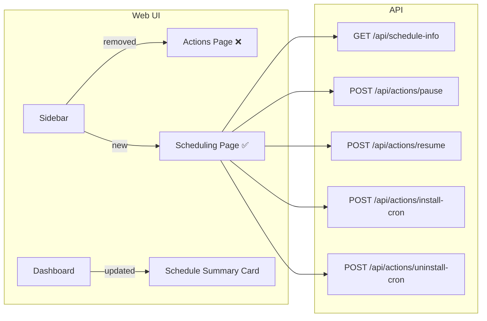
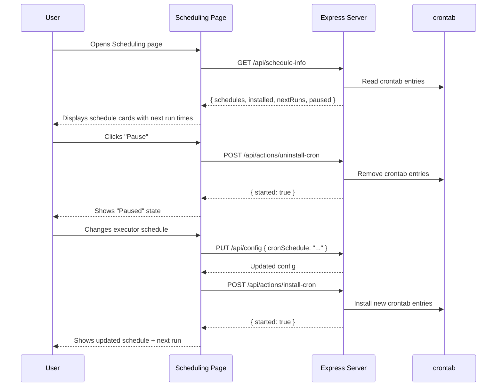

# PRD 12: Web UI Overhaul — Remove Actions, Add Scheduling, Fix Logs, Pause/Resume

**Complexity: 6 → MEDIUM mode**

---

## 1. Context

**Problem:** The web UI has a misplaced "Actions" section with unrelated buttons (Execute PRD, Review PRs) that belong as row actions on their respective pages. The Logs page has integration bugs. Scheduling (cron CRUD) is buried in Settings and lacks "next run" visibility. There is no way to pause/resume the watcher agent.

**Files Analyzed:**

- `web/App.tsx` — Router/routes
- `web/components/Sidebar.tsx` — Navigation items
- `web/pages/Actions.tsx` — **To be deleted**
- `web/pages/Logs.tsx` — Broken, needs fixing
- `web/pages/PRDs.tsx` — Needs row action for "Execute Now"
- `web/pages/PRs.tsx` — Needs "Run Reviewer" (already has it in header)
- `web/pages/Dashboard.tsx` — Quick Actions section needs update
- `web/pages/Settings.tsx` — Schedules tab to be extracted
- `web/api.ts` — API client, needs new endpoints
- `src/server/index.ts` — Express server, needs new endpoints
- `src/utils/status-data.ts` — Status snapshot builder

**Current Behavior:**

- "Actions" page has 4 buttons: Execute PRD, Review PRs, Install Cron, Uninstall Cron — none of these belong on a standalone page
- PRDs page already has a slide-over with "Execute Now" button (works via `triggerRun()`)
- PRs page already has "Run Reviewer Now" button in the header (works)
- Schedules are buried inside Settings > Schedules tab with install/uninstall
- No "next run" time displayed anywhere
- No pause/resume capability for the watcher
- Logs page fetches from `/api/logs/:name` but may fail when log files don't exist yet (no graceful empty state beyond "No logs available")
- Dashboard "Quick Actions" section duplicates Actions page content

---

## 2. Solution

**Approach:**

1. **Delete the Actions page** entirely — remove route, nav item, and file
2. **Replace with a new Scheduling page** — extract & enhance the Schedules tab from Settings into a dedicated top-level page with full cron CRUD, next-run display, and pause/resume
3. **Add a backend endpoint** `GET /api/schedule-info` that returns cron schedules, installed status, next-run timestamps, and paused state
4. **Add pause/resume endpoints** `POST /api/actions/pause` and `POST /api/actions/resume` that add/remove crontab entries without losing the schedule config
5. **Fix Logs page** — ensure graceful handling when log files don't exist, fix any broken integration
6. **Clean up Dashboard** — replace "Quick Actions" card with a "Scheduling" summary card linking to the new Scheduling page

**Key Decisions:**

- [x] Pause/resume works by installing/uninstalling cron entries while preserving `cronSchedule`/`reviewerSchedule` in config — no new config field needed, just use existing install/uninstall
- [x] Next-run calculation done server-side using `cron-parser` npm package (already available or trivially addable)
- [x] Reuse existing `SchedulePicker` component from Settings.tsx in the new Scheduling page
- [x] PRDs page already has "Execute Now" as a row action in the slide-over — no changes needed there
- [x] PRs page already has "Run Reviewer Now" in the header — no changes needed there
- [x] Error handling: display user-friendly messages for all failure states

**Architecture Diagram:**



**Data Changes:** None (no DB, no config schema changes). The `cron-parser` package is added as a dependency for next-run calculation.

---

## 3. Sequence Flow



---

## 4. Execution Phases

### Phase 1: Remove Actions page, update navigation

**User-visible outcome:** The Actions nav item is gone, replaced by a "Scheduling" item. The Scheduling page shows a placeholder.

**Files (4):**

- `web/pages/Actions.tsx` — Delete file
- `web/pages/Scheduling.tsx` — New file (placeholder)
- `web/components/Sidebar.tsx` — Replace Actions nav item with Scheduling
- `web/App.tsx` — Replace Actions route with Scheduling route

**Implementation:**

- [ ] Delete `web/pages/Actions.tsx`
- [ ] Create `web/pages/Scheduling.tsx` with a basic placeholder: heading "Scheduling" + "Coming soon" text
- [ ] In `Sidebar.tsx`, change the `Actions` nav item to `{ icon: Calendar, label: 'Scheduling', path: '/scheduling' }` — remove `PlayCircle` import, add `Calendar` import
- [ ] In `App.tsx`, replace `import Actions` with `import Scheduling`, change route from `/actions` to `/scheduling`

**Tests Required:**

| Test File | Test Name | Assertion |
|-----------|-----------|-----------|
| Manual | Navigate to /scheduling | Page renders with "Scheduling" heading |
| Manual | Old /actions URL | Redirects to / (caught by wildcard route) |
| Manual | Sidebar shows "Scheduling" | Nav item shows Calendar icon, label "Scheduling" |

**Verification Plan:**

1. `yarn verify` passes (no broken imports)
2. Manual: Start `night-watch serve`, navigate web UI, confirm Actions is gone and Scheduling appears

---

### Phase 2: Add schedule-info API endpoint with next-run calculation

**User-visible outcome:** The API returns cron schedule info including computed next-run timestamps.

**Files (3):**

- `package.json` — Add `cron-parser` dependency
- `src/server/index.ts` — Add `GET /api/schedule-info` endpoint
- `web/api.ts` — Add `fetchScheduleInfo()` client function and types

**Implementation:**

- [ ] Install `cron-parser`: `yarn add cron-parser`
- [ ] In `src/server/index.ts`, add a new handler `handleGetScheduleInfo`:
  ```typescript
  function handleGetScheduleInfo(projectDir: string, config: INightWatchConfig, _req: Request, res: Response): void {
    try {
      const CronParser = require("cron-parser");
      const snapshot = fetchStatusSnapshot(projectDir, config);
      const installed = snapshot.crontab.installed;
      const entries = snapshot.crontab.entries;

      const computeNextRun = (cronExpr: string): string | null => {
        try {
          const interval = CronParser.parseExpression(cronExpr);
          return interval.next().toISOString();
        } catch {
          return null;
        }
      };

      res.json({
        executor: {
          schedule: config.cronSchedule,
          installed,
          nextRun: installed ? computeNextRun(config.cronSchedule) : null,
        },
        reviewer: {
          schedule: config.reviewerSchedule,
          installed: installed && config.reviewerEnabled,
          nextRun: installed && config.reviewerEnabled ? computeNextRun(config.reviewerSchedule) : null,
        },
        paused: !installed,
        entries,
      });
    } catch (error) {
      res.status(500).json({ error: error instanceof Error ? error.message : String(error) });
    }
  }
  ```
- [ ] Register the endpoint: `app.get("/api/schedule-info", (req, res) => handleGetScheduleInfo(projectDir, config, req, res));`
- [ ] Also register in the global-mode project router
- [ ] In `web/api.ts`, add:
  ```typescript
  export interface ScheduleInfo {
    executor: { schedule: string; installed: boolean; nextRun: string | null };
    reviewer: { schedule: string; installed: boolean; nextRun: string | null };
    paused: boolean;
    entries: string[];
  }

  export function fetchScheduleInfo(): Promise<ScheduleInfo> {
    return apiFetch<ScheduleInfo>(apiPath('/api/schedule-info'));
  }
  ```

**Tests Required:**

| Test File | Test Name | Assertion |
|-----------|-----------|-----------|
| Manual (curl) | `curl http://localhost:7575/api/schedule-info` | Returns JSON with executor/reviewer schedule, nextRun, paused |

**Verification Plan:**

1. `yarn verify` passes
2. `curl http://localhost:7575/api/schedule-info | jq .` returns valid schedule info JSON

---

### Phase 3: Build the full Scheduling page

**User-visible outcome:** Scheduling page shows executor & reviewer schedules with next-run countdowns, cron CRUD (edit schedule + save & install), and pause/resume toggle.

**Files (2):**

- `web/pages/Scheduling.tsx` — Full implementation (replace placeholder)
- `web/api.ts` — Already done in Phase 2

**Implementation:**

- [ ] Build the Scheduling page with these sections:

  **A. Status Banner** (top):
  - Green when cron is active, amber when paused
  - Shows "Active" / "Paused" state
  - Large **Pause** / **Resume** button (calls `triggerUninstallCron()` / `triggerInstallCron()`)

  **B. Schedule Cards** (2 cards side-by-side):
  - **Executor Schedule** card:
    - Current schedule displayed as human-readable text + raw cron expression
    - "Next run" timestamp formatted as relative time (e.g., "in 2 hours") and absolute time
    - Pulsing green dot when next run is < 30 min away
    - Edit button that opens inline schedule picker (reuse `SchedulePicker` approach from Settings — cron preset dropdown + custom input)
  - **Reviewer Schedule** card:
    - Same layout as executor
    - Dimmed/disabled when `reviewerEnabled` is false (with note)

  **C. Active Crontab Entries** (bottom):
  - Table/list of actual installed crontab entries (raw text)
  - Each entry labeled as Executor or Reviewer
  - Human-readable schedule next to raw cron

  **D. Save & Install** button:
  - When user edits a schedule, enable "Save & Install" button
  - Calls `updateConfig()` then `triggerInstallCron()` sequentially
  - Shows success/error toast

- [ ] Use `useApi(fetchScheduleInfo, [...])` for data fetching with periodic refetch (every 30s for next-run countdown)
- [ ] Import `cronToHuman` utility — either move it to a shared file or inline it (it's currently in Settings.tsx)

**Tests Required:**

| Test File | Test Name | Assertion |
|-----------|-----------|-----------|
| Manual | Open Scheduling page | Shows schedule cards with next run times |
| Manual | Click Pause | Cron entries removed, status changes to "Paused" |
| Manual | Click Resume | Cron entries reinstalled, status changes to "Active" |
| Manual | Edit schedule + Save | Config updated, cron reinstalled with new schedule |

**Verification Plan:**

1. `yarn verify` passes
2. Manual: Navigate to Scheduling page, verify all sections render
3. Manual: Pause → confirm crontab cleared → Resume → confirm crontab restored
4. Manual: Change executor schedule → Save & Install → verify new cron entry

---

### Phase 4: Fix Logs page and clean up Dashboard

**User-visible outcome:** Logs page works reliably. Dashboard "Quick Actions" replaced with a compact scheduling summary.

**Files (3):**

- `web/pages/Logs.tsx` — Fix log loading/display issues
- `web/pages/Dashboard.tsx` — Replace Quick Actions card with Scheduling summary
- `web/pages/Settings.tsx` — Remove Schedules tab (it's now on the Scheduling page)

**Implementation:**

**Logs fixes:**
- [ ] Ensure the Export button actually works or remove it (currently it's a no-op dead button)
- [ ] Handle the case where status?.processes is undefined or empty (guard `getProcessStatus`)
- [ ] Ensure `logData` null/undefined is handled gracefully (currently `logData?.lines || []` — verify this works when API returns error vs empty)
- [ ] Add error boundary: if `fetchLogs` throws (e.g., log file doesn't exist yet), show "No logs yet — logs will appear after the first run" instead of the red error state

**Dashboard cleanup:**
- [ ] Replace the "Quick Actions" card (grid of 4 buttons) with a "Scheduling" summary card:
  - Show executor next run time (or "Paused" / "Not installed")
  - Show reviewer next run time
  - "Manage Schedules →" link to `/scheduling`
- [ ] Keep "Process Status" card as-is (it's useful)
- [ ] Remove imports: `Calendar`, `CalendarOff`, `triggerInstallCron`, `triggerUninstallCron` from Dashboard (no longer needed)

**Settings Schedules tab removal:**
- [ ] Remove the `schedules` tab object from the `tabs` array
- [ ] Remove `SchedulePicker` component, `CRON_PRESETS`, `cronToHuman`, `getPresetValue` from Settings.tsx (move `cronToHuman` to a shared utils file if needed by Scheduling page, or just keep a copy)
- [ ] Remove `cronSchedule` and `reviewerSchedule` from `ConfigForm` type and all related form handlers
- [ ] Remove `handleInstallCron`, `handleUninstallCron`, `handleSaveAndInstall` from Settings.tsx
- [ ] Remove unused imports: `Calendar`, `CalendarOff`, `Clock`, `triggerInstallCron`, `triggerUninstallCron` from Settings.tsx
- [ ] Keep General, Runtime, and Provider Env tabs

**Tests Required:**

| Test File | Test Name | Assertion |
|-----------|-----------|-----------|
| Manual | Open Logs when no log file exists | Shows "No logs yet" message, not error state |
| Manual | Open Logs with existing log | Logs render with line numbers and syntax highlighting |
| Manual | Dashboard loads | Scheduling summary shows next run times, no Quick Actions buttons |
| Manual | Settings page | Only General, Runtime, Provider Env tabs — no Schedules tab |

**Verification Plan:**

1. `yarn verify` passes
2. Manual: Delete `logs/executor.log`, open Logs page → verify graceful message
3. Manual: Dashboard shows scheduling summary instead of 4 action buttons
4. Manual: Settings no longer has Schedules tab

---

## 5. Shared Utility: `cronToHuman`

Since `cronToHuman` is needed in both `Scheduling.tsx` and possibly elsewhere, extract it to `web/utils/cron.ts`:

```typescript
// web/utils/cron.ts
export const CRON_PRESETS = [
  { label: 'Every 30 minutes', value: '*/30 * * * *' },
  { label: 'Every hour', value: '0 * * * *' },
  { label: 'Every 3 hours', value: '0 */3 * * *' },
  { label: 'Every 6 hours', value: '0 */6 * * *' },
  { label: 'Every 12 hours', value: '0 */12 * * *' },
  { label: 'Daily at midnight', value: '0 0 * * *' },
  { label: 'Daily at 9 AM', value: '0 9 * * *' },
  { label: 'Weekdays at 9 AM', value: '0 9 * * 1-5' },
  { label: 'Custom', value: '__custom__' },
];

export function cronToHuman(expr: string): string { /* ... existing logic ... */ }
export function getPresetValue(cronExpr: string): string { /* ... existing logic ... */ }
```

This extraction is done in Phase 3 when building the Scheduling page.

---

## 6. Acceptance Criteria

- [ ] All phases complete
- [ ] `yarn verify` passes after each phase
- [ ] Actions page fully removed (no route, no nav item, no file)
- [ ] Scheduling page shows executor + reviewer schedules with next-run times
- [ ] Pause/Resume toggle works (installs/uninstalls cron without losing schedule config)
- [ ] Logs page handles missing log files gracefully
- [ ] Dashboard Quick Actions replaced with Scheduling summary
- [ ] Settings no longer has Schedules tab (moved to Scheduling page)
- [ ] PRDs page "Execute Now" still works (already a row action)
- [ ] PRs page "Run Reviewer Now" still works (already in header)
- [ ] No orphaned imports or dead code

---

## Summary of Navigation Changes

| Before | After |
|--------|-------|
| Dashboard | Dashboard (updated summary card) |
| PRDs | PRDs (unchanged) |
| Pull Requests | Pull Requests (unchanged) |
| **Actions** | **Scheduling** (new) |
| Logs | Logs (fixed) |
| Settings | Settings (Schedules tab removed) |
