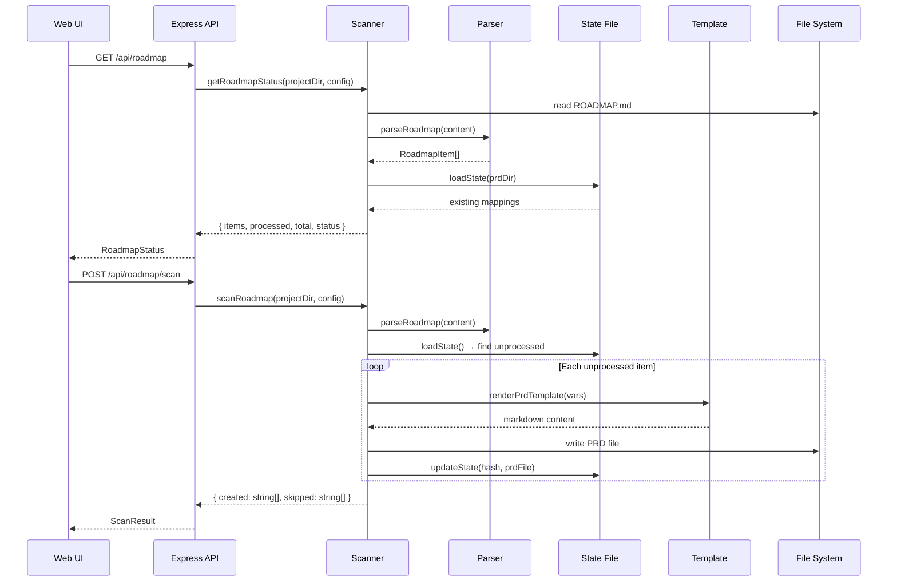

# PRD: Roadmap Scanner

**Complexity: 7 → HIGH**

**Depends on:**

---

## 1. Context

**Problem:** Users manually create PRDs one-by-one, even when they have a `ROADMAP.md` with all planned features already written. There's no automated way to parse a roadmap and generate PRD skeletons, causing friction and forgotten items.

**Files Analyzed:**
- `src/server/index.ts` - Express API server, route registration patterns
- `src/types.ts` - `INightWatchConfig` interface
- `src/constants.ts` - Default config values
- `src/config.ts` - Config loader with env overrides
- `src/utils/config-writer.ts` - Config persistence (saveConfig)
- `src/commands/prd.ts` - PRD creation logic (`slugify`, `getNextPrdNumber`, `renderPrdTemplate`)
- `src/templates/prd-template.ts` - PRD template renderer
- `src/utils/status-data.ts` - PRD info collection, status snapshot
- `web/App.tsx` - React routes
- `web/components/Sidebar.tsx` - Navigation items
- `web/api.ts` - API client functions, `useApi` hook, `apiPath` helper
- `web/pages/Dashboard.tsx` - Existing page pattern (useApi, cards, loading/error states)
- `web/pages/Scheduling.tsx` - Toggle/control pattern reference

**Current Behavior:**
- PRDs are created manually via `night-watch prd create <name>` CLI command
- The web UI shows existing PRDs but has no way to generate new ones from a roadmap
- No ROADMAP.md awareness exists anywhere in the codebase
- Template system (`renderPrdTemplate`) can generate PRD skeleton files programmatically

---

## 2. Solution

**Approach:**
- Parse `ROADMAP.md` from project root into discrete items (sections/features)
- Track which items have already been converted to PRDs via a state file (`.roadmap-state.json` in the PRD directory)
- Create PRD skeleton files using the existing template system (`renderPrdTemplate` + `slugify` + `getNextPrdNumber`)
- Expose scanner via REST API and a dedicated web UI page with enable/disable toggle, manual scan trigger, and progress indicator
- Auto-scan polls on a configurable interval when enabled; auto-pauses when all items are sliced

**Architecture Diagram:**

```mermaid
flowchart LR
    subgraph Web UI
        RP[Roadmap Page]
    end
    subgraph API
        RE[/api/roadmap]
        RS[/api/roadmap/scan]
        RT[/api/roadmap/toggle]
    end
    subgraph Backend
        Parser[roadmap-parser.ts]
        Scanner[roadmap-scanner.ts]
        State[.roadmap-state.json]
        Template[prd-template.ts]
    end
    RP --> RE
    RP --> RS
    RP --> RT
    RE --> Scanner
    RS --> Scanner
    RT --> Config
    Scanner --> Parser
    Scanner --> State
    Scanner --> Template
    Template --> PRDs[(PRD Files)]
```

**Key Decisions:**
- **Template-based PRD generation** (not AI-spawned): Use the existing `renderPrdTemplate()` to create PRD skeletons. This is deterministic, fast, and doesn't require provider credentials. The generated PRDs serve as properly-structured starting points that the executor (Claude) then implements.
- **State file for duplicate prevention**: `.roadmap-state.json` maps content hashes to PRD filenames. Combined with title matching against existing PRDs, this prevents duplicates even if the state file is deleted.
- **Config-driven toggle**: `roadmapScanner` object in `INightWatchConfig` for persistence. The web UI toggle writes to config via existing `PUT /api/config`.
- **Auto-stop**: When all parseable items have PRD entries, the scanner status becomes `"complete"` and no further PRDs are created until ROADMAP.md changes.
- **Flexible parsing**: Support both heading-based (`### Feature`) and checklist-based (`- [ ] Feature`) formats. Already-checked items (`- [x]`) are treated as "done/skip".

**Data Changes:**

New config fields added to `INightWatchConfig`:
```typescript
roadmapScanner: {
  enabled: boolean;       // default: false
  roadmapPath: string;    // default: "ROADMAP.md"
  autoScanInterval: number; // seconds between auto-scans, default: 300 (5 min)
}
```

New state file: `{prdDir}/.roadmap-state.json`:
```json
{
  "version": 1,
  "lastScan": "2026-02-16T10:00:00Z",
  "items": {
    "<hash>": {
      "title": "Feature Name",
      "prdFile": "13-feature-name.md",
      "createdAt": "2026-02-16T10:00:00Z"
    }
  }
}
```

---

## 3. Sequence Flow



---

## 4. Execution Phases

### Phase 1: Roadmap Parser + State Manager

**User-visible outcome:** Core parsing and state utilities exist and are tested.

**Files (3):**
- `src/utils/roadmap-parser.ts` — NEW: Parse ROADMAP.md into structured items
- `src/utils/roadmap-state.ts` — NEW: Load/save `.roadmap-state.json`, duplicate detection
- `tests/roadmap-parser.test.ts` — NEW: Unit tests for parser and state

**Implementation:**

- [ ] Create `src/utils/roadmap-parser.ts`:
  - `interface IRoadmapItem { hash: string; title: string; description: string; checked: boolean; section: string; }`
  - `parseRoadmap(content: string): IRoadmapItem[]` — Parses markdown into items
  - Parsing strategy:
    1. Split content by `## ` or `### ` headings to get sections
    2. Within sections, extract items by:
       - **Checklist format**: Lines matching `- [ ] Title` or `- [x] Title` (with optional description on following indented lines)
       - **Heading format**: `### Title` followed by body text (until next heading)
    3. For each item, generate `hash` = first 8 chars of SHA-256 of lowercase trimmed title
    4. `checked: true` for `- [x]` items (these are skipped during scanning)
    5. `section` = parent `##` heading text

- [ ] Create `src/utils/roadmap-state.ts`:
  - `interface IRoadmapState { version: number; lastScan: string; items: Record<string, { title: string; prdFile: string; createdAt: string }> }`
  - `loadRoadmapState(prdDir: string): IRoadmapState` — Read `.roadmap-state.json` or return empty state
  - `saveRoadmapState(prdDir: string, state: IRoadmapState): void` — Write state file
  - `isItemProcessed(state: IRoadmapState, hash: string): boolean`
  - State file path: `path.join(prdDir, '.roadmap-state.json')`

**Verification Plan:**

1. **Unit Tests:**
   - File: `tests/roadmap-parser.test.ts`
   - Tests:
     | Test Name | Assertion |
     |-----------|-----------|
     | `should parse checklist items from ROADMAP.md` | Returns correct IRoadmapItem[] with title, description, checked status |
     | `should parse heading-based items` | Extracts ### headings as items with body as description |
     | `should mark checked items as checked` | `- [x]` items have `checked: true` |
     | `should generate consistent hashes for same title` | Same title → same hash |
     | `should generate different hashes for different titles` | Different titles → different hashes |
     | `should extract section names from parent headings` | Items under `## Q1` have `section: "Q1"` |
     | `should handle empty ROADMAP.md` | Returns empty array |
     | `should handle mixed formats` | Both checklists and headings parsed correctly |
     | `should load empty state when file missing` | Returns `{ version: 1, items: {} }` |
     | `should save and reload state correctly` | Round-trip persistence works |
     | `should detect processed items` | `isItemProcessed` returns true for known hashes |

2. **Evidence Required:**
   - [ ] All tests pass (`yarn test tests/roadmap-parser.test.ts`)
   - [ ] `yarn verify` passes

---

### Phase 2: Scanner Engine + Config

**User-visible outcome:** Scanner can create PRD files from ROADMAP.md items. Config fields exist.

**Files (5):**
- `src/utils/roadmap-scanner.ts` — NEW: Core scanning logic
- `src/types.ts` — ADD: `IRoadmapScannerConfig` to `INightWatchConfig`
- `src/constants.ts` — ADD: Default roadmap scanner config values
- `src/config.ts` — ADD: Load roadmap scanner config from file/env
- `tests/roadmap-scanner.test.ts` — NEW: Integration tests

**Implementation:**

- [ ] Add to `src/types.ts`:
  ```typescript
  export interface IRoadmapScannerConfig {
    enabled: boolean;
    roadmapPath: string;
    autoScanInterval: number;
  }
  ```
  Add `roadmapScanner: IRoadmapScannerConfig;` to `INightWatchConfig`

- [ ] Add to `src/constants.ts`:
  ```typescript
  export const DEFAULT_ROADMAP_SCANNER: IRoadmapScannerConfig = {
    enabled: false,
    roadmapPath: "ROADMAP.md",
    autoScanInterval: 300,
  };
  ```

- [ ] Update `src/config.ts`:
  - Add `roadmapScanner` to `getDefaultConfig()` using the new constant
  - Add loading from config file in `normalizeConfig()`:
    - Read `rawConfig.roadmapScanner` object
    - Validate `enabled` (boolean), `roadmapPath` (string), `autoScanInterval` (number, min 30)
  - Add `NW_ROADMAP_SCANNER_ENABLED` env override
  - Add merge logic in `mergeConfigs()`

- [ ] Create `src/utils/roadmap-scanner.ts`:
  - `interface IRoadmapStatus { found: boolean; enabled: boolean; totalItems: number; processedItems: number; pendingItems: number; status: "idle" | "scanning" | "complete" | "disabled" | "no-roadmap"; items: Array<IRoadmapItem & { processed: boolean; prdFile?: string }> }`
  - `interface IScanResult { created: string[]; skipped: string[]; errors: string[] }`
  - `getRoadmapStatus(projectDir: string, config: INightWatchConfig): IRoadmapStatus`
    1. Check if ROADMAP.md exists at `path.join(projectDir, config.roadmapScanner.roadmapPath)`
    2. Parse it with `parseRoadmap()`
    3. Load state with `loadRoadmapState()`
    4. Also scan existing PRD filenames for title-based duplicate detection
    5. Compute processed/pending/total counts
    6. Return status: `"complete"` if all items processed, `"disabled"` if not enabled, `"no-roadmap"` if file missing
  - `scanRoadmap(projectDir: string, config: INightWatchConfig): IScanResult`
    1. Parse ROADMAP.md
    2. Load state
    3. For each unprocessed, unchecked item:
       a. Generate filename using `getNextPrdNumber()` + `slugify(item.title)`
       b. Render PRD template: `renderPrdTemplate({ title: item.title, dependsOn: [], complexityScore: 5, complexityLevel: "MEDIUM", complexityBreakdown: [], phaseCount: 3 })`
       c. Prepend a comment block to the generated PRD with the roadmap context:
          ```
          <!-- Roadmap Context:
          Section: {item.section}
          Description: {item.description}
          -->
          ```
       d. Write file to PRD directory
       e. Update state with hash → prdFile mapping
    4. Save state
    5. Return created/skipped/errors lists

**Verification Plan:**

1. **Unit/Integration Tests:**
   - File: `tests/roadmap-scanner.test.ts`
   - Tests:
     | Test Name | Assertion |
     |-----------|-----------|
     | `should return no-roadmap status when file missing` | `status === "no-roadmap"` |
     | `should return disabled status when scanner disabled` | `status === "disabled"` |
     | `should return complete when all items processed` | `status === "complete"` |
     | `should create PRD files from unprocessed items` | PRD files exist in prdDir |
     | `should skip already-processed items` | No duplicate PRDs created |
     | `should skip checked items` | `- [x]` items not converted to PRDs |
     | `should update state file after scan` | State file contains new entries |
     | `should detect duplicates by existing PRD title match` | Existing PRD with same slug not duplicated |
     | `should use correct numbering for new PRDs` | File numbers continue from existing max |

2. **Evidence Required:**
   - [ ] All tests pass (`yarn test tests/roadmap-scanner.test.ts`)
   - [ ] `yarn verify` passes

---

### Phase 3: API Endpoints

**User-visible outcome:** REST API endpoints for roadmap scanner are accessible and return correct data.

**Files (3):**
- `src/server/index.ts` — ADD: 3 new route handlers + route registrations (both single and global mode)
- `tests/roadmap-api.test.ts` — NEW: API endpoint tests
- `src/utils/config-writer.ts` — No changes needed (existing `saveConfig` handles new fields)

**Implementation:**

- [ ] Add handler `handleGetRoadmap(projectDir, config, req, res)`:
  - Call `getRoadmapStatus(projectDir, config)` from roadmap-scanner
  - Return the status object as JSON

- [ ] Add handler `handlePostRoadmapScan(projectDir, config, req, res)`:
  - Check `config.roadmapScanner.enabled` — return 409 if disabled
  - Call `scanRoadmap(projectDir, config)`
  - Return scan result as JSON

- [ ] Add handler `handlePutRoadmapToggle(projectDir, getConfig, reloadConfig, req, res)`:
  - Read `{ enabled: boolean }` from request body
  - Validate `enabled` is boolean
  - Call `saveConfig(projectDir, { roadmapScanner: { ...getConfig().roadmapScanner, enabled } })`
  - Reload config
  - Return updated config

- [ ] Register routes in `createApp()`:
  ```typescript
  app.get("/api/roadmap", (req, res) => handleGetRoadmap(projectDir, config, req, res));
  app.post("/api/roadmap/scan", (req, res) => handlePostRoadmapScan(projectDir, config, req, res));
  app.put("/api/roadmap/toggle", (req, res) => handlePutRoadmapToggle(projectDir, () => config, reloadConfig, req, res));
  ```

- [ ] Register routes in `createProjectRouter()` (global mode):
  ```typescript
  router.get("/roadmap", (req, res) => handleGetRoadmap(dir(req), cfg(req), req, res));
  router.post("/roadmap/scan", (req, res) => handlePostRoadmapScan(dir(req), cfg(req), req, res));
  router.put("/roadmap/toggle", (req, res) => handlePutRoadmapToggle(dir(req), () => cfg(req), () => {}, req, res));
  ```

- [ ] Add validation in `handlePutConfig` for the new `roadmapScanner` field:
  - Validate `enabled` is boolean
  - Validate `roadmapPath` is non-empty string
  - Validate `autoScanInterval` is number >= 30

**Verification Plan:**

1. **Integration Tests:**
   - File: `tests/roadmap-api.test.ts`
   - Tests:
     | Test Name | Assertion |
     |-----------|-----------|
     | `GET /api/roadmap should return status` | 200 with `{ found, enabled, totalItems, ... }` |
     | `GET /api/roadmap should return no-roadmap when missing` | `status === "no-roadmap"` |
     | `POST /api/roadmap/scan should create PRDs` | 200 with `{ created: [...], skipped: [...] }` |
     | `POST /api/roadmap/scan should 409 when disabled` | 409 response |
     | `PUT /api/roadmap/toggle should enable scanner` | Config updated, 200 response |
     | `PUT /api/roadmap/toggle should reject invalid body` | 400 response |

2. **API Proof (curl commands):**
   ```bash
   # Get roadmap status
   curl http://localhost:7575/api/roadmap | jq .
   # Expected: {"found":true,"enabled":false,"totalItems":5,"processedItems":0,"pendingItems":5,"status":"disabled","items":[...]}

   # Enable scanner
   curl -X PUT http://localhost:7575/api/roadmap/toggle \
     -H "Content-Type: application/json" \
     -d '{"enabled": true}' | jq .
   # Expected: config object with roadmapScanner.enabled = true

   # Trigger scan
   curl -X POST http://localhost:7575/api/roadmap/scan | jq .
   # Expected: {"created":["14-feature-name.md",...],"skipped":[],"errors":[]}
   ```

3. **Evidence Required:**
   - [ ] All tests pass (`yarn test tests/roadmap-api.test.ts`)
   - [ ] curl commands return expected responses
   - [ ] `yarn verify` passes

---

### Phase 4: Web UI — Roadmap Scanner Page

**User-visible outcome:** User can navigate to Roadmap Scanner page, see roadmap items, enable/disable scanner, and trigger scans.

**Files (4):**
- `web/pages/Roadmap.tsx` — NEW: Full Roadmap Scanner page
- `web/api.ts` — ADD: API functions + types for roadmap endpoints
- `web/App.tsx` — ADD: Route for `/roadmap`
- `web/components/Sidebar.tsx` — ADD: Navigation item for Roadmap

**Implementation:**

- [ ] Add to `web/api.ts`:
  ```typescript
  // Types
  export interface RoadmapItem {
    hash: string;
    title: string;
    description: string;
    checked: boolean;
    section: string;
    processed: boolean;
    prdFile?: string;
  }

  export interface RoadmapStatus {
    found: boolean;
    enabled: boolean;
    totalItems: number;
    processedItems: number;
    pendingItems: number;
    status: 'idle' | 'scanning' | 'complete' | 'disabled' | 'no-roadmap';
    items: RoadmapItem[];
  }

  export interface ScanResult {
    created: string[];
    skipped: string[];
    errors: string[];
  }

  // API Functions
  export function fetchRoadmap(): Promise<RoadmapStatus> {
    return apiFetch<RoadmapStatus>(apiPath('/api/roadmap'));
  }

  export function triggerRoadmapScan(): Promise<ScanResult> {
    return apiFetch<ScanResult>(apiPath('/api/roadmap/scan'), { method: 'POST' });
  }

  export function toggleRoadmapScanner(enabled: boolean): Promise<NightWatchConfig> {
    return apiFetch<NightWatchConfig>(apiPath('/api/roadmap/toggle'), {
      method: 'PUT',
      body: JSON.stringify({ enabled }),
    });
  }
  ```

- [ ] Add to `web/App.tsx`:
  - Import Roadmap page component
  - Add route: `<Route path="/roadmap" element={<Roadmap />} />`

- [ ] Add to `web/components/Sidebar.tsx`:
  - Import `Map` icon from lucide-react
  - Add nav item: `{ icon: Map, label: 'Roadmap', path: '/roadmap' }` (after PRDs item)

- [ ] Create `web/pages/Roadmap.tsx`:
  - **Header section:**
    - Page title "Roadmap Scanner"
    - Toggle switch (enabled/disabled) — calls `toggleRoadmapScanner()`
    - "Scan Now" button — calls `triggerRoadmapScan()`, disabled when scanner disabled or status is complete
    - Status badge: "No Roadmap" (gray), "Disabled" (gray), "Idle" (blue), "Complete" (green)
  - **Progress bar:**
    - Shows `processedItems / totalItems` with percentage
    - Green gradient when complete
  - **Items list:**
    - Grouped by `section`
    - Each item shows: title, description (truncated), processed badge (with PRD filename link), or pending badge
    - Checked items shown with strikethrough and "Skipped" label
  - **Auto-refresh:** Poll `fetchRoadmap()` every 10 seconds when enabled (to reflect auto-scan progress)
  - **Toast notifications:** Show success/error toast after scan trigger
  - **Empty state:** When no ROADMAP.md found, show helpful message with expected file location
  - Follow existing patterns: `useApi` hook, Card components, dark theme styling, loading/error states

**Verification Plan:**

1. **Manual Verification (UI visual changes — automated + manual checkpoint):**
   - [ ] Navigate to `/roadmap` in web UI
   - [ ] Page renders with toggle, scan button, and status
   - [ ] Toggle enables/disables scanner (config persisted)
   - [ ] Scan button creates PRDs (appear in PRDs page)
   - [ ] Progress bar updates correctly
   - [ ] Items grouped by section with correct badges
   - [ ] Sidebar shows Roadmap nav item with correct icon
   - [ ] Empty state shown when no ROADMAP.md

2. **Evidence Required:**
   - [ ] Page loads without errors
   - [ ] `yarn verify` passes
   - [ ] `yarn build:web` succeeds

---

### Phase 5: Auto-Scan + Completion Detection

**User-visible outcome:** When enabled, the scanner automatically checks for new roadmap items on an interval and stops when fully sliced.

**Files (3):**
- `src/server/index.ts` — ADD: Auto-scan timer management tied to server lifecycle
- `src/utils/roadmap-scanner.ts` — ADD: `hasNewItems()` check for change detection
- `web/pages/Roadmap.tsx` — ADD: Auto-scan status display (next scan countdown, last scan time)

**Implementation:**

- [ ] Add to `src/utils/roadmap-scanner.ts`:
  - `hasNewItems(projectDir: string, config: INightWatchConfig): boolean`
    1. Get status
    2. Return `status.pendingItems > 0`
  - Modify `scanRoadmap()` to only process items when `config.roadmapScanner.enabled` is true

- [ ] Add auto-scan timer in `src/server/index.ts`:
  - In `createApp()`, after route setup:
    ```typescript
    let autoScanTimer: NodeJS.Timeout | null = null;

    function startAutoScan() {
      if (autoScanTimer) clearInterval(autoScanTimer);
      autoScanTimer = setInterval(() => {
        const currentConfig = loadConfig(projectDir);
        if (!currentConfig.roadmapScanner.enabled) return;
        const status = getRoadmapStatus(projectDir, currentConfig);
        if (status.status === 'complete' || status.status === 'no-roadmap') return;
        scanRoadmap(projectDir, currentConfig);
      }, config.roadmapScanner.autoScanInterval * 1000);
    }

    function stopAutoScan() {
      if (autoScanTimer) { clearInterval(autoScanTimer); autoScanTimer = null; }
    }
    ```
  - Start auto-scan on server start if enabled
  - Stop auto-scan on graceful shutdown
  - Restart auto-scan when config is updated via `PUT /api/config` or `PUT /api/roadmap/toggle`

- [ ] Enhance `handleGetRoadmap` response to include `lastScan` timestamp from state file

- [ ] Update `web/pages/Roadmap.tsx`:
  - Show "Last scan: X minutes ago" from state's `lastScan`
  - Show "Auto-scan: every N minutes" when enabled
  - Show "Auto-scan paused — all items sliced" when status is complete

**Verification Plan:**

1. **Integration Test:**
   - File: `tests/roadmap-scanner.test.ts` (extend)
   - Tests:
     | Test Name | Assertion |
     |-----------|-----------|
     | `should detect new items when roadmap updated` | `hasNewItems` returns true after adding items |
     | `should not scan when disabled` | No PRDs created when enabled=false |
     | `should auto-stop when all items processed` | Status becomes "complete" |

2. **Manual Verification:**
   - [ ] Enable scanner, wait for auto-scan interval to elapse
   - [ ] Verify PRDs are automatically created
   - [ ] Add new item to ROADMAP.md, verify it gets picked up on next auto-scan
   - [ ] Verify scanner shows "Complete" when all items sliced

3. **Evidence Required:**
   - [ ] Tests pass (`yarn test`)
   - [ ] `yarn verify` passes
   - [ ] Auto-scan creates PRDs without manual trigger

---

## 5. Acceptance Criteria

- [ ] All phases complete
- [ ] All specified tests pass
- [ ] `yarn verify` passes
- [ ] All automated checkpoint reviews passed
- [ ] ROADMAP.md is parsed into discrete items (both checklist and heading formats)
- [ ] PRDs are created using the existing template system with correct numbering
- [ ] Duplicates are prevented (state file + existing PRD title matching)
- [ ] Scanner can be enabled/disabled from web UI toggle
- [ ] Manual "Scan Now" button works from web UI
- [ ] Auto-scan runs on interval when enabled
- [ ] Scanner auto-stops when all items are sliced (status: "complete")
- [ ] New roadmap items are detected when ROADMAP.md is updated
- [ ] Web UI page shows progress (processed/total), item list, and status
- [ ] Both single-project and global mode API routes work
- [ ] Sidebar navigation includes Roadmap Scanner link
