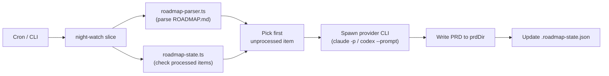
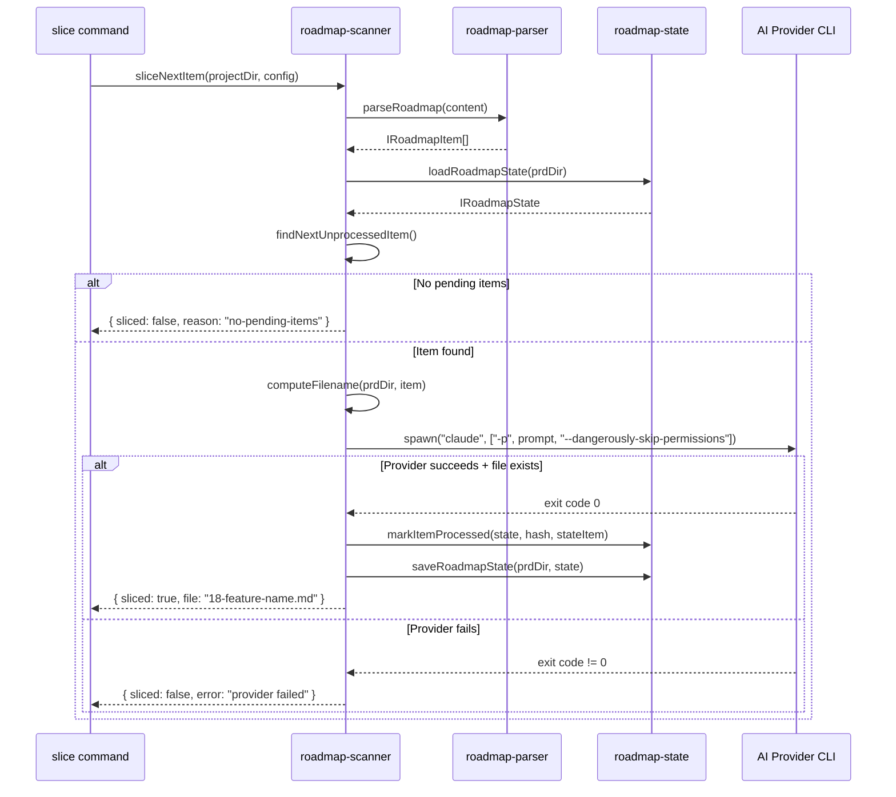

# PRD: AI-Powered Roadmap Slicer

**Complexity: 6 → MEDIUM mode**

```
COMPLEXITY SCORE (sum all that apply):
+2  Touches 6-10 files
+2  New system/module from scratch (slicer process)
+1  External API integration (AI provider CLI invocation)
+1  Touches 1-5 files (config/types)
= 6 → MEDIUM
```

---

## 1. Context

**Problem:** The current roadmap scanner is a static parser that creates skeleton PRD files from a template — it doesn't understand the codebase or produce actionable PRDs. The intent is for an AI to read the roadmap, analyze the codebase, and progressively generate fully fleshed-out PRDs (one per invocation) matching the prd-creator template format.

**Files Analyzed:**
- `src/utils/roadmap-scanner.ts` — Current static scanner (replace `createPrdFromItem` and `scanRoadmap`)
- `src/utils/roadmap-parser.ts` — Parses ROADMAP.md into structured items (keep as-is)
- `src/utils/roadmap-state.ts` — Tracks processed items via `.roadmap-state.json` (keep as-is)
- `src/commands/run.ts` — Executor CLI command (pattern to mirror)
- `src/commands/review.ts` — Reviewer CLI command (pattern to mirror)
- `src/commands/install.ts` — Crontab install logic (extend for slicer)
- `scripts/night-watch-cron.sh` — Executor cron script (pattern to mirror)
- `scripts/night-watch-pr-reviewer-cron.sh` — Reviewer cron script (pattern to mirror)
- `src/types.ts` — Config interfaces (extend with slicer config)
- `src/constants.ts` — Default values (add slicer defaults)
- `src/config.ts` — Config loading with env overrides (add slicer fields)
- `src/cli.ts` — Command registration (add slice command)
- `templates/prd-template.ts` — PRD template (referenced by slicer prompt)

**Current Behavior:**
- `roadmap-scanner.ts` parses ROADMAP.md and creates PRD files using `renderPrdTemplate()` — static template rendering, no AI
- All pending items are processed in a single `scanRoadmap()` call (no one-at-a-time behavior)
- Scanner is invoked from the web API (`POST /api/roadmap/scan`) and server auto-scan interval — not as a standalone process
- There is no CLI command for roadmap scanning — only the web API endpoint
- Tracking works well: `.roadmap-state.json` + slug-based duplicate detection

### Integration Points Checklist

**How will this feature be reached?**
- [x] Entry point identified: `night-watch slice` CLI command + `night-watch-slicer-cron.sh` cron script
- [x] Caller file identified: `src/cli.ts` registers the slice command; `install.ts` adds crontab entry
- [x] Registration/wiring needed: Register `sliceCommand` in `cli.ts`; add slicer crontab entry in `install.ts`/`performInstall()`

**Is this user-facing?**
- [x] YES → CLI command (`night-watch slice`, `night-watch slice --dry-run`)
- [x] Cron-scheduled automated process (third process alongside executor and reviewer)

**Full user flow:**
1. User configures `roadmapScanner.enabled: true` and optionally `slicerSchedule` in `night-watch.config.json`
2. User runs `night-watch slice` (manual) or cron triggers the slicer script
3. Slicer reads ROADMAP.md, finds the first unprocessed item, invokes AI provider to generate a full PRD
4. PRD file is written to `prdDir` (default: `docs/PRDs/night-watch/`) with next available number prefix
5. `.roadmap-state.json` is updated to track the processed item
6. Result displayed in CLI output (created file name, or "no pending items")

---

## 2. Solution

**Approach:**
- Add a **third autonomous process** ("slicer") alongside executor and reviewer — own CLI command, own cron script, own schedule config
- Replace the static `createPrdFromItem()` in `roadmap-scanner.ts` with AI-powered generation that spawns the configured provider CLI (`claude -p` or `codex --prompt`)
- The AI receives a prompt containing: (a) the roadmap item details, (b) the prd-creator template instructions, (c) the target file path — and has full codebase access via `--dangerously-skip-permissions` / `--yolo`
- Process **one item per invocation** — the `sliceNextItem()` function picks the first unprocessed/unchecked item, slices it, updates state, and exits
- The slicer prompt template lives in `templates/night-watch-slicer.md` and is interpolated at runtime with the roadmap item details and target path

**Architecture Diagram:**



**Key Decisions:**
- **Provider invocation pattern:** Same as executor/reviewer — spawn `claude -p "prompt" --dangerously-skip-permissions` or `codex --quiet --yolo --prompt "prompt"`. AI writes the PRD file itself (has full tool access).
- **Lock file:** `/tmp/night-watch-slicer-{project}.lock` prevents concurrent slicing
- **State tracking:** Reuse existing `.roadmap-state.json` mechanism (hash-based + slug dedup)
- **Error handling:** If AI invocation fails, the item is NOT marked as processed — it will be retried on next invocation
- **Existing web API:** `POST /api/roadmap/scan` and auto-scan interval will continue to call the existing `scanRoadmap()` but this now only processes one item using the AI. For the web endpoint, since AI invocation is long-running, the sync endpoint becomes a "trigger" that kicks off the slice and returns immediately with a job-started response (or we change it to only return status, not trigger slicing).

**Data Changes:**

New config fields in `IRoadmapScannerConfig`:
```typescript
interface IRoadmapScannerConfig {
  enabled: boolean;           // existing
  roadmapPath: string;        // existing
  autoScanInterval: number;   // existing
  slicerSchedule: string;     // NEW: cron schedule for slicer
  slicerMaxRuntime: number;   // NEW: max runtime in seconds
}
```

---

## 3. Sequence Flow



---

## 4. Execution Phases

**CRITICAL RULES:**
1. Each phase = ONE user-testable vertical slice
2. Max 5 files per phase (split if larger)
3. Each phase MUST include concrete tests
4. Checkpoint after each phase (automated ALWAYS required)

### Phase 1: Config & Type Additions — Slicer schedule and runtime become configurable

**Files (max 5):**
- `src/types.ts` — Add `slicerSchedule` and `slicerMaxRuntime` to `IRoadmapScannerConfig`
- `src/constants.ts` — Add `DEFAULT_SLICER_SCHEDULE`, `DEFAULT_SLICER_MAX_RUNTIME`
- `src/config.ts` — Load slicer config fields from file and env vars (`NW_SLICER_SCHEDULE`, `NW_SLICER_MAX_RUNTIME`)

**Implementation:**
- [ ] Add `slicerSchedule: string` and `slicerMaxRuntime: number` to `IRoadmapScannerConfig` in `src/types.ts`
- [ ] Add defaults in `src/constants.ts`: `DEFAULT_SLICER_SCHEDULE = "0 */6 * * *"` (every 6 hours), `DEFAULT_SLICER_MAX_RUNTIME = 600` (10 minutes — slicing one item should be fast)
- [ ] Update `DEFAULT_ROADMAP_SCANNER` to include the new fields
- [ ] Add `NW_SLICER_SCHEDULE` and `NW_SLICER_MAX_RUNTIME` env var parsing in `config.ts`
- [ ] Update `normalizeConfig()` to read `slicerSchedule` and `slicerMaxRuntime` from raw config

**Tests Required:**
| Test File | Test Name | Assertion |
|-----------|-----------|-----------|
| `src/__tests__/config.test.ts` | `should load slicerSchedule from config file` | `expect(config.roadmapScanner.slicerSchedule).toBe("0 */4 * * *")` |
| `src/__tests__/config.test.ts` | `should use default slicerMaxRuntime` | `expect(config.roadmapScanner.slicerMaxRuntime).toBe(600)` |
| `src/__tests__/config.test.ts` | `should override slicerSchedule from env` | `expect(config.roadmapScanner.slicerSchedule).toBe(envValue)` |

**Verification Plan:**
1. **Unit Tests:** Config loading with and without slicer fields
2. **User Verification:**
   - Action: Add `"roadmapScanner": { "slicerSchedule": "0 */4 * * *" }` to `night-watch.config.json`, run `night-watch status` — should not crash
   - Expected: Config loads without errors

**Checkpoint:** Run automated review after this phase completes.

---

### Phase 2: Slicer Prompt Template — AI receives instructions to generate a prd-creator-format PRD

**Files (max 5):**
- `templates/night-watch-slicer.md` — New: prompt template with placeholders for roadmap item details
- `src/templates/slicer-prompt.ts` — New: TypeScript function to interpolate the template with runtime values

**Implementation:**
- [ ] Create `templates/night-watch-slicer.md` with the full prd-creator prompt structure. The template instructs the AI to: (1) explore the codebase, (2) assess complexity, (3) write a complete PRD with context/solution/phases/tests/acceptance criteria. Placeholders: `{{TITLE}}`, `{{SECTION}}`, `{{DESCRIPTION}}`, `{{OUTPUT_FILE_PATH}}`, `{{PRD_DIR}}`
- [ ] Create `src/templates/slicer-prompt.ts` with `renderSlicerPrompt(vars: ISlicerPromptVars): string` that reads the template and interpolates values
- [ ] The prompt MUST instruct the AI to write the file to the exact `{{OUTPUT_FILE_PATH}}` — the slicer verifies the file exists after the AI exits
- [ ] The prompt MUST include the PRD template structure (from prd-creator skill) so the AI follows the correct format

**Tests Required:**
| Test File | Test Name | Assertion |
|-----------|-----------|-----------|
| `src/__tests__/slicer-prompt.test.ts` | `should interpolate all placeholders` | `expect(result).toContain(title)` and `expect(result).not.toContain("{{")` |
| `src/__tests__/slicer-prompt.test.ts` | `should include prd-creator template structure` | `expect(result).toContain("Complexity")` and `expect(result).toContain("Execution Phases")` |

**Verification Plan:**
1. **Unit Tests:** Template interpolation with various inputs
2. **User Verification:**
   - Action: Import and call `renderSlicerPrompt()` with test data
   - Expected: Returns a well-formed prompt with all placeholders filled

**Checkpoint:** Run automated review after this phase completes.

---

### Phase 3: Core Slicer Engine — Replace static PRD creation with AI-powered slicing

**Files (max 5):**
- `src/utils/roadmap-scanner.ts` — Replace `createPrdFromItem()` with `sliceRoadmapItem()` that spawns the AI provider; add `sliceNextItem()` as the primary entry point; keep `getRoadmapStatus()` and `hasNewItems()` unchanged
- `src/utils/roadmap-state.ts` — No changes needed (reuse as-is)

**Implementation:**
- [ ] Add `ISliceResult` interface: `{ sliced: boolean; file?: string; error?: string; item?: IRoadmapItem }`
- [ ] Add async `sliceRoadmapItem(projectDir: string, prdDir: string, item: IRoadmapItem, config: INightWatchConfig): Promise<ISliceResult>` that:
  1. Computes the next PRD number and filename using existing `getNextPrdNumber()` + `slugify()`
  2. Builds the slicer prompt using `renderSlicerPrompt()` with item details and output file path
  3. Spawns the provider CLI: `claude -p "prompt" --dangerously-skip-permissions` or `codex --quiet --yolo --prompt "prompt"`
  4. Waits for the process to exit
  5. Verifies the output file was created at the expected path
  6. Returns the result
- [ ] Add async `sliceNextItem(projectDir: string, config: INightWatchConfig): Promise<ISliceResult>` that:
  1. Checks if scanner is enabled
  2. Reads and parses ROADMAP.md
  3. Loads state and scans existing slugs
  4. Finds the first unprocessed, unchecked, non-duplicate item
  5. Calls `sliceRoadmapItem()` for that item
  6. On success, updates `.roadmap-state.json` via `markItemProcessed()`
  7. Returns the result
- [ ] Keep the existing synchronous `scanRoadmap()` function but change its behavior: instead of creating all PRDs, it now calls `sliceNextItem()` for ONE item only (making it async). Update the return type and callers accordingly.
- [ ] Remove the old `createPrdFromItem()` function (replaced by `sliceRoadmapItem()`)
- [ ] Provider invocation uses `child_process.spawn` with the same pattern as `executeScript()` in `src/utils/shell.ts` — inherit env, pipe stdout/stderr to a log file

**Tests Required:**
| Test File | Test Name | Assertion |
|-----------|-----------|-----------|
| `src/__tests__/roadmap-scanner.test.ts` | `sliceNextItem should pick the first unprocessed item` | Mock provider, verify correct item selected and state updated |
| `src/__tests__/roadmap-scanner.test.ts` | `sliceNextItem should skip checked items` | `expect(result.sliced).toBe(false)` when all items checked |
| `src/__tests__/roadmap-scanner.test.ts` | `sliceNextItem should skip already-processed items` | State has item hash → item skipped |
| `src/__tests__/roadmap-scanner.test.ts` | `sliceNextItem should return no-pending when all done` | `expect(result.sliced).toBe(false)` |
| `src/__tests__/roadmap-scanner.test.ts` | `sliceRoadmapItem should detect duplicate by slug` | Existing PRD with same slug → skip |
| `src/__tests__/roadmap-scanner.test.ts` | `sliceRoadmapItem should not update state on provider failure` | Mock provider exit code 1 → state unchanged |

**Verification Plan:**
1. **Unit Tests:** Mock the provider CLI spawn to test selection logic, state updates, and error handling
2. **User Verification:**
   - Action: Run tests with `yarn test src/__tests__/roadmap-scanner.test.ts`
   - Expected: All tests pass

**Checkpoint:** Run automated review after this phase completes.

---

### Phase 4: CLI Command + Cron Script — `night-watch slice` command and cron-scheduled process

**Files (max 5):**
- `src/commands/slice.ts` — New: CLI command mirroring `run.ts` / `review.ts` pattern (loads config, builds env vars, supports `--dry-run`, `--timeout`, `--provider`)
- `src/cli.ts` — Register the slice command
- `scripts/night-watch-slicer-cron.sh` — New: cron script mirroring `night-watch-pr-reviewer-cron.sh` pattern (lock file, provider invocation, log rotation)

**Implementation:**
- [ ] Create `src/commands/slice.ts` with:
  - `buildEnvVars(config, options)` — sets `NW_PROVIDER_CMD`, `NW_SLICER_MAX_RUNTIME`, `NW_PRD_DIR`, `NW_ROADMAP_PATH`, provider env
  - `sliceCommand(program)` — registers `night-watch slice` with options:
    - `--dry-run` — show roadmap status, pending items, and provider invocation without running
    - `--timeout <seconds>` — override max runtime
    - `--provider <string>` — override AI provider
  - Action: loads config, invokes `sliceNextItem()` directly (TypeScript-native, no bash script needed for the core logic). The cron script is a thin wrapper.
- [ ] Actually, for consistency with executor/reviewer, the CLI command should work in **two modes**:
  - **Direct mode (CLI):** `night-watch slice` calls `sliceNextItem()` directly in TypeScript — no bash script needed. Shows spinner, reports result.
  - **Cron mode:** `night-watch-slicer-cron.sh` is a thin bash wrapper that: acquires lock, calls `night-watch slice`, releases lock. This keeps the bash layer minimal (as recommended in ROADMAP.md).
- [ ] Register `sliceCommand` in `src/cli.ts` alongside other commands
- [ ] Create `scripts/night-watch-slicer-cron.sh` following the reviewer script pattern:
  - Acquire lock (`/tmp/night-watch-slicer-{project}.lock`)
  - Source helpers
  - Validate provider
  - Call `night-watch slice` (the CLI command handles everything)
  - Log rotation
  - Cleanup

**Tests Required:**
| Test File | Test Name | Assertion |
|-----------|-----------|-----------|
| `src/__tests__/commands/slice.test.ts` | `should register slice command` | `expect(program.commands.map(c => c.name())).toContain("slice")` |
| `src/__tests__/commands/slice.test.ts` | `should build correct env vars` | `expect(env.NW_PROVIDER_CMD).toBe("claude")` |
| `src/__tests__/commands/slice.test.ts` | `should include slicer max runtime in env` | `expect(env.NW_SLICER_MAX_RUNTIME).toBe("600")` |

**Verification Plan:**
1. **Unit Tests:** Command registration and env var building
2. **User Verification:**
   - Action: Run `yarn dev slice --dry-run` (or `npx tsx src/cli.ts slice --dry-run`)
   - Expected: Shows roadmap status, pending items count, provider info, without executing

**Checkpoint:** Run automated review after this phase completes.

---

### Phase 5: Install/Uninstall Integration — Slicer crontab entry added during install

**Files (max 5):**
- `src/commands/install.ts` — Add slicer crontab entry in `performInstall()`. Add `--no-slicer` flag to `IInstallOptions`. Slicer entry uses `slicerSchedule` from config and calls `night-watch slice`.
- `src/commands/uninstall.ts` — No changes needed if marker-based removal is already in place (verify)

**Implementation:**
- [ ] Add `noSlicer?: boolean` to `IInstallOptions`
- [ ] In `performInstall()`, after the reviewer entry, add slicer entry if `config.roadmapScanner.enabled && !options.noSlicer`:
  ```
  ${slicerSchedule} ${pathPrefix}${providerEnvPrefix}${cliBinPrefix}cd ${projectDir} && ${nightWatchBin} slice >> ${slicerLog} 2>&1  ${marker}
  ```
- [ ] Add `--no-slicer` option to the install command's CLI registration
- [ ] Update install success output to show slicer log path
- [ ] Verify uninstall removes slicer entry (it should — marker-based removal catches all entries)

**Tests Required:**
| Test File | Test Name | Assertion |
|-----------|-----------|-----------|
| `src/__tests__/commands/install.test.ts` | `should add slicer crontab entry when scanner enabled` | Result includes slicer entry |
| `src/__tests__/commands/install.test.ts` | `should skip slicer entry when scanner disabled` | No slicer entry in result |
| `src/__tests__/commands/install.test.ts` | `should skip slicer entry with --no-slicer flag` | No slicer entry in result |

**Verification Plan:**
1. **Unit Tests:** Install logic with slicer enabled/disabled
2. **User Verification:**
   - Action: Run `night-watch install --dry-run` (or inspect `performInstall()` output)
   - Expected: Slicer crontab entry appears when `roadmapScanner.enabled: true`

**Checkpoint:** Run automated review after this phase completes.

---

### Phase 6: Update Web API & Existing Tests — Web endpoint reflects new behavior

**Files (max 5):**
- `src/server/index.ts` — Update `POST /api/roadmap/scan` to call `sliceNextItem()` (async). Change response to reflect one-item-at-a-time behavior. Remove the auto-scan interval (slicer cron handles it now) or keep it but call `sliceNextItem()`.
- `src/__tests__/roadmap-scanner.test.ts` — Update existing tests to match new async API. Remove tests for old bulk `scanRoadmap()` behavior. Ensure backward-compatible status tests still pass.

**Implementation:**
- [ ] In `src/server/index.ts`, update the scan endpoint handler:
  - Make it async
  - Call `sliceNextItem()` instead of `scanRoadmap()`
  - Return `{ sliced: boolean, file?: string, error?: string }` instead of `{ created: string[], skipped: string[], errors: string[] }`
- [ ] Remove or simplify the auto-scan interval (the slicer cron replaces it). If keeping auto-scan, make it call `sliceNextItem()`.
- [ ] Update `src/__tests__/roadmap-scanner.test.ts`:
  - Update `scanRoadmap` tests to reflect one-item behavior
  - Mock the provider CLI spawn in integration tests
  - Keep status tests unchanged (they don't depend on scanning behavior)

**Tests Required:**
| Test File | Test Name | Assertion |
|-----------|-----------|-----------|
| `src/__tests__/roadmap-scanner.test.ts` | `scanRoadmap should process only one item` | `expect(result.created.length).toBeLessThanOrEqual(1)` |
| `src/__tests__/roadmap-scanner.test.ts` | `existing status tests still pass` | All `getRoadmapStatus` tests green |

**Verification Plan:**
1. **Unit Tests:** `yarn test src/__tests__/roadmap-scanner.test.ts`
2. **Integration Test:** `yarn verify` passes
3. **User Verification:**
   - Action: Run `yarn verify && yarn test`
   - Expected: All tests pass, no type errors

**Checkpoint:** Run automated review after this phase completes.

---

## 5. Acceptance Criteria

- [ ] All phases complete
- [ ] All specified tests pass
- [ ] `yarn verify` passes
- [ ] All automated checkpoint reviews passed
- [ ] `night-watch slice` command is registered and functional
- [ ] `night-watch slice --dry-run` shows roadmap status and pending items
- [ ] Running `night-watch slice` with a ROADMAP.md picks ONE unprocessed item and generates a PRD via AI
- [ ] Generated PRD follows prd-creator template format (Context, Solution, Phases, Tests, Acceptance Criteria)
- [ ] `.roadmap-state.json` is updated after successful slicing
- [ ] Duplicate items are not sliced twice (hash + slug detection)
- [ ] `night-watch install` adds slicer crontab entry when `roadmapScanner.enabled: true`
- [ ] Slicer cron script acquires lock to prevent concurrent slicing
- [ ] Failed AI invocations do NOT mark the item as processed (retryable)
