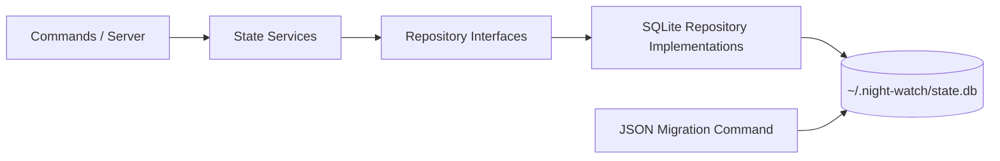
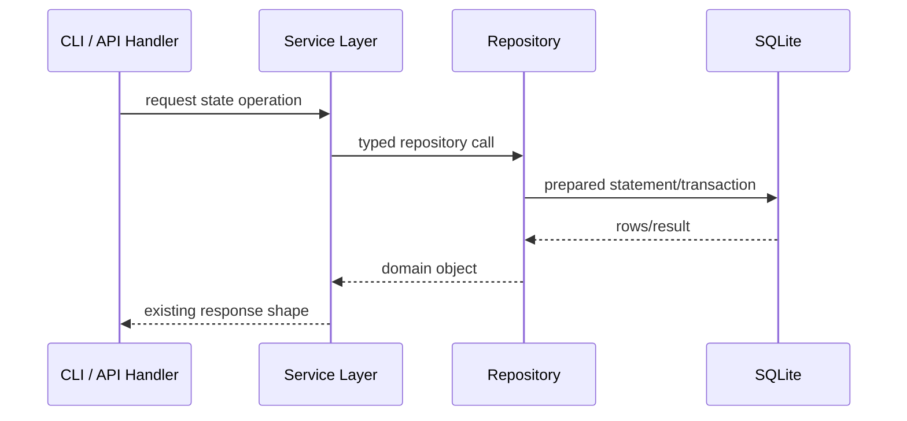

# PRD 19: State Persistence Refactor (Repository + SQLite)

**Complexity: 7 → MEDIUM mode**

```text
COMPLEXITY SCORE (sum all that apply):
+2 Cross-cutting refactor touching multiple state domains
+2 Data migration from existing JSON files
+2 New persistence subsystem + repository abstraction
+1 Behavior-preserving migration with backward compatibility checks
= 7 → MEDIUM
```

---

## 1. Context

**Problem:** Runtime state is currently spread across multiple JSON files under `~/.night-watch`, with inconsistent write guarantees and no single abstraction boundary. This makes state behavior fragile and encourages persistence logic to spread through the codebase.

**Files Analyzed:**
- `src/utils/registry.ts`
- `src/utils/execution-history.ts`
- `src/utils/prd-states.ts`
- `src/utils/roadmap-state.ts`
- `src/utils/status-data.ts`
- `src/commands/history.ts`
- `src/commands/prd-state.ts`
- `src/server/index.ts`
- `src/constants.ts`

**Current Behavior:**
- `projects.json`, `history.json`, and `prd-states.json` are global state files under `~/.night-watch`
- Roadmap scanner state is persisted as `.roadmap-state.json` in each PRD directory
- `execution-history.ts` has lock+atomic writes, but other state modules use plain read/modify/write
- State shape/versioning is implicit; corruption handling is mostly "return empty"
- Persistence details (file paths, JSON parsing, structure assumptions) are embedded in utility modules

---

## 2. Solution

**Approach:**
- Introduce a dedicated persistence layer with repository interfaces and SQLite-backed implementations.
- Use a single database file: `${NIGHT_WATCH_HOME || ~/.night-watch}/state.db`.
- Keep `night-watch.config.json` as JSON (human-edited config remains file-based).
- Migrate existing JSON state to SQLite via a one-time idempotent migration command.
- Constrain SQL to repository implementation files only (no ad-hoc queries elsewhere).

**Architecture Diagram:**



**Key Decisions:**
- [x] Use SQLite for local CLI state (no external DB server dependency)
- [x] Use `better-sqlite3` for sync, transactional CLI-friendly access
- [x] Enable WAL mode + `busy_timeout` to reduce lock contention
- [x] Repository interfaces are the only persistence API exposed to application logic
- [x] Preserve existing CLI behavior/output contracts while swapping backend

**Data Model (initial schema):**

```sql
CREATE TABLE projects (
  id INTEGER PRIMARY KEY,
  name TEXT NOT NULL,
  path TEXT NOT NULL UNIQUE,
  created_at INTEGER NOT NULL
);

CREATE TABLE execution_history (
  id INTEGER PRIMARY KEY,
  project_path TEXT NOT NULL,
  prd_file TEXT NOT NULL,
  timestamp INTEGER NOT NULL,
  outcome TEXT NOT NULL,
  exit_code INTEGER NOT NULL,
  attempt INTEGER NOT NULL
);
CREATE INDEX idx_history_lookup
  ON execution_history(project_path, prd_file, timestamp DESC);

CREATE TABLE prd_states (
  project_path TEXT NOT NULL,
  prd_name TEXT NOT NULL,
  status TEXT NOT NULL,
  branch TEXT NOT NULL,
  timestamp INTEGER NOT NULL,
  PRIMARY KEY(project_path, prd_name)
);

CREATE TABLE roadmap_states (
  prd_dir TEXT PRIMARY KEY,
  version INTEGER NOT NULL,
  last_scan TEXT NOT NULL,
  items_json TEXT NOT NULL
);

CREATE TABLE schema_meta (
  key TEXT PRIMARY KEY,
  value TEXT NOT NULL
);
```

---

## 3. Sequence Flow



---

## 4. Execution Phases

### Phase 1: Persistence Foundation

**User-visible outcome:** No functional changes yet; project has a reusable SQL foundation and repository contracts.

**Files (max 5):**
- `src/storage/sqlite/client.ts` — DB bootstrap, pragmas, connection handling
- `src/storage/sqlite/migrations.ts` — schema creation/versioning
- `src/storage/repositories/interfaces.ts` — repository contracts
- `src/storage/repositories/index.ts` — repository factory
- `src/constants.ts` — add `STATE_DB_FILE_NAME`

**Implementation:**
- [ ] Add SQLite dependency (`better-sqlite3`) and types
- [ ] Implement DB initializer with:
  - `PRAGMA journal_mode = WAL`
  - `PRAGMA busy_timeout = 5000`
  - migration bootstrap + schema version tracking
- [ ] Define interfaces:
  - `IProjectRegistryRepository`
  - `IExecutionHistoryRepository`
  - `IPrdStateRepository`
  - `IRoadmapStateRepository`
- [ ] Add repository factory used by services/utils

**Tests Required:**
| Test File | Test Name | Assertion |
|-----------|-----------|-----------|
| `src/__tests__/storage/sqlite/migrations.test.ts` | `creates schema on empty db` | all tables exist |
| `src/__tests__/storage/sqlite/migrations.test.ts` | `migration is idempotent` | second run makes no destructive changes |

**Verification Plan:**
1. `yarn test src/__tests__/storage/sqlite/migrations.test.ts`
2. Confirm `state.db` is created under `NIGHT_WATCH_HOME` override path

---

### Phase 2: Migrate Registry + Execution History Repositories

**User-visible outcome:** `night-watch` commands keep working with registry/history now backed by SQLite.

**Files (max 5):**
- `src/storage/repositories/sqlite/project-registry-repository.ts`
- `src/storage/repositories/sqlite/execution-history-repository.ts`
- `src/utils/registry.ts`
- `src/utils/execution-history.ts`
- `src/__tests__/utils/execution-history.test.ts`

**Implementation:**
- [ ] Implement registry and execution-history SQL repositories
- [ ] Keep current exported utility function signatures stable
- [ ] Refactor `registry.ts` and `execution-history.ts` to delegate to repositories
- [ ] Preserve existing behavior: record trimming to max N, cooldown checks, path normalization

**Tests Required:**
| Test File | Test Name | Assertion |
|-----------|-----------|-----------|
| `src/__tests__/utils/execution-history.test.ts` | existing suite | all pass against SQLite backend |
| `src/__tests__/utils/registry.test.ts` | register/unregister/validate | behavior unchanged |

**Verification Plan:**
1. `yarn test src/__tests__/utils/execution-history.test.ts`
2. `yarn test src/__tests__/utils/registry.test.ts`

---

### Phase 3: Migrate PRD State + Roadmap State Repositories

**User-visible outcome:** pending-review state and roadmap processing state are persisted via the same SQL layer.

**Files (max 5):**
- `src/storage/repositories/sqlite/prd-state-repository.ts`
- `src/storage/repositories/sqlite/roadmap-state-repository.ts`
- `src/utils/prd-states.ts`
- `src/utils/roadmap-state.ts`
- `src/__tests__/roadmap-parser.test.ts`

**Implementation:**
- [ ] Implement repository methods for PRD state CRUD/list
- [ ] Store roadmap state `items` as JSON blob in `roadmap_states.items_json`
- [ ] Keep utility function contracts unchanged (`loadRoadmapState`, `saveRoadmapState`, etc.)
- [ ] Preserve fallback/default behavior for missing state

**Tests Required:**
| Test File | Test Name | Assertion |
|-----------|-----------|-----------|
| `src/__tests__/roadmap-parser.test.ts` | roadmap state load/save tests | all pass with SQL-backed storage |
| `src/__tests__/commands/prd.test.ts` | pending-review state behavior | unchanged outcomes |

**Verification Plan:**
1. `yarn test src/__tests__/roadmap-parser.test.ts`
2. `yarn test src/__tests__/commands/prd.test.ts`

---

### Phase 4: JSON → SQLite Migration Command

**User-visible outcome:** Existing users keep their state after upgrade.

**Files (max 5):**
- `src/storage/json-state-migrator.ts`
- `src/commands/state.ts` — `night-watch state migrate`
- `src/cli.ts` — command registration
- `src/__tests__/commands/state.test.ts`
- `docs/commands.md` — migration usage docs

**Implementation:**
- [ ] Add idempotent migration command that reads legacy files:
  - `projects.json`
  - `history.json`
  - `prd-states.json`
  - `.roadmap-state.json` files discovered under configured PRD dirs
- [ ] Run migration in a transaction per domain
- [ ] Backup legacy JSON to `~/.night-watch/backups/` before write
- [ ] Record migration metadata in `schema_meta`

**Tests Required:**
| Test File | Test Name | Assertion |
|-----------|-----------|-----------|
| `src/__tests__/commands/state.test.ts` | migrates legacy JSON into db | row counts match fixture |
| `src/__tests__/commands/state.test.ts` | re-running migration is safe | no duplicate records |
| `src/__tests__/commands/state.test.ts` | backup files are created | backup path exists |

**Verification Plan:**
1. Run migration on a fixture with all legacy files
2. Validate command outputs and data parity

---

### Phase 5: Boundary Enforcement + Cleanup

**User-visible outcome:** Stable persistence architecture with no query sprawl.

**Files (max 5):**
- `eslint.config.js` — guardrails for SQL/query boundary
- `src/server/index.ts` — ensure state operations go through utilities/services only
- `src/commands/history.ts` — repository-backed utility path only
- `src/commands/prd-state.ts` — repository-backed utility path only
- `docs/architecture-overview.md` — update persistence diagram

**Implementation:**
- [ ] Add lint restriction: SQL library imports allowed only under `src/storage/**`
- [ ] Confirm command/server modules do not construct SQL directly
- [ ] Remove now-unused JSON-specific file helpers where safe

**Tests Required:**
| Test File | Test Name | Assertion |
|-----------|-----------|-----------|
| `yarn verify` | lint + typecheck | boundary rules enforced |
| `yarn test` | full suite | no behavior regressions |

**Verification Plan:**
1. `rg -n "SELECT|INSERT|UPDATE|DELETE|better-sqlite3" src --glob '!src/storage/**'` returns 0
2. `yarn verify && yarn test`

---

## 5. Acceptance Criteria

- [ ] All phases complete
- [ ] All tests pass
- [ ] Existing CLI behavior remains backward compatible
- [ ] Legacy JSON state can be migrated safely and idempotently
- [ ] `NIGHT_WATCH_HOME` override still works for storage location
- [ ] All SQL access is centralized in repository implementations under `src/storage/**`
- [ ] No ad-hoc queries are present in commands, server handlers, or utility modules
- [ ] Config file remains JSON and user-editable (`night-watch.config.json`)

