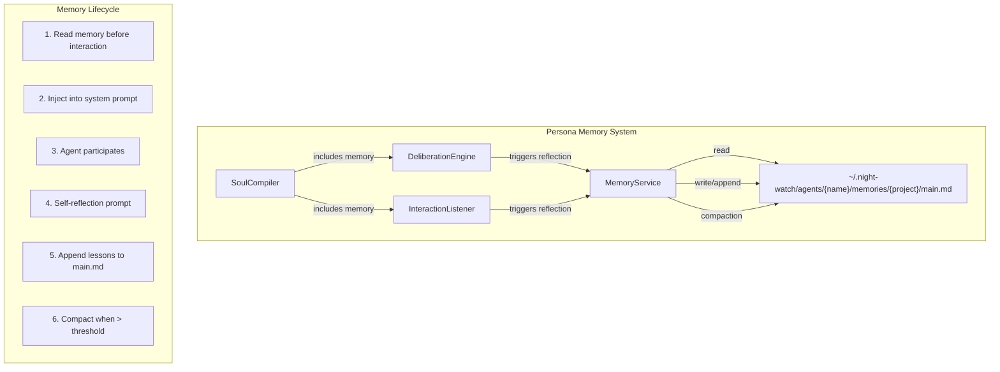
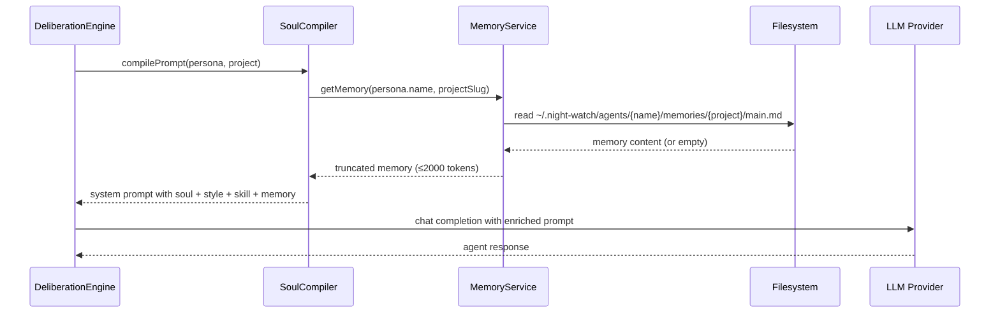
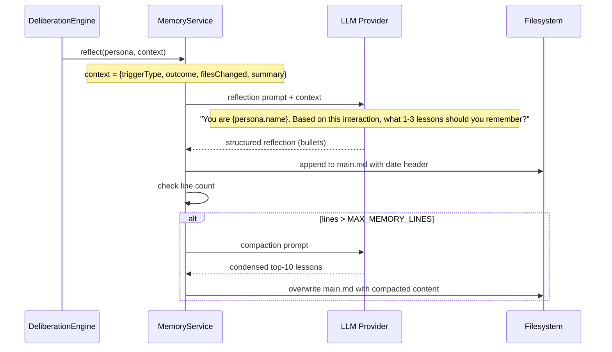
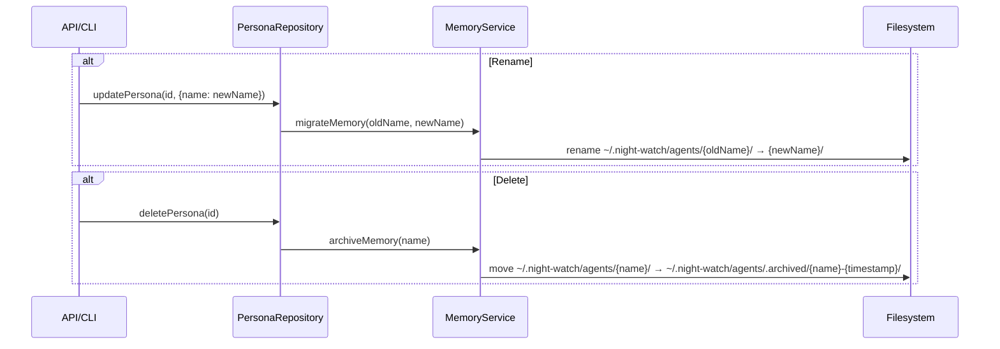

# PRD: Agent Persona Memory — Per-Agent Learning via MEMORY.md Files

`Complexity: 6 → MEDIUM mode`

---

## 1. Context

**Problem:** Every Night Watch run is stateless. Agents have rich personas (soul, style, skill) but zero memory of past interactions. Carlos doesn't remember that the auth module has tight coupling. Priya doesn't remember which tests are flaky. Dev doesn't remember that barrel exports need updating when adding files. Maya doesn't remember which dependencies had CVEs last month. Each run starts from scratch, repeating the same mistakes and rediscovering the same patterns.

Real teams have institutional knowledge. Night Watch agents need it too.

**Files Analyzed:**

- `packages/core/src/storage/repositories/sqlite/agent-persona.defaults.ts` — seed persona definitions (Maya, Carlos, Priya, Dev)
- `packages/core/src/shared/types.ts` — `IAgentPersona`, `IAgentSoul`, `IAgentStyle`, `IAgentSkill` interfaces
- `packages/slack/src/personas.ts` — persona resolution, scoring, domain classification
- `packages/slack/src/deliberation.ts` — deliberation engine, multi-agent discussions
- `packages/slack/src/interaction-listener.ts` — Socket Mode events, proactive messages

**Current Behavior:**

- Personas have detailed soul/style/skill definitions but no persistent memory
- System prompts are compiled fresh each time via `soul-compiler.ts` — no historical context injected
- Deliberation threads start with no awareness of past discussions or outcomes
- Proactive messages have roadmap context but no memory of what was previously flagged
- Personas are CRUD — users can create, rename, delete them via API/web UI

---

## 2. Solution

**Approach:**

- Give each persona a `memories/` directory at `~/.night-watch/agents/{persona-name}/memories/{project-slug}/main.md`
- After each significant interaction (Slack deliberation, proactive message, PR review), the agent self-reflects and appends lessons to its memory file
- Before each interaction, the agent's memory is read and injected into the system prompt alongside soul/style/skill
- Memory is role-flavored: Carlos remembers like a Tech Lead, Priya remembers like a QA engineer
- Automatic compaction prevents unbounded growth — when memory exceeds a threshold, the agent re-summarizes its top lessons
- On persona rename, migrate the directory. On persona delete, archive it

**Persona → Execution Role Mapping (defaults):**

| Persona | Role | Execution Role | Memory Focus |
|---------|------|---------------|-------------|
| Dev | Implementer | Executor | Architecture pitfalls, file conventions, patterns that work/fail |
| Carlos | Tech Lead / Architect | Reviewer + Slicer | Architecture decisions, PR quality patterns, decomposition quality |
| Priya | QA Engineer | QA | Flaky tests, coverage gaps, testing conventions, edge cases |
| Maya | Security Reviewer | Security Reviewer | Auth flow issues, dependency vulns, security patterns |

Carlos doubles as Reviewer and Slicer (Tech Lead naturally owns both code review and roadmap decomposition).

**Architecture Diagram:**

**Key Decisions:**

- **Text-based (MEMORY.md)** over structured SQLite — human-readable, editable, mirrors how Claude Code's own memory works. Can always add structured layer later.
- **Self-reflection only** — each agent writes its own memory. Cross-agent feedback is a future enhancement.
- **Per-project scoping** — `~/.night-watch/agents/Carlos/memories/night-watch-cli/main.md`. Agents don't leak project-specific knowledge across repos.
- **Name-based directories** — human-readable on disk. Migration on rename, archive on delete.
- **Token budget** — memory injection capped at ~2000 tokens to avoid bloating system prompts.

**Data Changes:** None (filesystem only, no schema changes).

---

## 3. Sequence Flows

### Memory Read + Injection Flow

### Self-Reflection Flow (post-interaction)

### Persona Rename/Delete Flow

---

## 4. Execution Phases

### Phase 1: Memory Storage & Service — Read/write memory files for personas

**Files (max 5):**

- `packages/core/src/memory/memory-service.ts` — Core service: read, append, compact, migrate, archive memory files
- `packages/core/src/memory/memory-constants.ts` — Constants: `MAX_MEMORY_LINES`, `MEMORY_TOKEN_BUDGET`, paths, compaction threshold
- `packages/core/src/memory/index.ts` — Barrel exports
- `packages/core/src/shared/types.ts` — Add `IMemoryEntry`, `IReflectionContext` interfaces
- `packages/core/src/di/container.ts` — Register MemoryService

**Implementation:**

- [ ] Define `IMemoryEntry` (date, persona, project, lessons: string[]) and `IReflectionContext` (triggerType, outcome, summary, filesChanged) in types
- [ ] Implement `MemoryService` as `@injectable()` class with methods:
  - `getMemory(personaName: string, projectSlug: string): Promise<string>` — read and truncate to token budget
  - `appendReflection(personaName: string, projectSlug: string, entry: IMemoryEntry): Promise<void>` — append with date header
  - `compact(personaName: string, projectSlug: string): Promise<void>` — LLM-powered summarization when over threshold
  - `migrateMemory(oldName: string, newName: string): Promise<void>` — rename directory
  - `archiveMemory(name: string): Promise<void>` — move to `.archived/`
  - `getMemoryPath(personaName: string, projectSlug: string): string` — resolve filesystem path
- [ ] Create `memory-constants.ts` with `MAX_MEMORY_LINES = 150`, `COMPACTION_TARGET_LINES = 50`, `MEMORY_TOKEN_BUDGET = 2000`
- [ ] Ensure directories are created lazily (mkdir -p on first write)
- [ ] Register `MemoryService` as singleton in DI container

**Tests Required:**

| Test File | Test Name | Assertion |
|-----------|-----------|-----------|
| `packages/core/src/__tests__/memory-service.test.ts` | `should read empty memory for new persona` | `expect(result).toBe('')` |
| `packages/core/src/__tests__/memory-service.test.ts` | `should append reflection with date header` | File contains date + lessons |
| `packages/core/src/__tests__/memory-service.test.ts` | `should truncate memory to token budget` | Output length ≤ budget |
| `packages/core/src/__tests__/memory-service.test.ts` | `should migrate memory directory on rename` | Old path gone, new path exists with same content |
| `packages/core/src/__tests__/memory-service.test.ts` | `should archive memory on delete` | Moved to `.archived/` with timestamp |

**Verification Plan:**

1. Unit tests pass with temp directories
2. Manual: create a memory file, read it back, verify truncation

---

### Phase 2: Reflection Prompts — Role-flavored self-reflection after interactions

**Files (max 5):**

- `packages/core/src/memory/reflection-prompts.ts` — Role-aware reflection prompt builder
- `packages/core/src/memory/memory-service.ts` — Add `reflect()` method that calls LLM
- `packages/core/src/memory/memory-constants.ts` — Add reflection prompt templates

**Implementation:**

- [ ] Build `buildReflectionPrompt(persona: IAgentPersona, context: IReflectionContext): string` that produces a role-flavored prompt:
  - For Dev (Implementer): "You are Dev. You just implemented [context]. What patterns, pitfalls, or conventions should you remember for next time? Think like a developer who wants to avoid repeating mistakes."
  - For Carlos (Tech Lead): "You are Carlos. You just reviewed [context]. What architectural patterns, code quality issues, or decomposition lessons should you remember? Think like a tech lead tracking team patterns."
  - For Priya (QA): "You are Priya. You just tested [context]. What testing gaps, flaky patterns, or coverage lessons should you remember? Think like a QA engineer building institutional testing knowledge."
  - For Maya (Security): "You are Maya. You just reviewed [context] for security. What vulnerability patterns, auth issues, or security lessons should you remember? Think like a security reviewer tracking threat patterns."
- [ ] Add `reflect(persona: IAgentPersona, projectSlug: string, context: IReflectionContext): Promise<void>` to MemoryService — calls LLM with reflection prompt, parses bullets, appends to memory
- [ ] Build `buildCompactionPrompt(persona: IAgentPersona, currentMemory: string): string` — asks the agent to condense its memory to the top lessons, staying in character
- [ ] Reflection output format: `## {date}\n- lesson 1\n- lesson 2\n- lesson 3\n`

**Tests Required:**

| Test File | Test Name | Assertion |
|-----------|-----------|-----------|
| `packages/core/src/__tests__/reflection-prompts.test.ts` | `should build role-flavored prompt for each persona type` | Prompt includes persona name, role-specific framing |
| `packages/core/src/__tests__/reflection-prompts.test.ts` | `should include interaction context in prompt` | Prompt contains trigger type, outcome, summary |
| `packages/core/src/__tests__/memory-service.test.ts` | `should call LLM and append reflection` | Memory file updated with new entry (mock LLM) |
| `packages/core/src/__tests__/memory-service.test.ts` | `should compact when over threshold` | File reduced to ≤ target lines after compaction |

**Verification Plan:**

1. Unit tests with mocked LLM responses
2. Manual: trigger reflection, inspect `main.md` for role-flavored entries

---

### Phase 3: Prompt Injection — Wire memory into soul-compiler and deliberation

**Files (max 5):**

- `packages/slack/src/soul-compiler.ts` — Add memory section to compiled system prompt
- `packages/slack/src/deliberation.ts` — Trigger reflection after deliberation rounds
- `packages/slack/src/interaction-listener.ts` — Trigger reflection after proactive messages

**Implementation:**

- [ ] Modify `SoulCompiler.compile()` to accept optional `memory: string` parameter and inject it as a `## Memory\n{content}` section after the skill block
- [ ] In `DeliberationEngine`, after each agent's deliberation response:
  - Build `IReflectionContext` from the discussion (trigger type, PR/PRD ref, summary of what was discussed)
  - Call `memoryService.reflect(persona, projectSlug, context)`
- [ ] In `InteractionListener`, after proactive messages:
  - Build `IReflectionContext` from the proactive observation
  - Call `memoryService.reflect(persona, projectSlug, context)`
- [ ] Before each agent turn in deliberation, call `memoryService.getMemory(persona.name, projectSlug)` and pass to `SoulCompiler`
- [ ] Ensure memory injection is optional — if memory file doesn't exist or is empty, prompt is unchanged (backward compatible)

**Tests Required:**

| Test File | Test Name | Assertion |
|-----------|-----------|-----------|
| `packages/slack/src/__tests__/soul-compiler.test.ts` | `should include memory section when memory is provided` | Compiled prompt contains `## Memory` section |
| `packages/slack/src/__tests__/soul-compiler.test.ts` | `should omit memory section when empty` | Compiled prompt has no `## Memory` |
| `packages/slack/src/__tests__/deliberation.test.ts` | `should trigger reflection after agent response` | `memoryService.reflect` called with correct context |

**Verification Plan:**

1. Unit tests pass
2. Manual: run a deliberation, check that `main.md` gets new entries, check that next deliberation's prompt includes those entries

---

### Phase 4: CRUD Lifecycle — Handle persona renames and deletions

**Files (max 5):**

- `packages/core/src/storage/repositories/sqlite/agent-persona.repository.ts` — Hook memory migration into update/delete
- `packages/core/src/memory/memory-service.ts` — Ensure migrate/archive handle edge cases (missing dirs, name collisions)

**Implementation:**

- [ ] In `AgentPersonaRepository.update()`: if `name` field changed, call `memoryService.migrateMemory(oldName, newName)`
- [ ] In `AgentPersonaRepository.delete()`: call `memoryService.archiveMemory(persona.name)` before removing DB record
- [ ] Handle edge cases in `migrateMemory`: target dir already exists (append timestamp suffix), source dir doesn't exist (no-op)
- [ ] Handle edge cases in `archiveMemory`: create `.archived/` if it doesn't exist, use `{name}-{timestamp}` to avoid collisions
- [ ] Log memory migration/archival actions for auditability

**Tests Required:**

| Test File | Test Name | Assertion |
|-----------|-----------|-----------|
| `packages/core/src/__tests__/memory-service.test.ts` | `should handle rename when source dir missing` | No error, no-op |
| `packages/core/src/__tests__/memory-service.test.ts` | `should handle rename collision` | Appends timestamp suffix |
| `packages/core/src/__tests__/agent-persona.repository.test.ts` | `should migrate memory on persona rename` | Memory directory renamed |
| `packages/core/src/__tests__/agent-persona.repository.test.ts` | `should archive memory on persona delete` | Memory moved to `.archived/` |

**Verification Plan:**

1. Unit tests with temp directories
2. Manual: rename a persona via API, verify memory directory moved. Delete a persona, verify archived.

---

## 5. Acceptance Criteria

- [ ] All phases complete
- [ ] All tests pass
- [ ] Each default persona (Maya, Carlos, Priya, Dev) can accumulate memory entries scoped to a project
- [ ] Memory is injected into system prompts during Slack deliberations and proactive messages
- [ ] Memory is role-flavored (Carlos writes like a tech lead, Priya writes like QA, etc.)
- [ ] Memory auto-compacts when exceeding `MAX_MEMORY_LINES`
- [ ] Persona rename migrates memory directory
- [ ] Persona delete archives memory directory
- [ ] Memory system is backward-compatible — agents without memory files behave exactly as before
- [ ] Custom (user-created) personas get memory support automatically — no hardcoded persona names in memory logic
- [ ] `yarn verify` passes
