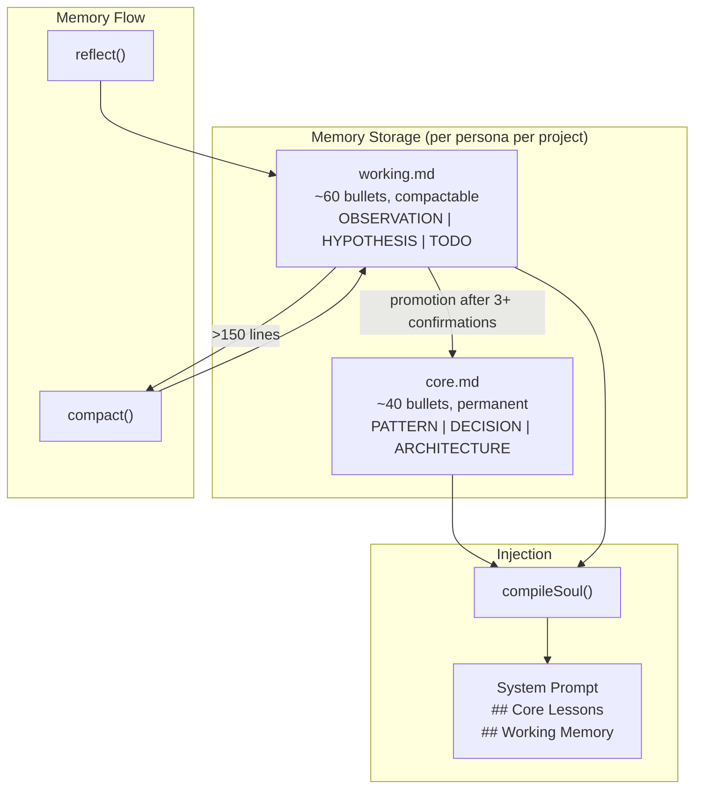
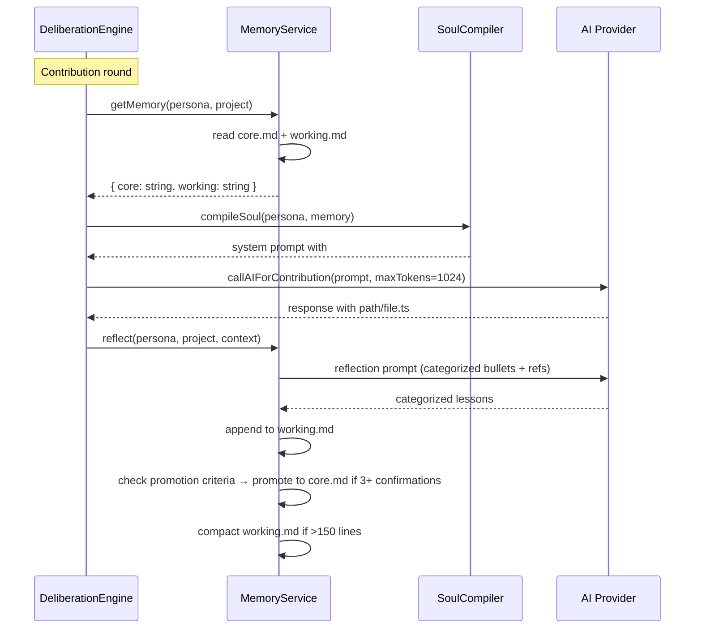

# PRD: Agent Response Quality & Memory Refinement

**Complexity: 10 → HIGH mode** (13 files modified, 1 new file, multi-package changes, prompt engineering across all agent flows)

---

## 1. Context

**Problem:** Night Watch agents dump unsupported claims without citing code paths or line numbers. Memory storage is shallow — vague bullets that degrade across compaction cycles. Multiple prompt-quality gaps reduce agent credibility and usefulness.

**Files Analyzed:**

- `packages/slack/src/deliberation-builders.ts` — contribution prompts, skip logic, issue verdict guidance
- `packages/slack/src/deliberation.ts` — proactive messages (:765-788), ad-hoc replies (:647-669), memory injection (:423-439)
- `packages/slack/src/ai/provider.ts` — global AI config, maxTokens default (:40, :50, :84)
- `packages/slack/src/ai/client.ts` — callAIForContribution (:15-86), callAIWithTools (:93-181)
- `packages/slack/src/ai/tools.ts` — query_codebase tool + output truncation (:174)
- `packages/slack/src/consensus-evaluator.ts` — consensus prompt (:102-118), issue-review verdict (:266-278)
- `packages/slack/src/humanizer.ts` — canned phrase removal (:18-25)
- `packages/slack/src/board-integration.ts` — issue title regex (:337-342), body preview truncation (:231, :240)
- `packages/slack/src/context-fetcher.ts` — hardcoded URL/issue limits (:23, :64)
- `packages/core/src/memory/memory-service.ts` — getMemory truncation (:63-77), reflect (:147-205), compact (:110-134)
- `packages/core/src/memory/memory-constants.ts` — MAX_MEMORY_LINES=150, COMPACTION_TARGET=50, CHAR_BUDGET=8000
- `packages/core/src/memory/reflection-prompts.ts` — buildReflectionPrompt (:67-76), buildCompactionPrompt (:83-93)
- `packages/core/src/agents/soul-compiler.ts` — compileSoul memory injection (:187-191)
- `packages/core/src/shared/types.ts` — IMemoryEntry, IReflectionContext (:283-298)

**Current Behavior:**

- Contribution prompt (deliberation-builders.ts:133) says "back your take with one concrete artifact" but doesn't mandate a citation format or require file paths with line numbers.
- Ad-hoc reply guidance (deliberation.ts:648) says "drop the specific line or snippet" — no format spec, buried after 20+ rules.
- Proactive messages (deliberation.ts:785) say "Do not make up specific PR numbers" — which encourages vague language instead of pattern-level specificity.
- Memory reflection (reflection-prompts.ts:74) limits output to 1-3 bullets with no category tags or reference requirements.
- Memory compaction (memory-service.ts:67-68) truncates to last 8000 chars, dropping oldest foundational lessons first.
- Standard contributions capped at 512 tokens (provider.ts:40) — insufficient for analysis with code citations.

---

## 2. Solution

**Approach:**

1. **Mandate citation format** — add explicit `path/to/file.ts#L42-L45` format rules to all prompts (contribution, ad-hoc, proactive, consensus, issue-review).
2. **Tiered memory** — split memory into `core.md` (permanent foundational lessons, 4000 chars) and `working.md` (recent observations, 8000 chars). Core never compacted or truncated.
3. **Raise token limits** — default maxTokens from 512 → 1024 for all contribution types.
4. **Enrich all prompts** — add few-shot examples for verdicts, soften skip logic, improve compaction/reflection prompts with category tags and quality gates.
5. **Fix truncation layers** — increase query_codebase output to 6000 chars, board-integration preview to 1200 chars.

**Architecture Diagram:**



**Key Decisions:**

- GitHub permalink citation format: `path/to/file.ts#L42-L45` — familiar to devs, consistent
- Tiered memory over weighted compaction — simpler mental model, clear separation of concerns
- 1024 tokens default — 2x current, matches ad-hoc reply limit, reasonable for Slack
- Category tags (`[PATTERN]`, `[DECISION]`, etc.) over confidence scores — easier for LLM to generate and parse

**Data Changes:**

- New file: `packages/core/src/memory/memory-types.ts` — `IMemoryTier`, `ICoreLesson`, `IWorkingEntry` interfaces
- Updated: `IMemoryEntry` in `packages/core/src/shared/types.ts` — add optional `category` field
- Migration: existing `main.md` → `working.md` (rename on first read), `core.md` created empty

---

## 3. Sequence Flow



---

## 4. Execution Phases

### Phase 1: Citation Format & Token Limits — Agents cite code and have room to explain

**Files (5):**

- `packages/slack/src/deliberation-builders.ts` — add citation format rules to contribution prompt, soften skip logic, add verdict examples
- `packages/slack/src/deliberation.ts` — add citation format to proactive prompt and ad-hoc reply prompt
- `packages/slack/src/ai/provider.ts` — change maxTokens default from 512 → 1024
- `packages/slack/src/consensus-evaluator.ts` — add examples for CHANGES and HUMAN verdicts
- `packages/slack/src/ai/tools.ts` — increase query_codebase output truncation from 4000 → 6000 chars

**Implementation:**

- [ ] In `deliberation-builders.ts:buildContributionPrompt()` (:98-155):
  - Replace line 133 (`Back your take with one concrete artifact...`) with explicit citation rule:
    ```
    - When referencing code, use GitHub permalink format: `path/to/file.ts#L42-L45` followed by a short inline snippet. Example: "`src/auth/middleware.ts#L23-L25` — the token check skips expiry validation."
    - Every code claim MUST include a file path reference. No vague "the auth module" — name the exact file and line range.
    ```
  - Change skip logic at line 125 from `If the answer to ANY of these is no → reply with exactly: SKIP` to:
    ```
    If you answer no to ALL three → reply with exactly: SKIP
    If at least one is yes, speak — but stick to what you actually know.
    ```
  - Add issue_review verdict examples after line 150:
    ```
    Examples of good verdicts:
    - "The N+1 query in `src/api/users.ts#L88-L92` is real — each list call fires 50 sub-selects. READY."
    - "Already fixed in PR #42, merged last week. The pagination was added at `src/api/list.ts#L30`. CLOSE."
    - "Valid concern but need to profile first — could be acceptable for our current scale. DRAFT."
    ```

- [ ] In `deliberation.ts` proactive prompt (:765-788):
  - Replace line 785 (`Do not make up specific PR numbers...`) with:
    ```
    - If you don't have an exact PR/issue number, describe the pattern or location instead. "The retry logic in the queue worker has no backoff" is better than "we should think about resilience."
    - When you reference code, use path format: `path/to/file.ts#L42-L45`.
    ```

- [ ] In `deliberation.ts` ad-hoc reply prompt (:647-649):
  - Replace codebaseGuidance string with:
    ```
    - You have a query_codebase tool. Before making any code claim, call it first. Then cite what you found using GitHub permalink format: `path/to/file.ts#L42-L45` with an inline snippet. Like a teammate who pulled it up in their editor.
    ```
  - For non-tool case, add:
    ```
    - When referencing code, always include the file path: `path/to/file.ts#L42-L45`. No vague "in the auth module" — name the file.
    ```

- [ ] In `provider.ts` (:40, :50, :84):
  - Change all three `maxTokens: 512` to `maxTokens: 1024`

- [ ] In `consensus-evaluator.ts` (:113-117):
  - Replace the APPROVE/CHANGES/HUMAN format block with:
    ```
    Respond with EXACTLY one of these formats (include the prefix):
    - APPROVE: [one short closing message — e.g., "Clean. Let's ship it."]
    - CHANGES: [what specifically still needs work — e.g., "The error handler in `src/api/handler.ts#L45` swallows the stack trace. Need to propagate it."]
    - HUMAN: [why this needs a human decision — e.g., "The team is split on whether to cache at the API layer or DB layer. Need a product call."]
    ```

- [ ] In `tools.ts` (:174):
  - Change `.slice(0, 4000)` to `.slice(0, 6000)`

**Tests Required:**

| Test File | Test Name | Assertion |
|-----------|-----------|-----------|
| `packages/slack/src/__tests__/deliberation-builders.test.ts` | `should include citation format rule in contribution prompt` | `expect(prompt).toContain('path/to/file.ts#L')` |
| `packages/slack/src/__tests__/deliberation-builders.test.ts` | `should use relaxed skip logic (ALL three no)` | `expect(prompt).toContain('answer no to ALL three')` |
| `packages/slack/src/__tests__/deliberation-builders.test.ts` | `should include verdict examples for issue_review` | `expect(prompt).toContain('READY.')` and `expect(prompt).toContain('CLOSE.')` |
| `packages/slack/src/__tests__/ai/provider.test.ts` | `should default maxTokens to 1024` | `expect(config.maxTokens).toBe(1024)` |

**Verification Plan:**

1. Unit tests: run `yarn vitest packages/slack/src/__tests__/deliberation-builders.test.ts`
2. `yarn verify` passes across all packages

---

### Phase 2: Tiered Memory Architecture — Core lessons persist forever, working memory compacts safely

**Files (4):**

- `packages/core/src/memory/memory-types.ts` — NEW: tiered memory interfaces
- `packages/core/src/memory/memory-constants.ts` — new budgets and system prompts
- `packages/core/src/memory/memory-service.ts` — tiered read/write/compact/promote logic
- `packages/core/src/shared/types.ts` — add optional `category` to IMemoryEntry

**Implementation:**

- [ ] Create `packages/core/src/memory/memory-types.ts`:
  ```typescript
  export type MemoryCategory = 'PATTERN' | 'DECISION' | 'ARCHITECTURE' | 'OBSERVATION' | 'HYPOTHESIS' | 'TODO';
  export const CORE_CATEGORIES: MemoryCategory[] = ['PATTERN', 'DECISION', 'ARCHITECTURE'];
  export const WORKING_CATEGORIES: MemoryCategory[] = ['OBSERVATION', 'HYPOTHESIS', 'TODO'];

  export interface IMemoryTier {
    core: string;    // from core.md
    working: string; // from working.md
  }
  ```

- [ ] In `memory-constants.ts`:
  - Add `CORE_CHAR_BUDGET = 4000`
  - Add `WORKING_CHAR_BUDGET = 8000`
  - Change `COMPACTION_TARGET_LINES` from 50 → 60
  - Update `COMPACTION_SYSTEM_PROMPT` to:
    ```
    You are a memory compaction assistant. Your job is to condense working memory while preserving actionable insights.
    Rules:
    - Preserve lessons with specific file references (path#L42-L45)
    - Merge related lessons into single, richer bullets
    - Keep category tags ([OBSERVATION], [HYPOTHESIS], [TODO]) intact
    - Drop vague entries that lack specifics
    - Respond only with categorized bullet points, no preamble.
    ```

- [ ] In `memory-service.ts`:
  - Add `getCoreMemoryPath()` → `.../{projectSlug}/core.md`
  - Add `getWorkingMemoryPath()` → `.../{projectSlug}/working.md`
  - Refactor `getMemory()` to return combined string:
    1. Read `core.md` (truncate to `CORE_CHAR_BUDGET`)
    2. Read `working.md` (truncate to `WORKING_CHAR_BUDGET`, keep last N chars)
    3. If only `main.md` exists (migration), rename to `working.md` and create empty `core.md`
    4. Return formatted: `## Core Lessons\n{core}\n\n## Working Memory\n{working}`
  - Refactor `appendReflection()` to always write to `working.md`
  - Refactor `compact()` to only compact `working.md`, never touch `core.md`
  - Add `promoteToCore(personaName, projectSlug, lesson)`:
    1. Read `core.md`
    2. Append lesson with PATTERN/DECISION/ARCHITECTURE tag
    3. If over `CORE_CHAR_BUDGET`, log warning but don't truncate (manual review needed)
  - Add `checkPromotion()` in `reflect()`:
    1. After appending to working, scan working for lessons that match existing core patterns
    2. If a lesson theme appears 3+ times across dates, call LLM to synthesize and promote
    3. Remove promoted lessons from working.md
  - Add validation in `compact()`:
    1. After LLM compaction, verify output starts with `- [`
    2. Verify line count is <= target
    3. If validation fails, log warning and keep original (don't overwrite with garbage)

- [ ] In `types.ts`:
  - Add `category?: string` to `IMemoryEntry` interface

**Tests Required:**

| Test File | Test Name | Assertion |
|-----------|-----------|-----------|
| `packages/core/src/__tests__/memory-service.test.ts` | `should read tiered memory (core + working)` | Returns string containing `## Core Lessons` and `## Working Memory` |
| `packages/core/src/__tests__/memory-service.test.ts` | `should migrate main.md to working.md on first read` | `main.md` renamed, `working.md` exists |
| `packages/core/src/__tests__/memory-service.test.ts` | `should append reflection to working.md only` | `working.md` updated, `core.md` unchanged |
| `packages/core/src/__tests__/memory-service.test.ts` | `should not compact core.md` | After compact, `core.md` unchanged |
| `packages/core/src/__tests__/memory-service.test.ts` | `should validate compaction output format` | Invalid LLM output rejected, original preserved |
| `packages/core/src/__tests__/memory-service.test.ts` | `should return empty tiers when no files exist` | Returns `## Core Lessons\n\n## Working Memory\n` |

**Verification Plan:**

1. Unit tests: `yarn vitest packages/core/src/__tests__/memory-service.test.ts`
2. `yarn verify` passes

---

### Phase 3: Reflection & Compaction Prompt Quality — Lessons are rich, categorized, and referenced

**Files (3):**

- `packages/core/src/memory/reflection-prompts.ts` — enhanced reflection prompt with categories, refs, few-shot examples
- `packages/core/src/agents/soul-compiler.ts` — inject core + working sections separately
- `packages/core/src/memory/memory-service.ts` — update reflect() to use categorized format

**Implementation:**

- [ ] In `reflection-prompts.ts:buildReflectionPrompt()` (:67-76):
  - Change bullet count from "1-3" to "1-5"
  - Add category requirement and few-shot examples:
    ```
    Respond with 1-5 categorized bullet points. Each bullet MUST follow this format:
    - [CATEGORY] lesson text (ref: path/to/file.ts#L42-L45)

    Categories:
    - PATTERN: recurring code pattern or convention discovered
    - DECISION: architectural or design choice made and why
    - OBSERVATION: something noticed that may need attention later
    - HYPOTHESIS: untested theory about a potential issue
    - TODO: concrete follow-up action needed

    Examples of GOOD lessons:
    - [PATTERN] Auth middleware validates JWT but skips expiry check on refresh tokens (ref: src/auth/middleware.ts#L23-L30)
    - [DECISION] Chose event sourcing over simple logging for audit trail — compliance requires full replay (ref: src/events/store.ts#L5-L15)
    - [OBSERVATION] The retry logic in queue-worker uses fixed 1s delay, no exponential backoff (ref: src/queue/worker.ts#L88-L95)

    Examples of BAD lessons (too vague — never write these):
    - Consider improving error handling
    - The code could use better testing
    - Security should be reviewed

    If a file reference is unknown, omit the (ref: ...) part — but be as specific as possible about the location.
    No preamble, no explanation outside the bullets.
    ```

- [ ] In `reflection-prompts.ts:buildCompactionPrompt()` (:83-93):
  - Add instruction to preserve category tags and references:
    ```
    Rules for compaction:
    - Keep all [CATEGORY] tags intact
    - Preserve (ref: path#L42) references — these are the most valuable part
    - Merge related lessons: if 3 bullets say similar things, combine into 1 rich bullet
    - Drop entries that are vague or lack specifics
    - Favor lessons that mention specific files, functions, or patterns
    ```

- [ ] In `soul-compiler.ts:compileSoul()` (:187-191):
  - Change memory injection from flat `## Memory` to preserve tiered structure:
    ```typescript
    if (memory && memory.trim()) {
      lines.push('');
      lines.push(memory.trim()); // Already formatted as ## Core Lessons + ## Working Memory
    }
    ```

- [ ] In `memory-service.ts:reflect()`:
  - Update lesson parsing to extract category tags: `- [PATTERN] lesson (ref: file#L42)` → store with category
  - Parse `(ref: ...)` suffix and validate it looks like a file path

**Tests Required:**

| Test File | Test Name | Assertion |
|-----------|-----------|-----------|
| `packages/core/src/__tests__/reflection-prompts.test.ts` | `should include category format in reflection prompt` | `expect(prompt).toContain('[CATEGORY]')` |
| `packages/core/src/__tests__/reflection-prompts.test.ts` | `should include good/bad examples in reflection prompt` | `expect(prompt).toContain('GOOD lessons')` and `expect(prompt).toContain('BAD lessons')` |
| `packages/core/src/__tests__/reflection-prompts.test.ts` | `should instruct compaction to preserve refs` | `expect(prompt).toContain('ref: path#L42')` |
| `packages/core/src/__tests__/soul-compiler.test.ts` | `should inject tiered memory sections` | `expect(result).toContain('## Core Lessons')` |

**Verification Plan:**

1. Unit tests: `yarn vitest packages/core/src/__tests__/reflection-prompts.test.ts packages/core/src/__tests__/soul-compiler.test.ts`
2. `yarn verify` passes

---

### Phase 4: Context & Formatting Polish — Fix truncation, humanizer, board integration, context limits

**Files (4):**

- `packages/slack/src/board-integration.ts` — LLM-based issue title, increase preview truncation
- `packages/slack/src/humanizer.ts` — context-aware canned phrase removal
- `packages/slack/src/context-fetcher.ts` — raise hardcoded limits
- `packages/core/src/memory/index.ts` — re-export new types

**Implementation:**

- [ ] In `board-integration.ts`:
  - Replace regex-based title generation at lines 337-342 with LLM call:
    ```typescript
    const titlePrompt = `Convert this one-liner into a clean imperative-mood Git issue title (max 80 chars). No prefix like "fix:" — just the action.\nOne-liner: "${slackOneliner}"\nExamples:\n- "add timeout to auth middleware"\n- "remove duplicate validation in signup flow"\n- "fix N+1 query in user list endpoint"\nWrite only the title.`;
    const generatedTitle = await callAIForContribution(devPersona, this.config, titlePrompt, 64);
    const issueTitle = `fix: ${generatedTitle.toLowerCase().replace(/[.!?]+$/, '').slice(0, 80)}`;
    ```
  - Change `body.slice(0, 600)` to `body.slice(0, 1200)` at lines 231 and 240

- [ ] In `humanizer.ts`:
  - Make canned phrase removal smarter — only strip when the phrase is the entire opening clause with no substantive content following:
    ```typescript
    // Only strip if followed by generic continuation (comma + filler), not substantive content
    const CANNED_PHRASE_PREFIXES = [
      /^great question[,.! ]+(?=(?:i|we|let|the|this|here|so)\b)/i,
      /^of course[,.! ]+(?=(?:i|we|let|the|this|here|so)\b)/i,
      /^certainly[,.! ]+(?=(?:i|we|let|the|this|here|so)\b)/i,
      /^you['']re absolutely right[,.! ]+/i,
      /^i hope this helps[,.! ]*/i,
    ];
    ```

- [ ] In `context-fetcher.ts`:
  - Change `urls.slice(0, 2)` at line 23 to `urls.slice(0, 4)`
  - Change `urls.slice(0, 3)` at line 64 to `urls.slice(0, 5)`

- [ ] In `packages/core/src/memory/index.ts`:
  - Re-export new types from `memory-types.ts`

**Tests Required:**

| Test File | Test Name | Assertion |
|-----------|-----------|-----------|
| `packages/slack/src/__tests__/humanizer.test.ts` | `should keep "Of course" when followed by substantive content` | `expect(humanizeSlackReply('Of course, the auth check at middleware.ts#L23 skips expiry')).toContain('Of course')` |
| `packages/slack/src/__tests__/humanizer.test.ts` | `should strip "Of course" when followed by generic filler` | `expect(humanizeSlackReply('Of course, I think we should consider...')).not.toMatch(/^Of course/)` |
| `packages/slack/src/__tests__/context-fetcher.test.ts` | `should fetch up to 4 URLs` | Verify `.slice(0, 4)` behavior |
| `packages/slack/src/__tests__/board-integration.test.ts` | `should use longer body preview (1200 chars)` | Verify truncation at 1200 |

**Verification Plan:**

1. Unit tests: `yarn vitest packages/slack/src/__tests__/humanizer.test.ts`
2. `yarn verify` passes

---

## 5. Integration Points Checklist

```markdown
**How will this feature be reached?**
- [x] Entry point identified: all existing agent flows (deliberation, ad-hoc, proactive, consensus, issue-review)
- [x] Caller files identified: deliberation.ts, consensus-evaluator.ts, board-integration.ts, proactive-loop.ts
- [x] Registration/wiring needed: memory-types.ts exported from core/index.ts

**Is this user-facing?**
- [x] YES → agents produce visibly better Slack messages with code citations
- [x] NO new UI needed — improvements are in prompt quality and memory format

**Full user flow:**
1. User opens a PR or triggers a code_watch scan
2. Deliberation engine calls agents with updated prompts (citation rules, 1024 tokens)
3. Agents respond with `path/to/file.ts#L42-L45` references and richer analysis
4. Reflection writes categorized lessons to working.md
5. Over time, recurring patterns promote to core.md (never lost)
6. Next interaction: agent sees ## Core Lessons + ## Working Memory in system prompt
```

---

## 6. Acceptance Criteria

- [ ] All contribution prompts include explicit GitHub permalink citation format rule
- [ ] All proactive/ad-hoc/consensus prompts include citation format rule
- [ ] Default maxTokens is 1024 across all providers (Anthropic + OpenAI)
- [ ] Memory files split into `core.md` (permanent) + `working.md` (compactable)
- [ ] Existing `main.md` files auto-migrate to `working.md` on first read
- [ ] Reflection prompt produces categorized bullets: `- [CATEGORY] lesson (ref: path#L42-L45)`
- [ ] Compaction preserves category tags and file references
- [ ] Compaction output is validated before overwriting (format + line count)
- [ ] query_codebase tool output limit raised to 6000 chars
- [ ] Board integration body preview raised to 1200 chars
- [ ] Consensus prompts include examples for all verdict types
- [ ] Issue-review prompts include verdict examples with code references
- [ ] Skip logic softened to "ALL three no → SKIP"
- [ ] Context fetcher allows up to 4 URLs and 5 GitHub issues
- [ ] Humanizer phrase removal is context-aware
- [ ] Board issue titles use LLM generation instead of regex
- [ ] All existing tests pass, new tests added per phase
- [ ] `yarn verify` passes across all packages
