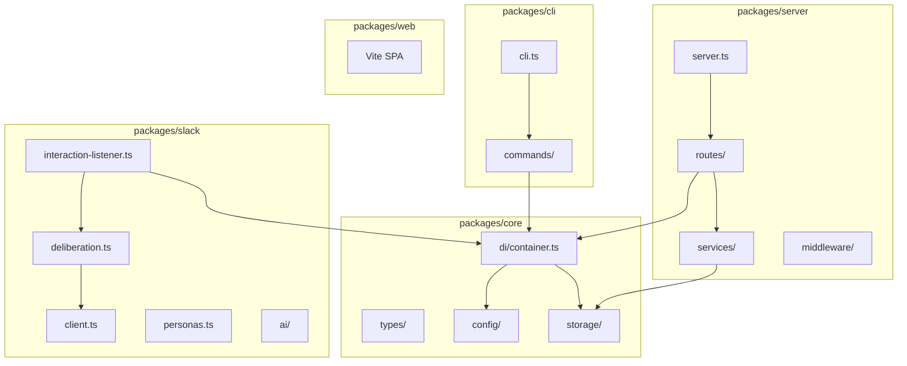
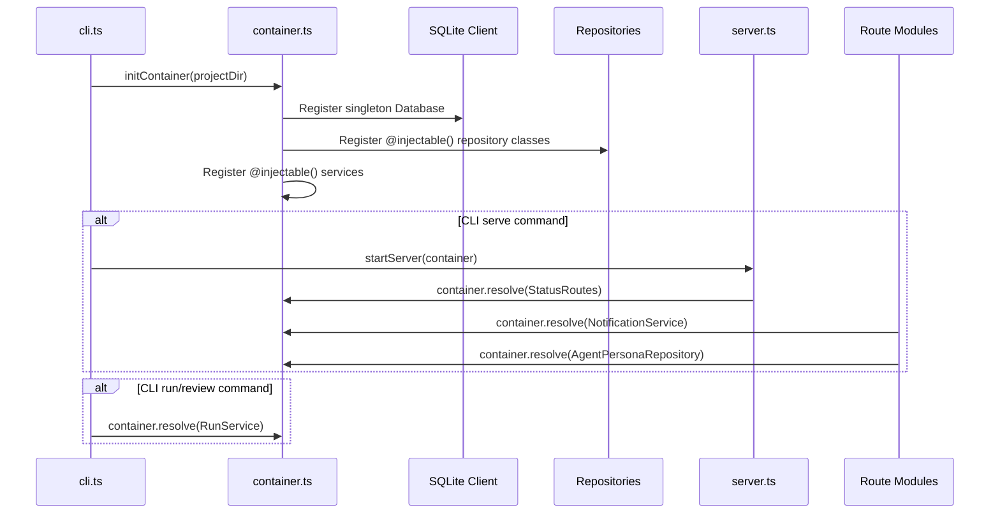

# PRD: Architecture Refactor — DI, Monorepo & SOLID Foundations

`Complexity: 9 → HIGH mode`

---

## 1. Context

**Problem:** Night Watch CLI (~22K LOC, 81 source files) has outgrown its original structure. Global singletons (`getRepositories()`, `getDb()`), a 2200-LOC monolithic server file, god-module utils, and no composition root make the codebase increasingly painful to test, extend, and reason about. This refactor establishes SOLID foundations before the codebase doubles in size.

**Files Analyzed:**

- `src/server/index.ts` (2,205 LOC — monolithic, 85+ inline routes)
- `src/storage/repositories/index.ts` (service locator anti-pattern)
- `src/storage/sqlite/client.ts` (global singleton DB)
- `src/config.ts` (775 LOC — config loader)
- `src/cli.ts` (115 LOC — CLI entry)
- `src/slack/interaction-listener.ts` (1,654 LOC)
- `src/slack/deliberation.ts` (1,189 LOC)
- `src/utils/notify.ts` (530 LOC — mixes concerns)
- `src/utils/status-data.ts` (693 LOC — god module)
- `src/utils/roadmap-scanner.ts` (480 LOC)
- `src/types.ts`, `shared/types.ts` (type definitions)
- `src/storage/repositories/interfaces.ts` (repository contracts)
- `package.json`, `tsconfig.json` (build config)

**Current Behavior:**

- Dependencies resolved via global `getRepositories()` / `getDb()` singletons — called 20+ times across codebase
- `server/index.ts` defines all routes inline with closure-captured `projectDir` and `config`
- Agent persona, board, discussion routes duplicated between single-project and global modes
- `utils/notify.ts` imports `SlackClient` + `DeliberationEngine` + `getRepositories()` — circular risk
- Config passed as plain object everywhere, `loadConfig()` called directly in services
- No module boundaries enforced — everything imports everything

---

## 2. Solution

**Approach:**

- Introduce **Tsyringe** as DI container with **automatic class-based injection** — `@injectable()` on classes, Tsyringe resolves them by class reference. No manual tokens or `InjectionToken` constants (KISS).
- Create a **composition root** (`src/di/container.ts`) that wires all dependencies at startup
- **Extract server routes** into domain-grouped modules receiving deps via DI
- **Promote god-utils** to focused, injectable services (Notification, Status, Roadmap)
- Set up **yarn workspaces** monorepo with Turborepo for parallel builds
- Enforce **dot-separated kebab-case** file naming (`name.type.ts`) and **feature-grouped** folder structure

**Architecture Diagram:**



**Key Decisions:**

- **Tsyringe** over TypeDI — lighter, maintained by Microsoft, works with ES decorators
- **Automatic class-based injection** — inject concrete classes directly via `@injectable()`, no manual `InjectionToken` boilerplate. For test overrides, use child containers with `container.register(ConcreteClass, { useClass: MockClass })`.
- **Yarn workspaces** over npm workspaces — already using yarn, better hoisting control
- **Turborepo** over Nx — simpler config, zero runtime overhead, sufficient for 5 packages
- **Feature-grouped folders** over type-grouped — `routes/board.routes.ts` not `controllers/board-controller.ts`
- **Composition over inheritance** throughout — no base classes for routes/services

**Data Changes:** None — no schema migrations needed.

---

## 3. Design Principles (Enforced Throughout)

| Principle | Application |
|-----------|-------------|
| **SRP** | Each file/class does one thing. Route modules handle HTTP. Services handle business logic. Repositories handle data. |
| **OCP** | New routes/services added without modifying existing ones. DI container is the extension point. |
| **LSP** | Repository interfaces define contracts. Any implementation (SQLite, in-memory for tests) is substitutable. |
| **ISP** | Small, focused interfaces. `IAgentPersonaRepository` not `IEverythingRepository`. |
| **DIP** | High-level modules (routes, services) depend on injected classes, not global singletons. Composition root wires everything. |
| **KISS** | Automatic class-based DI — no manual tokens. Plain functions where classes aren't needed. |
| **DRY** | Shared error handler middleware. Shared route-wiring pattern. Shared types in `@night-watch/core`. |
| **YAGNI** | No speculative abstractions. No generic "BaseService". No middleware we don't need today. |
| **Composition > Inheritance** | Routes are factory functions, not classes extending `BaseRoute`. Services compose other services, not inherit. |

---

## 4. File Naming & Folder Conventions

### Naming

**File naming pattern:** `<name>.<type>.ts` — dot-separated, kebab-case name, type suffix.

| Item | Convention | Example |
|------|-----------|---------|
| Services | `<name>.service.ts` | `notification.service.ts`, `status.service.ts` |
| Routes | `<name>.routes.ts` | `board.routes.ts`, `agent.routes.ts` |
| Middleware | `<name>.middleware.ts` | `error-handler.middleware.ts`, `project-resolver.middleware.ts` |
| Repositories | `<name>.repository.ts` | `agent-persona.repository.ts`, `prd-state.repository.ts` |
| Tests | `<name>.<type>.test.ts` | `notification.service.test.ts`, `board.routes.test.ts` |
| Types | `<name>.types.ts` or `types.ts` | `slack.types.ts`, `types.ts` (for package-wide) |
| Plain modules | `kebab-case.ts` (no type suffix) | `soul-compiler.ts`, `humanizer.ts`, `client.ts` |
| Classes | `PascalCase` | `SlackClient`, `NotificationService` |
| Interfaces | `I` prefix + PascalCase | `IAgentPersonaRepository`, `INotificationService` |
| Index files | Re-export public API only | `packages/core/src/index.ts` |

**When to use a type suffix:** When the file is a clearly typed architectural component (service, route, middleware, repository). For utility modules, standalone classes, or simple helpers — plain kebab-case without a suffix.

### Folder Structure (Post-Monorepo)

```
night-watch-cli/
├── packages/
│   ├── core/                          # Shared foundation
│   │   ├── src/
│   │   │   ├── config/
│   │   │   │   ├── config-loader.ts
│   │   │   │   ├── config-writer.ts
│   │   │   │   └── constants.ts
│   │   │   ├── di/
│   │   │   │   └── container.ts       # Composition root (no tokens file)
│   │   │   ├── storage/
│   │   │   │   ├── sqlite/
│   │   │   │   │   ├── client.ts
│   │   │   │   │   └── migrations.ts
│   │   │   │   └── repositories/
│   │   │   │       ├── interfaces.ts
│   │   │   │       └── sqlite/
│   │   │   │           ├── agent-persona.repository.ts
│   │   │   │           ├── execution-history.repository.ts
│   │   │   │           ├── prd-state.repository.ts
│   │   │   │           ├── project-registry.repository.ts
│   │   │   │           ├── roadmap-state.repository.ts
│   │   │   │           └── slack-discussion.repository.ts
│   │   │   ├── types.ts
│   │   │   └── index.ts
│   │   ├── package.json
│   │   └── tsconfig.json
│   │
│   ├── cli/                           # CLI commands
│   │   ├── src/
│   │   │   ├── cli.ts
│   │   │   └── commands/
│   │   │       ├── run.ts
│   │   │       ├── review.ts
│   │   │       ├── serve.ts
│   │   │       └── ...
│   │   ├── package.json
│   │   └── tsconfig.json
│   │
│   ├── server/                        # Express API
│   │   ├── src/
│   │   │   ├── server.ts
│   │   │   ├── middleware/
│   │   │   │   ├── error-handler.middleware.ts
│   │   │   │   ├── project-resolver.middleware.ts
│   │   │   │   └── sse.middleware.ts
│   │   │   ├── routes/
│   │   │   │   ├── status.routes.ts
│   │   │   │   ├── prd.routes.ts
│   │   │   │   ├── config.routes.ts
│   │   │   │   ├── board.routes.ts
│   │   │   │   ├── agent.routes.ts
│   │   │   │   ├── slack.routes.ts
│   │   │   │   ├── discussion.routes.ts
│   │   │   │   ├── action.routes.ts
│   │   │   │   ├── roadmap.routes.ts
│   │   │   │   └── log.routes.ts
│   │   │   └── services/
│   │   │       ├── status.service.ts
│   │   │       ├── notification.service.ts
│   │   │       └── roadmap.service.ts
│   │   ├── package.json
│   │   └── tsconfig.json
│   │
│   ├── slack/                         # Slack bot
│   │   ├── src/
│   │   │   ├── client.ts
│   │   │   ├── interaction-listener.ts
│   │   │   ├── deliberation.ts
│   │   │   ├── humanizer.ts
│   │   │   ├── personas.ts
│   │   │   ├── channel-manager.ts
│   │   │   ├── utils.ts
│   │   │   └── ai/
│   │   │       ├── client.ts
│   │   │       ├── provider.ts
│   │   │       ├── tools.ts
│   │   │       └── index.ts
│   │   ├── package.json
│   │   └── tsconfig.json
│   │
│   └── web/                           # Vite SPA (already semi-separate)
│       ├── src/
│       ├── package.json
│       └── tsconfig.json
│
├── turbo.json                         # Turborepo pipeline config
├── package.json                       # Root workspace config
└── tsconfig.base.json                 # Shared TS compiler options
```

---

## 5. Sequence Flow — DI Bootstrap



---

## 6. Execution Phases

### Phase 1: DI Foundation + TypeScript Decorator Config

**User-visible outcome:** Tsyringe installed, container bootstraps with automatic class resolution — existing behavior unchanged.

**Files:**

- `package.json` — add `tsyringe` + `reflect-metadata` deps
- `tsconfig.json` — enable `experimentalDecorators` + `emitDecoratorMetadata`
- `src/di/container.ts` — (new) composition root: registers classes, no manual tokens
- `src/cli.ts` — import `reflect-metadata` at entry point

**Implementation:**

- [ ] Install `tsyringe` and `reflect-metadata` via yarn
- [ ] Enable `experimentalDecorators: true` and `emitDecoratorMetadata: true` in `tsconfig.json`
- [ ] Create `src/di/container.ts` with `initContainer(projectDir: string)` — registers concrete classes using `container.register(Class, { useClass: Class })` for singletons. Classes are resolved by class reference (`container.resolve(NotificationService)`), not string tokens.
- [ ] Add `import 'reflect-metadata'` as first import in `src/cli.ts`
- [ ] Verify `yarn build:cli` and `yarn test` still pass

**Tests Required:**

| Test File | Test Name | Assertion |
|-----------|-----------|-----------|
| `src/__tests__/di/container.test.ts` | `should initialize container without errors` | `expect(() => initContainer(tmpDir)).not.toThrow()` |
| `src/__tests__/di/container.test.ts` | `should resolve SqliteAgentPersonaRepository` | `expect(container.resolve(SqliteAgentPersonaRepository)).toBeDefined()` |

**Verification Plan:**

1. `yarn verify` passes
2. `yarn test` passes (all existing + new container tests)
3. `yarn build:cli` produces valid dist

---

### Phase 2: Repository Layer — Constructor Injection

**User-visible outcome:** Repositories are `@injectable()` classes resolved from the container. `getRepositories()` becomes a thin wrapper that delegates to the container. Zero behavior change.

**Files:**

- `src/storage/sqlite/client.ts` — make DB instance injectable (register in container, keep `getDb()` as fallback)
- `src/storage/repositories/index.ts` — `getRepositories()` delegates to container
- `src/storage/repositories/sqlite/agent-persona-repository.ts` — add `@injectable()` + constructor injection
- `src/storage/repositories/sqlite/execution-history-repository.ts` — same
- `src/storage/repositories/sqlite/prd-state-repository.ts` — same (repeat for all 6 repositories)
- `src/di/container.ts` — register repository bindings

**Implementation:**

- [ ] Add `@injectable()` decorator to all 6 SQLite repository classes
- [ ] Constructors receive `Database` via Tsyringe's automatic class resolution (the `Database` instance is registered as a singleton in the container)
- [ ] Register each repository class in `container.ts` — Tsyringe resolves by class reference, e.g. `container.resolve(SqliteAgentPersonaRepository)`
- [ ] Update `getRepositories()` to resolve from the container when initialized, fall back to direct instantiation otherwise (backwards compat during migration)
- [ ] Ensure `resetRepositories()` still works for tests (clear container child scope)
- [ ] Run full test suite to verify zero regression

**Tests Required:**

| Test File | Test Name | Assertion |
|-----------|-----------|-----------|
| `src/__tests__/di/container.test.ts` | `should resolve repositories via DI` | All 6 repos resolve and have expected methods |
| `src/__tests__/storage/agent-persona-repository.test.ts` | (existing tests) | All pass without modification |

**Verification Plan:**

1. `yarn verify` passes
2. `yarn test` — all existing storage tests pass unchanged
3. New DI resolution tests pass

---

### Phase 3: Server Route Extraction

**User-visible outcome:** `server/index.ts` drops from 2,205 LOC to ~300 LOC. Routes live in focused modules. All API endpoints work identically.

**Files:**

- `src/server/routes/status.routes.ts` — (new) `/api/status`, `/api/status/events`, `/api/schedule-info`
- `src/server/routes/prd.routes.ts` — (new) `/api/prds`, `/api/prds/:name`
- `src/server/routes/config.routes.ts` — (new) `/api/config` (GET/PUT)
- `src/server/routes/board.routes.ts` — (new) `/api/board/*` (6 endpoints)
- `src/server/routes/agent.routes.ts` — (new) `/api/agents/*` (8 endpoints)
- `src/server/routes/slack.routes.ts` — (new) `/api/slack/*`
- `src/server/routes/discussion.routes.ts` — (new) `/api/discussions/*`
- `src/server/routes/action.routes.ts` — (new) `/api/actions/*` (run, review, cancel, retry, clear-lock)
- `src/server/routes/roadmap.routes.ts` — (new) `/api/roadmap/*`
- `src/server/routes/log.routes.ts` — (new) `/api/logs/:name`
- `src/server/routes/doctor.routes.ts` — (new) `/api/doctor`
- `src/server/middleware/error-handler.middleware.ts` — (new) extracted error handler
- `src/server/middleware/project-resolver.middleware.ts` — (new) extracted `resolveProject` middleware
- `src/server/middleware/sse.middleware.ts` — (new) SSE client registry + broadcaster
- `src/server/index.ts` — slimmed down: imports route modules, mounts them

**Implementation:**

- [ ] Create `src/server/routes/` directory
- [ ] Create `src/server/middleware/` directory
- [ ] Extract each route group into its own module as a factory function: `export function createStatusRoutes(deps): Router` (in `status.routes.ts`)
- [ ] Each route factory receives its dependencies as a typed object parameter (not via DI yet — that comes in Phase 5)
- [ ] Extract `errorHandler`, `resolveProject`, SSE utilities into middleware modules
- [ ] Extract shared helpers (`validatePrdName`, `maskPersonaSecrets`, `getBoardProvider`, board cache) into `src/server/helpers.ts`
- [ ] Slim `server/index.ts` to: create Express app, mount middleware, mount route modules, setup static files
- [ ] **Eliminate route duplication** — `createProjectRouter()` and `createApp()` currently duplicate all routes. Both should use the same route factory functions.
- [ ] Run full test suite including `server.test.ts`, `server-agents-routes.test.ts`, `server-global-agents-routes.test.ts`

**Tests Required:**

| Test File | Test Name | Assertion |
|-----------|-----------|-----------|
| `src/__tests__/server.test.ts` | (all existing) | All pass without modification |
| `src/__tests__/server-agents-routes.test.ts` | (all existing) | All pass without modification |
| `src/__tests__/server-global-agents-routes.test.ts` | (all existing) | All pass without modification |

**Verification Plan:**

1. `yarn verify` passes
2. All existing server tests pass
3. `server/index.ts` is under 350 LOC
4. No route duplication between single-project and global modes

---

### Phase 4: Service Layer Extraction

**User-visible outcome:** God-utils broken into focused, testable service classes. Same behavior, cleaner boundaries.

**Files:**

- `src/server/services/notification.service.ts` — (new) extracted from `utils/notify.ts`
- `src/server/services/status.service.ts` — (new) extracted from `utils/status-data.ts`
- `src/server/services/roadmap.service.ts` — (new) extracted from `utils/roadmap-scanner.ts`
- `src/utils/notify.ts` — slimmed to re-export from service (backwards compat for CLI callers)
- `src/utils/status-data.ts` — slimmed to re-export from service
- `src/utils/roadmap-scanner.ts` — slimmed to re-export from service

**Implementation:**

- [ ] Create `NotificationService` class in `src/server/services/notification.service.ts`
  - Receives `IRepositories` and `ISlackBotConfig` via constructor
  - Methods: `sendNotifications()`, `triggerDeliberation()`
  - Breaks the circular import risk: `notify.ts` no longer imports `DeliberationEngine` directly
- [ ] Create `StatusService` class in `src/server/services/status.service.ts`
  - Receives config as constructor param
  - Methods: `fetchSnapshot()`, `collectPrdInfo()`, `collectPrInfo()`, `checkLockFile()`
- [ ] Create `RoadmapService` class in `src/server/services/roadmap.service.ts`
  - Receives config as constructor param
  - Methods: `getStatus()`, `scan()`, `toggle()`
- [ ] Keep original `utils/*.ts` files as thin re-export wrappers for backwards compat (CLI commands still import them)
- [ ] Update route modules from Phase 3 to use service classes instead of raw utils
- [ ] Add `@injectable()` to all three service classes

**Tests Required:**

| Test File | Test Name | Assertion |
|-----------|-----------|-----------|
| `src/__tests__/server/services/notification.service.test.ts` | `should send webhook for run_started event` | Webhook called with correct payload |
| `src/__tests__/server/services/status.service.test.ts` | `should build status snapshot` | Snapshot contains prds, processes, crontab |
| `src/__tests__/server/services/roadmap.service.test.ts` | `should return roadmap status` | Returns items with correct processed/pending counts |
| `src/__tests__/utils/notify.test.ts` | (existing) | Still pass via re-export wrappers |
| `src/__tests__/roadmap-scanner.test.ts` | (existing) | Still pass via re-export wrappers |

**Verification Plan:**

1. `yarn verify` passes
2. All existing tests pass (utils wrappers preserve API)
3. New service tests pass
4. No circular imports (verify with `madge --circular`)

---

### Phase 5: Full DI Integration

**User-visible outcome:** All services, routes, and Slack modules resolved from the DI container. Tests can swap any dependency via container overrides.

**Files:**

- `src/di/container.ts` — register services, Slack client, config
- `src/server/index.ts` — resolve routes from container
- `src/slack/interaction-listener.ts` — constructor injection for repos, config, client
- `src/slack/deliberation.ts` — constructor injection for repos, config, client
- `src/server/routes/*.ts` — update factories to resolve deps from container

**Implementation:**

- [ ] Add `@injectable()` to `SlackClient`, `SlackInteractionListener`, `DeliberationEngine`
- [ ] Update `SlackClient` constructor to accept injected `botToken` via container registration
- [ ] Update `SlackInteractionListener` to receive `IRepositories`, `SlackClient`, config via constructor injection instead of calling `getRepositories()` and `loadConfig()` internally
- [ ] Update `DeliberationEngine` similarly — receives deps via constructor, not global singletons
- [ ] Register all services + Slack classes in `container.ts`
- [ ] Update `startServer()` and `startGlobalServer()` to use `initContainer()` then resolve the app
- [ ] Update route factories to accept a container or resolved services
- [ ] Create test utilities: `createTestContainer()` that registers in-memory mocks
- [ ] Update all tests to use `createTestContainer()` for dependency overrides

**Tests Required:**

| Test File | Test Name | Assertion |
|-----------|-----------|-----------|
| `src/__tests__/di/container.test.ts` | `should resolve full dependency graph` | All tokens resolve without error |
| `src/__tests__/di/container.test.ts` | `should allow test overrides` | `createTestContainer()` with mock repo works |
| `src/__tests__/slack/interaction-listener.test.ts` | (existing) | Pass with injected deps |
| `src/__tests__/slack/deliberation.test.ts` | (existing) | Pass with injected deps |

**Verification Plan:**

1. `yarn verify` passes
2. All tests pass
3. `getRepositories()` is only called in the composition root + backwards-compat wrappers
4. No direct `loadConfig()` calls in services (only in composition root)

---

### Phase 6: Monorepo Setup — Yarn Workspaces + Turborepo

**User-visible outcome:** Project restructured as a monorepo with 5 packages. `yarn build`, `yarn test`, `yarn verify` work across all packages. `npm publish` still publishes `@jonit-dev/night-watch-cli`.

**Files:**

- `package.json` — (root) convert to workspace root
- `turbo.json` — (new) Turborepo pipeline config
- `tsconfig.base.json` — (new) shared compiler options
- `packages/core/package.json` — (new)
- `packages/core/tsconfig.json` — (new)
- `packages/core/src/index.ts` — (new) public API re-exports
- `packages/cli/package.json` — (new) — this is the published package
- `packages/cli/tsconfig.json` — (new)
- `packages/server/package.json` — (new)
- `packages/server/tsconfig.json` — (new)
- `packages/slack/package.json` — (new)
- `packages/slack/tsconfig.json` — (new)
- `packages/web/` — move existing `web/` directory

**Implementation:**

- [ ] Create `tsconfig.base.json` with shared compiler options (target, module, strict, etc.)
- [ ] Create root `package.json` with `"workspaces": ["packages/*"]` and shared devDependencies
- [ ] Create `turbo.json` with build/test/verify pipelines and package dependency graph
- [ ] Create each package directory with its own `package.json` + `tsconfig.json` extending base
- [ ] **Package naming:**
  - `@night-watch/core` — internal, not published
  - `@night-watch/server` — internal, not published
  - `@night-watch/slack` — internal, not published
  - `@jonit-dev/night-watch-cli` — published package (in `packages/cli`)
  - `@night-watch/web` — internal, not published
- [ ] Move source files into package directories preserving git history (`git mv`)
- [ ] Update all import paths — replace `@/*` aliases with package imports (`@night-watch/core`)
- [ ] Update `packages/cli/package.json` to include `bin`, `main`, `exports`, `files` from current root
- [ ] Move `shared/types.ts` into `packages/core/src/types.ts`
- [ ] Update test configs — each package runs its own tests via vitest workspace
- [ ] Update `bin/night-watch.mjs` to point to `packages/cli/dist/`
- [ ] Verify `yarn install`, `yarn build`, `yarn test`, `yarn verify` all work
- [ ] Verify `npm publish --dry-run` from `packages/cli/` works

**Tests Required:**

| Test File | Test Name | Assertion |
|-----------|-----------|-----------|
| All existing tests | All names | Pass in their new package locations |
| Root build | `yarn build` | All packages compile without errors |
| Root test | `yarn test` | All packages tests pass |

**Verification Plan:**

1. `yarn install` succeeds (workspace resolution)
2. `yarn build` compiles all packages (Turborepo runs in dependency order)
3. `yarn test` passes across all packages
4. `yarn verify` (tsc --noEmit + eslint) passes
5. `npm publish --dry-run` from `packages/cli/` succeeds
6. `night-watch --version` works after local `yarn link`

---

## 7. Acceptance Criteria

- [ ] All 6 phases complete
- [ ] All existing tests pass (zero regression)
- [ ] All new tests pass (DI, services, container)
- [ ] `yarn verify` passes across all packages
- [ ] All automated checkpoint reviews passed
- [ ] `server/index.ts` (or equivalent) is under 350 LOC
- [ ] No direct `getRepositories()` or `getDb()` calls outside composition root
- [ ] No direct `loadConfig()` calls in services (only composition root + CLI commands)
- [ ] No circular imports (verified with `madge --circular`)
- [ ] `npm publish --dry-run` succeeds from CLI package
- [ ] Each package has < 5 direct dependencies on other packages (no circular package deps)
- [ ] File naming follows `<name>.<type>.ts` convention for architectural components

---

## 8. Risks & Mitigations

| Risk | Likelihood | Impact | Mitigation |
|------|-----------|--------|------------|
| Import path breakage during monorepo move | High | Medium | Phase 6 is standalone — run full test suite after every batch of file moves. Use `git mv` to preserve history. |
| Tsyringe decorator issues with ESM | Medium | High | Test decorator support early in Phase 1. Fall back to manual `container.register()` if decorators are problematic with NodeNext module resolution. |
| Test flakiness during DI migration | Medium | Medium | Keep `getRepositories()` working as fallback during Phases 1-4. Only remove in Phase 5. |
| npm publish breaks with monorepo | Medium | High | Test `npm publish --dry-run` in Phase 6. Keep `packages/cli` as the sole published package with correct `files` array. |
| Reflect-metadata polyfill conflicts | Low | Medium | Import `reflect-metadata` once at the CLI entry point, before any other imports. |

---

## 9. CLAUDE.md Updates

After each phase lands, update `CLAUDE.md` to enforce the new architecture. The final CLAUDE.md should include these lines (added incrementally as each phase completes):

```markdown
## Architecture rules
- All dependencies via Tsyringe constructor injection — never call `getRepositories()`, `getDb()`, or `loadConfig()` directly in services/routes. Only `src/di/container.ts` wires implementations.
- File naming: `<name>.<type>.ts` for architectural components — `board.routes.ts`, `notification.service.ts`, `error-handler.middleware.ts`, `agent-persona.repository.ts`. Plain `kebab-case.ts` for non-architectural modules.
- Routes in `src/server/routes/<domain>.routes.ts`, services in `src/server/services/<domain>.service.ts`. No inline handlers or business logic in route files.
- Monorepo: `packages/core`, `packages/cli`, `packages/server`, `packages/slack`, `packages/web`. Cross-package imports via `@night-watch/core`, not relative paths.
- No file over 400 LOC — split by domain if growing.
```

**Phase-by-phase CLAUDE.md additions:**

| After Phase | Add to CLAUDE.md |
|-------------|-----------------|
| 1-2 | DI rule: never call `getRepositories()`, `getDb()`, or `loadConfig()` outside the composition root. |
| 3 | File naming: `<name>.<type>.ts` convention. Routes in `<domain>.routes.ts`. |
| 4 | Services in `<domain>.service.ts`. No business logic in route files. |
| 6 | Monorepo imports via `@night-watch/core`. No file over 400 LOC. Replace `@/*` alias rule with package imports. |

After Phase 6, replace the existing `@/*` path alias instruction with the `@night-watch/*` package import rule.

---

## 10. Out of Scope

- Rewriting the web UI (remains in its current Vite setup, just moved to `packages/web`)
- Changing the SQLite database schema
- Replacing Commander.js with a different CLI framework
- Adding new features — this is purely structural
- Rewriting bash scripts in `scripts/`
- Migrating tests from vitest to another framework
