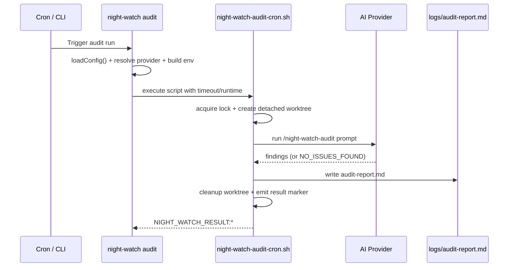

# PRD: Auditor Job — Continuous Code Quality & Architecture Audits

**Complexity: 7 → HIGH mode**

| Factor | Score |
| --- | --- |
| Touches 10+ files across core/cli/server/web/docs | +3 |
| New autonomous process (command + cron + prompt) | +2 |
| Multi-layer config wiring (types, env, API, UI) | +1 |
| New report contract and quality taxonomy | +1 |
| **Total** | **7** |

---

## 1. Context

**Problem:** Night Watch currently automates execution, review, and QA, but lacks a dedicated, scheduled **Auditor** job focused on code health and architecture hygiene. As a result, code smell and design debt (SRP/DRY/KISS/YAGNI violations, dead code, architectural drift) accumulate without a consistent feedback loop.

**Files Analyzed:**

- `packages/core/src/types.ts`
- `packages/core/src/constants.ts`
- `packages/core/src/config.ts`
- `packages/core/src/shared/types.ts`
- `packages/server/src/routes/config.routes.ts`
- `packages/cli/src/cli.ts`
- `packages/cli/src/commands/install.ts`
- `packages/cli/src/commands/uninstall.ts`
- `packages/core/src/utils/status-data.ts`
- `web/pages/Settings.tsx`

**Current Behavior:**

- Executor, Reviewer, and QA are explicit automation roles.
- No standardized Auditor role contract exists in docs/config UX.
- No guaranteed periodic report that classifies code quality and architecture risks with actionable findings.

### Integration Points Checklist

**How will this feature be reached?**

- [x] Entry point: `night-watch audit` CLI command
- [x] Scheduler: cron entry managed by `night-watch install`
- [x] Config + UX: `night-watch.config.json`, API validation, Settings page controls

**Is this user-facing?**

- [x] Yes — new `audit` workflow, logs/audit report, and Settings controls

---

## 2. Solution

**Approach:**

1. Introduce a first-class **Auditor** job with independent config (`audit.enabled`, `audit.schedule`, `audit.maxRuntime`).
2. Add a dedicated `night-watch audit` command + cron runner that invokes the configured AI provider in an isolated worktree.
3. Define a strict audit-report contract (`logs/audit-report.md`) with severity/category fields and explicit focus on SRP, DRY, KISS, YAGNI/dead code, and architectural violations.
4. Wire Auditor into install/status/settings flows so it behaves like other autonomous jobs.
5. Ensure the Auditor is **read-only** with respect to source code (report generation only; no PR creation, no auto-fixes).

**Key Decisions:**

- Job key remains `audit` in config/CLI; product-facing role name is **Auditor**.
- Output is a markdown report artifact, not code changes.
- Findings must be evidence-based (file/line reference + concrete impact), not theoretical style nits.

**Data Changes:** No DB migration required. `night-watch.config.json` gains (or standardizes) an `audit` section.

---

## 3. Sequence Flow

---

## 4. Execution Phases

### Phase 1: Config, Types, and API Contract

**Files (5):**

- `packages/core/src/types.ts`
- `packages/core/src/constants.ts`
- `packages/core/src/config.ts`
- `packages/core/src/shared/types.ts`
- `packages/server/src/routes/config.routes.ts`

**Implementation:**

- [ ] Add `IAuditConfig` to core/shared types with:
  - `enabled: boolean`
  - `schedule: string`
  - `maxRuntime: number`
- [ ] Add defaults/constants (`DEFAULT_AUDIT_*`, `AUDIT_LOG_NAME`).
- [ ] Add normalization + merge + env overrides:
  - `NW_AUDIT_ENABLED`
  - `NW_AUDIT_SCHEDULE`
  - `NW_AUDIT_MAX_RUNTIME`
- [ ] Add API validation for `audit` object fields.
- [ ] Ensure backward compatibility (missing `audit` section falls back to defaults).

**Tests Required:**

| Test File | Test Name | Assertion |
| --- | --- | --- |
| `packages/core/src/__tests__/config.test.ts` | `should load audit defaults` | `config.audit.enabled` and schedule/runtime defaults are present |
| `packages/core/src/__tests__/config.test.ts` | `should override audit config from env vars` | `NW_AUDIT_*` values take precedence |
| `packages/server/src/__tests__/config.routes.test.ts` | `should reject invalid audit payload` | invalid types/negative runtime return 400 |

**Verification Plan:**

1. Config unit tests pass.
2. API validation tests pass.
3. Existing config files without `audit` continue working.

---

### Phase 2: Auditor Command, Script, and Prompt Template

**Files (5):**

- `packages/cli/src/commands/audit.ts`
- `packages/cli/src/cli.ts`
- `scripts/night-watch-audit-cron.sh`
- `templates/night-watch-audit.md`
- `packages/cli/src/commands/init.ts`

**Implementation:**

- [ ] Add `night-watch audit` command with:
  - `--dry-run`
  - `--timeout <seconds>`
  - `--provider <claude|codex>`
- [ ] Create `night-watch-audit-cron.sh`:
  - lock file guard
  - detached worktree
  - provider invocation
  - timeout handling
  - `NIGHT_WATCH_RESULT:*` markers
- [ ] Create prompt template that explicitly audits:
  - code smells
  - SRP/DRY/KISS violations
  - YAGNI/dead code
  - architectural issues and risky coupling
- [ ] Enforce report output contract at `logs/audit-report.md`:
  - location, severity, category, description, snippet, suggested fix
  - `NO_ISSUES_FOUND` sentinel for clean runs
- [ ] Copy auditor template during `init` scaffolding.

**Tests Required:**

| Test File | Test Name | Assertion |
| --- | --- | --- |
| `packages/cli/src/__tests__/commands/audit.test.ts` | `buildEnvVars should set audit runtime + provider` | env includes `NW_AUDIT_MAX_RUNTIME` and resolved provider cmd |
| `packages/cli/src/__tests__/scripts/core-flow-smoke.test.ts` | `audit should emit success_audit when report exists` | script exits successfully with expected marker |
| `packages/cli/src/__tests__/scripts/core-flow-smoke.test.ts` | `audit should emit failure_no_report when provider returns no artifact` | script fails with correct status marker |

**Verification Plan:**

1. Run `night-watch audit --dry-run`.
2. Run integration/smoke tests for script result markers.
3. Confirm report is generated at `logs/audit-report.md`.

---

### Phase 3: Scheduler, Status, Settings UI, and Docs

**Files (6):**

- `packages/cli/src/commands/install.ts`
- `packages/cli/src/commands/uninstall.ts`
- `packages/core/src/utils/status-data.ts`
- `web/pages/Settings.tsx`
- `docs/commands.md`
- `docs/configuration.md`

**Implementation:**

- [ ] Add audit cron entry in install flow (respects `audit.enabled` and `--no-audit`).
- [ ] Ensure uninstall cleans audit-related logs/entries.
- [ ] Add audit lock/status visibility in status snapshot.
- [ ] Add Settings controls for:
  - enable/disable Auditor
  - audit schedule
  - max runtime
- [ ] Document Auditor command and config schema in docs.

**Tests Required:**

| Test File | Test Name | Assertion |
| --- | --- | --- |
| `packages/cli/src/__tests__/commands/install.test.ts` | `should include audit cron when enabled` | generated crontab contains `night-watch audit` |
| `packages/core/src/__tests__/utils/status-data.test.ts` | `should report audit lock path` | status includes audit process metadata |
| `packages/server/src/__tests__/server/status.test.ts` | `should expose audit status in API payload` | status response includes audit section |

**Verification Plan:**

1. `night-watch install` includes Auditor entry.
2. Dashboard/Status surfaces Auditor runtime state.
3. Settings save/load round-trip persists `audit` config.

---

## 5. Acceptance Criteria

- [ ] `night-watch audit` command is available and operational.
- [ ] Auditor can run on schedule via cron with independent enable/schedule/runtime config.
- [ ] Auditor writes `logs/audit-report.md` using structured findings or `NO_ISSUES_FOUND`.
- [ ] Report taxonomy includes SRP, DRY, KISS, YAGNI/dead code, code smells, and architectural issues.
- [ ] Auditor remains read-only (no source edits, no PR creation).
- [ ] Install/uninstall/status/settings/docs fully support the Auditor job.
- [ ] Relevant tests pass and `yarn verify` is green.
