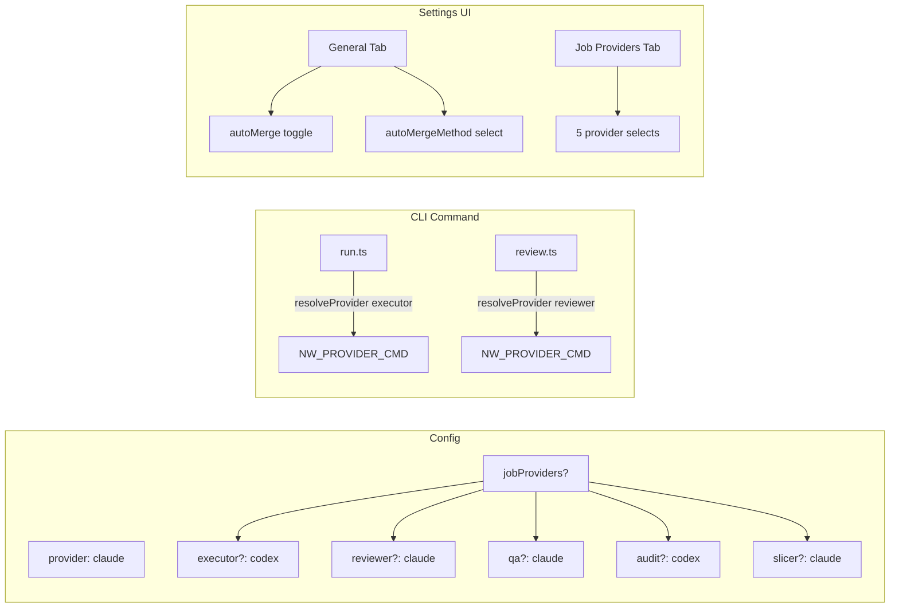
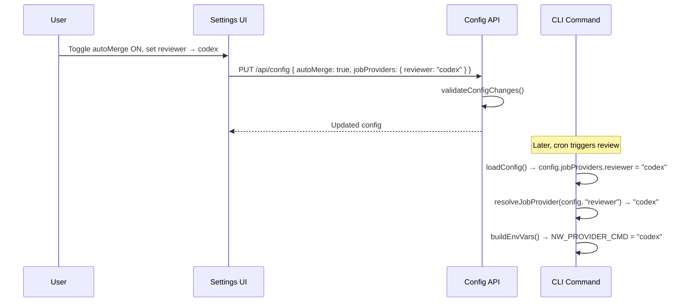

# PRD: Auto-Merge UI & Per-Job Provider Configuration

**Complexity: 6 -> MEDIUM mode**

---

## 1. Context

**Problem:** Auto-merge is fully implemented in the backend (bash scripts, config loading, env vars) but has zero web UI exposure — users can only toggle it via manual JSON editing or env vars. Additionally, the system uses a single global `provider` for ALL jobs (executor, reviewer, QA, audit, slicer), but users need to assign different providers per job type (e.g., Review => Codex, Execute => Claude).

**Files Analyzed:**

- `packages/core/src/types.ts` - `INightWatchConfig`, `Provider`, `MergeMethod`
- `packages/core/src/shared/types.ts` - Shared web contract (missing `autoMerge`, `autoMergeMethod`, `jobProviders`)
- `packages/core/src/constants.ts` - Defaults (`DEFAULT_AUTO_MERGE`, `DEFAULT_AUTO_MERGE_METHOD`, `VALID_MERGE_METHODS`)
- `packages/core/src/config.ts` - Config loader, normalizer, merger (auto-merge already handled)
- `packages/server/src/routes/config.routes.ts` - API validation (missing auto-merge + job providers)
- `web/pages/Settings.tsx` - Settings UI (missing auto-merge controls + job providers)
- `packages/cli/src/commands/run.ts` - Executor: reads `config.provider` globally
- `packages/cli/src/commands/review.ts` - Reviewer: reads `config.provider` globally
- `packages/cli/src/commands/qa.ts` - QA: reads `config.provider` globally
- `packages/cli/src/commands/audit.ts` - Audit: reads `config.provider` globally
- `packages/cli/src/commands/slice.ts` - Slicer: reads `config.provider` globally

**Current Behavior:**

- `autoMerge` and `autoMergeMethod` exist in `INightWatchConfig` but NOT in `shared/types.ts` and NOT exposed in the web UI
- Config validation in `config.routes.ts` does NOT validate `autoMerge` or `autoMergeMethod`
- All 5 job types (executor, reviewer, QA, audit, slicer) use `config.provider` as the single global provider
- Each `buildEnvVars()` does `env.NW_PROVIDER_CMD = PROVIDER_COMMANDS[config.provider]` — no per-job override
- CLI commands already accept `--provider` flag for ad-hoc overrides, but there's no persistent per-job config

---

## 2. Solution

**Approach:**

1. **Feature 1 (Auto-Merge UI):** Expose `autoMerge` toggle + `autoMergeMethod` select in the Settings page General tab; add these fields to the shared types contract and API validation
2. **Feature 2 (Job Providers):** Add an optional `jobProviders` config section where each job type can override the global provider; when a job's provider is set, `buildEnvVars()` uses it instead of the global `config.provider`; expose this in a new "Job Providers" Settings tab
3. Both features use the existing config loader/saver infrastructure — no schema migration needed

**Architecture Diagram:**



**Key Decisions:**

- `jobProviders` is a flat optional object — if a job key is absent or `null`, it falls back to the global `provider`
- Provider resolution extracted into a shared helper: `resolveJobProvider(config, jobType)`
- `autoMerge` / `autoMergeMethod` added to the General tab (alongside reviewerEnabled since they're closely related)
- No breaking changes — all new fields are optional with backward-compatible defaults

**Data Changes:** No schema migration. New optional fields in `night-watch.config.json`:

```json
{
  "autoMerge": true,
  "autoMergeMethod": "squash",
  "jobProviders": {
    "executor": "codex",
    "reviewer": "claude"
  }
}
```

---

## 3. Sequence Flow



---

## 4. Execution Phases

### Phase 1: Auto-Merge UI — Expose existing config in web

**Files (4):**

- `packages/core/src/shared/types.ts` - Add `autoMerge`, `autoMergeMethod`, `MergeMethod` to shared contract
- `packages/server/src/routes/config.routes.ts` - Add validation for `autoMerge` and `autoMergeMethod`
- `web/pages/Settings.tsx` - Add auto-merge toggle + method select to General tab; wire into ConfigForm + handleSave
- `packages/core/src/constants.ts` - (read-only reference, no changes needed)

**Implementation:**

- [ ] Add `autoMerge: boolean`, `autoMergeMethod: MergeMethod`, and `MergeMethod` type to `shared/types.ts::INightWatchConfig`
- [ ] Add validation in `validateConfigChanges()`: `autoMerge` must be boolean, `autoMergeMethod` must be one of `['squash', 'merge', 'rebase']`
- [ ] Add `autoMerge` and `autoMergeMethod` to `ConfigForm` type, `toFormState()`, and `handleSave()`
- [ ] Add auto-merge controls in the General tab after the "Enable Automated Reviews" switch:
  - `Switch` for autoMerge labeled "Auto-merge approved PRs"
  - `Select` for autoMergeMethod (only visible when autoMerge enabled) with options: Squash, Merge, Rebase

**Tests Required:**

| Test File                                             | Test Name                               | Assertion                                           |
| ----------------------------------------------------- | --------------------------------------- | --------------------------------------------------- |
| `packages/server/src/__tests__/config.routes.test.ts` | `should accept valid autoMerge boolean` | PUT with `{autoMerge: true}` returns 200            |
| `packages/server/src/__tests__/config.routes.test.ts` | `should reject invalid autoMergeMethod` | PUT with `{autoMergeMethod: 'invalid'}` returns 400 |
| `packages/server/src/__tests__/config.routes.test.ts` | `should accept valid autoMergeMethod`   | PUT with `{autoMergeMethod: 'squash'}` returns 200  |

**Verification Plan:**

1. `yarn verify` passes
2. API validation tests pass
3. Web UI shows auto-merge toggle in General tab

---

### Phase 2: Job Providers — Types, config loading, resolution helper

**Files (4):**

- `packages/core/src/types.ts` - Add `IJobProviders` interface and `jobProviders` field to `INightWatchConfig`
- `packages/core/src/shared/types.ts` - Add `IJobProviders` and `jobProviders` to shared contract
- `packages/core/src/constants.ts` - Add `DEFAULT_JOB_PROVIDERS`, `VALID_JOB_TYPES`
- `packages/core/src/config.ts` - Add normalization and merge logic for `jobProviders`

**Implementation:**

- [ ] Define `JobType` as `'executor' | 'reviewer' | 'qa' | 'audit' | 'slicer'` in `types.ts`
- [ ] Define `IJobProviders` as `Partial<Record<JobType, Provider>>` in `types.ts`
- [ ] Add `jobProviders: IJobProviders` to `INightWatchConfig` (both core and shared)
- [ ] Add `DEFAULT_JOB_PROVIDERS: IJobProviders = {}` and `VALID_JOB_TYPES` const array to `constants.ts`
- [ ] Add normalization in `normalizeConfig()` to read `rawConfig.jobProviders` and validate each entry is a valid provider
- [ ] Add merge logic in `mergeConfigs()` for `jobProviders` (shallow merge)
- [ ] Add `NW_JOB_PROVIDER_*` env var parsing in `loadConfig()` (e.g., `NW_JOB_PROVIDER_REVIEWER=codex`)

**Tests Required:**

| Test File                                    | Test Name                                        | Assertion                                                                     |
| -------------------------------------------- | ------------------------------------------------ | ----------------------------------------------------------------------------- |
| `packages/core/src/__tests__/config.test.ts` | `should load jobProviders from config file`      | `config.jobProviders.reviewer === 'codex'`                                    |
| `packages/core/src/__tests__/config.test.ts` | `should default to empty jobProviders`           | `config.jobProviders` is `{}`                                                 |
| `packages/core/src/__tests__/config.test.ts` | `should ignore invalid provider in jobProviders` | Invalid entry is stripped                                                     |
| `packages/core/src/__tests__/config.test.ts` | `should override jobProviders from env vars`     | `NW_JOB_PROVIDER_EXECUTOR=codex` → `config.jobProviders.executor === 'codex'` |

**Verification Plan:**

1. `yarn verify` passes
2. Unit tests for config loading pass
3. Existing config files without `jobProviders` still load correctly (backward compat)

---

### Phase 3: Job Providers — Wire resolution into CLI commands

**Files (5):**

- `packages/core/src/config.ts` - Add and export `resolveJobProvider(config, jobType)` helper
- `packages/cli/src/commands/run.ts` - Use `resolveJobProvider(config, 'executor')` in `buildEnvVars`
- `packages/cli/src/commands/review.ts` - Use `resolveJobProvider(config, 'reviewer')` in `buildEnvVars`
- `packages/cli/src/commands/qa.ts` - Use `resolveJobProvider(config, 'qa')` in `buildEnvVars`
- `packages/cli/src/commands/audit.ts` - Use `resolveJobProvider(config, 'audit')` in `buildEnvVars`

**Implementation:**

- [ ] Add `resolveJobProvider(config: INightWatchConfig, jobType: JobType): Provider` to `config.ts` — returns `config.jobProviders[jobType] ?? config.provider`
- [ ] Export `resolveJobProvider` and `JobType` from `@night-watch/core`
- [ ] In `run.ts::buildEnvVars`: replace `PROVIDER_COMMANDS[config.provider]` with `PROVIDER_COMMANDS[resolveJobProvider(config, 'executor')]`
- [ ] In `review.ts::buildEnvVars`: same, using `'reviewer'`
- [ ] In `qa.ts::buildEnvVars`: same, using `'qa'`
- [ ] In `audit.ts::buildEnvVars`: same, using `'audit'`
- [ ] Also update dry-run output in each command to show the resolved per-job provider
- [ ] Update `slice.ts::buildEnvVars` similarly with `'slicer'`

**Tests Required:**

| Test File                                    | Test Name                                          | Assertion                                                                                    |
| -------------------------------------------- | -------------------------------------------------- | -------------------------------------------------------------------------------------------- |
| `packages/core/src/__tests__/config.test.ts` | `resolveJobProvider returns job-specific provider` | `resolveJobProvider({...config, jobProviders: {reviewer: 'codex'}}, 'reviewer') === 'codex'` |
| `packages/core/src/__tests__/config.test.ts` | `resolveJobProvider falls back to global`          | `resolveJobProvider({...config, jobProviders: {}}, 'reviewer') === config.provider`          |
| `packages/cli/src/__tests__/run.test.ts`     | `buildEnvVars uses job-specific provider`          | With `jobProviders.executor = 'codex'`, env `NW_PROVIDER_CMD === 'codex'`                    |
| `packages/cli/src/__tests__/review.test.ts`  | `buildEnvVars uses job-specific provider`          | With `jobProviders.reviewer = 'codex'`, env `NW_PROVIDER_CMD === 'codex'`                    |

**Verification Plan:**

1. `yarn verify` passes
2. Unit tests pass
3. `night-watch run --dry-run` shows per-job provider
4. `night-watch review --dry-run` shows per-job provider

---

### Phase 4: Job Providers — API validation & Settings UI

**Files (3):**

- `packages/server/src/routes/config.routes.ts` - Add validation for `jobProviders`
- `web/pages/Settings.tsx` - Add "Job Providers" tab with 5 provider selects (+ "Use Global" option)
- `packages/core/src/index.ts` - Export new types if not already (verify)

**Implementation:**

- [ ] Add validation in `validateConfigChanges()`: if `jobProviders` is present, it must be an object where each value is a valid provider or null
- [ ] Add `jobProviders` to `ConfigForm`, `toFormState()`, and `handleSave()`
- [ ] Create a new "Job Providers" tab in Settings:
  - Description: "Override the AI provider for specific job types. Leave as 'Use Global' to use the default provider."
  - Grid with 5 rows, each showing:
    - Job label (Executor, Reviewer, QA, Audit, Slicer)
    - `Select` with options: `Use Global (default)`, `Anthropic (Claude)`, `OpenAI (Codex)`
  - When "Use Global" is selected, the key is omitted from the saved object

**Tests Required:**

| Test File                                             | Test Name                                        | Assertion                                                    |
| ----------------------------------------------------- | ------------------------------------------------ | ------------------------------------------------------------ |
| `packages/server/src/__tests__/config.routes.test.ts` | `should accept valid jobProviders`               | PUT with `{jobProviders: {reviewer: 'codex'}}` returns 200   |
| `packages/server/src/__tests__/config.routes.test.ts` | `should reject invalid provider in jobProviders` | PUT with `{jobProviders: {reviewer: 'invalid'}}` returns 400 |

**Verification Plan:**

1. `yarn verify` passes
2. API validation tests pass
3. Settings UI shows "Job Providers" tab
4. Saving with per-job overrides persists correctly to config file

---

## 5. Acceptance Criteria

- [ ] All phases complete
- [ ] All specified tests pass
- [ ] `yarn verify` passes
- [ ] Auto-merge toggle and method selector visible in Settings > General
- [ ] Job Providers tab visible in Settings with 5 job-type selectors
- [ ] Saving config with auto-merge + job providers persists to `night-watch.config.json`
- [ ] CLI commands resolve per-job provider correctly (visible via `--dry-run`)
- [ ] Backward compatible — configs without new fields load fine with defaults
- [ ] `--provider` CLI flag still works as an ad-hoc override (takes precedence over everything)
