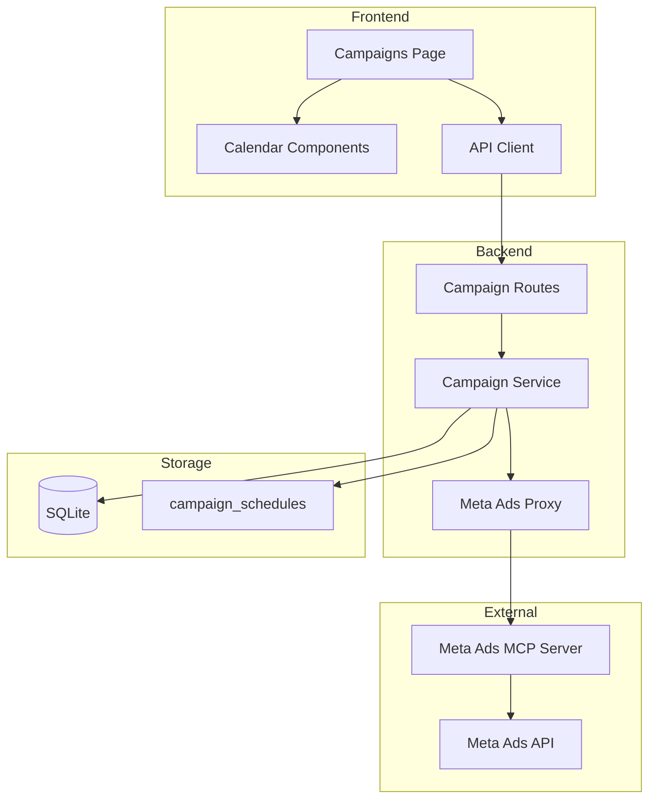
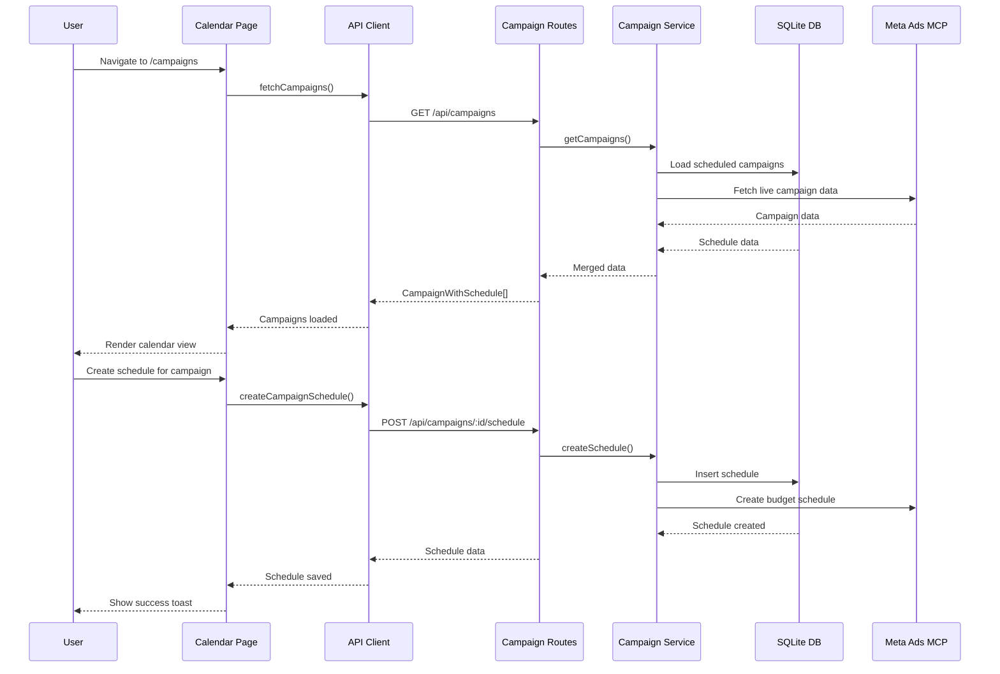

# PRD: Campaign Calendar UI with Scheduling Logic

**Complexity: 4 (HIGH)**

**GitHub Issue: #49**

---

## 1. Context

### Problem

Users managing Meta Ads campaigns need a visual calendar-based interface to:

1. View all campaigns scheduled across time
2. Create and edit campaign schedules (start/end dates, budget schedules)
3. See campaign status and performance at a glance
4. Manage budget schedules for high-demand periods

Currently, there is no UI for managing Meta Ads campaigns - all interaction must be done through the Meta Ads API directly.

### Goals

1. Provide a calendar view showing campaigns organized by date
2. Allow creating/editing campaign schedules with start and end dates
3. Support budget scheduling for high-demand periods
4. Integrate with Meta Ads MCP tools for real campaign data
5. Follow existing Night Watch UI patterns and architecture

### Files to Analyze

- `/web/pages/Scheduling.tsx` - Existing scheduling patterns
- `/web/pages/PRs.tsx` - Reference for table/list views
- `/web/components/Sidebar.tsx` - Navigation structure
- `/web/api.ts` - API client patterns
- `/packages/server/src/routes/*.ts` - Backend route patterns
- `/packages/core/src/storage/sqlite/migrations.ts` - Database schema

---

## 2. Solution

### Approach

1. **Database Schema** - Add `campaign_schedules` table to store schedule metadata
2. **Backend API** - Create new routes for campaigns and scheduling
3. **Frontend UI** - Build a calendar page with full CRUD for campaign schedules
4. **Integration** - Connect to Meta Ads MCP tools for real campaign data

### Architecture Diagram



---

## 3. Sequence Flow



---

## 4. Execution Phases

### Phase 1: Database Schema and Types - Add campaign_schedules table and TypeScript types

**Files:**

- `packages/core/src/storage/sqlite/migrations.ts` - Add campaign_schedules table
- `packages/core/src/campaign/types.ts` (NEW) - Campaign and schedule types
- `packages/core/src/campaign/index.ts` (NEW) - Campaign module exports
- `packages/core/src/storage/repositories/interfaces.ts` - Add ICampaignScheduleRepository
- `packages/core/src/storage/repositories/sqlite/campaign-schedule.repository.ts` (NEW) - Repository implementation

**Implementation:**

- [ ] Add `campaign_schedules` table to migrations.ts with fields:
  - `id` INTEGER PRIMARY KEY
  - `campaign_id` TEXT NOT NULL (Meta Ads campaign ID)
  - `ad_account_id` TEXT NOT NULL
  - `campaign_name` TEXT NOT NULL
  - `start_date` INTEGER NOT NULL (Unix timestamp)
  - `end_date` INTEGER NOT NULL (Unix timestamp)
  - `budget_schedule_json` TEXT (JSON for budget schedules)
  - `status` TEXT NOT NULL
  - `created_at` INTEGER NOT NULL
  - `updated_at` INTEGER NOT NULL
- [ ] Create `ICampaignSchedule` interface in types.ts
- [ ] Create `ICampaignWithSchedule` interface combining Meta campaign + schedule
- [ ] Create `ICampaignScheduleRepository` interface
- [ ] Implement `CampaignScheduleRepository` with SQLite backend
- [ ] Add repository to DI container

**Tests Required:**

| Test File                                                 | Test Name                        | Assertion                               |
| --------------------------------------------------------- | -------------------------------- | --------------------------------------- |
| `campaign-schedule.repository.test.ts`                    | "creates and retrieves schedule" | Repository can round-trip schedule data |
| `campaign-schedule.repository.test.ts`                    | "updates existing schedule"      | Repository can update schedule fields   |
| `campaign-schedule.repository.test.ts` "deletes schedule" | Repository can delete by ID      |
| `campaign-schedule.repository.test.ts`                    | "lists schedules by date range"  | Repository filters by date range        |

---

### Phase 2: Backend API Routes - Create campaign and schedule API endpoints

**Files:**

- `packages/server/src/routes/campaign.routes.ts` (NEW) - Campaign API routes
- `packages/server/src/services/campaign.service.ts` (NEW) - Campaign business logic
- `packages/server/src/index.ts` - Register campaign routes
- `packages/core/src/campaign/meta-ads-proxy.ts` (NEW) - Meta Ads MCP integration

**Implementation:**

- [ ] Create `CampaignService` class with methods:
  - `getCampaigns(adAccountId)` - Fetch campaigns from Meta Ads via MCP
  - `getCampaignSchedules()` - Get all stored schedules
  - `getCampaignWithSchedule(campaignId)` - Get campaign + its schedule
  - `createCampaignSchedule(input)` - Create new schedule
  - `updateCampaignSchedule(id, updates)` - Update existing schedule
  - `deleteCampaignSchedule(id)` - Delete schedule
  - `syncCampaigns(adAccountId)` - Sync campaigns from Meta Ads
- [ ] Create campaign routes:
  - `GET /api/campaigns` - List all campaigns with schedules
  - `GET /api/campaigns/:id` - Get single campaign with schedule
  - `POST /api/campaigns/:id/schedule` - Create/update schedule
  - `DELETE /api/campaigns/:id/schedule` - Delete schedule
  - `POST /api/campaigns/sync` - Sync from Meta Ads
  - `GET /api/campaigns/ad-accounts` - List available ad accounts
- [ ] Create Meta Ads proxy that uses MCP tools
- [ ] Register routes in server index.ts

**Tests Required:**

| Test File                  | Test Name                               | Assertion                           |
| -------------------------- | --------------------------------------- | ----------------------------------- |
| `campaign.service.test.ts` | "getCampaigns returns merged data"      | Service combines Meta + stored data |
| `campaign.service.test.ts` | "createCampaignSchedule persists to DB" | Schedule saved to repository        |
| `campaign-routes.test.ts`  | "GET /api/campaigns returns 200"        | Endpoint returns campaign list      |
| `campaign-routes.test.ts`  | "POST schedule validates input"         | Invalid input returns 400           |

---

### Phase 3: Frontend Types and API Client - Add campaign types and API functions to web package

**Files:**

- `web/types.ts` - Add campaign-related types
- `web/api.ts` - Add campaign API functions

**Implementation:**

- [ ] Add types to web/types.ts:
  - `ICampaignSchedule`
  - `ICampaignWithSchedule`
  - `IAdAccount`
  - `IBudgetSchedule`
- [ ] Add API functions to web/api.ts:
  - `fetchCampaigns()` - GET /api/campaigns
  - `fetchCampaign(id)` - GET /api/campaigns/:id
  - `createCampaignSchedule(campaignId, schedule)` - POST /api/campaigns/:id/schedule
  - `updateCampaignSchedule(campaignId, schedule)` - PUT /api/campaigns/:id/schedule
  - `deleteCampaignSchedule(campaignId)` - DELETE /api/campaigns/:id/schedule
  - `syncCampaigns()` - POST /api/campaigns/sync
  - `fetchAdAccounts()` - GET /api/campaigns/ad-accounts

**Tests Required:**

| Test File           | Test Name                            | Assertion                          |
| ------------------- | ------------------------------------ | ---------------------------------- |
| Manual verification | "API functions return correct types" | TypeScript compiles without errors |

---

### Phase 4: Campaign Calendar UI - Build the calendar page and components

**Files:**

- `web/pages/Campaigns.tsx` (NEW) - Main campaigns page
- `web/components/campaign/Calendar.tsx` (NEW) - Calendar grid component
- `web/components/campaign/CalendarDay.tsx` (NEW) - Single day cell
- `web/components/campaign/CampaignCard.tsx` (NEW) - Campaign detail card
- `web/components/campaign/ScheduleModal.tsx` (NEW) - Schedule edit modal
- `web/components/campaign/CampaignFilters.tsx` (NEW) - Filter controls
- `web/components/Sidebar.tsx` - Add Campaigns nav item
- `web/App.tsx` - Add Campaigns route

**Implementation:**

- [ ] Create `Campaigns` page with:
  - Month/year navigation controls
  - Calendar grid showing days of month
  - Campaigns positioned on their start dates
  - Filter by ad account and status
  - Sync button to refresh from Meta Ads
- [ ] Create `Calendar` component with:
  - 7-column grid (days of week)
  - Month navigation (prev/next)
  - Today indicator
  - Campaigns rendered as colored bars
- [ ] Create `CalendarDay` component with:
  - Day number
  - Campaign indicators (dots or mini cards)
  - Click handler to view day's campaigns
- [ ] Create `CampaignCard` component with:
  - Campaign name and status
  - Start/end dates
  - Budget info
  - Actions (edit schedule, view in Meta)
- [ ] Create `ScheduleModal` component with:
  - Start/end date pickers
  - Budget schedule inputs
  - Save/cancel buttons
- [ ] Create `CampaignFilters` component with:
  - Ad account selector
  - Status filter pills
  - Date range filter
- [ ] Add "Campaigns" to Sidebar navigation
- [ ] Add `/campaigns` route to App.tsx

**Tests Required:**

| Test File           | Test Name                           | Assertion                                   |
| ------------------- | ----------------------------------- | ------------------------------------------- |
| Manual verification | "Calendar renders month grid"       | Grid shows correct days for month           |
| Manual verification | "Campaigns appear on correct dates" | Campaigns render on start date              |
| Manual verification | "Filters work correctly"            | Clicking filter updates displayed campaigns |
| Manual verification | "Schedule modal opens and saves"    | Can create/edit schedules                   |
| Manual verification | "Sync refreshes from Meta Ads"      | Sync button fetches latest data             |

---

### Phase 5: Integration and Verification - Connect all components and verify

**Files:**

- `packages/core/src/di/container.ts` - Register campaign repository
- `packages/core/src/index.ts` - Export campaign module

**Implementation:**

- [ ] Register `ICampaignScheduleRepository` in DI container
- [ ] Export campaign module from core package
- [ ] Verify all imports resolve correctly
- [ ] Run `yarn verify` and fix any issues
- [ ] Run `yarn build:web` and fix any issues
- [ ] Manual end-to-end test:
  - Navigate to /campaigns
  - Sync campaigns from Meta Ads
  - View campaigns on calendar
  - Create a schedule
  - Edit a schedule
  - Delete a schedule

**Tests Required:**

| Test File        | Test Name                  | Assertion               |
| ---------------- | -------------------------- | ----------------------- |
| `yarn verify`    | "TypeScript compiles"      | No type errors          |
| `yarn verify`    | "ESLint passes"            | No lint errors          |
| `yarn build:web` | "Vite builds successfully" | No build errors         |
| Manual E2E       | "Full flow works"          | All features functional |

---

## 5. Verification Strategy

### Verification Plan

1. **Unit Tests:**
   - Repository tests in `packages/core/src/__tests__/`
   - Service tests in `packages/server/src/__tests__/`
   - Route tests in `packages/server/src/__tests__/`

2. **Build Verification:**

   ```bash
   yarn verify  # TypeScript + ESLint
   yarn build:web  # Vite build
   ```

3. **Manual Browser Testing:**
   - All Phase 4 tests require manual verification

4. **Evidence Required:**
   - [ ] All unit tests pass
   - [ ] `yarn verify` passes
   - [ ] `yarn build:web` passes
   - [ ] Manual E2E test complete

---

## 6. Acceptance Criteria

- [ ] All phases complete
- [ ] Database migration adds campaign_schedules table
- [ ] API endpoints available for campaign CRUD
- [ ] Calendar UI renders campaigns by date
- [ ] Can create/edit/delete campaign schedules
- [ ] Can filter campaigns by account and status
- [ ] Can sync campaigns from Meta Ads
- [ ] `yarn verify` passes
- [ ] `yarn build:web` passes
- [ ] Feature reachable at `/campaigns` route
- [ ] UI follows existing Night Watch patterns

---

## 7. Implementation Notes

### Calendar Grid Pattern

```tsx
// Calendar.tsx structure
const Calendar: React.FC<Props> = ({ campaigns, month, year, onDayClick }) => {
  const days = getDaysInMonth(year, month);
  const firstDay = getFirstDayOfMonth(year, month);

  return (
    <div className="grid grid-cols-7 gap-px bg-slate-800">
      {DAYS_OF_WEEK.map((day) => (
        <div key={day} className="text-center py-2 text-sm text-slate-400">
          {day}
        </div>
      ))}
      {/* Empty cells for days before month start */}
      {Array.from({ length: firstDay }).map((_, i) => (
        <div key={`empty-${i}`} className="h-24 bg-slate-900/50" />
      ))}
      {/* Day cells */}
      {days.map((day) => (
        <CalendarDay
          key={day}
          day={day}
          campaigns={getCampaignsForDay(campaigns, day)}
          onClick={() => onDayClick(day)}
        />
      ))}
    </div>
  );
};
```

### Campaign Schedule Type

```typescript
interface ICampaignSchedule {
  id: number;
  campaignId: string;
  adAccountId: string;
  campaignName: string;
  startDate: number; // Unix timestamp
  endDate: number; // Unix timestamp
  budgetSchedules: IBudgetSchedule[];
  status: CampaignStatus;
  createdAt: number;
  updatedAt: number;
}

interface IBudgetSchedule {
  budgetValue: number;
  budgetValueType: 'ABSOLUTE' | 'MULTIPLIER';
  timeStart: number; // Unix timestamp
  timeEnd: number; // Unix timestamp
}

type CampaignStatus = 'ACTIVE' | 'PAUSED' | 'DELETED' | 'ARCHIVED' | 'DRAFT';
```

### API Response Pattern

```typescript
// GET /api/campaigns response
interface ICampaignsResponse {
  campaigns: ICampaignWithSchedule[];
  adAccounts: IAdAccount[];
  lastSync: string | null;
}

interface ICampaignWithSchedule {
  id: string;
  name: string;
  status: CampaignStatus;
  objective: string;
  dailyBudget: number;
  lifetimeBudget: number;
  schedule: ICampaignSchedule | null;
}
```
