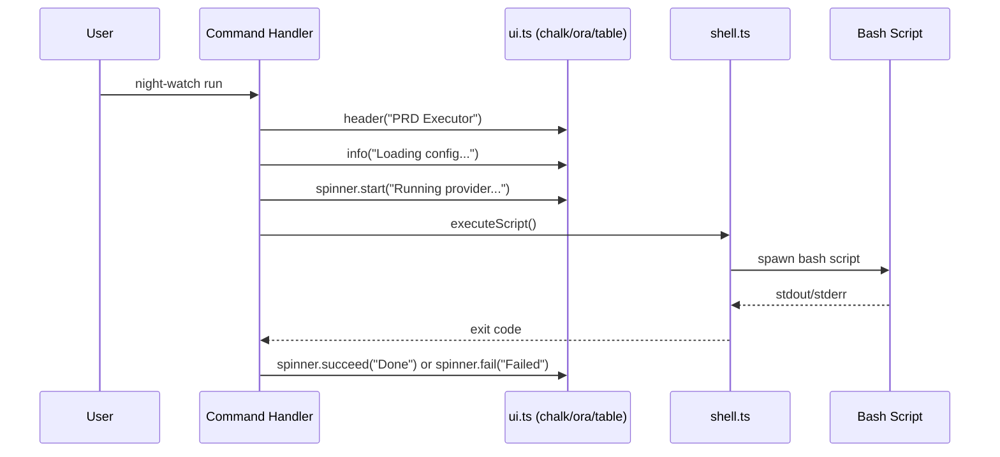

# PRD: Terminal UI Polish

**Complexity: 5 → MEDIUM mode**
- Touches 8 files (+2)
- No new system from scratch
- No complex state logic
- Single package changes (+0)
- No database schema changes
- No external API integration

---

## 1. Context

**Problem:** All CLI output is plain `console.log` text with no colors, no tables, and no progress indicators — making it hard to scan status, spot errors, or know if a long-running command is still working.

**Files Analyzed:**
- `src/cli.ts` — command registration
- `src/commands/init.ts` — 9-step init with plain text output
- `src/commands/run.ts` — dry-run output + script spawn
- `src/commands/review.ts` — dry-run output + script spawn
- `src/commands/install.ts` — crontab install feedback
- `src/commands/uninstall.ts` — crontab removal feedback
- `src/commands/status.ts` — 70+ lines of console.log dashboard
- `src/commands/logs.ts` — log file viewer
- `src/utils/shell.ts` — subprocess spawner (stdio piping)
- `package.json` — only prod dependency is `commander`
- `src/__tests__/cli.test.ts` — integration tests that check for text output

**Current Behavior:**
- All output is plain monochrome `console.log`
- `status` command is ~70 lines of manually formatted dashes and text
- `init` shows 9 steps with `[1/9]` prefixes but no visual distinction for pass/fail
- `run` and `review` spawn bash scripts and pipe stdout but show no spinner/progress
- Errors use `console.error` with no visual differentiation from normal output

### Integration Points Checklist

- **Entry point:** All 7 existing CLI commands
- **Caller files:** `src/commands/init.ts`, `run.ts`, `review.ts`, `install.ts`, `uninstall.ts`, `status.ts`, `logs.ts`
- **Registration/wiring:** No new commands — this enhances existing output
- **User-facing:** YES — every command gets visual improvements
- **Full user flow:** User runs any `night-watch` command → sees colored, formatted output

---

## 2. Solution

**Approach:**
- Add `chalk` (v5, ESM-native) for colored text across all commands
- Add `cli-table3` for the `status` dashboard tables
- Add `ora` for spinners when spawning provider CLI in `run` and `review`
- Create a shared `src/utils/ui.ts` module with reusable formatting helpers (success/error/warn/info prefixes, section headers)
- Update tests to account for ANSI escape codes in output (or use `chalk.level = 0` in test env)

**Key Decisions:**
- `chalk` v5 (ESM-native, zero-dependency) — not v4 which requires CJS compat
- `cli-table3` over `table` — lighter, well-maintained, good defaults
- `ora` over `nanospinner` — better ecosystem support, handles pipe detection
- Shared `ui.ts` helper to avoid duplicating formatting logic across 7 command files
- No changes to bash scripts — they log to files, not to the user's terminal

**Data Changes:** None

---

## 3. Sequence Flow

---

## 4. Execution Phases

### Phase 1: Add dependencies and create ui.ts utility — Colored output helpers available for all commands

**Files (3):**
- `package.json` — add `chalk`, `cli-table3`, `ora` as prod dependencies
- `src/utils/ui.ts` — NEW: shared formatting helpers
- `src/__tests__/utils/ui.test.ts` — NEW: unit tests for ui helpers

**Implementation:**
- [ ] `npm install chalk cli-table3 ora`
- [ ] Create `src/utils/ui.ts` with these exports:
  - `success(msg: string)` — green check prefix (`✔ msg`)
  - `error(msg: string)` — red cross prefix (`✖ msg`)
  - `warn(msg: string)` — yellow warning prefix (`⚠ msg`)
  - `info(msg: string)` — cyan info prefix (`ℹ msg`)
  - `header(title: string)` — bold section header with line
  - `dim(msg: string)` — dimmed text for secondary info
  - `label(key: string, value: string)` — formatted key-value pair with consistent alignment
  - `createSpinner(text: string)` — returns an `ora` instance
  - `createTable(options?)` — returns a configured `cli-table3` instance with sensible defaults
- [ ] Write unit tests confirming each helper produces expected output

**Tests Required:**
| Test File | Test Name | Assertion |
|-----------|-----------|-----------|
| `src/__tests__/utils/ui.test.ts` | `success() should prefix with green check` | output contains `✔` |
| `src/__tests__/utils/ui.test.ts` | `error() should prefix with red cross` | output contains `✖` |
| `src/__tests__/utils/ui.test.ts` | `header() should include bold title` | output contains title text |
| `src/__tests__/utils/ui.test.ts` | `createTable() should return Table instance` | `expect(table).toBeDefined()` |

**Verification:**
- `npm test` passes
- `npx tsx -e "import { success, error, warn, info } from './src/utils/ui.js'; success('works'); error('fail'); warn('caution'); info('note');"` shows colored output

---

### Phase 2: Colorize status command — Status dashboard uses colored tables

**Files (2):**
- `src/commands/status.ts` — replace console.log dashboard with chalk + cli-table3
- `src/__tests__/commands/status.test.ts` — update tests for new output

**Implementation:**
- [ ] Import `ui.ts` helpers and `cli-table3`
- [ ] Replace the `"--- Configuration ---"` section with a table: `[Provider, claude] [Reviewer, Enabled/Disabled]`
- [ ] Replace `"--- Process Status ---"` with colored indicators: green `● Running (PID: X)` or dim `○ Not running`
- [ ] Replace `"--- PRD Status ---"` with a table: `[Pending, N] [Completed, N]`
- [ ] Replace `"--- PR Status ---"` with a table: `[Open PRs, N]`
- [ ] Replace `"--- Crontab Status ---"` with colored: green `✔ Installed` or yellow `⚠ Not installed`
- [ ] Replace `"--- Log Files ---"` with table: `[Executor, size] [Reviewer, size]`
- [ ] Replace `"--- Commands ---"` tips section with `dim()` styled hints
- [ ] Preserve `--json` output exactly as-is (no colors in JSON mode)
- [ ] Update tests — use `{ env: { ...process.env, FORCE_COLOR: '0' } }` in execSync to strip ANSI for assertions

**Tests Required:**
| Test File | Test Name | Assertion |
|-----------|-----------|-----------|
| `src/__tests__/commands/status.test.ts` | `should display status dashboard` | output contains `Night Watch Status` |
| `src/__tests__/commands/status.test.ts` | `--json should output valid JSON without colors` | `JSON.parse(output)` succeeds |

**Verification:**
- `npx tsx src/cli.ts status` shows colored, table-formatted dashboard
- `npx tsx src/cli.ts status --json` outputs clean JSON (no ANSI codes)

---

### Phase 3: Colorize init command — Init steps show colored pass/fail indicators

**Files (2):**
- `src/commands/init.ts` — replace plain `[N/9]` steps with colored check/cross indicators
- `src/__tests__/commands/init.test.ts` — update test assertions

**Implementation:**
- [ ] Import `ui.ts` helpers
- [ ] Replace `console.log('[1/9] Checking git repository...')` pattern with `info('Checking git repository...')` followed by `success('Git repository found')` or `error('Not a git repository')`
- [ ] Replace `console.log('  OK: ...')` with `success(...)`
- [ ] Replace `console.error('Error: ...')` with `error(...)`
- [ ] Replace final summary section with `header('Initialization Complete')` + table of created files
- [ ] Replace "Next steps" section with `info()` styled tips

**Tests Required:**
| Test File | Test Name | Assertion |
|-----------|-----------|-----------|
| `src/__tests__/commands/init.test.ts` | `should complete init successfully` | exit code 0, output contains key steps |

**Verification:**
- `npx tsx src/cli.ts init --force` shows colored step-by-step output

---

### Phase 4: Colorize remaining commands + add spinners — All commands have polished output

**Files (5):**
- `src/commands/run.ts` — colorize dry-run output, add spinner for script execution
- `src/commands/review.ts` — colorize dry-run output, add spinner for script execution
- `src/commands/install.ts` — colorize success/error messages
- `src/commands/uninstall.ts` — colorize success/error messages
- `src/commands/logs.ts` — colorize log headers and tips

**Implementation:**
- [ ] `run.ts`: Import `ui.ts`. In dry-run mode, use `header()`, `label()`, `info()` for config display. In execution mode, create spinner with `createSpinner('Running PRD executor...')`, start before `executeScript()`, succeed/fail based on exit code
- [ ] `review.ts`: Same pattern as `run.ts` — `createSpinner('Running PR reviewer...')`. Note: spinner must stop before bash script's stdout is piped (spinner uses stderr, stdout is inherited — test this works)
- [ ] `install.ts`: Replace `console.log('Night Watch installed...')` with `success(...)`. Replace error paths with `error(...)`. Show crontab entries with `dim()`
- [ ] `uninstall.ts`: Replace success/error messages with `success()`/`error()`
- [ ] `logs.ts`: Replace `=== Executor Log ===` headers with `header()`. Replace tip section with `dim()`
- [ ] Verify spinner doesn't conflict with subprocess stdout piping in `shell.ts` — ora writes to stderr by default, so it should work. If not, stop spinner before spawn and restart after.

**Tests Required:**
| Test File | Test Name | Assertion |
|-----------|-----------|-----------|
| `src/__tests__/cli.test.ts` | `should show dry-run output for run command` | output contains 'Dry Run' and 'Configuration' |
| `src/__tests__/cli.test.ts` | `should show dry-run output for review command` | output contains 'Dry Run' and 'Configuration' |
| `src/__tests__/cli.test.ts` | `should execute install command` | output contains 'installed' or 'already installed' |

**Verification:**
- `npx tsx src/cli.ts run --dry-run` shows colored config + PRD listing
- `npx tsx src/cli.ts review --dry-run` shows colored config + PR listing
- `npx tsx src/cli.ts install` then `npx tsx src/cli.ts uninstall` show colored feedback
- `npx tsx src/cli.ts logs` shows colored log headers
- `npm test` — all tests pass

---

## 5. Acceptance Criteria

- [ ] All 7 commands produce colored output (success=green, error=red, warn=yellow, info=cyan)
- [ ] `status` command uses tables via cli-table3
- [ ] `run` and `review` show a spinner while the provider CLI runs
- [ ] `--json` output in `status` remains clean (no ANSI codes)
- [ ] All existing tests pass (updated for ANSI-aware assertions)
- [ ] `npm test` passes
- [ ] No changes to bash scripts
- [ ] Three new prod dependencies: `chalk`, `cli-table3`, `ora`
