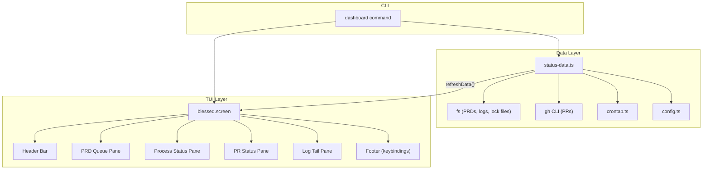
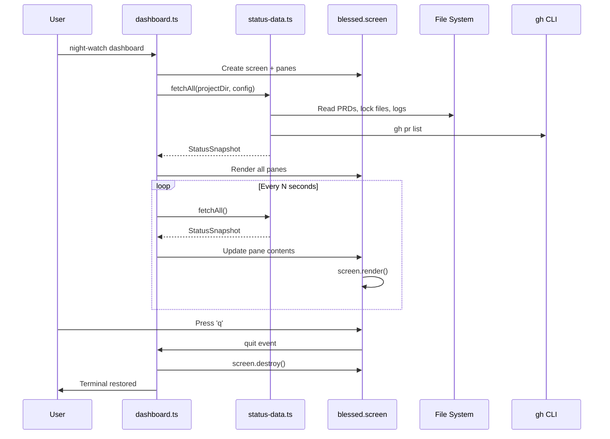

# PRD: Dashboard TUI

**Depends on:** `01-terminal-ui-polish.md`, `03-day-to-day-operations.md`

**Complexity: 7 → HIGH mode**
- Touches 10+ files (+3)
- New TUI system from scratch (+2)
- Complex state logic (real-time updates, multi-pane layout) (+2)
- Single package
- No database changes
- No external API integration (reuses existing gh/git/fs calls)

---

## 1. Context

**Problem:** Users have no single-pane-of-glass view into Night Watch. Checking on autonomous runs requires jumping between `night-watch status`, `night-watch prds`, `night-watch prs`, and `night-watch logs` — each showing a frozen snapshot. There's no way to watch Night Watch work in real time.

**Files Analyzed:**
- `src/commands/status.ts` — has `checkLockFile()`, `countPRDs()`, `countOpenPRs()`, `getLogInfo()`, `getLastLogLines()` — all reusable
- `src/commands/run.ts` — has `scanPrdDirectory()` for pending/completed PRD lists
- `src/utils/ui.ts` — chalk, ora, cli-table3 helpers (good for static output, not live TUI)
- `src/utils/crontab.ts` — `getEntries()`, `getProjectEntries()` for crontab status
- `src/config.ts` — `loadConfig()` for reading project configuration
- `src/constants.ts` — `LOCK_FILE_PREFIX`, `LOG_DIR`, `DEFAULT_BRANCH_PATTERNS`
- `src/types.ts` — `INightWatchConfig` interface
- `scripts/night-watch-helpers.sh` — `find_eligible_prd()` dependency checking logic (to replicate in TS)
- `package.json` — currently only `chalk`, `cli-table3`, `ora`, `commander` as prod deps

**Current Behavior:**
- `status` command shows a one-time snapshot with aggregate counts
- `logs` command tails log files but no other context
- `prds` and `prs` commands (from PRD 03) show individual listings but no combined view
- No real-time updates — user must re-run commands to see changes
- No combined view showing PRD queue + process status + PR status + logs together

### Integration Points Checklist

- **Entry point:** `night-watch dashboard` CLI command
- **Caller file:** `src/cli.ts` — register dashboard command
- **Registration:** Add `dashboardCommand(program)` call in `cli.ts`
- **User-facing:** YES — full-screen terminal dashboard
- **Full user flow:**
  1. User runs `night-watch dashboard`
  2. Full-screen TUI renders with 4 panes: PRD Queue, Processes, PRs, Logs
  3. Data refreshes every 10 seconds (configurable with `--interval`)
  4. User presses `q` to quit, arrow keys to navigate panes, `r` to force refresh
  5. TUI cleans up terminal on exit (restores cursor, alternate screen)

---

## 2. Solution

**Approach:**
- Use `blessed` (MIT, mature, zero-native-dependency) for the TUI framework — it handles alternate screen buffer, keyboard input, box layouts, and scroll
- Create `src/utils/dashboard/` module with pane components and a data-fetching layer
- Extract data-gathering functions from `status.ts` into a shared `src/utils/status-data.ts` module (DRY — both `status` and `dashboard` need the same data)
- Dashboard refreshes on a configurable interval (default 10s) using `setInterval`
- Each pane is a `blessed.box` with independent scroll — user navigates between panes with Tab
- Graceful shutdown: catch SIGINT/SIGTERM, restore terminal, exit cleanly

**Architecture Diagram:**



**Key Decisions:**
- `blessed` over `ink` — blessed gives raw terminal control (alternate screen, focus management) without requiring React; ink would pull in React as a dependency
- Extract `status-data.ts` from `status.ts` — avoid duplicating data-fetching logic
- `--interval <seconds>` flag (default 10) — users can increase for low-resource environments
- `--no-color` support inherited from chalk (respects `NO_COLOR` env var)
- Dashboard does NOT start/stop runs — it's read-only. Use `run`/`review`/`cancel` commands for control

**Data Changes:** None — read-only feature

---

## 3. Sequence Flow



---

## 4. Execution Phases

### Phase 1: Extract status data layer — Shared data-fetching module usable by both `status` and `dashboard`

**Files (4):**
- `src/utils/status-data.ts` — NEW: data-fetching functions extracted from status.ts
- `src/commands/status.ts` — refactor to use `status-data.ts`
- `src/__tests__/utils/status-data.test.ts` — NEW: unit tests
- `src/__tests__/commands/status.test.ts` — verify existing tests still pass

**Implementation:**
- [ ] Create `src/utils/status-data.ts` with these exports:
  ```typescript
  export interface PrdInfo {
    name: string;
    status: 'ready' | 'blocked' | 'in-progress' | 'done';
    dependencies: string[];
    unmetDependencies: string[];
  }

  export interface ProcessInfo {
    name: string;
    running: boolean;
    pid: number | null;
  }

  export interface PrInfo {
    number: number;
    title: string;
    branch: string;
    ciStatus: 'pass' | 'fail' | 'pending' | 'unknown';
    reviewScore: number | null;
  }

  export interface LogInfo {
    name: string;
    path: string;
    exists: boolean;
    size: number;
    lastLines: string[];
  }

  export interface StatusSnapshot {
    projectName: string;
    projectDir: string;
    config: INightWatchConfig;
    prds: PrdInfo[];
    processes: ProcessInfo[];
    prs: PrInfo[];
    logs: LogInfo[];
    crontab: { installed: boolean; entries: string[] };
    timestamp: Date;
  }

  export function fetchStatusSnapshot(projectDir: string, config: INightWatchConfig): StatusSnapshot;
  ```
- [ ] Extract `checkLockFile()`, `countPRDs()` logic, `getLastLogLines()`, `getLogInfo()` from `status.ts` into `status-data.ts` — these become the underlying data functions
- [ ] `fetchStatusSnapshot()` calls all data functions and returns a unified snapshot object
- [ ] Refactor `status.ts` to call `fetchStatusSnapshot()` and render from the snapshot (replacing inline data-gathering)
- [ ] Verify all existing `status` tests still pass

**Tests Required:**
| Test File | Test Name | Assertion |
|-----------|-----------|-----------|
| `src/__tests__/utils/status-data.test.ts` | `fetchStatusSnapshot should return all fields` | snapshot has prds, processes, prs, logs, crontab |
| `src/__tests__/utils/status-data.test.ts` | `should detect running process from lock file` | processes[0].running is true when PID alive |
| `src/__tests__/utils/status-data.test.ts` | `should count pending and done PRDs` | prds array has correct status values |
| `src/__tests__/commands/status.test.ts` | `existing tests still pass` | no regressions |

**Verification:**
- `npx tsx src/cli.ts status` produces identical output to before refactor
- `npx tsx src/cli.ts status --json` still outputs valid JSON
- `npm test` passes

---

### Phase 2: Add blessed dependency and create dashboard scaffolding — Empty dashboard renders with 4 panes

**Files (4):**
- `package.json` — add `blessed` dependency
- `src/commands/dashboard.ts` — NEW: dashboard command with blessed screen
- `src/cli.ts` — register dashboard command
- `src/__tests__/commands/dashboard.test.ts` — NEW: basic tests

**Implementation:**
- [ ] `npm install blessed` and `npm install -D @types/blessed`
- [ ] Create `src/commands/dashboard.ts`:
  ```typescript
  export interface DashboardOptions {
    interval: string; // refresh interval in seconds
  }

  export function dashboardCommand(program: Command): void {
    program
      .command('dashboard')
      .description('Live terminal dashboard')
      .option('--interval <seconds>', 'Refresh interval in seconds', '10')
      .action(async (options: DashboardOptions) => {
        // Implementation
      });
  }
  ```
- [ ] Create blessed screen with alternate buffer:
  ```typescript
  const screen = blessed.screen({
    smartCSR: true,
    title: 'Night Watch Dashboard',
    fullUnicode: true,
  });
  ```
- [ ] Create 4 panes using `blessed.box`:
  - **Top-left:** PRD Queue (50% width, 40% height)
  - **Top-right:** Process Status (50% width, 40% height)
  - **Bottom-left:** PR Status (50% width, 30% height)
  - **Bottom-right:** Log Tail (50% width, 30% height)
  - **Header:** Full width, 3 rows — project name + refresh timer
  - **Footer:** Full width, 1 row — keybinding hints
- [ ] Wire keyboard handlers: `q`/`Escape` to quit, `Tab` to cycle pane focus, `r` to refresh
- [ ] On quit: `screen.destroy()` — blessed restores terminal automatically
- [ ] Register in `cli.ts`: `import { dashboardCommand } from './commands/dashboard.js'` + `dashboardCommand(program)`

**Tests Required:**
| Test File | Test Name | Assertion |
|-----------|-----------|-----------|
| `src/__tests__/commands/dashboard.test.ts` | `should show dashboard in --help` | help output contains 'dashboard' |
| `src/__tests__/commands/dashboard.test.ts` | `should accept --interval flag` | help output contains '--interval' |
| `src/__tests__/cli.test.ts` | `should list dashboard command in help` | main help contains 'dashboard' |

**Verification:**
- `npx tsx src/cli.ts dashboard --help` shows command and options
- `npx tsx src/cli.ts --help` lists `dashboard` command
- `npm test` passes

---

### Phase 3: Populate dashboard panes with live data — Dashboard shows real data with auto-refresh

**Files (3):**
- `src/commands/dashboard.ts` — add data rendering and refresh loop
- `src/utils/status-data.ts` — add PRD dependency parsing (port from bash `grep -i 'depends on'`)
- `src/__tests__/commands/dashboard.test.ts` — add rendering tests

**Implementation:**
- [ ] In `dashboard.ts`, after screen creation:
  ```typescript
  const config = loadConfig(projectDir);
  let snapshot = fetchStatusSnapshot(projectDir, config);
  renderPanes(snapshot);

  const interval = setInterval(() => {
    snapshot = fetchStatusSnapshot(projectDir, config);
    renderPanes(snapshot);
    screen.render();
  }, parseInt(options.interval, 10) * 1000);

  screen.key(['q', 'escape'], () => {
    clearInterval(interval);
    screen.destroy();
    process.exit(0);
  });

  screen.key(['r'], () => {
    snapshot = fetchStatusSnapshot(projectDir, config);
    renderPanes(snapshot);
    screen.render();
  });
  ```
- [ ] Implement `renderPanes(snapshot)`:
  - **PRD Queue pane:** List each PRD with colored status indicator (green=ready, yellow=blocked, cyan=in-progress, dim=done), show dependency names
  - **Process Status pane:** Show executor/reviewer running status with PID, last action time from log
  - **PR Status pane:** List open PRs with CI status (green/red/yellow) and review score
  - **Log Tail pane:** Show last 20 lines from the active log file (executor or reviewer, whichever is newest)
  - **Header:** `Night Watch: {projectName} | Provider: {provider} | Last refresh: {time} | Next: {countdown}`
  - **Footer:** `q:Quit  Tab:Focus  r:Refresh  ↑↓:Scroll`
- [ ] Add PRD dependency parsing to `status-data.ts`:
  ```typescript
  function parsePrdDependencies(prdPath: string): string[] {
    const content = fs.readFileSync(prdPath, 'utf-8');
    const match = content.match(/depends on[:\s]*`?([^`\n]+)`?/i);
    if (!match) return [];
    return match[1].split(',').map(d => d.trim().replace(/`/g, ''));
  }
  ```
- [ ] Handle `gh` CLI being unavailable gracefully — show "gh not available" in PR pane instead of crashing

**Tests Required:**
| Test File | Test Name | Assertion |
|-----------|-----------|-----------|
| `src/__tests__/commands/dashboard.test.ts` | `should handle missing gh CLI gracefully` | no crash when gh unavailable |
| `src/__tests__/utils/status-data.test.ts` | `should parse PRD dependencies` | returns correct dependency filenames |
| `src/__tests__/utils/status-data.test.ts` | `should handle PRD with no dependencies` | returns empty array |

**Verification:**
- `npx tsx src/cli.ts dashboard` renders full dashboard with live data
- Dashboard auto-refreshes every 10 seconds (visible in header countdown)
- Press `r` to force refresh — data updates immediately
- Press `q` to quit — terminal restored to normal
- `npm test` passes

---

### Phase 4: Add pane navigation and scroll — Users can navigate between panes and scroll content

**Files (2):**
- `src/commands/dashboard.ts` — add Tab cycling, arrow key scroll, pane focus highlighting
- `src/__tests__/commands/dashboard.test.ts` — add navigation tests

**Implementation:**
- [ ] Track current focused pane index (0-3)
- [ ] On `Tab`: increment focus index (wrap around), highlight focused pane border (bold/bright), dim unfocused panes
- [ ] On `Up`/`Down` in focused pane: scroll content if it overflows the pane
- [ ] Focused pane border color: cyan. Unfocused: dim white
- [ ] Add pane title labels: `[ PRD Queue ]`, `[ Processes ]`, `[ Pull Requests ]`, `[ Logs ]`
- [ ] Log pane auto-scrolls to bottom on refresh (latest logs visible by default)

**Tests Required:**
| Test File | Test Name | Assertion |
|-----------|-----------|-----------|
| `src/__tests__/commands/dashboard.test.ts` | `should handle keyboard navigation without crash` | no errors on key events |

**Verification:**
- `npx tsx src/cli.ts dashboard` — Tab cycles focus between panes
- Arrow keys scroll content in the focused pane
- Log pane shows newest entries at the bottom
- `npm test` passes

---

## 5. Acceptance Criteria

- [ ] `night-watch dashboard` launches a full-screen TUI with 4 panes
- [ ] PRD Queue pane shows all PRDs with colored status (ready/blocked/in-progress/done)
- [ ] Process Status pane shows executor/reviewer running state and PID
- [ ] PR Status pane shows open PRs with CI status and review scores
- [ ] Log Tail pane shows last 20 lines from the most recent log file
- [ ] Dashboard auto-refreshes every N seconds (configurable via `--interval`)
- [ ] `r` key forces immediate refresh
- [ ] `Tab` cycles focus between panes, `Up`/`Down` scroll within focused pane
- [ ] `q` or `Escape` quits and restores terminal
- [ ] `status.ts` refactored to share data-fetching with dashboard (no duplicated logic)
- [ ] One new prod dependency: `blessed`
- [ ] All existing tests pass (`npm test`)
- [ ] Graceful degradation when `gh` CLI unavailable (PR pane shows message instead of crashing)
