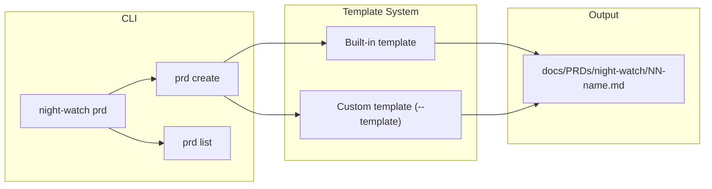
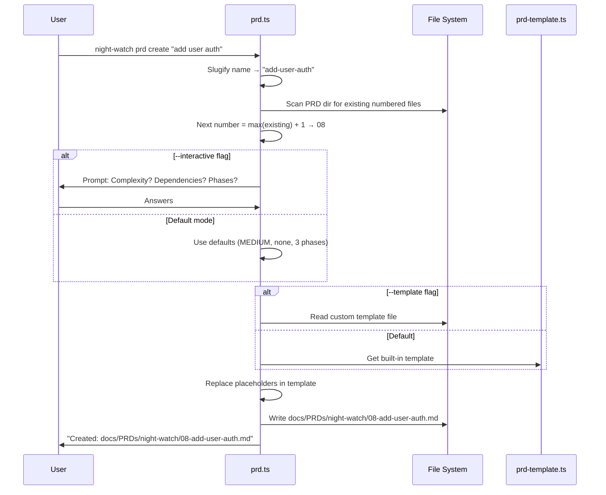

# PRD: PRD Templates & Generator

**Depends on:** `01-terminal-ui-polish.md`

**Complexity: 4 → MEDIUM mode**
- Touches 7 files (+2)
- New command + template system (+2)
- No complex state logic
- Single package
- No database changes
- No external API integration

---

## 1. Context

**Problem:** Creating a new PRD for Night Watch requires manually writing a markdown file with the correct structure — complexity scoring, dependency declarations, phases, acceptance criteria, etc. Users must either copy an existing PRD and modify it or write from scratch, often forgetting required sections or using inconsistent formatting.

**Files Analyzed:**
- `docs/PRDs/night-watch/*.md` — existing PRDs follow a consistent structure: title, depends on, complexity score, sections (Context, Solution, Sequence Flow, Execution Phases, Acceptance Criteria)
- `src/commands/init.ts` — uses `processTemplate()` pattern with string replacements for templates
- `src/cli.ts` — command registration pattern
- `src/config.ts` — `loadConfig()` for reading `prdDir`
- `src/constants.ts` — `DEFAULT_PRD_DIR`
- `src/utils/ui.ts` — colored output helpers
- `templates/` — existing template files (config, slash commands)
- `package.json` — no template engine dependency needed (simple string replacement works)

**Current Behavior:**
- No PRD generation capability — users create PRD files manually
- Existing PRDs have consistent structure but no formal template
- `init` command creates project scaffolding but not individual PRDs
- PRD directory is created by `init` but files within it are user-managed

### Integration Points Checklist

- **Entry point:** `night-watch prd create <name>` CLI subcommand
- **Caller file:** `src/cli.ts` — register `prd` command group
- **Registration:** Add `prdCommand(program)` call in `cli.ts`
- **User-facing:** YES — interactive command that creates a PRD file
- **Full user flow:**
  1. User runs `night-watch prd create "add user auth"` (or `night-watch prd create add-user-auth`)
  2. CLI prompts for optional metadata: complexity, dependencies, number of phases
  3. PRD file is created at `docs/PRDs/night-watch/NN-add-user-auth.md` with correct structure
  4. User sees confirmation with file path and next steps
  5. User edits the generated file to fill in implementation details

---

## 2. Solution

**Approach:**
- Create a `night-watch prd` command group with a `create` subcommand
- Use Commander.js nested commands: `program.command('prd')` with `.command('create')` and `.command('list')`
- Generate PRD files from a built-in template with placeholder sections
- Auto-number PRDs based on existing files in the PRD directory (next available `NN-` prefix)
- Support `--template <path>` flag for custom templates
- Add a `list` subcommand that lists PRDs (alias for the `prds` command from PRD 03, or standalone if PRD 03 isn't done yet)

**Architecture Diagram:**



**Key Decisions:**
- Built-in template embedded as a string constant in `src/templates/prd-template.ts` — not a file in `templates/` (since it's used at runtime, not during init)
- Slugify the name: `"Add User Auth"` → `add-user-auth` → `07-add-user-auth.md`
- Auto-numbering: scan existing PRDs for highest `NN-` prefix, increment. If no numbered files exist, start at `01`
- Interactive prompts using readline (same pattern as `init.ts` provider selection) — ask complexity, dependencies, phases only if `--interactive` flag is set. Without it, generate with sensible defaults
- `--template <path>` reads a custom markdown file and uses it instead of the built-in one. Placeholders in the template use `{{NAME}}`, `{{DEPENDS_ON}}`, `{{COMPLEXITY}}`, `{{DATE}}`, `{{PHASES}}` syntax
- `--no-number` flag to skip auto-numbering (creates `name.md` instead of `NN-name.md`)

**Data Changes:** None — creates files, doesn't modify config

---

## 3. Sequence Flow



---

## 4. Execution Phases

### Phase 1: Create built-in PRD template — Template string available for generation

**Files (2):**
- `src/templates/prd-template.ts` — NEW: built-in PRD template as a string constant
- `src/__tests__/templates/prd-template.test.ts` — NEW: template rendering tests

**Implementation:**
- [ ] Create `src/templates/prd-template.ts`:
  ```typescript
  export const PRD_TEMPLATE = `# PRD: {{TITLE}}

  {{DEPENDS_ON}}

  **Complexity: {{COMPLEXITY_SCORE}} → {{COMPLEXITY_LEVEL}} mode**
  {{COMPLEXITY_BREAKDOWN}}

  ---

  ## 1. Context

  **Problem:** <!-- Describe the problem in 1-2 sentences -->

  **Files Analyzed:**
  <!-- List files you've inspected -->

  **Current Behavior:**
  <!-- 3-5 bullets describing current state -->

  ### Integration Points Checklist

  - **Entry point:** <!-- route, event, cron, CLI command -->
  - **Caller file:** <!-- file that will invoke this new code -->
  - **Registration:** <!-- how new code connects to existing flows -->
  - **User-facing:** <!-- YES/NO -->
  - **Full user flow:**
    1. User does: <!-- action -->
    2. Triggers: <!-- code path -->
    3. Result: <!-- outcome -->

  ---

  ## 2. Solution

  **Approach:**
  <!-- 3-5 bullets explaining the chosen solution -->

  **Key Decisions:**
  <!-- Library choices, error handling strategy, reused utilities -->

  **Data Changes:** <!-- New schemas/migrations, or "None" -->

  ---

  ## 4. Execution Phases

  {{PHASES}}

  ---

  ## 5. Acceptance Criteria

  - [ ] <!-- criterion 1 -->
  - [ ] <!-- criterion 2 -->
  - [ ] All tests pass (\`npm test\`)
  `;

  export interface PrdTemplateVars {
    title: string;
    dependsOn: string[];
    complexityScore: number;
    complexityLevel: 'LOW' | 'MEDIUM' | 'HIGH';
    complexityBreakdown: string[];
    phaseCount: number;
  }

  export function renderPrdTemplate(vars: PrdTemplateVars, customTemplate?: string): string;
  ```
- [ ] Implement `renderPrdTemplate()`:
  - Replace `{{TITLE}}` with `vars.title`
  - Replace `{{DEPENDS_ON}}` with `**Depends on:** \`file1.md\`, \`file2.md\`` or empty if no deps
  - Replace `{{COMPLEXITY_SCORE}}` and `{{COMPLEXITY_LEVEL}}`
  - Replace `{{COMPLEXITY_BREAKDOWN}}` with bullet list
  - Replace `{{PHASES}}` with N phase stubs:
    ```
    ### Phase N: [Name] — [User-visible outcome]

    **Files (max 5):**
    - `src/path/file.ts` — what changes

    **Implementation:**
    - [ ] Step 1

    **Tests Required:**
    | Test File | Test Name | Assertion |
    |-----------|-----------|-----------|
    | `src/__tests__/feature.test.ts` | `should do X` | `expect(result).toBe(Y)` |

    **Verification:**
    - `npm test` passes
    ```

**Tests Required:**
| Test File | Test Name | Assertion |
|-----------|-----------|-----------|
| `src/__tests__/templates/prd-template.test.ts` | `should replace title placeholder` | output contains title |
| `src/__tests__/templates/prd-template.test.ts` | `should render dependency line` | output contains "Depends on:" with filenames |
| `src/__tests__/templates/prd-template.test.ts` | `should render N phase stubs` | output contains "Phase 1", "Phase 2", etc. |
| `src/__tests__/templates/prd-template.test.ts` | `should skip depends on when no deps` | no "Depends on" line |
| `src/__tests__/templates/prd-template.test.ts` | `should use custom template when provided` | output uses custom content |

**Verification:**
- `npm test` passes
- Template renders valid markdown with all sections

---

### Phase 2: Create prd command group with `create` subcommand — Users can generate PRD files

**Files (4):**
- `src/commands/prd.ts` — NEW: `prd` command group with `create` subcommand
- `src/cli.ts` — register `prd` command
- `src/__tests__/commands/prd.test.ts` — NEW: command tests
- `src/__tests__/cli.test.ts` — add help test for `prd` command

**Implementation:**
- [ ] Create `src/commands/prd.ts`:
  ```typescript
  export interface PrdCreateOptions {
    interactive: boolean;
    template?: string;
    deps?: string;
    phases?: string;
    noNumber: boolean;
  }

  export function prdCommand(program: Command): void {
    const prd = program
      .command('prd')
      .description('PRD management commands');

    prd
      .command('create <name>')
      .description('Generate a new PRD file from template')
      .option('-i, --interactive', 'Prompt for metadata interactively')
      .option('-t, --template <path>', 'Path to custom template file')
      .option('-d, --deps <files>', 'Comma-separated dependency PRD filenames')
      .option('-p, --phases <count>', 'Number of phases to generate', '3')
      .option('--no-number', 'Skip auto-numbering prefix')
      .action(async (name: string, options: PrdCreateOptions) => {
        // Implementation
      });
  }
  ```
- [ ] Implement slug generation:
  ```typescript
  function slugify(name: string): string {
    return name
      .toLowerCase()
      .replace(/[^a-z0-9]+/g, '-')
      .replace(/^-|-$/g, '');
  }
  ```
- [ ] Implement auto-numbering:
  ```typescript
  function getNextPrdNumber(prdDir: string): number {
    const files = fs.readdirSync(prdDir).filter(f => f.endsWith('.md') && f !== 'NIGHT-WATCH-SUMMARY.md');
    const numbers = files.map(f => {
      const match = f.match(/^(\d+)-/);
      return match ? parseInt(match[1], 10) : 0;
    });
    return Math.max(0, ...numbers) + 1;
  }
  ```
- [ ] Implement create action:
  - Load config to get `prdDir`
  - Slugify the name
  - Calculate next number (unless `--no-number`)
  - Build filename: `{NN}-{slug}.md` or `{slug}.md`
  - If `--interactive`, prompt for complexity (1-10), dependencies, phase count using readline
  - If `--template`, read custom template file
  - Render template with `renderPrdTemplate()`
  - Write file to PRD directory
  - Print success message with file path
- [ ] Register in `cli.ts`: `import { prdCommand } from './commands/prd.js'` + `prdCommand(program)`

**Tests Required:**
| Test File | Test Name | Assertion |
|-----------|-----------|-----------|
| `src/__tests__/commands/prd.test.ts` | `should slugify name correctly` | "Add User Auth" → "add-user-auth" |
| `src/__tests__/commands/prd.test.ts` | `should auto-number based on existing files` | next number is max + 1 |
| `src/__tests__/commands/prd.test.ts` | `should create PRD file in correct directory` | file exists at expected path |
| `src/__tests__/commands/prd.test.ts` | `should skip numbering with --no-number` | filename has no number prefix |
| `src/__tests__/commands/prd.test.ts` | `should parse --deps flag` | generated file contains dependency declaration |
| `src/__tests__/commands/prd.test.ts` | `should use custom template with --template` | output uses custom content |
| `src/__tests__/commands/prd.test.ts` | `should not overwrite existing file` | error when file already exists |
| `src/__tests__/cli.test.ts` | `should show prd command in help` | help output contains 'prd' |

**Verification:**
- `npx tsx src/cli.ts prd create "add user auth"` creates `docs/PRDs/night-watch/NN-add-user-auth.md`
- File contains correct structure with all sections
- `npx tsx src/cli.ts prd create "fix bug" --no-number` creates `fix-bug.md`
- `npx tsx src/cli.ts prd create "new feature" --deps "01-terminal-ui-polish.md" --phases 5` creates file with dependency and 5 phase stubs
- `npx tsx src/cli.ts prd --help` shows `create` subcommand
- `npm test` passes

---

### Phase 3: Add `prd list` subcommand and custom template support — Users can list PRDs and use custom templates

**Files (3):**
- `src/commands/prd.ts` — add `list` subcommand
- `src/__tests__/commands/prd.test.ts` — add list tests
- `templates/prd.md` — NEW: optional custom template example for documentation

**Implementation:**
- [ ] Add `list` subcommand to `prd.ts`:
  ```typescript
  prd
    .command('list')
    .description('List all PRDs with status')
    .option('--json', 'Output as JSON')
    .action(async (options: { json: boolean }) => {
      // Reuse logic from prds command (PRD 03) if available,
      // otherwise implement basic listing:
      // - Scan prdDir for .md files
      // - Scan prdDir/done for completed
      // - Display as table with name, status (pending/done)
    });
  ```
- [ ] Implement basic PRD listing (standalone, not dependent on PRD 03):
  - Read files from `prdDir` and `prdDir/done`
  - Parse dependencies from each file
  - Show table: `Name | Status | Dependencies`
  - Support `--json` flag
- [ ] Create `templates/prd.md` as a documented custom template example:
  ```markdown
  # PRD: {{TITLE}}

  {{DEPENDS_ON}}

  ## Problem
  <!-- What problem does this solve? -->

  ## Solution
  <!-- How will you solve it? -->

  ## Phases
  {{PHASES}}

  ## Acceptance Criteria
  - [ ] All tests pass
  ```
  This file serves as documentation for `--template` usage, included in the npm package.

**Tests Required:**
| Test File | Test Name | Assertion |
|-----------|-----------|-----------|
| `src/__tests__/commands/prd.test.ts` | `prd list should show pending PRDs` | output contains PRD filenames |
| `src/__tests__/commands/prd.test.ts` | `prd list should show done PRDs` | done PRDs appear |
| `src/__tests__/commands/prd.test.ts` | `prd list --json should output valid JSON` | JSON.parse succeeds |

**Verification:**
- `npx tsx src/cli.ts prd list` shows table of PRDs
- `npx tsx src/cli.ts prd list --json` outputs valid JSON
- `npx tsx src/cli.ts prd create "test" --template templates/prd.md` uses custom template
- `npm test` passes

---

## 5. Acceptance Criteria

- [ ] `night-watch prd create <name>` generates a correctly structured PRD file
- [ ] Auto-numbers based on existing PRDs (e.g., `08-feature-name.md`)
- [ ] `--no-number` flag skips auto-numbering
- [ ] `--deps <files>` adds dependency declaration to generated PRD
- [ ] `--phases <count>` controls number of phase stubs generated
- [ ] `--template <path>` supports custom template files with `{{PLACEHOLDER}}` syntax
- [ ] `-i, --interactive` flag prompts for complexity, dependencies, phase count
- [ ] `night-watch prd list` shows all PRDs with status
- [ ] Refuses to overwrite existing files (prints error with suggestion)
- [ ] `night-watch prd --help` shows subcommands
- [ ] Slugifies names: `"Add User Auth"` → `add-user-auth`
- [ ] All tests pass (`npm test`)
- [ ] No new npm dependencies (uses readline + string replacement)
