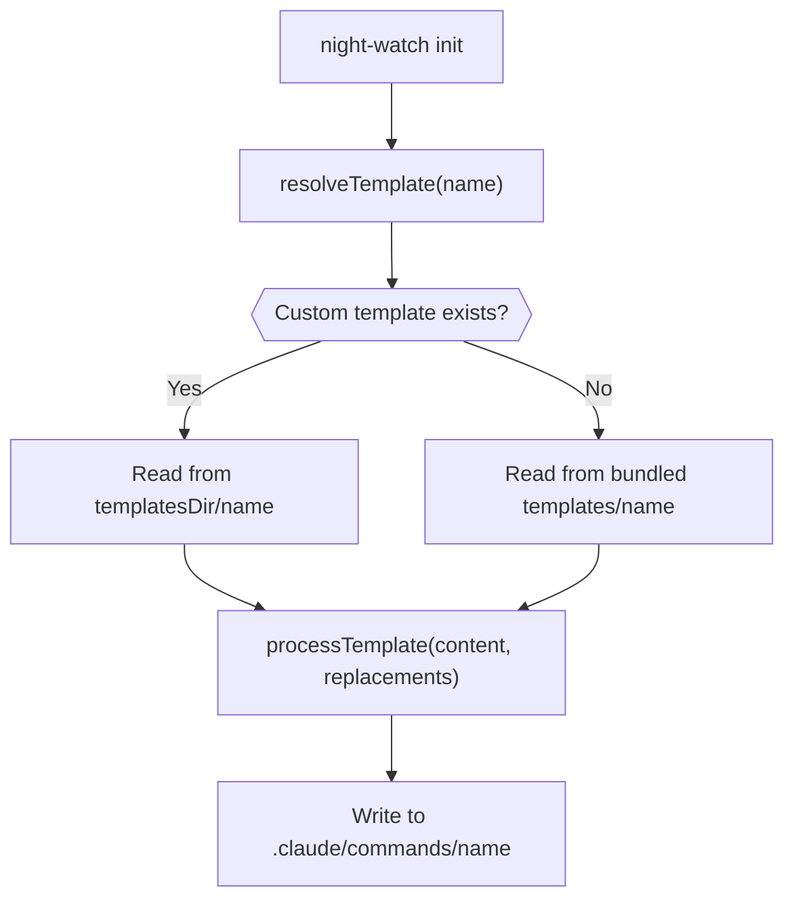

# PRD: Custom Templates Override

**Complexity: 5 → MEDIUM mode**

- +2 Touches 6-10 files (types, constants, config, init, config template, tests)
- +1 New config field with resolution logic
- +1 Per-file fallback merge strategy
- +1 Test coverage for all resolution paths

---

## Problem

Night Watch bundles hardcoded templates (`night-watch.md`, `prd-executor.md`, `night-watch-pr-reviewer.md`) that get copied to `.claude/commands/` during `night-watch init`. Users cannot customize these templates for their project's specific needs (e.g., different workflows, extra steps, project-specific conventions) without manually editing the generated files — which get overwritten on `init --force`.

## Solution

- Add a `templatesDir` config field that points to a directory containing custom template overrides (relative to project root).
- During `night-watch init`, resolve each template with a **per-file fallback** strategy: use the custom template if it exists, otherwise fall back to the bundled default.
- Custom templates support the same `${PROJECT_DIR}`, `${PROJECT_NAME}`, `${DEFAULT_BRANCH}` placeholder replacements as bundled templates.
- Partial overrides are supported — users can override just one template while keeping bundled defaults for the rest.

**Key Decisions:**

- Default `templatesDir`: `".night-watch/templates"` (project-local, easily gitignored or committed per team preference)
- Fallback: per-file, not all-or-nothing — missing custom templates silently fall back to bundled
- No new CLI flags needed — `templatesDir` is configured via `night-watch.config.json` or `NW_TEMPLATES_DIR` env var
- Init outputs which source was used per template (custom vs. bundled) for transparency

**Architecture:**

## Phases

#### Phase 1: Config & Types — Add `templatesDir` to config system

**Files (4):**

- `src/types.ts` — Add `templatesDir` field to `INightWatchConfig`
- `src/constants.ts` — Add `DEFAULT_TEMPLATES_DIR` constant
- `src/config.ts` — Parse `templatesDir` from config file and `NW_TEMPLATES_DIR` env var, merge into config
- `templates/night-watch.config.json` — Add `templatesDir` field to config template

**Implementation:**

- [ ] Add `templatesDir: string` to `INightWatchConfig` with JSDoc comment
- [ ] Add `DEFAULT_TEMPLATES_DIR = ".night-watch/templates"` to constants
- [ ] In `config.ts` `normalizeConfig()`: read `templatesDir` from `rawConfig.templatesDir` via `readString()`
- [ ] In `config.ts` `mergeConfigs()`: add `templatesDir` merge for both file and env layers
- [ ] In `config.ts` `loadConfig()`: add `NW_TEMPLATES_DIR` env var handling
- [ ] In `config.ts` `getDefaultConfig()`: include `templatesDir: DEFAULT_TEMPLATES_DIR`
- [ ] In config template: add `"templatesDir": ".night-watch/templates"` field

**Tests Required:**
| Test File | Test Name | Assertion |
|-----------|-----------|-----------|
| `src/__tests__/config.test.ts` | `should return default templatesDir` | `expect(config.templatesDir).toBe(".night-watch/templates")` |
| `src/__tests__/config.test.ts` | `should load templatesDir from config file` | Write config with custom path, verify it loads |
| `src/__tests__/config.test.ts` | `should handle NW_TEMPLATES_DIR env var` | Set env var, verify it overrides |
| `src/__tests__/config.test.ts` | `should let NW_TEMPLATES_DIR env var override config file` | Both set, env wins |

**Verification:**

- `yarn verify` passes
- `yarn test src/__tests__/config.test.ts` passes

---

#### Phase 2: Init Command — Template resolution with per-file fallback

**Files (2):**

- `src/commands/init.ts` — Add `resolveTemplatePath()` function, update `processTemplate()` to support custom source, update init flow to load config for `templatesDir`
- `src/__tests__/commands/init.test.ts` — Add tests for custom template resolution

**Implementation:**

- [ ] Add `resolveTemplatePath(templateName: string, customTemplatesDir: string | null, bundledTemplatesDir: string): { path: string; source: "custom" | "bundled" }` function
  - If `customTemplatesDir` is non-null and the file exists at `customTemplatesDir/templateName`, return `{ path, source: "custom" }`
  - Otherwise return `{ path: bundledTemplatesDir/templateName, source: "bundled" }`
- [ ] Update `processTemplate()` to accept an explicit `sourcePath` instead of always building from `TEMPLATES_DIR`
- [ ] In the init action:
  - Load existing config (if present) to get `templatesDir` — use `loadConfig(cwd)` to get the merged config, extract `templatesDir`
  - Resolve `customTemplatesDir` as absolute path: `path.join(cwd, config.templatesDir)` if dir exists, else `null`
  - For each template (`night-watch.md`, `prd-executor.md`, `night-watch-pr-reviewer.md`), call `resolveTemplatePath()` and log which source was used
- [ ] Update init output to show `(custom)` or `(bundled)` next to each template in the summary table

**Tests Required:**
| Test File | Test Name | Assertion |
|-----------|-----------|-----------|
| `src/__tests__/commands/init.test.ts` | `resolveTemplatePath should return custom path when file exists` | Create custom dir with file, verify source is "custom" |
| `src/__tests__/commands/init.test.ts` | `resolveTemplatePath should fall back to bundled when custom missing` | Custom dir exists but file doesn't, verify source is "bundled" |
| `src/__tests__/commands/init.test.ts` | `resolveTemplatePath should fall back to bundled when custom dir missing` | No custom dir at all, verify source is "bundled" |
| `src/__tests__/commands/init.test.ts` | `should use custom template when available during init` | Full init flow with custom template dir |

**Verification:**

- `yarn verify` passes
- `yarn test src/__tests__/commands/init.test.ts` passes
- Manual: create `.night-watch/templates/night-watch.md` in a test project, run `night-watch init --force`, verify the custom template is used

---

## Acceptance Criteria

- [ ] All phases complete
- [ ] All tests pass (`yarn test`)
- [ ] `yarn verify` passes
- [ ] `templatesDir` config field works via config file, env var, and defaults
- [ ] Custom templates are used when present, bundled templates used as fallback (per-file)
- [ ] Init output clearly shows which templates came from custom vs. bundled source
- [ ] Partial overrides work — override 1 template, other 2 use bundled defaults
