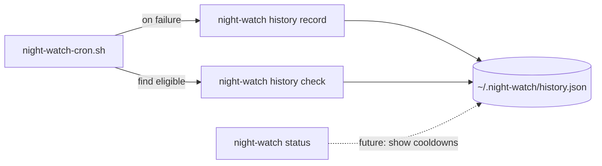
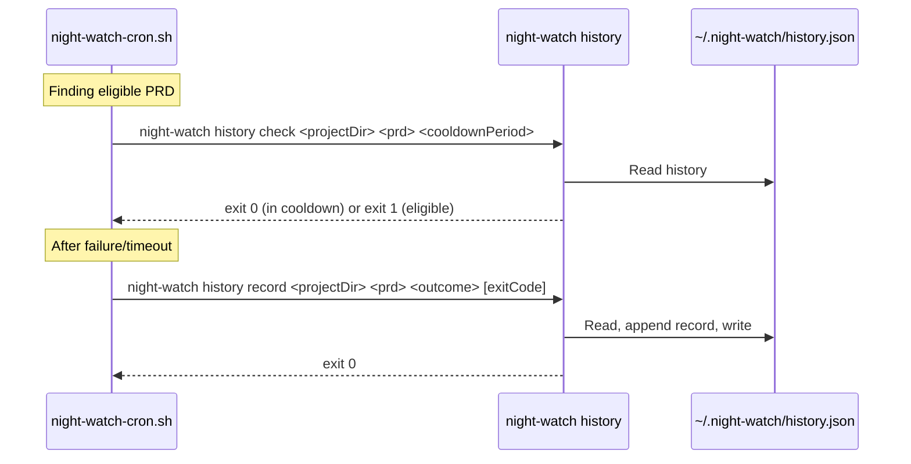

# PRD 16: Execution History Ledger

**Complexity: 5 → MEDIUM mode**

## 1. Context

**Problem:** The current cooldown mechanism uses fragile `.cooldown` sidecar files next to PRD `.md` files — they can be committed to git, accidentally deleted, or lost when PRDs move. We need a proper internal execution history ledger stored in `~/.night-watch/`, completely decoupled from PRD file paths.

**Files Analyzed:**
- `scripts/night-watch-helpers.sh` — current `set_cooldown()`, `is_in_cooldown()`, `find_eligible_prd()`
- `scripts/night-watch-cron.sh` — calls `set_cooldown` on failure/timeout
- `src/utils/registry.ts` — existing `~/.night-watch/projects.json` pattern
- `src/constants.ts` — file name constants
- `src/commands/run.ts` — `scanPrdDirectory()`, `buildEnvVars()`
- `src/utils/status-data.ts` — status snapshot (could surface cooldown state)
- `src/config.ts` — config loading

**Current Behavior:**
- On failure/timeout, `set_cooldown()` writes a `<prd>.md.cooldown` file containing a Unix timestamp into the PRD directory
- `is_in_cooldown()` reads that file and compares age to `maxRuntime` (default 7200s)
- `find_eligible_prd()` calls `is_in_cooldown()` and skips PRDs in cooldown
- These files live alongside PRDs and can be committed, deleted, or orphaned
- No execution history is tracked — only "is it currently in cooldown?"

## 2. Solution

**Approach:**
- Create a new `src/utils/execution-history.ts` module that reads/writes `~/.night-watch/history.json`
- The ledger stores per-project, per-PRD execution records: outcome, timestamp, exit code, attempt count
- Add a `night-watch history` CLI subcommand with `record` and `check` actions, callable from bash
- Replace bash `set_cooldown()`/`is_in_cooldown()` with calls to `night-watch history record` and `night-watch history check`
- Remove the `.cooldown` file mechanism entirely

**Architecture Diagram:**



**Key Decisions:**
- [x] Reuse `~/.night-watch/` directory (already exists for `projects.json`)
- [x] Reuse `NIGHT_WATCH_HOME` env var override from `registry.ts`
- [x] JSON format for simplicity and human readability
- [x] Key by project path + PRD filename for uniqueness
- [x] Keep only the last N records per PRD to prevent unbounded growth (max 10)
- [x] Cooldown period defaults to `maxRuntime` (passed as arg), same as current behavior

**Data Changes:** New file `~/.night-watch/history.json`

```json
{
  "/home/user/projects/my-app": {
    "03-feature.md": {
      "records": [
        {
          "timestamp": 1739750400,
          "outcome": "failure",
          "exitCode": 1,
          "attempt": 1
        }
      ]
    }
  }
}
```

Outcome values: `"success"` | `"failure"` | `"timeout"` | `"rate_limited"`

## 3. Sequence Flow



## 4. Execution Phases

### Phase 1: Execution History Module — TypeScript utility that reads/writes the ledger

**Files (max 5):**
- `src/utils/execution-history.ts` — new module: load, save, record, check cooldown
- `src/constants.ts` — add `HISTORY_FILE_NAME` constant
- `src/__tests__/utils/execution-history.test.ts` — unit tests

**Implementation:**
- [ ] Add `HISTORY_FILE_NAME = "history.json"` to `src/constants.ts`
- [ ] Create `src/utils/execution-history.ts` with:
  - `getHistoryPath(): string` — reuses `NIGHT_WATCH_HOME` / `GLOBAL_CONFIG_DIR` pattern from registry.ts
  - `loadHistory(): IExecutionHistory` — reads JSON, returns `{}` on missing/invalid
  - `saveHistory(history: IExecutionHistory): void` — writes JSON with `mkdirSync` + `writeFileSync`
  - `recordExecution(projectDir: string, prdFile: string, outcome: ExecutionOutcome, exitCode: number): void` — appends record, trims to max 10
  - `isInCooldown(projectDir: string, prdFile: string, cooldownPeriod: number): boolean` — checks last record timestamp vs now
  - `getLastExecution(projectDir: string, prdFile: string): IExecutionRecord | null` — returns most recent record
- [ ] Types: `ExecutionOutcome = "success" | "failure" | "timeout" | "rate_limited"`, `IExecutionRecord = { timestamp, outcome, exitCode, attempt }`, `IExecutionHistory = Record<string, Record<string, { records: IExecutionRecord[] }>>`

**Tests Required:**
| Test File | Test Name | Assertion |
|-----------|-----------|-----------|
| `src/__tests__/utils/execution-history.test.ts` | `should return empty history when file does not exist` | `expect(loadHistory()).toEqual({})` |
| | `should record execution and persist to file` | File contains the record after `recordExecution()` |
| | `should trim records to max 10 per PRD` | After 12 records, only 10 remain (oldest dropped) |
| | `should report in cooldown when last failure is recent` | `isInCooldown()` returns `true` |
| | `should report not in cooldown when last failure is old` | `isInCooldown()` returns `false` |
| | `should report not in cooldown when last record is success` | `isInCooldown()` returns `false` |
| | `should report not in cooldown when no history exists` | `isInCooldown()` returns `false` |
| | `should isolate projects by path` | Records for project A don't affect project B |

**User Verification:**
- Action: Run `yarn test src/__tests__/utils/execution-history.test.ts`
- Expected: All tests pass

---

### Phase 2: CLI Subcommand — `night-watch history` command callable from bash scripts

**Files (max 5):**
- `src/commands/history.ts` — new command: `record` and `check` subcommands
- `src/cli.ts` — register the history command
- `src/__tests__/commands/history.test.ts` — unit tests

**Implementation:**
- [ ] Create `src/commands/history.ts` with `historyCommand(program: Command)`:
  - `night-watch history record <projectDir> <prdFile> <outcome> [--exit-code <n>] [--attempt <n>]` — calls `recordExecution()`
  - `night-watch history check <projectDir> <prdFile> [--cooldown <seconds>]` — calls `isInCooldown()`, exits 0 if in cooldown, exits 1 if eligible
  - Both are silent (no stdout) for easy bash integration, errors go to stderr
- [ ] Register `historyCommand(program)` in `src/cli.ts`

**Tests Required:**
| Test File | Test Name | Assertion |
|-----------|-----------|-----------|
| `src/__tests__/commands/history.test.ts` | `should record execution via CLI` | Calling `record` writes to history file |
| | `should exit 0 when PRD is in cooldown` | `check` after recent failure exits 0 |
| | `should exit 1 when PRD is eligible` | `check` with no history exits 1 |

**User Verification:**
- Action: `night-watch history record /tmp/test-project test.md failure --exit-code 1 && echo "recorded"`
- Expected: Prints "recorded", history.json updated
- Action: `night-watch history check /tmp/test-project test.md --cooldown 7200; echo $?`
- Expected: Prints `0` (in cooldown)

---

### Phase 3: Bash Migration — Replace .cooldown with CLI calls

**Files (max 5):**
- `scripts/night-watch-helpers.sh` — remove `set_cooldown()`, `is_in_cooldown()`, `COOLDOWN_EXTENSION`; update `find_eligible_prd()` to call `night-watch history check`
- `scripts/night-watch-cron.sh` — replace `set_cooldown` calls with `night-watch history record`

**Implementation:**
- [ ] In `night-watch-helpers.sh`:
  - Remove `COOLDOWN_EXTENSION`, `set_cooldown()`, `is_in_cooldown()` functions
  - In `find_eligible_prd()`, replace `is_in_cooldown` call with:
    ```bash
    if night-watch history check "${PROJECT_DIR}" "${prd_file}" --cooldown "${max_runtime}" 2>/dev/null; then
      log "SKIP-PRD: ${prd_file} — in cooldown after recent failure"
      continue
    fi
    ```
  - `find_eligible_prd()` needs `PROJECT_DIR` as a new parameter (currently only takes `prd_dir` and `max_runtime`)
- [ ] In `night-watch-cron.sh`:
  - Replace `set_cooldown "${PRD_DIR}" "${ELIGIBLE_PRD}"` (line 199) with:
    ```bash
    night-watch history record "${PROJECT_DIR}" "${ELIGIBLE_PRD}" timeout --exit-code 124
    ```
  - Replace `set_cooldown "${PRD_DIR}" "${ELIGIBLE_PRD}"` (line 203) with:
    ```bash
    night-watch history record "${PROJECT_DIR}" "${ELIGIBLE_PRD}" failure --exit-code ${EXIT_CODE}
    ```
  - On success (line 193 area), also record success:
    ```bash
    night-watch history record "${PROJECT_DIR}" "${ELIGIBLE_PRD}" success --exit-code 0
    ```
  - Update `find_eligible_prd` call to pass `PROJECT_DIR`

**Tests Required:**
| Test File | Test Name | Assertion |
|-----------|-----------|-----------|
| Manual bash verification | `find_eligible_prd` skips PRDs in cooldown | PRD with recent failure record is skipped |
| Manual bash verification | Success is recorded | After successful run, history.json has success record |

**User Verification:**
- Action: `night-watch run --dry-run` (should work as before)
- Expected: No errors, no references to .cooldown files
- Action: Check `~/.night-watch/history.json` after a run
- Expected: Contains execution records keyed by project path

---

### Phase 4: Cleanup — Remove .cooldown references and verify

**Files (max 5):**
- `scripts/night-watch-helpers.sh` — verify no cooldown references remain
- `scripts/night-watch-cron.sh` — verify no cooldown references remain
- Any existing `.cooldown` files in PRD directories — delete them

**Implementation:**
- [ ] `grep -r "cooldown" scripts/` should return zero matches (except comments explaining the history mechanism)
- [ ] Remove any leftover `.cooldown` files: `find docs/PRDs -name "*.cooldown" -delete`
- [ ] Run `yarn verify` to ensure nothing is broken
- [ ] Run full test suite

**Tests Required:**
| Test File | Test Name | Assertion |
|-----------|-----------|-----------|
| Full suite | `yarn test` | All tests pass |
| Full suite | `yarn verify` | TypeScript compiles, lint passes |

**User Verification:**
- Action: `grep -r ".cooldown" scripts/ src/`
- Expected: No matches (only this PRD doc and history.json references)

## 5. Acceptance Criteria

- [ ] All phases complete
- [ ] All specified tests pass
- [ ] `yarn verify` passes
- [ ] `.cooldown` sidecar files are no longer created or read
- [ ] Execution history is stored in `~/.night-watch/history.json`
- [ ] Bash scripts use `night-watch history record/check` instead of file-based cooldown
- [ ] History records are capped at 10 per PRD to prevent unbounded growth
- [ ] `night-watch history check` exits 0 (in cooldown) / 1 (eligible) for bash `if` compatibility
- [ ] Cooldown only applies to non-success outcomes (success records don't trigger cooldown)
