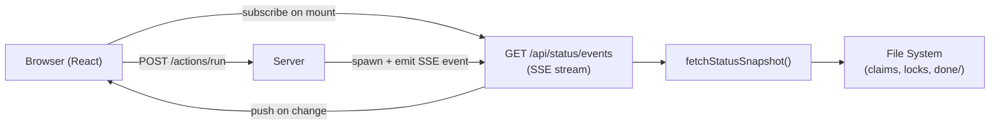
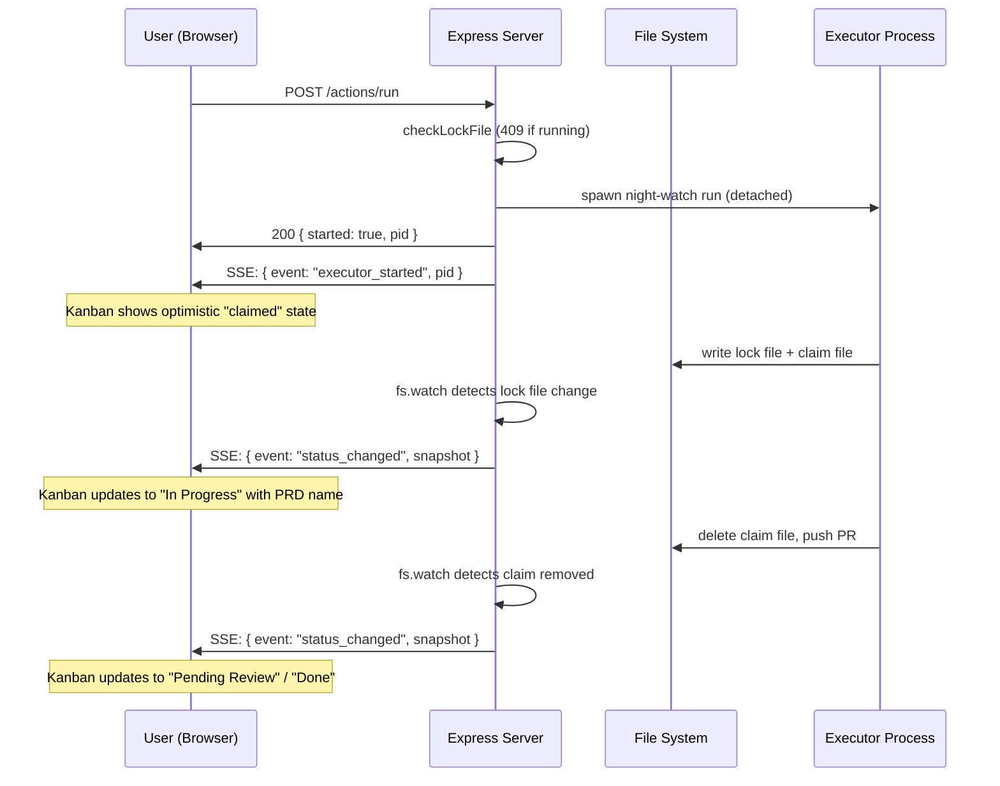

# PRD 20: Core App Flow Reliability & Real-Time UX

**Complexity: 9 → HIGH mode**

```text
COMPLEXITY SCORE (sum all that apply):
+3  Touches 10+ files
+2  Complex state logic / concurrency (SSE, polling, lock cross-validation)
+2  New system/module from scratch (SSE endpoint)
+2  Multi-package changes (server + web)
= 9 → HIGH
```

---

## 1. Context

**Problem:** The core execution flow has critical UX gaps: after clicking "Execute Now" nothing updates in the UI (no refetch, no real-time push), the executor status can show "Idle" while actually running, and a PRD can be stuck "In Progress" forever if the executor crashes — breaking the fundamental user trust in the system.

**Files Analyzed:**
- `web/pages/PRDs.tsx` — Execute Now, Retry handlers; zero polling
- `web/pages/Dashboard.tsx` — 10s polling; cancel handler missing post-action refetch
- `web/api.ts` — `useApi` hook, all fetch functions; no SSE client
- `src/server/index.ts` — `handleSpawnAction`, all routes; no SSE endpoint
- `src/utils/status-data.ts` — `collectPrdInfo`, `checkLockFile`, `fetchStatusSnapshot`
- `scripts/night-watch-helpers.sh` — `acquire_lock`, `claim_prd`, `is_claimed`
- `src/constants.ts` — lock file paths

**Current Behavior:**
- `handleExecuteNow` in `PRDs.tsx:66` shows a toast but never calls `refetch()` — kanban stays stale
- `PRDs.tsx` has no polling at all; list only refreshes on navigation
- `Dashboard.tsx` polls every 10s (`useEffect` with `setInterval`) but `PRDs.tsx` never polls
- `collectPrdInfo` at `status-data.ts:292` marks a PRD "in-progress" based solely on claim file age — no cross-check with the executor lock file; a crashed executor leaves the PRD stuck
- No SSE or WebSocket endpoint exists; all state is pull-only
- No way to force-clear a stale executor lock from the UI

---

## 2. Solution

**Approach:**
- **Phase 1** — Immediate refetch after every action + add polling to PRDs page. Zero infrastructure change; fixes the reported issue in minutes.
- **Phase 2** — Server-Sent Events (SSE) endpoint on the server; replace polling with push. Both Dashboard and PRDs subscribe to a single `/api/status/events` stream.
- **Phase 3** — Fix in-progress detection by cross-validating claim file with executor lock file. Expose `activePrd` in status snapshot so the UI can show which PRD is being worked on.
- **Phase 4** — Force-clear stale lock button + window-focus refetch. Recovery path for crashed executors.

**Architecture:**



**Key Decisions:**
- [x] SSE over WebSocket — unidirectional is enough; no additional library needed; works through proxies
- [x] Server watches lock files + claim files with `fs.watch` / interval diff to detect state changes and push SSE events
- [x] In-progress cross-validation: a PRD is "in-progress" only if claim file is fresh AND executor lock file PID matches claim PID
- [x] `activePrd` field added to `IStatusSnapshot` — derived from claim files at read time
- [x] Polling kept as fallback (30s) in case SSE drops; SSE is the fast path

---

## 3. Sequence Flow



---

## 4. Execution Phases

---

### Phase 1: Immediate Post-Action Refetch + PRDs Polling

**User-visible outcome:** Clicking "Execute Now", "Retry", or "Cancel" immediately triggers a refetch; the PRDs list auto-refreshes every 5 seconds.

**Files (max 5):**
- `web/pages/PRDs.tsx` — add `refetch()` calls after execute/retry; add 5s polling `useEffect`
- `web/pages/Dashboard.tsx` — add `refetch()` after cancel; reduce poll from 10s → 5s; add window focus refetch

**Implementation:**

- [ ] In `PRDs.tsx::handleExecuteNow` (line 66): call `refetch()` inside the `try` block after `addToast()` on success
- [ ] In `PRDs.tsx::handleRetry` (line 37): already calls `refetch()` — verify it also closes the slide-over to prevent stale `selectedPRD`
- [ ] In `PRDs.tsx`: add polling `useEffect`:
  ```tsx
  React.useEffect(() => {
    const id = setInterval(() => refetch(), 5000);
    return () => clearInterval(id);
  }, [refetch]);
  ```
- [ ] In `PRDs.tsx`: add window-focus refetch:
  ```tsx
  React.useEffect(() => {
    const onFocus = () => refetch();
    window.addEventListener('focus', onFocus);
    return () => window.removeEventListener('focus', onFocus);
  }, [refetch]);
  ```
- [ ] In `Dashboard.tsx::handleCancelProcess` (line 71): call `refetch()` unconditionally in `finally` block (not only on `allOk`)
- [ ] In `Dashboard.tsx` polling `useEffect` (line 32): change interval from `10000` → `5000`
- [ ] In `Dashboard.tsx`: add window-focus refetch (same pattern as PRDs.tsx)
- [ ] In `PRDs.tsx`: when `selectedPRD` is open and its status changes in the fetched list, update `selectedPRD` to the latest version:
  ```tsx
  React.useEffect(() => {
    if (selectedPRD) {
      const updated = prds.find(p => p.name === selectedPRD.name);
      if (updated) setSelectedPRD(updated);
    }
  }, [prds]);
  ```

**Tests Required:**
| Test File | Test Name | Assertion |
|-----------|-----------|-----------|
| `src/__tests__/commands/run.test.ts` | `refetch called after handleExecuteNow succeeds` | `refetch` spy called once |
| `src/__tests__/commands/run.test.ts` | `refetch called after cancel regardless of allOk` | `refetch` spy called in finally |

**Verification Plan:**
1. `yarn verify`
2. Manual: click "Execute Now" → PRD row changes to "In Progress" within 5s without page reload
3. Manual: leave tab, executor completes → return to tab → kanban updates immediately (focus event)

---

### Phase 2: Server-Sent Events (SSE) for Real-Time Push

**User-visible outcome:** Kanban and process status update in real-time (sub-second) after any state change — no polling lag.

**Files (max 5):**
- `src/server/index.ts` — add `GET /api/status/events` SSE endpoint + state-change watcher
- `web/api.ts` — add `useStatusStream` hook (SSE client)
- `web/pages/Dashboard.tsx` — subscribe to SSE stream; keep 30s polling as fallback
- `web/pages/PRDs.tsx` — subscribe to SSE stream; keep 30s polling as fallback

**Implementation:**

**Server (`src/server/index.ts`):**

- [ ] Add SSE client registry in `createApp` / `createGlobalApp`:
  ```ts
  const sseClients = new Set<Response>();
  ```
- [ ] Add `broadcastSSE(event: string, data: unknown)` helper:
  ```ts
  function broadcastSSE(event: string, data: unknown): void {
    const msg = `event: ${event}\ndata: ${JSON.stringify(data)}\n\n`;
    for (const client of sseClients) {
      try { client.write(msg); } catch { sseClients.delete(client); }
    }
  }
  ```
- [ ] Add SSE endpoint:
  ```ts
  app.get("/api/status/events", (req, res) => {
    res.setHeader("Content-Type", "text/event-stream");
    res.setHeader("Cache-Control", "no-cache");
    res.setHeader("Connection", "keep-alive");
    res.flushHeaders();
    sseClients.add(res);
    // Send current snapshot immediately on connect
    const snapshot = fetchStatusSnapshot(projectDir, config);
    res.write(`event: status_changed\ndata: ${JSON.stringify(snapshot)}\n\n`);
    req.on("close", () => sseClients.delete(res));
  });
  ```
- [ ] Add file watcher for lock files and claim directory to broadcast on changes:
  ```ts
  // Watch lock files and PRD dir for changes
  function watchStateFiles(projectDir: string, config: INightWatchConfig): void {
    const lockDir = path.dirname(executorLockPath(projectDir));
    const prdDir = path.join(projectDir, config.prdDir);
    let debounceTimer: ReturnType<typeof setTimeout> | null = null;
    const emitChange = () => {
      if (debounceTimer) clearTimeout(debounceTimer);
      debounceTimer = setTimeout(() => {
        const snapshot = fetchStatusSnapshot(projectDir, config);
        broadcastSSE("status_changed", snapshot);
      }, 300); // 300ms debounce
    };
    // Watch /tmp for lock file changes (if accessible) — use polling fallback
    setInterval(emitChange, 2000); // 2s server-side poll as SSE trigger
  }
  ```
  > Note: Watching `/tmp` is unreliable across OS/containers. Use a 2s interval to compute diffs and only broadcast when state actually changed (compare previous snapshot hash).
- [ ] Replace the naive interval with a diff-based emitter — store last snapshot as JSON string, only broadcast when it changes:
  ```ts
  let lastSnapshotHash = "";
  setInterval(() => {
    const snapshot = fetchStatusSnapshot(projectDir, config);
    const hash = JSON.stringify({ processes: snapshot.processes, prds: snapshot.prds.map(p => ({n:p.name,s:p.status})) });
    if (hash !== lastSnapshotHash) {
      lastSnapshotHash = hash;
      broadcastSSE("status_changed", snapshot);
    }
  }, 2000);
  ```
- [ ] Call `broadcastSSE("executor_started", { pid })` immediately after successful spawn in `handleSpawnAction`
- [ ] In global mode router, apply same SSE endpoint at `/api/projects/:projectId/status/events`

**Client (`web/api.ts`):**

- [ ] Add `useStatusStream` hook:
  ```ts
  export function useStatusStream(
    onSnapshot: (snapshot: IStatusSnapshot) => void,
    deps: DependencyList = []
  ): void {
    useEffect(() => {
      const url = apiPath('/api/status/events');
      const es = new EventSource(url);
      es.addEventListener('status_changed', (e) => {
        try { onSnapshot(JSON.parse(e.data)); } catch {}
      });
      es.onerror = () => { /* SSE reconnects automatically */ };
      return () => es.close();
    }, deps);
  }
  ```

**Dashboard (`web/pages/Dashboard.tsx`):**

- [ ] Import and call `useStatusStream`:
  ```tsx
  useStatusStream((snapshot) => {
    // Update data directly — bypass polling
    setStreamedStatus(snapshot);
  }, [selectedProjectId]);
  ```
- [ ] Merge `streamedStatus` with polled `status` (SSE wins when present)
- [ ] Reduce polling interval from 5s → 30s (SSE is the fast path; polling is fallback)

**PRDs (`web/pages/PRDs.tsx`):**

- [ ] Import and call `useStatusStream` to refresh PRD list when snapshot arrives
- [ ] On `status_changed` event: call `refetch()` (re-fetches `/api/prds` to get full content)
- [ ] Reduce polling interval from 5s → 30s

**Tests Required:**
| Test File | Test Name | Assertion |
|-----------|-----------|-----------|
| `src/__tests__/server/sse.test.ts` | `GET /api/status/events returns SSE headers` | `content-type: text/event-stream` |
| `src/__tests__/server/sse.test.ts` | `broadcasts status_changed when PRD claim appears` | event received by mock client |
| `src/__tests__/server/sse.test.ts` | `executor_started event emitted after spawn` | event received with pid |

**Verification Plan:**
1. `yarn verify && yarn test src/__tests__/server/sse.test.ts`
2. `curl -N http://localhost:7575/api/status/events` — should stream events
3. Manual: trigger executor → kanban updates within 2s

---

### Phase 3: Reliable In-Progress Detection + Active PRD in UI

**User-visible outcome:** A PRD is never stuck "In Progress" after a crash. The executor status card shows the name of the PRD currently being implemented.

**Files (max 5):**
- `src/utils/status-data.ts` — fix `collectPrdInfo` in-progress check; add `activePrd` to snapshot
- `src/server/index.ts` — add `POST /api/actions/clear-lock` endpoint
- `web/pages/Dashboard.tsx` — show `activePrd` name in executor row; show "Force Clear" button on stale lock
- `web/api.ts` — add `triggerClearLock()` function

**Implementation:**

**`src/utils/status-data.ts`:**

- [ ] Fix `collectPrdInfo` in-progress detection (line 287): cross-validate claim file with executor lock file:
  ```ts
  if (fs.existsSync(claimPath)) {
    try {
      const content = fs.readFileSync(claimPath, "utf-8");
      const claimData = JSON.parse(content);
      const age = Math.floor(Date.now() / 1000) - claimData.timestamp;
      if (age < maxRuntime) {
        // Cross-check: verify executor lock exists and PID matches
        const lockPath = executorLockPath(projectDir);
        const lock = checkLockFile(lockPath);
        status = lock.running ? "in-progress" : "ready";
        // Clean up orphaned claim file if executor is not running
        if (!lock.running) {
          try { fs.unlinkSync(claimPath); } catch {}
        }
      }
      // else: stale claim — status stays "ready"
    } catch {
      status = "ready";
    }
  }
  ```
- [ ] Add `activePrd: string | null` to `IStatusSnapshot` interface
- [ ] In `fetchStatusSnapshot`: derive `activePrd` from claim files:
  ```ts
  // Find any PRD with a fresh, lock-corroborated claim
  const activePrd = prds.find(p => p.status === "in-progress")?.name ?? null;
  ```
- [ ] Return `activePrd` in the snapshot object

**`src/server/index.ts`:**

- [ ] Add clear-lock endpoint:
  ```ts
  app.post("/api/actions/clear-lock", (_req, res) => {
    const lockPath = executorLockPath(projectDir);
    const lock = checkLockFile(lockPath);
    if (lock.running) {
      res.status(409).json({ error: "Executor is actively running — use Stop instead" });
      return;
    }
    try {
      if (fs.existsSync(lockPath)) fs.unlinkSync(lockPath);
      // Also clean up any orphaned claim files
      const prdDir = path.join(projectDir, config.prdDir);
      // claim cleanup is handled by collectPrdInfo on next status fetch
      broadcastSSE("status_changed", fetchStatusSnapshot(projectDir, config));
      res.json({ cleared: true });
    } catch (err) {
      res.status(500).json({ error: String(err) });
    }
  });
  ```
- [ ] Add same route in global mode router

**`web/api.ts`:**

- [ ] Add `triggerClearLock()`:
  ```ts
  export function triggerClearLock(): Promise<{ cleared: boolean }> {
    return apiFetch(apiPath('/api/actions/clear-lock'), { method: 'POST' });
  }
  ```

**`web/pages/Dashboard.tsx`:**

- [ ] Show `activePrd` in executor status row:
  ```tsx
  <div className="text-xs text-slate-500">
    {executorProcess?.running
      ? `PID: ${executorProcess.pid} • ${status.activePrd ?? 'Running'}`
      : 'Idle'
    }
  </div>
  ```
- [ ] Add "Force Clear" button that only appears when `!executorProcess?.running` but a PRD is stuck in "in-progress":
  ```tsx
  {!executorProcess?.running && inProgressPrds.length > 0 && (
    <Button size="sm" variant="ghost" className="text-amber-400 hover:text-amber-300"
      onClick={handleForceClear}>
      Force Clear
    </Button>
  )}
  ```
- [ ] Implement `handleForceClear`:
  ```tsx
  const handleForceClear = async () => {
    try {
      await triggerClearLock();
      addToast({ title: 'Lock Cleared', message: 'Stale executor state removed', type: 'success' });
      refetch();
    } catch (err) {
      addToast({ title: 'Clear Failed', message: String(err), type: 'error' });
    }
  };
  ```

**Tests Required:**
| Test File | Test Name | Assertion |
|-----------|-----------|-----------|
| `src/__tests__/utils/status-data.test.ts` | `marks PRD ready when claim exists but lock is gone` | `status === "ready"` |
| `src/__tests__/utils/status-data.test.ts` | `marks PRD in-progress when claim AND lock both exist` | `status === "in-progress"` |
| `src/__tests__/utils/status-data.test.ts` | `deletes orphaned claim file when lock is gone` | claim file deleted |
| `src/__tests__/utils/status-data.test.ts` | `activePrd is set when executor running` | `snapshot.activePrd === "my-prd"` |
| `src/__tests__/server/actions.test.ts` | `POST /api/actions/clear-lock returns 409 when running` | status 409 |
| `src/__tests__/server/actions.test.ts` | `POST /api/actions/clear-lock removes stale lock` | lock file deleted |

**Verification Plan:**
1. `yarn verify && yarn test src/__tests__/utils/status-data.test.ts src/__tests__/server/actions.test.ts`
2. Manual: start executor, kill bash PID manually → PRD immediately returns to "Ready" on next poll
3. Manual: executor status row shows PRD name while running (e.g., "PID: 1234 • PRDs-web-ui")

---

### Phase 4: Optimistic UI + Execute-Now Targets Specific PRD

**User-visible outcome:** Clicking "Execute Now" on a PRD instantly shows it as "Claimed/Starting" in the kanban. The action is wired to pass a priority hint so the selected PRD is executed next, not just the alphabetically-first eligible PRD.

**Files (max 5):**
- `src/server/index.ts` — accept optional `prdName` in `POST /api/actions/run` body; set `NW_PRD_PRIORITY` env var
- `web/pages/PRDs.tsx` — pass PRD name in execute request; show optimistic "starting" state
- `web/api.ts` — update `triggerRun` to accept optional `prdName`
- `web/pages/Dashboard.tsx` — minor: update type for new `activePrd` field in status type

**Implementation:**

**`src/server/index.ts` — update `handleSpawnAction`:**

- [ ] Read optional `prdName` from request body:
  ```ts
  function handleSpawnAction(projectDir: string, command: string[], req: Request, res: Response): void {
    const prdName = command[0] === "run" ? (req.body?.prdName as string | undefined) : undefined;
    // ... existing lock check ...
    const extraEnv: NodeJS.ProcessEnv = {};
    if (prdName) {
      extraEnv.NW_PRD_PRIORITY = prdName; // bash script respects NW_PRD_PRIORITY
    }
    const child = spawn("night-watch", command, {
      detached: true,
      stdio: "ignore",
      cwd: projectDir,
      env: { ...process.env, ...extraEnv },
    });
    // ...
  }
  ```

**`web/api.ts` — update `triggerRun`:**

- [ ] Accept optional `prdName`:
  ```ts
  export function triggerRun(prdName?: string): Promise<ActionResult> {
    return apiFetch<ActionResult>(apiPath('/api/actions/run'), {
      method: 'POST',
      headers: { 'Content-Type': 'application/json' },
      body: prdName ? JSON.stringify({ prdName }) : undefined,
    });
  }
  ```

**`web/pages/PRDs.tsx` — optimistic update:**

- [ ] Pass `selectedPRD.name` to `triggerRun`:
  ```tsx
  const result = await triggerRun(selectedPRD.name);
  ```
- [ ] Add optimistic state: immediately mark the PRD as "in-progress" in local state while waiting for server confirmation:
  ```tsx
  // Optimistically mark as in-progress
  const handleExecuteNow = async () => {
    if (!selectedPRD) return;
    setIsExecuting(true);
    // Optimistic UI update
    setOptimisticStatus(prev => ({ ...prev, [selectedPRD.name]: 'in-progress' }));
    try {
      const result = await triggerRun(selectedPRD.name);
      addToast({ title: 'Executor Started', message: `PID ${result.pid}`, type: 'success' });
      refetch(); // Will confirm or correct the optimistic state
    } catch (err) {
      // Revert optimistic state on error
      setOptimisticStatus(prev => { const s = {...prev}; delete s[selectedPRD.name]; return s; });
      addToast({ title: 'Executor Failed', message: String(err), type: 'error' });
    } finally {
      setIsExecuting(false);
    }
  };
  ```
- [ ] Add `optimisticStatus` state: `const [optimisticStatus, setOptimisticStatus] = useState<Record<string, string>>({});`
- [ ] Merge optimistic status into displayed PRD list:
  ```tsx
  const displayPrds = prds.map(p =>
    optimisticStatus[p.name] ? { ...p, status: optimisticStatus[p.name] as IPrdInfo['status'] } : p
  );
  ```
- [ ] Clear optimistic state when `prds` data arrives (after refetch confirms real state)

**Tests Required:**
| Test File | Test Name | Assertion |
|-----------|-----------|-----------|
| `src/__tests__/server/actions.test.ts` | `POST /api/actions/run with prdName sets NW_PRD_PRIORITY env` | spawn called with correct env |
| `src/__tests__/commands/run.test.ts` | `triggerRun passes prdName in body` | fetch body contains prdName |

**Verification Plan:**
1. `yarn verify && yarn test`
2. Manual: click "Execute Now" on `enhance-settings.md` → kanban immediately shows it as "In Progress" (optimistic); executor picks it up next (priority)
3. Manual: open two browser tabs → execute from tab A → tab B updates within 2s via SSE

---

## 5. Acceptance Criteria

- [ ] All phases complete
- [ ] All specified tests pass
- [ ] `yarn verify` passes
- [ ] All automated checkpoint reviews passed
- [ ] Clicking "Execute Now" immediately shows the PRD as "In Progress" (optimistic update within 0ms, server confirmation within 5s)
- [ ] Kanban and process status update in real-time via SSE (no manual refresh needed)
- [ ] A crashed executor does not leave PRDs stuck in "In Progress" — next status fetch auto-cleans orphaned claims
- [ ] Executor status row shows which PRD is actively being implemented
- [ ] "Execute Now" on a specific PRD causes that PRD to be picked next (not just alphabetically-first)
- [ ] "Force Clear" button visible and functional when executor is idle but a PRD is stuck
- [ ] Window focus triggers immediate refetch (no stale state after switching tabs)
- [ ] `yarn verify && yarn test` passes after all phases
