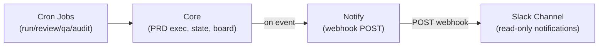

# PRD: Slack Cleanup — Strip Multi-Agent Deliberation, Keep Notifications

**Complexity: 8 → HIGH mode**

```text
COMPLEXITY SCORE:
+3  Touches 10+ files (20+ files deleted/modified across 4 packages)
+2  Multi-package changes (slack, core, server, web)
+2  Complex state logic (DI container, DB migrations, type exports)
+1  Database schema changes (drop slack_discussions table)
= 8 → HIGH
```

---

## 1. Context

**Problem:** The Slack multi-agent deliberation system (~5,900 lines in `packages/slack`, plus ~1,200 lines of Slack-coupled code in core, server routes, and web UI) adds significant complexity without delivering proportional value. Agents are too random and verbose. The core CLI (cron-driven PRD execution, PR review, QA, audits) is the real value — Slack should be reduced to a simple notification channel.

**Files Analyzed:**

Backend:

- `packages/slack/src/` — 20+ source files, 5,869 lines (deliberation, interaction listener, trigger router, consensus, proactive loop, job spawner, AI tools, personas, humanizer, etc.)
- `packages/slack/src/__tests__/` — 17 test files, 8,236 lines
- `packages/core/src/storage/repositories/sqlite/slack-discussion.repository.ts` — 173 lines
- `packages/core/src/storage/repositories/sqlite/agent-persona.repository.ts` — 460 lines (KEEP — used by soul compiler)
- `packages/core/src/storage/repositories/sqlite/agent-persona.defaults.ts` — 623 lines (KEEP)
- `packages/core/src/storage/repositories/interfaces.ts` — ISlackDiscussionRepository interface
- `packages/core/src/shared/types.ts` — ISlackDiscussion, IDiscussionTrigger, TriggerType, DiscussionStatus, ConsensusResult types
- `packages/core/src/storage/sqlite/migrations.ts` — slack_discussions table creation
- `packages/core/src/di/container.ts` — SlackDiscussionRepository registration
- `packages/core/src/constants.ts` — DEFAULT_SLACK_BOT_CONFIG
- `packages/server/src/routes/slack.routes.ts` — 99 lines (channel CRUD endpoints)
- `packages/server/src/routes/discussion.routes.ts` — 69 lines
- `packages/server/src/index.ts` — createSlackStack, listener.start(), graceful shutdown integration

Web UI:

- `web/pages/Integrations.tsx` — Full Slack setup wizard (bot/app token stepper, manifest copy, channel creation)
- `web/pages/Settings.tsx` — Slack config section in global settings form
- `web/api.ts` — fetchSlackChannels, createSlackChannel exports, ISlackChannel type
- `web/App.tsx` — `/integrations` route

**Current Behavior:**

- Server startup creates a full SlackStack (client → deliberation engine → interaction listener) per project
- Socket Mode listener handles @mentions, routes to trigger handlers, spawns multi-round deliberation threads
- Proactive loop posts AI-generated idle messages every 20 min
- Consensus evaluator determines approved/changes_requested/human_needed outcomes
- Job spawner streams run/review/qa/audit output back to Slack threads
- Web UI has a dedicated Integrations page for Slack token setup and channel management

---

## 2. Solution

**Approach:**

- **Delete** the entire `packages/slack` package — all 20+ source files and 17 test files
- **Remove** Slack-coupled code from core: discussion repository, discussion types, discussion migration, DI registration
- **Remove** Slack-specific server routes (`slack.routes.ts`, `discussion.routes.ts`) and server startup Slack integration
- **Keep** existing webhook notification system in core (`packages/core/src/utils/notify.ts`) which already supports Slack webhooks — this is the simple notification path
- **Keep** agent personas in core — they're useful for the soul compiler / AI provider prompts, independent of Slack
- **Simplify** the web UI: remove Integrations page, clean Slack references from Settings
- **Keep** `ISlackBotConfig` in types but simplify to just `{ enabled: boolean; webhookUrl: string }` for the notification webhook

**Architecture (after cleanup):**



**Key Decisions:**

- [x] Delete entire slack package rather than refactoring — the deliberation/interaction/consensus architecture is the problem, not a fixable detail
- [x] Keep webhook-based notifications (already exist in `packages/core/src/utils/notify.ts`) as the Slack communication path
- [x] Keep persona system in core — it powers AI prompt compilation independent of Slack
- [x] Remove `slack_discussions` DB table via migration — no data worth preserving
- [x] Simplify `ISlackBotConfig` to webhook-only config

**Data Changes:**

- Drop `slack_discussions` table (add migration)
- Drop `slack_channel_id` column from `projects` table (add migration)
- Simplify `ISlackBotConfig` type → `{ enabled: boolean; webhookUrl: string }`

---

## 3. Integration Points Checklist

```markdown
**How will this feature be reached?**

- [x] Entry point: existing notification webhooks in core (already wired into cron scripts)
- [x] Caller: night-watch-helpers.sh already calls notify on run_started, run_succeeded, etc.
- [x] Registration: no new wiring needed — removing wiring for deleted code

**Is this user-facing?**

- [x] YES → Web UI changes: remove Integrations page, simplify Settings Slack section
- [x] YES → CLI: `serve` command no longer starts Socket Mode listener

**Full user flow (after cleanup):**

1. User configures Slack webhook URL in Settings page or nightwatch.config.json
2. Cron jobs run as usual (run/review/qa/audit)
3. On events (started, succeeded, failed), webhook POST sends formatted notification to Slack channel
4. No interactive agent responses — just clean status updates
```

---

## 4. Execution Phases

### Phase 1: Delete packages/slack — Remove the entire Slack package

**Files:**

- `packages/slack/` — DELETE entire directory (source + tests)
- `packages/slack/package.json` — DELETE
- Root `package.json` — Remove `@night-watch/slack` from workspaces if referenced
- `turbo.json` — Remove any slack-specific pipeline entries

**Implementation:**

- [ ] Delete the `packages/slack/` directory entirely
- [ ] Remove `@night-watch/slack` from workspace references in root `package.json`
- [ ] Remove any `@night-watch/slack` entries from `turbo.json`
- [ ] Run `yarn install` to update lockfile

**Tests Required:**
| Test File | Test Name | Assertion |
|-----------|-----------|-----------|
| N/A | Build check | `yarn verify` passes without slack package |

**User Verification:**

- Action: `yarn verify`
- Expected: Build succeeds, no unresolved `@night-watch/slack` imports

---

### Phase 2: Clean core — Remove Slack-coupled types, repo, migration, DI

**Files (max 5):**

- `packages/core/src/storage/repositories/sqlite/slack-discussion.repository.ts` — DELETE
- `packages/core/src/storage/repositories/interfaces.ts` — Remove ISlackDiscussionRepository
- `packages/core/src/shared/types.ts` — Remove ISlackDiscussion, IDiscussionTrigger, TriggerType, DiscussionStatus, ConsensusResult; simplify ISlackBotConfig
- `packages/core/src/storage/sqlite/migrations.ts` — Add migration to drop `slack_discussions` table and `projects.slack_channel_id` column
- `packages/core/src/di/container.ts` — Remove SlackDiscussionRepository registration

**Implementation:**

- [ ] Delete `slack-discussion.repository.ts`
- [ ] Remove `ISlackDiscussionRepository` from `interfaces.ts` and its exports
- [ ] Remove from `shared/types.ts`: `ISlackDiscussion`, `IDiscussionTrigger`, `TriggerType`, `DiscussionStatus`, `ConsensusResult` types
- [ ] Simplify `ISlackBotConfig` to `{ enabled: boolean; webhookUrl: string }`
- [ ] Add a new migration that drops `slack_discussions` table and the `slack_channel_id` column from `projects`
- [ ] Remove `SlackDiscussionRepository` and `ISlackDiscussionRepository` from DI container
- [ ] Update `packages/core/src/constants.ts` — simplify `DEFAULT_SLACK_BOT_CONFIG`
- [ ] Remove any barrel exports of deleted types from `index.ts` files
- [ ] Update `packages/core/src/utils/registry.ts` if it references `slackChannelId`

**Tests Required:**
| Test File | Test Name | Assertion |
|-----------|-----------|-----------|
| Existing core tests | All pass | `yarn test` in packages/core passes |
| N/A | Build check | `yarn verify` passes |

**User Verification:**

- Action: `yarn verify && yarn test`
- Expected: No references to deleted Slack types, all tests pass

---

### Phase 3: Clean server — Remove Slack routes, Socket Mode startup, Slack imports

**Files (max 5):**

- `packages/server/src/routes/slack.routes.ts` — DELETE
- `packages/server/src/routes/discussion.routes.ts` — DELETE
- `packages/server/src/index.ts` — Remove createSlackStack, listener.start/stop, all Slack integration
- `packages/server/src/routes/index.ts` (or route registration file) — Remove slack and discussion route imports
- `packages/server/src/middleware/graceful-shutdown.middleware.ts` — Remove listener.stop() call

**Implementation:**

- [ ] Delete `slack.routes.ts` and `discussion.routes.ts`
- [ ] Remove route registration for `/api/slack/*` and `/api/discussions/*`
- [ ] In `server/index.ts`: remove `createSlackStack` import, remove SlackStack creation logic, remove `listener.start()` and `listener.stop()` calls
- [ ] Simplify `startServer()` and `startGlobalServer()` — no more per-token Slack listener management
- [ ] Update graceful shutdown to remove Slack listener cleanup
- [ ] Remove `@night-watch/slack` from `packages/server/package.json` dependencies

**Tests Required:**
| Test File | Test Name | Assertion |
|-----------|-----------|-----------|
| Existing server tests | All pass | `yarn test` in packages/server passes |
| N/A | Build check | `yarn verify` passes |

**User Verification:**

- Action: `yarn verify && yarn test`
- Expected: Server starts without Slack, no Socket Mode connection attempted

---

### Phase 4: Clean web UI — Remove Integrations page, simplify Settings

**Files (max 5):**

- `web/pages/Integrations.tsx` — DELETE
- `web/App.tsx` — Remove `/integrations` route
- `web/components/Sidebar.tsx` — Remove Integrations nav item
- `web/api.ts` — Remove `fetchSlackChannels`, `createSlackChannel`, `ISlackChannel` type
- `web/pages/Settings.tsx` — Simplify Slack section to just webhook URL + enabled toggle

**Implementation:**

- [ ] Delete `Integrations.tsx`
- [ ] Remove `/integrations` route from `App.tsx`
- [ ] Remove "Integrations" menu item from `Sidebar.tsx`
- [ ] Remove `fetchSlackChannels`, `createSlackChannel`, `ISlackChannel` from `api.ts`
- [ ] Simplify Settings page Slack section: remove bot token, app token, discussionEnabled, autoCreateProjectChannels fields; keep only `enabled` toggle and `webhookUrl` text input

**Tests Required:**
| Test File | Test Name | Assertion |
|-----------|-----------|-----------|
| N/A | Build check | Web builds without errors |
| N/A | Manual check | Settings page renders with simplified Slack config |

**User Verification:**

- Action: Open web UI, navigate to Settings
- Expected: Slack section shows only webhook URL field and enabled toggle. No Integrations page in sidebar.

---

### Phase 5: Final verification — Ensure clean build, all tests pass, no dead references

**Files:**

- Any remaining files with stale Slack imports or references

**Implementation:**

- [ ] Run `yarn verify` — must pass clean
- [ ] Run `yarn test` — all test suites pass
- [ ] Grep codebase for `@night-watch/slack`, `SlackClient`, `DeliberationEngine`, `SlackInteractionListener`, `createSlackStack` — zero matches outside `docs/` and `done/` PRDs
- [ ] Grep for orphaned type imports (`ISlackDiscussion`, `IDiscussionTrigger`, `TriggerType` as Slack enum)
- [ ] Verify `night-watch serve` starts cleanly without Slack errors
- [ ] Verify CLI build (`yarn build`) succeeds

**Tests Required:**
| Test File | Test Name | Assertion |
|-----------|-----------|-----------|
| All | Full suite | `yarn test` passes |
| N/A | Build | `yarn verify && yarn build` passes |
| N/A | Grep | No stale Slack references in source code |

**User Verification:**

- Action: `night-watch serve --port 7575` then open `http://localhost:7575`
- Expected: Server starts, web UI loads, no Slack-related errors in console

---

## 5. What's Preserved

| Component                    | Status | Reason                                              |
| ---------------------------- | ------ | --------------------------------------------------- |
| Agent personas (core)        | KEEP   | Powers soul compiler for AI prompts                 |
| Memory service (core)        | KEEP   | Useful for future agent memory, not Slack-dependent |
| Webhook notifications (core) | KEEP   | Simple Slack/Discord/Telegram notification via POST |
| Avatar generator (core)      | KEEP   | Persona avatars for web UI agent display            |
| Soul compiler (core)         | KEEP   | Compiles persona profiles for AI providers          |

## 6. What's Deleted

| Component                            | Lines                      | Reason                                                        |
| ------------------------------------ | -------------------------- | ------------------------------------------------------------- |
| packages/slack/ (entire)             | 5,869 source + 8,236 tests | Multi-agent deliberation system — over-engineered, low signal |
| SlackDiscussionRepository            | 173                        | Discussion persistence no longer needed                       |
| Slack types (ISlackDiscussion, etc.) | ~100                       | Dead types without consumers                                  |
| slack_discussions DB table           | schema                     | No data worth preserving                                      |
| Server Slack routes                  | 168                        | Channel CRUD and discussion API                               |
| Server Slack startup logic           | ~100                       | Socket Mode listener lifecycle                                |
| Web Integrations page                | ~300                       | Bot/app token setup wizard                                    |
| Web Slack API functions              | ~30                        | Channel fetch/create                                          |

**Total removed: ~15,000 lines** (source + tests)

---

## 7. Acceptance Criteria

- [ ] `packages/slack/` directory does not exist
- [ ] `yarn verify` passes
- [ ] `yarn test` passes (all remaining suites)
- [ ] `yarn build` produces working CLI bundle
- [ ] `night-watch serve` starts without Slack/Socket Mode errors
- [ ] Web UI has no Integrations page, Settings shows simplified Slack webhook config
- [ ] Zero source-code references to `@night-watch/slack`, `DeliberationEngine`, `SlackInteractionListener`
- [ ] Agent personas still work (web UI `/agents` page, soul compiler)
- [ ] Webhook notifications still fire on cron events
