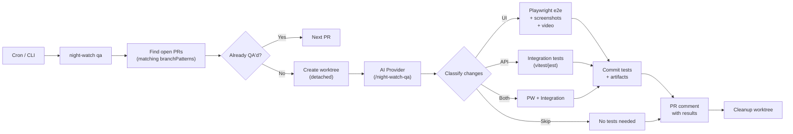
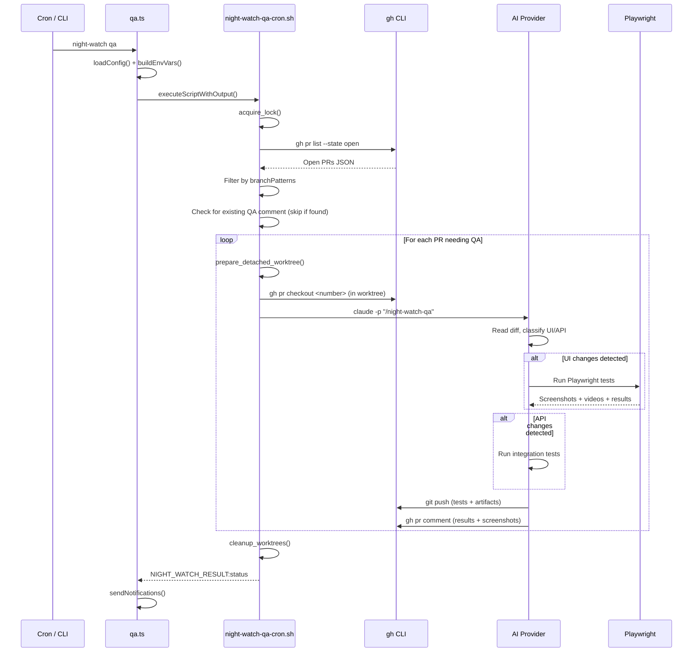

# PRD: QA Process — Automated Test Generation & Execution for PRs

**Complexity: 8 → HIGH mode**

```
COMPLEXITY SCORE (sum all that apply):
+3  Touches 10+ files (config, types, constants, cli, init, install, uninstall, status-data, helpers, new command, new script, new template, tests)
+2  New system/module from scratch (entire QA process pipeline)
+2  Complex state logic (PR classification, test framework detection, artifact capture, conditional Playwright bootstrap)
+1  External API integration (AI provider CLI, Playwright, gh CLI)
= 8 → HIGH
```

---

## 1. Context

**Problem:** Night Watch can execute PRDs and review PRs, but there is no automated quality assurance step that generates and runs tests for the changes introduced in a PR. When the executor creates a PR with new UI or API features, there's no mechanism to automatically produce e2e/integration tests, capture screenshots or video recordings of UI changes, and attach evidence to the PR.

**Files Analyzed:**

- `src/commands/review.ts` — Reviewer CLI command (pattern to mirror exactly)
- `src/commands/slice.ts` — Slicer CLI command (pattern to mirror for env vars + script invocation)
- `src/commands/install.ts` — Crontab install logic (extend with QA entry)
- `src/commands/uninstall.ts` — Crontab uninstall logic (check if QA entries are cleaned up automatically by marker)
- `src/commands/init.ts` — Init command (extend with QA template copy + Playwright detection)
- `scripts/night-watch-pr-reviewer-cron.sh` — Reviewer cron script (pattern to mirror for PR discovery + worktree)
- `scripts/night-watch-helpers.sh` — Shared bash utilities (reuse lock, worktree, log helpers)
- `src/types.ts` — Config interfaces (add `IQaConfig`)
- `src/constants.ts` — Default values (add QA defaults)
- `src/config.ts` — Config loading with env overrides (add QA fields + nested config normalization)
- `src/cli.ts` — Command registration (add `qaCommand`)
- `src/utils/status-data.ts` — Status snapshot (add QA process info + lock path)
- `src/utils/notify.ts` + `src/types.ts` — Notification events (add `qa_completed`)
- `templates/night-watch.config.json` — Config template (add QA defaults)

**Current Behavior:**

- Executor creates PRs with new features from PRDs
- Reviewer checks CI status and review scores, fixes failing PRs
- No process generates tests for the changes, captures visual evidence, or validates new features with e2e/integration tests
- Test writing is left entirely to the AI during PRD execution (hit or miss)

### Integration Points Checklist

**How will this feature be reached?**

- [x] Entry point identified: `night-watch qa` CLI command + `night-watch-qa-cron.sh` cron script
- [x] Caller file identified: `src/cli.ts` registers the qa command; `install.ts` adds crontab entry
- [x] Registration/wiring needed: Register `qaCommand` in `cli.ts`; add QA crontab entry in `install.ts`/`performInstall()`; add QA template to `init.ts`; add QA lock path to `status-data.ts`

**Is this user-facing?**

- [x] YES → CLI command (`night-watch qa`, `night-watch qa --dry-run`)
- [x] Cron-scheduled automated process (fourth process alongside executor, reviewer, slicer)
- [x] PR comments with test results, screenshots, and video recordings

**Full user flow:**

1. QA is enabled by default (`qa.enabled: true`); user can disable via `night-watch.config.json`
2. User runs `night-watch qa` (manual) or cron triggers the QA script
3. QA script finds open PRs matching `qa.branchPatterns` (defaults to `branchPatterns`)
4. For each PR needing QA: creates a detached worktree, invokes AI provider with `/night-watch-qa` prompt
5. AI reads the diff, classifies changes as UI/API/both, generates appropriate tests
6. For UI: runs Playwright tests with screenshot + video capture; for API: runs integration tests
7. Tests + artifacts are committed to PR branch, results posted as PR comment with embedded screenshots
8. Worktree is cleaned up, result emitted via `NIGHT_WATCH_RESULT:` marker

---

## 2. Solution

**Approach:**

- Add a **fourth autonomous process** ("qa") mirroring the reviewer pattern — own CLI command, bash cron script, config section, cron schedule
- The AI agent reads the PR diff and autonomously decides whether tests are needed and what type (UI e2e via Playwright, API integration, or both)
- For UI tests: Playwright captures screenshots and records video by default (configurable via `qa.artifacts`)
- Screenshots and videos are committed to the PR branch in a `qa-artifacts/` directory, and a PR comment embeds them
- If Playwright is not installed in the target project, the QA agent auto-installs it before proceeding
- A `qa.skipLabel` config allows PRs with a specific GitHub label (e.g., `skip-qa`) to be excluded

**Architecture Diagram:**



**Key Decisions:**

- **AI-driven classification**: The agent reads the diff and decides test type — no heuristic file-path matching needed
- **Playwright for UI**: Video recording via `video: 'on'` in Playwright config, screenshots via `screenshot: 'on'`
- **Commit strategy**: Both generated test files AND artifacts (screenshots/videos) are committed to the PR branch — tests go in `tests/e2e/qa/` and `tests/integration/qa/`, artifacts in `qa-artifacts/`
- **Skip mechanism**: PR label (`skip-qa`) or a `[skip-qa]` token in the PR title to opt out; plus a marker comment to avoid re-running QA on already-processed PRs
- **Auto-install Playwright**: If `npx playwright --version` fails, run `npx playwright install --with-deps chromium` before test execution
- **Reuses existing helpers**: Lock files, worktree management, log rotation, result emission all from `night-watch-helpers.sh`

**Data Changes:** None (no database schema changes). Config file gains a new `qa` section.

---

## 3. Sequence Flow



---

## 4. Execution Phases

### Phase 1: Config & Types — Add QA configuration fields

**Files (5):**

- `src/types.ts` — Add `IQaConfig` interface and `qa` field to `INightWatchConfig`; add `qa_completed` to `NotificationEvent`
- `src/constants.ts` — Add QA default values
- `src/config.ts` — Add QA config loading from file + env vars; add to `mergeConfigs`
- `templates/night-watch.config.json` — Add `qa` section with defaults
- `src/__tests__/config.test.ts` — Test QA config loading

**Implementation:**

- [ ] Add `IQaConfig` interface to `src/types.ts`:

  ```typescript
  export type QaArtifacts = 'screenshot' | 'video' | 'both';

  export interface IQaConfig {
    /** Whether the QA process is enabled */
    enabled: boolean;
    /** Cron schedule for QA execution */
    schedule: string;
    /** Maximum runtime in seconds for QA */
    maxRuntime: number;
    /** Branch patterns to match for QA (defaults to top-level branchPatterns if empty) */
    branchPatterns: string[];
    /** What artifacts to capture for UI tests */
    artifacts: QaArtifacts;
    /** GitHub label to skip QA (PRs with this label are excluded) */
    skipLabel: string;
    /** Auto-install Playwright if missing during QA run */
    autoInstallPlaywright: boolean;
  }
  ```

- [ ] Add `qa: IQaConfig` to `INightWatchConfig`
- [ ] Add `"qa_completed"` to `NotificationEvent` union type
- [ ] Add constants to `src/constants.ts`:

  ```typescript
  export const DEFAULT_QA_ENABLED = true;
  export const DEFAULT_QA_SCHEDULE = '30 1,7,13,19 * * *'; // 4x daily, offset from reviewer
  export const DEFAULT_QA_MAX_RUNTIME = 3600; // 1 hour
  export const DEFAULT_QA_ARTIFACTS: QaArtifacts = 'both';
  export const DEFAULT_QA_SKIP_LABEL = 'skip-qa';
  export const DEFAULT_QA_AUTO_INSTALL_PLAYWRIGHT = true;

  export const DEFAULT_QA: IQaConfig = {
    enabled: DEFAULT_QA_ENABLED, // true
    schedule: DEFAULT_QA_SCHEDULE,
    maxRuntime: DEFAULT_QA_MAX_RUNTIME,
    branchPatterns: [],
    artifacts: DEFAULT_QA_ARTIFACTS, // "both"
    skipLabel: DEFAULT_QA_SKIP_LABEL,
    autoInstallPlaywright: DEFAULT_QA_AUTO_INSTALL_PLAYWRIGHT,
  };

  export const QA_LOG_NAME = 'night-watch-qa';
  ```

  Also add `"qa"` key to `LOG_FILE_NAMES` map.

- [ ] In `src/config.ts`:
  - Import new QA types and defaults
  - Add `qa` to `getDefaultConfig()` return
  - Add `normalizeConfig` handling for `rawConfig.qa` (nested object like `roadmapScanner`)
  - Add env var handling: `NW_QA_ENABLED`, `NW_QA_SCHEDULE`, `NW_QA_MAX_RUNTIME`, `NW_QA_ARTIFACTS`, `NW_QA_SKIP_LABEL`, `NW_QA_AUTO_INSTALL_PLAYWRIGHT`
  - Add QA fields to `mergeConfigs()` (both file and env layers)
- [ ] Add `qa` section to `templates/night-watch.config.json`:
  ```json
  "qa": {
    "enabled": true,
    "schedule": "30 1,7,13,19 * * *",
    "maxRuntime": 3600,
    "branchPatterns": [],
    "artifacts": "both",
    "skipLabel": "skip-qa",
    "autoInstallPlaywright": true
  }
  ```

**Tests Required:**
| Test File | Test Name | Assertion |
|-----------|-----------|-----------|
| `src/__tests__/config.test.ts` | `should load QA defaults when no qa config present` | `expect(config.qa.enabled).toBe(true)` |
| `src/__tests__/config.test.ts` | `should load QA config from file` | `expect(config.qa.schedule).toBe("0 */4 * * *")` |
| `src/__tests__/config.test.ts` | `should override QA config from env vars` | `expect(config.qa.enabled).toBe(true)` when `NW_QA_ENABLED=true` |
| `src/__tests__/config.test.ts` | `should use top-level branchPatterns when qa.branchPatterns is empty` | `expect(effectivePatterns).toEqual(config.branchPatterns)` |

**Verification:**

- `yarn verify` passes
- Config tests pass with `yarn test src/__tests__/config.test.ts`

---

### Phase 2: Bash Script — QA cron runner

**Files (2):**

- `scripts/night-watch-qa-cron.sh` — New QA cron script
- `scripts/night-watch-helpers.sh` — No changes needed (reuse existing helpers)

**Implementation:**

- [ ] Create `scripts/night-watch-qa-cron.sh` following the reviewer script pattern:
  1. Parse env vars: `NW_QA_MAX_RUNTIME`, `NW_PROVIDER_CMD`, `NW_BRANCH_PATTERNS`, `NW_QA_SKIP_LABEL`, `NW_QA_ARTIFACTS`, `NW_QA_AUTO_INSTALL_PLAYWRIGHT`, `NW_DRY_RUN`
  2. Source `night-watch-helpers.sh`
  3. Acquire lock at `/tmp/night-watch-qa-${PROJECT_RUNTIME_KEY}.lock`
  4. List open PRs via `gh pr list --state open --json number,headRefName,title,labels`
  5. Filter by branch patterns (same regex logic as reviewer)
  6. Skip PRs that have the `skipLabel` label
  7. Skip PRs that have `[skip-qa]` in their title
  8. Skip PRs that already have a comment containing `<!-- night-watch-qa-marker -->` (idempotency)
  9. For each PR needing QA:
     - Create detached worktree via `prepare_detached_worktree`
     - Checkout the PR branch in the worktree
     - Invoke AI provider: `claude -p "/night-watch-qa" --dangerously-skip-permissions`
     - Handle codex alternative with `--yolo`
  10. Clean up worktrees
  11. Emit `NIGHT_WATCH_RESULT:` markers (`success_qa`, `skip_no_open_prs`, `skip_all_qa_done`, `skip_locked`, `timeout`, `failure`)
- [ ] Make script executable: `chmod +x scripts/night-watch-qa-cron.sh`

**Key env vars consumed by the script:**

```bash
NW_QA_MAX_RUNTIME="${NW_QA_MAX_RUNTIME:-3600}"
NW_PROVIDER_CMD="${NW_PROVIDER_CMD:-claude}"
NW_BRANCH_PATTERNS="${NW_BRANCH_PATTERNS:-feat/,night-watch/}"
NW_QA_SKIP_LABEL="${NW_QA_SKIP_LABEL:-skip-qa}"
NW_QA_ARTIFACTS="${NW_QA_ARTIFACTS:-both}"
NW_QA_AUTO_INSTALL_PLAYWRIGHT="${NW_QA_AUTO_INSTALL_PLAYWRIGHT:-1}"
NW_DRY_RUN="${NW_DRY_RUN:-0}"
```

**Tests Required:**
| Test File | Test Name | Assertion |
|-----------|-----------|-----------|
| `src/__tests__/scripts/qa-smoke.test.ts` | `should skip when no open PRs` | stdout contains `NIGHT_WATCH_RESULT:skip_no_open_prs` |
| `src/__tests__/scripts/qa-smoke.test.ts` | `should skip when all PRs already QA'd` | stdout contains `NIGHT_WATCH_RESULT:skip_all_qa_done` |
| `src/__tests__/scripts/qa-smoke.test.ts` | `should emit success result on successful QA` | stdout contains `NIGHT_WATCH_RESULT:success_qa` |

**Verification:**

- Script runs with `bash scripts/night-watch-qa-cron.sh /tmp/test-project` (dry run mode)
- Lock file created/released correctly

---

### Phase 3: AI Agent Template — The QA prompt

**Files (1):**

- `templates/night-watch-qa.md` — New AI agent prompt for QA

**Implementation:**

- [ ] Create `templates/night-watch-qa.md` with the following structure:

```markdown
You are the Night Watch QA agent. Your job is to analyze open PRs, generate appropriate tests for the changes, run them, and report results with visual evidence.

## Context

You are running inside a worktree checked out to a PR branch. Your goal is to:

1. Analyze what changed in this PR compared to the base branch
2. Determine if the changes are UI-related, API-related, or both
3. Generate appropriate tests (Playwright e2e for UI, integration tests for API)
4. Run the tests and capture artifacts (screenshots, videos for UI)
5. Commit the tests and artifacts, then comment on the PR with results

## Environment Variables Available

- `NW_QA_ARTIFACTS` — What to capture: "screenshot", "video", or "both" (default: "both")
- `NW_QA_AUTO_INSTALL_PLAYWRIGHT` — "1" to auto-install Playwright if missing

## Instructions

### Step 1: Analyze the PR diff

Get the diff against the base branch:
```

git diff origin/${DEFAULT_BRANCH}...HEAD --name-only
git diff origin/${DEFAULT_BRANCH}...HEAD --stat

````

Read the changed files to understand what the PR introduces.

### Step 2: Classify and Decide

Based on the diff, determine:
- **UI changes**: New/modified components, pages, layouts, styles, client-side logic
- **API changes**: New/modified endpoints, controllers, services, middleware, database queries
- **Both**: PR touches both UI and API code
- **No tests needed**: Trivial changes (docs, config, comments only) — in this case, post a comment saying "QA: No tests needed for this PR" and stop

### Step 3: Prepare Test Infrastructure

**For UI tests (Playwright):**
1. Check if Playwright is available: `npx playwright --version`
2. If not available and `NW_QA_AUTO_INSTALL_PLAYWRIGHT=1`:
   - Run `npm install -D @playwright/test` (or yarn/pnpm equivalent based on lockfile)
   - Run `npx playwright install chromium`
3. If not available and auto-install is disabled, skip UI tests and note in the report

**For API tests:**
- Use the project's existing test framework (vitest, jest, or mocha — detect from package.json)
- If no test framework exists, use vitest

### Step 4: Generate Tests

**UI Tests (Playwright):**
- Create test files in `tests/e2e/qa/` (or the project's existing e2e directory)
- Test the specific feature/page changed in the PR
- Configure Playwright for artifacts based on `NW_QA_ARTIFACTS`:
  - `"screenshot"`: `screenshot: 'on'` only
  - `"video"`: `video: { mode: 'on', size: { width: 1280, height: 720 } }` only
  - `"both"`: Both screenshot and video enabled
- Name test files with a `qa-` prefix: `qa-<feature-name>.spec.ts`
- Include at minimum: navigation to the feature, interaction with key elements, visual assertions

**API Tests:**
- Create test files in `tests/integration/qa/` (or the project's existing test directory)
- Test the specific endpoints changed in the PR
- Include: happy path, error cases, validation checks
- Name test files with a `qa-` prefix: `qa-<endpoint-name>.test.ts`

### Step 5: Run Tests

**UI Tests:**
```bash
npx playwright test tests/e2e/qa/ --reporter=list
````

**API Tests:**

```bash
npx vitest run tests/integration/qa/ --reporter=verbose
# (or equivalent for the project's test runner)
```

Capture the test output for the report.

### Step 6: Collect Artifacts

Move Playwright artifacts (screenshots, videos) to `qa-artifacts/` in the project root:

```bash
mkdir -p qa-artifacts
# Copy from playwright-report/ or test-results/ to qa-artifacts/
```

### Step 7: Commit and Push

```bash
git add tests/e2e/qa/ tests/integration/qa/ qa-artifacts/ || true
git add -A tests/*/qa/ qa-artifacts/ || true
git commit -m "test(qa): add automated QA tests for PR changes

- Generated by Night Watch QA agent
- <UI tests: X passing, Y failing | No UI tests>
- <API tests: X passing, Y failing | No API tests>
- Artifacts: <screenshots, videos | screenshots | videos | none>

Co-Authored-By: Claude Opus 4.6 <noreply@anthropic.com>"
git push origin HEAD
```

### Step 8: Comment on PR

Post a comment on the PR with results. Use the `<!-- night-watch-qa-marker -->` HTML comment for idempotency detection.

```bash
gh pr comment <PR_NUMBER> --body "<!-- night-watch-qa-marker -->
## Night Watch QA Report

### Changes Classification
- **Type**: <UI | API | UI + API>
- **Files changed**: <count>

### Test Results

<If UI tests>
#### UI Tests (Playwright)
- **Status**: <✅ All passing | ❌ X of Y failing>
- **Tests**: <count> test(s) in <count> file(s)

<If screenshots captured>
#### Screenshots
<For each screenshot>

</For>
</If>

<If video captured>
#### Video Recording
Video artifact committed to \`qa-artifacts/\` — view in the PR's file changes.
</If>
</If>

<If API tests>
#### API Tests
- **Status**: <✅ All passing | ❌ X of Y failing>
- **Tests**: <count> test(s) in <count> file(s)
</If>

<If no tests generated>
**QA: No tests needed for this PR** — changes are trivial (docs, config, comments).
</If>

---
*Night Watch QA Agent*"
```

### Important Rules

- Process each PR **once** per run. Do NOT loop or retry after pushing.
- Do NOT modify existing project tests — only add new files in `qa/` subdirectories.
- If tests fail, still commit and report — the failures are useful information.
- Keep test files self-contained and independent from each other.
- Follow the project's existing code style and conventions (check CLAUDE.md, package.json scripts, tsconfig).

````

**Tests Required:**
| Test File | Test Name | Assertion |
|-----------|-----------|-----------|
| (Manual) | Template has QA marker comment | Template contains `<!-- night-watch-qa-marker -->` |
| (Manual) | Template references env vars correctly | Template references `NW_QA_ARTIFACTS`, `NW_QA_AUTO_INSTALL_PLAYWRIGHT` |

**Verification:**
- Template file exists at `templates/night-watch-qa.md`
- Content is valid Markdown

---

### Phase 4: CLI Command — `night-watch qa`

**Files (4):**
- `src/commands/qa.ts` — New QA CLI command (mirror `review.ts` pattern)
- `src/cli.ts` — Register the qa command
- `src/utils/status-data.ts` — Add `qaLockPath()` and QA process to status snapshot
- `src/__tests__/commands/qa.test.ts` — Unit tests for QA command

**Implementation:**

- [ ] Create `src/commands/qa.ts` following the `review.ts` pattern exactly:
  - Export `IQaOptions` interface: `{ dryRun: boolean; timeout?: string; provider?: string }`
  - Export `buildEnvVars(config, options)` — maps QA config to env vars:
    - `NW_PROVIDER_CMD`, `NW_QA_MAX_RUNTIME`, `NW_BRANCH_PATTERNS` (from `qa.branchPatterns` if non-empty, else from top-level `branchPatterns`), `NW_QA_SKIP_LABEL`, `NW_QA_ARTIFACTS`, `NW_QA_AUTO_INSTALL_PLAYWRIGHT`, `NW_DRY_RUN`, `NW_EXECUTION_CONTEXT=agent`
    - Also pass `providerEnv` and `NW_DEFAULT_BRANCH`
  - Export `applyCliOverrides(config, options)` — timeout and provider overrides
  - Export `qaCommand(program)` — registers `program.command("qa")` with:
    - `--dry-run` option
    - `--timeout <seconds>` option
    - `--provider <string>` option
    - Action: load config, apply overrides, build env vars, execute `night-watch-qa-cron.sh` with spinner
    - Dry-run mode: print configuration table (similar to reviewer dry-run)
    - On completion: parse script result, send notifications with `qa_completed` event
- [ ] In `src/cli.ts`: import and register `qaCommand(program)`
- [ ] In `src/utils/status-data.ts`:
  - Add `qaLockPath(projectDir)` function: `return \`${LOCK_FILE_PREFIX}qa-${projectRuntimeKey(projectDir)}.lock\``
  - Add QA process to `fetchStatusSnapshot()` processes array
  - Add `"qa"` to `collectLogInfo()` log names array
- [ ] Add `QA_LOG_NAME` to `LOG_FILE_NAMES` in `constants.ts` (if not done in Phase 1)

**Tests Required:**
| Test File | Test Name | Assertion |
|-----------|-----------|-----------|
| `src/__tests__/commands/qa.test.ts` | `should build env vars with QA config` | `envVars.NW_QA_MAX_RUNTIME === "3600"` |
| `src/__tests__/commands/qa.test.ts` | `should use top-level branchPatterns when qa.branchPatterns is empty` | `envVars.NW_BRANCH_PATTERNS` equals top-level patterns |
| `src/__tests__/commands/qa.test.ts` | `should use qa.branchPatterns when non-empty` | `envVars.NW_BRANCH_PATTERNS` equals qa-specific patterns |
| `src/__tests__/commands/qa.test.ts` | `should apply CLI timeout override` | `overridden.qa.maxRuntime === 1800` |
| `src/__tests__/commands/qa.test.ts` | `should set NW_QA_ARTIFACTS from config` | `envVars.NW_QA_ARTIFACTS === "both"` |

**Verification:**
- `night-watch qa --dry-run` prints correct configuration
- `yarn verify` passes

---

### Phase 5: Install & Init Integration — Cron entry + template setup

**Files (4):**
- `src/commands/install.ts` — Add QA crontab entry when `qa.enabled`
- `src/commands/init.ts` — Copy QA template + detect Playwright during init
- `src/__tests__/commands/install.test.ts` — Test QA cron entry generation
- `src/__tests__/commands/init.test.ts` — Test QA template is copied

**Implementation:**

- [ ] In `src/commands/install.ts`:
  - Add `--no-qa` option to `IInstallOptions`: `noQa?: boolean`
  - In `performInstall()`:
    - After the slicer entry block, add QA entry block:
    ```typescript
    const installQa = options?.noQa === true ? false : config.qa.enabled;
    if (installQa) {
      const qaSchedule = applyScheduleOffset(config.qa.schedule, offset);
      const qaLog = path.join(logDir, "qa.log");
      const qaEntry = `${qaSchedule} ${pathPrefix}${providerEnvPrefix}${cliBinPrefix}cd ${shellQuote(projectDir)} && ${shellQuote(nightWatchBin)} qa >> ${shellQuote(qaLog)} 2>&1  ${marker}`;
      entries.push(qaEntry);
    }
    ```
  - In `installCommand()` action:
    - Add `--no-qa` option to command definition
    - Mirror the slicer entry creation pattern for QA
    - Add QA log path to output summary
- [ ] In `src/commands/init.ts`:
  - Copy `night-watch-qa.md` template to `.claude/commands/` (after pr-reviewer template copy)
  - Add Playwright detection step during init (after provider detection):
    ```
    Step N: Detecting test frameworks...
    - Playwright: detected / not found
    - If not found: prompt "Install Playwright for QA? (y/n)"
    - If yes: `npx playwright install chromium`
    ```
  - Track QA template source in `templateSources` for summary table

**Tests Required:**
| Test File | Test Name | Assertion |
|-----------|-----------|-----------|
| `src/__tests__/commands/install.test.ts` | `should include QA cron entry when qa.enabled is true` | Result entries include `qa` entry |
| `src/__tests__/commands/install.test.ts` | `should not include QA entry when qa.enabled is false` | Result entries do not include `qa` entry |
| `src/__tests__/commands/install.test.ts` | `should skip QA entry when --no-qa flag is set` | Result entries do not include `qa` entry |

**Verification:**
- `night-watch install --no-qa` works correctly
- `night-watch init` copies the QA template
- `yarn verify` passes

---

## 5. Checkpoint Protocol

**All phases use automated checkpoints** via `prd-work-reviewer` agent. Phases 3 and 5 additionally require **manual checkpoints** for template content validation and init flow testing.

| Phase | Checkpoint Type |
|-------|----------------|
| Phase 1: Config & Types | Automated only |
| Phase 2: Bash Script | Automated only |
| Phase 3: AI Agent Template | Automated + Manual (review prompt quality) |
| Phase 4: CLI Command | Automated only |
| Phase 5: Install & Init | Automated + Manual (test init flow) |

---

## 6. Verification Strategy

### Phase 1 Verification Plan:
1. **Unit Tests:** `src/__tests__/config.test.ts` — QA config loading from defaults, file, env
2. **Evidence:** `yarn test src/__tests__/config.test.ts` passes

### Phase 2 Verification Plan:
1. **Integration Tests:** `src/__tests__/scripts/qa-smoke.test.ts` — Bash script smoke tests with fake `gh`/`claude` binaries
2. **Manual:** `NW_DRY_RUN=1 bash scripts/night-watch-qa-cron.sh /tmp/test` prints diagnostics

### Phase 3 Verification Plan:
1. **Manual:** Template content review — verify all env vars referenced, QA marker present, Playwright artifact config correct

### Phase 4 Verification Plan:
1. **Unit Tests:** `src/__tests__/commands/qa.test.ts` — env var building, CLI overrides, branch pattern fallback
2. **API Proof:** `night-watch qa --dry-run` outputs correct config table
3. **Evidence:** `yarn verify` passes

### Phase 5 Verification Plan:
1. **Unit Tests:** `src/__tests__/commands/install.test.ts` — QA cron entry included/excluded correctly
2. **Manual:** Run `night-watch init` in a test project, verify QA template is copied to `.claude/commands/`
3. **Evidence:** `yarn verify` passes

---

## 7. Acceptance Criteria

- [ ] All 5 phases complete
- [ ] All specified tests pass
- [ ] `yarn verify` passes
- [ ] All automated checkpoint reviews passed
- [ ] `night-watch qa --dry-run` shows correct configuration
- [ ] `night-watch install` includes QA cron entry when `qa.enabled: true`
- [ ] `night-watch init` copies `night-watch-qa.md` template
- [ ] Config supports `qa.*` section with all documented fields
- [ ] Env vars `NW_QA_*` override config values
- [ ] QA process appears in `night-watch status` output
- [ ] QA process has its own lock file (no conflicts with executor/reviewer)
- [ ] Feature is fully wired: CLI command → bash script → AI template → PR comment

---

## Config Reference

### `night-watch.config.json`
```json
{
  "qa": {
    "enabled": true,
    "schedule": "30 1,7,13,19 * * *",
    "maxRuntime": 3600,
    "branchPatterns": [],
    "artifacts": "both",
    "skipLabel": "skip-qa",
    "autoInstallPlaywright": true
  }
}
````

### Environment Variables

| Variable                        | Type    | Default              | Description                                                          |
| ------------------------------- | ------- | -------------------- | -------------------------------------------------------------------- |
| `NW_QA_ENABLED`                 | boolean | `true`               | Enable/disable QA process                                            |
| `NW_QA_SCHEDULE`                | string  | `30 1,7,13,19 * * *` | Cron schedule                                                        |
| `NW_QA_MAX_RUNTIME`             | number  | `3600`               | Max runtime in seconds                                               |
| `NW_QA_ARTIFACTS`               | string  | `both`               | Artifact capture: `screenshot`, `video`, `both`                      |
| `NW_QA_SKIP_LABEL`              | string  | `skip-qa`            | GitHub label to skip QA                                              |
| `NW_QA_AUTO_INSTALL_PLAYWRIGHT` | boolean | `true`               | Auto-install Playwright if missing                                   |
| `NW_QA_BRANCH_PATTERNS`         | string  | (empty)              | Comma-separated branch patterns (falls back to `NW_BRANCH_PATTERNS`) |
