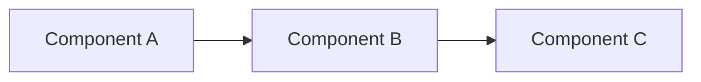
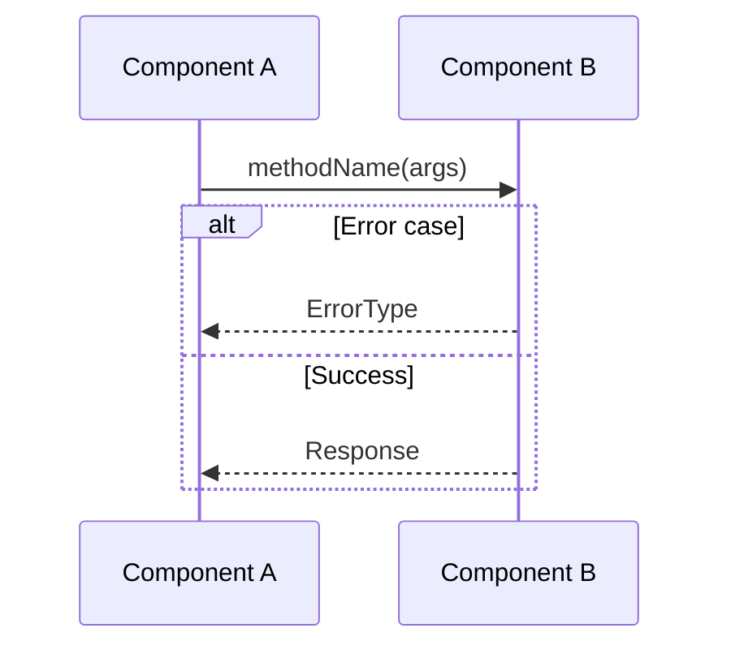

# PRD: Add User Auth

**Complexity: 5 → MEDIUM mode**

```
COMPLEXITY SCORE (sum all that apply):
+1  Touches 1-5 files
+2  Touches 6-10 files
+3  Touches 10+ files
+2  New system/module from scratch
+2  Complex state logic / concurrency
+2  Multi-package changes
+1  Database schema changes
+1  External API integration

| Score | Level  | Template Mode                                   |
| ----- | ------ | ----------------------------------------------- |
| 1-3   | LOW    | Minimal (skip sections marked with MEDIUM/HIGH) |
| 4-6   | MEDIUM | Standard (all sections)                         |
| 7+    | HIGH   | Full + mandatory checkpoints every phase        |
```

---

## 1. Context

**Problem:** <!-- 1-2 sentences describing the issue being solved -->

**Files Analyzed:**

<!-- List all files you've inspected before planning -->

**Current Behavior:**

<!-- 3-5 bullets describing current state -->

### Integration Points Checklist

**How will this feature be reached?**

- [ ] Entry point identified: <!-- e.g., route, event, cron, CLI command -->
- [ ] Caller file identified: <!-- file that will invoke this new code -->
- [ ] Registration/wiring needed: <!-- e.g., add route to router, register handler, add menu item -->

**Is this user-facing?**

- [ ] YES → UI components required (list them)
- [ ] NO → Internal/background feature (explain how it's triggered)

**Full user flow:**

1. User does: <!-- action -->
2. Triggers: <!-- what code path -->
3. Reaches new feature via: <!-- specific connection point -->
4. Result displayed in: <!-- where user sees outcome -->

---

## 2. Solution

**Approach:**

<!-- 3-5 bullets explaining the chosen solution -->

**Architecture Diagram** <!-- (MEDIUM/HIGH complexity) -->:



**Key Decisions:**

<!-- Library/framework choices, error-handling strategy, reused utilities -->

**Data Changes:** <!-- New schemas/migrations, or "None" -->

---

## 3. Sequence Flow <!-- (MEDIUM/HIGH complexity) -->



---

## 4. Execution Phases

**CRITICAL RULES:**

1. Each phase = ONE user-testable vertical slice
2. Max 5 files per phase (split if larger)
3. Each phase MUST include concrete tests
4. Checkpoint after each phase (automated ALWAYS required)

### Phase 1: [Name] — [User-visible outcome in 1 sentence]

**Files (max 5):**

- `src/path/file.ts` — what changes

**Implementation:**

- [ ] Step 1
- [ ] Step 2

**Tests Required:**
| Test File | Test Name | Assertion |
|-----------|-----------|-----------|
| `src/__tests__/feature.test.ts` | `should do X when Y` | `expect(result).toBe(Z)` |

**Verification Plan:**

1. **Unit Tests:** File and test names
2. **Integration Test:** (if applicable)
3. **User Verification:**
   - Action: [what to do]
   - Expected: [what should happen]

**Checkpoint:** Run automated review after this phase completes.

---

### Phase 2: [Name] — [User-visible outcome in 1 sentence]

**Files (max 5):**

- `src/path/file.ts` — what changes

**Implementation:**

- [ ] Step 1
- [ ] Step 2

**Tests Required:**
| Test File | Test Name | Assertion |
|-----------|-----------|-----------|
| `src/__tests__/feature.test.ts` | `should do X when Y` | `expect(result).toBe(Z)` |

**Verification Plan:**

1. **Unit Tests:** File and test names
2. **Integration Test:** (if applicable)
3. **User Verification:**
   - Action: [what to do]
   - Expected: [what should happen]

**Checkpoint:** Run automated review after this phase completes.

---

### Phase 3: [Name] — [User-visible outcome in 1 sentence]

**Files (max 5):**

- `src/path/file.ts` — what changes

**Implementation:**

- [ ] Step 1
- [ ] Step 2

**Tests Required:**
| Test File | Test Name | Assertion |
|-----------|-----------|-----------|
| `src/__tests__/feature.test.ts` | `should do X when Y` | `expect(result).toBe(Z)` |

**Verification Plan:**

1. **Unit Tests:** File and test names
2. **Integration Test:** (if applicable)
3. **User Verification:**
   - Action: [what to do]
   - Expected: [what should happen]

**Checkpoint:** Run automated review after this phase completes.

---

## 5. Acceptance Criteria

- [ ] All phases complete
- [ ] All specified tests pass
- [ ] Verification commands pass
- [ ] All automated checkpoint reviews passed
- [ ] Feature is reachable (entry point connected, not orphaned code)
- [ ] <!-- additional criterion -->
- [ ] <!-- additional criterion -->
