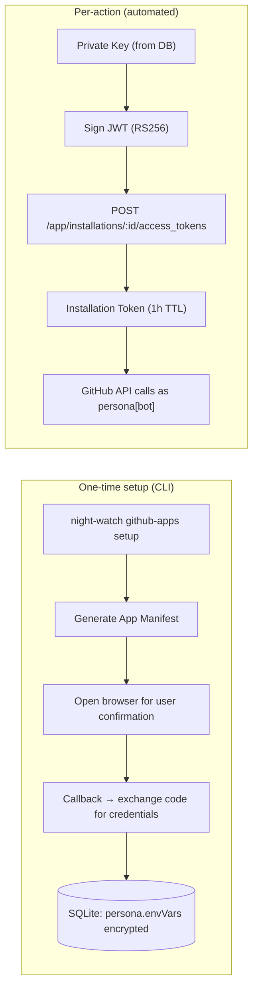
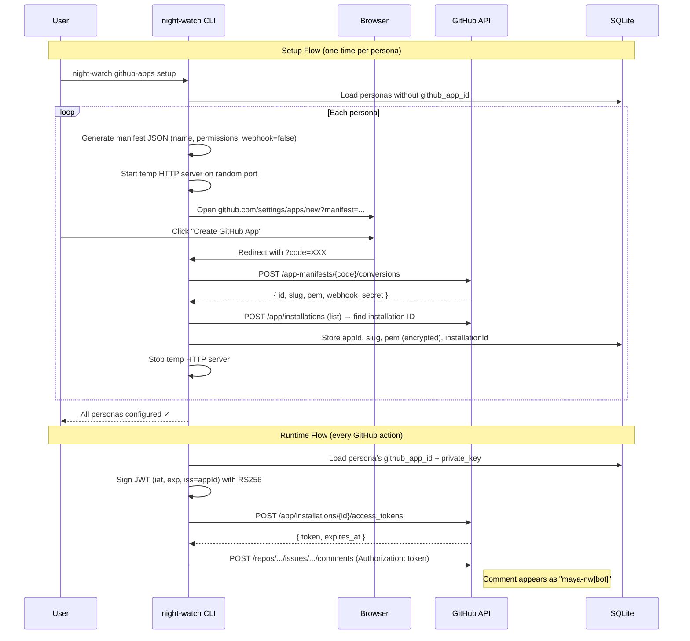

# PRD: GitHub App Per-Persona Identity

**Complexity: 6 → MEDIUM mode**

```
+2  Touches 6-10 files
+2  New system/module from scratch (GitHub App auth)
+1  Database schema changes (persona table)
+1  External API integration (GitHub App API)
```

---

## 1. Context

**Problem:** All personas (Maya, Carlos, Priya, Dev) interact with GitHub using the user's personal `gh` credentials, so every PR comment, review, and commit shows the user's profile — making it impossible to tell which persona acted.

**Files Analyzed:**

- `shared/types.ts` — `IAgentPersona`, `IAgentModelConfig` types
- `src/utils/github.ts` — all GitHub interactions via `gh` CLI
- `src/storage/sqlite/migrations.ts` — schema, migration pattern
- `src/storage/repositories/sqlite/agent-persona-repository.ts` — persona CRUD, encryption
- `src/commands/review.ts` — PR reviewer orchestration, env vars
- `scripts/night-watch-pr-reviewer-cron.sh` — bash script that calls `gh pr comment`, `gh pr merge`, `gh api`
- `.claude/commands/night-watch-pr-reviewer.md` — agent instructions (calls `gh pr comment`)
- `src/slack/deliberation.ts` — `triggerPRRefinement()` spawns reviewer
- `src/server/index.ts` — persona REST API, avatar endpoint
- `src/cli.ts` — command registration pattern

**Current Behavior:**

- `gh pr comment`, `gh pr merge`, `gh api` all use the user's personal GitHub auth token
- Personas have names, avatars, and distinct identities in Slack (via `postAsAgent` with `username`/`icon_url`)
- On GitHub, all actions appear as one person — the user
- No mechanism exists to authenticate as different identities on GitHub

## 2. Solution

**Approach:**

- Create one **GitHub App** per persona, each with its own name, avatar, and API credentials
- Automate the setup via a `night-watch github-apps setup` CLI command that uses the [GitHub App Manifest Flow](https://docs.github.com/en/apps/sharing-github-apps/registering-a-github-app-from-a-manifest) to pre-fill each App's name/description/permissions
- Store each App's credentials (appId, privateKey, installationId) encrypted in the persona's existing `modelConfig.envVars` (AES-256-GCM encryption already exists)
- At runtime, generate a JWT from the private key → exchange for an installation access token → use for GitHub API calls
- Modify `github.ts` to accept an optional persona and use its token instead of the default `gh` credentials
- The PR reviewer cron script and agent instructions use the token when commenting/merging

**Architecture Diagram:**



**Key Decisions:**

- [x] **One App per persona** — each gets a distinct GitHub identity (`maya-nw[bot]`, `carlos-nw[bot]`, etc.)
- [x] **Manifest Flow** for App creation — minimizes manual GitHub UI work (one click per persona)
- [x] **Reuse existing encryption** — private keys stored via the same AES-256-GCM mechanism used for API keys
- [x] **Token caching** — installation tokens are valid for 1 hour; cache to avoid re-generation per API call
- [x] **Graceful fallback** — if a persona has no GitHub App configured, fall back to default `gh` credentials (backwards compatible)
- [x] **`jsonwebtoken` library** for JWT signing — lightweight, well-maintained, RS256 support
- [x] **Temporary local HTTP server** for manifest callback — listens on a random port, accepts the code exchange, then shuts down

**Data Changes:**

New columns on `agent_personas` table (via ALTER migration pattern):

```sql
ALTER TABLE agent_personas ADD COLUMN github_app_id INTEGER;
ALTER TABLE agent_personas ADD COLUMN github_app_slug TEXT;
ALTER TABLE agent_personas ADD COLUMN github_app_private_key TEXT;      -- encrypted
ALTER TABLE agent_personas ADD COLUMN github_installation_id INTEGER;
```

## 3. Sequence Flow



---

## 4. Execution Phases

### Integration Points Checklist

```markdown
**How will this feature be reached?**

- [x] Entry point: `night-watch github-apps setup` CLI command (setup)
- [x] Entry point: Automatic at runtime when persona interacts with GitHub (token generation)
- [x] Caller file: `src/utils/github.ts` — all GitHub API functions gain optional persona param
- [x] Registration: New command registered in `src/cli.ts`

**Is this user-facing?**

- [x] YES → `night-watch github-apps setup` command with interactive output
- [x] YES → `night-watch github-apps status` subcommand to view setup state

**Full user flow:**

1. User runs: `night-watch github-apps setup`
2. Triggers: CLI loads personas, generates manifests, opens browser
3. Reaches new feature via: Commander subcommand
4. Result: Personas stored with GitHub App credentials, future GH actions use persona identity
```

---

#### Phase 1: GitHub App Auth Utility — Token generation from private key

**Files (4):**

- `src/utils/github-app-auth.ts` — NEW: JWT signing, installation token generation, token caching
- `src/storage/sqlite/migrations.ts` — Add github_app columns to agent_personas
- `shared/types.ts` — Add GitHub App fields to `IAgentPersona`
- `src/storage/repositories/sqlite/agent-persona-repository.ts` — Read/write new fields

**Implementation:**

- [ ] Add `githubAppId`, `githubAppSlug`, `githubAppPrivateKey`, `githubInstallationId` fields to `IAgentPersona` interface
- [ ] Add ALTER TABLE migration for the 4 new columns (follow existing try/catch pattern in `migrations.ts`)
- [ ] Update `rowToPersona()` and `_rowToPersona()` to include new fields; encrypt/decrypt `githubAppPrivateKey` using existing `_encryptSecret`/`_decryptSecret`
- [ ] Create `src/utils/github-app-auth.ts` with:
  - `generateJWT(appId: number, privateKey: string): string` — RS256-signed JWT with 10min expiry
  - `getInstallationToken(appId: number, privateKey: string, installationId: number): Promise<{ token: string; expiresAt: Date }>` — exchanges JWT for installation token via GitHub API
  - `getPersonaGitHubToken(persona: IAgentPersona): Promise<string | null>` — loads cached or fresh token; returns null if persona has no GitHub App
  - Token cache: `Map<string, { token: string; expiresAt: Date }>` with 5min safety margin before expiry

**Tests Required:**

| Test File                                     | Test Name                                           | Assertion                                                                |
| --------------------------------------------- | --------------------------------------------------- | ------------------------------------------------------------------------ |
| `src/__tests__/utils/github-app-auth.test.ts` | `should generate valid JWT with correct claims`     | JWT has `iss`, `iat`, `exp` fields; `iss` matches appId                  |
| `src/__tests__/utils/github-app-auth.test.ts` | `should return null when persona has no GitHub App` | `getPersonaGitHubToken()` returns null for persona without `githubAppId` |
| `src/__tests__/utils/github-app-auth.test.ts` | `should return cached token when not expired`       | Second call returns same token without HTTP request                      |
| `src/__tests__/utils/github-app-auth.test.ts` | `should fetch new token when cache expired`         | After expiry, new HTTP request is made                                   |

**Verification Plan:**

1. **Unit Tests:** `src/__tests__/utils/github-app-auth.test.ts` — JWT generation, caching logic, null fallback
2. **Evidence:** `yarn verify` passes, new columns exist in schema

---

#### Phase 2: GitHub API with Persona Identity — Modify github.ts to use persona tokens

**Files (3):**

- `src/utils/github.ts` — Add `execGhAsPersona()` helper, update functions to accept optional persona
- `src/utils/github-app-auth.ts` — Add `execGhApiAsPersona()` for `gh api` calls with token header
- `src/commands/review.ts` — Pass persona context via env vars to the cron script

**Implementation:**

- [ ] Add `execGhApiAsPersona(persona: IAgentPersona, args: string[], cwd: string): string | null` — wraps `gh api` with `--header "Authorization: token <installation_token>"`
- [ ] Add `commentOnPrAsPersona(prNumber: number, body: string, persona: IAgentPersona, cwd: string): boolean` — posts a PR comment as the persona's GitHub App
- [ ] Add `mergePrAsPersona(prNumber: number, method: string, persona: IAgentPersona, cwd: string): boolean` — merges a PR as the persona's GitHub App
- [ ] Update `buildEnvVars()` in `review.ts` to include `NW_GITHUB_PERSONA_ID` env var so the cron script knows which persona to use
- [ ] Ensure all functions fall back to plain `gh` when persona has no GitHub App configured

**Tests Required:**

| Test File                               | Test Name                                         | Assertion                                         |
| --------------------------------------- | ------------------------------------------------- | ------------------------------------------------- |
| `src/__tests__/utils/github.test.ts`    | `should use persona token when available`         | `execFileSync` called with `Authorization` header |
| `src/__tests__/utils/github.test.ts`    | `should fall back to gh CLI when no persona app`  | Standard `gh` call without custom auth            |
| `src/__tests__/commands/review.test.ts` | `should include NW_GITHUB_PERSONA_ID in env vars` | `buildEnvVars` output contains the persona ID     |

**Verification Plan:**

1. **Unit Tests:** Mock `execFileSync` to verify token injection and fallback behavior
2. **Evidence:** `yarn verify` passes

---

#### Phase 3: CLI Setup Command — Automated GitHub App creation per persona

**Files (3):**

- `src/commands/github-apps.ts` — NEW: `github-apps setup` and `github-apps status` subcommands
- `src/cli.ts` — Register the new command
- `src/storage/repositories/sqlite/agent-persona-repository.ts` — Add `updateGitHubApp()` helper

**Implementation:**

- [ ] Create `github-apps setup` command:
  - Load all active personas
  - Filter to those without `githubAppId`
  - For each persona:
    1. Generate GitHub App manifest JSON:
       ```json
       {
         "name": "<persona-name>-nw",
         "url": "https://github.com/night-watch-cli",
         "hook_attributes": { "active": false },
         "redirect_url": "http://localhost:<random-port>/callback",
         "public": false,
         "default_permissions": {
           "issues": "write",
           "pull_requests": "write",
           "contents": "read",
           "metadata": "read"
         },
         "default_events": []
       }
       ```
    2. Start a temporary HTTP server on a random port to receive the callback
    3. Open `https://github.com/settings/apps/new?manifest=<url-encoded-json>` in the user's browser
    4. Wait for the callback with `?code=XXX`
    5. Exchange the code: `POST https://api.github.com/app-manifests/{code}/conversions`
    6. Receive `{ id, slug, pem, client_id, client_secret, webhook_secret }`
    7. Find the installation ID: The user must install the app on their repo. Prompt with: "Install this app on your repo at: https://github.com/apps/<slug>/installations/new" and wait for confirmation
    8. Store `appId`, `slug`, `pem` (encrypted), `installationId` on the persona
    9. Upload the persona's avatar to the GitHub App: `PATCH /app` with `--header "Authorization: Bearer <JWT>"` (if persona has an avatar URL)
    10. Shut down temp server
- [ ] Create `github-apps status` command:
  - List all personas with their GitHub App status (configured / not configured)
  - Show App name, slug, installation status
- [ ] Register in `src/cli.ts`
- [ ] Add `updateGitHubApp(id: string, fields: { githubAppId, githubAppSlug, githubAppPrivateKey, githubInstallationId })` to persona repository

**Tests Required:**

| Test File                                    | Test Name                                    | Assertion                                            |
| -------------------------------------------- | -------------------------------------------- | ---------------------------------------------------- |
| `src/__tests__/commands/github-apps.test.ts` | `should generate valid manifest for persona` | Manifest contains persona name, correct permissions  |
| `src/__tests__/commands/github-apps.test.ts` | `should skip personas already configured`    | Personas with `githubAppId` are not re-processed     |
| `src/__tests__/commands/github-apps.test.ts` | `status shows configured state`              | Output includes "configured" for personas with appId |

**User Verification:**

- Action: Run `night-watch github-apps setup`
- Expected: Browser opens for each unconfigured persona, credentials stored, `night-watch github-apps status` shows all as configured

---

#### Phase 4: Integrate with PR Reviewer — Comments and merges use persona identity

**Files (4):**

- `scripts/night-watch-pr-reviewer-cron.sh` — Use persona token for `gh pr comment` and `gh pr merge`
- `.claude/commands/night-watch-pr-reviewer.md` — Update instructions to use persona token
- `templates/night-watch-pr-reviewer.md` — Same updates for the template copy
- `src/commands/review.ts` — Resolve persona and pass GitHub token via env var

**Implementation:**

- [ ] In `review.ts`:
  - Load a "reviewer persona" (default: Carlos as tech lead, or configurable via `--persona` flag)
  - Generate an installation token for that persona
  - Pass `NW_GITHUB_APP_TOKEN` as an env var to the cron script
- [ ] In `night-watch-pr-reviewer-cron.sh`:
  - If `NW_GITHUB_APP_TOKEN` is set, use `gh api` with `--header "Authorization: token ${NW_GITHUB_APP_TOKEN}"` instead of plain `gh pr comment` / `gh pr merge`
  - Replace `gh pr comment <number> --body "..."` with the API equivalent: `gh api repos/${REPO}/issues/${number}/comments --method POST --field body="..."`
  - Replace `gh pr merge` with the API equivalent using the token
  - Keep fallback to plain `gh` when token is not set
- [ ] Update `.claude/commands/night-watch-pr-reviewer.md` to instruct the agent to use `$NW_GITHUB_APP_TOKEN` for `gh api` calls when the env var is present
- [ ] Mirror changes in `templates/night-watch-pr-reviewer.md`

**Tests Required:**

| Test File                               | Test Name                                     | Assertion                                            |
| --------------------------------------- | --------------------------------------------- | ---------------------------------------------------- |
| `src/__tests__/commands/review.test.ts` | `should generate GitHub token for persona`    | Token is generated and passed in env vars            |
| `src/__tests__/commands/review.test.ts` | `should fall back when no persona configured` | Env vars don't include token, script uses default gh |

**User Verification:**

- Action: Run `night-watch review` after setup
- Expected: PR comments appear from `carlos-nw[bot]` (or whichever persona is configured) with the persona's avatar, not the user's profile

---

## 5. Acceptance Criteria

- [ ] All phases complete
- [ ] All specified tests pass
- [ ] `yarn verify` passes
- [ ] All automated checkpoint reviews passed
- [ ] `night-watch github-apps setup` creates GitHub Apps for each persona
- [ ] `night-watch github-apps status` shows configuration state
- [ ] PR comments from the reviewer appear as the persona's GitHub App identity
- [ ] PR merges appear as the persona's GitHub App identity
- [ ] Personas without GitHub Apps fall back to default `gh` credentials (backwards compatible)
- [ ] Private keys are encrypted at rest in SQLite (AES-256-GCM)
- [ ] Installation tokens are cached (no redundant API calls)

## 6. Dependencies

- `jsonwebtoken` — npm package for RS256 JWT signing (new dependency)
- GitHub account with permission to create GitHub Apps (`github.com/settings/apps`)
- The user must click "Create" in the browser once per persona (cannot be fully automated per GitHub policy)

## 7. Out of Scope

- Per-persona git commit authorship (commits already use `Co-Authored-By` header)
- Slack identity changes (already working via `postAsAgent`)
- Automated GitHub App installation on multiple repos (manual install on each repo is required)
- GitHub App webhook handling (webhooks are disabled; we only need API access)
