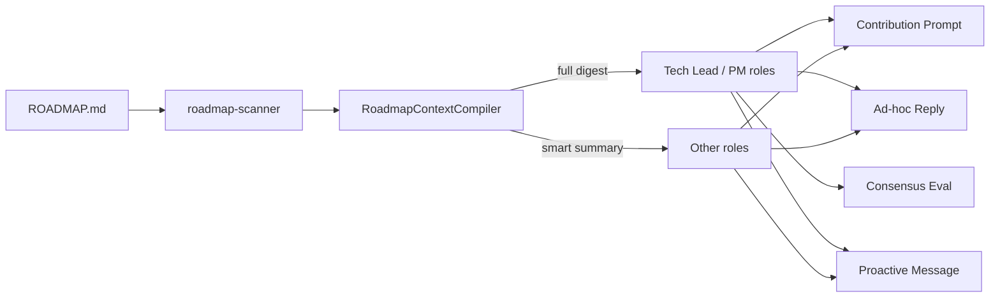
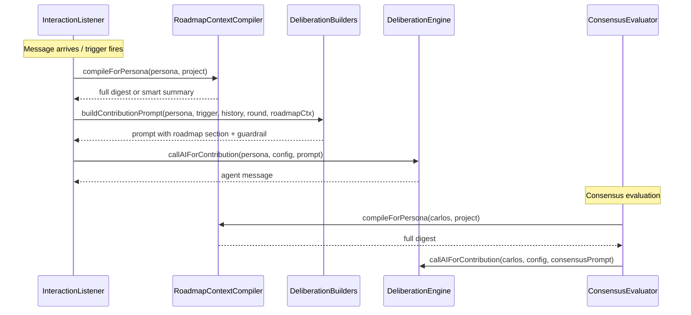

# PRD: Roadmap-Driven Agent Awareness & Ticket Slicing

**Complexity: 6 → MEDIUM mode**

| Factor                                     | Score |
| ------------------------------------------ | ----- |
| Touches 6-10 files                         | +2    |
| Multi-package changes (core + slack)       | +2    |
| New module from scratch (roadmap compiler) | +2    |
| **Total**                                  | **6** |

---

## 1. Context

**Problem:** Slack agents only see ROADMAP.md content during proactive messages. Deliberations, ad-hoc replies, and consensus evaluation operate without roadmap awareness, causing discussions to drift from project priorities and missing opportunities to slice roadmap items into actionable tickets.

**Files Analyzed:**

- `packages/slack/src/deliberation.ts` — `replyAsAgent`, `postProactiveMessage`, `runContributionRound`
- `packages/slack/src/deliberation-builders.ts` — `buildContributionPrompt`
- `packages/slack/src/consensus-evaluator.ts` — `evaluateConsensus`, `evaluateIssueReviewConsensus`
- `packages/slack/src/interaction-listener.ts` — `buildRoadmapContext`
- `packages/slack/src/proactive-loop.ts` — proactive sweep, roadmap context callback
- `packages/slack/src/cascading-reply-handler.ts` — ad-hoc reply orchestration
- `packages/core/src/utils/roadmap-scanner.ts` — `getRoadmapStatus`
- `packages/core/src/utils/roadmap-parser.ts` — `parseRoadmap`, `IRoadmapItem`
- `packages/core/src/shared/types.ts` — `IAgentPersona`, `IDiscussionTrigger`
- `packages/core/src/agents/soul-compiler.ts` — `compileSoul`
- `packages/core/src/storage/repositories/sqlite/agent-persona.defaults.ts` — persona definitions

**Current Behavior:**

- Roadmap context is **only** injected into proactive message prompts via `buildRoadmapContext()` (one-liner summary: "ProjectName: X/Y done. Next up: A, B, C").
- `buildContributionPrompt()` (deliberation) has **no** roadmap context — agents operate solely on trigger context (diffs, issue bodies).
- `replyAsAgent()` (ad-hoc replies) has **no** roadmap context — only project name.
- `ConsensusEvaluator` prompts have **no** roadmap context — Carlos makes calls blind to priorities.
- Persona `role` is a free-form string with no structured role categories for behavior differentiation.
- No mechanism exists for agents to propose ticket slices from roadmap items.

---

## 2. Solution

**Approach:**

- Create a **roadmap context compiler** in core that produces two formats: a **full roadmap digest** (structured markdown with all horizons, items, and status) and a **smart summary** (pending items from the current + next horizon, ~500 chars).
- Introduce a **role-based context depth** constant: roles containing "lead", "architect", or "product" get the full digest; all others get the smart summary. This is extensible via the free-form `role` field — when users CRUD a persona with a "Product Manager" role, they automatically get full roadmap context.
- **Inject roadmap context** into all four prompt paths: contribution prompts (deliberations), ad-hoc replies, consensus evaluation, and proactive messages (already partial).
- Add **soft guardrail instructions** to contribution and ad-hoc prompts: agents must relate their input to roadmap priorities; off-roadmap topics must be explicitly flagged as such.
- Add **ticket-slicing behavior** to proactive messages: agents can propose breaking down a roadmap item into smaller issues, posting the proposal in Slack for team discussion.

**Architecture:**



**Key Decisions:**

- Roadmap compiler lives in `@night-watch/core` so it can be reused by CLI and slack packages.
- Role matching uses case-insensitive substring checks (same pattern as `CascadingReplyHandler.reactionCandidatesForPersona`), not an enum — preserves free-form CRUD flexibility.
- Full digest is capped at ~3000 chars to stay within token budgets; smart summary at ~800 chars.
- Ticket slicing is propose-only — agents post proposals, humans approve and create via board tools.
- Roadmap context is resolved per-channel (scoped to channel's project) using the existing `buildRoadmapContext` callback pattern.

**Data Changes:** None — no schema or migration changes. Only prompt content changes.

---

## 3. Sequence Flow



---

## 4. Execution Phases

### Phase 1: Roadmap Context Compiler — "Agents can see the roadmap"

**Files (4):**

- `packages/core/src/utils/roadmap-context-compiler.ts` — NEW: compile roadmap into full/summary formats
- `packages/core/src/utils/roadmap-context-compiler.test.ts` — NEW: unit tests
- `packages/core/src/index.ts` — export new module
- `packages/core/src/shared/types.ts` — add `IRoadmapContextOptions` interface

**Implementation:**

- [ ] Create `compileRoadmapContext(status: IRoadmapStatus, options: IRoadmapContextOptions): string`
  - `options.mode: 'full' | 'summary'`
  - `options.maxChars?: number` (defaults: full=3000, summary=800)
  - **Full mode**: structured markdown with all horizons, pending items with descriptions, done counts, and the "Opinions & Notes" section. Includes item descriptions (truncated if needed).
  - **Summary mode**: only pending items from Short Term + first 3 Medium Term items. Title + section only, no descriptions.
- [ ] Create `isLeadRole(role: string): boolean` — returns true if role contains (case-insensitive): "lead", "architect", "product", "manager", "pm", "director".
- [ ] Create `compileRoadmapForPersona(persona: IAgentPersona, status: IRoadmapStatus): string` — convenience wrapper that calls `isLeadRole` to pick mode.
- [ ] Export from `packages/core/src/index.ts`.

**Tests Required:**

| Test File                                                  | Test Name                                               | Assertion                                              |
| ---------------------------------------------------------- | ------------------------------------------------------- | ------------------------------------------------------ |
| `packages/core/src/utils/roadmap-context-compiler.test.ts` | `should produce full digest for lead roles`             | Contains all horizon sections, item descriptions       |
| `packages/core/src/utils/roadmap-context-compiler.test.ts` | `should produce smart summary for non-lead roles`       | Only short-term + 3 medium-term items, no descriptions |
| `packages/core/src/utils/roadmap-context-compiler.test.ts` | `should respect maxChars limit`                         | Output length <= maxChars                              |
| `packages/core/src/utils/roadmap-context-compiler.test.ts` | `should return empty string when no items`              | Empty string for empty/disabled status                 |
| `packages/core/src/utils/roadmap-context-compiler.test.ts` | `isLeadRole matches Tech Lead, PM, Product Manager`     | Returns true for lead-like roles                       |
| `packages/core/src/utils/roadmap-context-compiler.test.ts` | `isLeadRole returns false for QA Engineer, Implementer` | Returns false for non-lead roles                       |

**Verification Plan:**

1. Unit tests pass: `yarn test packages/core/src/utils/roadmap-context-compiler.test.ts`
2. `yarn verify` passes

---

### Phase 2: Inject Roadmap into Deliberation Prompts — "Deliberations are roadmap-aware"

**Files (3):**

- `packages/slack/src/deliberation-builders.ts` — add `roadmapContext` param to `buildContributionPrompt`, add soft guardrail
- `packages/slack/src/deliberation.ts` — pass roadmap context through `runContributionRound` and `postProactiveMessage`
- `packages/slack/src/interaction-listener.ts` — refactor `buildRoadmapContext` to use compiler, expose `buildRoadmapForPersona` callback

**Implementation:**

- [ ] Update `buildContributionPrompt` signature to accept optional `roadmapContext: string` parameter.
- [ ] Add a `## Roadmap Priorities` section to the contribution prompt (between Context and Thread) when `roadmapContext` is provided:
  ```
  ## Roadmap Priorities
  ${roadmapContext}
  ```
- [ ] Add soft guardrail text to Step 2 of the contribution prompt:
  ```
  - Ground your feedback in the project roadmap when relevant. If what you're raising isn't on the roadmap, say so explicitly ("Not on the roadmap, but...").
  - Prioritize roadmap-aligned work over tangential improvements.
  ```
- [ ] In `runContributionRound`: resolve roadmap context per-persona via the compiler before calling `buildContributionPrompt`. Use existing `buildRoadmapContext` callback (from `InteractionListener`) to get raw status, then compile per-persona.
- [ ] Refactor `InteractionListener.buildRoadmapContext` to return `IRoadmapStatus` (raw) alongside the existing string. Add a new callback `buildRoadmapForPersona(channel: string, persona: IAgentPersona): string` that uses `compileRoadmapForPersona`.
- [ ] Update `ProactiveLoop` to use the new persona-aware callback (lead personas get full roadmap in proactive messages too).

**Tests Required:**

| Test File                                                          | Test Name                                              | Assertion                                                     |
| ------------------------------------------------------------------ | ------------------------------------------------------ | ------------------------------------------------------------- |
| `packages/slack/src/__tests__/slack/deliberation-builders.test.ts` | `should include roadmap section when context provided` | Output contains "Roadmap Priorities" section                  |
| `packages/slack/src/__tests__/slack/deliberation-builders.test.ts` | `should include soft guardrail in step 2`              | Output contains "Ground your feedback in the project roadmap" |
| `packages/slack/src/__tests__/slack/deliberation-builders.test.ts` | `should omit roadmap section when no context`          | Output does not contain "Roadmap Priorities"                  |

**Verification Plan:**

1. Unit tests pass
2. `yarn verify` passes

---

### Phase 3: Inject Roadmap into Ad-Hoc Replies & Consensus — "All interactions are roadmap-grounded"

**Files (3):**

- `packages/slack/src/deliberation.ts` — inject roadmap into `replyAsAgent` prompt, pass through from cascading handler
- `packages/slack/src/consensus-evaluator.ts` — inject roadmap into consensus prompt
- `packages/slack/src/cascading-reply-handler.ts` — thread roadmap callback through to `replyAsAgent`

**Implementation:**

- [ ] Update `replyAsAgent` signature to accept optional `roadmapContext: string` parameter.
- [ ] Add roadmap section to the ad-hoc reply prompt (after project context, before "Latest message"):
  ```
  (roadmapContext ? `Roadmap priorities:\n${roadmapContext}\n\n` : '')
  ```
- [ ] Add soft guardrail to ad-hoc prompt: `- When discussing work priorities, reference the roadmap. Flag off-roadmap suggestions as such.\n`
- [ ] In `CascadingReplyHandler`: thread a `roadmapCallback: (channel: string, persona: IAgentPersona) => string` through the constructor and pass it to all `replyAsAgent` calls.
- [ ] In `ConsensusEvaluator.evaluateConsensus`: inject roadmap context (full — Carlos is always lead) into the consensus prompt before the "Make the call" instruction:

  ```
  Roadmap priorities:
  ${roadmapContext}

  Consider whether the discussion outcomes align with roadmap priorities.
  ```

- [ ] Similarly update `evaluateIssueReviewConsensus` — add roadmap context so Carlos can assess whether an issue aligns with the roadmap.

**Tests Required:**

| Test File                                                            | Test Name                                             | Assertion                                               |
| -------------------------------------------------------------------- | ----------------------------------------------------- | ------------------------------------------------------- |
| `packages/slack/src/__tests__/slack/consensus-evaluator.test.ts`     | `should include roadmap in consensus prompt`          | AI call receives prompt containing "Roadmap priorities" |
| `packages/slack/src/__tests__/slack/cascading-reply-handler.test.ts` | `should pass roadmap context through to replyAsAgent` | `replyAsAgent` called with roadmap context string       |

**Verification Plan:**

1. Unit tests pass
2. `yarn verify` passes

---

### Phase 4: Proactive Ticket Slicing — "Agents propose actionable ticket slices"

**Files (3):**

- `packages/slack/src/deliberation.ts` — add ticket slicing to proactive message prompt options
- `packages/slack/src/proactive-loop.ts` — add slicing sweep cadence (less frequent than regular proactive)
- `packages/slack/src/__tests__/slack/proactive-loop.test.ts` — update/add tests

**Implementation:**

- [ ] Add a new proactive action option to the proactive message prompt in `postProactiveMessage`:
  ```
  - Propose breaking a large roadmap item into smaller tickets: name the item, suggest 2-3 sub-tasks with a one-sentence scope each. Ask the team: "Does this split make sense?"
  ```
- [ ] Add prompt guidance for ticket slicing:
  ```
  - When proposing ticket slices, be specific: name the parent roadmap item, list concrete sub-tasks with clear boundaries. Example: "The 'Add Gemini CLI provider' roadmap item could split into: 1) Add provider config + CLI flag, 2) Implement invocation strategy, 3) Add integration test. Thoughts?"
  - Only propose slicing for items that are clearly too large or underspecified. Don't slice items that are already focused enough.
  ```
- [ ] In `ProactiveLoop`: add a `lastSlicingSweep` timestamp and a `SLICING_INTERVAL_MS` (4 hours). During the sweep, if it's been > 4 hours since last slicing attempt, pick a lead-role persona (preferring Carlos) and set a `slicingMode: true` flag that biases the prompt toward ticket slicing for that one message.
- [ ] The ticket slicing proposal is purely conversational — posted as a regular proactive message. Team discusses in the resulting thread. Users can then use board tools (`open_github_issue`) in the thread to create actual tickets.

**Tests Required:**

| Test File                                                   | Test Name                                     | Assertion                                          |
| ----------------------------------------------------------- | --------------------------------------------- | -------------------------------------------------- |
| `packages/slack/src/__tests__/slack/proactive-loop.test.ts` | `should trigger slicing sweep after interval` | Slicing callback invoked when interval exceeded    |
| `packages/slack/src/__tests__/slack/proactive-loop.test.ts` | `should not trigger slicing before interval`  | Slicing callback not invoked when interval not met |

**Verification Plan:**

1. Unit tests pass
2. `yarn verify` passes
3. Manual: start slack bot, wait for proactive message, verify roadmap context appears in agent's contribution

---

## 5. Acceptance Criteria

- [ ] All phases complete
- [ ] All specified tests pass
- [ ] `yarn verify` passes
- [ ] Roadmap context appears in deliberation contribution prompts (leads get full, others get summary)
- [ ] Roadmap context appears in ad-hoc reply prompts
- [ ] Roadmap context appears in consensus evaluation prompts
- [ ] Soft guardrails present in contribution and ad-hoc prompts
- [ ] Proactive messages can propose ticket slices
- [ ] Role-based context depth works for any custom persona role (not hardcoded to the 4 defaults)
- [ ] No new personas or schema changes required — behavior is role-string-driven
