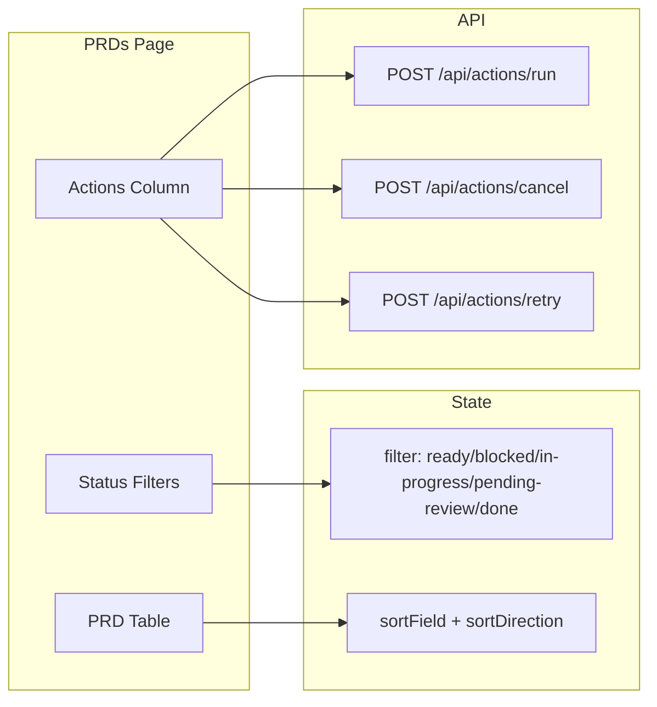
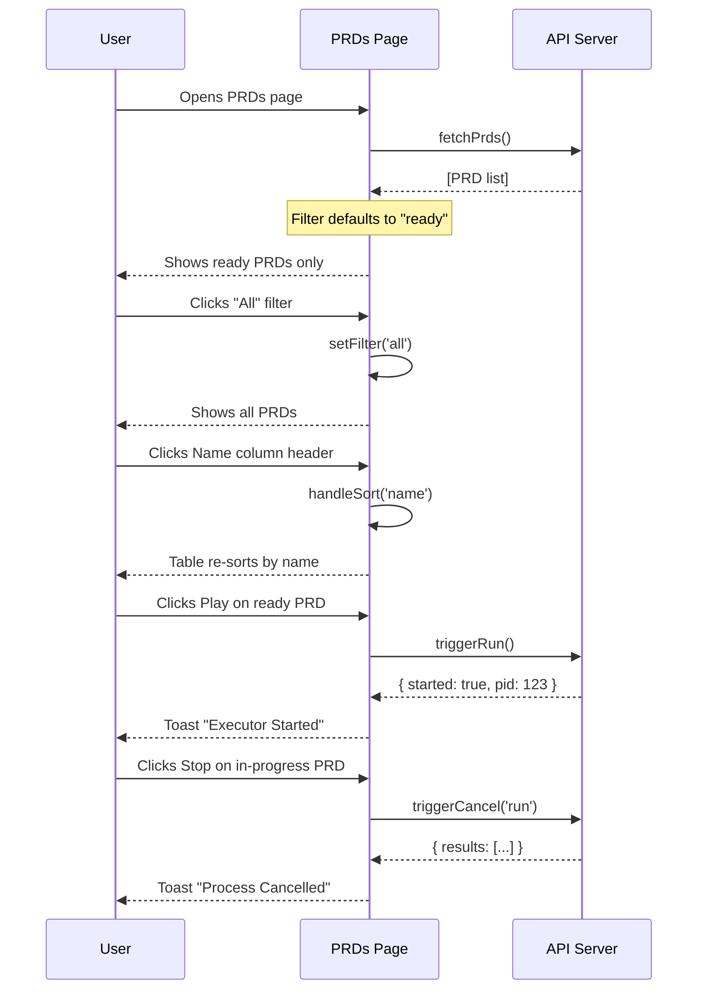

# PRD: Web UI PRDs Page Functionality Enhancements

**Complexity: 4 → MEDIUM mode**

---

## 1. Context

**Problem:** The PRDs web UI page has several UX issues that make it non-functional for day-to-day operations:

1. Status filter buttons are non-functional (they are static spans, not clickable buttons)
2. No default filtering - "done" PRDs are shown by default, cluttering the view
3. Sort button does nothing (no sort implementation)
4. "New PRD" button exists but functionality is not needed (PRDs created via CLI)
5. No actions column in the table - users must click row to open slide-over for execute/retry
6. Table headers are not clickable for sorting

**Files Analyzed:**

- `web/pages/PRDs.tsx` — Main PRDs page component (needs complete overhaul)
- `web/pages/PRs.tsx` — Reference implementation with working filter/sort patterns
- `web/pages/Dashboard.tsx` — Reference for cancel process functionality
- `web/api.ts` — API client with existing functions: `triggerRun`, `triggerCancel`, `retryPrd`

**Current Behavior:**

- Filter buttons render as static `<span>` elements with no click handlers
- All PRDs are shown regardless of status
- Sort button exists but has no implementation
- Actions column exists but only shows a MoreVertical icon with no functionality
- Execute/Retry only available in slide-over panel
- New PRD modal exists but is not connected to any backend

---

## 2. Solution

**Approach:**

1. **Implement functional status filtering** - Default to showing "ready" PRDs only; add clickable filter buttons following PRs.tsx pattern
2. **Remove "New PRD" button** - PRDs are created via CLI, not web UI
3. **Replace sort button with clickable column headers** - Follow PRs.tsx pattern with sort indicators
4. **Add actions column with per-row actions** - Play (execute), Stop (cancel), RotateCcw (retry) based on PRD status
5. **Keep slide-over for details** - But actions are now also available in table row

**Architecture Diagram:**



**Key Decisions:**

- [x] Default filter set to "ready" (not "all") - shows actionable PRDs first
- [x] Sorting via column header clicks (same UX as PRs page)
- [x] Actions show contextually: Play for ready/blocked, Stop for in-progress, Retry for done
- [x] Remove "New PRD" button entirely (not just hide)
- [x] Remove standalone Sort button (replaced by header clicks)

**Data Changes:** None

---

## 3. Sequence Flow



---

## 4. Execution Phases

### Phase 1: Implement Status Filtering with Default "Ready"

**User-visible outcome:** Filter buttons are functional and default shows only "ready" PRDs.

**Files (1):**

- `web/pages/PRDs.tsx` — Add filter state and logic

**Implementation:**

- [ ] Add imports: `useMemo` from React, `ArrowUp`, `ArrowDown`, `ArrowUpDown` from lucide-react
- [ ] Add type: `type FilterType = 'all' | 'ready' | 'in-progress' | 'blocked' | 'pending-review' | 'done';`
- [ ] Add state: `const [filter, setFilter] = useState<FilterType>('ready');`
- [ ] Create `filteredPrds` using `useMemo` that filters based on filter state
- [ ] Replace static filter `<span>` elements with clickable `<button>` elements following PRs.tsx pattern
- [ ] Update filter buttons to include "Done" option
- [ ] Use `filteredPrds` instead of `prds` in table/card rendering
- [ ] Update empty state message to indicate when filter yields no results

**Filter Button Styling (from PRs.tsx pattern):**

```tsx
<button
  onClick={() => setFilter('ready')}
  className={`px-3 py-1 rounded-full text-xs font-medium cursor-pointer border transition-colors ${
    filter === 'ready'
      ? 'bg-green-900/50 text-green-300 border-green-800'
      : 'text-slate-500 hover:bg-slate-800 hover:text-slate-300 border-transparent'
  }`}
>
  Ready
</button>
```

**Tests Required:**
| Test File | Test Name | Assertion |
|-----------|-----------|-----------|
| Manual | Page loads | Only "ready" PRDs shown by default |
| Manual | Click "All" | All PRDs shown |
| Manual | Click "Done" | Only done PRDs shown |
| Manual | Click filter when no matching PRDs | Empty state shows |

**Verification Plan:**

1. `yarn verify` passes
2. Manual: Start web UI, navigate to PRDs, verify default filter is "ready"
3. Manual: Click each filter button, verify correct filtering

---

### Phase 2: Add Column Header Sorting

**User-visible outcome:** Clicking table column headers sorts the table; sort indicators show current sort state.

**Files (1):**

- `web/pages/PRDs.tsx` — Add sort state and logic

**Implementation:**

- [ ] Add types:
  ```typescript
  type SortField = 'name' | 'status' | 'dependencies';
  type SortDirection = 'asc' | 'desc';
  ```
- [ ] Add state:
  ```typescript
  const [sortField, setSortField] = useState<SortField>('name');
  const [sortDirection, setSortDirection] = useState<SortDirection>('asc');
  ```
- [ ] Create `sortedPrds` using `useMemo` that sorts `filteredPrds` based on sort state
- [ ] Add `handleSort` function:
  ```typescript
  const handleSort = (field: SortField) => {
    if (sortField === field) {
      setSortDirection(sortDirection === 'asc' ? 'desc' : 'asc');
    } else {
      setSortField(field);
      setSortDirection('asc');
    }
  };
  ```
- [ ] Add `getSortIcon` function following PRs.tsx pattern
- [ ] Make table headers (`<th>`) clickable with `onClick={() => handleSort('fieldName')}`
- [ ] Add sort icon to each sortable header
- [ ] Update table to use `sortedPrds` instead of `filteredPrds`
- [ ] Remove the standalone "Sort" button from header

**Sort Logic:**

```typescript
const sortedPrds = useMemo(() => {
  const sorted = [...filteredPrds].sort((a, b) => {
    let comparison = 0;
    switch (sortField) {
      case 'name':
        comparison = a.name.localeCompare(b.name);
        break;
      case 'status':
        // Order: ready < blocked < in-progress < pending-review < done
        const statusOrder = {
          ready: 0,
          blocked: 1,
          'in-progress': 2,
          'pending-review': 3,
          done: 4,
        };
        comparison = (statusOrder[a.status] ?? 5) - (statusOrder[b.status] ?? 5);
        break;
      case 'dependencies':
        comparison = a.dependencies.length - b.dependencies.length;
        break;
    }
    return sortDirection === 'asc' ? comparison : -comparison;
  });
  return sorted;
}, [filteredPrds, sortField, sortDirection]);
```

**Tests Required:**
| Test File | Test Name | Assertion |
|-----------|-----------|-----------|
| Manual | Click Name header | Sorts alphabetically, toggles direction |
| Manual | Click Status header | Sorts by status priority |
| Manual | Click Dependencies header | Sorts by dependency count |
| Manual | Sort icon changes | Icon shows up/down based on direction |

**Verification Plan:**

1. `yarn verify` passes
2. Manual: Click each column header, verify sorting works
3. Manual: Verify sort direction toggles on repeated clicks

---

### Phase 3: Add Actions Column with Execute/Stop/Retry

**User-visible outcome:** Each row has an actions column with context-appropriate action buttons.

**Files (1):**

- `web/pages/PRDs.tsx` — Add actions column

**Implementation:**

- [ ] Add imports: `Square` from lucide-react (for stop icon - or use `XCircle`)
- [ ] Add state for tracking action in progress:
  ```typescript
  const [executingPrd, setExecutingPrd] = useState<string | null>(null);
  const [cancellingPrd, setCancellingPrd] = useState<string | null>(null);
  const [retryingPrd, setRetryingPrd] = useState<string | null>(null);
  ```
- [ ] Create `handleExecutePrd` function:
  ```typescript
  const handleExecutePrd = async (prdName: string, e: React.MouseEvent) => {
    e.stopPropagation();
    setExecutingPrd(prdName);
    try {
      const result = await triggerRun();
      addToast({
        title: 'Executor Started',
        message: result.pid ? `Started with PID ${result.pid}` : 'Executor started',
        type: 'success',
      });
      refetch();
    } catch (err) {
      addToast({
        title: 'Execute Failed',
        message: err instanceof Error ? err.message : 'Failed to start executor',
        type: 'error',
      });
    } finally {
      setExecutingPrd(null);
    }
  };
  ```
- [ ] Create `handleStopPrd` function:
  ```typescript
  const handleStopPrd = async (prdName: string, e: React.MouseEvent) => {
    e.stopPropagation();
    setCancellingPrd(prdName);
    try {
      const result = await triggerCancel('run');
      const allOk = result.results.every((r) => r.success);
      addToast({
        title: allOk ? 'Process Cancelled' : 'Cancel Failed',
        message: result.results.map((r) => r.message).join('; '),
        type: allOk ? 'success' : 'error',
      });
      if (allOk) refetch();
    } catch (err) {
      addToast({
        title: 'Cancel Failed',
        message: err instanceof Error ? err.message : 'Failed to cancel process',
        type: 'error',
      });
    } finally {
      setCancellingPrd(null);
    }
  };
  ```
- [ ] Create `handleRetryPrd` function:
  ```typescript
  const handleRetryPrd = async (prdName: string, e: React.MouseEvent) => {
    e.stopPropagation();
    setRetryingPrd(prdName);
    try {
      const result = await retryPrd(prdName);
      addToast({
        title: 'PRD Queued',
        message: result.message,
        type: 'success',
      });
      refetch();
    } catch (err) {
      addToast({
        title: 'Retry Failed',
        message: err instanceof Error ? err.message : 'Failed to retry PRD',
        type: 'error',
      });
    } finally {
      setRetryingPrd(null);
    }
  };
  ```
- [ ] Replace the existing actions `<td>` with conditional action buttons:
  ```tsx
  <td className="px-6 py-4 whitespace-nowrap text-right" onClick={(e) => e.stopPropagation()}>
    {prd.status === 'ready' || prd.status === 'blocked' ? (
      <Button
        variant="ghost"
        size="sm"
        onClick={(e) => handleExecutePrd(prd.name, e)}
        disabled={executingPrd === prd.name}
        className="text-green-400 hover:text-green-300"
      >
        {executingPrd === prd.name ? (
          <Loader2 className="h-4 w-4 animate-spin" />
        ) : (
          <Play className="h-4 w-4" />
        )}
      </Button>
    ) : prd.status === 'in-progress' ? (
      <Button
        variant="ghost"
        size="sm"
        onClick={(e) => handleStopPrd(prd.name, e)}
        disabled={cancellingPrd === prd.name}
        className="text-red-400 hover:text-red-300"
      >
        {cancellingPrd === prd.name ? (
          <Loader2 className="h-4 w-4 animate-spin" />
        ) : (
          <Square className="h-4 w-4" />
        )}
      </Button>
    ) : prd.status === 'done' ? (
      <Button
        variant="ghost"
        size="sm"
        onClick={(e) => handleRetryPrd(prd.name, e)}
        disabled={retryingPrd === prd.name}
        className="text-amber-400 hover:text-amber-300"
      >
        {retryingPrd === prd.name ? (
          <Loader2 className="h-4 w-4 animate-spin" />
        ) : (
          <RotateCcw className="h-4 w-4" />
        )}
      </Button>
    ) : null}
  </td>
  ```
- [ ] Update actions column header to say "Actions" (visible)
- [ ] Add `Loader2` import from lucide-react

**Tests Required:**
| Test File | Test Name | Assertion |
|-----------|-----------|-----------|
| Manual | Click Play on ready PRD | Executor starts, toast shows success |
| Manual | Click Stop on in-progress PRD | Process cancelled, toast shows success |
| Manual | Click Retry on done PRD | PRD moved to ready, toast shows success |
| Manual | Action button shows spinner | While action in progress, spinner shows |

**Verification Plan:**

1. `yarn verify` passes
2. Manual: For each PRD status, verify correct action button appears
3. Manual: Click each action type, verify API called and toast shown

---

### Phase 4: Remove New PRD Button and Modal

**User-visible outcome:** "New PRD" button is removed; the modal code is removed.

**Files (1):**

- `web/pages/PRDs.tsx` — Remove unused code

**Implementation:**

- [ ] Remove "New PRD" button from header
- [ ] Remove `isModalOpen` state
- [ ] Remove `handleCreate` function
- [ ] Remove the entire "New PRD Modal" JSX block
- [ ] Remove `Modal` import from components
- [ ] Remove `Plus` import from lucide-react (if no longer used)

**Tests Required:**
| Test File | Test Name | Assertion |
|-----------|-----------|-----------|
| Manual | Header renders | No "New PRD" button visible |
| Manual | Click existing PRD | Slide-over still works |

**Verification Plan:**

1. `yarn verify` passes
2. Manual: Verify no "New PRD" button in header
3. Manual: Verify clicking PRD row still opens slide-over

---

### Phase 5: Update Card View with Actions

**User-visible outcome:** Card view also has action buttons for consistency.

**Files (1):**

- `web/pages/PRDs.tsx` — Add actions to card view

**Implementation:**

- [ ] Add action buttons to each card, similar to table actions
- [ ] Position actions at bottom of card, after dependencies
- [ ] Use same conditional logic for which action to show

**Card Actions Pattern:**

```tsx
<div className="mt-4 pt-4 border-t border-slate-800 flex justify-end">
  {prd.status === 'ready' || prd.status === 'blocked' ? (
    <Button
      size="sm"
      onClick={(e) => {
        e.stopPropagation();
        handleExecutePrd(prd.name, e);
      }}
    >
      <Play className="h-4 w-4 mr-1" /> Execute
    </Button>
  ) : prd.status === 'in-progress' ? (
    <Button
      size="sm"
      variant="danger"
      onClick={(e) => {
        e.stopPropagation();
        handleStopPrd(prd.name, e);
      }}
    >
      <Square className="h-4 w-4 mr-1" /> Stop
    </Button>
  ) : prd.status === 'done' ? (
    <Button
      size="sm"
      variant="outline"
      onClick={(e) => {
        e.stopPropagation();
        handleRetryPrd(prd.name, e);
      }}
    >
      <RotateCcw className="h-4 w-4 mr-1" /> Retry
    </Button>
  ) : null}
</div>
```

**Tests Required:**
| Test File | Test Name | Assertion |
|-----------|-----------|-----------|
| Manual | Switch to card view | Cards render with action buttons |
| Manual | Click action on card | Action executes, not just card selection |

**Verification Plan:**

1. `yarn verify` passes
2. Manual: Switch to card view, verify action buttons appear
3. Manual: Click action on card, verify it executes (doesn't just open slide-over)

---

## 5. Acceptance Criteria

- [ ] All phases complete
- [ ] `yarn verify` passes
- [ ] Default view shows only "ready" PRDs
- [ ] Filter buttons work for all statuses (all, ready, in-progress, blocked, pending-review, done)
- [ ] Column headers are clickable for sorting with visual indicators
- [ ] Actions column shows context-appropriate buttons (Play/Stop/Retry)
- [ ] "New PRD" button removed
- [ ] Card view also has action buttons
- [ ] Slide-over still works for viewing PRD details
- [ ] No console errors in browser

---

## Summary of Changes

| Component      | Before                             | After                                    |
| -------------- | ---------------------------------- | ---------------------------------------- |
| Filter buttons | Static spans (non-functional)      | Clickable buttons with active state      |
| Default filter | None (shows all)                   | "ready"                                  |
| Sorting        | Standalone button (non-functional) | Clickable column headers with indicators |
| Actions column | MoreVertical icon (no action)      | Play/Stop/Retry based on status          |
| New PRD        | Button + Modal                     | Removed                                  |
| Card view      | No actions                         | Same action buttons as table             |

---

## Integration Points Checklist

**How will this feature be reached?**

- [x] Entry point identified: `/prds` route via Sidebar navigation
- [x] Caller file identified: `web/App.tsx` (routes already configured)
- [x] Registration/wiring needed: None - route exists

**Is this user-facing?**

- [x] YES → UI components: PRDs.tsx page with filter/sort/actions

**Full user flow:**

1. User does: Click "PRDs" in sidebar
2. Triggers: Navigate to `/prds` route
3. Reaches new feature via: PRDs.tsx component renders with enhanced functionality
4. Result displayed in: Filter/sort controls in header, actions in table rows and cards
