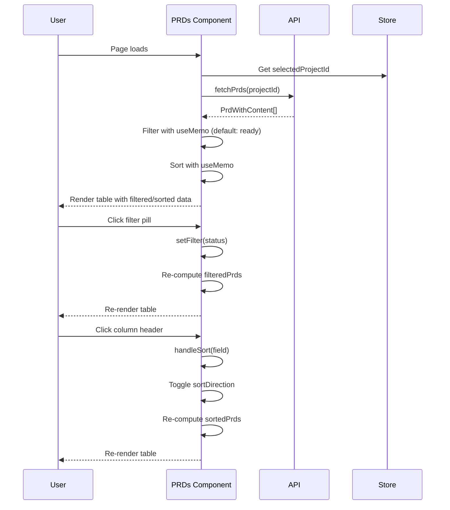

# PRD: Fix PRDs Web UI Functionality

**Complexity: 2 (LOW)**

---

## 1. Context

### Problem

The PRDs web UI page (`/prds`) has non-functional filtering and sorting. Status filter pills are hardcoded visual elements without click handlers, and there is no sortable column header interaction. The page also displays "done" PRDs by default when they should be hidden.

### Files Analyzed

- `/home/joao/projects/night-watch-cli/web/pages/PRDs.tsx` - Main PRDs page component (broken)
- `/home/joao/projects/night-watch-cli/web/pages/PRs.tsx` - Reference implementation with working filter/sort
- `/home/joao/projects/night-watch-cli/web/api.ts` - API client with `PrdWithContent` type
- `/home/joao/projects/night-watch-cli/web/store/useStore.ts` - Zustand store
- `/home/joao/projects/night-watch-cli/web/components/ui/Badge.tsx` - Badge component
- `/home/joao/projects/night-watch-cli/web/components/ui/Button.tsx` - Button component

### Current Behavior

1. **Filter Pills Non-functional**: The status filter pills ("All", "Ready", "In Progress") at lines 124-128 are static spans with no `onClick` handlers and no state binding
2. **Sort Button Non-functional**: The "Sort" button at lines 131-134 has no `onClick` handler
3. **No Column Header Sorting**: Table headers at lines 148-153 are not clickable
4. **"Done" PRDs Visible by Default**: All PRDs including "done" status are displayed
5. **"New PRD" Button Should Be Removed**: Per requirements, the "New PRD" button should be removed

---

## 2. Solution

### Approach

1. **Remove "New PRD" button and modal** - Simplify the page by removing the unused PRD creation functionality
2. **Remove standalone "Sort" button** - Sorting will be handled via clickable column headers
3. **Implement status filtering** - Use the same pattern as `PRs.tsx`: filter type, state, and `useMemo` for filtered results
4. **Default filter to exclude "done"** - Set initial filter state to "ready" instead of "all"
5. **Implement column header sorting** - Use the same pattern as `PRs.tsx`: sort field, sort direction, and clickable headers with visual indicators
6. **Add Actions column** - Add per-row action buttons (Play for execute, RotateCcw for retry)

### Key Decisions

- **Reuse PRs.tsx patterns**: The PRs page has a proven implementation of filtering/sorting with `useMemo`, type definitions, and click handlers
- **Use existing UI components**: Badge, Button, and Lucide icons are already imported
- **Keep list/card view toggle**: This functionality works correctly
- **Keep detail slide-over**: The existing detail panel works correctly

### Architecture Diagram

```mermaid
flowchart LR
    subgraph State
        F[filter: FilterType]
        SF[sortField: SortField]
        SD[sortDirection: SortDirection]
    end

    subgraph Data Flow
        API[fetchPrds API] --> Raw[prds: PrdWithContent[]]
        Raw --> |useMemo + filter| Filtered[filteredPrds]
        Filtered --> |useMemo + sort| Sorted[sortedPrds]
        Sorted --> Table[Table Rows]
    end

    subgraph UI
        FP[Filter Pills] --> |setFilter| F
        CH[Column Headers] --> |handleSort| SF
        CH --> |handleSort| SD
    end
```

---

## 3. Sequence Flow



---

## 4. Execution Phases

### Phase 1: Remove Unused Features - Simplify page by removing "New PRD" button and modal

**Files (max 5):**

- `/home/joao/projects/night-watch-cli/web/pages/PRDs.tsx` - Remove "New PRD" button, modal, and related state/handlers

**Implementation:**

- [ ] Remove `isModalOpen` state variable
- [ ] Remove `handleCreate` function
- [ ] Remove the "New PRD" button (lines 135-138)
- [ ] Remove the entire "New PRD Modal" section (lines 239-290)
- [ ] Remove unused `Plus` icon import

**Tests Required:**

| Test File | Test Name | Assertion |
|-----------|-----------|-----------|
| Manual verification | "New PRD button removed" | No "New PRD" button visible |
| Manual verification | "Modal not rendered" | Clicking anywhere does not open modal |

**User Verification:**

- Action: Load the PRDs page
- Expected: No "New PRD" button in the header area

---

### Phase 2: Implement Status Filtering - Add functional filter pills with "ready" as default

**Files (max 5):**

- `/home/joao/projects/night-watch-cli/web/pages/PRDs.tsx` - Add filter state and functional filter pills

**Implementation:**

- [ ] Add `FilterType` type definition: `'all' | 'ready' | 'in-progress' | 'blocked' | 'pending-review' | 'done'`
- [ ] Add `filter` state with `useState<FilterType>('ready')` (default excludes "done")
- [ ] Add `filteredPrs` `useMemo` hook that filters `prds` based on `filter` value
- [ ] Update filter pills to be buttons with `onClick={() => setFilter('status')}`
- [ ] Add dynamic styling to show active filter pill (matching PRs.tsx pattern)
- [ ] Update table body to render `filteredPrs` instead of `prds`
- [ ] Update card view to render `filteredPrs` instead of `prds`
- [ ] Update empty state message to indicate filter state

**Tests Required:**

| Test File | Test Name | Assertion |
|-----------|-----------|-----------|
| Manual verification | "Default filter is ready" | Page loads with "Ready" pill selected, done PRDs hidden |
| Manual verification | "Filter pills clickable" | Clicking each filter pill updates the displayed PRDs |
| Manual verification | "All filter shows done" | Clicking "All" shows PRDs with done status |

**User Verification:**

- Action: Load the PRDs page
- Expected: "Ready" filter is selected by default, done PRDs are hidden
- Action: Click "All" filter
- Expected: All PRDs including done are visible

---

### Phase 3: Implement Column Header Sorting - Add clickable headers with sort indicators

**Files (max 5):**

- `/home/joao/projects/night-watch-cli/web/pages/PRDs.tsx` - Add sort functionality to table headers

**Implementation:**

- [ ] Remove the standalone "Sort" button from header
- [ ] Add `SortField` type: `'name' | 'status' | 'dependencies'`
- [ ] Add `SortDirection` type: `'asc' | 'desc'`
- [ ] Add `sortField` state with `useState<SortField>('name')`
- [ ] Add `sortDirection` state with `useState<SortDirection>('asc')`
- [ ] Add `sortedPrs` `useMemo` that sorts `filteredPrs` based on sort state
- [ ] Add `handleSort(field: SortField)` function that toggles direction
- [ ] Add `getSortIcon(field: SortField)` function for visual indicator
- [ ] Import `ArrowUp`, `ArrowDown`, `ArrowUpDown` from lucide-react
- [ ] Update table headers to be clickable with `onClick={() => handleSort('field')}`
- [ ] Add sort icon to each sortable header
- [ ] Update table body to render `sortedPrs`
- [ ] Remove unused `SortAsc` icon import

**Tests Required:**

| Test File | Test Name | Assertion |
|-----------|-----------|-----------|
| Manual verification | "Click name header sorts asc" | Clicking Name header sorts alphabetically A-Z |
| Manual verification | "Click again sorts desc" | Clicking Name header again sorts Z-A |
| Manual verification | "Status sort works" | Clicking Status header sorts by status order |
| Manual verification | "Dependencies sort works" | Clicking Dependencies header sorts by dependency count |

**User Verification:**

- Action: Click "Name" column header
- Expected: Table sorts by name ascending, up arrow visible
- Action: Click "Name" column header again
- Expected: Table sorts by name descending, down arrow visible
- Action: Click "Status" column header
- Expected: Table sorts by status, previous sort cleared

---

### Phase 4: Add Actions Column - Add execute/retry buttons per row

**Files (max 5):**

- `/home/joao/projects/night-watch-cli/web/pages/PRDs.tsx` - Add action buttons to table rows

**Implementation:**

- [ ] Replace the existing Actions column (MoreVertical button) with functional actions
- [ ] For `ready` status: Show Play button that triggers `handleExecuteNow`
- [ ] For `in-progress` status: Show spinning loader or disabled state
- [ ] For `done` status: Show RotateCcw button that triggers `handleRetry`
- [ ] For `blocked`/`pending-review` status: Show appropriate indicator or no action
- [ ] Add `stopPropagation` on action buttons to prevent row selection when clicking action
- [ ] Add tooltip or aria-label for accessibility

**Tests Required:**

| Test File | Test Name | Assertion |
|-----------|-----------|-----------|
| Manual verification | "Ready PRD shows Play" | PRDs with ready status show Play icon button |
| Manual verification | "Done PRD shows Retry" | PRDs with done status show RotateCcw icon button |
| Manual verification | "Action executes" | Clicking Play starts executor and shows toast |
| Manual verification | "Action retries" | Clicking Retry moves PRD and shows toast |

**User Verification:**

- Action: Look at a PRD with "ready" status in the table
- Expected: Play icon button visible in Actions column
- Action: Click the Play button
- Expected: Executor starts, toast notification appears, row not selected

---

## 5. Verification Strategy

### Verification Plan

1. **Unit Tests:**
   - Not applicable - This project uses manual verification for web UI components (no web test infrastructure)

2. **Manual Browser Testing:**
   - File: `web/pages/PRDs.tsx`
   - Tests: All phases above include specific manual verification steps

3. **Build Verification:**
   ```bash
   cd /home/joao/projects/night-watch-cli && yarn verify
   cd web && yarn build
   ```

4. **Evidence Required:**
   - [ ] `yarn verify` passes (TypeScript + ESLint for CLI)
   - [ ] `yarn build:web` passes (Vite build succeeds)
   - [ ] Manual browser test for each phase complete

---

## 6. Acceptance Criteria

- [ ] All phases complete
- [ ] "New PRD" button and modal removed
- [ ] Standalone "Sort" button removed
- [ ] Filter pills are clickable and filter the PRD list
- [ ] Default filter excludes "done" status (shows "ready" by default)
- [ ] Column headers are clickable and sort the table
- [ ] Sort direction indicators (arrows) appear in headers
- [ ] Actions column has functional Play/Retry buttons
- [ ] `yarn verify` passes
- [ ] `yarn build:web` passes
- [ ] Feature is reachable (existing route `/prds`)
- [ ] UI components follow existing patterns (PRs.tsx style)

---

## 7. Implementation Notes

### State Management Pattern (from PRs.tsx)

```typescript
type FilterType = 'all' | 'ready' | 'in-progress' | 'blocked' | 'pending-review' | 'done';
type SortField = 'name' | 'status' | 'dependencies';
type SortDirection = 'asc' | 'desc';

const [filter, setFilter] = useState<FilterType>('ready');
const [sortField, setSortField] = useState<SortField>('name');
const [sortDirection, setSortDirection] = useState<SortDirection>('asc');

const filteredPrs = useMemo(() => {
  return prds.filter((prd) => {
    if (filter === 'all') return true;
    return prd.status === filter;
  });
}, [prds, filter]);

const sortedPrs = useMemo(() => {
  return [...filteredPrs].sort((a, b) => {
    let comparison = 0;
    switch (sortField) {
      case 'name':
        comparison = a.name.localeCompare(b.name);
        break;
      case 'status':
        comparison = a.status.localeCompare(b.status);
        break;
      case 'dependencies':
        comparison = a.dependencies.length - b.dependencies.length;
        break;
    }
    return sortDirection === 'asc' ? comparison : -comparison;
  });
}, [filteredPrs, sortField, sortDirection]);

const handleSort = (field: SortField) => {
  if (sortField === field) {
    setSortDirection(sortDirection === 'asc' ? 'desc' : 'asc');
  } else {
    setSortField(field);
    setSortDirection('asc');
  }
};
```

### Filter Pill Pattern (from PRs.tsx)

```typescript
<button
  onClick={() => setFilter('ready')}
  className={`px-3 py-1 rounded-full text-xs font-medium cursor-pointer border transition-colors ${
    filter === 'ready'
      ? 'bg-green-900/50 text-green-300 border-green-800'
      : 'text-slate-500 hover:bg-slate-800 hover:text-slate-300 border-transparent'
  }`}
>
  Ready
</button>
```

### Sort Header Pattern (from PRs.tsx)

```typescript
<th
  className="px-6 py-3 text-left text-xs font-medium text-slate-500 uppercase tracking-wider cursor-pointer hover:text-slate-300"
  onClick={() => handleSort('name')}
>
  <div className="flex items-center space-x-1">
    <span>Name</span>
    {getSortIcon('name')}
  </div>
</th>
```

### Actions Column Pattern

```typescript
<td className="px-6 py-4 whitespace-nowrap text-right">
  {prd.status === 'ready' && (
    <button
      className="text-slate-500 hover:text-green-400 transition-colors"
      onClick={(e) => { e.stopPropagation(); handleExecuteNow(); }}
      aria-label="Execute PRD"
    >
      <Play className="h-4 w-4" />
    </button>
  )}
  {prd.status === 'done' && (
    <button
      className="text-slate-500 hover:text-indigo-400 transition-colors"
      onClick={(e) => { e.stopPropagation(); handleRetry(prd.name); }}
      aria-label="Retry PRD"
    >
      <RotateCcw className="h-4 w-4" />
    </button>
  )}
</td>
```
