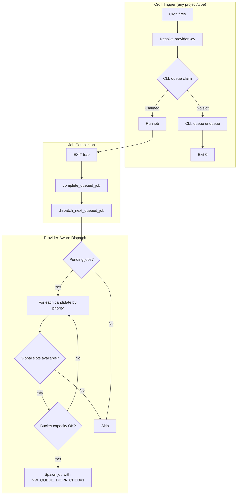
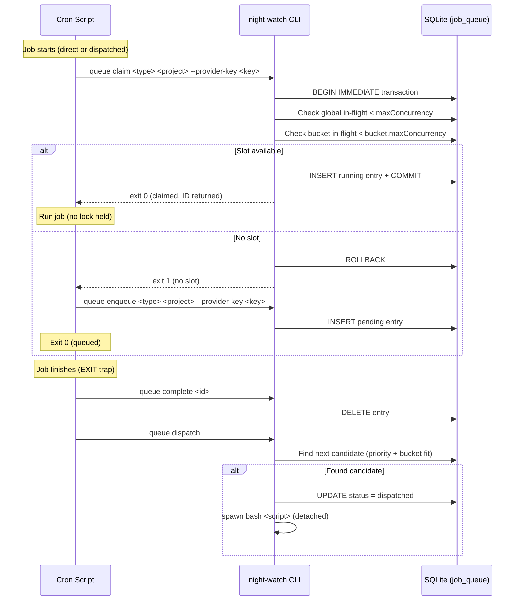

# PRD: Provider-Aware Queue with Per-Bucket Concurrency

## Complexity: 7 → HIGH

```
+3  Touches 10+ files (6 cron scripts, helpers.sh, job-queue.ts, queue.ts, env-builder.ts, constants.ts, Scheduling.tsx)
+2  Complex concurrency (DB-only coordination, dispatch chain rework)
+2  Multi-package changes (core, cli, web, scripts)
```

---

## 1. Context

**Problem:** The global flock gate (`~/.night-watch/queue.lock`) is held for the **entire duration** of a running job, serializing ALL jobs across ALL projects and ALL job types — even when they use different API providers that could safely run in parallel.

**Files Analyzed:**

- `scripts/night-watch-helpers.sh` — gate functions (acquire/release/arm) — flock functions to be removed
- `scripts/night-watch-{cron,pr-reviewer-cron,qa-cron,audit-cron,slicer-cron,plan-cron}.sh`
- `packages/core/src/utils/job-queue.ts` — DB-based queue with provider-aware dispatch (partially wired)
- `packages/core/src/types.ts` — `IQueueConfig`, `IProviderBucketConfig`, `IQueueEntry`
- `packages/core/src/constants.ts` — `resolveProviderBucketKey()`, `DEFAULT_QUEUE`
- `packages/cli/src/commands/queue.ts` — dispatch/enqueue/can-start CLI
- `packages/cli/src/commands/shared/env-builder.ts` — env reconstruction for dispatched jobs
- `web/pages/Scheduling.tsx` — scheduling UI

**Current Behavior:**

- Flock gate is a single global binary mutex held for the full job duration (hours)
- `maxConcurrency=1` by default → only one job at a time globally
- `providerKey` is never assigned when jobs are enqueued → provider-aware mode is dead code
- Provider-aware dispatch logic exists in `dispatchNextJob()` but never activates (no bucket keys, no bucket config)
- `night-watch-plan-cron.sh` is missing gate/queue logic entirely

---

## 2. Solution

**Approach:**

1. **Remove flock entirely** — SQLite with WAL mode + `busy_timeout = 5000` already serializes write transactions atomically; the `claimJobSlot()` check-and-insert runs inside a single SQLite transaction, eliminating any TOCTOU race without a filesystem lock
2. Wire `providerKey` into the enqueue flow so jobs are tagged with their provider bucket
3. Enable provider-aware dispatch mode so jobs on different providers can run concurrently
4. Expose provider bucket configuration in the Scheduling UI

**Architecture:**



**Key Decisions:**

- **No flock at all** — SQLite WAL mode + `busy_timeout` provides atomic transactions natively; `claimJobSlot()` wraps check + insert in a single `db.transaction()`, so two concurrent cron scripts cannot both claim the same slot
- Flock functions (`acquire_global_gate`, `release_global_gate`) are removed from helpers.sh; `__night_watch_queue_cleanup` no longer calls `release_global_gate`
- DB is the sole source of truth for concurrency — no filesystem lock coordination
- `resolveProviderBucketKey()` already exists in `constants.ts` — just need to call it

**Data Changes:** None — `provider_key` column already exists in `job_queue` and `job_runs` tables.

---

## 3. Sequence Flow



---

## 4. Execution Phases

### Phase 1: New `queue claim` CLI command — atomic check-and-start

**Files (5):**

- `packages/core/src/utils/job-queue.ts` — add `claimJobSlot()` function
- `packages/cli/src/commands/queue.ts` — add `claim` subcommand
- `packages/core/src/constants.ts` — export `resolveProviderBucketKey`
- `packages/core/src/index.ts` — export new function
- `packages/core/src/__tests__/utils/job-queue.test.ts` — tests for `claimJobSlot()`

**Implementation:**

- [ ] Add `claimJobSlot(projectPath, projectName, jobType, providerKey, config)` to `job-queue.ts`
  - Runs the entire check-and-claim inside a **single SQLite `db.transaction()`** (BEGIN IMMEDIATE) for atomicity — no flock needed
  - Calls `expireStaleJobs()` + `reconcileStaleRunningJobs()` first (inside the transaction)
  - Checks global in-flight < `maxConcurrency`
  - Checks bucket in-flight < `providerBuckets[key].maxConcurrency` (if configured)
  - If slot available: inserts a `running` entry, returns `{ claimed: true, id }`
  - If not: returns `{ claimed: false }`
- [ ] Add `queue claim <job-type> <project-dir>` CLI subcommand
  - `--provider-key <key>` option
  - Prints queue entry ID on success (exit 0), exits 1 if no slot
- [ ] Export `resolveProviderBucketKey` from constants.ts and core index
- [ ] Unit tests: claim succeeds when under limits, fails at capacity, respects per-bucket limits

**Tests:**
| Test File | Test Name | Assertion |
|-----------|-----------|-----------|
| `job-queue.test.ts` | `claimJobSlot should insert running entry when global slot available` | Returns `{ claimed: true, id: <number> }` |
| `job-queue.test.ts` | `claimJobSlot should return false when at global maxConcurrency` | Returns `{ claimed: false }` |
| `job-queue.test.ts` | `claimJobSlot should return false when bucket at capacity` | Returns `{ claimed: false }` with bucket config |
| `job-queue.test.ts` | `claimJobSlot should allow concurrent jobs in different buckets` | Two claims to different buckets both succeed |

**Verification:** `yarn verify` + `yarn test packages/core/src/__tests__/utils/job-queue.test.ts`

---

### Phase 2: Wire providerKey into enqueue flow

**Files (4):**

- `scripts/night-watch-helpers.sh` — resolve + pass providerKey in `enqueue_job()`
- `packages/cli/src/commands/queue.ts` — add `--provider-key` to `enqueue` subcommand
- `packages/core/src/utils/job-queue.ts` — `enqueueJob()` already accepts providerKey param, just verify
- `packages/cli/src/commands/shared/env-builder.ts` — add `NW_PROVIDER_KEY` to env output

**Implementation:**

- [ ] In `night-watch-helpers.sh`, add `resolve_provider_key()` function:
  - Calls `night-watch queue resolve-key --project "${PROJECT_DIR}" --job-type "${SCRIPT_TYPE}"`
  - Falls back to empty string if CLI not found
- [ ] Add `queue resolve-key` CLI subcommand that calls `resolveProviderBucketKey()` with project config
- [ ] In `enqueue_job()` bash function: call `resolve_provider_key()` and pass `--provider-key` to enqueue
- [ ] In `buildBaseEnvVars()`: add `NW_PROVIDER_KEY` to env output (so dispatched jobs know their bucket)

**Tests:**
| Test File | Test Name | Assertion |
|-----------|-----------|-----------|
| `job-queue.test.ts` | `enqueueJob should store providerKey in DB` | Query row shows `provider_key` column set |
| `queue.test.ts` | `resolve-key should return bucket key for claude provider` | Exits 0, outputs key string |

**Verification:** `yarn verify` + manual: `night-watch queue resolve-key --project /path --job-type executor`

---

### Phase 3: Remove flock gate, switch to DB-only concurrency

**Files (5):**

- `scripts/night-watch-helpers.sh` — remove flock functions, add `claim_or_enqueue()` helper
- `scripts/night-watch-cron.sh` — replace gate section
- `scripts/night-watch-pr-reviewer-cron.sh` — replace gate section
- `scripts/night-watch-qa-cron.sh` — replace gate section
- `scripts/night-watch-audit-cron.sh` — replace gate section

**Implementation:**

- [ ] In `night-watch-helpers.sh`, add new function `claim_or_enqueue()`:

  ```bash
  claim_or_enqueue() {
    local script_type="${1}" project_dir="${2}"
    local provider_key
    provider_key=$(resolve_provider_key "${project_dir}" "${script_type}")

    local claim_id
    if claim_id=$(cli queue claim "${script_type}" "${project_dir}" --provider-key "${provider_key}"); then
      NW_QUEUE_ENTRY_ID="${claim_id}"
      arm_global_queue_cleanup
      return 0  # proceed with job
    else
      enqueue_job "${script_type}" "${project_dir}"  # already passes provider_key
      emit_result "queued"
      exit 0
    fi
  }
  ```

- [ ] Remove `acquire_global_gate()`, `release_global_gate()`, `get_queue_lock_path()` from helpers.sh (dead code after this change)
- [ ] Update `__night_watch_queue_cleanup` to remove the `release_global_gate` call (complete → dispatch only)
- [ ] Update gate section in all 4 cron scripts to use `claim_or_enqueue`:
  ```bash
  if [ "${NW_QUEUE_ENABLED:-0}" = "1" ]; then
    if [ "${NW_QUEUE_DISPATCHED:-0}" = "1" ]; then
      arm_global_queue_cleanup
    else
      claim_or_enqueue "${SCRIPT_TYPE}" "${PROJECT_DIR}"
    fi
  fi
  ```
- [ ] Dispatched jobs (`NW_QUEUE_DISPATCHED=1`) skip the claim step (they already have a DB entry marked running by the dispatcher)

**Tests:**
| Test File | Test Name | Assertion |
|-----------|-----------|-----------|
| Smoke test | Two projects with different providers start concurrently | Both run (not queued) when `maxConcurrency=2` and buckets configured |
| Smoke test | Same provider jobs still serialize | Second job enqueued when bucket `maxConcurrency=1` |

**Verification:** Manual test with 2 projects using dry-run mode + different provider configs

---

### Phase 4: Update remaining cron scripts + plan-cron gap

**Files (2):**

- `scripts/night-watch-slicer-cron.sh` — update gate section
- `scripts/night-watch-plan-cron.sh` — add gate/queue logic (currently missing entirely)

**Implementation:**

- [ ] Update slicer gate section to use `claim_or_enqueue` (same pattern as Phase 3)
- [ ] Add queue gate section to `night-watch-plan-cron.sh` (copy pattern from other scripts):
  - Set `SCRIPT_TYPE="planner"`
  - Add the `claim_or_enqueue` gate block
  - Add `arm_global_queue_cleanup` EXIT trap wiring

**Tests:**
| Test File | Test Name | Assertion |
|-----------|-----------|-----------|
| Smoke test | Plan cron respects gate when queue enabled | Enqueues when at capacity |

**Verification:** `NW_DRY_RUN=1 NW_QUEUE_ENABLED=1 bash scripts/night-watch-plan-cron.sh /tmp/test-project`

---

### Phase 5: Scheduling UI — provider bucket configuration

**Files (3):**

- `web/pages/Scheduling.tsx` — add bucket config section
- `packages/core/src/config.ts` — ensure `queue.providerBuckets` is read/written correctly
- `packages/core/src/types.ts` — verify existing types suffice (no changes expected)

**Implementation:**

- [ ] Add "Provider Buckets" card to Scheduling page:
  - Show detected provider keys per project (read-only list from `resolveProviderBucketKey` per project)
  - For each unique bucket key: editable `maxConcurrency` field (default: 1)
  - Global `maxConcurrency` field (currently shown? verify, add if missing)
  - Dispatch mode toggle: conservative / provider-aware
- [ ] Save to project config `queue.providerBuckets` and `queue.maxConcurrency` and `queue.mode`
- [ ] Show live per-bucket in-flight counts (already available from `getQueueStatus().pending.byProviderBucket`)

**Tests:**
| Test File | Test Name | Assertion |
|-----------|-----------|-----------|
| Manual | Open Scheduling page, configure buckets, save, reload | Config persists |
| Manual | Set provider-aware mode + 2 buckets, run 2 projects | Both run concurrently |

**Verification:** Run web UI, configure buckets, verify `night-watch.config.ts` updated correctly

---

## 5. Migration / Backward Compatibility

- **Default behavior unchanged**: `maxConcurrency=1` + `mode='conservative'` + no buckets → exactly same as today (one job at a time globally)
- **Opt-in**: Users must explicitly set `maxConcurrency > 1` and/or configure `providerBuckets` to enable parallelism
- **Flock removed**: `acquire_global_gate`, `release_global_gate`, and `get_queue_lock_path` are deleted from helpers.sh; SQLite WAL + `busy_timeout` handles all atomicity. The `queue.lock` file is no longer created or used.
- **CLI fallback**: If `queue claim` CLI fails (old CLI version), `claim_or_enqueue()` falls back to `enqueue_job()` (job queued instead of dropped)
- **No DB migration needed**: `provider_key` column already exists

---

## 6. Acceptance Criteria

- [ ] All phases complete with passing checkpoints
- [ ] `yarn verify` passes
- [ ] Jobs with different `providerKey` can run concurrently when `maxConcurrency > 1`
- [ ] Jobs with same `providerKey` respect per-bucket `maxConcurrency`
- [ ] Default config (`maxConcurrency=1`, no buckets) behaves identically to current system
- [ ] `night-watch queue status` shows running jobs accurately (DB-based, flock removed entirely)
- [ ] Scheduling UI allows configuring buckets and global concurrency
- [ ] `night-watch-plan-cron.sh` participates in queue gating
