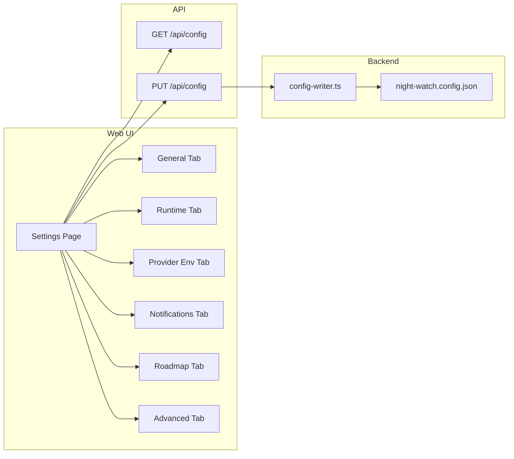
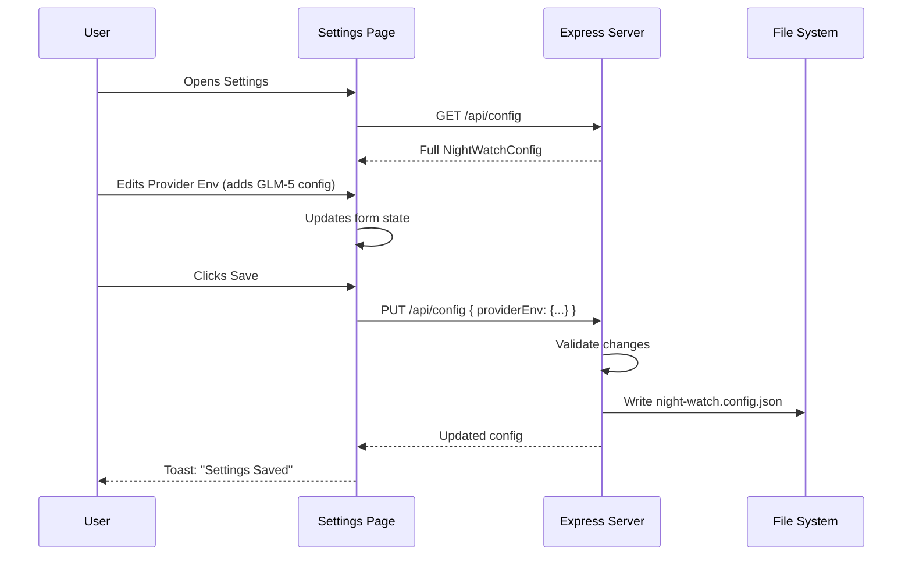

# PRD: Enhanced Settings Page with Full Config Management

**Complexity: 6 -> MEDIUM mode**

---

## 1. Context

**Problem:** The current Settings page only exposes a subset of `night-watch.config.json` fields. Users cannot configure provider environment variables (e.g., custom API endpoints like GLM-5), Telegram webhook settings, roadmap scanner options, templates directory, cron schedule offset, max retries, or PRD priority. The Provider Env tab is read-only. There is dead code from the removed Schedules tab extraction.

**Files Analyzed:**

- `/home/joao/projects/night-watch-cli/web/pages/Settings.tsx` - Current settings page (limited fields)
- `/home/joao/projects/night-watch-cli/web/api.ts` - API types (`NightWatchConfig`, `WebhookConfig`)
- `/home/joao/projects/night-watch-cli/src/types.ts` - Full `INightWatchConfig` interface
- `/home/joao/projects/night-watch-cli/src/config.ts` - Config loading/validation logic
- `/home/joao/projects/night-watch-cli/src/server/index.ts` - `handlePutConfig` validation
- `/home/joao/projects/night-watch-cli/src/utils/config-writer.ts` - Config persistence
- `/home/joao/projects/night-watch-cli/night-watch.config.json` - Example config with all fields
- `/home/joao/projects/night-watch-cli/src/constants.ts` - Default values

**Current Behavior:**

- Settings page has 3 tabs: General, Runtime, Provider Env (read-only)
- ConfigForm only includes: `provider`, `defaultBranch`, `branchPrefix`, `reviewerEnabled`, `minReviewScore`, `maxRuntime`, `reviewerMaxRuntime`, `maxLogSize`
- Provider Env tab displays key-value pairs but cannot add/edit/delete
- Missing configuration sections:
  - `providerEnv` (fully editable)
  - `notifications.webhooks` (Telegram, Slack, Discord)
  - `roadmapScanner` (enabled, roadmapPath, autoScanInterval)
  - `templatesDir`
  - `cronScheduleOffset`
  - `maxRetries`
  - `prdPriority`
- Dead code: `toFormState` only maps a subset, some form fields not connected

---

## 2. Solution

**Approach:**

1. **Expand ConfigForm** to include ALL editable config fields
2. **Add new tabs** for logical groupings: Notifications, Roadmap Scanner, Advanced
3. **Make Provider Env tab fully editable** with add/edit/delete capabilities
4. **Add Notifications tab** with webhook management (add/edit/delete webhooks with type-specific fields)
5. **Add Roadmap Scanner tab** with toggle and configuration options
6. **Add Advanced tab** for less common settings (templatesDir, cronScheduleOffset, maxRetries, prdPriority)
7. **Clean up dead code** and unused form state
8. **Ensure API validation** matches new fields (already mostly present in `handlePutConfig`)

**Architecture Diagram:**



**Key Decisions:**

- [x] Reuse existing Tabs component (already used)
- [x] Provider Env uses key-value pair editor with add/delete buttons
- [x] Notifications uses a webhook list with modal or inline editing
- [x] Webhook type selection determines which fields to show (url for Slack/Discord, botToken+chatId for Telegram)
- [x] Sensitive values (API keys, tokens) are masked by default with "show" toggle
- [x] Roadmap Scanner toggle calls existing `toggleRoadmapScanner()` API

**Data Changes:** None (config schema already supports all fields). Web UI types need update to match backend.

---

## 3. Sequence Flow



---

## 4. Execution Phases

### Phase 1: Update API types and expand ConfigForm

**User-visible outcome:** Settings page loads with all config fields available in form state (UI unchanged).

**Files (2):**

- `web/api.ts` - Update `NightWatchConfig` interface to match backend
- `web/pages/Settings.tsx` - Expand `ConfigForm` type and `toFormState` function

**Implementation:**

- [ ] In `web/api.ts`, update `NightWatchConfig` interface:
  ```typescript
  export interface NightWatchConfig {
    defaultBranch: string;
    prdDir: string;
    maxRuntime: number;
    reviewerMaxRuntime: number;
    branchPrefix: string;
    branchPatterns: string[];
    minReviewScore: number;
    maxLogSize: number;
    cronSchedule: string;
    reviewerSchedule: string;
    cronScheduleOffset: number;
    maxRetries: number;
    provider: 'claude' | 'codex';
    reviewerEnabled: boolean;
    providerEnv: Record<string, string>;
    notifications: NotificationConfig;
    prdPriority: string[];
    roadmapScanner: RoadmapScannerConfig;
    templatesDir: string;
  }

  export interface RoadmapScannerConfig {
    enabled: boolean;
    roadmapPath: string;
    autoScanInterval: number;
    slicerSchedule: string;
    slicerMaxRuntime: number;
  }
  ```
- [ ] In `Settings.tsx`, expand `ConfigForm` type:
  ```typescript
  type ConfigForm = {
    provider: NightWatchConfig['provider'];
    defaultBranch: string;
    branchPrefix: string;
    branchPatterns: string[];
    reviewerEnabled: boolean;
    minReviewScore: number;
    maxRuntime: number;
    reviewerMaxRuntime: number;
    maxLogSize: number;
    cronScheduleOffset: number;
    maxRetries: number;
    providerEnv: Record<string, string>;
    notifications: NotificationConfig;
    prdPriority: string[];
    roadmapScanner: RoadmapScannerConfig;
    templatesDir: string;
  };
  ```
- [ ] Update `toFormState` to map all fields

**Tests Required:**

| Test File | Test Name | Assertion |
|-----------|-----------|-----------|
| `yarn verify` | TypeScript compilation | No type errors |

**Verification Plan:**

1. `yarn verify` passes
2. Settings page still loads and renders

---

### Phase 2: Make Provider Env tab fully editable

**User-visible outcome:** Users can add, edit, and delete provider environment variables.

**Files (1):**

- `web/pages/Settings.tsx` - Update Provider Env tab content

**Implementation:**

- [ ] Add state for managing provider env edits (track new key, new value, editing key)
- [ ] Create `ProviderEnvEditor` sub-component or inline logic:
  - List of key-value pairs with edit/delete buttons
  - "Add new variable" form (key input, value input, add button)
  - Mask sensitive values (show/hide toggle for values containing "TOKEN", "KEY", "SECRET")
  - Inline edit mode for existing entries
- [ ] Update `handleSave` to include `providerEnv` in the update payload
- [ ] Add validation: key names must be valid env var names (uppercase, underscores)

**UI Layout:**
```
+-------------------------------------------+
| Provider Environment Variables            |
| Configure environment variables passed to |
| the provider CLI (API keys, base URLs)    |
+-------------------------------------------+
| ANTHROPIC_AUTH_TOKEN  ••••••••  [Edit] [X]|
| ANTHROPIC_BASE_URL    https://... [Edit]  |
| API_TIMEOUT_MS        3000000    [Edit] [X]|
+-------------------------------------------+
| Key: [________________] Value: [_________]|
|                              [+ Add Variable]|
+-------------------------------------------+
```

**Tests Required:**

| Test File | Test Name | Assertion |
|-----------|-----------|-----------|
| Manual | Add new env var | Variable appears in list, saved to config |
| Manual | Delete env var | Variable removed from list and config |
| Manual | Edit env var | Value updates correctly |
| Manual | Save settings | providerEnv persisted to night-watch.config.json |

**Verification Plan:**

1. `yarn verify` passes
2. Manual: Add `TEST_VAR=test123`, save, verify in config file
3. Manual: Delete `TEST_VAR`, save, verify removed from config
4. Manual: Edit existing `API_TIMEOUT_MS`, save, verify change

---

### Phase 3: Add Notifications tab for webhook management

**User-visible outcome:** Users can configure Telegram, Slack, and Discord webhooks with event subscriptions.

**Files (1):**

- `web/pages/Settings.tsx` - Add Notifications tab

**Implementation:**

- [ ] Add Notifications tab to `tabs` array
- [ ] Create webhook list UI showing existing webhooks with type, target, events
- [ ] Add webhook editor (inline or modal):
  - Type selector: Slack, Discord, Telegram
  - Conditional fields:
    - Slack/Discord: `url` (webhook URL)
    - Telegram: `botToken`, `chatId`
  - Events multi-select: `run_started`, `run_succeeded`, `run_failed`, `run_timeout`, `review_completed`
- [ ] Add/delete webhook buttons
- [ ] Mask sensitive fields (botToken)
- [ ] Update `handleSave` to include `notifications` in payload

**UI Layout:**
```
+-------------------------------------------+
| Notification Webhooks                     |
| Receive notifications when events occur   |
+-------------------------------------------+
| Webhook 1: Telegram                       |
|   Chat ID: 1063140002                     |
|   Events: run_started, run_succeeded      |
|   [Edit] [Delete]                         |
+-------------------------------------------+
| [+ Add Webhook]                           |
+-------------------------------------------+

Add Webhook Modal:
+-------------------------------------------+
| Type: [Telegram v]                        |
| Bot Token: [________________] [Show]      |
| Chat ID: [________________]               |
| Events: [x] run_started [x] run_succeeded |
|         [ ] run_failed [ ] run_timeout    |
|         [x] review_completed              |
|              [Cancel] [Save Webhook]      |
+-------------------------------------------+
```

**Tests Required:**

| Test File | Test Name | Assertion |
|-----------|-----------|-----------|
| Manual | Add Telegram webhook | Webhook saved with botToken, chatId, events |
| Manual | Add Slack webhook | Webhook saved with url, events |
| Manual | Delete webhook | Webhook removed from config |
| Manual | Edit events | Event selection updates correctly |

**Verification Plan:**

1. `yarn verify` passes
2. Manual: Add Telegram webhook, save, check config file
3. Manual: Add Slack webhook, save, check config file
4. Manual: Delete webhook, save, verify removed

---

### Phase 4: Add Roadmap Scanner tab

**User-visible outcome:** Users can enable/disable and configure the roadmap scanner.

**Files (1):**

- `web/pages/Settings.tsx` - Add Roadmap Scanner tab

**Implementation:**

- [ ] Add Roadmap Scanner tab to `tabs` array
- [ ] Create form section:
  - Toggle: Enable Roadmap Scanner (uses existing `toggleRoadmapScanner()` API for immediate effect)
  - Input: Roadmap Path (default: `ROADMAP.md`)
  - Input: Auto Scan Interval (seconds, min 30)
  - Input: Slicer Schedule (cron expression)
  - Input: Slicer Max Runtime (seconds)
- [ ] Update `handleSave` to include `roadmapScanner` in payload

**UI Layout:**
```
+-------------------------------------------+
| Roadmap Scanner                           |
| Automatically scan ROADMAP.md and generate|
| PRDs for unchecked items                  |
+-------------------------------------------+
| [x] Enable Roadmap Scanner                |
+-------------------------------------------+
| Roadmap Path:     [ROADMAP.md        ]    |
| Auto Scan Interval: [300] seconds (min 30)|
| Slicer Schedule:  [0 */6 * * *      ]    |
| Slicer Max Runtime: [600] seconds        |
+-------------------------------------------+
```

**Tests Required:**

| Test File | Test Name | Assertion |
|-----------|-----------|-----------|
| Manual | Toggle scanner | enabled/disabled state updates |
| Manual | Change interval | New interval saved |
| Manual | Save settings | roadmapScanner persisted to config |

**Verification Plan:**

1. `yarn verify` passes
2. Manual: Toggle scanner on/off, verify config update
3. Manual: Change autoScanInterval to 60, save, verify config

---

### Phase 5: Add Advanced tab and clean up dead code

**User-visible outcome:** All remaining config fields are editable. Dead code removed.

**Files (1):**

- `web/pages/Settings.tsx` - Add Advanced tab, remove dead code

**Implementation:**

- [ ] Add Advanced tab to `tabs` array with:
  - Templates Directory input
  - Cron Schedule Offset (0-59 minutes)
  - Max Retries (>= 1)
  - PRD Priority (comma-separated list or tag-style input)
  - Branch Patterns (comma-separated or array editor)
- [ ] Update `handleSave` to include all new fields
- [ ] Remove dead code:
  - Remove unused imports
  - Remove any commented-out code
  - Ensure all form fields are connected
- [ ] Add form validation with user-friendly error messages

**UI Layout:**
```
+-------------------------------------------+
| Advanced Settings                         |
| Less commonly used configuration options  |
+-------------------------------------------+
| Templates Directory: [.night-watch/templates]|
| Cron Schedule Offset: [0] minutes (0-59) |
| Max Retries: [3] (for rate-limited APIs) |
| Branch Patterns: [feat/, night-watch/]   |
|   (patterns to match for PR reviews)     |
| PRD Priority: [feature-x, bugfix-y]      |
|   (PRDs executed first if matching name) |
+-------------------------------------------+
```

**Tests Required:**

| Test File | Test Name | Assertion |
|-----------|-----------|-----------|
| Manual | Change templatesDir | New value saved |
| Manual | Set cronScheduleOffset | Value validated (0-59) |
| Manual | Set maxRetries | Value validated (>=1) |
| Manual | Add branch pattern | Pattern added to array |

**Verification Plan:**

1. `yarn verify` passes
2. Manual: Change each advanced setting, save, verify in config
3. Manual: Enter invalid cronScheduleOffset (-1), verify error message
4. Manual: Enter invalid maxRetries (0), verify error message

---

### Phase 6: Update handleSave to persist all fields

**User-visible outcome:** All settings tabs save correctly to config file.

**Files (1):**

- `web/pages/Settings.tsx` - Update handleSave function

**Implementation:**

- [ ] Update `handleSave` to include ALL form fields:
  ```typescript
  await updateConfig({
    provider: form.provider,
    defaultBranch: form.defaultBranch,
    branchPrefix: form.branchPrefix,
    branchPatterns: form.branchPatterns,
    reviewerEnabled: form.reviewerEnabled,
    minReviewScore: form.minReviewScore,
    maxRuntime: form.maxRuntime,
    reviewerMaxRuntime: form.reviewerMaxRuntime,
    maxLogSize: form.maxLogSize,
    cronScheduleOffset: form.cronScheduleOffset,
    maxRetries: form.maxRetries,
    providerEnv: form.providerEnv,
    notifications: form.notifications,
    prdPriority: form.prdPriority,
    roadmapScanner: form.roadmapScanner,
    templatesDir: form.templatesDir,
  });
  ```
- [ ] Add optimistic UI updates
- [ ] Add proper error handling with field-specific error messages
- [ ] Add loading state per field group

**Tests Required:**

| Test File | Test Name | Assertion |
|-----------|-----------|-----------|
| Manual | Change settings across tabs | All changes saved atomically |
| Manual | Invalid config | API returns 400 with field-specific error |
| Manual | Save while server busy | Loading state shown, no double-submit |

**Verification Plan:**

1. `yarn verify` passes
2. Manual: Change settings on multiple tabs, save once, verify all changes persisted
3. Manual: Trigger validation error, verify error message is clear

---

## 5. Acceptance Criteria

- [ ] All phases complete
- [ ] `yarn verify` passes
- [ ] Settings page has 6 tabs: General, Runtime, Provider Env, Notifications, Roadmap, Advanced
- [ ] Provider Env tab allows add/edit/delete of environment variables
- [ ] Notifications tab allows full webhook management (Telegram, Slack, Discord)
- [ ] Roadmap tab allows enabling/configuring roadmap scanner
- [ ] Advanced tab exposes templatesDir, cronScheduleOffset, maxRetries, prdPriority, branchPatterns
- [ ] Sensitive values are masked with show/hide toggle
- [ ] Form validation prevents invalid values
- [ ] All changes persist to `night-watch.config.json`
- [ ] No dead code or unused imports
- [ ] Loading states and error handling work correctly
- [ ] Toast notifications confirm successful saves

---

## 6. Integration Points Checklist

**How will this feature be reached?**
- [x] Entry point identified: `/settings` route (existing)
- [x] Caller file identified: `App.tsx` router (no changes needed)
- [x] Registration/wiring needed: None - existing route

**Is this user-facing?**
- [x] YES -> UI components required:
  - Provider Env editor (add/edit/delete env vars)
  - Webhook editor (add/edit/delete webhooks)
  - Roadmap config form
  - Advanced settings form
  - Masked input component for secrets

**Full user flow:**
1. User clicks "Settings" in sidebar
2. Triggers: React Router navigates to `/settings`
3. Reaches new feature via: Settings page loads with expanded tabs
4. Result displayed in: Tab content with editable forms, Save button persists changes

---

## 7. UI Component Summary

| Component | Location | Purpose |
|-----------|----------|---------|
| `ProviderEnvEditor` | Settings.tsx (inline) | Add/edit/delete provider env vars |
| `WebhookEditor` | Settings.tsx (inline) | Add/edit/delete notification webhooks |
| `MaskedInput` | New component or inline | Show/hide sensitive values |
| `TagInput` | Settings.tsx (inline) | Array input for branchPatterns, prdPriority |

---

## 8. Risk Assessment

| Risk | Mitigation |
|------|------------|
| Breaking existing config | Config writer preserves unknown keys; API validates input |
| Large form state | Use React useState with single form object; no Redux needed |
| API token exposure | Mask by default; only show on explicit user action |
| Invalid config saves | Server-side validation returns 400 with clear error messages |
