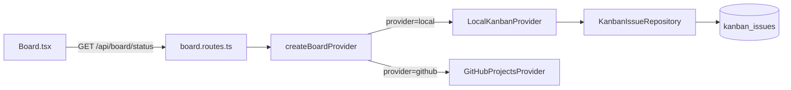
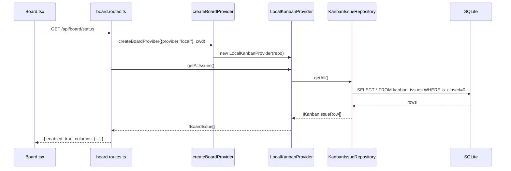

# PRD: Local Kanban Board Provider

**Complexity: 8 → HIGH**
**Status:** Ready

---

## Problem

Night Watch's board system only supports GitHub Projects V2. Users without GitHub access, or those wanting a self-contained workflow, cannot use the kanban-driven agent loop. A `local` provider backed by SQLite removes this dependency entirely.

---

## Files Analyzed

- `packages/core/src/board/types.ts` — `IBoardProvider`, `IBoardIssue`, `BoardProviderType`
- `packages/core/src/board/factory.ts` — `createBoardProvider` switch
- `packages/core/src/board/providers/github-projects.ts` — reference implementation
- `packages/core/src/storage/sqlite/migrations.ts` — schema DDL
- `packages/core/src/storage/repositories/interfaces.ts` — repository contracts
- `packages/core/src/constants.ts` — default configs
- `packages/server/src/routes/board.routes.ts` — API surface (no change needed)
- `web/pages/Board.tsx` — Kanban UI (no change needed)
- `web/pages/Settings.tsx` — settings UI (add local option)

---

## Current Behavior

- `BoardProviderType = "github" | "jira" | "linear"` (jira/linear stubs, only github implemented)
- `createBoardProvider` throws on any provider other than `"github"`
- All board API routes delegate to `GitHubProjectsProvider` which calls the `gh` CLI
- Web Board page fetches `/api/board/status` and renders whatever it gets

---

## Solution

### Approach

1. Add `"local"` to `BoardProviderType`
2. Add `kanban_issues` SQLite table via migrations
3. Define `IKanbanIssueRepository` interface + SQLite implementation
4. Create `LocalKanbanProvider` implementing `IBoardProvider` (delegates to repository)
5. Wire factory, update constants default, update Settings UI

### Architecture



### Key Decisions

- **Auto-increment `number`**: `IBoardIssue.number` is INTEGER PRIMARY KEY in SQLite (auto-inc) — same semantics as GitHub issue numbers
- **`url` field**: For local issues, `url` = `local://kanban/{number}` — UI already handles displaying it as a non-link when no GitHub URL is present (or we make it empty string)
- **`setupBoard` for local**: Returns a synthetic `IBoardInfo` with `id="local"`, `number=0`, `url=""` — no external call needed
- **`closeIssue`**: Sets `is_closed = 1` (soft delete) — issues are excluded from `getAllIssues()` and `getIssuesByColumn()`; this matches GitHub semantics
- **`commentOnIssue`**: Stores comments in a separate `kanban_comments` table
- **Labels/Assignees**: Stored as JSON arrays in the issue row — same approach as `agent_personas`
- **No cache invalidation changes**: Server cache layer in `helpers.ts` is provider-agnostic; works as-is
- **Existing CLI commands work unchanged**: All `board` subcommands (`next-issue`, `create-prd`, `move-issue`, etc.) go through `IBoardProvider` — they work with `local` transparently

### Data Changes

#### New table: `kanban_issues`

```sql
CREATE TABLE IF NOT EXISTS kanban_issues (
  number      INTEGER PRIMARY KEY AUTOINCREMENT,
  title       TEXT    NOT NULL,
  body        TEXT    NOT NULL DEFAULT '',
  column_name TEXT    NOT NULL DEFAULT 'Draft',
  labels_json TEXT    NOT NULL DEFAULT '[]',
  assignees_json TEXT NOT NULL DEFAULT '[]',
  is_closed   INTEGER NOT NULL DEFAULT 0,
  created_at  INTEGER NOT NULL,
  updated_at  INTEGER NOT NULL
);
CREATE INDEX IF NOT EXISTS idx_kanban_column
  ON kanban_issues(column_name, is_closed);
```

#### New table: `kanban_comments`

```sql
CREATE TABLE IF NOT EXISTS kanban_comments (
  id          INTEGER PRIMARY KEY AUTOINCREMENT,
  issue_number INTEGER NOT NULL REFERENCES kanban_issues(number),
  body        TEXT    NOT NULL,
  created_at  INTEGER NOT NULL
);
```

---

## Sequence Flow



---

## Integration Points

- **Entry point**: Config `boardProvider.provider: "local"` in `night-watch.config.json`
- **Caller file**: `createBoardProvider()` in `packages/core/src/board/factory.ts` (already called by all board routes and CLI commands)
- **Registration**: Add `case "local":` to the factory switch
- **UI counterparts**: Settings page (`web/pages/Settings.tsx`) — add "local" as selectable provider; hide `projectNumber`/`repo` fields when "local" is selected
- **Full user flow**:
  1. User sets `boardProvider.provider: "local"` in Settings UI or config file
  2. On next API call, factory routes to `LocalKanbanProvider`
  3. Board.tsx renders issues from SQLite — no GitHub CLI required
  4. Agents run `night-watch board next-issue` — gets local issues transparently

---

## Execution Phases

### Phase 1: Data Layer — SQLite schema + repository

**User-visible outcome:** `GET /api/board/status` returns an empty local board without GitHub.

**Files (5):**

- `packages/core/src/storage/sqlite/migrations.ts` — add `kanban_issues` + `kanban_comments` tables
- `packages/core/src/storage/repositories/interfaces.ts` — add `IKanbanIssueRepository`
- `packages/core/src/storage/repositories/sqlite/kanban-issue.repository.ts` — **NEW** SQLite CRUD
- `packages/core/src/board/types.ts` — add `"local"` to `BoardProviderType`
- `packages/core/src/constants.ts` — add `DEFAULT_LOCAL_BOARD_INFO` constant

**Implementation:**

- [ ] In `migrations.ts`, append `kanban_issues` and `kanban_comments` DDL inside `runMigrations`
- [ ] In `interfaces.ts`, add:

```typescript
export interface IKanbanIssue {
  number: number;
  title: string;
  body: string;
  columnName: BoardColumnName;
  labels: string[];
  assignees: string[];
  isClosed: boolean;
  createdAt: number;
  updatedAt: number;
}

export interface ICreateKanbanIssueInput {
  title: string;
  body?: string;
  columnName?: BoardColumnName;
  labels?: string[];
}

export interface IKanbanIssueRepository {
  create(input: ICreateKanbanIssueInput): IKanbanIssue;
  getByNumber(number: number): IKanbanIssue | null;
  getAll(includeClosedAt?: boolean): IKanbanIssue[];
  getByColumn(column: BoardColumnName): IKanbanIssue[];
  move(number: number, targetColumn: BoardColumnName): void;
  close(number: number): void;
  addComment(number: number, body: string): void;
}
```

- [ ] Implement `KanbanIssueRepository` in `kanban-issue.repository.ts` using `better-sqlite3` prepared statements, following the same pattern as `agent-persona.repository.ts` (parse JSON fields on read, stringify on write)
- [ ] Add `@injectable()` decorator, register in `packages/core/src/di/container.ts`
- [ ] In `board/types.ts`, change `BoardProviderType = "github" | "jira" | "linear"` to `"github" | "jira" | "linear" | "local"`
- [ ] In `constants.ts`, add:

```typescript
export const DEFAULT_LOCAL_BOARD_INFO = { id: 'local', number: 0, title: 'Local Kanban', url: '' };
```

**Tests Required:**

| Test File                                                     | Test Name                                          | Assertion                                                               |
| ------------------------------------------------------------- | -------------------------------------------------- | ----------------------------------------------------------------------- |
| `packages/core/src/__tests__/kanban-issue.repository.test.ts` | `should create an issue with default Draft column` | `expect(issue.columnName).toBe('Draft')`                                |
| same                                                          | `should retrieve issue by number`                  | `expect(repo.getByNumber(issue.number)).toMatchObject({title: 'Test'})` |
| same                                                          | `should move issue to new column`                  | `expect(repo.getByColumn('Ready')).toHaveLength(1)`                     |
| same                                                          | `should soft-close an issue`                       | `expect(repo.getAll()).not.toContain(closed)`                           |
| same                                                          | `should add a comment`                             | no error thrown; rows inserted                                          |
| same                                                          | `should return issues grouped by column`           | `expect(repo.getByColumn('Draft')).toHaveLength(2)`                     |

**Verification Plan:**

1. Unit tests: `packages/core/src/__tests__/kanban-issue.repository.test.ts` — 6 tests
2. `yarn verify` passes (no TS errors)

```bash
cd packages/core && yarn test --run src/__tests__/kanban-issue.repository.test.ts
```

---

### Phase 2: LocalKanbanProvider — IBoardProvider implementation

**User-visible outcome:** Setting `boardProvider.provider: "local"` and hitting `/api/board/status` returns issues from SQLite.

**Files (3):**

- `packages/core/src/board/providers/local-kanban.ts` — **NEW** provider
- `packages/core/src/board/factory.ts` — add `"local"` case
- `packages/core/src/di/container.ts` — register `KanbanIssueRepository` if not done in Phase 1

**Implementation:**

- [ ] Create `LocalKanbanProvider` implementing `IBoardProvider`:

```typescript
export class LocalKanbanProvider implements IBoardProvider {
  constructor(private readonly repo: IKanbanIssueRepository) {}

  async setupBoard(title: string): Promise<IBoardInfo> {
    return { ...DEFAULT_LOCAL_BOARD_INFO, title };
  }

  async getBoard(): Promise<IBoardInfo | null> {
    return DEFAULT_LOCAL_BOARD_INFO;
  }

  async getColumns(): Promise<IBoardColumn[]> {
    return BOARD_COLUMNS.map((name, i) => ({ id: String(i), name }));
  }

  async createIssue(input: ICreateIssueInput): Promise<IBoardIssue> {
    const row = this.repo.create({
      title: input.title,
      body: input.body,
      columnName: input.column ?? 'Draft',
      labels: input.labels,
    });
    return toIBoardIssue(row);
  }

  async getIssue(issueNumber: number): Promise<IBoardIssue | null> {
    const row = this.repo.getByNumber(issueNumber);
    return row ? toIBoardIssue(row) : null;
  }

  async getIssuesByColumn(column: BoardColumnName): Promise<IBoardIssue[]> {
    return this.repo.getByColumn(column).map(toIBoardIssue);
  }

  async getAllIssues(): Promise<IBoardIssue[]> {
    return this.repo.getAll().map(toIBoardIssue);
  }

  async moveIssue(issueNumber: number, targetColumn: BoardColumnName): Promise<void> {
    this.repo.move(issueNumber, targetColumn);
  }

  async closeIssue(issueNumber: number): Promise<void> {
    this.repo.close(issueNumber);
  }

  async commentOnIssue(issueNumber: number, body: string): Promise<void> {
    this.repo.addComment(issueNumber, body);
  }
}

function toIBoardIssue(row: IKanbanIssue): IBoardIssue {
  return {
    id: String(row.number),
    number: row.number,
    title: row.title,
    body: row.body,
    url: `local://kanban/${row.number}`,
    column: row.columnName,
    labels: row.labels,
    assignees: row.assignees,
  };
}
```

- [ ] In `factory.ts`, add:

```typescript
case "local": {
  const repo = container.resolve<IKanbanIssueRepository>('KanbanIssueRepository');
  return new LocalKanbanProvider(repo);
}
```

**Tests Required:**

| Test File                                                   | Test Name                                          | Assertion                                    |
| ----------------------------------------------------------- | -------------------------------------------------- | -------------------------------------------- |
| `packages/core/src/__tests__/local-kanban.provider.test.ts` | `should return empty board on first call`          | `expect(issues).toHaveLength(0)`             |
| same                                                        | `should create and retrieve an issue`              | `expect(found?.title).toBe('Fix bug')`       |
| same                                                        | `should move issue between columns`                | `expect(ready[0].number).toBe(issue.number)` |
| same                                                        | `should close issue and exclude from getAllIssues` | `expect(all).toHaveLength(0)`                |
| same                                                        | `should accept comment without error`              | resolves without throwing                    |

**Verification Plan:**

```bash
cd packages/core && yarn test --run src/__tests__/local-kanban.provider.test.ts
yarn verify
```

API proof (start server first with `LOCAL` provider in config):

```bash
curl -s http://localhost:3001/api/board/status | jq '{enabled, columns: (.columns | keys)}'
# Expected: {"enabled": true, "columns": ["Draft","Ready","In Progress","Review","Done"]}

curl -s -X POST http://localhost:3001/api/board/issues \
  -H 'Content-Type: application/json' \
  -d '{"title":"Hello local","column":"Ready"}' | jq .
# Expected: {"id":"1","number":1,"title":"Hello local","column":"Ready",...}
```

---

### Phase 3: Config Integration — default + Settings UI

**User-visible outcome:** Settings page shows "Local" as a board provider option; selecting it hides GitHub-specific fields.

**Files (3):**

- `packages/core/src/constants.ts` — update `DEFAULT_BOARD_PROVIDER_CONFIG` doc comment (value stays `github`; no behavioral change)
- `web/pages/Settings.tsx` — add `"local"` as provider radio/select option, conditionally hide `projectNumber` / `repo` fields
- `web/pages/Board.tsx` — hide "Open on GitHub" link for local issues (url starts with `local://`)

**Implementation:**

- [ ] In `Settings.tsx`, locate the `boardProvider.provider` field. Add `{ value: 'local', label: 'Local (SQLite)' }` to its option list
- [ ] Add conditional rendering: when `boardProvider.provider === 'local'`, hide the `projectNumber` and `repo` input fields
- [ ] In `Board.tsx`, find where `issue.url` is used to render a GitHub link. Add guard: `if (!issue.url || issue.url.startsWith('local://')) return null;` (or render a disabled link)
- [ ] No other changes needed — Board.tsx already handles the full 5-column layout from API data

**Tests Required:**

| Test File                                       | Test Name | Assertion |
| ----------------------------------------------- | --------- | --------- |
| N/A (Settings is a form UI — verified manually) | —         | —         |

**Verification Plan:**

1. `yarn verify` passes
2. Manual: Start the dev server → Settings → Board Provider → select "Local (SQLite)" → GitHub fields disappear → save → Board page shows empty columns → create an issue → it appears immediately

**Manual checkpoint required** (UI visual change):

- [ ] Settings page: "Local (SQLite)" option visible, GitHub fields hidden when selected
- [ ] Board page: issue cards render; no broken GitHub link for local issues
- [ ] Create issue → appears in correct column without page refresh

---

## Acceptance Criteria

- [ ] All phases complete
- [ ] `yarn verify` passes
- [ ] All automated checkpoint reviews passed
- [ ] Manual UI checkpoint passed (Phase 3)
- [ ] `boardProvider.provider: "local"` in config → Board.tsx renders issues from SQLite, no `gh` CLI calls
- [ ] `boardProvider.provider: "github"` still works unchanged
- [ ] `night-watch board next-issue` works with local provider
- [ ] `night-watch board create-prd <title>` creates a local issue

---

## Checkpoint Instructions

After each phase, spawn `prd-work-reviewer`:

```
Task({
  subagent_type: 'prd-work-reviewer',
  prompt: 'Review checkpoint for phase [N] of PRD at docs/PRDs/night-watch/local-kanban-provider.md',
  description: 'Review phase N checkpoint',
})
```

Continue only when agent reports **PASS**.

---

## Out of Scope

- Migration from GitHub board to local (manual via `board create-prd`)
- Jira / Linear providers (existing stubs)
- Multi-project local boards (all local issues share one SQLite DB)
- Attachments or rich comment formatting
