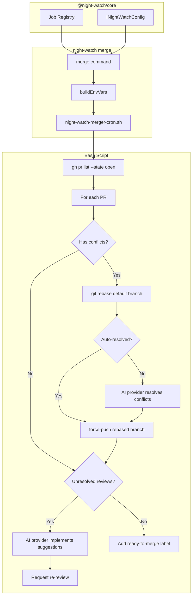
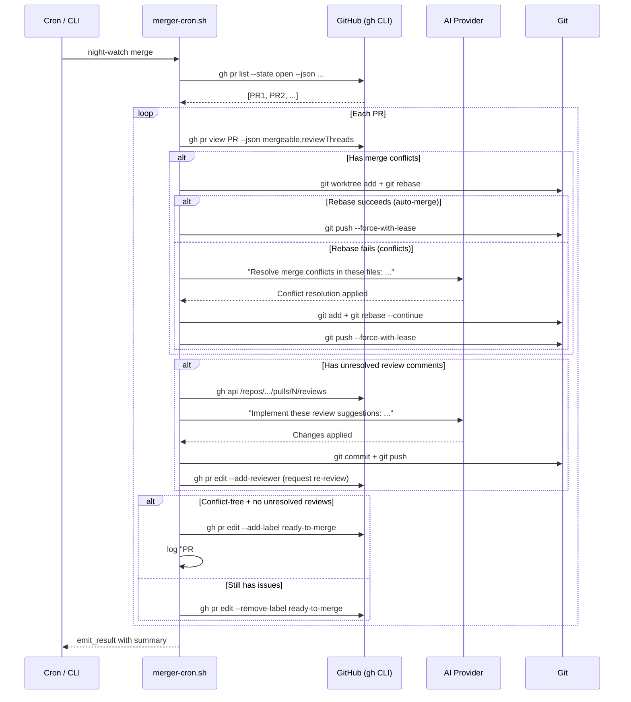

# PRD: PR Merge Keeper — Automated Conflict Resolution & Ready-to-Merge Management

**Complexity: 8 → HIGH mode** (+3 touches 10+ files, +2 new module from scratch, +2 multi-package, +1 external API integration)

## 1. Context

**Problem:** Open PRs drift out of date as the default branch evolves. Merge conflicts accumulate, review suggestions go unaddressed, and PRs stall. Currently, there is no automated job to keep PRs rebased, resolve conflicts, address review feedback, and label PRs as ready-to-merge.

**Files Analyzed:**

- `packages/core/src/jobs/job-registry.ts` — existing job definitions (6 types)
- `packages/core/src/types.ts` — `JobType`, `INightWatchConfig`, `IJobProviders`, `NotificationEvent`
- `packages/core/src/constants.ts` — defaults, queue priority
- `packages/core/src/utils/github.ts` — `gh` CLI wrappers for PR operations
- `packages/core/src/utils/git-utils.ts` — branch detection, timestamps
- `packages/core/src/utils/worktree-manager.ts` — worktree creation/cleanup
- `packages/cli/src/commands/review.ts` — reviewer pattern (closest analogue)
- `packages/cli/src/commands/shared/env-builder.ts` — shared env building
- `packages/cli/scripts/night-watch-helpers.sh` — `build_provider_cmd()`, `ensure_provider_on_path()`
- `packages/cli/scripts/night-watch-pr-reviewer-cron.sh` — reviewer bash script pattern

**Current Behavior:**

- PRs accumulate merge conflicts silently; developers must manually rebase
- Review suggestions (GitHub review comments) are not automatically addressed
- No label/signal to indicate a PR is conflict-free and review-complete
- The reviewer job reviews PRs and posts comments but does not resolve conflicts or address review feedback
- Auto-merge exists but only triggers after reviewer score threshold; no conflict resolution step

## 2. Solution

**Approach:**

1. Register a new **`merger`** job type in the job registry with its own cron schedule (3x daily), CLI command, lock file, and queue priority
2. The job iterates **all open PRs** in the repo (not just night-watch branches), checking each for: (a) merge conflicts with default branch, (b) unresolved review comments/suggestions
3. For **merge conflicts**: check out the PR branch in a worktree, attempt `git rebase` on default branch. If git auto-merge fails, invoke the configured AI provider to resolve conflicts intelligently, then force-push the rebased branch
4. For **unresolved review comments**: use the AI provider to read GitHub review comments, implement the suggested changes, commit, and push — then request re-review from the original reviewer
5. When a PR is conflict-free and has no unresolved review threads, add a **`ready-to-merge`** GitHub label

**Architecture Diagram:**



**Key Decisions:**

- **Uses configured AI provider** via `build_provider_cmd()` (same as all other jobs) — respects presets, schedule overrides, fallback chains
- **Scope: all open PRs** — not limited to night-watch branches; configurable via `branchPatterns` extra field if user wants to narrow scope
- **Force-push after rebase** — necessary for rebased branches; the job only force-pushes branches it has actively rebased (never the default branch)
- **`ready-to-merge` label** — added when PR is conflict-free + all review threads resolved; removed if new conflicts/reviews appear
- **Bash script pattern** — follows the same `night-watch-*-cron.sh` pattern as all other jobs for consistency
- **Review comment resolution** — AI reads review comments via `gh pr view --comments` and implements changes; requests re-review after push

**Data Changes:**

- `JobType` union gains `'merger'` value
- `IJobProviders` gains optional `merger?: Provider`
- New `IMergerConfig` interface extending `IBaseJobConfig` with extra fields
- New notification events: `merger_completed`, `merger_conflict_resolved`, `merger_failed`
- Job registry gains `merger` entry

## 3. Sequence Flow



## 4. Execution Phases

### Phase 1: Core Registration — Job Type & Config

**User-visible outcome:** `merger` job type exists in the registry, config normalizes correctly, and `night-watch merge --dry-run` shows configuration.

**Files (5):**

- `packages/core/src/types.ts` — add `'merger'` to `JobType`, `IMergerConfig` interface, new notification events, `merger` to `IJobProviders`
- `packages/core/src/jobs/job-registry.ts` — add `merger` entry to `JOB_REGISTRY`
- `packages/core/src/constants.ts` — add `DEFAULT_MERGER_*` constants
- `packages/core/src/config.ts` — wire `merger` config normalization (follows existing pattern)
- `packages/core/src/index.ts` — export new types if needed

**Implementation:**

- [ ] Add `'merger'` to the `JobType` union type
- [ ] Add `merger?: Provider` to `IJobProviders`
- [ ] Define `IMergerConfig` extending `IBaseJobConfig`:
  ```typescript
  interface IMergerConfig extends IBaseJobConfig {
    /** Branch patterns to match (empty = all open PRs) */
    branchPatterns: string[];
    /** Max PRs to process per run (0 = unlimited) */
    maxPrsPerRun: number;
    /** Max runtime per individual PR in seconds */
    perPrTimeout: number;
    /** Whether to attempt AI conflict resolution (vs skip conflicted PRs) */
    aiConflictResolution: boolean;
    /** Whether to attempt AI review comment resolution */
    aiReviewResolution: boolean;
    /** Label to add when PR is ready to merge */
    readyLabel: string;
  }
  ```
- [ ] Add default constants:
  ```typescript
  DEFAULT_MERGER_ENABLED = true;
  DEFAULT_MERGER_SCHEDULE = '15 6,14,22 * * *'; // 3x daily: 6:15, 14:15, 22:15
  DEFAULT_MERGER_MAX_RUNTIME = 3600; // 1 hour
  DEFAULT_MERGER_MAX_PRS_PER_RUN = 0; // unlimited
  DEFAULT_MERGER_PER_PR_TIMEOUT = 600; // 10 min per PR
  DEFAULT_MERGER_AI_CONFLICT_RESOLUTION = true;
  DEFAULT_MERGER_AI_REVIEW_RESOLUTION = true;
  DEFAULT_MERGER_READY_LABEL = 'ready-to-merge';
  ```
- [ ] Add `merger` entry to `JOB_REGISTRY`:
  ```typescript
  {
    id: 'merger',
    name: 'Merge Keeper',
    description: 'Resolves merge conflicts, addresses review comments, and labels PRs ready-to-merge',
    cliCommand: 'merge',
    logName: 'merger',
    lockSuffix: '-merger.lock',
    queuePriority: 35,  // between reviewer (40) and slicer (30)
    envPrefix: 'NW_MERGER',
    extraFields: [
      { name: 'branchPatterns', type: 'string[]', defaultValue: [] },
      { name: 'maxPrsPerRun', type: 'number', defaultValue: 0 },
      { name: 'perPrTimeout', type: 'number', defaultValue: 600 },
      { name: 'aiConflictResolution', type: 'boolean', defaultValue: true },
      { name: 'aiReviewResolution', type: 'boolean', defaultValue: true },
      { name: 'readyLabel', type: 'string', defaultValue: 'ready-to-merge' },
    ],
    defaultConfig: { enabled: true, schedule: '15 6,14,22 * * *', maxRuntime: 3600, ... }
  }
  ```
- [ ] Add `'merger_completed' | 'merger_conflict_resolved' | 'merger_failed'` to `NotificationEvent` union

**Tests Required:**
| Test File | Test Name | Assertion |
|-----------|-----------|-----------|
| `packages/core/src/__tests__/jobs/job-registry.test.ts` | `should include merger in job registry` | `expect(getJobDef('merger')).toBeDefined()` |
| `packages/core/src/__tests__/jobs/job-registry.test.ts` | `merger has correct defaults` | schedule, maxRuntime, queuePriority checks |
| `packages/core/src/__tests__/jobs/job-registry.test.ts` | `normalizeJobConfig handles merger extra fields` | all extra fields normalized with defaults |

**Verification Plan:**

1. **Unit Tests:** Registry lookup, config normalization for merger
2. **Evidence:** `yarn verify` passes, `yarn test` passes

---

### Phase 2: CLI Command — `night-watch merge`

**User-visible outcome:** Running `night-watch merge --dry-run` displays merger configuration, open PRs status, and provider info. Running `night-watch merge` executes the bash script.

**Files (4):**

- `packages/cli/src/commands/merge.ts` — **NEW** — CLI command implementation (follows review.ts pattern)
- `packages/cli/src/cli.ts` — register `mergeCommand`
- `packages/cli/src/commands/shared/env-builder.ts` — no changes needed (generic `buildBaseEnvVars` handles new job type)
- `packages/cli/src/commands/install.ts` — add `--no-merger` / `--merger` flags

**Implementation:**

- [ ] Create `merge.ts` following the reviewer command pattern:
  - `IMergeOptions`: `{ dryRun, timeout, provider }`
  - `buildEnvVars(config, options)`: calls `buildBaseEnvVars(config, 'merger', options.dryRun)` + merger-specific env vars:
    - `NW_MERGER_MAX_RUNTIME`
    - `NW_MERGER_MAX_PRS_PER_RUN`
    - `NW_MERGER_PER_PR_TIMEOUT`
    - `NW_MERGER_AI_CONFLICT_RESOLUTION`
    - `NW_MERGER_AI_REVIEW_RESOLUTION`
    - `NW_MERGER_READY_LABEL`
    - `NW_MERGER_BRANCH_PATTERNS`
  - `applyCliOverrides(config, options)`: timeout + provider overrides
  - Dry-run mode: show config table, list open PRs with conflict/review status, env vars, command
  - Execute mode: spinner + `executeScriptWithOutput` calling `night-watch-merger-cron.sh`
  - Notification sending after completion
- [ ] Register in `cli.ts`: `mergeCommand(program)`
- [ ] Add `--no-merger` / `--merger` flags to install command for cron schedule control

**Tests Required:**
| Test File | Test Name | Assertion |
|-----------|-----------|-----------|
| `packages/cli/src/__tests__/commands/merge.test.ts` | `buildEnvVars includes merger-specific vars` | env var keys present |
| `packages/cli/src/__tests__/commands/merge.test.ts` | `applyCliOverrides applies timeout override` | config mutated |

**Verification Plan:**

1. **Unit Tests:** env var building, config overrides
2. **Manual:** `night-watch merge --dry-run` outputs valid config
3. **Evidence:** `yarn verify` passes

---

### Phase 3: Bash Script — Core Merger Logic

**User-visible outcome:** `night-watch merge` iterates open PRs, detects conflicts, attempts git rebase, and invokes AI provider for unresolvable conflicts. Adds/removes `ready-to-merge` label.

**Files (2):**

- `packages/cli/scripts/night-watch-merger-cron.sh` — **NEW** — main merger bash script
- `packages/cli/scripts/night-watch-helpers.sh` — add any shared helper functions if needed (likely none)

**Implementation:**

- [ ] Script structure (following reviewer pattern):
  ```bash
  #!/usr/bin/env bash
  set -euo pipefail
  # Usage: night-watch-merger-cron.sh /path/to/project
  ```
- [ ] Parse env vars:
  - `NW_MERGER_MAX_RUNTIME`, `NW_MERGER_MAX_PRS_PER_RUN`, `NW_MERGER_PER_PR_TIMEOUT`
  - `NW_MERGER_AI_CONFLICT_RESOLUTION`, `NW_MERGER_AI_REVIEW_RESOLUTION`
  - `NW_MERGER_READY_LABEL`, `NW_MERGER_BRANCH_PATTERNS`
  - Standard provider vars via `NW_PROVIDER_CMD`, etc.
- [ ] Source `night-watch-helpers.sh` for `build_provider_cmd`, `log`, `emit_result`, `acquire_lock`, `release_lock`, `rotate_log`, `ensure_provider_on_path`
- [ ] Lock file acquisition: `/tmp/night-watch-merger-${PROJECT_RUNTIME_KEY}.lock`
- [ ] **PR Discovery:**
  ```bash
  gh pr list --state open --json number,title,headRefName,mergeable,reviewDecision,statusCheckRollup
  ```

  - Filter by `NW_MERGER_BRANCH_PATTERNS` if set (comma-separated)
  - Respect `NW_MERGER_MAX_PRS_PER_RUN`
- [ ] **Per-PR processing loop:**
  1. **Conflict detection:** Check `mergeable` status from `gh pr view`
  2. **Rebase attempt:**
     - Create worktree on the PR branch via `prepare_branch_worktree` or manual `git worktree add`
     - `git fetch origin ${DEFAULT_BRANCH}` then `git rebase origin/${DEFAULT_BRANCH}`
     - If rebase succeeds cleanly: `git push --force-with-lease origin ${BRANCH}`
     - If rebase fails with conflicts and `NW_MERGER_AI_CONFLICT_RESOLUTION=1`:
       - Abort rebase: `git rebase --abort`
       - Build AI prompt: "You are in a git repository. The branch `{branch}` has merge conflicts with `{default_branch}`. Please rebase this branch onto `origin/{default_branch}` and resolve all merge conflicts. After resolving, ensure the code compiles and tests pass. Use `git rebase origin/{default_branch}` and resolve conflicts, then `git push --force-with-lease origin {branch}`."
       - Invoke AI via `build_provider_cmd` + `timeout`
     - If rebase fails and AI resolution is disabled: skip PR, log warning
  3. **Review comment resolution (if `NW_MERGER_AI_REVIEW_RESOLUTION=1`):**
     - Check for unresolved review threads: `gh api repos/{owner}/{repo}/pulls/{number}/reviews`
     - If unresolved threads exist:
       - Build AI prompt: "You are in a git repository on branch `{branch}`. This PR has unresolved review comments from GitHub reviewers. Please read the review comments using `gh pr view {number} --comments`, understand the requested changes, implement them, commit with a descriptive message, and push. After pushing, the reviewers will be automatically notified."
       - Invoke AI via `build_provider_cmd` + `timeout`
  4. **Ready-to-merge labeling:**
     - After processing, re-check: `gh pr view {number} --json mergeable,reviewThreads`
     - If conflict-free AND no unresolved review threads:
       - `gh pr edit {number} --add-label ${READY_LABEL}`
       - Log: "PR #{number} marked as ready-to-merge"
     - Else:
       - `gh pr edit {number} --remove-label ${READY_LABEL}` (ignore error if label not present)
  5. **Worktree cleanup** after each PR
- [ ] **Result emission:**
  - Track: `prs_processed`, `conflicts_resolved`, `reviews_addressed`, `prs_ready`, `prs_failed`
  - `emit_result "success" "prs_processed=${PROCESSED} conflicts_resolved=${CONFLICTS} reviews_addressed=${REVIEWS} prs_ready=${READY}"`
- [ ] **Timeout handling:** per-PR timeout via `NW_MERGER_PER_PR_TIMEOUT`, global timeout via `NW_MERGER_MAX_RUNTIME`

**Tests Required:**
| Test File | Test Name | Assertion |
|-----------|-----------|-----------|
| `packages/cli/scripts/test-helpers.bats` | `merger lock acquisition` | lock file created/released |

**Verification Plan:**

1. **Manual test:** Run `night-watch merge --dry-run` in a project with open PRs
2. **Manual test:** Run `night-watch merge` on a repo with a known conflicted PR
3. **Evidence:** Log output shows PR iteration, conflict detection, resolution attempt

---

### Phase 4: Notifications & Install Integration

**User-visible outcome:** Merger job sends notifications on completion/failure. `night-watch install` includes merger cron schedule. Summary command includes merger data.

**Files (5):**

- `packages/core/src/utils/notify.ts` — add merger notification event formatting
- `packages/cli/src/commands/install.ts` — add merger cron entry generation
- `packages/cli/src/commands/uninstall.ts` — handle merger cron removal
- `packages/cli/src/commands/merge.ts` — wire notification sending in execute flow
- `packages/core/src/utils/summary.ts` — include merger stats in morning briefing

**Implementation:**

- [ ] Add notification message formatting for `merger_completed`, `merger_conflict_resolved`, `merger_failed` events
- [ ] `install.ts`:
  - Add `--no-merger` flag to `IInstallOptions`
  - Generate cron entry for merger using config schedule (same pattern as reviewer/qa)
  - Format: `{schedule} cd {projectDir} && {nightWatchBin} merge >> {logDir}/merger.log 2>&1`
- [ ] `uninstall.ts`: remove merger cron entries in cleanup
- [ ] `merge.ts`: after script execution, build notification context and call `sendNotifications()`
  - Include `prsProcessed`, `conflictsResolved`, `reviewsAddressed`, `prsReady` in context
- [ ] `summary.ts`: merge keeper stats in the action items / summary data:
  - "N PRs are ready to merge" or "N PRs have unresolved conflicts"

**Tests Required:**
| Test File | Test Name | Assertion |
|-----------|-----------|-----------|
| `packages/cli/src/__tests__/commands/merge.test.ts` | `sends merger_completed notification on success` | notification mock called |
| `packages/cli/src/__tests__/commands/install.test.ts` | `includes merger cron entry` | crontab contains merger schedule |

**Verification Plan:**

1. **Unit Tests:** notification formatting, install output
2. **Manual:** `night-watch install` shows merger in crontab, `night-watch summary` includes merger data
3. **Evidence:** `yarn verify` + `yarn test` pass

---

### Phase 5: Edge Cases, Idempotency & Hardening

**User-visible outcome:** Merger handles edge cases gracefully — protected branches, draft PRs, concurrent runs, AI resolution failures — without breaking existing PRs.

**Files (3):**

- `packages/cli/scripts/night-watch-merger-cron.sh` — edge case handling
- `packages/cli/src/commands/merge.ts` — preflight checks
- `packages/core/src/__tests__/commands/merge.test.ts` — edge case tests

**Implementation:**

- [ ] **Skip draft PRs:** filter out PRs with `isDraft: true`
- [ ] **Skip PRs with `skip-merger` label:** configurable skip label
- [ ] **Protected branch safety:** never force-push to the default branch; verify branch name before push
- [ ] **Idempotent label management:** don't fail if `ready-to-merge` label doesn't exist yet (auto-create via `gh label create` if missing, ignore errors)
- [ ] **AI resolution failure handling:** if AI provider fails or times out, skip the PR, log error, continue to next PR
- [ ] **Force-with-lease safety:** always use `--force-with-lease` instead of `--force` to avoid overwriting concurrent pushes
- [ ] **Rate limiting:** respect `NW_MERGER_MAX_PRS_PER_RUN` and global timeout
- [ ] **Re-check after rebase:** after force-pushing, wait briefly for GitHub to update mergeable status before labeling
- [ ] **Concurrent run protection:** lock file prevents multiple merger instances

**Tests Required:**
| Test File | Test Name | Assertion |
|-----------|-----------|-----------|
| `packages/cli/src/__tests__/commands/merge.test.ts` | `skips draft PRs` | draft PRs excluded from processing |
| `packages/cli/src/__tests__/commands/merge.test.ts` | `skips PRs with skip-merger label` | labeled PRs excluded |
| `packages/cli/src/__tests__/commands/merge.test.ts` | `handles AI resolution failure gracefully` | continues to next PR |

**Verification Plan:**

1. **Unit Tests:** edge case filtering
2. **Integration test:** Run against a repo with draft PRs, labeled PRs, and conflicted PRs
3. **Evidence:** `yarn verify` + `yarn test` pass, no data loss in any scenario

## 5. Acceptance Criteria

- [ ] All 5 phases complete
- [ ] All specified tests pass
- [ ] `yarn verify` passes
- [ ] All automated checkpoint reviews passed
- [ ] `night-watch merge --dry-run` shows configuration and PR status
- [ ] `night-watch merge` processes open PRs, resolves conflicts via AI, addresses review comments
- [ ] `ready-to-merge` label added to PRs that are conflict-free with no unresolved reviews
- [ ] `night-watch install` includes merger cron schedule
- [ ] Notifications sent on completion/failure
- [ ] `night-watch summary` includes merger stats
- [ ] No force-push to protected/default branches
- [ ] Draft PRs and skip-labeled PRs are excluded
- [ ] AI resolution failures are handled gracefully (skip + continue)
- [ ] Job integrates with global queue system
