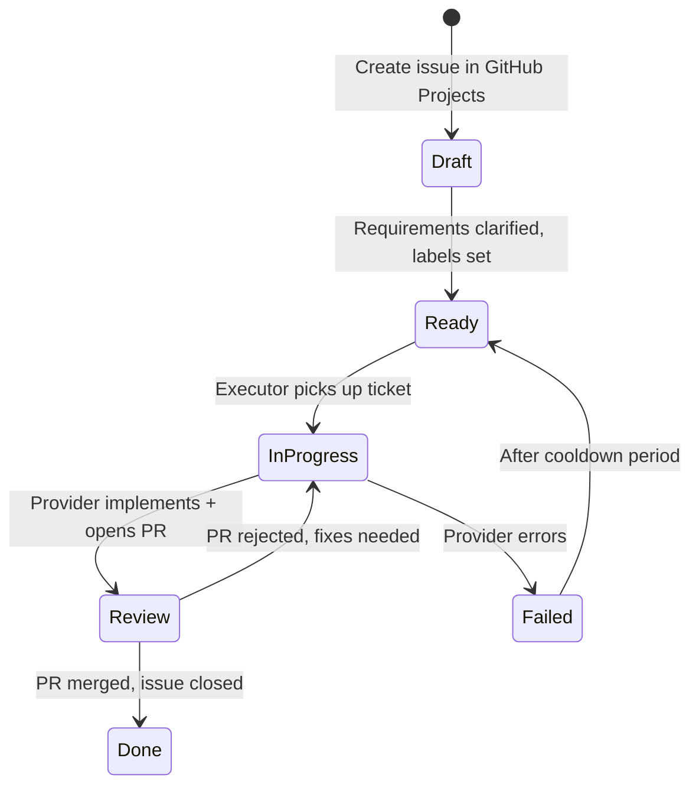
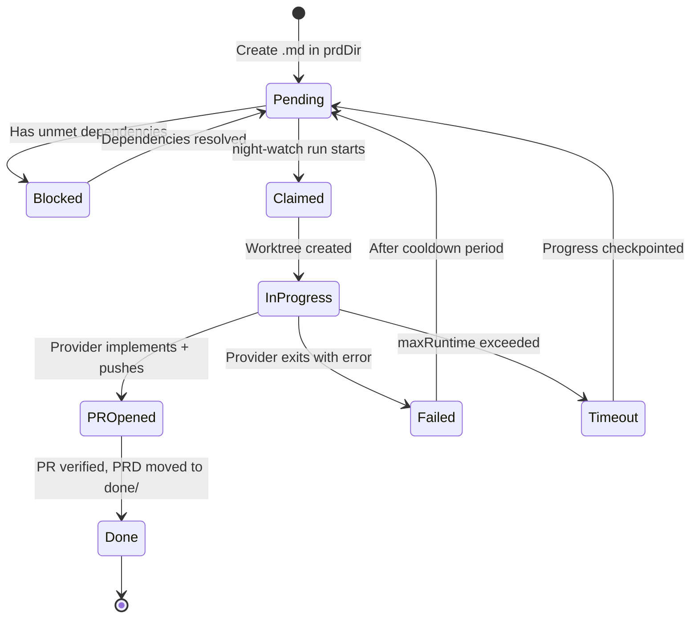

# Ticket/PRD Format Guide

> Related: [Architecture Overview](../architecture/architecture-overview.md) | [Commands Reference](../reference/commands.md) | [Configuration](../reference/configuration.md) | [Walkthrough](../guides/walkthrough.md)

Night Watch supports two workflow modes:

1. **Board Mode (recommended)** — Uses GitHub Projects V2 or local kanban board to track tickets
2. **PRD File Mode (legacy)** — Uses markdown PRD files in a configured directory

## Board Mode (Recommended)

Board mode uses GitHub Projects V2 issues (or local kanban tickets) as the unit of work. Each issue represents a scoped, implementable piece of work.

### Quick Reference

| Field  | Purpose                                                      |
| ------ | ------------------------------------------------------------ |
| Title  | Brief description of the work                                |
| Body   | Detailed requirements, context, acceptance criteria          |
| Labels | Priority (P0, P1, P2), category, horizon                     |
| Column | Workflow state (Draft → Ready → In Progress → Review → Done) |

### Board Columns

```
Draft → Ready → In Progress → Review → Done
```

- **Draft** — Initial tickets, not yet ready for execution
- **Ready** — Eligible for pickup by the executor
- **In Progress** — Currently being worked on
- **Review** — PR opened, awaiting review
- **Done** — Completed and merged

### Creating Tickets

```bash
# Via CLI
night-watch board create-prd "Add dark mode" --column Ready --priority P1

# Or create directly in GitHub Projects with this format:
```

**Example ticket body:**

```markdown
## Problem

HTTP requests are not logged, making debugging difficult.

## Solution

- Add middleware to log each request with method, path, and duration
- Output logs in JSON format to stdout
- Include request ID for tracing

## Acceptance Criteria

- [ ] All HTTP requests are logged
- [ ] Logs include: method, path, status, duration, request ID
- [ ] All tests pass
```

### Labels

| Label Type | Values                                                            |
| ---------- | ----------------------------------------------------------------- |
| Priority   | `P0`, `P1`, `P2`                                                  |
| Category   | `product`, `quality`, `reliability`, `tech-debt`, `documentation` |
| Horizon    | `short-term`, `medium-term`, `long-term`                          |

### Board Mode Configuration

```json
{
  "boardProvider": {
    "enabled": true,
    "provider": "github",
    "projectNumber": 123
  }
}
```

For local kanban (no GitHub):

```json
{
  "boardProvider": {
    "enabled": true,
    "provider": "local"
  }
}
```

---

## PRD File Mode (Legacy)

> **Note:** PRD file mode is maintained for backward compatibility. New projects should use board mode.

PRD files are markdown documents stored in the configured `prdDir` (default: `docs/prds`).

### Quick Reference

| Section              | Required | Purpose                                |
| -------------------- | -------- | -------------------------------------- |
| Title (`# PRD: ...`) | Yes      | Unique identifier for the PRD          |
| `Depends on:`        | No       | Declare dependencies on other PRDs     |
| Problem              | Yes      | What issue this solves (1-2 sentences) |
| Solution             | Yes      | How to solve it (3-5 bullets)          |
| Phases               | Yes      | Implementation steps with tests        |
| Acceptance Criteria  | Yes      | Checklist for completion               |

### Minimal PRD Example

```markdown
# PRD: Add Request Logging

## Problem

HTTP requests are not logged, making debugging difficult.

## Solution

- Add middleware to log each request with method, path, and duration
- Output logs in JSON format to stdout
- Include request ID for tracing

## Phases

### Phase 1: Core Logging

- [ ] Create logging middleware
- [ ] Add request ID generation
- [ ] Write unit tests

### Phase 2: Integration

- [ ] Wire middleware into Express app
- [ ] Add integration tests

## Acceptance Criteria

- [ ] All HTTP requests are logged
- [ ] Logs include: method, path, status, duration, request ID
- [ ] All tests pass
```

### PRD with Dependencies

```markdown
# PRD: User Profile Page

Depends on: 01-user-authentication.md

## Problem

Users cannot view or edit their profile information.

## Solution

- Create profile page component
- Add form for editing name, email, avatar
- Connect to user API endpoints
```

---

## Ticket Lifecycle (Board Mode)



## PRD Lifecycle (File Mode)



---

## Writing Good Tickets/PRDs

### Do's

| Practice                         | Why                                         |
| -------------------------------- | ------------------------------------------- |
| One ticket = one feature         | Smaller tickets are more likely to complete |
| Reference existing code patterns | AI learns from existing conventions         |
| Include file paths               | Helps AI navigate the codebase              |
| Specify test requirements        | Ensures quality gates                       |
| Use clear acceptance criteria    | Can verify completion                       |

### Don'ts

| Practice               | Why                                    |
| ---------------------- | -------------------------------------- |
| Vague requirements     | "Improve performance" has no clear end |
| Reinventing everything | Wastes time, introduces bugs           |
| No acceptance criteria | Can't verify completion                |

---

## Size Guidelines

| Size   | Typical Duration               |
| ------ | ------------------------------ |
| Small  | 30-60 minutes                  |
| Medium | 1-3 hours                      |
| Large  | 3-6 hours (consider splitting) |

---

## CLI Commands

### Board Commands

```bash
# Setup board
night-watch board setup

# Create ticket
night-watch board create-prd "Add dark mode" --priority P1

# View board status
night-watch board status

# Move ticket
night-watch board move-issue 123 --column Done
```

### PRD Commands (File Mode)

```bash
# Create a new PRD from template
night-watch prd create "Add dark mode"

# List all PRDs with status
night-watch prds

# Retry a completed PRD
night-watch retry 01-auth.md
```

---

## Configuration

### Enable Board Mode

```json
{
  "boardProvider": {
    "enabled": true,
    "provider": "github"
  }
}
```

### PRD Directory (File Mode)

```json
{
  "prdDir": "docs/prds"
}
```

Both modes can be used simultaneously — board tickets will be prioritized, with PRD files as a fallback.
