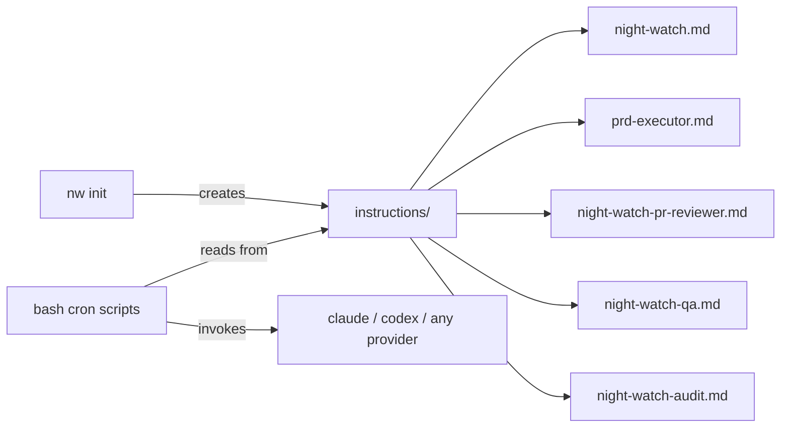

# PRD: Provider-Agnostic Instructions Directory

**Complexity: 4 → MEDIUM mode**

```
+2  Touches 6-10 files
+2  Multi-package changes (cli + scripts)
```

---

## Problem

Night Watch claims to be provider-agnostic but all agent instructions are stored in `.claude/commands/` — a Claude Code-specific convention — making the workflow inconsistent and broken for Codex, Gemini, and other providers.

## Solution

- Replace `.claude/commands/` with `instructions/` as the canonical, provider-neutral location for all agent instruction files
- `nw init` creates `instructions/` in the user's project (instead of `.claude/commands/`)
- All bash scripts reference `instructions/<filename>.md` instead of `.claude/` paths
- This repo's own `.claude/commands/` migrated to `instructions/` for consistency

**Integration Points Checklist:**

```
- [x] Entry point: nw init (creates instructions/ in user project)
- [x] Caller files: init.ts, night-watch-cron.sh, night-watch-pr-reviewer-cron.sh, night-watch-qa-cron.sh
- [x] No UI — internal/background feature triggered by cron
- [x] Full flow: nw init → instructions/ created → cron runs → bash reads instructions/ → agent invoked consistently
```

**Architecture:**



---

## Phases

---

### Phase 1: Update `nw init` to create `instructions/` instead of `.claude/commands/`

**User-visible outcome:** Running `nw init` creates an `instructions/` directory with all agent files instead of `.claude/commands/`.

**Files:**
- `packages/cli/src/commands/init.ts` — change target directory, update summary output

**Implementation:**

- [ ] Change `commandsDir` from `path.join(cwd, '.claude', 'commands')` to `path.join(cwd, 'instructions')`
- [ ] Remove `ensureDir(path.join(cwd, '.claude', 'commands'))` call; call `ensureDir(instructionsDir)` instead
- [ ] Update the 5 `processTemplate` calls to write to `instructionsDir` instead of `commandsDir`
- [ ] Update Step 7 label from "Creating Claude slash commands..." to "Creating instructions directory..."
- [ ] Update the summary `filesTable` to show `instructions/` paths instead of `.claude/commands/` paths
- [ ] Update the `header` and `label` calls in the summary to reflect the new location

**Tests Required:**

| Test File | Test Name | Assertion |
|-----------|-----------|-----------|
| `packages/cli/src/__tests__/commands/init.test.ts` (if exists) or add tests | `should create instructions directory` | `instructions/` dir exists after init |
| Same | `should write night-watch.md to instructions/` | `instructions/night-watch.md` is present |
| Same | `should not create .claude/commands directory` | `.claude/commands/` does NOT exist |

**Verification Plan:**

1. **Manual:** Run `nw init` in a temp dir, confirm `instructions/` is created and contains the 5 agent files
2. **Manual:** Confirm `.claude/commands/` is NOT created
3. **Automated:** `yarn verify` passes

---

### Phase 2: Update bash scripts to reference `instructions/` paths

**User-visible outcome:** Codex and other providers can execute PRDs, reviewer, and QA runs because the bash scripts point to provider-neutral `instructions/` paths.

**Files:**
- `scripts/night-watch-cron.sh` — replace `.claude/skills/prd-executor/SKILL.md` and `.claude/commands/prd-executor.md` references
- `scripts/night-watch-pr-reviewer-cron.sh` — replace `.claude/commands/night-watch-pr-reviewer.md` reference
- `scripts/night-watch-qa-cron.sh` — replace `.claude/commands/night-watch-qa.md` reference

**Implementation:**

In `scripts/night-watch-cron.sh` (lines 231 and 259):
- [ ] Replace: `Read .claude/skills/prd-executor/SKILL.md (preferred) or .claude/commands/prd-executor.md (fallback), and follow the FULL execution pipeline:`
- [ ] With: `Read instructions/prd-executor.md and follow the FULL execution pipeline:`
- [ ] Remove any remaining fallback references to `.claude/` paths in the same prompt block

In `scripts/night-watch-pr-reviewer-cron.sh` (line ~537):
- [ ] Replace: `cat "${REVIEW_WORKTREE_DIR}/.claude/commands/night-watch-pr-reviewer.md"`
- [ ] With: `cat "${REVIEW_WORKTREE_DIR}/instructions/night-watch-pr-reviewer.md"`

In `scripts/night-watch-qa-cron.sh` (line ~244):
- [ ] Replace: `cat "${QA_WORKTREE_DIR}/.claude/commands/night-watch-qa.md"`
- [ ] With: `cat "${QA_WORKTREE_DIR}/instructions/night-watch-qa.md"`

**Tests Required:**

| Test File | Test Name | Assertion |
|-----------|-----------|-----------|
| Manual grep | No `.claude/` refs remain in scripts | `grep -r '\.claude/' scripts/` returns nothing |

**Verification Plan:**

1. **Automated:** `grep -r '\.claude/' scripts/` — must return no results
2. **Automated:** `yarn verify` passes

---

### Phase 3: Migrate this repo's own `.claude/` to `instructions/`

**User-visible outcome:** The night-watch-cli repo itself follows the same provider-agnostic convention — instructions live in `instructions/`, not `.claude/commands/` or `.claude/skills/`.

**Files:**
- `instructions/night-watch.md` ← from `.claude/commands/night-watch.md`
- `instructions/prd-executor.md` ← from `.claude/commands/prd-executor.md` + `.claude/skills/prd-executor/SKILL.md`
- `instructions/night-watch-audit.md` ← from `.claude/commands/night-watch-audit.md`
- `instructions/night-watch-pr-reviewer.md` ← from `.claude/commands/night-watch-pr-reviewer.md`

**Implementation:**

- [ ] Create `instructions/` directory in the repo root
- [ ] Copy `.claude/commands/night-watch.md` → `instructions/night-watch.md`; update internal references from `.claude/skills/prd-executor/SKILL.md` to `instructions/prd-executor.md`
- [ ] Copy `.claude/skills/prd-executor/SKILL.md` → `instructions/prd-executor.md` (this is the canonical executor instructions)
- [ ] Copy `.claude/commands/night-watch-audit.md` → `instructions/night-watch-audit.md`
- [ ] Copy `.claude/commands/night-watch-pr-reviewer.md` → `instructions/night-watch-pr-reviewer.md`
- [ ] Delete `.claude/commands/night-watch.md`, `.claude/commands/night-watch-audit.md`, `.claude/commands/night-watch-pr-reviewer.md`, `.claude/commands/prd-executor.md`
- [ ] Delete `.claude/skills/prd-executor/` directory
- [ ] Update `templates/night-watch.md` — the template that gets installed in user projects — to reference `instructions/prd-executor.md` instead of `.claude/skills/prd-executor/SKILL.md` or `.claude/commands/prd-executor.md`

**Tests Required:**

| Test File | Test Name | Assertion |
|-----------|-----------|-----------|
| Manual check | `instructions/` dir exists | 4 files present |
| Manual grep | No `.claude/skills` refs in templates | `grep -r '\.claude/skills' templates/` returns nothing |

**Verification Plan:**

1. **Automated:** `grep -r '\.claude/skills' templates/` — must return no results
2. **Automated:** `grep -r '\.claude/commands' templates/` — must return no results
3. **Automated:** `yarn verify` passes

---

## Acceptance Criteria

- [ ] All phases complete
- [ ] `nw init` creates `instructions/` directory; `.claude/commands/` is NOT created
- [ ] All 5 agent files land in `instructions/` with proper content
- [ ] `grep -r '\.claude/' scripts/` returns no results
- [ ] `grep -r '\.claude/skills\|\.claude/commands' templates/` returns no results
- [ ] This repo's `instructions/` directory contains the canonical agent files
- [ ] `.claude/commands/` in this repo contains only files unrelated to agent instructions (or is empty/removed)
- [ ] `yarn verify` passes
