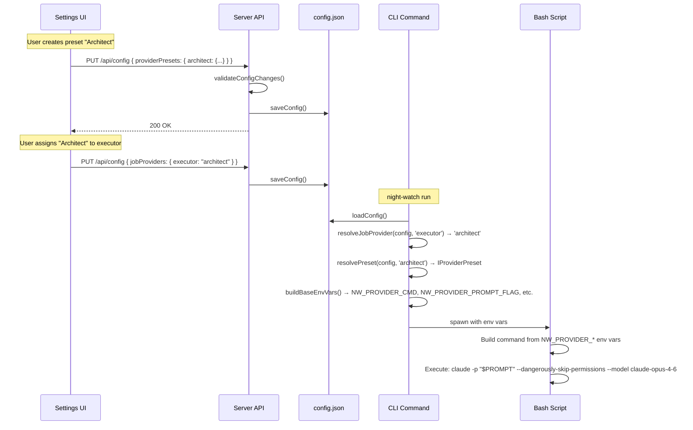

# PRD: Provider Presets

**Complexity: 7 → HIGH mode**

```
+3  Touches 10+ files
+2  Multi-package changes (core, cli, server, web)
+2  Complex state logic (preset resolution, backward compat)
```

---

## 1. Context

**Problem:** Providers are a hardcoded union type (`'claude' | 'codex'`). Adding a new CLI, customizing models, or creating purpose-specific provider configurations (e.g. "Architect" = Claude Opus, "Grunt" = Claude Sonnet) requires code changes. Users can't preconfigure named provider bundles and assign them to jobs from the UI.

**Files Analyzed:**

- `packages/core/src/types.ts` — `Provider`, `IJobProviders`, `INightWatchConfig`
- `packages/core/src/shared/types.ts` — duplicate `Provider` type
- `packages/core/src/constants.ts` — `VALID_PROVIDERS`, `PROVIDER_COMMANDS`, model constants
- `packages/core/src/config.ts` — `loadConfig()`, `resolveJobProvider()`
- `packages/core/src/config-normalize.ts` — `normalizeConfig()`, `validateProvider()`
- `packages/core/src/config-env.ts` — env var overrides
- `packages/cli/src/commands/shared/env-builder.ts` — `buildBaseEnvVars()`, `deriveProviderLabel()`
- `packages/server/src/routes/config.routes.ts` — `validateConfigChanges()`
- `web/pages/Settings.tsx` — Providers tab (lines 1055-1178)
- Bash scripts: `night-watch-cron.sh`, `night-watch-pr-reviewer-cron.sh`, `night-watch-qa-cron.sh`, `night-watch-audit-cron.sh`

**Current Behavior:**

- `Provider = 'claude' | 'codex'` — only two hardcoded options
- `PROVIDER_COMMANDS` maps provider name → CLI binary
- `jobProviders` assigns a Provider per job type (executor, reviewer, qa, audit, slicer)
- Bash scripts use `case "${PROVIDER_CMD}"` with hardcoded invocation patterns per provider
- UI shows two dropdowns (Claude/Codex) and a shared env var editor

---

## 2. Solution

**Approach:**

- Introduce **provider presets** — named, fully-configured provider bundles stored in `night-watch.config.json` under `providerPresets`
- Each preset bundles: CLI command, subcommand, prompt flag, auto-approve flag, workdir flag, model, env vars
- Two built-in presets (`claude`, `codex`) serve as defaults and are editable but not deletable
- `provider` and `jobProviders` reference preset IDs instead of the old union type
- Full backward compatibility: old configs with `provider: 'claude'` still work (resolves to built-in preset)
- Bash scripts switch from `case` statements to generic env-var-driven invocation

**Architecture:**

```mermaid
flowchart LR
    subgraph Config["night-watch.config.json"]
        PP["providerPresets: { architect: {...}, grunt: {...} }"]
        P["provider: 'grunt' (default preset ID)"]
        JP["jobProviders: { executor: 'architect', reviewer: 'codex' }"]
    end
    subgraph Core["@night-watch/core"]
        RP["resolvePreset(id) → IProviderPreset"]
        RJP["resolveJobProvider(config, jobType) → presetId"]
    end
    subgraph CLI["@night-watch/cli"]
        EB["buildBaseEnvVars() → NW_PROVIDER_* env vars"]
    end
    subgraph Bash["bash scripts"]
        GI["Generic invocation from env vars"]
    end
    subgraph UI["web (Settings)"]
        PL["Preset list with cards"]
        PM["Add/Edit modal"]
        JA["Job assignment dropdowns"]
    end

    Config --> Core --> CLI --> Bash
    UI -->|PUT /api/config| Config
```



**Key Decisions:**

- [x] Per-project storage in config JSON (not global DB)
- [x] Built-in presets are code defaults, overridable but not deletable
- [x] Rate-limit fallback remains global & Claude-specific (not per-preset)
- [x] Backward compat: bare `'claude'`/`'codex'` strings resolve to built-in presets
- [x] Delete protection: block deletion if preset is assigned to any job

**Data Changes:**

New config field `providerPresets: Record<string, IProviderPreset>`. No database schema changes.

---

## 3. Type Definitions

```typescript
/** A fully-configured provider preset */
interface IProviderPreset {
  /** Display name (e.g. "Architect", "Grunt") */
  name: string;
  /** CLI binary to invoke (e.g. "claude", "codex", "aider") */
  command: string;
  /** Optional subcommand (e.g. "exec" for codex) */
  subcommand?: string;
  /** Flag for passing the prompt (e.g. "-p"). Empty/undefined = prompt is positional (last arg) */
  promptFlag?: string;
  /** Flag for auto-approve/skip permissions (e.g. "--dangerously-skip-permissions", "--yolo") */
  autoApproveFlag?: string;
  /** Flag for working directory (e.g. "-C"). Empty/undefined = use cd */
  workdirFlag?: string;
  /** Flag name for model selection (e.g. "--model") */
  modelFlag?: string;
  /** Model value to pass (e.g. "claude-opus-4-6") */
  model?: string;
  /** Extra environment variables for this preset */
  envVars?: Record<string, string>;
}
```

Built-in defaults (code constants, not stored in config):

```typescript
const BUILT_IN_PRESETS: Record<string, IProviderPreset> = {
  claude: {
    name: 'Claude',
    command: 'claude',
    promptFlag: '-p',
    autoApproveFlag: '--dangerously-skip-permissions',
  },
  codex: {
    name: 'Codex',
    command: 'codex',
    subcommand: 'exec',
    autoApproveFlag: '--yolo',
    workdirFlag: '-C',
  },
};
```

---

## 4. Sequence Flow



---

## 5. Execution Phases

### Phase 1: Core Types & Preset Resolution

**User-visible outcome:** `resolvePreset()` resolves preset IDs to full `IProviderPreset` objects; old configs still work.

**Files (4):**

- `packages/core/src/types.ts` — Add `IProviderPreset` interface; widen `Provider` to `string`; update `IJobProviders` values to `string`; add `providerPresets` to `INightWatchConfig`
- `packages/core/src/shared/types.ts` — Sync `Provider` type change
- `packages/core/src/constants.ts` — Add `BUILT_IN_PRESETS`; keep `PROVIDER_COMMANDS` derived from presets; keep `VALID_PROVIDERS` for backward compat but also export `BUILT_IN_PRESET_IDS`
- `packages/core/src/config.ts` — Add `resolvePreset(config, presetId): IProviderPreset`; update `resolveJobProvider()` to return preset IDs

**Implementation:**

- [ ] Add `IProviderPreset` interface to `types.ts`
- [ ] Change `Provider` from union to `string` (backward compat: 'claude'|'codex' are still valid strings)
- [ ] Change `IJobProviders` values from `Provider` to `string | undefined`
- [ ] Add `providerPresets?: Record<string, IProviderPreset>` to `INightWatchConfig`
- [ ] Add `BUILT_IN_PRESETS` to `constants.ts` with claude and codex defaults
- [ ] Add `resolvePreset(config, presetId)` to `config.ts`: looks up `config.providerPresets[id]` first, then `BUILT_IN_PRESETS[id]`, throws if not found
- [ ] Ensure `resolveJobProvider()` still returns a string (preset ID)
- [ ] Deprecate `providerLabel` at config root level — preset's `name` is the label now

**Tests Required:**

| Test File | Test Name | Assertion |
|-----------|-----------|-----------|
| `packages/core/src/__tests__/config.test.ts` | `should resolve built-in claude preset` | `resolvePreset(config, 'claude').command === 'claude'` |
| `packages/core/src/__tests__/config.test.ts` | `should resolve custom preset from config` | `resolvePreset(config, 'architect').model === 'claude-opus-4-6'` |
| `packages/core/src/__tests__/config.test.ts` | `should throw for unknown preset` | `expect(() => resolvePreset(config, 'invalid')).toThrow()` |
| `packages/core/src/__tests__/config.test.ts` | `should allow overriding built-in preset` | custom 'claude' preset overrides built-in |
| `packages/core/src/__tests__/config.test.ts` | `should resolve job provider as preset ID` | `resolveJobProvider(config, 'executor') === 'architect'` |

**User Verification:**

- Action: Run `yarn test packages/core`
- Expected: All new and existing tests pass

---

### Phase 2: Config Normalization & Validation

**User-visible outcome:** Config loading validates presets, normalizes them, and maintains full backward compat with old configs.

**Files (3):**

- `packages/core/src/config-normalize.ts` — Normalize `providerPresets` entries; update `validateProvider()` to accept preset IDs
- `packages/core/src/config-env.ts` — Add `NW_PROVIDER_PRESET_*` env var overrides (stretch: may defer)
- `packages/server/src/routes/config.routes.ts` — Validate `providerPresets` in `validateConfigChanges()`; update `provider`/`jobProviders` validation to accept preset IDs

**Implementation:**

- [ ] In `normalizeConfig()`: read `providerPresets` from raw config, validate each entry has at minimum `name` and `command`
- [ ] Update `validateProvider()` to accept any string (preset ID) not just 'claude'|'codex'; actual existence check happens at resolution time
- [ ] In `validateConfigChanges()`: validate `providerPresets` entries (name required, command required, envVars must be string-valued if present, no reserved IDs conflict)
- [ ] Update `jobProviders` validation: accept any string (preset ID), not just `VALID_PROVIDERS`
- [ ] Add delete protection validation: if a preset ID is removed from `providerPresets` but still referenced by `provider` or `jobProviders`, return error listing which jobs reference it

**Tests Required:**

| Test File | Test Name | Assertion |
|-----------|-----------|-----------|
| `packages/core/src/__tests__/config-normalize.test.ts` | `should normalize providerPresets` | presets are preserved after normalization |
| `packages/core/src/__tests__/config-normalize.test.ts` | `should reject preset without command` | validation error |
| `packages/server/src/__tests__/config.routes.test.ts` | `should accept custom preset ID in jobProviders` | 200 OK |
| `packages/server/src/__tests__/config.routes.test.ts` | `should block deletion of in-use preset` | 400 with job references |

**User Verification:**

- Action: Run `yarn test` and `yarn verify`
- Expected: All tests pass, type checking passes

---

### Phase 3: Env Builder Update

**User-visible outcome:** `buildBaseEnvVars()` outputs preset-specific env vars (`NW_PROVIDER_PROMPT_FLAG`, `NW_PROVIDER_APPROVE_FLAG`, etc.) that bash scripts will consume.

**Files (2):**

- `packages/cli/src/commands/shared/env-builder.ts` — Resolve preset and emit `NW_PROVIDER_*` env vars; update `deriveProviderLabel()` to use preset name
- `packages/core/src/constants.ts` — Update `resolveProviderBucketKey()` to work with presets

**Implementation:**

- [ ] In `buildBaseEnvVars()`: call `resolvePreset(config, presetId)` to get the full preset
- [ ] Emit new env vars from preset fields:
  - `NW_PROVIDER_CMD` = `preset.command` (already exists, now from preset)
  - `NW_PROVIDER_SUBCOMMAND` = `preset.subcommand ?? ''`
  - `NW_PROVIDER_PROMPT_FLAG` = `preset.promptFlag ?? ''`
  - `NW_PROVIDER_APPROVE_FLAG` = `preset.autoApproveFlag ?? ''`
  - `NW_PROVIDER_WORKDIR_FLAG` = `preset.workdirFlag ?? ''`
  - `NW_PROVIDER_MODEL_FLAG` = `preset.modelFlag ?? ''`
  - `NW_PROVIDER_MODEL` = `preset.model ?? ''`
  - `NW_PROVIDER_LABEL` = `preset.name`
- [ ] Merge `preset.envVars` into the env (in addition to `config.providerEnv` for backward compat; preset-level env vars take precedence)
- [ ] Update `deriveProviderLabel()`: use preset name as primary source
- [ ] Update `resolveProviderBucketKey()`: use preset command + envVars to derive bucket key

**Tests Required:**

| Test File | Test Name | Assertion |
|-----------|-----------|-----------|
| `packages/cli/src/__tests__/env-builder.test.ts` | `should emit NW_PROVIDER_PROMPT_FLAG for claude preset` | env.NW_PROVIDER_PROMPT_FLAG === '-p' |
| `packages/cli/src/__tests__/env-builder.test.ts` | `should emit NW_PROVIDER_MODEL for preset with model` | env.NW_PROVIDER_MODEL === 'claude-opus-4-6' |
| `packages/cli/src/__tests__/env-builder.test.ts` | `should merge preset envVars` | preset env vars appear in output |
| `packages/cli/src/__tests__/env-builder.test.ts` | `should use preset name as provider label` | env.NW_PROVIDER_LABEL === 'Architect' |

**User Verification:**

- Action: `night-watch run --dry-run` with a config that has custom presets
- Expected: Dry-run output shows correct provider command, model, and label from the preset

---

### Phase 4: Bash Script Generic Invocation

**User-visible outcome:** Bash scripts build the provider command dynamically from `NW_PROVIDER_*` env vars instead of hardcoded `case` statements. Any custom CLI works without code changes.

**Files (4):**

- `packages/cli/scripts/night-watch-cron.sh` — Replace case statement with generic invocation helper
- `packages/cli/scripts/night-watch-pr-reviewer-cron.sh` — Same
- `packages/cli/scripts/night-watch-qa-cron.sh` — Same
- `packages/cli/scripts/night-watch-audit-cron.sh` — Same

**Implementation:**

- [ ] Add a shared helper function `build_provider_cmd()` that constructs the command array from `NW_PROVIDER_*` env vars:
  ```bash
  build_provider_cmd() {
    local workdir="$1" prompt="$2"
    local cmd_parts=("${NW_PROVIDER_CMD}")
    [ -n "${NW_PROVIDER_SUBCOMMAND:-}" ] && cmd_parts+=("${NW_PROVIDER_SUBCOMMAND}")
    [ -n "${NW_PROVIDER_WORKDIR_FLAG:-}" ] && cmd_parts+=("${NW_PROVIDER_WORKDIR_FLAG}" "${workdir}")
    [ -n "${NW_PROVIDER_APPROVE_FLAG:-}" ] && cmd_parts+=("${NW_PROVIDER_APPROVE_FLAG}")
    [ -n "${NW_PROVIDER_MODEL_FLAG:-}" ] && [ -n "${NW_PROVIDER_MODEL:-}" ] && \
      cmd_parts+=("${NW_PROVIDER_MODEL_FLAG}" "${NW_PROVIDER_MODEL}")
    if [ -n "${NW_PROVIDER_PROMPT_FLAG:-}" ]; then
      cmd_parts+=("${NW_PROVIDER_PROMPT_FLAG}" "${prompt}")
    else
      cmd_parts+=("${prompt}")
    fi
    echo "${cmd_parts[@]}"
  }
  ```
- [ ] Replace `case "${PROVIDER_CMD}"` blocks with the generic helper in all four scripts
- [ ] For the working directory: if `NW_PROVIDER_WORKDIR_FLAG` is empty, `cd` into the workdir before execution
- [ ] Keep rate-limit fallback logic as-is (it checks `NW_PROVIDER_CMD === 'claude'` and uses hardcoded claude syntax for native fallback — this is intentional, the fallback is always native Claude)

**Tests Required:**

| Test File | Test Name | Assertion |
|-----------|-----------|-----------|
| Manual | Claude preset invocation | `night-watch run --dry-run` shows `claude -p ... --dangerously-skip-permissions` |
| Manual | Codex preset invocation | dry-run shows `codex exec -C ... --yolo` |
| Manual | Custom preset invocation | dry-run shows custom command with correct flags |

**User Verification:**

- Action: Run `night-watch run --dry-run` with different presets assigned
- Expected: Dry-run output shows the correct full command for each preset

---

### Phase 5: UI — Provider Presets List & Job Assignment

**User-visible outcome:** Settings > Providers tab shows a card list of all presets with add/edit/delete actions and a redesigned job assignment section using preset names.

**Files (4):**

- `web/pages/Settings.tsx` — Redesign Providers tab: preset card list + job assignment dropdowns using preset names
- `web/components/providers/PresetCard.tsx` — New: card component for a single preset (name, command, model badge, env var count, edit/delete actions)
- `web/components/providers/PresetFormModal.tsx` — New: modal for adding/editing a preset (all fields from `IProviderPreset`)
- `web/components/providers/ProviderEnvEditor.tsx` — Move existing `ProviderEnvEditor` from Settings.tsx inline to its own component file (if not already)

**Implementation:**

- [ ] **PresetCard**: displays preset name, command pill (e.g. `claude`), model badge (e.g. `opus-4-6`), env var count, edit/delete buttons. Built-in presets show a "Built-in" badge and "Reset" instead of "Delete"
- [ ] **PresetFormModal**: form fields for name, command, subcommand, promptFlag, autoApproveFlag, workdirFlag, modelFlag, model, envVars. Built-in presets have a "Template" dropdown to auto-fill claude/codex defaults. Advanced fields (subcommand, promptFlag, workdirFlag) in a collapsible "Advanced" section
- [ ] **Providers tab layout**:
  1. **Provider Presets** card: grid of PresetCards + "Add Provider" button
  2. **Job Assignments** card: 5 rows (Executor, Reviewer, QA, Audit, Planner) each with a Select dropdown listing all preset names + "Use Global (default)"
  3. **Rate Limit Fallback** card: keep existing fallback settings (primary/secondary model, toggle) — these are global & Claude-specific
- [ ] **Delete protection**: when delete is clicked, check if preset ID is in `provider` or any `jobProviders` value. If so, show a warning listing which jobs reference it and prevent deletion.
- [ ] **Global provider**: the "Global Provider" select changes from Claude/Codex dropdown to a select listing all preset names
- [ ] Wire all changes through the existing `updateConfig()` API call

**Tests Required:**

| Test File | Test Name | Assertion |
|-----------|-----------|-----------|
| Manual | Add custom preset | Click "Add Provider" → fill form → save → card appears |
| Manual | Edit preset | Click edit on a preset → modify model → save → card updates |
| Manual | Delete protection | Try to delete preset assigned to a job → warning shown |
| Manual | Job assignment | Change executor to custom preset → save → config updated |
| Manual | Built-in preset | Claude/Codex cards show "Built-in" badge, no delete button |

**User Verification:**

- Action: Open Settings > Providers in the web UI
- Expected: See preset cards for Claude and Codex (built-in), ability to add new presets, job assignment dropdowns show preset names

---

## 6. Backward Compatibility

| Old Config | New Behavior |
|---|---|
| `provider: 'claude'` | Resolves to built-in `claude` preset |
| `provider: 'codex'` | Resolves to built-in `codex` preset |
| `jobProviders: { executor: 'claude' }` | Resolves to built-in `claude` preset |
| `providerEnv: { ANTHROPIC_BASE_URL: '...' }` | Still merged into env; preset-level `envVars` take precedence |
| `providerLabel: 'GLM-5'` | Still used if set; overridden by preset `name` when presets are configured |
| No `providerPresets` key | System uses built-in presets only, everything works as before |

---

## 7. Acceptance Criteria

- [ ] All phases complete
- [ ] All specified tests pass
- [ ] `yarn verify` passes
- [ ] All automated checkpoint reviews passed
- [ ] Users can create, edit, and delete custom provider presets from the UI
- [ ] Built-in presets (Claude, Codex) are editable but not deletable
- [ ] Job assignments use preset names instead of hardcoded provider types
- [ ] Custom CLI commands (not just claude/codex) work end-to-end
- [ ] Old configs without `providerPresets` continue to work unchanged
- [ ] Deleting a preset assigned to a job is blocked with a clear warning
- [ ] Bash scripts invoke any provider generically from env vars
