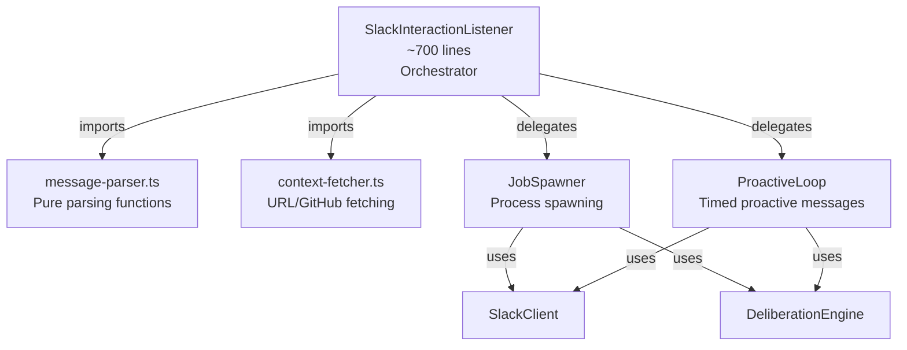
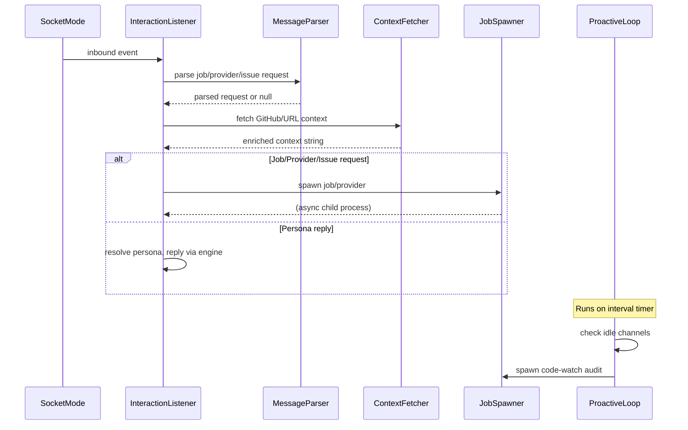

# PRD: Refactor SlackInteractionListener God Class

**Complexity: 5 → MEDIUM mode**

---

## 1. Context

**Problem:** `packages/slack/src/interaction-listener.ts` is a 1954-line god class with ~8 distinct responsibilities violating SRP.

**Files Analyzed:**

- `packages/slack/src/interaction-listener.ts` (1954 lines)
- `packages/slack/src/__tests__/slack/interaction-listener.test.ts` (433 lines)
- `packages/slack/src/index.ts` (barrel exports)
- `packages/slack/src/factory.ts` (composition root)
- `packages/slack/src/personas.ts` (prior extraction example)
- `packages/slack/src/utils.ts` (prior extraction example)
- `packages/slack/src/deliberation.ts` (similar class structure)

**Current Behavior:**

- The class handles Socket Mode lifecycle, message parsing, URL context fetching, job/process spawning, proactive messaging loops, human-like timing simulation, persona intros, and a ~300-line message router — all in one file
- Standalone parsing functions are already pure but live alongside the class
- Re-exports from `personas.ts` exist for backward compatibility
- Tests import parsing helpers directly from `interaction-listener.js`
- `index.ts` exports `SlackInteractionListener` and `shouldIgnoreInboundSlackEvent`

---

## 2. Solution

**Approach:**

- Extract standalone parsing functions + types into `message-parser.ts`
- Extract URL/GitHub context-fetching into `context-fetcher.ts`
- Extract process spawning (NW jobs, providers, audits) into `job-spawner.ts` as a class
- Extract proactive messaging loop into `proactive-loop.ts` as a class
- Keep `interaction-listener.ts` as a thin orchestrator (~700 lines) composing the extracted modules
- Maintain all existing exports via re-exports — zero breaking changes for consumers

**Architecture Diagram:**



**Key Decisions:**

- Pure functions (parsing, URL fetching) extracted as standalone modules — no class needed
- `JobSpawner` and `ProactiveLoop` are classes receiving `SlackClient`, `DeliberationEngine`, and `INightWatchConfig` via constructor — same pattern as existing `DeliberationEngine`
- State maps (`_lastChannelActivityAt`, `_lastProactiveAt`, etc.) shared via injection where needed
- All existing `interaction-listener.js` exports preserved via re-exports — tests and barrel untouched unless imports need updating
- Remove the re-export block for personas (lines 36-43) and update test imports to import from `personas.js` and `message-parser.js` directly

**Data Changes:** None

---

## 3. Sequence Flow



---

## 4. Execution Phases

### Integration Points Checklist

```
How will this feature be reached?
- [x] Entry point: Socket Mode events (unchanged)
- [x] Caller file: factory.ts creates SlackInteractionListener (unchanged)
- [x] Registration/wiring: new classes instantiated inside InteractionListener constructor

Is this user-facing?
- [x] NO → Internal refactoring, no behavior changes

Full user flow:
1. Slack message arrives via Socket Mode (unchanged)
2. InteractionListener routes to parsers/spawners (same logic, different files)
3. Result displayed in Slack (unchanged)
```

---

#### Phase 1: Extract `message-parser.ts` — Pure parsing functions moved to dedicated module

**Files (4):**

- `packages/slack/src/message-parser.ts` — NEW: all parsing functions, types, constants
- `packages/slack/src/interaction-listener.ts` — remove standalone functions, import from `message-parser.ts`
- `packages/slack/src/__tests__/slack/interaction-listener.test.ts` — update imports
- `packages/slack/src/index.ts` — add `shouldIgnoreInboundSlackEvent` export from `message-parser.ts`

**Implementation:**

- [ ] Create `message-parser.ts` with:
  - Constants: `JOB_STOPWORDS`
  - Types: `TSlackJobName`, `TSlackProviderName`, `ISlackJobRequest`, `ISlackProviderRequest`, `ISlackIssuePickupRequest`, `IInboundSlackEvent`, `IEventsApiPayload`, `IAdHocThreadState`
  - Functions: `normalizeForParsing`, `extractInboundEvent`, `buildInboundMessageKey`, `isAmbientTeamMessage`, `parseSlackJobRequest`, `parseSlackIssuePickupRequest`, `parseSlackProviderRequest`, `shouldIgnoreInboundSlackEvent`, `extractGitHubIssueUrls`, `extractGenericUrls`
- [ ] In `interaction-listener.ts`: replace standalone functions with imports from `message-parser.js`
- [ ] Remove the persona re-export block (lines 36-43) — these are already exported from `personas.ts` and `index.ts`
- [ ] Update test imports to use `message-parser.js` for parsers and `personas.js` for persona helpers
- [ ] Update `index.ts` to export `shouldIgnoreInboundSlackEvent` from `message-parser.js`

**Tests Required:**

| Test File                      | Test Name                 | Assertion                     |
| ------------------------------ | ------------------------- | ----------------------------- |
| `interaction-listener.test.ts` | All existing parser tests | All pass with updated imports |

**Verification:**

- `yarn verify` passes
- `yarn workspace @night-watch/slack test` passes
- All 25+ existing parser tests continue passing

---

#### Phase 2: Extract `context-fetcher.ts` — URL/GitHub context enrichment

**Files (2):**

- `packages/slack/src/context-fetcher.ts` — NEW: `fetchUrlSummaries`, `fetchGitHubIssueContext`
- `packages/slack/src/interaction-listener.ts` — import from `context-fetcher.js`

**Implementation:**

- [ ] Create `context-fetcher.ts` with `fetchUrlSummaries` and `fetchGitHubIssueContext`
- [ ] In `interaction-listener.ts`: import these two functions from `context-fetcher.js`

**Tests Required:**

| Test File      | Test Name          | Assertion                               |
| -------------- | ------------------ | --------------------------------------- |
| existing tests | All existing tests | Continue passing (no public API change) |

**Verification:**

- `yarn verify` passes
- `yarn workspace @night-watch/slack test` passes

---

#### Phase 3: Extract `job-spawner.ts` — Process spawning for NW jobs, providers, audits

**Files (2):**

- `packages/slack/src/job-spawner.ts` — NEW: `JobSpawner` class
- `packages/slack/src/interaction-listener.ts` — delegate to `JobSpawner`

**Implementation:**

- [ ] Create `JobSpawner` class with constructor `(slackClient, engine, config)`
- [ ] Move `extractLastMeaningfulLines` helper (used only by spawner)
- [ ] Move constants: `MAX_JOB_OUTPUT_CHARS`
- [ ] Move methods:
  - `_spawnNightWatchJob` → `spawnNightWatchJob(job, project, channel, threadTs, persona, opts, callbacks)`
  - `_spawnDirectProviderRequest` → `spawnDirectProviderRequest(request, project, channel, threadTs, persona, callbacks)`
  - `_spawnCodeWatchAudit` → `spawnCodeWatchAudit(project, channel, callbacks)`
- [ ] Callbacks interface `IJobSpawnerCallbacks` for `markChannelActivity` and `markPersonaReply` to avoid circular coupling
- [ ] In `interaction-listener.ts`: instantiate `JobSpawner` in constructor, delegate calls

**Tests Required:**

| Test File      | Test Name                    | Assertion        |
| -------------- | ---------------------------- | ---------------- |
| existing tests | Lifecycle + all parser tests | Continue passing |

**Verification:**

- `yarn verify` passes
- `yarn workspace @night-watch/slack test` passes

---

#### Phase 4: Extract `proactive-loop.ts` — Proactive messaging timer and code-watch

**Files (2):**

- `packages/slack/src/proactive-loop.ts` — NEW: `ProactiveLoop` class
- `packages/slack/src/interaction-listener.ts` — delegate to `ProactiveLoop`

**Implementation:**

- [ ] Create `ProactiveLoop` class with constructor `(engine, config, jobSpawner, stateAccessors)`
- [ ] Move constants: `PROACTIVE_IDLE_MS`, `PROACTIVE_MIN_INTERVAL_MS`, `PROACTIVE_SWEEP_INTERVAL_MS`, `PROACTIVE_CODEWATCH_MIN_INTERVAL_MS`
- [ ] Move methods:
  - `_startProactiveLoop` → `start()`
  - `_stopProactiveLoop` → `stop()`
  - `_sendProactiveMessages` → `sendProactiveMessages()`
  - `_runProactiveCodeWatch` → `runProactiveCodeWatch()`
  - `_resolveProactiveChannelForProject` → `resolveProactiveChannelForProject()`
- [ ] State accessors interface for reading/writing `_lastChannelActivityAt`, `_lastProactiveAt`, `_lastCodeWatchAt`
- [ ] `ProactiveLoop` receives project/persona resolution helpers or accesses repos directly
- [ ] In `interaction-listener.ts`: instantiate `ProactiveLoop` in constructor, delegate `start()/stop()`

**Tests Required:**

| Test File      | Test Name           | Assertion        |
| -------------- | ------------------- | ---------------- |
| existing tests | Lifecycle stop test | Continue passing |

**Verification:**

- `yarn verify` passes
- `yarn workspace @night-watch/slack test` passes

---

#### Phase 5: Final cleanup and comprehensive verification

**Files (2):**

- `packages/slack/src/interaction-listener.ts` — final review, remove dead imports
- `packages/slack/src/index.ts` — verify all exports still work

**Implementation:**

- [ ] Audit `interaction-listener.ts` for unused imports after all extractions
- [ ] Verify barrel exports in `index.ts` cover all previously exported symbols
- [ ] Run full workspace verification

**Tests Required:**

| Test File      | Test Name       | Assertion |
| -------------- | --------------- | --------- |
| All test files | Full test suite | All pass  |

**Verification:**

- `yarn verify` passes (full workspace)
- `yarn workspace @night-watch/slack test` passes
- Manual check: `interaction-listener.ts` is ~700 lines or less (down from 1954)

---

## 5. Acceptance Criteria

- [ ] All 5 phases complete
- [ ] All existing tests pass without modification (or with only import path updates)
- [ ] `yarn verify` passes
- [ ] `interaction-listener.ts` reduced to ~700 lines (orchestrator only)
- [ ] No new public API — all existing exports preserved via re-exports
- [ ] No behavior changes — pure structural refactoring
- [ ] Each extracted module has a single clear responsibility
