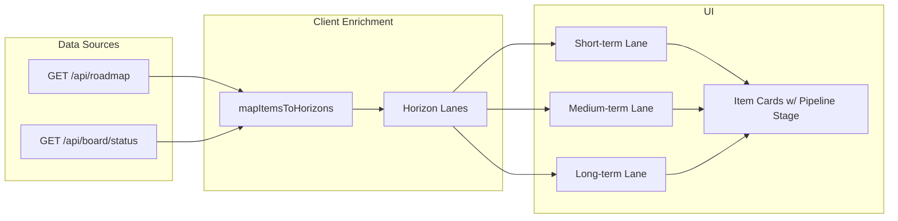
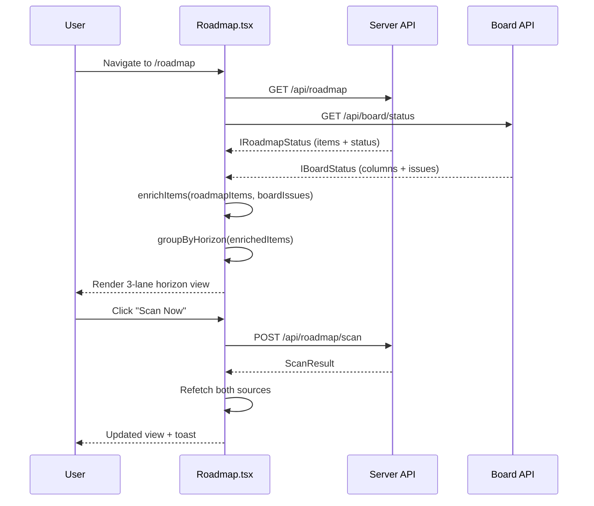

# Roadmap UI Redesign — Horizon-Based Planning View

**Complexity:** 6 → MEDIUM mode

**Depends on:** None (uses existing backend capabilities)

---

## 1. Context

**Problem:** The current Roadmap page (`web/pages/Roadmap.tsx`) is a legacy "Roadmap Scanner" view that shows a flat list of ROADMAP.md items with Pending/Processed/Skipped badges. It does not reflect the system's actual capabilities: 9 category labels, 3 time horizons, full ROADMAP→PRD→Board pipeline tracking, audit integration, or priority modes.

**Files Analyzed:**

- `web/pages/Roadmap.tsx` — current legacy UI (343 lines)
- `web/pages/Board.tsx` — reference kanban UI
- `web/api.ts` — API client (fetchRoadmap, fetchBoardStatus)
- `web/components/ui/{Badge,Card,Button,Switch}.tsx` — reusable components
- `packages/core/src/board/roadmap-mapping.ts` — section→category/horizon mapping
- `packages/core/src/board/labels.ts` — CategoryLabel, HorizonLabel types
- `packages/core/src/shared/types.ts` — IRoadmapItem, IRoadmapStatus, IRoadmapScannerConfig
- `packages/core/src/utils/roadmap-scanner.ts` — getRoadmapStatus, sliceNextItem, collectAuditPlannerItems
- `packages/server/src/routes/roadmap.routes.ts` — GET/POST/PUT endpoints
- `packages/server/src/routes/board.routes.ts` — board API endpoints

**Current Behavior:**

- Flat list of items grouped by raw ROADMAP.md section headers
- Items show only 3 states: Skipped (checked), Processed (has PRD), Pending
- No horizon/category organization, no pipeline stage visibility
- No connection to board issues — can't see which items are in progress
- No audit findings, no priority mode, no filtering

---

## 2. Solution

**Approach:**

- Replace flat section-grouped list with a **3-lane horizon view** (Short-term | Medium-term | Long-term)
- Within each lane, group items by **category** with color-coded badges
- Show **pipeline stage** per item: Pending → Sliced (PRD) → On Board → In Progress → Done
- **Client-side enrichment**: derive horizon/category from section names using the same patterns as `roadmap-mapping.ts`, and cross-reference board data via `fetchBoardStatus()` for pipeline stages
- Keep existing scanner controls; add filters and priority mode selector

**Architecture Diagram:**



**Key Decisions:**

- **Client-side mapping** — Ship a simplified section→horizon/category map to the frontend rather than modifying the API. Avoids backend changes in Phase 1. The mapping is deterministic and small (~18 regex patterns).
- **Board data cross-reference** — Fetch board status separately and match roadmap item titles to board issues client-side using normalized substring matching (simpler than Levenshtein, good enough for display).
- **Existing component library** — Reuse Card, Badge, Button, Switch. Add no new shared components.
- **Progressive enhancement** — Phase 1 delivers the visual redesign. Phase 2 adds pipeline/board linkage. Phase 3 adds controls/filters.

**Data Changes:** None. No schema migrations, no new API endpoints in Phase 1-2. Phase 3 may add a config update for priority mode (already supported by existing `PUT /api/roadmap/toggle` and `PUT /api/config`).

---

## 3. Sequence Flow



---

## 4. Execution Phases

### Phase 1: Horizon-Based Layout + Category Badges

**User-visible outcome:** Roadmap page shows items organized in 3 horizon columns (Short-term, Medium-term, Long-term) with color-coded category badges instead of a flat list.

**Files (4):**

- `web/pages/Roadmap.tsx` — Full rewrite of item display section
- `web/utils/roadmap-helpers.ts` — New file: horizon/category mapping + color constants
- `web/pages/Roadmap.test.tsx` — Tests for the new layout (if test file exists, update; else create)
- `web/utils/roadmap-helpers.test.ts` — Unit tests for mapping logic

**Implementation:**

- [ ] Create `web/utils/roadmap-helpers.ts` with:
  - `CATEGORY_COLORS`: Record mapping each of 9 categories to a Tailwind color pair (bg + text)
    ```
    reliability → rose, quality → amber, product → emerald,
    ux → cyan, provider → blue, team → indigo,
    platform → purple, intelligence → violet, ecosystem → pink
    ```
  - `HORIZON_LABELS`: `{ 'short-term': 'Short-term (0-6 wk)', 'medium-term': 'Medium-term (6wk-4mo)', 'long-term': 'Long-term (4-12mo)' }`
  - `getItemHorizonAndCategory(item: IRoadmapItem)`: Returns `{ horizon: HorizonLabel, category: CategoryLabel } | null` by testing `item.section` against simplified regex patterns (mirror of `ROADMAP_SECTION_MAPPINGS`)
  - `groupItemsByHorizon(items: IRoadmapItem[])`: Returns `Record<HorizonLabel, Record<CategoryLabel, IRoadmapItem[]>>`
  - `getItemPipelineStage(item: IRoadmapItem)`: Returns `'checked' | 'pending' | 'sliced'` based on item.checked and item.processed

- [ ] Rewrite `Roadmap.tsx` layout:
  - Keep header section (title, toggle, scan button) and status banner — unchanged
  - Keep progress bar — unchanged
  - Replace `{/* Items by Section */}` block with new horizon-based layout:
    - 3-column responsive grid (`grid-cols-1 lg:grid-cols-3`)
    - Each column = one horizon lane with header (label + item count + mini progress)
    - Within each lane: category groups with colored header badge
    - Within each category: item cards using updated `RoadmapItemRow`
  - Items that don't match any section mapping go into an "Other" bucket at the bottom
  - Update `RoadmapItemRow` to show category badge alongside status badge

**Tests Required:**

| Test File                           | Test Name                                                     | Assertion                                                                    |
| ----------------------------------- | ------------------------------------------------------------- | ---------------------------------------------------------------------------- |
| `web/utils/roadmap-helpers.test.ts` | `should map §1 Reliability section to short-term/reliability` | `expect(result).toEqual({ horizon: 'short-term', category: 'reliability' })` |
| `web/utils/roadmap-helpers.test.ts` | `should map §7 Platformization section to long-term/platform` | `expect(result).toEqual({ horizon: 'long-term', category: 'platform' })`     |
| `web/utils/roadmap-helpers.test.ts` | `should return null for unrecognized section`                 | `expect(result).toBeNull()`                                                  |
| `web/utils/roadmap-helpers.test.ts` | `should group items by horizon then category`                 | All items in correct buckets                                                 |
| `web/utils/roadmap-helpers.test.ts` | `should handle fallback patterns without § prefix`            | Matches 'Reliability' without '§1'                                           |

**Verification Plan:**

1. **Unit Tests:** `vitest run web/utils/roadmap-helpers.test.ts`
2. **Visual:** Start dev server (`yarn dev`), navigate to /roadmap, confirm 3-column layout with category badges
3. **Evidence:** `yarn verify` passes

**User Verification:**

- Action: Navigate to /roadmap in the web UI
- Expected: Items organized in 3 horizon columns with colored category badges. Scanner controls still work. Items without section mapping appear in "Other" section.

---

### Phase 2: Pipeline Stage Indicators + Board Linkage

**User-visible outcome:** Each roadmap item shows its pipeline stage (Pending → Sliced → On Board → Active → Done) with clickable links to associated board issues.

**Files (3):**

- `web/pages/Roadmap.tsx` — Add board data fetching, pipeline stage display
- `web/utils/roadmap-helpers.ts` — Add board linkage matching function
- `web/utils/roadmap-helpers.test.ts` — Tests for board linkage

**Implementation:**

- [ ] Add to `web/utils/roadmap-helpers.ts`:
  - `PIPELINE_STAGES` constant: `['pending', 'sliced', 'on-board', 'active', 'done'] as const`
  - `PIPELINE_STAGE_CONFIG`: Each stage with label, icon, and color
  - `matchItemToBoardIssue(item: IRoadmapItem, boardIssues: IBoardIssue[])`: Normalized title substring matching (lowercase, trim, compare). Returns matched `IBoardIssue | null`
  - `getFullPipelineStage(item, boardIssue)`: Combines item state + board issue column → final pipeline stage:
    - `item.checked` → `'done'`
    - `!item.processed` → `'pending'`
    - `item.processed && !boardIssue` → `'sliced'`
    - `boardIssue.column === 'Draft'` → `'on-board'`
    - `boardIssue.column === 'Ready' | 'In Progress' | 'Review'` → `'active'`
    - `boardIssue.column === 'Done'` → `'done'`
  - `getPipelineSummary(items, boardIssues)`: Returns count per stage for summary bar

- [ ] Update `Roadmap.tsx`:
  - Add `useApi(fetchBoardStatus, ...)` alongside existing roadmap fetch
  - Enrich each item with `matchItemToBoardIssue` result
  - Add pipeline summary bar below progress bar: 5 stage dots with counts
  - Update `RoadmapItemRow`:
    - Replace simple Skipped/Processed/Pending badge with pipeline stage indicator (colored dot + label)
    - When board issue is linked: show `#issue-number` as clickable link to `/board`
    - When PRD exists: show PRD filename as info text

**Tests Required:**

| Test File                           | Test Name                                                                    | Assertion              |
| ----------------------------------- | ---------------------------------------------------------------------------- | ---------------------- |
| `web/utils/roadmap-helpers.test.ts` | `should match roadmap item to board issue by normalized title`               | Returns matching issue |
| `web/utils/roadmap-helpers.test.ts` | `should return null when no board issue matches`                             | Returns null           |
| `web/utils/roadmap-helpers.test.ts` | `should compute pipeline stage as sliced when PRD exists but no board issue` | `'sliced'`             |
| `web/utils/roadmap-helpers.test.ts` | `should compute pipeline stage as active when board issue is In Progress`    | `'active'`             |
| `web/utils/roadmap-helpers.test.ts` | `should compute correct pipeline summary counts`                             | Counts match           |

**Verification Plan:**

1. **Unit Tests:** `vitest run web/utils/roadmap-helpers.test.ts`
2. **Visual:** Dev server — items show pipeline stage dots, board-linked items show issue numbers
3. **Evidence:** `yarn verify` passes

**User Verification:**

- Action: Navigate to /roadmap with board configured and some issues on board
- Expected: Items show pipeline stage (Pending/Sliced/On Board/Active/Done). Board-linked items show `#42` clickable links. Pipeline summary bar shows stage counts.

---

### Phase 3: Filters, Priority Mode, Audit Findings

**User-visible outcome:** Users can filter by category/horizon/stage, switch priority mode, and see audit-sourced items in a separate section.

**Files (4):**

- `web/pages/Roadmap.tsx` — Add filter bar, priority mode selector, audit section
- `web/utils/roadmap-helpers.ts` — Add filter logic
- `web/api.ts` — Add `fetchConfig` + `updateConfig` usage for priority mode (already exist)
- `web/utils/roadmap-helpers.test.ts` — Filter tests

**Implementation:**

- [ ] Add filter bar below scanner controls:
  - Category multi-select pills (all 9 categories, togglable)
  - Horizon filter pills (short/medium/long)
  - Pipeline stage filter pills (pending/sliced/on-board/active/done)
  - Search input (filters by title substring)
  - "Clear filters" button

- [ ] Add priority mode selector:
  - Radio group: "Roadmap first" / "Audit first"
  - Reads from config via `fetchConfig()`
  - Updates via `updateConfig({ roadmapScanner: { ...current, priorityMode } })`
  - Shows current mode with brief explanation

- [ ] Add audit findings section:
  - If roadmap items include items with section "Audit Findings", render them in a separate collapsible card
  - Show severity badge per audit item (critical=red, high=orange, medium=yellow, low=blue)
  - Integrate into the same pipeline stage system

- [ ] Add filter functions to `roadmap-helpers.ts`:
  - `filterItems(items, filters)`: Apply category/horizon/stage/search filters
  - `type IRoadmapFilters`: `{ categories: Set<CategoryLabel>, horizons: Set<HorizonLabel>, stages: Set<PipelineStage>, search: string }`

**Tests Required:**

| Test File                           | Test Name                                             | Assertion                                    |
| ----------------------------------- | ----------------------------------------------------- | -------------------------------------------- |
| `web/utils/roadmap-helpers.test.ts` | `should filter items by category`                     | Only matching category items returned        |
| `web/utils/roadmap-helpers.test.ts` | `should filter items by search term`                  | Title substring match                        |
| `web/utils/roadmap-helpers.test.ts` | `should combine multiple filters with AND logic`      | Intersection of all filters                  |
| `web/utils/roadmap-helpers.test.ts` | `should identify audit finding items by section name` | Items with "Audit Findings" section detected |

**Verification Plan:**

1. **Unit Tests:** `vitest run web/utils/roadmap-helpers.test.ts`
2. **Visual:** Dev server — filter pills work, priority mode persists, audit section appears when findings exist
3. **Evidence:** `yarn verify` passes

**User Verification:**

- Action: Use filter pills to narrow view, change priority mode, observe audit section
- Expected: Filters immediately update the displayed items. Priority mode change persists. Audit items (if present) show severity badges.

---

## 5. Acceptance Criteria

- [ ] All 3 phases complete
- [ ] All tests pass (`vitest run web/utils/roadmap-helpers.test.ts`)
- [ ] `yarn verify` passes
- [ ] Roadmap page displays 3 horizon columns with category badges
- [ ] Pipeline stages visible per item with board linkage
- [ ] Filters work for category, horizon, stage, and search
- [ ] Priority mode selector reads/writes config
- [ ] Existing scanner controls (toggle, scan) still function
- [ ] Global (multi-project) mode supported
- [ ] Empty states handled (no roadmap, no board, no matches)
- [ ] Dark theme consistency maintained

---

## Appendix: Category Color Map

| Category     | Tailwind BG       | Tailwind Text    | Hex Reference |
| ------------ | ----------------- | ---------------- | ------------- |
| reliability  | bg-rose-500/15    | text-rose-400    | #f43f5e       |
| quality      | bg-amber-500/15   | text-amber-400   | #f59e0b       |
| product      | bg-emerald-500/15 | text-emerald-400 | #10b981       |
| ux           | bg-cyan-500/15    | text-cyan-400    | #06b6d4       |
| provider     | bg-blue-500/15    | text-blue-400    | #3b82f6       |
| team         | bg-indigo-500/15  | text-indigo-400  | #6366f1       |
| platform     | bg-purple-500/15  | text-purple-400  | #a855f7       |
| intelligence | bg-violet-500/15  | text-violet-400  | #8b5cf6       |
| ecosystem    | bg-pink-500/15    | text-pink-400    | #ec4899       |

## Appendix: Pipeline Stage Config

| Stage    | Label       | Icon           | Color       |
| -------- | ----------- | -------------- | ----------- |
| pending  | Pending     | `Circle`       | slate-500   |
| sliced   | PRD Created | `FileCheck`    | indigo-400  |
| on-board | On Board    | `LayoutGrid`   | blue-400    |
| active   | Active      | `Zap`          | amber-400   |
| done     | Done        | `CheckCircle2` | emerald-400 |
