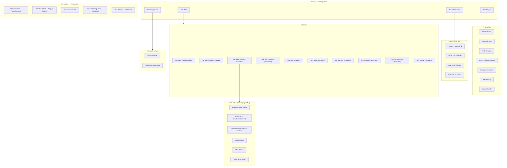
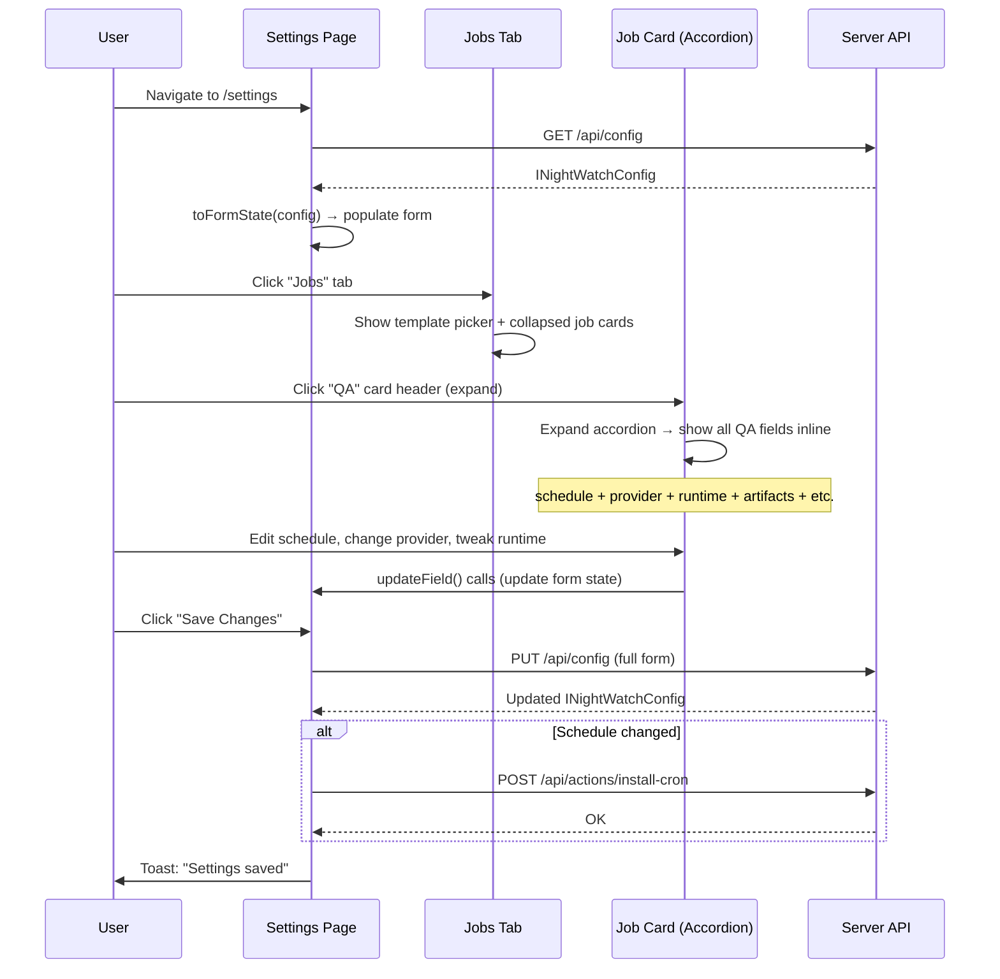

# PRD: Settings & Schedules UX Redesign

**Complexity: 8 → HIGH mode**

Score breakdown: +3 (10+ files) +2 (complex state logic / form refactoring) +2 (multi-package UI restructuring) +1 (existing cross-page navigation logic)

---

## 1. Context

**Problem:** The Settings page (7 tabs) and Scheduling page scatter job configuration across 3+ locations, forcing users to jump between the Jobs, Schedules, and AI Runtime tabs to fully configure a single job. The "Managed in Schedules" notices, duplicate content, and orphan Advanced tab create cognitive overload.

**Files Analyzed:**

- `web/pages/Settings.tsx` (917 lines — monolith orchestrating all form state)
- `web/pages/settings/GeneralTab.tsx`
- `web/pages/settings/AiRuntimeTab.tsx`
- `web/pages/settings/JobsTab.tsx`
- `web/pages/settings/SchedulesTab.tsx`
- `web/pages/settings/IntegrationsTab.tsx`
- `web/pages/settings/AdvancedTab.tsx`
- `web/pages/Scheduling.tsx`
- `web/components/scheduling/ScheduleConfig.tsx`
- `web/components/scheduling/ScheduleTimeline.tsx`
- `web/components/Sidebar.tsx`
- `web/App.tsx`
- `web/api.ts`
- `web/store/useStore.ts`
- `docs/PRDs/ux-revamp.md` (existing UX revamp — covers Dashboard/Logs/CommandPalette, not Settings)

**Current Behavior:**

- Settings page has **7 tabs**: General, AI & Runtime, Jobs, Schedules, Notifications, Integrations, Advanced
- Configuring a single job (e.g., QA) requires visiting 3 tabs: Jobs (enable + runtime + artifacts), Schedules (cron expression), AI Runtime (provider assignment + retries)
- Jobs tab shows confusing `ScheduleOwnerNotice` banners saying "Managed in Schedules" with a button that navigates to the Schedules tab
- Advanced tab contains only 3 orphan fields (templates dir, max retries, PRD priority) that belong elsewhere
- Notifications and Integrations are separate tabs with minimal content each
- Scheduling page duplicates the ScheduleTimeline component and has its own schedule-related controls
- No unsaved-changes indicator — users can navigate away and lose edits silently

---

## 2. Solution

**Approach:**

- Collapse 7 Settings tabs → **4 focused tabs**: Project, AI Providers, Jobs, Integrations
- Merge **all per-job settings into expandable accordion cards** in the Jobs tab — each card contains: enable toggle, schedule (cron input), provider assignment, runtime, retries, and job-specific fields
- Keep the **Schedule Template** quick-setup as a section at the top of Jobs tab (apply a template → all job schedules update at once)
- Absorb Advanced fields: templates dir + PRD priority → Project tab; max retries → per-job
- Merge Notifications into Integrations tab
- Flatten the Scheduling page into a **scrollable operational view** (no tabs): status grid, timeline, queue management, run history
- Add an unsaved-changes indicator to the Settings page sticky footer

**Architecture Diagram:**



**Key Decisions:**

- [x] Accordion pattern for job cards — collapsed shows name + toggle + schedule summary; expanded shows all settings
- [x] Schedule templates stay as a top-level section in Jobs tab (not per-job) because they set schedules for ALL jobs at once
- [x] Provider assignment moves FROM AI Runtime tab INTO each job card — the AI Providers tab only manages preset definitions, not assignments
- [x] Reviewer-specific retries (maxRetries, retryDelay, maxPrsPerRun) move INTO the PR Reviewer job card
- [x] Min review score moves into PR Reviewer and Merger cards (the two jobs that use it)
- [x] Max log size moves into general Performance section within Project tab
- [x] No new API endpoints needed — all changes are frontend restructuring of the same ConfigForm fields
- [x] Existing `handleEditJob()` navigation logic in Settings.tsx simplifies: instead of cross-tab scrolling, just expand the target accordion card

**Data Changes:** None — same `INightWatchConfig` shape, same API endpoints.

---

## 3. New Information Architecture

### Settings Page: 7 tabs → 4 tabs

```
BEFORE (7 tabs):                          AFTER (4 tabs):
┌─────────────────────────────────┐       ┌──────────────────────────────────────┐
│ General                         │       │ Project                              │
│  · Project name, branch, PRD    │  ──→  │  · Project name, branch, PRD dir     │
│  · Branch prefix/patterns       │       │  · Branch prefix/patterns            │
│  · Executor/Reviewer toggles    │       │  · Templates dir (from Advanced)     │
│  · System Health                │       │  · PRD priority (from Advanced)      │
├─────────────────────────────────┤       │  · Max log size (from AI Runtime)    │
│ AI & Runtime                    │       │  · System Health                     │
│  · Provider presets             │       ├──────────────────────────────────────┤
│  · Job assignments (8 dropdowns)│       │ AI Providers                         │
│  · Fallback presets             │       │  · Provider presets grid             │
│  · Schedule overrides           │       │  · Global env variables              │
│  · Env variables                │       │  · Fallback preset config            │
│  · Performance (runtimes, etc.) │       │  · Schedule overrides                │
│  · Retry settings               │       ├──────────────────────────────────────┤
├─────────────────────────────────┤       │ Jobs                                 │
│ Jobs                            │       │  · Schedule Template quick-setup     │
│  · QA card                      │       │  · Timeline preview                  │
│  · Audit card                   │  ──→  │  · Scheduling Priority + Delay       │
│  · Analytics card               │       │  ┌──────────────────────────────────┐│
│  · Planner card                 │       │  │ ▸ PRD Executor                  ││
│  · PR Resolver card             │       │  │   toggle | schedule | provider  ││
│  · Merger card                  │       │  │   runtime | branch patterns     ││
├─────────────────────────────────┤       │  ├──────────────────────────────────┤│
│ Schedules                       │       │  │ ▸ PR Reviewer                   ││
│  · Template / Custom mode       │       │  │   toggle | schedule | provider  ││
│  · 8 cron inputs                │  ──→  │  │   runtime | retries | min score ││
│  · Priority + delay             │       │  │   max PRs per run               ││
│  · Timeline                     │       │  ├──────────────────────────────────┤│
├─────────────────────────────────┤       │  │ ▸ QA                            ││
│ Notifications                   │       │  │   toggle | schedule | provider  ││
│  · Webhook editor               │  ──→  │  │   runtime | artifacts | etc.   ││
├─────────────────────────────────┤       │  ├──────────────────────────────────┤│
│ Integrations                    │       │  │ ▸ Audit                         ││
│  · Board provider               │       │  │ ▸ Planner                       ││
├─────────────────────────────────┤       │  │ ▸ Analytics                     ││
│ Advanced                        │       │  │ ▸ PR Resolver                   ││
│  · Templates dir                │  ──→  │  │ ▸ Merger                        ││
│  · Max retries                  │       │  └──────────────────────────────────┘│
│  · PRD priority                 │       ├──────────────────────────────────────┤
└─────────────────────────────────┘       │ Integrations                         │
                                          │  · Board provider config             │
                                          │  · Notification webhooks             │
                                          └──────────────────────────────────────┘
```

### Field Migration Map

| Field                             | FROM                              | TO                                                             |
| --------------------------------- | --------------------------------- | -------------------------------------------------------------- |
| Templates Directory               | Advanced tab                      | Project tab                                                    |
| PRD Priority                      | Advanced tab                      | Project tab                                                    |
| Max Retries (global)              | Advanced tab                      | Per-job (default value for jobs without explicit retry config) |
| Job Assignments (8 dropdowns)     | AI Runtime → Job Assignments card | Per-job accordion → Provider select                            |
| Min Review Score                  | AI Runtime → Performance card     | PR Reviewer card + Merger card                                 |
| Max Runtime (executor)            | AI Runtime → Performance card     | PRD Executor job card                                          |
| Max Runtime (reviewer)            | AI Runtime → Performance card     | PR Reviewer job card                                           |
| Max Log Size                      | AI Runtime → Performance card     | Project tab                                                    |
| Reviewer Max Retries              | AI Runtime → Retry Settings card  | PR Reviewer job card                                           |
| Reviewer Retry Delay              | AI Runtime → Retry Settings card  | PR Reviewer job card                                           |
| Reviewer Max PRs Per Run          | AI Runtime → Retry Settings card  | PR Reviewer job card                                           |
| Executor/Reviewer Enabled toggles | General tab                       | PRD Executor / PR Reviewer job cards                           |
| Schedule cron expressions         | Schedules tab (8 inputs)          | Per-job accordion → Schedule field                             |
| Schedule template picker          | Schedules tab                     | Jobs tab → top section                                         |
| Scheduling Priority               | Schedules tab                     | Jobs tab → top section                                         |
| Extra Start Delay                 | Schedules tab                     | Jobs tab → top section                                         |
| Global Queue toggle               | Schedules tab                     | Jobs tab → top section                                         |
| Notification Webhooks             | Notifications tab (standalone)    | Integrations tab                                               |

### Job Card Contents (per job)

| Job              | Shared Fields                       | Job-Specific Fields                                                               |
| ---------------- | ----------------------------------- | --------------------------------------------------------------------------------- |
| **PRD Executor** | enable, schedule, provider, runtime | branch patterns                                                                   |
| **PR Reviewer**  | enable, schedule, provider, runtime | max retries, retry delay, max PRs/run, min review score                           |
| **QA**           | enable, schedule, provider, runtime | artifacts, skip label, branch patterns, auto-install playwright                   |
| **Code Audit**   | enable, schedule, provider, runtime | skip label, branch patterns                                                       |
| **Planner**      | enable, schedule, provider, runtime | roadmap path, priority mode, issue column                                         |
| **Analytics**    | enable, schedule, provider, runtime | amplitude API key/secret, lookback days, target column, analysis prompt           |
| **PR Resolver**  | enable, schedule, provider, runtime | per-PR timeout, max PRs, ready label, branch patterns, AI conflict/review toggles |
| **Merger**       | enable, schedule, provider, runtime | merge method, min review score, max PRs, branch patterns, rebase toggle           |

### Scheduling Page: tabs → flat scroll

```
BEFORE (3 tabs):                     AFTER (flat scrollable):
┌────────────────────────┐           ┌──────────────────────────────────────┐
│ Overview               │           │ Section A: Global Controls           │
│  · Job status cards    │  ──→      │  [Active/Paused] [Pause/Resume btn] │
│  · Trigger buttons     │           │                                      │
├────────────────────────┤           │ Section B: Job Status Grid (2-col)   │
│ Parallelism            │           │  icon + name + status + next run     │
│  · Queue mode          │  ──→      │  + [Trigger] button per job          │
│  · Max concurrency     │           │                                      │
│  · Provider buckets    │           │ Section C: Schedule Timeline          │
├────────────────────────┤           │  24-hour visualization                │
│ History                │           │                                      │
│  · Analytics charts    │  ──→      │ Section D: Queue ▸ (collapsible)     │
│  · Provider lanes      │           │  mode, concurrency, provider buckets │
└────────────────────────┘           │                                      │
                                     │ Section E: History ▸ (collapsible)   │
                                     │  recent runs chart, analytics        │
                                     └──────────────────────────────────────┘
```

---

## 4. Sequence Flow



---

## 5. Execution Phases

### Phase 1: Create Job Accordion Component + Refactor Jobs Tab

**User-visible outcome:** Jobs tab shows expandable accordion cards. Each card's header displays: job icon, name, enabled toggle, human-readable schedule summary, and provider badge. Expanding a card reveals all settings for that job in one place.

**Files (max 5):**

- `web/components/settings/JobAccordion.tsx` — **new** — reusable accordion card for a single job
- `web/pages/settings/JobsTab.tsx` — rewrite to use `JobAccordion` for each job; inline schedule + provider fields
- `web/pages/Settings.tsx` — pass provider preset options + schedule fields to JobsTab

**Implementation:**

- [ ] Create `JobAccordion.tsx`: collapsible card component
  - Props: `title`, `icon`, `description`, `enabled` (toggle), `expanded`, `onToggle`, `onExpandChange`, `scheduleSummary` (human-readable), `providerLabel`, `children` (expanded content)
  - Collapsed state: single row with icon + title + enabled switch + schedule badge + provider badge + chevron
  - Expanded state: reveals `children` below header with smooth transition (`max-height` + `overflow-hidden`)
  - Only one card expanded at a time (optional, controlled by parent)
- [ ] Rewrite `JobsTab.tsx` to render 8 `JobAccordion` cards
  - Remove `ScheduleOwnerNotice` component entirely
  - Each card's expanded content includes:
    - `CronScheduleInput` for schedule (moved from Schedules tab)
    - Provider assignment `Select` (moved from AI Runtime tab)
    - Runtime `Input`
    - Job-specific fields (same as current)
  - Add new props to receive: `presetOptions` (for provider dropdowns), `jobProviders` (current assignments)
- [ ] Update `Settings.tsx`: pass preset options and job provider data to `JobsTab`

**Tests Required:**
| Test File | Test Name | Assertion |
|-----------|-----------|-----------|
| `web/src/__tests__/JobAccordion.test.tsx` | `renders collapsed with schedule summary` | Schedule badge text visible, children hidden |
| `web/src/__tests__/JobAccordion.test.tsx` | `expands on header click` | Children become visible |
| `web/src/__tests__/JobAccordion.test.tsx` | `toggle fires onExpandChange` | Callback called with true/false |
| `web/src/__tests__/JobsTab.test.tsx` | `renders 8 job accordion cards` | 8 card headers visible |
| `web/src/__tests__/JobsTab.test.tsx` | `expanding QA shows schedule input and provider select` | CronScheduleInput + Select rendered inside QA card |

**Verification Plan:**

1. **Unit Tests:**
   - `JobAccordion` expand/collapse behavior
   - `JobsTab` renders all 8 jobs with inline schedule + provider

2. **Manual Verification:**
   - Open `/settings` → Jobs tab
   - See 8 collapsed cards, each showing name + toggle + schedule text + provider name
   - Click QA → card expands → schedule cron input + provider dropdown + runtime + artifacts all visible
   - Edit QA schedule → Save → schedule persists

**Checkpoint:** Automated (`prd-work-reviewer`) + Manual (visual accordion behavior)

---

### Phase 2: Consolidate Schedule Template + Global Settings into Jobs Tab Top Section

**User-visible outcome:** The top of the Jobs tab shows the Schedule Template picker, scheduling priority, start delay, and queue toggle. The separate Schedules tab is removed. Timeline preview appears above the job cards.

**Files (max 5):**

- `web/pages/settings/JobsTab.tsx` — add template picker section at top + timeline
- `web/pages/settings/SchedulesTab.tsx` — **delete** (content absorbed into Jobs tab)
- `web/pages/Settings.tsx` — remove Schedules tab from tabs array; pass template props to JobsTab

**Implementation:**

- [ ] Add a "Schedule Presets" section at the top of `JobsTab`:
  - Schedule template grid (reuse template UI from `ScheduleConfig.tsx`)
  - "Custom" toggle to switch between template and per-job editing
  - When template is applied: all job cards update their schedule badges
  - Scheduling Priority (1-5 select)
  - Extra Start Delay (0-59 minutes input)
  - Global Queue toggle
- [ ] Add `ScheduleTimeline` component between the template section and job cards
  - Shows the 24h preview of all job schedules
  - Clicking a job on the timeline expands that job's accordion card
- [ ] Delete `SchedulesTab.tsx`
- [ ] Update `Settings.tsx`:
  - Remove `schedules` tab from the `tabs` array
  - Pass schedule-related state (mode, template, callbacks) to `JobsTab`
  - Update URL parameter handling (redirect `?tab=schedules` → `?tab=jobs`)

**Tests Required:**
| Test File | Test Name | Assertion |
|-----------|-----------|-----------|
| `web/src/__tests__/JobsTab.test.tsx` | `renders schedule template picker at top` | Template buttons visible |
| `web/src/__tests__/JobsTab.test.tsx` | `applying template updates all job schedule summaries` | All 8 cards show updated schedule text |
| `web/src/__tests__/JobsTab.test.tsx` | `renders ScheduleTimeline above job cards` | Timeline component rendered |
| `web/src/__tests__/Settings.test.tsx` | `does not render Schedules tab` | No "Schedules" tab label in UI |

**Verification Plan:**

1. **Unit Tests:** Template application propagates to all job cards
2. **Manual Verification:**
   - Open `/settings` → Jobs tab
   - See template picker at top → click "Night Surge" → all job schedule badges update
   - Timeline shows updated schedule blocks
   - No "Schedules" tab exists

**Checkpoint:** Automated (`prd-work-reviewer`) + Manual (template → job card propagation)

---

### Phase 3: Refactor Project Tab + Absorb Advanced Tab

**User-visible outcome:** Project tab contains general settings plus fields from the deleted Advanced tab. AI Runtime tab is renamed to "AI Providers" with performance/retry fields removed (now per-job). Advanced tab is removed.

**Files (max 5):**

- `web/pages/settings/GeneralTab.tsx` — rename to `ProjectTab.tsx`; add templates dir, PRD priority, max log size
- `web/pages/settings/AiRuntimeTab.tsx` — rename to `AiProvidersTab.tsx`; remove Job Assignments, Performance, Retry Settings cards
- `web/pages/settings/AdvancedTab.tsx` — **delete**
- `web/pages/Settings.tsx` — update tab array: rename tabs, remove Advanced tab, update imports

**Implementation:**

- [ ] `GeneralTab.tsx` → rename file to `ProjectTab.tsx`, update component name
  - Add "Templates & Priority" section (below System Health):
    - Templates Directory input (from Advanced)
    - PRD Priority TagInput (from Advanced)
  - Add Max Log Size input (from AI Runtime Performance card)
  - Remove executor/reviewer enabled toggles (moved to job cards in Phase 1)
- [ ] `AiRuntimeTab.tsx` → rename file to `AiProvidersTab.tsx`, update component name
  - **Remove** "Job Assignments" card (provider assignment is now per-job in accordion)
  - **Remove** "Performance" card (min review score → per-job, max runtimes → per-job, max log size → Project tab)
  - **Remove** "Retry Settings" card (reviewer retries → PR Reviewer job card)
  - Keep: Provider Presets grid, Global Env Variables, Fallback Presets, Schedule Overrides
- [ ] Delete `AdvancedTab.tsx`
- [ ] Update `Settings.tsx`:
  - Rename "General" → "Project", "AI & Runtime" → "AI Providers"
  - Remove "Advanced" tab from array
  - Update imports to new file names
  - Update URL parameter migration map (`?tab=general` → `?tab=project`, etc.)

**Tests Required:**
| Test File | Test Name | Assertion |
|-----------|-----------|-----------|
| `web/src/__tests__/Settings.test.tsx` | `renders 4 tabs: Project, AI Providers, Jobs, Integrations` | Exactly 4 tab labels |
| `web/src/__tests__/ProjectTab.test.tsx` | `renders templates dir and PRD priority fields` | Both inputs present |
| `web/src/__tests__/AiProvidersTab.test.tsx` | `does not render Job Assignments section` | No job assignment dropdowns |
| `web/src/__tests__/AiProvidersTab.test.tsx` | `does not render Performance or Retry sections` | No runtime/retry inputs |

**Verification Plan:**

1. **Unit Tests:** Tab count = 4; absorbed fields present in new locations; removed sections gone
2. **Manual Verification:**
   - Open `/settings` → see exactly 4 tabs
   - Project tab has templates dir + PRD priority at bottom
   - AI Providers tab has presets + env vars + fallback + overrides only (no runtimes/retries)

**Checkpoint:** Automated (`prd-work-reviewer`) + Manual (tab count + field locations)

---

### Phase 4: Merge Notifications into Integrations Tab

**User-visible outcome:** Integrations tab contains both Board Provider and Notification Webhooks. The standalone Notifications tab is removed.

**Files (max 3):**

- `web/pages/settings/IntegrationsTab.tsx` — add webhook editor section
- `web/pages/Settings.tsx` — remove Notifications tab from array; pass webhook props to IntegrationsTab

**Implementation:**

- [ ] Add a "Notification Webhooks" section to `IntegrationsTab.tsx`:
  - Render `WebhookEditor` component below the Board Provider section
  - Add a visual separator (border-t) between sections
  - Pass `notifications`, `onChange`, `globalWebhook`, `onSetGlobal`, `onUnsetGlobal` props
- [ ] Update `Settings.tsx`:
  - Remove the `notifications` tab from the tabs array
  - Pass notification-related props to `IntegrationsTab`
  - Update URL migration: `?tab=notifications` → `?tab=integrations`

**Tests Required:**
| Test File | Test Name | Assertion |
|-----------|-----------|-----------|
| `web/src/__tests__/IntegrationsTab.test.tsx` | `renders board provider and webhook editor` | Both sections visible |
| `web/src/__tests__/Settings.test.tsx` | `no standalone Notifications tab` | "Notifications" not in tab labels |

**Verification Plan:**

1. **Unit Tests:** IntegrationsTab renders both sections
2. **Manual Verification:**
   - Open `/settings` → Integrations tab
   - Board Provider section at top, Notification Webhooks below

**Checkpoint:** Automated (`prd-work-reviewer`)

---

### Phase 5: Flatten Scheduling Page (Operational View)

**User-visible outcome:** Scheduling page has no tabs — instead shows a flat scrollable layout: global controls, job status grid with triggers, timeline, collapsible queue management, and collapsible run history.

**Files (max 4):**

- `web/pages/Scheduling.tsx` — rewrite from tabbed to flat scrollable sections
- `web/components/Sidebar.tsx` — verify nav label is "Schedules" → rename to "Operations" or keep as-is

**Implementation:**

- [ ] Rewrite `Scheduling.tsx` as flat scrollable page:
  - **Section A: Global Controls** — automation active/paused status + pause/resume button + schedule bundle name
  - **Section B: Job Status Grid** — 2-column grid of job cards, each showing: icon, name, status badge (idle/running/error), next run countdown, [Trigger] button. Link "Configure" to `/settings?tab=jobs&jobType=<job>`
  - **Section C: Schedule Timeline** — `ScheduleTimeline` component (full-width)
  - **Section D: Queue Management** — collapsible (default collapsed), contains: queue enabled toggle, queue mode select, max concurrency input, provider buckets editor
  - **Section E: Run History** — collapsible (default collapsed), contains: `RecentRunsChart`, `ProviderLanesChart`, `ProviderBucketSummary`
- [ ] Remove `activeTab` state, `Tabs` import, and all tab-switching logic
- [ ] Add `expandedQueue` and `expandedHistory` local state (both default `false`)
- [ ] Each collapsible section: clickable header with chevron icon, smooth expand/collapse transition
- [ ] Job status cards: add a small "Configure" link that navigates to `/settings?tab=jobs&jobType=<job>` for easy access to full config

**Tests Required:**
| Test File | Test Name | Assertion |
|-----------|-----------|-----------|
| `web/src/__tests__/Scheduling.test.tsx` | `renders all job status cards without tabs` | 8 job cards visible, no Tabs component |
| `web/src/__tests__/Scheduling.test.tsx` | `queue section collapsed by default` | Queue content not visible initially |
| `web/src/__tests__/Scheduling.test.tsx` | `expanding queue section shows controls` | Queue mode select visible after expand click |
| `web/src/__tests__/Scheduling.test.tsx` | `configure link navigates to settings jobs tab` | Link href includes `/settings?tab=jobs` |

**Verification Plan:**

1. **Unit Tests:** No tabs rendered; collapsible sections work; navigation links correct
2. **Manual Verification:**
   - Open `/scheduling` — no tabs, just scrollable sections
   - Job cards show status + next run + trigger button
   - Click "Configure" on QA card → navigates to Settings > Jobs with QA expanded
   - Queue and History are collapsed by default, expand on click

**Checkpoint:** Automated (`prd-work-reviewer`) + Manual (flat layout + navigation)

---

### Phase 6: Unsaved Changes Indicator + Polish

**User-visible outcome:** Settings page shows a sticky banner when form state differs from saved config. Accordion cards animate smoothly. URL deep-linking works for all new tab/job combinations.

**Files (max 5):**

- `web/pages/Settings.tsx` — add dirty state detection + sticky unsaved banner
- `web/components/settings/JobAccordion.tsx` — polish: smooth animation, keyboard accessibility
- `web/pages/settings/JobsTab.tsx` — deep-link support: auto-expand job from URL `?jobType=qa`

**Implementation:**

- [ ] **Unsaved changes detection** in `Settings.tsx`:
  - Compare current `form` state with last-saved config using shallow comparison
  - When dirty: show a sticky banner above the Save/Reset buttons: "You have unsaved changes" with Save + Discard buttons
  - When navigating away (sidebar click), show browser `beforeunload` confirmation
- [ ] **Accordion animation polish:**
  - Use `grid-rows` transition trick: `grid-template-rows: 0fr` → `1fr` for smooth height animation
  - Add `aria-expanded` attribute for accessibility
  - Keyboard: Enter/Space to toggle expansion
- [ ] **URL deep-linking for Jobs tab:**
  - Support `?tab=jobs&jobType=qa` → auto-expand QA accordion on mount
  - Support `?tab=jobs&mode=custom` → switch to custom schedule mode
  - Backward-compat: `?tab=schedules&jobType=qa` → redirect to `?tab=jobs&jobType=qa`

**Tests Required:**
| Test File | Test Name | Assertion |
|-----------|-----------|-----------|
| `web/src/__tests__/Settings.test.tsx` | `shows unsaved banner when form is dirty` | Banner visible after field change |
| `web/src/__tests__/Settings.test.tsx` | `hides unsaved banner after save` | Banner hidden after save completes |
| `web/src/__tests__/JobsTab.test.tsx` | `auto-expands job from URL jobType param` | QA accordion expanded when URL has `?jobType=qa` |
| `web/src/__tests__/JobAccordion.test.tsx` | `keyboard toggle with Enter key` | Expansion toggles on Enter keydown |

**Verification Plan:**

1. **Unit Tests:** Dirty detection, deep-linking, keyboard accessibility
2. **Manual Verification:**
   - Edit a field → see "unsaved changes" banner appear
   - Save → banner disappears
   - Navigate to `/settings?tab=jobs&jobType=qa` → QA card auto-expanded
   - Use keyboard (Tab + Enter) to expand/collapse cards

**Checkpoint:** Automated (`prd-work-reviewer`) + Manual (visual animation + keyboard)

---

## 6. Integration Points

```markdown
**How will this feature be reached?**

- [x] Entry point identified: `/settings` route (existing), `/scheduling` route (existing)
- [x] Caller file identified: `web/App.tsx` routes, `web/components/Sidebar.tsx` navigation
- [x] Registration/wiring needed: No new routes; tab IDs change in Settings page; URL param migration

**Is this user-facing?**

- [x] YES → All changes are visual UI restructuring

**Full user flow:**

1. User clicks "Settings" in sidebar → lands on `/settings` with 4 tabs
2. User clicks "Jobs" tab → sees template picker + timeline + 8 accordion cards
3. User expands a job card → sees ALL config (schedule, provider, runtime, etc.) in one place
4. User edits fields → "unsaved changes" banner appears → clicks Save
5. User clicks "Schedules" in sidebar → sees operational view (status, triggers, timeline)
6. User clicks "Configure" on a job card → navigates to Settings > Jobs with that job expanded
```

---

## 7. Verification Strategy

### Per-Phase Verification

Each phase: `yarn verify` + phase-specific unit tests + `prd-work-reviewer` checkpoint.

```bash
cd /home/joao/projects/night-watch-cli
yarn verify
yarn workspace night-watch-web test --run
```

### End-to-End Verification (after all phases)

| Scenario                             | Steps                                                                   | Expected                                              |
| ------------------------------------ | ----------------------------------------------------------------------- | ----------------------------------------------------- |
| Configure a job fully                | Settings → Jobs → expand QA → edit schedule + provider + runtime → Save | All QA settings saved, cron reinstalled               |
| Apply schedule template              | Settings → Jobs → click "Night Surge" template → Save                   | All 8 job schedules updated to Night Surge values     |
| Navigate from Scheduling to Settings | Scheduling → click "Configure" on QA job card                           | Settings opens with Jobs tab active, QA card expanded |
| Unsaved changes warning              | Edit field → click sidebar link                                         | "Unsaved changes" browser prompt                      |
| URL deep-link                        | Navigate to `/settings?tab=jobs&jobType=analytics`                      | Jobs tab active, Analytics card expanded              |
| Backward compat URL                  | Navigate to `/settings?tab=schedules`                                   | Redirects to Jobs tab                                 |

---

## 8. Acceptance Criteria

- [ ] Settings page has exactly **4 tabs**: Project, AI Providers, Jobs, Integrations
- [ ] Each job has a **single expandable card** containing ALL its settings (enable, schedule, provider, runtime, retries, job-specific fields)
- [ ] **Schedule Template** picker is at the top of Jobs tab and applies to all jobs
- [ ] **No "Managed in Schedules"** notices or cross-tab redirect buttons exist
- [ ] **ScheduleTimeline** appears in Jobs tab (config view) and Scheduling page (operational view)
- [ ] Scheduling page has **no tabs** — flat scrollable with collapsible advanced sections
- [ ] Scheduling page job cards have "Configure" links that navigate to correct Settings job card
- [ ] **Unsaved changes** banner appears when form is dirty, disappears after save
- [ ] URL deep-linking works: `?tab=jobs&jobType=qa` expands QA card
- [ ] Backward-compat: old tab URLs (`?tab=schedules`, `?tab=general`, `?tab=advanced`) redirect correctly
- [ ] `yarn verify` passes after each phase
- [ ] All specified tests pass
- [ ] No regressions: save, cron reinstall, template application, job toggle, SSE streaming all still work

---

## 9. Relationship to Existing PRDs

This PRD **complements** `docs/PRDs/ux-revamp.md`:

| ux-revamp.md                               | This PRD                                                         |
| ------------------------------------------ | ---------------------------------------------------------------- |
| Dashboard cleanup (done)                   | Settings 7→4 tab consolidation                                   |
| Scheduling page flatten (Phase 2, pending) | Scheduling page flatten (Phase 5 — supersedes ux-revamp Phase 2) |
| Command Palette (Phase 5, pending)         | Not covered (orthogonal)                                         |
| Activity Center (Phase 6, pending)         | Not covered (orthogonal)                                         |
| Log filters (Phase 7, pending)             | Not covered (orthogonal)                                         |

**Phase 5 of this PRD supersedes Phase 2 of ux-revamp.md** — both flatten the Scheduling page, but this PRD also adds the "Configure" navigation links and aligns with the new Settings structure. Mark ux-revamp Phase 2 as superseded once Phase 5 here is complete.
